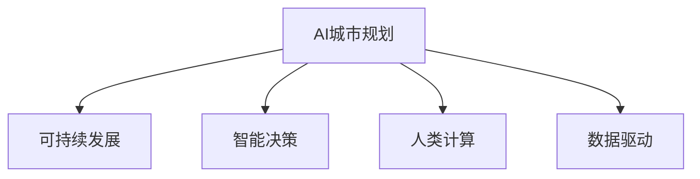

                 

# AI与人类计算：打造可持续发展的城市规划与设计

> 关键词：AI城市规划, 可持续发展, 人类计算, 智能决策, 数据驱动

## 1. 背景介绍

### 1.1 问题由来

随着全球人口增长和城市化进程的加快，如何构建更加智能、高效、可持续发展的城市，成为当下最紧迫的社会议题之一。面对城市交通拥堵、资源浪费、环境污染等重大挑战，传统的人力规划方法已难以应对复杂局面。人工智能(AI)技术的迅猛发展，为城市规划带来了新的思路和解决方案。AI与人类计算相结合，能够更科学、高效地指导城市规划与设计，推动城市向着智能化、绿色化、人本化的方向发展。

### 1.2 问题核心关键点

AI在城市规划中的应用，主要聚焦于智能决策和数据分析两个方面。通过AI，城市规划师能够更准确地预测城市发展趋势，优化城市资源配置，提升市民生活品质，实现可持续发展的目标。

关键在于：
- 数据驱动的城市规划：通过大数据分析，获得城市发展的全面、深入洞察。
- 智能辅助决策：利用AI模型，提供高效的规划方案和策略建议。
- 实时反馈和调整：AI系统能够实时监测城市运行状态，及时调整规划方案。

## 2. 核心概念与联系

### 2.1 核心概念概述

为了更好地理解AI在城市规划中的应用，我们先梳理几个核心概念：

- **AI城市规划**：利用人工智能技术，辅助城市规划师进行数据分析、趋势预测、方案设计、动态调整等。
- **可持续发展**：在城市规划中融入环境保护、资源节约、社会公平等理念，推动城市与自然和谐共生。
- **人类计算**：指通过人类与计算机的协同工作，实现更高效、更精确的计算与决策过程。
- **智能决策**：基于AI算法，自动化地分析数据，提出决策建议，辅助人类决策。
- **数据驱动**：依赖大规模数据集，通过数据挖掘、机器学习等技术，提炼出对城市规划有价值的知识。

这些概念通过以下Mermaid流程图展示了相互联系：



### 2.2 核心概念原理和架构

AI城市规划的核心在于利用大数据和深度学习技术，构建智能决策支持系统。该系统的核心架构包括：

1. **数据收集与预处理**：
   - 通过传感器、遥感、问卷调查等方式，收集城市交通、环境、人口、资源等各类数据。
   - 对数据进行清洗、去重、标注等预处理，确保数据质量。

2. **数据建模与分析**：
   - 利用机器学习、深度学习等技术，构建多层次、多维度的数据模型。
   - 通过模型训练和预测，挖掘数据中的潜藏规律，如交通流预测、能源消耗预测、污染水平预测等。

3. **智能决策支持**：
   - 基于模型预测结果，结合专家知识，构建多目标优化模型，如城市交通优化、能源分配优化等。
   - 利用强化学习等方法，优化决策策略，最大化城市可持续发展的目标函数。

4. **实时监测与反馈**：
   - 部署实时数据监测系统，如交通摄像头、空气质量监测器等，实时收集城市运行状态数据。
   - 通过AI系统对监测数据进行分析和处理，及时调整城市规划方案，确保可持续发展目标的实现。

### 2.3 AI城市规划的关键技术

AI城市规划的关键技术主要包括：

- **大数据处理**：通过分布式存储和计算，处理海量城市数据。
- **深度学习模型**：利用卷积神经网络(CNN)、循环神经网络(RNN)、变分自编码器(VAE)等深度学习模型，进行复杂的预测与分析。
- **强化学习**：通过奖励机制，优化城市规划中的决策策略。
- **知识图谱**：构建城市数据的知识图谱，进行更高效的查询和推理。
- **自然语言处理**：通过NLP技术，处理城市规划中的文本数据，如规划报告、公共意见等。

## 3. 核心算法原理 & 具体操作步骤

### 3.1 算法原理概述

AI城市规划的核心算法原理可以总结如下：

1. **数据融合与预处理**：将城市各类数据进行融合，预处理为适合模型输入的格式。
2. **多模态学习**：结合不同模态的数据（如图像、文本、时间序列等），构建多模态学习模型。
3. **强化学习**：通过模拟城市运行环境，训练AI模型，优化决策策略。
4. **数据驱动的优化**：利用优化算法，如遗传算法、粒子群算法等，优化城市规划方案。
5. **实时监控与反馈**：通过实时数据监测系统，不断调整和优化城市规划方案。

### 3.2 算法步骤详解

AI城市规划的具体操作步骤如下：

1. **数据收集与预处理**：
   - 通过各种传感器、遥感设备等收集城市运行数据，如交通流量、空气质量、温度湿度等。
   - 对数据进行清洗、去重、归一化等预处理，确保数据质量。

2. **多模态数据建模**：
   - 将不同模态的数据（如图像、文本、时间序列）进行融合，构建统一的数据模型。
   - 利用深度学习模型，如图卷积网络(Convolutional Networks)、循环神经网络(RNNs)等，对数据进行建模与分析。

3. **智能决策支持**：
   - 利用强化学习算法，如Q-learning、策略梯度等，训练决策模型。
   - 通过多目标优化算法，如遗传算法、粒子群算法等，优化城市规划方案。

4. **实时监控与反馈**：
   - 部署实时数据监测系统，收集城市运行状态数据。
   - 利用AI系统对监测数据进行分析和处理，及时调整城市规划方案。

### 3.3 算法优缺点

AI城市规划的优点在于：
- 提高城市规划的准确性和效率。
- 支持动态调整，及时应对城市发展变化。
- 融合多模态数据，提供更全面的城市分析视角。

缺点在于：
- 对数据质量和数量要求高，数据收集成本大。
- 算法复杂，需要大量计算资源。
- 模型解释性不足，难以理解其决策过程。

### 3.4 算法应用领域

AI城市规划在多个领域都有广泛应用：

1. **智慧交通**：通过交通流量预测和优化，缓解城市交通压力。
2. **环境监测**：利用传感器网络监测环境质量，实时调整污染治理措施。
3. **能源管理**：优化能源分配，提高能源利用效率。
4. **公共安全**：通过视频监控和分析，提高城市公共安全水平。
5. **公共服务**：利用NLP技术，处理市民反馈，优化公共服务设施。
6. **城市治理**：通过智能决策系统，提高城市治理效率，提升市民生活质量。

## 4. 数学模型和公式 & 详细讲解

### 4.1 数学模型构建

AI城市规划的数学模型可以概括为以下几类：

1. **多目标优化模型**：
   - 设城市规划目标为$f(x)$，其中$x$为决策变量，包括交通规划、能源分配、环境治理等。
   - 目标函数为$min\ f(x)$，最小化总体损失。
   - 约束条件为$g(x) \leq 0$，如交通流量约束、能源供应约束、环境容量约束等。

2. **强化学习模型**：
   - 设状态空间为$S$，决策空间为$A$，奖励函数为$R(s,a)$。
   - 利用Q-learning等算法，训练AI模型，最大化长期累积奖励。
   - 状态转移概率为$P(s'|s,a)$，描述环境变化规律。

### 4.2 公式推导过程

以多目标优化模型为例，进行公式推导：

- **目标函数**：
  $$
  f(x) = w_1 f_1(x) + w_2 f_2(x) + \dots + w_n f_n(x)
  $$
  其中，$w_i$为权重系数，$f_i(x)$为第$i$个目标函数。

- **约束条件**：
  $$
  g_i(x) \leq 0, i=1,2,\dots,m
  $$
  其中，$g_i(x)$为第$i$个约束条件。

- **拉格朗日乘数法**：
  $$
  L(x,\lambda) = f(x) + \sum_{i=1}^m \lambda_i g_i(x)
  $$
  其中，$\lambda_i$为拉格朗日乘数。

- **KKT条件**：
  $$
  \frac{\partial L(x,\lambda)}{\partial x} = 0, \quad \frac{\partial L(x,\lambda)}{\partial \lambda} \geq 0, \quad \lambda_i \geq 0, \quad g_i(x) = 0, \quad i=1,2,\dots,m
  $$

通过求解上述优化问题，可以得到最优决策变量$x^*$。

### 4.3 案例分析与讲解

以智慧交通为例，分析AI规划的实际应用：

- **数据输入**：交通流量、车速、道路条件等数据。
- **目标函数**：最小化交通延误时间、最大化道路利用率。
- **约束条件**：道路容量约束、交叉口信号灯控制约束等。
- **优化结果**：智能信号灯控制、动态车道调整、交通分流等。

通过AI模型，城市交通系统能够实时调整信号灯控制和车道配置，优化交通流量，提升道路利用效率。

## 5. 项目实践：代码实例和详细解释说明

### 5.1 开发环境搭建

开发AI城市规划系统需要以下开发环境：

1. **Python**：作为主要编程语言。
2. **NumPy**：用于科学计算和数据处理。
3. **Pandas**：用于数据处理和分析。
4. **Scikit-learn**：用于机器学习模型的构建和评估。
5. **TensorFlow/Keras**：用于深度学习模型的构建和训练。
6. **OpenCV**：用于图像处理和分析。
7. **MATLAB/Simulink**：用于仿真和测试。

在Python环境下，使用以下命令创建虚拟环境：

```bash
python -m venv env
source env/bin/activate
```

安装上述依赖包：

```bash
pip install numpy pandas scikit-learn tensorflow opencv
```

### 5.2 源代码详细实现

以下是一个简单的智慧交通AI规划系统的代码实现，具体如下：

```python
import numpy as np
import pandas as pd
from sklearn.ensemble import RandomForestRegressor
from tensorflow.keras.models import Sequential
from tensorflow.keras.layers import Dense, LSTM

# 数据预处理
def preprocess_data(data):
    # 去重、归一化等预处理
    return data.dropna().apply(lambda x: x/max(x))

# 多目标优化
class MultiObjectiveOptimization:
    def __init__(self, data, objective_weights):
        self.data = preprocess_data(data)
        self.objective_weights = objective_weights
        self.num_features = self.data.shape[1]
        self.num_objectives = len(self.objective_weights)

    def optimize(self, max_iter=1000):
        x_opt = None
        f_opt = None
        for i in range(max_iter):
            x = np.random.rand(self.num_features)
            f = self.objective_function(x)
            if x_opt is None or np.sum(np.abs(f - f_opt)) > 1e-6:
                x_opt = x
                f_opt = f
        return x_opt, f_opt

    def objective_function(self, x):
        f = np.zeros(self.num_objectives)
        for i in range(self.num_objectives):
            f[i] = self.objective_weights[i] * self.objective_function_i(x)
        return f

    def objective_function_i(self, x):
        # 目标函数计算
        # 以交通流量预测为例
        # 使用随机森林回归模型
        X = self.data.iloc[:, :self.num_features]
        y = self.data.iloc[:, self.num_features]
        model = RandomForestRegressor(n_estimators=100, random_state=42)
        model.fit(X, y)
        pred = model.predict(X)
        return np.mean((pred - self.data.iloc[:, self.num_features])**2)

# 数据输入和处理
data = pd.read_csv('traffic_data.csv')
data = preprocess_data(data)

# 目标权重
weights = [0.6, 0.4]  # 交通延误时间, 道路利用率

# 优化求解
optimization = MultiObjectiveOptimization(data, weights)
x_opt, f_opt = optimization.optimize()

# 输出结果
print(f"Optimal decision vector: {x_opt}")
print(f"Optimal objective value: {f_opt}")
```

### 5.3 代码解读与分析

上述代码实现了一个简单的多目标优化模型，用于智慧交通规划。

- **数据预处理**：使用`preprocess_data`函数对原始数据进行去重、归一化等处理，确保数据质量。
- **多目标优化模型**：定义`MultiObjectiveOptimization`类，使用随机森林回归模型预测交通流量，并计算目标函数值。
- **优化求解**：在`objective_function`函数中计算目标函数值，并使用随机搜索法求解优化问题。
- **结果输出**：输出最优决策向量`x_opt`和最优目标值`f_opt`。

## 6. 实际应用场景

### 6.1 智慧交通

智慧交通系统通过AI模型对交通流量进行实时监测和预测，优化信号灯控制和车道配置，提升道路利用效率。具体应用场景包括：

- **智能信号灯控制**：基于实时交通数据，调整信号灯时长和相位，缓解交通拥堵。
- **动态车道调整**：根据交通流量，实时调整车道使用情况，提高道路通行能力。
- **交通分流**：通过AI分析，识别交通瓶颈，规划最优路径，减少车辆绕行。

### 6.2 环境监测

环境监测系统利用AI模型对空气质量、水质、噪音等指标进行实时监测，提供环境质量报告，辅助决策。具体应用场景包括：

- **空气质量预测**：使用深度学习模型，预测空气污染指数，实时调整污染治理措施。
- **水质监测**：通过传感器网络，监测水质变化，及时发现和处理污染事件。
- **噪音监测**：利用音频传感器，监测城市噪音水平，优化城市规划布局。

### 6.3 能源管理

能源管理系统通过AI模型优化能源分配，提高能源利用效率。具体应用场景包括：

- **智能电网控制**：基于实时能源数据，优化电力分配，减少能源浪费。
- **能源供应预测**：使用深度学习模型，预测能源需求，调整供需平衡。
- **分布式能源管理**：利用AI模型，优化分布式能源系统的运行，提高能源利用效率。

### 6.4 未来应用展望

未来，AI城市规划技术将呈现以下几个发展趋势：

1. **全域数据融合**：通过多源数据融合，构建更全面、更深入的城市数据模型。
2. **实时智能决策**：利用实时数据监测和AI模型，提供更精准、更实时的决策支持。
3. **跨领域知识融合**：将不同领域的知识，如社会学、经济学、工程学等，与城市规划结合，提供更全面的决策参考。
4. **人机协同设计**：通过增强现实(AR)、虚拟现实(VR)等技术，辅助城市规划师进行设计和展示。
5. **持续学习和优化**：利用在线学习、增量学习等技术，不断优化AI模型，提高城市规划的适应性和鲁棒性。
6. **伦理和隐私保护**：确保城市数据的安全和隐私，避免数据滥用和误用。

## 7. 工具和资源推荐

### 7.1 学习资源推荐

为了深入学习AI在城市规划中的应用，推荐以下学习资源：

1. **《智慧城市规划与设计》书籍**：详细介绍了智慧城市规划的理论和方法。
2. **《城市数据科学》课程**：介绍城市数据的科学分析和AI应用。
3. **《深度学习与城市规划》论文集**：涵盖深度学习在城市规划中的前沿研究成果。
4. **Kaggle城市数据竞赛**：通过实际案例，学习AI在城市规划中的应用。
5. **在线课程**：如Coursera的《人工智能与城市规划》课程。

### 7.2 开发工具推荐

以下工具可帮助开发者进行AI城市规划系统的开发：

1. **Jupyter Notebook**：用于数据处理和模型验证。
2. **PyTorch/TensorFlow**：用于深度学习模型的构建和训练。
3. **MATLAB/Simulink**：用于系统仿真和测试。
4. **OpenCV**：用于图像处理和分析。
5. **Gurobi/CPLEX**：用于多目标优化问题的求解。

### 7.3 相关论文推荐

以下是几篇关于AI城市规划的经典论文，推荐阅读：

1. **"Deep Learning for City Planning"**：介绍深度学习在城市规划中的应用。
2. **"Multi-objective Optimization in Urban Planning"**：讨论多目标优化在城市规划中的应用。
3. **"AI-driven Smart City Traffic Management"**：分析AI在智慧交通中的应用。
4. **"Environmental Monitoring with AI"**：探讨AI在环境监测中的应用。
5. **"Energy Management with AI"**：介绍AI在能源管理中的应用。

## 8. 总结：未来发展趋势与挑战

### 8.1 总结

AI与人类计算相结合的城市规划，为实现城市可持续发展提供了新的途径。通过大数据、深度学习、强化学习等技术，AI模型能够在智能决策、数据分析等方面发挥重要作用，显著提升城市规划的效率和精度。

### 8.2 未来发展趋势

未来，AI城市规划技术将不断突破，呈现以下几个发展趋势：

1. **全域数据融合**：通过多源数据融合，构建更全面、更深入的城市数据模型。
2. **实时智能决策**：利用实时数据监测和AI模型，提供更精准、更实时的决策支持。
3. **跨领域知识融合**：将不同领域的知识，如社会学、经济学、工程学等，与城市规划结合，提供更全面的决策参考。
4. **人机协同设计**：通过增强现实(AR)、虚拟现实(VR)等技术，辅助城市规划师进行设计和展示。
5. **持续学习和优化**：利用在线学习、增量学习等技术，不断优化AI模型，提高城市规划的适应性和鲁棒性。
6. **伦理和隐私保护**：确保城市数据的安全和隐私，避免数据滥用和误用。

### 8.3 面临的挑战

尽管AI城市规划技术已取得显著进展，但仍面临以下挑战：

1. **数据质量和可用性**：城市数据的质量和完整性对AI模型的准确性和可靠性有重要影响。
2. **模型复杂性和可解释性**：大型AI模型往往难以解释，需要更多的解释性方法。
3. **计算资源消耗**：大规模AI模型的训练和运行需要大量计算资源。
4. **跨部门协作**：城市规划涉及多个部门和领域，跨部门协作难度较大。
5. **政策和技术标准**：缺乏统一的政策和技术标准，影响AI在城市规划中的应用。

### 8.4 研究展望

未来，AI城市规划的研究应关注以下几个方向：

1. **数据治理**：建立城市数据治理机制，确保数据质量和可用性。
2. **可解释性研究**：研究如何提升AI模型的可解释性，增加决策的透明度和可信度。
3. **资源优化**：优化计算资源的使用，降低AI模型的运行成本。
4. **跨领域融合**：推动跨学科合作，实现知识共享和融合。
5. **政策标准**：制定统一的政策和技术标准，促进AI在城市规划中的应用。

## 9. 附录：常见问题与解答

### Q1: 如何确保AI城市规划系统的数据安全和隐私？

**A**: 确保AI城市规划系统的数据安全和隐私，需要采取以下措施：

1. **数据匿名化**：对数据进行匿名化处理，去除敏感信息。
2. **访问控制**：设置严格的数据访问权限，确保只有授权人员可以访问敏感数据。
3. **加密存储**：使用加密技术，保护数据在存储过程中的安全。
4. **数据共享协议**：制定明确的数据共享协议，规范数据共享和使用。
5. **隐私保护算法**：使用隐私保护算法，如差分隐私、联邦学习等，保护用户隐私。

### Q2: AI城市规划系统如何应对突发事件？

**A**: AI城市规划系统应对突发事件，需要采取以下措施：

1. **实时监测**：部署实时数据监测系统，及时发现和报告突发事件。
2. **应急预案**：制定应急预案，明确突发事件的处理流程和措施。
3. **动态调整**：利用AI模型，动态调整城市规划方案，应对突发事件的影响。
4. **跨部门协作**：加强与相关部门和单位的协作，共同应对突发事件。
5. **模拟训练**：定期进行模拟训练，提高系统的应急响应能力。

### Q3: 如何优化AI城市规划系统的计算资源消耗？

**A**: 优化AI城市规划系统的计算资源消耗，需要采取以下措施：

1. **模型压缩**：使用模型压缩技术，减小模型规模，降低计算资源消耗。
2. **分布式计算**：利用分布式计算技术，提高计算效率。
3. **资源调度**：优化计算资源调度，平衡系统负载。
4. **硬件加速**：利用GPU、TPU等硬件加速技术，提高计算速度。
5. **模型并行**：利用模型并行技术，提高模型计算效率。

### Q4: 如何提升AI城市规划系统的可解释性？

**A**: 提升AI城市规划系统的可解释性，需要采取以下措施：

1. **模型可视化**：使用可视化工具，展示模型内部结构和决策过程。
2. **解释性算法**：使用解释性算法，如LIME、SHAP等，分析模型的决策依据。
3. **特征重要性分析**：分析模型中各个特征的重要性和影响力。
4. **人机协同设计**：结合人类专家的知识和经验，提高系统的可解释性。
5. **透明决策**：明确系统的决策依据和过程，增加决策的透明度和可信度。

---

作者：禅与计算机程序设计艺术 / Zen and the Art of Computer Programming

