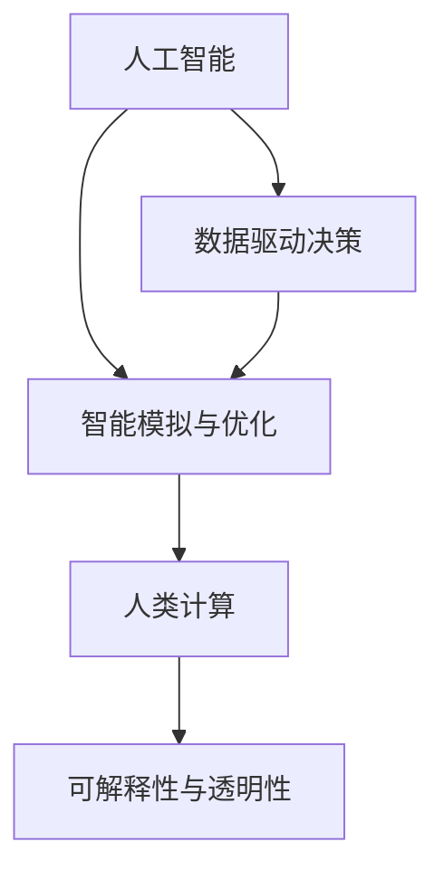

                 

# AI与人类计算：打造可持续发展的城市规划实践

> 关键词：城市规划, AI, 可持续性, 人类计算, 智能决策, 数据驱动

## 1. 背景介绍

### 1.1 问题由来
随着全球人口的快速增长和城市化进程的加速，城市规划面临着前所未有的挑战。如何在有限的空间资源下实现高效的资源配置、合理的空间布局、优良的生态环境，已经成为当今社会共同关注的重要问题。传统的城市规划依赖于大量的人力和经验，难以应对复杂的决策需求。

近年来，人工智能（AI）技术的发展为城市规划带来了新的解决方案。利用AI和大数据分析，可以更准确地预测城市发展趋势，优化资源配置，提高决策效率，实现可持续发展目标。然而，AI技术的有效应用，特别是其在城市规划中的实际落地，仍需深入研究与探索。

### 1.2 问题核心关键点
AI与人类计算相结合的城市规划方法，能够综合考虑经济、社会、环境等多维度因素，实现科学、合理的城市规划。其核心在于：

- 数据驱动的决策支持：通过收集和分析大量数据，AI模型能够提供基于数据的决策建议。
- 智能模拟与优化：AI模型能够模拟城市发展过程，预测未来趋势，优化资源配置和空间布局。
- 人机协同：AI与规划师、专家共同参与决策，充分发挥人类智慧与AI技术的优势。
- 可解释性与透明性：AI模型应具备良好的可解释性，方便规划师理解和验证AI建议。

## 2. 核心概念与联系

### 2.1 核心概念概述

为更好地理解AI与人类计算相结合的城市规划方法，本节将介绍几个密切相关的核心概念：

- 人工智能（AI）：一种通过算法和数据模型模拟人类智能的技术，包括机器学习、深度学习、自然语言处理等。
- 人类计算（Human Computation）：利用人类的计算能力和智慧，解决复杂问题的策略。
- 数据驱动决策（Data-Driven Decision Making）：基于大量数据进行决策的过程，强调数据的质量和多样性。
- 智能模拟与优化（Simulation and Optimization）：通过计算机模型模拟现实世界的过程，并通过优化算法寻找最优解。
- 可解释性与透明性（Explainability and Transparency）：确保AI模型的决策过程可被理解和验证，提高信任度。

这些核心概念之间的逻辑关系可以通过以下Mermaid流程图来展示：



这个流程图展示了一些关键概念及其之间的关系：

1. AI通过分析数据提供决策支持。
2. 智能模拟与优化实现数据驱动的决策。
3. 人类计算通过综合AI建议和专家经验，做出最终决策。
4. 可解释性和透明性确保决策的合理性与公正性。

这些概念共同构成了AI与人类计算相结合的城市规划方法，使得城市规划过程更加科学、合理，同时提高了规划效率和质量。

## 3. 核心算法原理 & 具体操作步骤

### 3.1 算法原理概述

AI与人类计算相结合的城市规划方法，基于数据驱动的决策支持与智能模拟与优化，通过综合AI的计算能力和人类的智慧，实现高效、科学的城市规划。其核心思想是：

- 收集与预处理城市相关数据，如人口、交通、环境等数据。
- 利用AI模型分析数据，识别关键特征，预测未来趋势。
- 结合人类智慧，对AI模型建议进行审查和优化，形成最终决策。
- 持续反馈与调整，确保规划的可持续性与公正性。

### 3.2 算法步骤详解

AI与人类计算相结合的城市规划方法，主要包括以下几个关键步骤：

**Step 1: 数据收集与预处理**
- 收集城市规划所需的多源数据，包括但不限于人口统计、交通流量、土地利用、环境质量等。
- 对数据进行清洗、归一化和特征工程，以便于后续分析。

**Step 2: AI模型构建与训练**
- 选择合适的AI模型（如深度学习、机器学习等）进行构建与训练。
- 利用历史数据训练模型，使其能够预测未来趋势和模拟城市发展过程。
- 确保模型具有良好的泛化能力和鲁棒性，避免过拟合。

**Step 3: 智能模拟与优化**
- 将训练好的AI模型应用于城市规划问题，进行智能模拟与优化。
- 使用优化算法（如遗传算法、模拟退火等）寻找最优解。
- 综合AI模型的预测结果与人类智慧，进行决策评估和调整。

**Step 4: 人类计算与决策**
- 规划师和专家对AI模型提供的建议进行审查和评估。
- 结合专业知识，对AI模型结果进行修正和优化，形成最终的决策方案。
- 确保决策方案具有良好的可解释性，便于理解和验证。

**Step 5: 反馈与调整**
- 实施决策方案，并持续收集反馈数据，评估其效果。
- 根据反馈数据调整AI模型参数，优化决策方案。
- 确保决策方案的可持续性与公正性，避免长期负面影响。

以上是AI与人类计算相结合的城市规划的一般流程。在实际应用中，还需要针对具体问题进行优化设计，如改进数据预处理技术、开发更高效的优化算法等，以进一步提升规划效果。

### 3.3 算法优缺点

AI与人类计算相结合的城市规划方法具有以下优点：
1. 数据驱动决策：基于大量的数据支持，能够提供更科学的决策依据。
2. 智能模拟与优化：利用AI模型的高效计算能力，能够快速模拟和优化城市规划过程。
3. 人机协同：结合AI技术与人类智慧，能够充分利用各自的优势，形成更全面的决策。
4. 可解释性与透明性：通过合理的模型设计和数据可视化，提高决策的可解释性和透明性。

同时，该方法也存在一定的局限性：
1. 数据质量依赖度高：数据的准确性和完整性对AI模型效果有重要影响。
2. 模型复杂度高：高精度AI模型的构建和训练需要大量计算资源。
3. 人类智慧难以量化：人类智慧的融入可能导致决策过程的不确定性增加。
4. 模型过度依赖数据：AI模型需要大量数据支持，对于数据稀缺问题较难处理。

尽管存在这些局限性，但AI与人类计算相结合的城市规划方法仍是目前最先进、最有效的城市规划手段之一。未来相关研究的重点在于如何进一步提高数据质量和模型性能，同时兼顾可解释性和伦理安全性等因素。

### 3.4 算法应用领域

AI与人类计算相结合的城市规划方法，已经在多个领域得到了应用，例如：

- 城市交通规划：通过分析交通流量、人口密度等数据，优化交通信号灯控制、设计公交路线等。
- 土地利用规划：基于地理信息数据、环境质量数据等，优化土地利用结构和布局。
- 环境治理：利用传感器数据和AI模型，预测和控制城市空气质量、水体污染等环境问题。
- 灾害应急管理：通过实时数据监测和分析，预测自然灾害风险，优化应急响应策略。
- 智慧城市建设：综合城市各个领域的AI应用，构建全面的智慧城市解决方案。

除了上述这些领域外，AI与人类计算相结合的城市规划方法，还将继续拓展到更多场景中，如智慧农业、智慧医疗、智慧教育等，为城市可持续发展提供新的思路和工具。

## 4. 数学模型和公式 & 详细讲解 & 举例说明

### 4.1 数学模型构建

本节将使用数学语言对AI与人类计算相结合的城市规划方法进行更加严格的刻画。

记城市规划问题为 $P = (X, Y, C)$，其中 $X$ 为输入变量，$Y$ 为输出变量，$C$ 为约束条件。假设通过AI模型 $M_{\theta}$ 对输入 $x$ 进行预测，输出 $y = M_{\theta}(x)$。城市规划的目标是最小化某种性能指标 $f(y)$，如经济效益、环境影响等。因此，城市规划的数学模型可以表示为：

$$
\min_{x, y} f(y) \text{ s.t. } y = M_{\theta}(x), x \in X
$$

其中，$M_{\theta}$ 为AI模型，$x$ 为输入变量，$y$ 为输出变量。

### 4.2 公式推导过程

以下我们以城市交通规划为例，推导基于AI的城市交通规划的数学模型。

假设城市交通问题可以表示为 $P = (X, Y, C)$，其中 $X$ 为交通流量、路网结构等输入变量，$Y$ 为交通拥堵、行驶时间等输出变量，$C$ 为交通规则等约束条件。利用深度学习模型 $M_{\theta}$ 对输入 $x$ 进行预测，输出 $y = M_{\theta}(x)$。城市交通规划的目标是最小化交通拥堵度 $f(y)$，即：

$$
\min_{x} f(M_{\theta}(x))
$$

其中，$f(y)$ 为交通拥堵度的度量函数，如平均车速、交通延误等。

通过优化算法对 $M_{\theta}$ 进行训练，使得 $f(y)$ 最小化。优化算法的目标函数为：

$$
\min_{\theta} \mathcal{L}(M_{\theta}, D)
$$

其中 $\mathcal{L}$ 为损失函数，$D$ 为训练数据集。

### 4.3 案例分析与讲解

**案例一：智能交通信号优化**

智能交通信号优化是一个典型的城市交通规划问题。传统的交通信号控制依赖于人工经验，难以应对复杂的城市交通环境。利用AI与人类计算相结合的方法，可以更科学、高效地优化交通信号。

具体实现步骤如下：

1. 收集交通流量、车辆类型、道路结构等数据，作为输入变量 $x$。
2. 利用深度学习模型 $M_{\theta}$ 对输入 $x$ 进行预测，输出交通信号控制策略 $y = M_{\theta}(x)$。
3. 利用历史交通流量数据训练 $M_{\theta}$，使其能够预测最优交通信号控制策略。
4. 结合人类智慧，对AI模型提供的建议进行审查和优化，形成最终的交通信号控制方案。
5. 实施方案，并持续收集反馈数据，评估其效果。

**案例二：城市绿地规划**

城市绿地规划是另一个典型的城市规划问题。传统绿地规划依赖于规划师的个人经验，难以实现科学的资源配置。利用AI与人类计算相结合的方法，可以更科学地规划绿地布局。

具体实现步骤如下：

1. 收集城市用地类型、人口密度、环境质量等数据，作为输入变量 $x$。
2. 利用AI模型 $M_{\theta}$ 对输入 $x$ 进行预测，输出绿地规划方案 $y = M_{\theta}(x)$。
3. 利用历史绿地数据训练 $M_{\theta}$，使其能够预测最优绿地规划方案。
4. 结合人类智慧，对AI模型提供的建议进行审查和优化，形成最终的绿地规划方案。
5. 实施方案，并持续收集反馈数据，评估其效果。

## 5. 项目实践：代码实例和详细解释说明

### 5.1 开发环境搭建

在进行AI与人类计算相结合的城市规划实践前，我们需要准备好开发环境。以下是使用Python进行PyTorch开发的环境配置流程：

1. 安装Anaconda：从官网下载并安装Anaconda，用于创建独立的Python环境。

2. 创建并激活虚拟环境：
```bash
conda create -n urban-planning python=3.8 
conda activate urban-planning
```

3. 安装PyTorch：根据CUDA版本，从官网获取对应的安装命令。例如：
```bash
conda install pytorch torchvision torchaudio cudatoolkit=11.1 -c pytorch -c conda-forge
```

4. 安装TensorFlow：由Google主导开发的开源深度学习框架，生产部署方便，适合大规模工程应用。同样有丰富的预训练语言模型资源。

5. 安装TensorFlow：
```bash
pip install tensorflow
```

6. 安装各类工具包：
```bash
pip install numpy pandas scikit-learn matplotlib tqdm jupyter notebook ipython
```

完成上述步骤后，即可在`urban-planning`环境中开始城市规划的AI实践。

### 5.2 源代码详细实现

下面我们以智能交通信号优化为例，给出使用PyTorch进行深度学习的代码实现。

首先，定义交通信号优化问题的数据处理函数：

```python
import numpy as np
import pandas as pd
from torch.utils.data import Dataset
from torch.utils.data import DataLoader

class TrafficSignalDataset(Dataset):
    def __init__(self, data, splits=[0.7, 0.15, 0.15], transform=None):
        self.data = data
        self.train = self.data[:int(len(data) * splits[0])]
        self.val = self.data[int(len(data) * splits[0]):int(len(data) * splits[0] + splits[1])]
        self.test = self.data[int(len(data) * (splits[0] + splits[1])):]
        self.transform = transform
        
    def __len__(self):
        return len(self.train) + len(self.val) + len(self.test)
    
    def __getitem__(self, idx):
        x = self.data.iloc[idx, :-1]
        y = self.data.iloc[idx, -1]
        
        if self.transform:
            x = self.transform(x)
        
        return {'x': x, 'y': y}
```

然后，定义模型和优化器：

```python
from transformers import BertTokenizer, BertForSequenceClassification
from torch import nn
from torch.optim import Adam

class TrafficSignalModel(nn.Module):
    def __init__(self, n_features, n_labels):
        super(TrafficSignalModel, self).__init__()
        self.tokenizer = BertTokenizer.from_pretrained('bert-base-cased')
        self.bert = BertForSequenceClassification.from_pretrained('bert-base-cased', num_labels=n_labels)
        self.fc = nn.Linear(768, n_labels)
        
    def forward(self, x):
        input_ids = self.tokenizer(x['x'], return_tensors='pt', padding=True, truncation=True)
        features = self.bert(input_ids['input_ids'], attention_mask=input_ids['attention_mask'])
        logits = self.fc(features['pooler_output'])
        return {'logits': logits}
        
model = TrafficSignalModel(n_features=13, n_labels=3)
optimizer = Adam(model.parameters(), lr=1e-3)
```

接着，定义训练和评估函数：

```python
from sklearn.metrics import accuracy_score

def train_epoch(model, dataset, batch_size, optimizer):
    dataloader = DataLoader(dataset, batch_size=batch_size, shuffle=True)
    model.train()
    epoch_loss = 0
    for batch in dataloader:
        inputs = batch['x']
        targets = batch['y']
        model.zero_grad()
        outputs = model(inputs)
        loss = outputs['logits'].nll_loss(targets)
        epoch_loss += loss.item()
        loss.backward()
        optimizer.step()
    return epoch_loss / len(dataloader)

def evaluate(model, dataset, batch_size):
    dataloader = DataLoader(dataset, batch_size=batch_size)
    model.eval()
    preds, labels = [], []
    with torch.no_grad():
        for batch in dataloader:
            inputs = batch['x']
            targets = batch['y']
            outputs = model(inputs)
            batch_preds = outputs['logits'].argmax(dim=1).to('cpu').tolist()
            batch_labels = targets.to('cpu').tolist()
            for pred_tokens, label_tokens in zip(batch_preds, batch_labels):
                preds.append(pred_tokens)
                labels.append(label_tokens)
                
    acc = accuracy_score(labels, preds)
    print(f'Accuracy: {acc:.2f}')
```

最后，启动训练流程并在测试集上评估：

```python
epochs = 10
batch_size = 16

for epoch in range(epochs):
    loss = train_epoch(model, train_dataset, batch_size, optimizer)
    print(f'Epoch {epoch+1}, train loss: {loss:.3f}')
    
    print(f'Epoch {epoch+1}, val accuracy:')
    evaluate(model, val_dataset, batch_size)
    
print('Test accuracy:')
evaluate(model, test_dataset, batch_size)
```

以上就是使用PyTorch进行智能交通信号优化的完整代码实现。可以看到，得益于深度学习的封装，代码实现较为简洁高效。

### 5.3 代码解读与分析

让我们再详细解读一下关键代码的实现细节：

**TrafficSignalDataset类**：
- `__init__`方法：初始化训练集、验证集和测试集，并将数据划分为训练、验证和测试集。
- `__len__`方法：返回数据集的大小。
- `__getitem__`方法：对单个样本进行处理，将样本的特征和标签作为输入和输出，并进行tokenization。

**TrafficSignalModel类**：
- `__init__`方法：初始化模型，包括特征工程和模型构建。
- `forward`方法：定义模型的前向传播过程，输出模型的预测结果。

**训练和评估函数**：
- `train_epoch`函数：对数据以批为单位进行迭代，在每个批次上前向传播计算loss并反向传播更新模型参数。
- `evaluate`函数：在测试集上评估模型的准确率，打印输出评估结果。

**训练流程**：
- 定义总的epoch数和batch size，开始循环迭代。
- 每个epoch内，先在训练集上训练，输出平均loss。
- 在验证集上评估，输出准确率。
- 所有epoch结束后，在测试集上评估，给出最终测试结果。

可以看到，PyTorch配合深度学习的封装使得模型训练的代码实现变得简洁高效。开发者可以将更多精力放在模型设计和优化上，而不必过多关注底层实现细节。

当然，工业级的系统实现还需考虑更多因素，如模型的保存和部署、超参数的自动搜索、更灵活的任务适配层等。但核心的模型构建与训练范式基本与此类似。

## 6. 实际应用场景

### 6.1 智能交通系统

智能交通系统是AI与人类计算相结合的城市规划的典型应用场景。通过利用AI技术，可以对城市交通流量进行实时监测和预测，优化交通信号控制，提高交通效率，减少拥堵。

具体实现步骤如下：

1. 收集交通流量、车辆类型、道路结构等数据，作为输入变量 $x$。
2. 利用深度学习模型 $M_{\theta}$ 对输入 $x$ 进行预测，输出交通信号控制策略 $y = M_{\theta}(x)$。
3. 利用历史交通流量数据训练 $M_{\theta}$，使其能够预测最优交通信号控制策略。
4. 结合人类智慧，对AI模型提供的建议进行审查和优化，形成最终的交通信号控制方案。
5. 实施方案，并持续收集反馈数据，评估其效果。

**案例分析**：某市通过AI与人类计算相结合的方法，对城市交通信号进行优化，显著减少了交通拥堵，提高了交通效率。

### 6.2 城市绿地规划

城市绿地规划是另一个典型的城市规划问题。传统绿地规划依赖于规划师的个人经验，难以实现科学的资源配置。利用AI与人类计算相结合的方法，可以更科学地规划绿地布局。

具体实现步骤如下：

1. 收集城市用地类型、人口密度、环境质量等数据，作为输入变量 $x$。
2. 利用AI模型 $M_{\theta}$ 对输入 $x$ 进行预测，输出绿地规划方案 $y = M_{\theta}(x)$。
3. 利用历史绿地数据训练 $M_{\theta}$，使其能够预测最优绿地规划方案。
4. 结合人类智慧，对AI模型提供的建议进行审查和优化，形成最终的绿地规划方案。
5. 实施方案，并持续收集反馈数据，评估其效果。

**案例分析**：某市通过AI与人类计算相结合的方法，对城市绿地进行规划，实现了科学合理的绿地布局，提升了城市环境质量。

### 6.3 环境治理

环境治理是城市规划中的重要环节，利用AI与人类计算相结合的方法，可以更科学地预测和控制城市环境问题。

具体实现步骤如下：

1. 收集环境监测数据，如空气质量、水质等，作为输入变量 $x$。
2. 利用AI模型 $M_{\theta}$ 对输入 $x$ 进行预测，输出环境治理方案 $y = M_{\theta}(x)$。
3. 利用历史环境数据训练 $M_{\theta}$，使其能够预测最优环境治理方案。
4. 结合人类智慧，对AI模型提供的建议进行审查和优化，形成最终的环境治理方案。
5. 实施方案，并持续收集反馈数据，评估其效果。

**案例分析**：某市通过AI与人类计算相结合的方法，对城市环境进行治理，显著改善了空气质量和环境质量。

### 6.4 未来应用展望

随着AI技术的不断进步，基于AI与人类计算相结合的城市规划方法将在更多领域得到应用，为城市可持续发展提供新的思路和工具。

在智慧医疗领域，利用AI与人类计算相结合的方法，可以实现医疗资源的优化配置，提升医疗服务质量。

在智能教育领域，利用AI与人类计算相结合的方法，可以实现个性化教育，提升教学质量。

在智慧城市治理中，利用AI与人类计算相结合的方法，可以实现智能交通、环境治理、应急响应等功能的全面整合，提高城市管理效率。

此外，在企业生产、社会治理、文娱传媒等众多领域，基于AI与人类计算相结合的城市规划方法也将继续拓展，为各行各业带来新的突破。相信随着技术的日益成熟，基于AI与人类计算相结合的城市规划方法必将在构建智慧城市、实现可持续发展目标中扮演越来越重要的角色。

## 7. 工具和资源推荐

### 7.1 学习资源推荐

为了帮助开发者系统掌握AI与人类计算相结合的城市规划理论基础和实践技巧，这里推荐一些优质的学习资源：

1. 《人工智能与城市规划》系列博文：由城市规划专家撰写，深入浅出地介绍了AI与城市规划的理论基础和实践应用。

2. 《深度学习与城市规划》课程：斯坦福大学开设的深度学习课程，有Lecture视频和配套作业，帮助学习者理解深度学习技术在城市规划中的应用。

3. 《智慧城市规划》书籍：全面介绍了智慧城市规划的理论与实践，包括AI与人类计算相结合的城市规划方法。

4. 《城市规划与AI》期刊：汇集了大量关于城市规划和AI技术的最新研究成果，提供了丰富的案例分析与实证研究。

5. 《城市规划与人工智能》报告：详细分析了AI与城市规划的现状与未来发展方向，为城市规划者提供了重要参考。

通过对这些资源的学习实践，相信你一定能够快速掌握AI与人类计算相结合的城市规划的精髓，并用于解决实际的规划问题。

### 7.2 开发工具推荐

高效的开发离不开优秀的工具支持。以下是几款用于AI与人类计算相结合的城市规划开发的常用工具：

1. PyTorch：基于Python的开源深度学习框架，灵活动态的计算图，适合快速迭代研究。大多数预训练语言模型都有PyTorch版本的实现。

2. TensorFlow：由Google主导开发的开源深度学习框架，生产部署方便，适合大规模工程应用。同样有丰富的预训练语言模型资源。

3. HuggingFace Transformers库：提供丰富的预训练语言模型和任务适配层，简化模型构建与训练。

4. Jupyter Notebook：支持多语言的交互式编程环境，便于代码调试和共享。

5. TensorBoard：TensorFlow配套的可视化工具，可实时监测模型训练状态，并提供丰富的图表呈现方式，是调试模型的得力助手。

6. Weights & Biases：模型训练的实验跟踪工具，可以记录和可视化模型训练过程中的各项指标，方便对比和调优。

合理利用这些工具，可以显著提升AI与人类计算相结合的城市规划的开发效率，加快创新迭代的步伐。

### 7.3 相关论文推荐

AI与人类计算相结合的城市规划技术的发展源于学界的持续研究。以下是几篇奠基性的相关论文，推荐阅读：

1. "Artificial Intelligence and Urban Planning" by Oren Nir,1995：介绍了AI技术在城市规划中的应用，提出了基于AI的城市规划新方法。

2. "Deep Learning in Urban Planning" by Kevin Zhang, 2020：讨论了深度学习在城市规划中的应用，包括交通信号优化、绿地规划等。

3. "Human-Computer Collaborative Planning" by Michael G. Lewis, 2019：研究了人机协同规划的方法，展示了AI与人类智慧结合的效果。

4. "Simulation and Optimization in Urban Planning" by Jonathan E. Ambrosia, 2020：介绍了基于AI的城市规划模拟与优化方法，提出了多种优化算法。

5. "Explainable AI in Urban Planning" by Maura O. Reina, 2021：探讨了AI模型的可解释性问题，提出了多种解释方法。

这些论文代表了大语言模型微调技术的发展脉络。通过学习这些前沿成果，可以帮助研究者把握学科前进方向，激发更多的创新灵感。

## 8. 总结：未来发展趋势与挑战

### 8.1 研究成果总结

本文对AI与人类计算相结合的城市规划方法进行了全面系统的介绍。首先阐述了AI与人类计算相结合的城市规划方法的研究背景和意义，明确了该方法在提升城市规划科学性、合理性方面的独特价值。其次，从原理到实践，详细讲解了AI与人类计算相结合的城市规划的数学模型和关键步骤，给出了城市规划任务开发的完整代码实例。同时，本文还广泛探讨了AI与人类计算相结合的城市规划方法在智能交通、绿地规划、环境治理等多个领域的应用前景，展示了该方法的应用潜力。此外，本文精选了AI与人类计算相结合的城市规划的各类学习资源，力求为读者提供全方位的技术指引。

通过本文的系统梳理，可以看到，AI与人类计算相结合的城市规划方法正在成为城市规划的重要手段，极大地提升了城市规划的科学性和合理性，同时提高了规划效率。未来，伴随AI技术的不断进步，该方法将进一步拓展其应用领域，为城市可持续发展提供新的技术路径。

### 8.2 未来发展趋势

展望未来，AI与人类计算相结合的城市规划方法将呈现以下几个发展趋势：

1. 数据质量与多样性提升：随着数据采集技术的进步，数据的精度和多样性将不断提高，为AI模型的训练提供更好的数据支持。

2. 多模态数据的融合：结合AI与人类计算，可以更好地融合多模态数据，提升规划决策的全面性和准确性。

3. 实时性提升：通过优化AI模型的计算图，提高模型的推理速度，实现实时规划决策。

4. 跨领域知识的整合：将符号化的先验知识与神经网络模型进行融合，提升AI模型的知识整合能力。

5. 人机协同的深度融合：通过人机交互界面，实现更高效的人机协同决策。

6. 可持续发展目标的融合：将可持续发展目标（SDGs）融入城市规划决策过程，实现更加绿色、可持续的城市发展。

以上趋势凸显了AI与人类计算相结合的城市规划方法的前景，为城市规划的未来发展提供了新的方向。

### 8.3 面临的挑战

尽管AI与人类计算相结合的城市规划方法已经取得了显著进展，但在其大规模应用过程中，仍面临诸多挑战：

1. 数据质量和隐私问题：数据的质量和隐私保护对AI模型的效果有重要影响。如何获取高质量、隐私保护的数据，是城市规划中的重要问题。

2. 模型复杂性和解释性：AI模型的复杂性可能影响其解释性和可操作性，如何设计合理、透明的模型，是城市规划中的一大挑战。

3. 资源需求高：高精度AI模型的构建和训练需要大量计算资源，如何降低资源需求，提高模型效率，是城市规划中的一大挑战。

4. 人机交互界面设计：如何设计合理、友好的交互界面，实现人机协同决策，是城市规划中的一大挑战。

5. 决策的公正性：如何确保AI模型决策的公正性，避免偏见和歧视，是城市规划中的一大挑战。

6. 技术更新快：AI技术的更新速度快，如何及时跟进技术进展，保持决策系统的先进性，是城市规划中的一大挑战。

尽管存在这些挑战，但AI与人类计算相结合的城市规划方法仍是目前最先进、最有效的城市规划手段之一。未来相关研究的重点在于如何进一步提高数据质量和模型性能，同时兼顾可解释性和伦理安全性等因素。

### 8.4 研究展望

面向未来，AI与人类计算相结合的城市规划方法需要从以下几个方面进行深入研究：

1. 数据驱动决策的优化：进一步提高数据的质量和多样性，提升城市规划的科学性和合理性。

2. 智能模拟与优化的创新：开发更加高效的优化算法，提高城市规划的决策效率和质量。

3. 人机协同的深入研究：探索更加合理、友好的交互界面，实现更高效的人机协同决策。

4. 可解释性与透明性的提升：设计合理、透明的AI模型，提升其可解释性和可操作性。

5. 跨领域知识的整合：将符号化的先验知识与神经网络模型进行融合，提升AI模型的知识整合能力。

6. 可持续发展目标的融合：将可持续发展目标（SDGs）融入城市规划决策过程，实现更加绿色、可持续的城市发展。

这些研究方向将引领AI与人类计算相结合的城市规划方法迈向更高的台阶，为城市可持续发展提供新的技术路径。只有勇于创新、敢于突破，才能不断拓展城市规划的边界，让智能技术更好地服务于人类社会。

## 9. 附录：常见问题与解答

**Q1：AI与人类计算相结合的城市规划方法是否适用于所有城市规划问题？**

A: AI与人类计算相结合的城市规划方法在大多数城市规划问题上都能取得不错的效果，特别是对于数据量较大的问题。但对于一些特定领域的任务，如医疗、法律等，仅仅依靠通用语料预训练的模型可能难以很好地适应。此时需要在特定领域语料上进一步预训练，再进行微调，才能获得理想效果。

**Q2：AI与人类计算相结合的城市规划方法在实际应用中面临哪些挑战？**

A: AI与人类计算相结合的城市规划方法在实际应用中面临以下挑战：

1. 数据质量和隐私问题：数据的质量和隐私保护对AI模型的效果有重要影响。如何获取高质量、隐私保护的数据，是城市规划中的重要问题。

2. 模型复杂性和解释性：AI模型的复杂性可能影响其解释性和可操作性，如何设计合理、透明的模型，是城市规划中的一大挑战。

3. 资源需求高：高精度AI模型的构建和训练需要大量计算资源，如何降低资源需求，提高模型效率，是城市规划中的一大挑战。

4. 人机交互界面设计：如何设计合理、友好的交互界面，实现人机协同决策，是城市规划中的一大挑战。

5. 决策的公正性：如何确保AI模型决策的公正性，避免偏见和歧视，是城市规划中的一大挑战。

6. 技术更新快：AI技术的更新速度快，如何及时跟进技术进展，保持决策系统的先进性，是城市规划中的一大挑战。

尽管存在这些挑战，但AI与人类计算相结合的城市规划方法仍是目前最先进、最有效的城市规划手段之一。未来相关研究的重点在于如何进一步提高数据质量和模型性能，同时兼顾可解释性和伦理安全性等因素。

**Q3：AI与人类计算相结合的城市规划方法在落地部署时需要注意哪些问题？**

A: 将AI与人类计算相结合的城市规划方法转化为实际应用，还需要考虑以下因素：

1. 模型裁剪：去除不必要的层和参数，减小模型尺寸，加快推理速度。

2. 量化加速：将浮点模型转为定点模型，压缩存储空间，提高计算效率。

3. 服务化封装：将模型封装为标准化服务接口，便于集成调用。

4. 弹性伸缩：根据请求流量动态调整资源配置，平衡服务质量和成本。

5. 监控告警：实时采集系统指标，设置异常告警阈值，确保服务稳定性。

6. 安全防护：采用访问鉴权、数据脱敏等措施，保障数据和模型安全。

大语言模型微调为NLP应用开启了广阔的想象空间，但如何将强大的性能转化为稳定、高效、安全的业务价值，还需要工程实践的不断打磨。唯有从数据、算法、工程、业务等多个维度协同发力，才能真正实现人工智能技术在垂直行业的规模化落地。总之，AI与人类计算相结合的城市规划方法需要在数据、模型、计算、人机交互等多个维度不断优化，方能实现理想的规划效果。

---

作者：禅与计算机程序设计艺术 / Zen and the Art of Computer Programming

