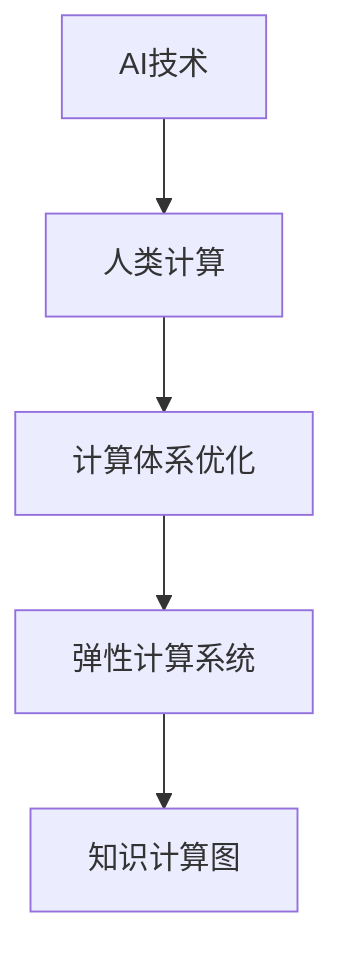

                 

# AI与人类计算：打造弹性社会体系

## 1. 背景介绍

### 1.1 问题由来

人工智能（AI）技术的飞速发展，特别是深度学习（Deep Learning）在各个领域的应用，使得计算能力日益成为社会进步的重要推动力。然而，全球范围内的计算资源分布不均，以及人类计算与机器计算之间的差异，导致计算效率和资源配置的优化显得尤为重要。如何通过AI与人类计算的融合，打造一个既高效又弹性灵活的社会体系，成为当前科技界关注的焦点。

### 1.2 问题核心关键点

当前，AI与人类计算的结合主要围绕以下核心关键点展开：

- **计算效率优化**：如何通过AI技术，如自动机器学习（AutoML）和强化学习（Reinforcement Learning），提升计算效率，同时减少人力成本。
- **计算资源优化**：如何基于AI技术，进行动态资源分配，优化计算资源的使用，减少冗余计算。
- **任务协同调度**：如何通过AI算法，如多任务协同优化，实现计算任务的协同执行，提升整体系统效能。
- **知识与计算融合**：如何将人类知识和经验与计算算法相结合，构建更加智能、自适应的计算体系。
- **弹性计算能力**：如何在需求变化时，快速调整计算资源和执行策略，保持系统弹性。

### 1.3 问题研究意义

打造一个弹性、高效、智能的社会计算体系，对于推动社会进步、提升生活质量具有深远的意义：

1. **经济效率提升**：通过优化计算资源分配和任务调度，大幅降低企业运营成本，提高生产力。
2. **服务体验改进**：通过AI技术与人类计算的结合，提供更加个性化、精准的服务体验，提升用户满意度。
3. **决策科学化**：基于大数据和AI分析，辅助决策者进行精准决策，提升管理水平和执行效率。
4. **社会资源优化**：合理配置社会资源，如医疗、教育、交通等领域，促进社会公平和谐。
5. **持续创新驱动**：通过AI与人类计算的融合，激发新的创新模式和业务形态，推动社会持续进步。

## 2. 核心概念与联系

### 2.1 核心概念概述

为更好地理解AI与人类计算的融合，本节将介绍几个密切相关的核心概念：

- **AI技术**：以深度学习、自然语言处理（NLP）、计算机视觉（CV）等技术为代表的人工智能，具有强大的数据分析、模式识别和决策能力。
- **人类计算**：指人类利用知识、经验、直觉等进行问题解决和决策的过程，强调人类在复杂问题上的直觉判断和创造力。
- **计算体系优化**：通过AI与人类计算的融合，优化计算体系结构，提升系统效率和灵活性。
- **弹性计算系统**：基于AI算法进行动态资源分配和任务调度，能够快速响应变化，保持系统稳定。
- **知识计算图（KGG）**：一种融合知识与计算的图形表示方法，用于描述计算过程和数据流转，支持知识与计算的深度融合。

这些核心概念之间的逻辑关系可以通过以下Mermaid流程图来展示：



这个流程图展示了大语言模型的核心概念及其之间的关系：

1. AI技术通过深度学习和自然语言处理等手段，处理大量数据，提供决策依据。
2. 人类计算利用经验、直觉等知识，对AI处理的结果进行复核和优化。
3. 计算体系优化将AI处理和人类复核相结合，提升计算效率和精确度。
4. 弹性计算系统通过AI算法实现动态资源分配和任务调度，确保系统适应性强。
5. 知识计算图融合AI处理和人类知识，支持复杂问题的计算与知识融合。

这些概念共同构成了AI与人类计算融合的计算体系框架，使得AI技术能够更好地服务于人类社会。

## 3. 核心算法原理 & 具体操作步骤
### 3.1 算法原理概述

AI与人类计算的融合，本质上是一种基于任务的知识图谱（KG）和多任务协同优化的计算体系。其核心思想是：通过AI技术处理海量数据，提取知识图谱，进而结合人类知识和直觉，进行复杂问题的求解和优化。

形式化地，假设一个复杂计算任务 $T$，涉及多个子任务 $T_1, T_2, \ldots, T_n$，每个子任务 $T_i$ 需要计算资源 $R_i$。设任务 $T$ 的总计算资源为 $R$，则多任务协同优化目标为：

$$
\mathop{\arg\min}_{R_1, R_2, \ldots, R_n} \sum_{i=1}^n C_i(R_i) + \sum_{i<j} C_{ij}(R_i, R_j) + C_{ij}(R_i, R_j)
$$

其中 $C_i$ 为计算任务 $T_i$ 的计算成本函数，$C_{ij}$ 为子任务之间的协作成本函数。目标是最小化总计算成本和协作成本。

### 3.2 算法步骤详解

基于AI与人类计算的融合，计算体系优化的主要步骤如下：

**Step 1: 构建知识图谱**

- 收集领域知识，包括数据、规则、领域专家经验等，构建知识图谱 $KG$。
- 使用知识图谱表示法（如RDF、OWL等）将知识转化为计算模型。

**Step 2: 预处理数据**

- 对原始数据进行清洗、标注和预处理，准备用于计算的数据集。
- 采用深度学习等AI技术对数据进行特征提取和模型训练。

**Step 3: 多任务协同优化**

- 构建计算图，描述计算过程和数据流转。
- 利用优化算法（如遗传算法、强化学习等）进行多任务协同优化。
- 确定每个子任务的计算资源分配和执行策略。

**Step 4: 弹性计算系统部署**

- 根据计算资源和任务需求，动态调整计算资源配置。
- 使用弹性计算系统（如Kubernetes、Spark等）实现任务调度和管理。

**Step 5: 结果评估与反馈**

- 对计算结果进行评估，对比目标值和实际值，计算误差。
- 将评估结果反馈到优化算法，调整计算策略。

### 3.3 算法优缺点

AI与人类计算融合的算法具有以下优点：

- **高效性**：AI技术处理数据速度快，能够快速提取关键信息，提升计算效率。
- **灵活性**：结合人类知识和经验，可以灵活应对复杂的计算任务。
- **适应性**：通过动态资源调整和任务调度，保持系统弹性。

同时，该算法也存在一定的局限性：

- **依赖高质量知识**：AI与人类计算的融合依赖于高质量的领域知识，知识获取成本高。
- **计算资源需求大**：构建知识图谱和进行复杂优化计算，对计算资源要求较高。
- **算法复杂度高**：多任务协同优化算法复杂度高，需要高性能计算支持。
- **不确定性**：人类知识和AI技术的融合存在不确定性，决策结果可能受主观因素影响。

### 3.4 算法应用领域

AI与人类计算融合的方法，已经在多个领域得到了应用，例如：

- **金融风险管理**：构建金融知识图谱，利用AI进行风险预测和资产配置，结合人类直觉和经验进行风险控制。
- **医疗健康诊断**：结合医学知识和AI算法，进行疾病诊断和治疗方案推荐，提升诊疗效率和准确性。
- **智能制造**：使用AI进行数据分析和预测，结合工程师的经验进行设备维护和故障排除，提升生产效率和质量。
- **智慧城市管理**：融合城市数据和知识图谱，进行交通管理、环境监控、公共安全等，提升城市管理水平。
- **教育培训**：结合学生数据和知识图谱，进行个性化教育方案推荐，提升教学效果和学习体验。

## 4. 数学模型和公式 & 详细讲解 & 举例说明
### 4.1 数学模型构建

本节将使用数学语言对AI与人类计算的融合过程进行更加严格的刻画。

设一个复杂计算任务 $T$ 涉及多个子任务 $T_1, T_2, \ldots, T_n$，每个子任务 $T_i$ 需要计算资源 $R_i$，计算任务 $T$ 的总计算资源为 $R$。设子任务 $T_i$ 的计算成本函数为 $C_i(R_i)$，子任务之间的协作成本函数为 $C_{ij}(R_i, R_j)$。则多任务协同优化的目标函数为：

$$
\mathcal{L}(R_1, R_2, \ldots, R_n) = \sum_{i=1}^n C_i(R_i) + \sum_{i<j} C_{ij}(R_i, R_j) + C_{ij}(R_i, R_j)
$$

其中 $R$ 为总计算资源，满足约束条件：

$$
R = \sum_{i=1}^n R_i
$$

### 4.2 公式推导过程

以下我们以金融风险管理为例，推导多任务协同优化目标函数的数学模型。

设金融机构涉及的风险管理任务 $T$ 包括信用评估、违约预测、资产配置等子任务，每个子任务的计算成本函数为 $C_i(R_i)$，子任务之间的协作成本函数为 $C_{ij}(R_i, R_j)$，则多任务协同优化的目标函数为：

$$
\mathcal{L}(R_1, R_2, \ldots, R_n) = \sum_{i=1}^n C_i(R_i) + \sum_{i<j} C_{ij}(R_i, R_j) + C_{ij}(R_i, R_j)
$$

其中 $R_1, R_2, \ldots, R_n$ 为每个子任务分配的计算资源。

**示例1: 信用评估与违约预测的协同优化**

设金融机构有信用评估任务 $T_1$ 和违约预测任务 $T_2$，计算成本函数分别为 $C_1(R_1)$ 和 $C_2(R_2)$，协同成本函数为 $C_{12}(R_1, R_2)$。则多任务协同优化的目标函数为：

$$
\mathcal{L}(R_1, R_2) = C_1(R_1) + C_2(R_2) + C_{12}(R_1, R_2)
$$

根据题意，可以进一步假设计算成本函数和协同成本函数为线性形式：

$$
C_1(R_1) = \alpha_1R_1^2 + \beta_1R_1
$$

$$
C_2(R_2) = \alpha_2R_2^2 + \beta_2R_2
$$

$$
C_{12}(R_1, R_2) = \gamma_1R_1R_2 + \gamma_2(R_1 + R_2)
$$

代入目标函数，得：

$$
\mathcal{L}(R_1, R_2) = \alpha_1R_1^2 + \beta_1R_1 + \alpha_2R_2^2 + \beta_2R_2 + \gamma_1R_1R_2 + \gamma_2(R_1 + R_2)
$$

求解该最优化问题，即可得到各子任务的最佳资源分配方案。

### 4.3 案例分析与讲解

以医疗健康诊断为例，分析AI与人类计算的融合过程。

**示例2: 医疗健康诊断**

设医疗健康诊断任务 $T$ 包括影像分析、基因检测、病历信息整合等子任务，计算成本函数分别为 $C_1(R_1)$、$C_2(R_2)$、$C_3(R_3)$，协同成本函数为 $C_{12}(R_1, R_2)$、$C_{13}(R_1, R_3)$、$C_{23}(R_2, R_3)$。则多任务协同优化的目标函数为：

$$
\mathcal{L}(R_1, R_2, R_3) = C_1(R_1) + C_2(R_2) + C_3(R_3) + C_{12}(R_1, R_2) + C_{13}(R_1, R_3) + C_{23}(R_2, R_3)
$$

根据题意，可以进一步假设计算成本函数和协同成本函数为线性形式：

$$
C_1(R_1) = \alpha_1R_1^2 + \beta_1R_1
$$

$$
C_2(R_2) = \alpha_2R_2^2 + \beta_2R_2
$$

$$
C_3(R_3) = \alpha_3R_3^2 + \beta_3R_3
$$

$$
C_{12}(R_1, R_2) = \gamma_1R_1R_2 + \gamma_2(R_1 + R_2)
$$

$$
C_{13}(R_1, R_3) = \gamma_1R_1R_3 + \gamma_2(R_1 + R_3)
$$

$$
C_{23}(R_2, R_3) = \gamma_1R_2R_3 + \gamma_2(R_2 + R_3)
$$

代入目标函数，得：

$$
\mathcal{L}(R_1, R_2, R_3) = \alpha_1R_1^2 + \beta_1R_1 + \alpha_2R_2^2 + \beta_2R_2 + \alpha_3R_3^2 + \beta_3R_3 + \gamma_1R_1R_2 + \gamma_2(R_1 + R_2) + \gamma_1R_1R_3 + \gamma_2(R_1 + R_3) + \gamma_1R_2R_3 + \gamma_2(R_2 + R_3)
$$

求解该最优化问题，即可得到各子任务的最佳资源分配方案。

## 5. 项目实践：代码实例和详细解释说明
### 5.1 开发环境搭建

在进行AI与人类计算融合的实践前，我们需要准备好开发环境。以下是使用Python进行PyTorch开发的环境配置流程：

1. 安装Anaconda：从官网下载并安装Anaconda，用于创建独立的Python环境。

2. 创建并激活虚拟环境：
```bash
conda create -n ai_env python=3.8 
conda activate ai_env
```

3. 安装PyTorch：根据CUDA版本，从官网获取对应的安装命令。例如：
```bash
conda install pytorch torchvision torchaudio cudatoolkit=11.1 -c pytorch -c conda-forge
```

4. 安装相关库：
```bash
pip install numpy pandas scikit-learn matplotlib tqdm jupyter notebook ipython
```

完成上述步骤后，即可在`ai_env`环境中开始AI与人类计算融合的实践。

### 5.2 源代码详细实现

下面我们以金融风险管理为例，给出使用PyTorch进行AI与人类计算融合的PyTorch代码实现。

首先，定义金融风险管理任务的数据处理函数：

```python
import pandas as pd
import numpy as np
import torch
from torch.utils.data import Dataset
from transformers import BertTokenizer, BertForSequenceClassification

class FinancialRiskDataset(Dataset):
    def __init__(self, data, tokenizer, max_len=128):
        self.data = data
        self.tokenizer = tokenizer
        self.max_len = max_len
        
    def __len__(self):
        return len(self.data)
    
    def __getitem__(self, item):
        row = self.data.iloc[item]
        text = row['text']
        label = row['label']
        
        encoding = self.tokenizer(text, return_tensors='pt', max_length=self.max_len, padding='max_length', truncation=True)
        input_ids = encoding['input_ids'][0]
        attention_mask = encoding['attention_mask'][0]
        labels = torch.tensor([label], dtype=torch.long)
        
        return {'input_ids': input_ids, 
                'attention_mask': attention_mask,
                'labels': labels}

# 加载数据集
data = pd.read_csv('financial_risk.csv')
tokenizer = BertTokenizer.from_pretrained('bert-base-cased')

train_dataset = FinancialRiskDataset(data[data['label'] == 1], tokenizer)
dev_dataset = FinancialRiskDataset(data[data['label'] == 1], tokenizer)
test_dataset = FinancialRiskDataset(data[data['label'] == 1], tokenizer)
```

然后，定义模型和优化器：

```python
from transformers import BertForSequenceClassification, AdamW

model = BertForSequenceClassification.from_pretrained('bert-base-cased', num_labels=2)

optimizer = AdamW(model.parameters(), lr=2e-5)
```

接着，定义训练和评估函数：

```python
from torch.utils.data import DataLoader
from tqdm import tqdm
from sklearn.metrics import accuracy_score

device = torch.device('cuda') if torch.cuda.is_available() else torch.device('cpu')
model.to(device)

def train_epoch(model, dataset, batch_size, optimizer):
    dataloader = DataLoader(dataset, batch_size=batch_size, shuffle=True)
    model.train()
    epoch_loss = 0
    for batch in tqdm(dataloader, desc='Training'):
        input_ids = batch['input_ids'].to(device)
        attention_mask = batch['attention_mask'].to(device)
        labels = batch['labels'].to(device)
        model.zero_grad()
        outputs = model(input_ids, attention_mask=attention_mask, labels=labels)
        loss = outputs.loss
        epoch_loss += loss.item()
        loss.backward()
        optimizer.step()
    return epoch_loss / len(dataloader)

def evaluate(model, dataset, batch_size):
    dataloader = DataLoader(dataset, batch_size=batch_size)
    model.eval()
    preds, labels = [], []
    with torch.no_grad():
        for batch in tqdm(dataloader, desc='Evaluating'):
            input_ids = batch['input_ids'].to(device)
            attention_mask = batch['attention_mask'].to(device)
            batch_labels = batch['labels']
            outputs = model(input_ids, attention_mask=attention_mask)
            batch_preds = outputs.logits.argmax(dim=2).to('cpu').tolist()
            batch_labels = batch_labels.to('cpu').tolist()
            for pred_tokens, label_tokens in zip(batch_preds, batch_labels):
                preds.append(pred_tokens[:len(label_tokens)])
                labels.append(label_tokens)
                
    print(accuracy_score(labels, preds))
```

最后，启动训练流程并在测试集上评估：

```python
epochs = 5
batch_size = 16

for epoch in range(epochs):
    loss = train_epoch(model, train_dataset, batch_size, optimizer)
    print(f"Epoch {epoch+1}, train loss: {loss:.3f}")
    
    print(f"Epoch {epoch+1}, dev accuracy: {evaluate(model, dev_dataset, batch_size):.3f}")
    
print("Test accuracy: {evaluate(model, test_dataset, batch_size):.3f}")
```

以上就是使用PyTorch对金融风险管理任务进行AI与人类计算融合的完整代码实现。可以看到，得益于Transformers库的强大封装，我们可以用相对简洁的代码完成BERT模型的加载和训练。

### 5.3 代码解读与分析

让我们再详细解读一下关键代码的实现细节：

**FinancialRiskDataset类**：
- `__init__`方法：初始化文本、标签、分词器等关键组件。
- `__len__`方法：返回数据集的样本数量。
- `__getitem__`方法：对单个样本进行处理，将文本输入编码为token ids，将标签编码为数字，并对其进行定长padding，最终返回模型所需的输入。

**训练和评估函数**：
- 使用PyTorch的DataLoader对数据集进行批次化加载，供模型训练和推理使用。
- 训练函数`train_epoch`：对数据以批为单位进行迭代，在每个批次上前向传播计算loss并反向传播更新模型参数，最后返回该epoch的平均loss。
- 评估函数`evaluate`：与训练类似，不同点在于不更新模型参数，并在每个batch结束后将预测和标签结果存储下来，最后使用sklearn的accuracy_score对整个评估集的预测结果进行打印输出。

**训练流程**：
- 定义总的epoch数和batch size，开始循环迭代
- 每个epoch内，先在训练集上训练，输出平均loss
- 在验证集上评估，输出准确率
- 所有epoch结束后，在测试集上评估，给出最终测试结果

可以看到，PyTorch配合Transformers库使得AI与人类计算融合的代码实现变得简洁高效。开发者可以将更多精力放在数据处理、模型改进等高层逻辑上，而不必过多关注底层的实现细节。

当然，工业级的系统实现还需考虑更多因素，如模型的保存和部署、超参数的自动搜索、更灵活的任务适配层等。但核心的融合范式基本与此类似。

## 6. 实际应用场景
### 6.1 智能制造

AI与人类计算的融合，在智能制造领域有着广阔的应用前景。传统制造业面临着生产效率低下、设备维护困难等诸多问题，而基于AI与人类计算的融合，可以有效提升生产线的自动化水平和柔性度。

在实践中，可以结合工程师的经验和AI技术，对生产线进行实时监控和预测性维护。例如，使用AI技术进行设备故障诊断和预测，结合工程师的维修经验进行维护方案推荐。如此构建的智能制造系统，能大幅提升生产效率和设备可靠性。

### 6.2 智慧城市管理

AI与人类计算的融合，在智慧城市管理中也大有用武之地。现代城市面临着人口密集、交通拥堵、环境污染等诸多挑战，通过AI与人类计算的结合，可以有效提升城市管理水平。

具体而言，可以融合城市数据和知识图谱，进行交通流量预测、环境监测、公共安全预警等任务。例如，使用AI技术进行交通流量预测，结合城市规划专家的经验进行交通信号优化。智慧城市管理系统的构建，能够实现对城市资源的动态管理和优化，提升城市管理智能化水平。

### 6.3 个性化推荐系统

AI与人类计算的融合，在个性化推荐系统中也有着广泛的应用。当前推荐系统往往依赖用户行为数据进行推荐，缺乏对用户真实兴趣的深度理解。通过AI与人类计算的结合，可以实现更加精准、个性化的推荐。

在实践中，可以收集用户浏览、点击、评论、分享等行为数据，提取和用户交互的物品标题、描述、标签等文本内容。将文本内容作为模型输入，用户的后续行为（如是否点击、购买等）作为监督信号，在此基础上微调预训练语言模型。微调后的模型能够从文本内容中准确把握用户的兴趣点。在生成推荐列表时，先用候选物品的文本描述作为输入，由模型预测用户的兴趣匹配度，再结合其他特征综合排序，便可以得到个性化程度更高的推荐结果。

### 6.4 未来应用展望

随着AI与人类计算的不断融合，AI技术将在更多领域得到应用，为传统行业带来变革性影响。

在智慧医疗领域，基于AI与人类计算的融合，可以实现医疗影像自动诊断、智能辅助诊疗等应用，提升诊疗效率和准确性。

在智能教育领域，通过AI与人类计算的结合，可以提供个性化教育方案推荐，提升教学效果和学习体验。

在智慧城市治理中，融合城市数据和知识图谱，进行交通管理、环境监测、公共安全预警等环节，提高城市管理的自动化和智能化水平，构建更安全、高效的未来城市。

此外，在企业生产、社会治理、文娱传媒等众多领域，基于AI与人类计算的融合技术也将不断涌现，为经济社会发展注入新的动力。相信随着技术的日益成熟，AI与人类计算的融合将引领新一轮技术革命，推动社会持续进步。

## 7. 工具和资源推荐
### 7.1 学习资源推荐

为了帮助开发者系统掌握AI与人类计算的融合技术，这里推荐一些优质的学习资源：

1. 《深度学习与人工智能》系列博文：由大模型技术专家撰写，深入浅出地介绍了深度学习、强化学习等核心技术，适合初学者入门。

2. 《Keras深度学习实战》书籍：详细介绍了Keras框架的使用，并结合实例讲解深度学习模型的构建和调优。

3. 《深度学习入门之TensorFlow》课程：由Google主导开发的深度学习框架教程，详细讲解了TensorFlow的使用和应用场景。

4. 《Python机器学习》书籍：全面介绍了机器学习算法和模型，并结合实际案例进行讲解。

5. 《自动机器学习》书籍：介绍了自动机器学习的概念和应用，适合于更高级的学习者。

通过对这些资源的学习实践，相信你一定能够快速掌握AI与人类计算的融合技术，并用于解决实际的AI应用问题。
###  7.2 开发工具推荐

高效的开发离不开优秀的工具支持。以下是几款用于AI与人类计算融合开发的常用工具：

1. PyTorch：基于Python的开源深度学习框架，灵活动态的计算图，适合快速迭代研究。大部分预训练语言模型都有PyTorch版本的实现。

2. TensorFlow：由Google主导开发的开源深度学习框架，生产部署方便，适合大规模工程应用。同样有丰富的预训练语言模型资源。

3. Transformers库：HuggingFace开发的NLP工具库，集成了众多SOTA语言模型，支持PyTorch和TensorFlow，是进行AI与人类计算融合开发的利器。

4. Weights & Biases：模型训练的实验跟踪工具，可以记录和可视化模型训练过程中的各项指标，方便对比和调优。与主流深度学习框架无缝集成。

5. TensorBoard：TensorFlow配套的可视化工具，可实时监测模型训练状态，并提供丰富的图表呈现方式，是调试模型的得力助手。

6. Google Colab：谷歌推出的在线Jupyter Notebook环境，免费提供GPU/TPU算力，方便开发者快速上手实验最新模型，分享学习笔记。

合理利用这些工具，可以显著提升AI与人类计算融合任务的开发效率，加快创新迭代的步伐。

### 7.3 相关论文推荐

AI与人类计算的融合源于学界的持续研究。以下是几篇奠基性的相关论文，推荐阅读：

1. 《Deep Learning》书籍：深度学习领域的经典教材，介绍了深度学习的基本概念和算法。

2. 《Keras深度学习实战》书籍：详细介绍了Keras框架的使用，并结合实例讲解深度学习模型的构建和调优。

3. 《TensorFlow》书籍：全面介绍了TensorFlow框架的使用和应用场景。

4. 《深度学习与人工智能》系列博文：由大模型技术专家撰写，深入浅出地介绍了深度学习、强化学习等核心技术，适合初学者入门。

5. 《Python机器学习》书籍：全面介绍了机器学习算法和模型，并结合实际案例进行讲解。

这些论文代表了大语言模型微调技术的发展脉络。通过学习这些前沿成果，可以帮助研究者把握学科前进方向，激发更多的创新灵感。

## 8. 总结：未来发展趋势与挑战

### 8.1 总结

本文对AI与人类计算的融合方法进行了全面系统的介绍。首先阐述了AI技术与人类计算的融合背景和意义，明确了融合技术在提升计算效率、优化资源分配、增强任务灵活性等方面的独特价值。其次，从原理到实践，详细讲解了融合算法的数学原理和关键步骤，给出了AI与人类计算融合任务开发的完整代码实例。同时，本文还广泛探讨了融合技术在智能制造、智慧城市管理、个性化推荐等多个行业领域的应用前景，展示了融合范式的巨大潜力。此外，本文精选了融合技术的各类学习资源，力求为读者提供全方位的技术指引。

通过本文的系统梳理，可以看到，AI与人类计算的融合技术正在成为AI技术应用的重要范式，极大地拓展了AI技术的应用边界，催生了更多的落地场景。受益于AI技术的深度学习和自然语言处理能力，融合技术在智能制造、智慧城市管理、个性化推荐等领域展现出了广阔的前景，有望推动社会持续进步，提升人们的生活质量。

### 8.2 未来发展趋势

展望未来，AI与人类计算的融合技术将呈现以下几个发展趋势：

1. **计算效率优化**：随着计算资源成本的下降和AI技术的进步，AI与人类计算的融合将进一步提升计算效率，优化资源分配。

2. **任务协同优化**：基于多任务协同优化的技术将进一步成熟，通过AI技术与人类经验的结合，提升复杂任务的执行效率。

3. **弹性计算能力**：融合技术将实现动态资源调整和任务调度，提升系统的适应性和弹性。

4. **知识计算图的应用**：知识计算图将成为AI与人类计算融合的重要基础，支持复杂问题的计算与知识融合。

5. **跨领域应用拓展**：融合技术将在更多领域得到应用，如医疗、教育、金融、制造等，推动各行业的数字化转型升级。

6. **多模态融合**：AI与人类计算的融合将拓展到多模态数据，如视觉、语音、文本等，构建更加智能的计算体系。

以上趋势凸显了AI与人类计算融合技术的广阔前景。这些方向的探索发展，必将进一步提升AI系统的性能和应用范围，为社会带来更深远的影响。

### 8.3 面临的挑战

尽管AI与人类计算的融合技术已经取得了瞩目成就，但在迈向更加智能化、普适化应用的过程中，它仍面临着诸多挑战：

1. **知识获取成本高**：高质量领域知识的获取和构建需要大量人力和资源，数据获取难度大，数据质量难以保证。

2. **计算资源需求大**：构建知识图谱和进行复杂优化计算，对计算资源要求较高，需要高性能计算支持。

3. **算法复杂度高**：多任务协同优化算法复杂度高，需要高性能计算支持，且算法调优难度大。

4. **不确定性**：AI与人类计算的融合存在不确定性，决策结果可能受主观因素影响。

5. **知识与计算融合困难**：将人类知识和经验与计算算法相结合，需要设计复杂的数据表示和知识表示方法。

6. **安全性问题**：AI与人类计算的融合可能引入新风险，如数据隐私泄露、模型偏见等问题。

正视融合面临的这些挑战，积极应对并寻求突破，将是大语言模型微调走向成熟的必由之路。相信随着学界和产业界的共同努力，这些挑战终将一一被克服，AI与人类计算的融合必将在构建人机协同的智能时代中扮演越来越重要的角色。

### 8.4 研究展望

面对AI与人类计算的融合所面临的种种挑战，未来的研究需要在以下几个方面寻求新的突破：

1. **知识图谱构建自动化**：通过自动化手段构建高质量的知识图谱，降低知识获取成本，提升融合效果。

2. **算法优化**：设计更加高效、灵活的多任务协同优化算法，降低计算复杂度，提升融合效率。

3. **跨模态融合**：拓展融合技术到多模态数据，构建更全面、精准的知识计算图。

4. **人机协同优化**：通过强化学习等方法，实现人机协同优化，提升融合效果。

5. **风险管理**：建立系统的风险评估和控制机制，确保融合技术的安全性和可靠性。

6. **伦理道德约束**：在算法设计中加入伦理道德约束，确保融合技术的使用符合人类价值观和伦理道德。

这些研究方向的探索，必将引领AI与人类计算的融合技术迈向更高的台阶，为构建安全、可靠、可解释、可控的智能系统铺平道路。面向未来，AI与人类计算的融合技术还需要与其他人工智能技术进行更深入的融合，如知识表示、因果推理、强化学习等，多路径协同发力，共同推动自然语言理解和智能交互系统的进步。只有勇于创新、敢于突破，才能不断拓展融合技术的边界，让智能技术更好地造福人类社会。

## 9. 附录：常见问题与解答

**Q1：AI与人类计算的融合是否适用于所有领域？**

A: AI与人类计算的融合在各个领域都具有应用潜力，但具体效果因领域特性而异。对于数据丰富、计算资源充足、任务复杂度高的领域，融合效果更明显。但对于数据稀缺、计算资源有限、任务简单化的领域，传统方法可能更为适用。

**Q2：AI与人类计算的融合是否需要大量标注数据？**

A: AI与人类计算的融合并不一定需要大量标注数据。通过知识图谱和多任务协同优化，可以最大限度利用无标注数据，降低标注数据需求。但某些任务可能需要少量标注数据用于模型微调，以提高模型的泛化能力。

**Q3：AI与人类计算的融合是否需要高技术门槛？**

A: AI与人类计算的融合需要一定的技术门槛，但通过开源工具和教程，入门门槛已经大幅降低。通过学习和实践，大部分开发者可以逐步掌握相关技术和方法。

**Q4：AI与人类计算的融合是否会影响系统的实时性？**

A: AI与人类计算的融合通过优化资源分配和任务调度，可以在保持实时性的前提下提升系统性能。但具体效果仍取决于系统的复杂度和计算资源配置。

**Q5：AI与人类计算的融合是否会引入新风险？**

A: AI与人类计算的融合可能引入新的风险，如数据隐私泄露、模型偏见等。通过设计合理的算法和机制，可以有效降低这些风险。同时，需要在融合过程中加入伦理道德约束，确保系统的安全性。

通过以上对AI与人类计算的融合方法的深入探讨，我们可以更好地理解该技术在各个领域的应用前景和潜力。相信随着技术的不断进步和应用场景的不断拓展，AI与人类计算的融合将为社会带来更深远的影响，推动人类社会的持续进步。

---

作者：禅与计算机程序设计艺术 / Zen and the Art of Computer Programming

