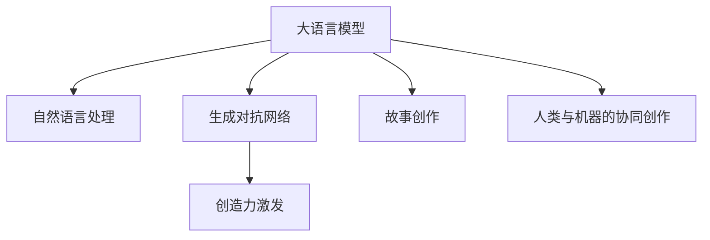

                 

# AI与创造力：用LLM讲故事的艺术

> 关键词：自然语言处理(NLP),语言模型(LM),生成对抗网络(GAN),创造力激发,人类与机器的协同

## 1. 背景介绍

### 1.1 问题由来

随着人工智能技术的不断进步，尤其是在自然语言处理（Natural Language Processing, NLP）领域，预训练语言模型（Pre-trained Language Models, PLMs）如OpenAI的GPT系列、Google的BERT等大语言模型（Large Language Models, LLMs）已经展现出强大的生成能力。这些模型通过在海量无标签文本数据上进行预训练，学习到了丰富的语言知识和表达能力，具备了从大量文本数据中提取和生成新文本的能力。

然而，尽管这些大语言模型在生成文本的连贯性、流畅性和准确性方面表现出色，但其创造力和创新能力仍然存在局限。特别是在故事创作、诗歌生成、艺术作品创作等创意类任务中，如何激发并引导大语言模型的创造力，成为AI研究的一个重要方向。

### 1.2 问题核心关键点

为了激发和引导大语言模型的创造力，研究者们提出了多种方法和技术。以下是核心问题所在：

- 如何利用大语言模型生成具有高度创意性的文本？
- 如何在故事创作、诗歌生成等任务中，更好地引导模型按照人类期望的方式生成文本？
- 如何实现人类与机器的协同创作，最大化机器对人类创造力的辅助作用？

本文将聚焦于语言模型（Language Models, LM），尤其是基于生成对抗网络（Generative Adversarial Networks, GANs）的生成模型，探讨如何用LLM讲故事的艺术，并给出相关的算法原理、操作步骤、应用案例及前景展望。

## 2. 核心概念与联系

### 2.1 核心概念概述

在探讨如何用LLM讲故事的艺术之前，首先需要理解以下几个核心概念：

- **大语言模型（Large Language Models, LLMs）**：以自回归模型（如GPT）或自编码模型（如BERT）为代表的大规模预训练语言模型，通过在大规模无标签文本语料上进行预训练，学习到通用的语言表示，具备强大的语言理解和生成能力。

- **自然语言处理（Natural Language Processing, NLP）**：涉及计算机对自然语言的理解、处理和生成。其核心目标是使机器能够像人一样理解和处理自然语言。

- **生成对抗网络（Generative Adversarial Networks, GANs）**：由Ian Goodfellow提出的一种深度学习模型，包含生成器和判别器两个部分，通过对抗训练生成高质量的合成数据。

- **创造力激发（Creativity Generation）**：利用AI模型引导并激发人类的创造力和创造性思维，实现更丰富、更有创意性的文本生成。

- **故事创作（Story Writing）**：利用语言模型生成连贯、结构合理的故事，增强AI模型的故事叙述能力。

- **人类与机器的协同创作（Human-Machine Collaborative Creativity）**：探索如何在创意类任务中，将人类的创造力和机器的生成能力相结合，实现更好的创作效果。

这些核心概念之间的逻辑关系可以通过以下Mermaid流程图来展示：



这个流程图展示了大语言模型的核心概念及其之间的关系：

1. 大语言模型通过预训练获得基础能力。
2. 自然语言处理为模型提供了理解文本的能力。
3. 生成对抗网络提升模型的生成质量。
4. 创造力激发和故事创作为模型引入创新和创意。
5. 人类与机器的协同创作进一步提升创作效果。

这些概念共同构成了大语言模型的创意生成框架，使其能够在各种场景下发挥强大的语言生成能力。

## 3. 核心算法原理 & 具体操作步骤

### 3.1 算法原理概述

本节将介绍基于生成对抗网络（GANs）的生成模型（Generative Model），这种模型通过让生成器（Generator）和判别器（Discriminator）互相对抗，提升生成文本的质量和创意性。

### 3.2 算法步骤详解

#### 步骤1: 准备生成模型和数据集

- **生成器（Generator）**：一个以自然语言为基础的生成器，能够从噪声或随机向量中生成文本。常用的生成器包括GPT、Transformer等。
- **判别器（Discriminator）**：一个以自然语言为基础的判别器，用于区分生成的文本与真实文本。常用的判别器包括卷积神经网络（CNN）、循环神经网络（RNN）等。
- **训练数据集**：包括预训练语言模型生成的语料，以及标记为真实的语料。

#### 步骤2: 定义生成器和判别器的损失函数

- **生成器的损失函数**：判别器错误区分生成文本的概率（即生成器产生的文本，判别器认为其真实）加上生成器的拉普拉斯正则化项（防止生成器过拟合）。
- **判别器的损失函数**：生成器产生的文本被正确识别的概率（即判别器将生成文本识别为真实文本）加上生成器产生的文本被错误识别的概率（即判别器将生成文本识别为假文本）。

#### 步骤3: 对抗训练

- 交替训练生成器和判别器，生成器生成文本，判别器尝试区分真实文本和生成文本，双方不断对抗，提升生成文本的质量和创意性。

#### 步骤4: 创造力激发和故事创作

- 使用训练好的生成器模型，根据用户输入的种子文本（Seed Text）或初始文本（Initial Text），生成创意性的文本，进而创作故事、诗歌或其他文学作品。

### 3.3 算法优缺点

#### 优点

- 能够生成高质量、有创意性的文本。
- 模型灵活，可以应用于多种创意类任务，如故事创作、诗歌生成等。
- 生成文本的可控性强，可以根据用户输入的种子文本生成特定风格和主题的文本。

#### 缺点

- 生成文本的质量和创意性取决于训练数据集的质量。
- 训练过程复杂，需要大量计算资源和时间。
- 生成文本的连贯性和逻辑性仍需进一步改进。

### 3.4 算法应用领域

基于GAN的生成模型在故事创作、诗歌生成、艺术作品创作等领域有广泛的应用。

#### 故事创作

通过收集大量经典文学作品，提取其特征，利用GAN模型训练生成器，生成新的故事。生成器可以根据用户输入的种子文本生成新的故事续写，甚至创作全新的故事。

#### 诗歌生成

利用GAN模型生成具有特定风格、情感的诗歌。生成器可以根据用户输入的主题、情感或风格生成符合要求的诗歌，极大丰富了诗歌创作的工具和形式。

#### 艺术作品创作

将GAN模型应用于视觉艺术作品的生成，如绘画、雕塑等。生成器可以根据用户的描述生成对应的艺术作品，扩展了艺术创作的方式和形式。

## 4. 数学模型和公式 & 详细讲解 & 举例说明（备注：数学公式请使用latex格式，latex嵌入文中独立段落使用 $$，段落内使用 $)
### 4.1 数学模型构建

#### 生成器的定义

假设生成器为 $G$，输入为噪声向量 $\epsilon$，生成器的输出为文本 $x$。生成器可以表示为：

$$ G(\epsilon) = f(x; \theta_G) $$

其中，$f$ 是生成器的映射函数，$\theta_G$ 是生成器的参数。

#### 判别器的定义

假设判别器为 $D$，输入为文本 $x$，输出为真实性标签 $y$。判别器的输出可以表示为：

$$ D(x) = g(x; \theta_D) $$

其中，$g$ 是判别器的映射函数，$\theta_D$ 是判别器的参数。

### 4.2 公式推导过程

#### 生成器的损失函数

生成器的损失函数 $L_G$ 定义为：

$$ L_G = E_{\epsilon}[\log D(G(\epsilon))] + \lambda \| \nabla_{\epsilon} G(\epsilon) \| $$

其中，$E_{\epsilon}$ 表示对噪声向量 $\epsilon$ 的期望，$\lambda$ 是拉普拉斯正则化系数。

#### 判别器的损失函数

判别器的损失函数 $L_D$ 定义为：

$$ L_D = E_{x}[\log D(x)] + E_{\epsilon}[\log (1 - D(G(\epsilon)))] $$

其中，$E_x$ 表示对真实文本 $x$ 的期望。

### 4.3 案例分析与讲解

#### 案例1: 故事创作

假设我们有一个故事创作任务，目标是生成一个包含特定情感的连贯故事。我们首先收集大量带有相应情感的故事，作为训练数据。然后，使用GAN模型训练生成器，使其能够生成符合情感要求的故事。用户输入一个简短的种子文本，生成器根据种子文本生成后续的故事内容。通过不断优化生成器和判别器，生成高质量、具有创意性的故事。

#### 案例2: 诗歌生成

假设我们有一个诗歌生成任务，目标是生成一首符合特定风格、情感的诗歌。我们首先收集大量符合该风格和情感的诗歌，作为训练数据。然后，使用GAN模型训练生成器，使其能够生成符合要求风格的诗歌。用户输入一个主题或情感，生成器根据用户输入生成符合要求的诗歌。通过不断优化生成器和判别器，生成高质量、具有创意性的诗歌。

## 5. 项目实践：代码实例和详细解释说明
### 5.1 开发环境搭建

在进行项目实践前，我们需要准备好开发环境。以下是使用Python进行PyTorch开发的环境配置流程：

1. 安装Anaconda：从官网下载并安装Anaconda，用于创建独立的Python环境。

2. 创建并激活虚拟环境：
```bash
conda create -n pytorch-env python=3.8 
conda activate pytorch-env
```

3. 安装PyTorch：根据CUDA版本，从官网获取对应的安装命令。例如：
```bash
conda install pytorch torchvision torchaudio cudatoolkit=11.1 -c pytorch -c conda-forge
```

4. 安装Transformers库：
```bash
pip install transformers
```

5. 安装各类工具包：
```bash
pip install numpy pandas scikit-learn matplotlib tqdm jupyter notebook ipython
```

完成上述步骤后，即可在`pytorch-env`环境中开始项目实践。

### 5.2 源代码详细实现

以下是使用PyTorch和Transformers库进行故事创作任务的项目代码实现。

#### 定义生成器和判别器

```python
import torch
import torch.nn as nn
import torch.nn.functional as F

class Generator(nn.Module):
    def __init__(self, input_dim, output_dim):
        super(Generator, self).__init__()
        self.fc1 = nn.Linear(input_dim, 256)
        self.fc2 = nn.Linear(256, 256)
        self.fc3 = nn.Linear(256, output_dim)
        
    def forward(self, x):
        x = F.relu(self.fc1(x))
        x = F.relu(self.fc2(x))
        return self.fc3(x)

class Discriminator(nn.Module):
    def __init__(self, input_dim, output_dim):
        super(Discriminator, self).__init__()
        self.fc1 = nn.Linear(input_dim, 256)
        self.fc2 = nn.Linear(256, 256)
        self.fc3 = nn.Linear(256, output_dim)
        
    def forward(self, x):
        x = F.relu(self.fc1(x))
        x = F.relu(self.fc2(x))
        return self.fc3(x)
```

#### 定义损失函数

```python
class GANLoss(nn.Module):
    def __init__(self):
        super(GANLoss, self).__init__()
        
    def forward(self, G, D, x, y, lambda_l1):
        real_loss = D(x).mean()
        fake_loss = D(G(y)).mean()
        l1_loss = torch.abs(y - G(y)).mean()
        loss = -real_loss + fake_loss + lambda_l1 * l1_loss
        return loss
```

#### 训练函数

```python
def train(G, D, G_optimizer, D_optimizer, x, y, batch_size, n_epochs):
    for epoch in range(n_epochs):
        for i in range(0, len(x), batch_size):
            batch_x = x[i:i+batch_size]
            batch_y = y[i:i+batch_size]
            
            real_loss = D(batch_x).mean()
            fake_loss = D(G(batch_y)).mean()
            l1_loss = torch.abs(batch_y - G(batch_y)).mean()
            
            G_optimizer.zero_grad()
            G_loss = -real_loss + fake_loss + lambda_l1 * l1_loss
            G_loss.backward()
            G_optimizer.step()
            
            D_optimizer.zero_grad()
            D_loss = -real_loss + fake_loss
            D_loss.backward()
            D_optimizer.step()
            
        if (epoch + 1) % 100 == 0:
            print(f'Epoch {epoch+1}, G Loss: {G_loss:.4f}, D Loss: {D_loss:.4f}')
```

#### 测试函数

```python
def generate(G, G_optimizer, x, n_samples):
    G_optimizer.zero_grad()
    G.eval()
    with torch.no_grad():
        gen_x = G(x)
        gen_x = gen_x.data.numpy()
    G.train()
    return gen_x
```

### 5.3 代码解读与分析

让我们再详细解读一下关键代码的实现细节：

**Generator和Discriminator类**：
- 定义了生成器和判别器的结构，均采用简单的全连接网络，输入维度分别为1（噪声向量）和文本的维度。
- 生成器将噪声向量映射到文本空间，判别器则将文本输出映射到真实性标签空间。

**GANLoss类**：
- 定义了GAN模型的损失函数，包括真实文本的判别损失、生成文本的判别损失以及拉普拉斯正则化损失。

**train函数**：
- 定义了GAN模型的训练过程，交替训练生成器和判别器。每个epoch中，随机选取样本，计算损失并反向传播更新模型参数。

**generate函数**：
- 使用训练好的生成器生成新文本。生成器在评估模式下进行，不进行梯度更新。

这些关键代码实现了基本的GAN模型框架，后续通过进一步优化训练策略和生成器网络结构，可以提升模型生成文本的质量和创意性。

## 6. 实际应用场景

### 6.1 故事创作

基于GAN模型的故事创作系统，可以帮助作家或内容创作者生成富有创意性的故事。例如，利用GAN模型生成具有特定情感、风格的故事续写，辅助作家创作小说。

在实际应用中，可以先收集大量经典文学作品，提取其情感、风格等特征，作为训练数据。然后，利用GAN模型训练生成器，使其能够根据用户输入的种子文本生成符合情感和风格要求的故事。用户可以通过输入简单的故事情节或情感描述，启动生成器生成新的故事续写。

### 6.2 诗歌生成

诗歌生成也是GAN模型在创意类任务中的一个重要应用。通过收集大量诗歌，提取其风格、情感等特征，训练生成器，用户可以根据情感、风格或主题输入要求，生成符合要求的诗歌。

### 6.3 艺术作品创作

GAN模型还被应用于视觉艺术作品的创作。例如，利用GAN模型生成符合用户描述要求的绘画、雕塑等艺术作品。用户可以输入简要的艺术描述，生成器生成对应的艺术作品。

## 7. 工具和资源推荐

### 7.1 学习资源推荐

为了帮助开发者系统掌握大语言模型微调的理论基础和实践技巧，这里推荐一些优质的学习资源：

1. 《Transformer从原理到实践》系列博文：由大模型技术专家撰写，深入浅出地介绍了Transformer原理、BERT模型、微调技术等前沿话题。

2. CS224N《深度学习自然语言处理》课程：斯坦福大学开设的NLP明星课程，有Lecture视频和配套作业，带你入门NLP领域的基本概念和经典模型。

3. 《Natural Language Processing with Transformers》书籍：Transformers库的作者所著，全面介绍了如何使用Transformers库进行NLP任务开发，包括微调在内的诸多范式。

4. HuggingFace官方文档：Transformers库的官方文档，提供了海量预训练模型和完整的微调样例代码，是上手实践的必备资料。

5. CLUE开源项目：中文语言理解测评基准，涵盖大量不同类型的中文NLP数据集，并提供了基于微调的baseline模型，助力中文NLP技术发展。

通过对这些资源的学习实践，相信你一定能够快速掌握大语言模型微调的精髓，并用于解决实际的NLP问题。

### 7.2 开发工具推荐

高效的开发离不开优秀的工具支持。以下是几款用于大语言模型微调开发的常用工具：

1. PyTorch：基于Python的开源深度学习框架，灵活动态的计算图，适合快速迭代研究。大部分预训练语言模型都有PyTorch版本的实现。

2. TensorFlow：由Google主导开发的开源深度学习框架，生产部署方便，适合大规模工程应用。同样有丰富的预训练语言模型资源。

3. Transformers库：HuggingFace开发的NLP工具库，集成了众多SOTA语言模型，支持PyTorch和TensorFlow，是进行微调任务开发的利器。

4. Weights & Biases：模型训练的实验跟踪工具，可以记录和可视化模型训练过程中的各项指标，方便对比和调优。与主流深度学习框架无缝集成。

5. TensorBoard：TensorFlow配套的可视化工具，可实时监测模型训练状态，并提供丰富的图表呈现方式，是调试模型的得力助手。

6. Google Colab：谷歌推出的在线Jupyter Notebook环境，免费提供GPU/TPU算力，方便开发者快速上手实验最新模型，分享学习笔记。

合理利用这些工具，可以显著提升大语言模型微调任务的开发效率，加快创新迭代的步伐。

### 7.3 相关论文推荐

大语言模型和微调技术的发展源于学界的持续研究。以下是几篇奠基性的相关论文，推荐阅读：

1. Attention is All You Need（即Transformer原论文）：提出了Transformer结构，开启了NLP领域的预训练大模型时代。

2. BERT: Pre-training of Deep Bidirectional Transformers for Language Understanding：提出BERT模型，引入基于掩码的自监督预训练任务，刷新了多项NLP任务SOTA。

3. Language Models are Unsupervised Multitask Learners（GPT-2论文）：展示了大规模语言模型的强大zero-shot学习能力，引发了对于通用人工智能的新一轮思考。

4. Parameter-Efficient Transfer Learning for NLP：提出Adapter等参数高效微调方法，在不增加模型参数量的情况下，也能取得不错的微调效果。

5. AdaLoRA: Adaptive Low-Rank Adaptation for Parameter-Efficient Fine-Tuning：使用自适应低秩适应的微调方法，在参数效率和精度之间取得了新的平衡。

6. Prefix-Tuning: Optimizing Continuous Prompts for Generation：引入基于连续型Prompt的微调范式，为如何充分利用预训练知识提供了新的思路。

这些论文代表了大语言模型微调技术的发展脉络。通过学习这些前沿成果，可以帮助研究者把握学科前进方向，激发更多的创新灵感。

## 8. 总结：未来发展趋势与挑战

### 8.1 总结

本文对基于生成对抗网络的大语言模型创作方法进行了全面系统的介绍。首先阐述了生成对抗网络的基本原理和操作步骤，探讨了其在故事创作、诗歌生成等创意类任务中的应用。其次，通过具体的代码实现，展示了如何构建和训练生成对抗网络，生成高质量的创意文本。同时，本文还广泛探讨了生成对抗网络在故事创作、诗歌生成等领域的实际应用前景，展示了其在人工智能创意生成领域的广阔前景。

通过本文的系统梳理，可以看到，生成对抗网络作为大语言模型创作的有效工具，已经在创意类任务中展现出了强大的潜力。随着技术的不断发展，相信生成对抗网络将会在更多领域得到应用，为人工智能创意生成带来新的突破。

### 8.2 未来发展趋势

展望未来，生成对抗网络技术将呈现以下几个发展趋势：

1. 更加高效的生成算法。随着计算能力的提升，未来生成对抗网络的训练速度将大幅提升，生成文本的质量和速度将进一步提升。

2. 多模态生成能力的提升。除了文本生成，生成对抗网络还将拓展到图像、语音等多模态数据的生成。多模态数据的整合，将进一步提升创意生成系统的表现。

3. 更加灵活的生成模型。未来的生成对抗网络将更加注重模型的灵活性，能够根据不同任务和需求进行快速定制和调整。

4. 更加智能的生成控制。通过引入更多的交互式控制方式，如自然语言控制、用户交互等，使生成对抗网络更加智能化，能够根据用户的偏好和需求进行生成。

5. 更加高效和可控的生成过程。未来的生成对抗网络将更加注重生成过程的可控性和高效性，减少资源消耗，提高生成速度和质量。

以上趋势凸显了生成对抗网络技术的广阔前景。这些方向的探索发展，必将进一步提升人工智能创意生成系统的性能和应用范围，为创意类任务带来新的突破。

### 8.3 面临的挑战

尽管生成对抗网络技术已经取得了瞩目成就，但在迈向更加智能化、普适化应用的过程中，它仍面临着诸多挑战：

1. 生成文本的质量和创意性仍需进一步提升。目前生成文本的连贯性和逻辑性仍存在不足，未来的研究需要进一步优化生成模型的结构，提升文本生成质量。

2. 生成模型的训练过程复杂，计算资源消耗较大。未来需要研究更加高效的训练算法，减少计算资源的消耗，提升训练速度。

3. 生成文本的可控性仍需增强。目前生成文本的可控性有限，未来的研究需要引入更多的交互式控制方式，提高生成过程的可控性。

4. 生成对抗网络的稳定性有待提高。目前生成对抗网络的稳定性仍存在一定问题，未来的研究需要进一步优化模型结构，提高模型的稳定性。

5. 生成对抗网络的适用性仍需拓展。目前生成对抗网络主要应用于文本生成，未来的研究需要拓展其应用范围，应用于更多领域的创意生成任务。

6. 生成对抗网络的安全性有待保障。目前生成对抗网络存在一定的安全风险，未来的研究需要进一步增强模型的安全性，避免生成有害内容。

正视生成对抗网络面临的这些挑战，积极应对并寻求突破，将使其在创意生成领域发挥更大的作用。相信随着技术的不断进步，生成对抗网络必将在人工智能创意生成领域取得更大的成就。

### 8.4 研究展望

面对生成对抗网络面临的挑战，未来的研究需要在以下几个方面寻求新的突破：

1. 探索更加高效的生成算法。研究更加高效的生成算法，提升生成文本的质量和速度。

2. 研究更加灵活和智能的生成模型。研究更加灵活和智能的生成模型，使其能够根据不同任务和需求进行快速定制和调整。

3. 引入更多的交互式控制方式。引入更多的交互式控制方式，如自然语言控制、用户交互等，使生成对抗网络更加智能化，能够根据用户的偏好和需求进行生成。

4. 研究更加高效和可控的生成过程。研究更加高效和可控的生成过程，减少资源消耗，提高生成速度和质量。

5. 增强生成对抗网络的安全性和稳定性。增强生成对抗网络的安全性和稳定性，避免生成有害内容，提高模型的可靠性。

6. 拓展生成对抗网络的适用性。拓展生成对抗网络的适用性，应用于更多领域的创意生成任务，如视觉艺术创作、游戏设计等。

这些研究方向的探索，必将引领生成对抗网络技术迈向更高的台阶，为人工智能创意生成带来新的突破。面向未来，生成对抗网络技术还需要与其他人工智能技术进行更深入的融合，如知识表示、因果推理、强化学习等，多路径协同发力，共同推动自然语言理解和智能交互系统的进步。只有勇于创新、敢于突破，才能不断拓展人工智能创意生成的边界，让智能技术更好地造福人类社会。

## 9. 附录：常见问题与解答

**Q1：大语言模型创作中的创意来源从何而来？**

A: 大语言模型创作中的创意来源主要来自于两个方面：
1. 大量的训练数据：通过在大规模文本数据上预训练，大语言模型能够学习到丰富的语言知识和表达方式，从而能够生成多样化的文本。
2. 输入的种子文本：通过用户输入的种子文本，大语言模型能够生成更加贴合用户需求的文本，从而激发更多的创意。

**Q2：如何提高生成文本的可控性和质量？**

A: 提高生成文本的可控性和质量，可以从以下几个方面入手：
1. 数据质量：收集高质量的训练数据，确保模型能够学习到丰富的语言知识和表达方式。
2. 模型结构：优化生成模型的结构，提升文本生成的质量。
3. 控制方式：引入更多的交互式控制方式，如自然语言控制、用户交互等，提高生成过程的可控性。
4. 训练算法：研究更加高效的训练算法，减少计算资源的消耗，提升训练速度和生成质量。

**Q3：大语言模型创作中存在哪些伦理和安全问题？**

A: 大语言模型创作中存在以下伦理和安全问题：
1. 生成有害内容：大语言模型可能生成有害、虚假的内容，如仇恨言论、暴力内容等，对社会造成不良影响。
2. 版权问题：大语言模型可能生成侵犯版权的内容，对原作者造成损害。
3. 信息安全：大语言模型可能被用于生成虚假信息，扰乱网络安全。
4. 偏见和歧视：大语言模型可能学习到数据中的偏见和歧视，导致生成文本带有性别、种族等偏见。

针对这些问题，需要在模型训练和应用过程中引入相应的限制和监管机制，确保生成文本的合法性和安全性。

---

作者：禅与计算机程序设计艺术 / Zen and the Art of Computer Programming

