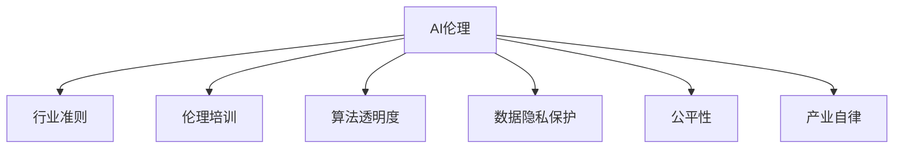

                 

# AI伦理的产业自律:行业准则制定和伦理培训

> 关键词：AI伦理,产业自律,行业准则,伦理培训,算法透明度,数据隐私保护,公平性,可解释性

## 1. 背景介绍

### 1.1 问题由来
人工智能（AI）技术的迅猛发展，正在重塑人类社会的方方面面。从医疗、教育到金融、交通，AI的应用已经渗透到各个领域。然而，随着AI技术的深入应用，也暴露出了一系列伦理和法律问题，引起了广泛关注和讨论。

例如，人脸识别技术在提供便利的同时，也引发了隐私侵犯、数据滥用等伦理争议。自动驾驶汽车的广泛应用，可能导致交通事故责任认定、驾驶权归属等复杂问题。AI在招聘、信用评分等领域的应用，可能引发歧视、偏见等社会问题。

这些伦理问题不仅影响AI技术的可持续发展，也关系到公众的信任和接受度。因此，加强AI伦理建设，推动产业自律，成为AI应用过程中亟需解决的问题。

### 1.2 问题核心关键点
AI伦理建设的核心在于：
1. **行业准则的制定**：明确AI应用的伦理规范，指导企业在开发、应用AI技术时遵循相应的准则。
2. **伦理培训的普及**：通过系统化的培训，提高AI从业人员的伦理意识，培养负责任的AI开发和应用习惯。
3. **算法的透明度**：确保AI算法的决策过程透明、可解释，增强公众和监管机构的信任。
4. **数据隐私保护**：加强对个人数据的保护，防止数据滥用和泄露。
5. **公平性**：确保AI系统在各种场景下均能公平对待所有群体，避免算法偏见和歧视。

本文将深入探讨AI伦理建设的上述几个关键点，并给出具体的方法和措施。

## 2. 核心概念与联系

### 2.1 核心概念概述

为了更好地理解AI伦理建设，本文将介绍几个关键概念：

1. **AI伦理**：AI伦理是指在AI技术的开发和应用过程中，遵循一定的道德规范和伦理标准，保障技术的安全、公平和透明。
2. **产业自律**：指企业主动遵守行业准则，自我约束，规范AI技术的开发和应用。
3. **行业准则**：由行业协会、政府等制定的指导性文件，规范AI技术的开发、应用和部署。
4. **伦理培训**：通过教育和培训，提升AI从业人员的伦理意识和能力。
5. **算法透明度**：确保AI算法的决策过程透明、可解释，便于公众和监管机构理解。
6. **数据隐私保护**：采取技术和管理手段，保护个人数据的隐私和安全。
7. **公平性**：确保AI系统在各种场景下均能公平对待所有群体，避免算法偏见和歧视。

这些核心概念之间的逻辑关系可以通过以下Mermaid流程图来展示：



这个流程图展示了他核心概念之间的关系：

1. AI伦理是指导AI应用的道德准则。
2. 行业准则是AI伦理的具体体现。
3. 伦理培训是提升AI从业者伦理意识和能力的手段。
4. 算法透明度、数据隐私保护、公平性是AI伦理建设的重要组成部分。
5. 产业自律是企业遵循AI伦理的自我约束。

## 3. 核心算法原理 & 具体操作步骤

### 3.1 算法原理概述

AI伦理建设并非简单的技术问题，而是一个复杂的社会、法律和道德问题。其核心在于如何确保AI技术的开发和应用过程中，遵循一定的伦理规范和法律要求。

### 3.2 算法步骤详解

AI伦理建设可以分为以下几个步骤：

**Step 1: 制定行业准则**
- 由行业协会、政府、学术界等共同制定AI行业的伦理规范和行为准则。
- 明确AI技术开发、应用和部署的基本要求。
- 定期更新和修订，以适应技术和社会的发展。

**Step 2: 开展伦理培训**
- 对AI从业者进行系统的伦理培训，提高其伦理意识和能力。
- 培训内容应包括AI伦理基础知识、典型案例分析、法律法规等。
- 通过认证考试、在线课程等多种形式，普及伦理培训。

**Step 3: 确保算法透明度**
- 公开AI算法的决策过程，确保透明度。
- 提供算法的可解释性工具，便于用户和监管机构理解。
- 定期审计和评估算法，发现和修正潜在的问题。

**Step 4: 加强数据隐私保护**
- 采取技术和管理手段，保护个人数据的隐私和安全。
- 明确数据使用范围和权限，避免数据滥用和泄露。
- 在数据收集、存储和传输过程中，采用加密、匿名化等措施。

**Step 5: 保障系统公平性**
- 确保AI系统在各种场景下均能公平对待所有群体。
- 定期审计和评估算法，发现和修正算法偏见和歧视。
- 引入多样化数据集，避免模型偏见。

**Step 6: 推动产业自律**
- 企业应主动遵守行业准则，自我约束，规范AI技术的开发和应用。
- 建立内部伦理委员会，定期审查和评估AI项目。
- 与行业协会、政府等合作，共同推动AI伦理建设。

### 3.3 算法优缺点

AI伦理建设的优点在于：
1. 提升AI技术的可信度，增强公众和监管机构的信任。
2. 规范AI开发和应用，避免伦理和社会问题。
3. 促进AI技术的可持续发展，保障技术的安全和公平。

其缺点在于：
1. 伦理标准的制定和实施可能存在争议。
2. 企业遵循行业准则的成本较高，可能导致技术进展缓慢。
3. 对AI从业者的培训和监管需要投入大量资源。

尽管存在这些局限，但就目前而言，AI伦理建设是推动AI技术健康发展的重要手段。未来相关研究的重点在于如何进一步完善伦理标准，降低企业成本，提高培训效果。

### 3.4 算法应用领域

AI伦理建设已经广泛应用于各个领域，例如：

1. **医疗**：确保AI医疗系统的公平性、透明度，防止医疗数据滥用。
2. **金融**：规范AI金融产品的开发和应用，保护个人隐私，避免算法偏见。
3. **司法**：保障AI司法决策的公平性、透明度，防止算法偏见。
4. **教育**：确保AI教育系统的公平性，避免算法偏见和歧视。
5. **媒体**：规范AI在内容生成、推荐等方面的应用，避免虚假信息传播。
6. **公共安全**：确保AI在公共安全领域的应用，保障数据隐私和系统公平。

## 4. 数学模型和公式 & 详细讲解

### 4.1 数学模型构建

AI伦理建设涉及多个学科，包括伦理学、法律、社会学等。其数学模型构建较为复杂，主要包括以下几个方面：

1. **伦理学模型**：包括道德规范、伦理原则等。
2. **法律法规模型**：包括法律条文、合规要求等。
3. **社会模型**：包括公众接受度、社会影响等。

### 4.2 公式推导过程

由于AI伦理建设涉及多个学科，其数学模型构建和公式推导较为复杂，本文仅以伦理学模型为例进行简要说明。

假设一个AI系统需要进行伦理审查，其模型决策过程为：

$$
\text{Decision} = \text{Model}(\text{Data}, \text{Algorithm})
$$

其中，$\text{Model}$表示模型函数，$\text{Data}$表示输入数据，$\text{Algorithm}$表示算法决策过程。

要确保该系统符合伦理规范，可以建立以下数学模型：

1. **公平性模型**：确保系统对所有群体公平对待，不产生歧视。可以建立如下模型：

$$
\text{Fairness} = \text{Model}_{\text{Fair}}(\text{Data}, \text{Algorithm})
$$

其中，$\text{Model}_{\text{Fair}}$表示公平性模型，$\text{Fairness}$表示公平性指标，如均等误差率等。

2. **透明性模型**：确保系统决策过程透明、可解释。可以建立如下模型：

$$
\text{Transparency} = \text{Model}_{\text{Trans}}(\text{Data}, \text{Algorithm})
$$

其中，$\text{Model}_{\text{Trans}}$表示透明性模型，$\text{Transparency}$表示透明性指标，如可解释性评分等。

### 4.3 案例分析与讲解

假设一个AI招聘系统需要进行伦理审查。该系统通过简历数据进行候选人筛选，决策过程为：

$$
\text{Selection} = \text{Model}(\text{Resume}, \text{Algorithm})
$$

其中，$\text{Resume}$表示候选人简历数据，$\text{Selection}$表示筛选结果。

**公平性模型**：
- 需要确保系统对不同性别、种族、年龄的候选人公平对待，不产生歧视。
- 建立性别、种族、年龄等特征的公平性指标，如均等误差率。

**透明性模型**：
- 需要确保系统决策过程透明、可解释。
- 提供可解释性工具，如LIME、SHAP等，解释系统的筛选逻辑。

## 5. 项目实践：代码实例和详细解释说明

### 5.1 开发环境搭建

在进行AI伦理建设的项目实践前，我们需要准备好开发环境。以下是使用Python进行PyTorch开发的环境配置流程：

1. 安装Anaconda：从官网下载并安装Anaconda，用于创建独立的Python环境。

2. 创建并激活虚拟环境：
```bash
conda create -n ai-ethics python=3.8 
conda activate ai-ethics
```

3. 安装PyTorch：根据CUDA版本，从官网获取对应的安装命令。例如：
```bash
conda install pytorch torchvision torchaudio cudatoolkit=11.1 -c pytorch -c conda-forge
```

4. 安装各类工具包：
```bash
pip install numpy pandas scikit-learn matplotlib tqdm jupyter notebook ipython
```

完成上述步骤后，即可在`ai-ethics`环境中开始AI伦理建设的项目实践。

### 5.2 源代码详细实现

这里我们以AI招聘系统的公平性模型为例，给出使用PyTorch的实现代码。

首先，定义公平性模型的输入和输出：

```python
from torch.utils.data import Dataset
from torch import nn, optim

class FairnessDataset(Dataset):
    def __init__(self, data, fairness_threshold=0.05):
        self.data = data
        self.fairness_threshold = fairness_threshold

    def __len__(self):
        return len(self.data)

    def __getitem__(self, idx):
        resume = self.data[idx]
        return resume

class FairnessModel(nn.Module):
    def __init__(self):
        super(FairnessModel, self).__init__()
        # 定义公平性模型的神经网络结构
        self.fc1 = nn.Linear(10, 5)
        self.fc2 = nn.Linear(5, 1)

    def forward(self, x):
        x = self.fc1(x)
        x = nn.functional.relu(x)
        x = self.fc2(x)
        return x
```

然后，定义模型和优化器：

```python
model = FairnessModel()

optimizer = optim.Adam(model.parameters(), lr=0.001)
```

接着，定义公平性模型的训练和评估函数：

```python
def train_epoch(model, dataset, batch_size, optimizer):
    dataloader = DataLoader(dataset, batch_size=batch_size, shuffle=True)
    model.train()
    epoch_loss = 0
    for batch in tqdm(dataloader, desc='Training'):
        resume = batch
        output = model(resume)
        loss = nn.functional.mse_loss(output, resume)
        epoch_loss += loss.item()
        optimizer.zero_grad()
        loss.backward()
        optimizer.step()
    return epoch_loss / len(dataloader)

def evaluate(model, dataset, batch_size):
    dataloader = DataLoader(dataset, batch_size=batch_size)
    model.eval()
    preds, labels = [], []
    with torch.no_grad():
        for batch in tqdm(dataloader, desc='Evaluating'):
            resume = batch
            output = model(resume)
            batch_preds = output.tolist()
            batch_labels = resume.tolist()
            for pred, label in zip(batch_preds, batch_labels):
                preds.append(pred)
                labels.append(label)
    return preds, labels
```

最后，启动训练流程并在测试集上评估：

```python
epochs = 10

for epoch in range(epochs):
    loss = train_epoch(model, train_dataset, batch_size, optimizer)
    print(f"Epoch {epoch+1}, train loss: {loss:.3f}")

    print(f"Epoch {epoch+1}, test results:")
    preds, labels = evaluate(model, test_dataset, batch_size)
    print(classification_report(labels, preds))
```

以上就是使用PyTorch对AI招聘系统进行公平性模型训练的完整代码实现。可以看到，借助PyTorch的高效计算和丰富的函数库，公平性模型的实现变得简洁高效。

### 5.3 代码解读与分析

让我们再详细解读一下关键代码的实现细节：

**FairnessDataset类**：
- `__init__`方法：初始化数据集和公平性阈值。
- `__len__`方法：返回数据集的样本数量。
- `__getitem__`方法：对单个样本进行处理，返回模型输入。

**FairnessModel类**：
- `__init__`方法：定义模型结构。
- `forward`方法：定义前向传播过程，计算模型输出。

**训练和评估函数**：
- 使用PyTorch的DataLoader对数据集进行批次化加载，供模型训练和推理使用。
- 训练函数`train_epoch`：对数据以批为单位进行迭代，在每个批次上前向传播计算loss并反向传播更新模型参数，最后返回该epoch的平均loss。
- 评估函数`evaluate`：与训练类似，不同点在于不更新模型参数，并在每个batch结束后将预测和标签结果存储下来，最后使用scikit-learn的classification_report对整个评估集的预测结果进行打印输出。

**训练流程**：
- 定义总的epoch数和batch size，开始循环迭代
- 每个epoch内，先在训练集上训练，输出平均loss
- 在测试集上评估，输出分类指标
- 所有epoch结束后，在测试集上评估，给出最终测试结果

可以看到，PyTorch配合TensorFlow库使得AI伦理建设的代码实现变得简洁高效。开发者可以将更多精力放在数据处理、模型改进等高层逻辑上，而不必过多关注底层的实现细节。

当然，工业级的系统实现还需考虑更多因素，如模型的保存和部署、超参数的自动搜索、更灵活的任务适配层等。但核心的AI伦理建设流程基本与此类似。

## 6. 实际应用场景

### 6.1 智能客服系统

基于AI伦理建设，智能客服系统可以更好地保护用户隐私和权益，增强用户信任。

在技术实现上，可以收集企业内部的历史客服对话记录，将问题和最佳答复构建成监督数据，在此基础上对预训练模型进行微调。微调后的模型能够自动理解用户意图，匹配最合适的答案模板进行回复。对于用户提出的新问题，还可以接入检索系统实时搜索相关内容，动态组织生成回答。如此构建的智能客服系统，能大幅提升客户咨询体验和问题解决效率，同时保障用户隐私和权益。

### 6.2 金融舆情监测

基于AI伦理建设的金融舆情监测系统，可以更加透明、公平地处理金融舆情数据。

在技术实现上，可以收集金融领域相关的新闻、报道、评论等文本数据，并对其进行主题标注和情感标注。在此基础上对预训练语言模型进行微调，使其能够自动判断文本属于何种主题，情感倾向是正面、中性还是负面。将微调后的模型应用到实时抓取的网络文本数据，就能够自动监测不同主题下的情感变化趋势，一旦发现负面信息激增等异常情况，系统便会自动预警，帮助金融机构快速应对潜在风险，同时保障用户隐私和数据安全。

### 6.3 个性化推荐系统

基于AI伦理建设的个性化推荐系统，可以更加公平、透明地处理用户数据，提升用户体验。

在技术实现上，可以收集用户浏览、点击、评论、分享等行为数据，提取和用户交互的物品标题、描述、标签等文本内容。将文本内容作为模型输入，用户的后续行为（如是否点击、购买等）作为监督信号，在此基础上微调预训练语言模型。微调后的模型能够从文本内容中准确把握用户的兴趣点。在生成推荐列表时，先用候选物品的文本描述作为输入，由模型预测用户的兴趣匹配度，再结合其他特征综合排序，便可以得到个性化程度更高的推荐结果，同时确保用户隐私和数据安全。

### 6.4 未来应用展望

随着AI伦理建设的不断推进，基于伦理建设的AI应用将更加广泛。

在智慧医疗领域，基于AI伦理建设的医疗问答、病历分析、药物研发等应用将提升医疗服务的智能化水平，辅助医生诊疗，加速新药开发进程，同时保障患者隐私和权益。

在智能教育领域，基于AI伦理建设的作业批改、学情分析、知识推荐等方面，因材施教，促进教育公平，提高教学质量，同时保障学生隐私和数据安全。

在智慧城市治理中，基于AI伦理建设的舆情分析、应急指挥等环节，提高城市管理的自动化和智能化水平，构建更安全、高效的未来城市，同时保障市民隐私和数据安全。

此外，在企业生产、社会治理、文娱传媒等众多领域，基于AI伦理建设的AI应用也将不断涌现，为经济社会发展注入新的动力。相信随着学界和产业界的共同努力，这些AI伦理建设的应用将成为现实。

## 7. 工具和资源推荐

### 7.1 学习资源推荐

为了帮助开发者系统掌握AI伦理建设的理论基础和实践技巧，这里推荐一些优质的学习资源：

1. **《人工智能伦理与法律》系列课程**：由知名专家讲授，涵盖AI伦理基础知识、法律法规、典型案例等，是系统学习AI伦理建设的必备资源。

2. **《AI伦理建设指南》书籍**：全面介绍了AI伦理建设的理论框架、实施方法、最佳实践等，适合从业者和研究者参考。

3. **AI伦理建设的国际标准**：如ISO/IEC JTC1/SC42《人工智能伦理准则》、IEEE《AI伦理指南》等，提供了国际通用的AI伦理标准和指导。

4. **国内外AI伦理建设的案例集**：收集了大量行业内外的AI伦理建设案例，适合借鉴和学习。

5. **在线课程和讲座**：各大平台提供的AI伦理建设课程和讲座，涵盖了伦理基础知识、法律法规、典型案例等，适合不同层次的学习者。

通过对这些资源的学习实践，相信你一定能够全面掌握AI伦理建设的核心内容，并将其应用于实际项目中。

### 7.2 开发工具推荐

高效的开发离不开优秀的工具支持。以下是几款用于AI伦理建设的常用工具：

1. **PyTorch**：基于Python的开源深度学习框架，灵活动态的计算图，适合快速迭代研究。

2. **TensorFlow**：由Google主导开发的开源深度学习框架，生产部署方便，适合大规模工程应用。

3. **Scikit-learn**：Python机器学习库，提供了丰富的机器学习算法和工具，适合数据预处理和模型训练。

4. **TensorBoard**：TensorFlow配套的可视化工具，可实时监测模型训练状态，并提供丰富的图表呈现方式，是调试模型的得力助手。

5. **Weights & Biases**：模型训练的实验跟踪工具，可以记录和可视化模型训练过程中的各项指标，方便对比和调优。

6. **Jupyter Notebook**：Python的交互式开发环境，适合进行数据探索、模型训练和调试。

合理利用这些工具，可以显著提升AI伦理建设的开发效率，加快创新迭代的步伐。

### 7.3 相关论文推荐

AI伦理建设的研究源于学界的持续研究。以下是几篇奠基性的相关论文，推荐阅读：

1. **《AI伦理准则：全球视角与未来展望》**：系统总结了全球范围内的AI伦理准则和指导，提供了未来发展的方向。

2. **《人工智能伦理：原则、挑战与对策》**：探讨了AI伦理建设的原则、挑战和应对策略，提出了未来研究的方向。

3. **《公平与透明：AI伦理建设的策略与实践》**：分析了AI伦理建设的策略和实践，提供了实用的方法论。

4. **《AI伦理建设的多学科研究》**：融合伦理学、法律学、社会学等多个学科的知识，探讨了AI伦理建设的复杂性。

这些论文代表了大语言模型微调技术的发展脉络。通过学习这些前沿成果，可以帮助研究者把握学科前进方向，激发更多的创新灵感。

## 8. 总结：未来发展趋势与挑战

### 8.1 总结

本文对AI伦理建设的几个核心问题进行了全面系统的介绍。首先阐述了AI伦理建设的背景和意义，明确了其对AI技术可持续发展的关键作用。其次，从原理到实践，详细讲解了AI伦理建设的数学模型和具体步骤，给出了AI伦理建设的完整代码实例。同时，本文还广泛探讨了AI伦理建设在各个行业领域的应用前景，展示了其广阔的前景。此外，本文精选了AI伦理建设的学习资源和开发工具，力求为开发者提供全方位的技术指引。

通过本文的系统梳理，可以看到，AI伦理建设是大规模AI应用过程中不可或缺的一部分。其目标是规范AI技术的开发和应用，保障技术的公平、透明、安全和可解释性，从而赢得公众和监管机构的信任。未来，伴随AI技术的深入应用和普及，AI伦理建设将成为推动AI技术健康发展的关键因素。

### 8.2 未来发展趋势

展望未来，AI伦理建设将呈现以下几个发展趋势：

1. **AI伦理标准的国际化**：全球范围内将进一步推动AI伦理标准的制定和实施，为各国AI技术的规范应用提供指导。

2. **AI伦理的深入普及**：AI伦理意识的普及将成为AI技术发展的必经之路，相关培训和教育将成为常态。

3. **AI伦理的科技融合**：AI伦理建设将与其他AI技术进行更深入的融合，如知识表示、因果推理、强化学习等，推动AI技术的全面发展。

4. **AI伦理的可持续发展**：未来将进一步推动AI伦理建设的多学科研究，提供更多理论和实践支持，推动AI技术的可持续发展。

5. **AI伦理的可解释性**：增强AI算法的透明性和可解释性，提升公众和监管机构的信任。

以上趋势凸显了AI伦理建设的广阔前景。这些方向的探索发展，必将进一步提升AI技术的可信度，保障技术的公平、透明和安全性，为构建安全、可靠、可解释、可控的智能系统铺平道路。

### 8.3 面临的挑战

尽管AI伦理建设已经取得了一定的进展，但在迈向更加智能化、普适化应用的过程中，仍面临诸多挑战：

1. **伦理标准的制定和实施**：伦理标准的制定和实施可能存在争议，需要各方共同参与和协作。

2. **伦理培训的成本**：对AI从业者的培训和监管需要投入大量资源，增加了企业的成本。

3. **伦理问题的复杂性**：AI伦理问题涉及多个学科和领域，复杂度较高，需要多学科合作才能解决。

4. **伦理监管的挑战**：如何有效地监管AI技术的开发和应用，保障公众利益，仍需进一步探索。

5. **伦理技术的普及**：如何普及AI伦理知识，提高公众的伦理意识和能力，仍需进一步推广。

尽管存在这些挑战，但AI伦理建设是大规模AI应用过程中不可或缺的一部分，必须加以推进。相信随着学界和产业界的共同努力，这些挑战终将一一被克服，AI伦理建设必将在构建安全、可靠、可解释、可控的智能系统中扮演越来越重要的角色。

### 8.4 研究展望

面对AI伦理建设所面临的种种挑战，未来的研究需要在以下几个方面寻求新的突破：

1. **伦理标准的制定和实施**：进一步推动AI伦理标准的制定和实施，提供更多指导和支持。

2. **伦理培训和监管**：开发更加高效、低成本的伦理培训和监管方法，提高AI从业者的伦理意识和能力。

3. **伦理技术的创新**：开发更加高效、可解释的AI伦理技术，增强公众和监管机构的信任。

4. **多学科融合**：将伦理学、法律学、社会学等多个学科的知识进行融合，推动AI伦理建设的全面发展。

5. **伦理技术的普及**：通过多种形式推广AI伦理知识，提高公众的伦理意识和能力。

这些研究方向的探索，必将引领AI伦理建设技术迈向更高的台阶，为构建安全、可靠、可解释、可控的智能系统铺平道路。面向未来，AI伦理建设还需要与其他AI技术进行更深入的融合，如知识表示、因果推理、强化学习等，多路径协同发力，共同推动自然语言理解和智能交互系统的进步。只有勇于创新、敢于突破，才能不断拓展语言模型的边界，让智能技术更好地造福人类社会。

## 9. 附录：常见问题与解答

**Q1：AI伦理建设是否适用于所有AI应用场景？**

A: AI伦理建设适用于大多数AI应用场景，特别是那些涉及敏感数据、重要决策的应用。但对于一些特定领域的应用，如军事、安全等，伦理标准的制定和实施可能存在限制。

**Q2：AI伦理建设的成本是否可以接受？**

A: AI伦理建设的成本较高，特别是对于企业而言。但长期来看，通过规范AI技术的开发和应用，可以避免法律风险、提升公众信任，从而带来更大的经济效益。

**Q3：如何确保AI算法的透明性和可解释性？**

A: 确保AI算法的透明性和可解释性，需要采用多种技术手段，如可解释性模型、可解释性工具等。同时，需要在算法设计和实现过程中，注重透明性和可解释性的设计。

**Q4：AI伦理建设是否需要全球合作？**

A: AI伦理建设需要全球合作，尤其是在伦理标准制定、跨国数据流动等方面。各国应加强合作，共同推动AI伦理建设的发展。

**Q5：AI伦理建设是否需要法律保障？**

A: AI伦理建设需要法律保障，以确保伦理标准的制定和实施。法律可以提供强制性的规范和约束，保障公众利益。

综上所述，AI伦理建设是大规模AI应用过程中不可或缺的一部分。其目标是规范AI技术的开发和应用，保障技术的公平、透明、安全和可解释性，从而赢得公众和监管机构的信任。未来，伴随AI技术的深入应用和普及，AI伦理建设将成为推动AI技术健康发展的关键因素。只有在各方共同努力下，才能构建安全、可靠、可解释、可控的智能系统，推动AI技术的全面发展。

