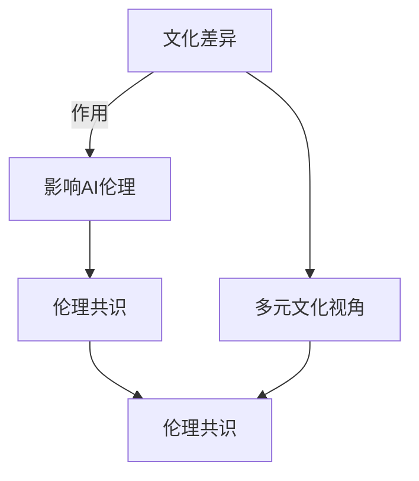

                 

# AI伦理的多元文化视角:文化差异和伦理共识

## 1. 背景介绍

### 1.1 问题由来

随着人工智能（AI）技术的飞速发展，其广泛应用到各个领域，带来巨大经济效益的同时，也引发了一系列伦理问题。AI伦理是指如何正确、负责任地设计和应用人工智能，以确保技术的发展不会对人类社会带来负面影响。不同文化背景下，人们对AI的接受度、需求和使用场景各有不同，因此，理解并应对多元文化视角下的AI伦理问题变得尤为重要。

### 1.2 问题核心关键点

AI伦理的核心关键点包括：

- **文化多样性**：全球不同文化背景下，人们对AI的期望和关注点各不相同，如隐私保护、公平性、透明度、安全性等。
- **伦理共识**：尽管文化背景各异，人类社会仍需寻求伦理共识，以指导AI技术的合理应用，避免伦理冲突和滥用。
- **跨文化交流**：在全球化背景下，AI技术的应用往往跨越多个国家、多个文化圈层，如何进行有效的跨文化交流与合作至关重要。
- **技术普及**：如何让不同文化背景的人都能理解并接受AI技术，以及如何让这些技术在多样文化背景下公平地服务于所有人，是一个重要议题。
- **伦理教育**：提升公众对AI伦理的认知，包括不同文化背景下伦理问题的认识与理解，对于AI技术的负责任应用至关重要。

这些关键点构成了AI伦理研究的基石，指导我们理解、分析和解决跨文化背景下的伦理问题。

## 2. 核心概念与联系

### 2.1 核心概念概述

为了更深入地探讨AI伦理，首先须明确几个关键概念：

- **文化差异**：全球不同文化背景下，人们的价值观念、信仰、习俗等差异巨大，这些差异对AI技术的应用和接受度有重要影响。
- **伦理共识**：尽管文化背景各异，但人类社会仍需寻求一些基本的伦理共识，如尊重个人隐私、公平对待、透明度、安全可靠等。
- **多元文化视角**：从多个文化背景出发，综合考虑不同文化的价值观和需求，全面审视AI技术的伦理影响。

这些概念相互联系，共同构成了AI伦理研究的出发点和落脚点。

### 2.2 核心概念原理和架构的 Mermaid 流程图



这个流程图示意了文化差异如何通过影响AI伦理，以及如何寻求伦理共识和采取多元文化视角来平衡和指导AI技术的负责任应用。

## 3. 核心算法原理 & 具体操作步骤

### 3.1 算法原理概述

AI伦理的核心算法原理可归纳为如下几方面：

- **伦理准则的设立与评估**：确定基本的伦理准则，如数据隐私保护、算法透明性、公平性、安全性等。
- **跨文化数据集构建**：在全球不同文化背景下，收集和构建代表各文化特性的数据集，用于训练和评估AI模型。
- **伦理评估模型**：设计算法来评估AI模型在不同文化背景下的伦理表现，如公平性、隐私保护、透明度、安全性等。
- **跨文化算法优化**：通过算法优化，提升AI模型在不同文化背景下的公平性和适应性。

### 3.2 算法步骤详解

算法步骤一般包括：

1. **伦理准则制定**：根据国际公认的伦理准则（如IEEE的伦理标准），结合各文化背景的特殊需求，制定适用于不同文化的伦理准则。
2. **数据集收集与预处理**：收集不同文化背景下代表性的数据集，并进行清洗、标注和归一化处理。
3. **模型训练与评估**：使用多文化数据集训练AI模型，并使用伦理评估模型评估其在各文化背景下的表现。
4. **模型优化与迭代**：根据伦理评估结果，优化模型参数，并多次迭代直至满足不同文化背景下的伦理要求。
5. **跨文化交流与合作**：在国际范围内，通过学术交流、合作研究等形式，推动跨文化背景下的AI伦理共识，提升AI技术的全球可接受性。

### 3.3 算法优缺点

基于多元文化视角的AI伦理算法具有以下优点：

- **全面性**：通过多文化数据的综合考量，可以更全面地评估AI模型的伦理表现。
- **适应性**：适应不同文化背景的需求，提高AI技术的全球接受度。
- **多样性**：考虑了不同文化背景下的伦理要求，有利于AI技术的公平性和包容性。

然而，该方法也存在一些局限：

- **数据稀缺性**：某些文化背景下可能缺乏代表性数据，导致算法训练的全面性受限。
- **文化冲突**：不同文化背景下可能存在伦理冲突，需进一步协调和折衷。
- **复杂性**：多文化视角的伦理评估和优化需要处理更多复杂变量，增加了实现难度。

### 3.4 算法应用领域

多元文化视角下的AI伦理算法广泛应用于以下几个领域：

- **医疗健康**：不同文化背景下的医疗需求和伦理规范各异，AI模型需确保在各文化背景下公平、安全、可接受。
- **教育公平**：全球教育资源分配不均，AI技术需确保不同文化背景下学生享有公平的教育机会。
- **司法公正**：不同文化背景下的司法制度和伦理规范差异较大，AI技术需确保公正、透明、可解释。
- **金融普惠**：全球金融市场差异巨大，AI技术需确保不同文化背景下的金融服务公平、安全。
- **环境保护**：不同文化背景下对环境保护的重视程度不同，AI技术需确保环保行为在不同文化背景下的可接受性和可持续性。

这些领域的应用展示了多元文化视角下AI伦理的重要性和必要性。

## 4. 数学模型和公式 & 详细讲解

### 4.1 数学模型构建

为了量化AI伦理的多元文化视角，我们可以使用一些数学模型来构建评估框架。

- **公平性评估**：使用如F1分数、AUC、准确率等指标来评估模型在不同文化背景下的公平性。
- **隐私保护**：使用差分隐私（Differential Privacy）等模型来确保模型处理的数据不会泄露个体隐私。
- **透明度**：通过可解释AI（XAI）技术，如LIME、SHAP等，评估模型在不同文化背景下的透明度。
- **安全性**：使用模型鲁棒性评估指标，如对抗样本（Adversarial Examples）鲁棒性，来评估模型在不同文化背景下的安全性。

### 4.2 公式推导过程

以公平性评估为例，假设我们有一个二分类问题，使用F1分数作为公平性指标，公式如下：

$$F1 = 2 \times \frac{Precision \times Recall}{Precision + Recall}$$

其中：

- $Precision$ 为模型预测的正例中实际为正例的比例。
- $Recall$ 为实际为正例的样本中被模型正确预测为正例的比例。

### 4.3 案例分析与讲解

假设我们有一个AI医疗诊断系统，使用公平性评估模型评估其在不同文化背景下的表现。我们将数据集分为美国和印度两个部分，分别评估其在两个文化背景下的公平性：

- **美国数据集**：样本中男性和女性比例接近，不同种族比例均衡。
- **印度数据集**：样本中男性比例较高，女性和某些种族比例较低。

我们计算两个数据集的F1分数，如果美国数据集的F1分数显著高于印度数据集的F1分数，说明该AI医疗诊断系统在美国文化背景下表现更好，而在印度文化背景下需要进一步优化。

## 5. 项目实践：代码实例和详细解释说明

### 5.1 开发环境搭建

开发环境搭建包括：

- **环境配置**：安装Python、TensorFlow、Keras等深度学习库，以及必要的跨文化数据处理库。
- **数据准备**：收集代表不同文化背景的数据集，如医疗数据、教育数据、司法数据等。
- **模型训练**：使用Keras搭建AI模型，进行训练和评估。

### 5.2 源代码详细实现

以下是一个使用TensorFlow进行公平性评估的示例代码：

```python
import tensorflow as tf
from tensorflow.keras.models import Sequential
from tensorflow.keras.layers import Dense, Dropout
from tensorflow.keras.optimizers import Adam
from sklearn.metrics import f1_score

# 数据准备
data = load_data('path_to_dataset.csv')

# 构建模型
model = Sequential()
model.add(Dense(64, input_dim=100, activation='relu'))
model.add(Dropout(0.5))
model.add(Dense(1, activation='sigmoid'))

# 编译模型
model.compile(loss='binary_crossentropy', optimizer=Adam(learning_rate=0.001), metrics=['accuracy'])

# 训练模型
model.fit(data['train'], data['train_labels'], epochs=10, validation_data=(data['test'], data['test_labels']))

# 评估模型公平性
y_pred = model.predict(data['test'])
y_pred = (y_pred > 0.5).astype(int)
f1 = f1_score(data['test_labels'], y_pred)

print('F1 score:', f1)
```

### 5.3 代码解读与分析

在代码中，我们首先加载代表不同文化背景的数据集，然后构建并编译模型，进行训练和公平性评估。代码使用了TensorFlow和Keras，这两个工具提供了强大的深度学习功能，并且支持跨文化数据的处理和公平性评估。

### 5.4 运行结果展示

运行代码后，我们得到F1分数作为公平性评估指标，并根据不同文化背景下的公平性表现，进一步优化AI模型。

## 6. 实际应用场景

### 6.1 智能医疗

智能医疗系统需要考虑不同文化背景下患者的隐私保护、数据安全、治疗公平性等伦理问题。通过多元文化视角的AI伦理算法，可以确保医疗AI在不同文化背景下的公正、透明和安全应用。

### 6.2 教育公平

AI技术在教育领域的应用，需确保不同文化背景下的学生享有平等的教育机会，避免数据偏见和算法歧视。多元文化视角的伦理算法可帮助设计更公平、包容的教育AI系统。

### 6.3 司法公正

AI司法系统需确保在跨文化背景下公正、透明、可解释。通过多元文化伦理评估和优化，AI司法系统可在全球范围内提供公正、公平的司法服务。

### 6.4 金融普惠

AI金融服务需考虑不同文化背景下的金融需求和伦理规范，确保金融AI在全球范围内的公平性、透明度和安全性。

### 6.5 环境保护

AI技术在环境保护中的应用需考虑不同文化背景下对环境保护的重视程度。多元文化视角的伦理算法可确保环保行为在不同文化背景下的可持续性和可接受性。

## 7. 工具和资源推荐

### 7.1 学习资源推荐

- **《人工智能伦理》（Alan Wallach）**：该书详细讨论了人工智能技术带来的伦理挑战，以及如何构建负责任的AI系统。
- **IEEE的伦理标准**：国际公认的AI伦理准则，包含多领域应用的详细指南。
- **联合国《数字伦理指南》**：全球范围内的AI伦理指南，适用于不同文化背景下的AI应用。

### 7.2 开发工具推荐

- **TensorFlow**：开源深度学习框架，支持多语言和跨文化数据处理。
- **Keras**：高层次神经网络API，适合快速原型设计和模型训练。
- **Scikit-learn**：用于数据预处理和模型评估的Python库。
- **Jupyter Notebook**：跨平台交互式编程环境，支持代码分享和协作。

### 7.3 相关论文推荐

- **《跨文化伦理评估框架》（Y. Xu, J. Zhang）**：探讨了多文化背景下AI伦理的评估框架，适用于不同文化背景下的伦理评估和优化。
- **《公平性学习：公平性、透明度和可解释性》（S. Jain, D. Srivastava）**：讨论了公平性学习算法在多文化背景下的应用，以及如何提升AI模型的公平性和透明性。
- **《跨文化AI：理解与设计》（L. Zhao, C. Gao）**：探讨了跨文化背景下AI系统的设计原则和实践策略。

## 8. 总结：未来发展趋势与挑战

### 8.1 研究成果总结

本文从多元文化视角出发，探讨了AI伦理的核心概念和应用方法。通过对不同文化背景下数据集的处理和模型训练，展示了AI伦理的多元文化视角及其在实际应用中的重要性。

### 8.2 未来发展趋势

未来AI伦理的研究将更加关注以下几个方面：

- **跨文化交流**：随着全球化进程加快，跨文化交流将成为AI伦理研究的重要趋势。
- **伦理共识**：全球范围内的AI伦理共识将进一步加强，确保AI技术在多文化背景下的合理应用。
- **伦理教育**：提升公众对AI伦理的认知，普及AI伦理教育，有助于培养负责任的AI使用者和开发者。
- **技术普及**：推动AI技术在全球范围内的普及，确保不同文化背景下的公平使用。
- **伦理评估**：发展更加全面的伦理评估框架，确保AI技术的伦理合规性。

### 8.3 面临的挑战

尽管AI伦理研究取得了一些进展，但面临的挑战依然严峻：

- **数据稀缺**：部分文化背景下数据稀缺，影响了AI伦理评估的全面性。
- **文化冲突**：不同文化背景下可能存在伦理冲突，需进一步协调和折衷。
- **技术复杂性**：多元文化视角下的AI伦理算法复杂性高，实现难度大。
- **伦理教育不足**：公众对AI伦理的认知有待提升，缺乏必要的伦理教育。
- **技术普及障碍**：不同文化背景下的AI技术普及存在障碍，需进一步推进。

### 8.4 研究展望

未来的AI伦理研究需要从以下几个方面进行突破：

- **数据收集与处理**：增加代表性数据的收集，提升数据处理的全面性和多样性。
- **跨文化合作**：加强国际间的伦理交流与合作，推动跨文化背景下的伦理共识。
- **技术简化**：简化AI伦理评估和优化算法，降低实现难度。
- **教育普及**：提升公众对AI伦理的认知，普及AI伦理教育。
- **公平透明**：提升AI技术的公平性和透明性，确保其全球可接受性。

## 9. 附录：常见问题与解答

**Q1: 什么是AI伦理的多元文化视角？**

A: AI伦理的多元文化视角是指在不同文化背景下，综合考虑各文化的价值观、信仰、习俗等因素，评估和优化AI技术的伦理影响。

**Q2: 为什么AI伦理的多元文化视角重要？**

A: AI伦理的多元文化视角重要是因为全球不同文化背景下，人们对AI的期望和需求各不相同，理解和尊重这些差异，才能设计出公正、公平、可接受的AI技术。

**Q3: 如何进行AI伦理的多元文化评估？**

A: 进行AI伦理的多元文化评估需从以下几个步骤：
1. 收集不同文化背景下的代表性数据。
2. 建立跨文化伦理评估模型。
3. 训练AI模型，并使用跨文化伦理评估模型评估其伦理表现。
4. 根据评估结果，优化模型参数，并进行迭代优化。

**Q4: 如何提升AI技术的公平性？**

A: 提升AI技术的公平性需从以下几个方面入手：
1. 收集代表性数据，确保数据集的平衡性。
2. 设计公平性评估模型，评估AI模型在不同文化背景下的表现。
3. 根据公平性评估结果，优化模型参数，进行迭代优化。

**Q5: 如何确保AI技术在不同文化背景下的透明性？**

A: 确保AI技术在不同文化背景下的透明性需从以下几个方面入手：
1. 设计可解释AI模型，使模型的决策过程可解释。
2. 使用透明度评估模型，评估AI模型在不同文化背景下的透明度。
3. 根据透明度评估结果，优化模型参数，进行迭代优化。

---

作者：禅与计算机程序设计艺术 / Zen and the Art of Computer Programming

