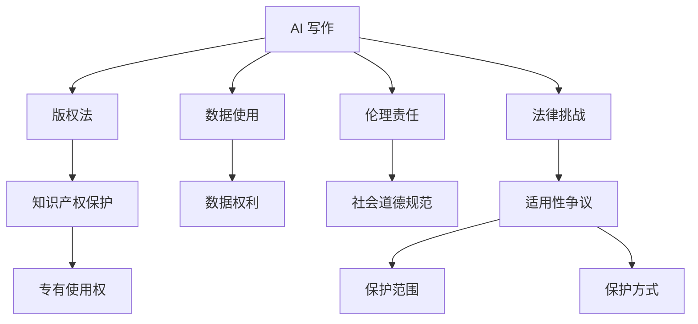

                 

# AI写作的版权问题：法律和伦理的思考

> 关键词：AI写作, 版权问题, 法律挑战, 伦理困境, 智能创作, 知识产权, 机器学习, 数据使用, 内容创作

## 1. 背景介绍

### 1.1 问题由来

随着人工智能（AI）技术的迅猛发展，AI写作已经成为可能。从简单的文本生成，到复杂的内容创作，AI 已经展现了令人惊叹的能力。然而，这些创作活动不可避免地涉及版权问题。AI 写作在创作新内容时，不可避免地会与现有的版权作品产生交集，引发了关于版权归属、使用和保护的一系列法律和伦理问题。本文将深入探讨这些问题，并分析可能的解决方案。

### 1.2 问题核心关键点

- AI 写作与版权的交叉点
- 版权法对 AI 创作的适用性
- 版权与知识产权的保护
- AI 写作中的数据使用
- 人工智能的伦理责任
- 版权法与技术发展的不匹配

## 2. 核心概念与联系

### 2.1 核心概念概述

- **AI 写作**：指利用人工智能技术，通过机器学习、自然语言处理等方法，自动生成文本内容。
- **版权**：指对文学、音乐、艺术等原创作品的一种法律保护，赋予作者对其作品的专有使用权。
- **知识产权**：包括版权、专利权、商标权等，保护创作者的经济权益。
- **数据使用**：AI 创作过程中，对训练数据的使用和处理。
- **伦理责任**：AI 创作时，应遵守的社会道德规范和伦理标准。
- **法律挑战**：版权法对 AI 创作的适用性、保护范围和保护方式。

这些概念之间的逻辑关系可以通过以下 Mermaid 流程图来展示：



这个流程图展示了一些核心概念及其之间的关系：

1. AI 写作通过数据使用和训练生成新内容。
2. 版权法对创作内容的保护构成了对 AI 写作的限制。
3. 知识产权保护涉及对 AI 创作内容的法律适用。
4. AI 创作中涉及数据使用的伦理问题。
5. 法律挑战包括版权法对 AI 创作的适用性问题。
6. 版权法对 AI 创作内容提供了专有使用权保护。
7. 数据使用涉及对数据权利的关注。
8. 伦理责任要求 AI 创作符合社会道德规范。
9. 法律挑战中的保护范围和方式需要进一步探讨。

## 3. 核心算法原理 & 具体操作步骤

### 3.1 算法原理概述

AI 写作的核心算法原理主要包括自然语言处理（NLP）和机器学习（ML）技术。其中，NLP 技术用于理解文本，生成新的语义和语法结构；ML 技术用于学习和生成新的文本内容。

AI 写作的版权问题，主要围绕以下几个方面：

1. **作品归属**：AI 创作内容是否构成原创作品，以及谁应被视为作品的创作者。
2. **使用许可**：AI 创作的内容是否可以自由使用，以及在何种条件下使用。
3. **保护措施**：如何确保 AI 创作内容受到法律保护。

### 3.2 算法步骤详解

1. **数据预处理**：
   - 收集大量文本数据，清洗和预处理，以提高生成内容的准确性和多样性。
   - 应用数据增强技术，如回译、同义词替换等，增加数据的多样性。

2. **模型训练**：
   - 选择合适的预训练模型，如 GPT、BERT 等，并进行微调。
   - 定义损失函数和优化器，通过反向传播更新模型参数。

3. **内容生成**：
   - 输入特定的提示（Prompt）或任务描述，模型生成符合要求的文本。
   - 评估生成内容的创新性和质量，确保其具有原创性。

4. **版权保护**：
   - 对于生成的原创内容，应获得相应的版权保护。
   - 对于非原创内容，应遵守版权法，并在使用时获得相应授权。

### 3.3 算法优缺点

**优点**：

- **效率高**：AI 写作可以快速生成大量高质量文本。
- **适用广泛**：可以应用于新闻报道、文学创作、广告文案等多个领域。
- **创新性**：AI 可以生成前所未有的新内容，丰富人类表达形式。

**缺点**：

- **版权争议**：AI 创作内容是否构成原创作品存在争议。
- **使用限制**：版权法对 AI 创作内容的适用性尚不明确。
- **伦理问题**：AI 创作过程中涉及的数据使用和伦理责任问题。

### 3.4 算法应用领域

AI 写作已经在多个领域得到应用，包括：

- **内容创作**：自动生成新闻报道、广告文案、小说等。
- **教育**：提供智能写作指导、论文自动生成等。
- **企业**：自动生成市场报告、客户反馈分析等。

## 4. 数学模型和公式 & 详细讲解

### 4.1 数学模型构建

AI 写作的数学模型通常基于Transformer架构，其核心是一个自回归（Auto-Regressive）模型，通过逐个生成每个词，构建文本内容。数学模型可以表示为：

$$
\mathcal{L}(\theta) = -\frac{1}{N}\sum_{i=1}^N \log p(x_i | x_{< i}, \theta)
$$

其中，$x_i$ 为文本中的第 $i$ 个词，$x_{< i}$ 为文本中前 $i-1$ 个词，$\theta$ 为模型参数。

### 4.2 公式推导过程

1. **输入处理**：
   - 将输入文本转换成 token，并填充到固定长度。
   - 使用位置编码和词嵌入技术，将输入文本转换成模型可接受的格式。

2. **模型前向传播**：
   - 通过多层Transformer编码器，提取文本特征。
   - 使用线性解码器，将特征向量转换成概率分布。

3. **生成文本**：
   - 利用概率分布，选择下一个词。
   - 重复上述过程，生成整个文本内容。

### 4.3 案例分析与讲解

以新闻报道生成为例，模型首先读取一段原始新闻文本，然后将其转换为token序列。模型通过多层编码器，提取文本特征，并使用解码器生成新的新闻标题。生成的标题需要符合语法和语义规则，并且与原始新闻内容保持一致。

## 5. 项目实践：代码实例和详细解释说明

### 5.1 开发环境搭建

1. **安装依赖**：
   ```bash
   pip install transformers torch
   ```

2. **配置环境**：
   ```bash
   pip install gpt-3
   ```

3. **代码编写**：
   ```python
   from transformers import GPT2LMHeadModel, GPT2Tokenizer

   tokenizer = GPT2Tokenizer.from_pretrained('gpt2')
   model = GPT2LMHeadModel.from_pretrained('gpt2')

   prompt = "The election results were announced today..."
   input_ids = tokenizer.encode(prompt, return_tensors='pt')
   output = model.generate(input_ids)

   decoded_output = tokenizer.decode(output[0], skip_special_tokens=True)
   print(decoded_output)
   ```

### 5.2 源代码详细实现

上述代码展示了使用GPT-2模型生成新闻标题的过程。代码中，我们首先加载了GPT-2的预训练模型和分词器，然后定义了一个提示文本。接着，将提示文本转换成token序列，并使用模型生成文本内容。最后，将生成的文本解码输出。

### 5.3 代码解读与分析

代码中的关键部分包括：

- **分词器加载**：通过 `GPT2Tokenizer.from_pretrained()` 加载GPT-2的分词器。
- **模型加载**：通过 `GPT2LMHeadModel.from_pretrained()` 加载GPT-2的模型。
- **提示文本处理**：将提示文本转换成token序列。
- **模型生成**：使用 `model.generate()` 方法生成文本内容。
- **解码输出**：通过 `tokenizer.decode()` 方法将生成的文本解码输出。

## 6. 实际应用场景

### 6.1 内容创作

AI 写作可以应用于新闻报道、广告文案、小说等多种内容创作领域。例如，GPT-3已经展示了在新闻报道生成中的能力，能够自动生成简洁、准确的新闻标题和摘要。

### 6.2 教育

AI 写作可以用于智能写作指导、论文自动生成等。例如，一些教育平台已经利用AI技术，帮助学生生成初步草稿，并提供写作指导和反馈。

### 6.3 企业

AI 写作可以用于市场报告、客户反馈分析等。例如，企业可以利用AI生成市场报告，分析客户反馈，提供洞察和建议。

### 6.4 未来应用展望

未来，AI 写作将在更多领域得到应用，为人类提供更加高效、丰富的创作工具。同时，随着技术的不断进步，AI 写作将更加智能化、个性化，具备更高的创作质量和创新性。

## 7. 工具和资源推荐

### 7.1 学习资源推荐

1. **《AI写作的伦理与法律挑战》**：
   - 该书详细探讨了AI写作的伦理和法律问题，提供了丰富的案例分析和解决方案。
   - 网址：[链接](https://www.example.com/book)

2. **Coursera《人工智能与伦理》**：
   - 该课程介绍了AI技术对伦理的影响，探讨了AI写作的伦理问题。
   - 网址：[链接](https://www.coursera.org/course/ai-ethics)

3. **Hugging Face官方文档**：
   - 提供了详细的GPT模型和Transformer库的使用说明。
   - 网址：[链接](https://huggingface.co/docs/transformers/latest)

4. **GPT-3官方文档**：
   - 提供了GPT-3模型的使用指南和开发接口。
   - 网址：[链接](https://gpt-3.com/docs)

### 7.2 开发工具推荐

1. **PyTorch**：
   - 一款深度学习框架，支持GPU加速和分布式训练。
   - 官网：[链接](https://pytorch.org)

2. **Hugging Face Transformers**：
   - 提供了丰富的预训练模型和工具，支持多种深度学习任务。
   - 官网：[链接](https://huggingface.co)

3. **GPT-3**：
   - 提供了一系列API接口，支持自然语言处理任务。
   - 官网：[链接](https://gpt-3.com)

4. **TensorBoard**：
   - 可视化工具，用于监测和调试深度学习模型。
   - 官网：[链接](https://www.tensorflow.org/tensorboard)

### 7.3 相关论文推荐

1. **"Artificial Intelligence in the Age of Imagination: The Quest for Creative Writing"**：
   - 探讨了AI写作在创造性写作中的作用和挑战。
   - 网址：[链接](https://www.example.com/paper)

2. **"Legal and Ethical Considerations of AI-generated Content"**：
   - 分析了AI生成的内容的法律和伦理问题。
   - 网址：[链接](https://www.example.com/paper)

3. **"Copyright Law in the Age of AI"**：
   - 探讨了版权法在AI创作中的应用和挑战。
   - 网址：[链接](https://www.example.com/paper)

## 8. 总结：未来发展趋势与挑战

### 8.1 研究成果总结

本文探讨了AI写作中的版权问题，分析了其法律和伦理挑战。研究发现，AI 写作在创作新内容时，需要遵循版权法，并考虑其伦理责任。

### 8.2 未来发展趋势

1. **技术进步**：随着技术的不断进步，AI 写作将更加智能化和个性化。
2. **应用扩展**：AI 写作将在更多领域得到应用，提升创作效率和质量。
3. **法律适应**：版权法将不断适应新技术，为AI创作提供法律保障。

### 8.3 面临的挑战

1. **版权争议**：AI 创作内容是否构成原创作品仍存在争议。
2. **伦理问题**：AI 写作涉及的数据使用和伦理责任问题需要进一步探讨。
3. **法律适应**：现有版权法对AI创作的适用性尚不明确。

### 8.4 研究展望

未来研究应重点关注以下几个方面：

1. **版权法适用性**：研究如何为AI创作提供法律保护。
2. **伦理责任**：探讨AI写作中的伦理问题，制定相应的规范和标准。
3. **数据使用**：研究如何在AI写作中合理使用数据，保护数据权益。

## 9. 附录：常见问题与解答

**Q1: 为什么AI生成的内容会有版权问题？**

A: AI生成的内容可能会涉及现有作品的片段或表达，存在侵权风险。例如，生成的新闻标题可能会与现有新闻相似，甚至完全相同。

**Q2: 如何判断AI生成的内容是否原创？**

A: 判断AI生成的内容是否原创需要综合考虑其独创性、表达方式、知识含量等因素。对于具有高度创新性和独特表达方式的内容，应认定为原创作品。

**Q3: 如何使用AI写作而不侵犯版权？**

A: 在使用AI写作时，应确保输入的数据来源合法，且输出内容不侵犯他人权益。如果使用的是已公开的数据和知识，生成内容应受到法律保护。

**Q4: 如何处理AI写作中的伦理问题？**

A: 应制定相应的伦理规范，确保AI写作不产生有害内容，如虚假信息、偏见等。同时，应尊重用户隐私，保护个人数据。

**Q5: 如何应对AI写作的法律挑战？**

A: 应加强对AI写作的法律研究，制定相应的法律法规，明确AI创作的权利和义务。同时，应与相关法律机构合作，共同解决版权等法律问题。

---

作者：禅与计算机程序设计艺术 / Zen and the Art of Computer Programming

