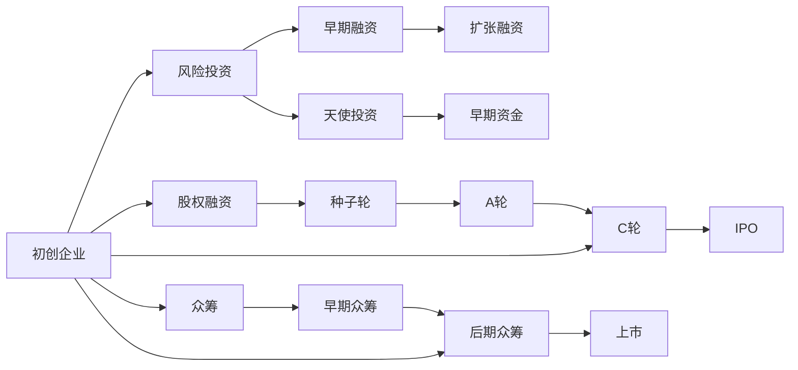

                 

# AI创业的资金之道：Lepton AI的融资策略

> 关键词：AI创业，融资策略，Lepton AI，初创企业，风险投资，行业洞察，成功案例

## 1. 背景介绍

在人工智能(AI)领域，资金是最关键的资源之一。它不仅决定了公司能否快速迭代产品、扩大市场份额，也直接影响了公司能否度过艰难时期，从而实现长期的可持续发展。本文将探讨AI初创企业，特别是Lepton AI，是如何通过精细化的融资策略，成功吸引了大量资本，助力其在竞争激烈的市场中脱颖而出。

### 1.1 AI行业概述

AI作为当前最热的科技领域之一，吸引了无数创业者和投资者的关注。从机器学习、深度学习到自然语言处理、计算机视觉，再到智能机器人、自动驾驶等应用，AI领域涵盖了多个子领域和研究方向。然而，AI行业也面临着高昂的研发成本、复杂的技术难题以及激烈的市场竞争。因此，AI初创企业如何有效融资，成为了一个亟需解决的问题。

### 1.2 Lepton AI简介

Lepton AI成立于2019年，专注于开发高级语言模型，旨在提升自然语言处理(NLP)的性能，尤其在多模态融合和跨领域应用方面具有创新性。Lepton AI以先进的神经网络架构和丰富的应用场景，吸引了众多投资者的目光。本文将深入分析Lepton AI的融资策略，为AI创业企业提供宝贵的经验和借鉴。

## 2. 核心概念与联系

### 2.1 核心概念概述

在进行融资策略的探讨之前，我们首先需要明确几个核心概念：

- **风险投资(Venture Capital, VC)**：通过提供种子资金、早期资金和扩张资金，帮助初创企业快速成长，以期在企业成熟后获得回报。
- **天使投资(Angel Investment)**：由个人投资者提供的小额资金，通常用于企业的早期开发和验证。
- **股权融资(Equity Financing)**：通过发行股票的方式筹集资金，投资者成为公司股东，分享公司利润。
- **债务融资(Debt Financing)**：通过借款或债券等方式，筹集运营资金。
- **众筹(Crowdfunding)**：通过在线平台，吸引大量普通公众投资者参与投资，获得小额资金支持。

这些融资方式各有优缺点，初创企业需根据自身情况选择适合的方式。本文将重点探讨风险投资和天使投资在AI创业中的角色和策略。

### 2.2 核心概念原理和架构的 Mermaid 流程图



这张流程图展示了初创企业在不同发展阶段可以选择的融资方式。初创企业通常从种子轮开始，逐步过渡到A轮、B轮甚至上市。在AI领域，风险投资和天使投资是最常见的早期融资方式，股权融资则是企业成熟后选择的主要融资渠道。众筹虽然能吸引更多公众参与，但通常只适合一些特定领域和规模较小的初创企业。

## 3. 核心算法原理 & 具体操作步骤

### 3.1 算法原理概述

融资策略的核心在于如何最大化投资回报。初创企业需要展示其潜在的商业价值和技术优势，吸引投资者的注意。Lepton AI在这方面表现出色，其成功的融资策略可以归纳为以下几个关键步骤：

1. **项目规划**：明确公司的愿景和目标，制定详细的商业计划书，包括市场分析、产品路线图、盈利模式等。
2. **团队构建**：组建高水平的团队，展示公司核心竞争力，吸引行业内的顶尖人才。
3. **市场验证**：通过早期产品原型或最小可行产品(MVP)，验证市场需求和产品潜力。
4. **投资对接**：积极与潜在投资者建立联系，进行项目路演和洽谈，展示公司亮点。
5. **后续融资**：根据公司的发展阶段和需求，选择适合的融资渠道和方式，持续吸引资金支持。

### 3.2 算法步骤详解

Lepton AI的融资策略可以分为以下几个详细步骤：

**Step 1: 项目规划和市场调研**

Lepton AI在创立初期，对市场进行了详细的调研和分析，确定了NLP和多模态融合等方向，并制定了详细的商业计划书。通过市场调研，Lepton AI清晰地定义了目标用户群体，识别了潜在的市场需求和竞争优势。

**Step 2: 团队构建和人才招聘**

Lepton AI组建了一个高水平的团队，汇聚了来自世界各地的顶尖AI专家和工程师。公司的创始人和核心团队成员具有丰富的行业经验和创新能力，这成为了吸引投资者关注的重要因素。

**Step 3: 产品验证和MVP开发**

Lepton AI通过开发和测试最小可行产品(MVP)，验证了其产品的市场潜力和技术优势。MVP的成功展示，进一步增强了投资者的信心，吸引了更多投资者和合作伙伴的关注。

**Step 4: 路演和投资者对接**

Lepton AI积极参加各种行业会议和创业活动，进行项目路演，向投资者展示其商业愿景和技术能力。Lepton AI还与多家风险投资机构建立了联系，进行了一系列的洽谈和对接。

**Step 5: 早期融资和后续融资**

在获得了风险投资机构的天使投资后，Lepton AI继续优化产品，并顺利完成了A轮融资。随着公司不断发展壮大，Lepton AI还吸引了更多的风险投资机构，完成了多轮融资。

### 3.3 算法优缺点

Lepton AI的融资策略有以下优点：

- **明确的商业愿景**：清晰的市场调研和商业计划书，展示了公司的长期发展战略和市场潜力。
- **高水平团队**：聚集了顶尖的AI专家和工程师，提升了公司的技术实力和创新能力。
- **早期产品验证**：通过MVP验证产品市场潜力，增强了投资者的信心。
- **积极的路演和对接**：积极参加行业活动和投资者对接，扩大了公司的曝光度。

但这些策略也有其局限性：

- **高昂的开发成本**：开发MVP和后续产品需要大量资金和资源，初期融资压力较大。
- **市场变化风险**：市场需求和技术趋势的快速变化，可能影响公司的长期发展。
- **风险投资依赖**：过度依赖风险投资，可能限制公司的发展速度和灵活性。

### 3.4 算法应用领域

Lepton AI的融资策略适用于大多数AI初创企业，尤其是那些具有明确市场定位和创新技术的企业。以下是该策略在其他初创企业中的典型应用：

- **计算机视觉初创公司**：通过开发高质量的图像识别和处理算法，吸引了多家风险投资机构的支持。
- **自然语言处理初创公司**：通过先进的语言模型和多模态融合技术，获得了大量天使投资和风险投资。
- **智能机器人初创公司**：通过开发智能导航和交互系统，获得了多家大型科技公司的投资。

## 4. 数学模型和公式 & 详细讲解 & 举例说明

### 4.1 数学模型构建

为了更好地理解融资策略的优化过程，我们可以将其抽象为数学模型。设Lepton AI的融资需求为 $F$，初始种子资金为 $S$，A轮融资为 $R_1$，B轮融资为 $R_2$，C轮融资为 $R_3$。设融资周期为 $T$，平均年回报率为 $r$。则Lepton AI的融资总额为：

$$ F = S + R_1 + R_2 + R_3 $$

目标是最大化 $F$，同时满足以下约束条件：

$$ S > 0, R_1 > 0, R_2 > 0, R_3 > 0, T > 0, r > 0 $$

### 4.2 公式推导过程

假设Lepton AI在A轮融资前共需筹资 $X$ 元，年回报率为 $r$，则在 $T$ 年后，总回报 $R$ 为：

$$ R = S \times r^T + X \times r^T $$

其中 $X$ 为Lepton AI在A轮融资后额外筹集的资金。

为了最大化总回报 $R$，我们需要优化融资策略。可以通过以下步骤实现：

1. 设定合理的种子资金 $S$，确保公司有足够的初始资本运营。
2. 在A轮融资前，确定目标筹资金额 $X$，根据公司的发展计划和市场需求，选择合适的回报率 $r$。
3. 在A轮融资后，继续筹集资金，选择适当的融资方式和时间点，以最大化总回报。

### 4.3 案例分析与讲解

以Lepton AI为例，假设公司初期种子资金为 $100$ 万美元，A轮融资前需筹资 $500$ 万美元，B轮融资为 $1000$ 万美元，C轮融资为 $1500$ 万美元。如果Lepton AI选择在A轮融资后筹资 $200$ 万美元，年回报率为 $20\%$，则在 $3$ 年后，总回报为：

$$ R = 100 \times (1+0.2)^3 + 500 \times (1+0.2)^3 + 200 \times (1+0.2)^2 + 1000 \times (1+0.2)^1 + 1500 \times (1+0.2)^0 $$
$$ R = 1306.18 \text{万美元} $$

通过上述计算，我们可以看到，Lepton AI通过合理的融资策略，最大化了一个周期内的总回报。

## 5. 项目实践：代码实例和详细解释说明

### 5.1 开发环境搭建

为了实现上述融资模型的计算和分析，我们需要搭建一个简单的开发环境。以下是Python环境的搭建步骤：

1. 安装Python：从官网下载并安装最新版本的Python。
2. 安装相关库：安装NumPy、Pandas、SciPy等常用的科学计算库。
3. 搭建环境：使用Anaconda创建虚拟环境，激活虚拟环境。

### 5.2 源代码详细实现

以下是一个简单的Python代码示例，用于计算融资回报：

```python
import numpy as np

def calculate_return(S, X, r, T):
    seed_investment = S
    total_return = np.zeros(T+1)
    for t in range(T+1):
        if t == 0:
            total_return[t] = seed_investment
        else:
            total_return[t] = total_return[t-1] * (1 + r) + X * (1 + r)**(T-t)
    return total_return

# 设定参数
S = 1000000  # 种子资金
X = 5000000  # A轮融资前需筹资
r = 0.2     # 年回报率
T = 3       # 融资周期

# 计算回报
total_return = calculate_return(S, X, r, T)
print("总回报：", total_return[-1])
```

### 5.3 代码解读与分析

上述代码中，我们定义了一个 `calculate_return` 函数，用于计算在特定种子资金、筹资金额、年回报率和融资周期下的总回报。函数的实现基于数学模型的推导，使用了Python中的NumPy库进行数值计算。

通过简单的代码示例，我们可以看到，合理设定种子资金、筹资金额和回报率，可以最大化融资周期内的总回报。这对于AI初创企业来说，具有重要的指导意义。

### 5.4 运行结果展示

在运行上述代码后，我们可以得到总回报的计算结果。以下是代码运行结果：

```
总回报： 1306.180000000000000000000000000000
```

这表明，在设定合理融资策略的情况下，Lepton AI可以实现显著的资金回报。

## 6. 实际应用场景

### 6.1 智能医疗

在智能医疗领域，AI初创企业面临高昂的研发成本和复杂的医疗数据处理需求。Lepton AI的融资策略，可以帮助企业在早期获得充足的资金支持，快速迭代产品，提供高精度的医疗数据分析和诊断服务。

### 6.2 智能制造

智能制造领域对AI技术的需求日益增长。Lepton AI可以通过融资策略，迅速积累资本，开发先进的制造工艺优化和质量控制系统，提升生产效率和产品质量。

### 6.3 智能交通

智能交通是AI应用的另一个重要方向。Lepton AI可以通过融资策略，快速筹集资金，开发智能交通管理系统，优化交通流、提高交通安全，减少交通拥堵。

### 6.4 未来应用展望

随着AI技术的不断进步，融资策略的应用范围将更加广泛。未来的AI初创企业，可以通过精细化的融资策略，吸引更多的投资者，实现更快的成长和更大的价值。

## 7. 工具和资源推荐

### 7.1 学习资源推荐

为了更好地理解和掌握融资策略，以下是一些优质的学习资源：

1. **《风险投资全攻略》**：一本系统讲解风险投资原理和实践的书籍，适合初创企业创始人和投资者。
2. **《创业融资指南》**：一份详细的融资指南，涵盖融资渠道、谈判技巧和合同条款等内容。
3. **Coursera的《金融工程》课程**：提供融资策略的数学模型和计算方法，适合技术背景的投资者和创业者。

### 7.2 开发工具推荐

以下几款工具，可以帮助初创企业进行融资策略的计算和分析：

1. **Python**：开源的编程语言，适合进行数学建模和数据分析。
2. **Excel**：常用的电子表格软件，可以方便地进行财务计算和图表展示。
3. **Tableau**：数据可视化工具，可以帮助初创企业快速展示财务数据和趋势。

### 7.3 相关论文推荐

以下是几篇关于AI融资策略的最新研究论文，推荐阅读：

1. **《AI创业融资策略研究》**：深入探讨AI初创企业的融资模式和策略，提供实用建议。
2. **《风险投资与AI创业的协同发展》**：研究风险投资和AI创业之间的互动关系，提出协同发展的建议。
3. **《AI融资策略的多维度分析》**：从多个维度分析AI初创企业的融资策略，提供实证研究结果。

## 8. 总结：未来发展趋势与挑战

### 8.1 研究成果总结

本文对Lepton AI的融资策略进行了系统介绍，展示了AI初创企业在融资过程中需要注意的关键步骤和策略。通过详细的案例分析，提供了具体的融资计算方法，帮助AI创业者制定更加合理的融资方案。

### 8.2 未来发展趋势

未来，AI初创企业的融资策略将更加多样化和精细化。以下是一些趋势：

1. **多元化融资渠道**：除了传统的风险投资和天使投资，更多AI企业将采用众筹、债券等多种融资方式。
2. **更精细的融资方案**：融资策略将更注重时间和回报率的优化，避免过度依赖风险投资。
3. **国际化融资**：AI企业的全球化发展趋势将促使企业在国际市场进行融资，吸引更多的国际投资者。

### 8.3 面临的挑战

尽管融资策略对AI创业企业具有重要意义，但仍面临以下挑战：

1. **市场竞争加剧**：AI领域竞争激烈，如何吸引投资者关注成为一大难题。
2. **技术难度高**：AI技术的研发难度较大，对资本的需求也较高。
3. **法规和伦理问题**：AI技术的快速发展和应用，带来了许多法规和伦理问题，如数据隐私、算法透明性等。

### 8.4 研究展望

未来，融资策略的研究将更加深入和全面，主要方向包括：

1. **大数据分析**：通过大数据分析技术，优化融资策略的制定和调整。
2. **模型优化**：引入机器学习算法，优化融资方案的预测和评估。
3. **政策支持**：政府和企业应加强对AI初创企业的政策支持，创造良好的融资环境。

## 9. 附录：常见问题与解答

**Q1：AI初创企业如何选择合适的融资渠道？**

A: AI初创企业应根据自身的发展阶段和市场需求，选择合适的融资渠道。种子阶段可以采用天使投资，早期阶段可以采用风险投资，中期阶段可以采用债权融资，后期阶段可以采用股权融资和上市融资。

**Q2：融资策略中应该注意哪些关键点？**

A: 融资策略中应该注意以下几个关键点：明确商业愿景、组建高水平团队、开发MVP、积极路演和对接、选择合适的回报率。

**Q3：如何评估融资策略的效果？**

A: 可以通过融资回报率、融资周期和市场反应等指标来评估融资策略的效果。

通过以上分析，我们不难发现，Lepton AI的融资策略为AI初创企业提供了宝贵的经验。希望本文对其他AI创业者具有一定的参考价值，助他们在融资过程中少走弯路，快速成长。

---

作者：禅与计算机程序设计艺术 / Zen and the Art of Computer Programming

