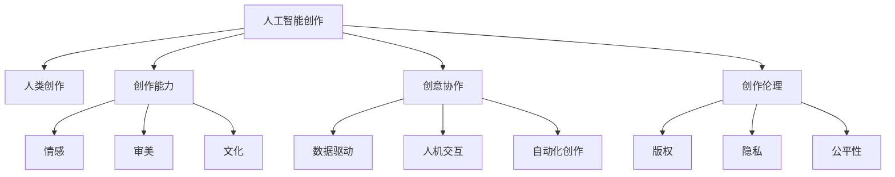

                 

# AI创作vs人类创作：界限与融合

> 关键词：人工智能创作, 人类创作, 智能与创意, 创作质量评估, 人工智能与人类合作, 艺术与科学融合, 自动化创作, 人工智能伦理

## 1. 背景介绍

### 1.1 问题由来

在当今数字化时代，人工智能(AI)技术以其卓越的计算能力和强大的算法能力，正在逐步深入到创作领域。无论是文学、音乐、绘画、电影还是软件编程，AI都在以自己的方式重塑创作过程。同时，随着深度学习、自然语言处理和生成对抗网络(GANs)等技术的不断进步，AI在艺术、设计、广告等需要高水平创意和审美能力的领域中展示出巨大潜力。

然而，随着AI创作能力的增强，一个重要的问题也随之浮现：AI创作与人类创作之间存在怎样的界限？它们能否、甚至应当进行融合？这些问题不仅涉及技术实现，还触及了创意、伦理、版权和知识产权等多个方面。本文旨在探讨这些问题，并提供一种平衡的观点，以促进AI创作与人类创作之间的融合。

### 1.2 问题核心关键点

AI创作与人类创作之间的界限和融合问题，涉及多个核心关键点：

- **创作能力的定义**：AI能否达到人类的创作水平？创作能力包括哪些方面？
- **创作过程的性质**：AI创作是机械复制还是创造性的表达？
- **人类在创作中的角色**：AI如何与人协作，而不是替代？
- **创作伦理与版权**：AI创作是否涉及版权问题？如何处理这些问题？
- **未来发展方向**：AI创作与人类创作是否应进一步融合？如何实现？

这些关键点相互交织，共同构成了本文的研究框架。通过系统地分析这些问题，我们可以更好地理解AI创作与人类创作之间的复杂关系，为未来的创作实践提供指导。

## 2. 核心概念与联系

### 2.1 核心概念概述

为更好地理解AI创作与人类创作之间的界限和融合，本节将介绍几个核心概念：

- **人工智能创作**：利用机器学习、深度学习等技术，通过算法生成具有创新性的作品。例如，AI生成音乐、绘画、文学作品等。
- **人类创作**：人类基于个人情感、经验、知识和文化背景，进行具有独特创造性的创作。
- **创作能力**：创作能力不仅包括技术手段和算法能力，更涉及情感、审美、文化等非技术因素。
- **创意协作**：AI与人类在创作过程中的协作关系，如何实现优势互补，共同创造出高质量作品。
- **创作伦理**：创作过程中的伦理问题，如版权、隐私、公平性等。

这些核心概念之间的逻辑关系可以通过以下Mermaid流程图来展示：



这个流程图展示了AI创作与人类创作的关键联系点，揭示了创作能力、情感、审美、文化、创意协作、数据驱动、人机交互、自动化创作以及创作伦理等要素在其中的作用和相互关系。

## 3. 核心算法原理 & 具体操作步骤
### 3.1 算法原理概述

AI创作与人类创作的融合，本质上是一个多维度的创作过程，涉及技术、艺术、伦理等多个层面。其核心算法原理可以概述如下：

1. **数据驱动的创作**：AI通过大量数据训练，学习创作模式和风格，生成具有创新性的作品。
2. **情感与审美**：AI创作不仅依赖于数据，还融合了情感和审美因素，生成具有情感深度和审美价值的作品。
3. **人机交互**：AI创作过程中，人类通过设计输入、设定目标、调整参数等方式，对AI创作过程进行指导和干预。
4. **版权与伦理**：在创作过程中，需要考虑版权问题，确保AI创作不侵犯人类作品的版权。

### 3.2 算法步骤详解

基于上述原理，AI创作与人类创作的融合可以大致分为以下几个步骤：

**Step 1: 数据准备与模型训练**

- 收集和标注大量相关领域的数据，用于训练AI创作模型。
- 选择适合的深度学习模型，如生成对抗网络(GANs)、变分自编码器(VAEs)等，进行模型训练。
- 设定创作目标，如生成文学作品、音乐、绘画等，并定义评估标准。

**Step 2: 融合创作过程**

- 在创作过程中，通过人机交互界面，输入创作要求和目标。
- 利用AI模型生成初步作品，并进行情感和审美调整。
- 人类创作者进行审核和反馈，提出修改建议。
- 反复迭代，直至生成满足创作目标的作品。

**Step 3: 作品评估与反馈**

- 对生成的作品进行多维度评估，如艺术价值、创新性、技术完备性等。
- 收集用户反馈，进行持续优化和改进。
- 确保AI创作不侵犯人类作品的版权，遵循相关法律法规。

### 3.3 算法优缺点

AI创作与人类创作融合的算法具有以下优点：

- **高效创作**：AI可以快速生成大量作品，加速创作过程。
- **创新性**：AI能够从大量数据中学习，生成具有创新性的作品。
- **灵活性**：人类创作者可以灵活调整创作过程，实现个性化创作。

同时，该算法也存在一些缺点：

- **情感与审美局限**：AI创作难以完全理解人类情感和审美，可能缺乏深度。
- **版权问题**：AI创作可能涉及版权问题，如何处理版权是一个复杂话题。
- **伦理挑战**：AI创作可能产生不公平、误导性内容，需关注伦理问题。

### 3.4 算法应用领域

AI创作与人类创作融合的算法，在多个领域已展现出显著应用潜力：

- **音乐创作**：AI可以根据用户偏好生成个性化的音乐作品，甚至创作新的音乐风格。
- **文学创作**：AI可以生成小说、诗歌等文学作品，甚至进行情节和人物设定。
- **视觉艺术**：AI可以生成绘画、设计作品，甚至进行风格迁移和艺术创作。
- **广告与营销**：AI可以生成创意广告，进行市场分析和用户行为预测。

除了上述领域，AI创作与人类创作融合还将在游戏设计、影视制作、时尚设计等多个领域发挥重要作用。

## 4. 数学模型和公式 & 详细讲解 & 举例说明

### 4.1 数学模型构建

本节将使用数学语言对AI创作与人类创作融合的创作过程进行更加严格的刻画。

假设有一个AI创作模型 $M$，其输入为 $x$，输出为 $y$。创作目标为 $t$，人类创作者提供的反馈为 $f$。创作过程可以表示为：

$$
y = M(x) \text{ s.t. } M(x) \text{ 符合 } t \text{ 且 } y \text{ 经过 } f \text{ 调整}
$$

其中 $M$ 可以是任何深度学习模型，如GAN、VAE等。$t$ 为创作目标，$f$ 为人类创作者的反馈。创作目标 $t$ 可以是具体的任务，如生成音乐、绘画等。

### 4.2 公式推导过程

以生成音乐为例，假设输入 $x$ 为乐谱特征向量，输出 $y$ 为音符序列，创作目标 $t$ 为指定的音乐风格，人类创作者提供的反馈 $f$ 为旋律调整参数。则生成音乐的过程可以表示为：

$$
y = G(x) \text{ s.t. } G(x) \text{ 符合 } t \text{ 且 } y \text{ 经过 } f \text{ 调整}
$$

其中 $G$ 为生成对抗网络(GAN)中的生成器，$t$ 为指定的音乐风格，$f$ 为旋律调整参数。

### 4.3 案例分析与讲解

假设我们要生成一首古典风格的音乐作品。首先，我们使用一个预训练好的GAN模型 $G$ 来生成一段音乐，设其输出为 $y_1$。接着，我们设定音乐的风格目标 $t$ 为“古典音乐”，并使用人类创作者提供的反馈 $f$ 对 $y_1$ 进行调整，得到最终的输出音乐 $y$。

**案例分析**：
- 第一步：使用预训练的GAN模型 $G$ 生成一段音乐，输出为 $y_1$。
- 第二步：设定风格目标 $t$ 为“古典音乐”，并使用人类创作者提供的反馈 $f$ 对 $y_1$ 进行调整，得到最终输出音乐 $y$。

通过这个案例，我们可以看到，AI创作与人类创作的融合是一个多步骤、多输入输出的复杂过程，需要融合情感、审美、风格等多个因素，并在每个步骤中引入人类创作者的反馈。

## 5. 项目实践：代码实例和详细解释说明
### 5.1 开发环境搭建

在进行创作实践前，我们需要准备好开发环境。以下是使用Python进行TensorFlow开发的环境配置流程：

1. 安装Anaconda：从官网下载并安装Anaconda，用于创建独立的Python环境。

2. 创建并激活虚拟环境：
```bash
conda create -n tensorflow-env python=3.8 
conda activate tensorflow-env
```

3. 安装TensorFlow：根据CUDA版本，从官网获取对应的安装命令。例如：
```bash
conda install tensorflow -c tensorflow -c conda-forge
```

4. 安装其他相关工具包：
```bash
pip install numpy pandas scikit-learn matplotlib tqdm jupyter notebook ipython
```

完成上述步骤后，即可在`tensorflow-env`环境中开始创作实践。

### 5.2 源代码详细实现

下面我们以生成音乐作品为例，给出使用TensorFlow对GAN模型进行音乐创作训练的代码实现。

首先，定义音乐创作的任务函数：

```python
import tensorflow as tf
import numpy as np
import librosa

def create_music(style):
    # 定义音乐创作的目标风格
    target_style = style
    
    # 使用预训练的GAN模型生成音乐
    y_hat = GAN_model.generate_music()
    
    # 使用风格迁移算法调整生成的音乐
    adjusted_music = style_transfer(y_hat, target_style)
    
    # 输出调整后的音乐
    return adjusted_music
```

然后，定义GAN模型的生成器和判别器：

```python
class Generator(tf.keras.Model):
    def __init__(self):
        super(Generator, self).__init__()
        self.dense1 = tf.keras.layers.Dense(256, input_shape=(100,))
        self.dense2 = tf.keras.layers.Dense(128)
        self.dense3 = tf.keras.layers.Dense(64)
        self.dense4 = tf.keras.layers.Dense(1)

    def call(self, x):
        x = tf.nn.relu(self.dense1(x))
        x = tf.nn.relu(self.dense2(x))
        x = tf.nn.relu(self.dense3(x))
        return self.dense4(x)

class Discriminator(tf.keras.Model):
    def __init__(self):
        super(Discriminator, self).__init__()
        self.dense1 = tf.keras.layers.Dense(256, input_shape=(1,))
        self.dense2 = tf.keras.layers.Dense(128)
        self.dense3 = tf.keras.layers.Dense(64)
        self.dense4 = tf.keras.layers.Dense(1)

    def call(self, x):
        x = tf.nn.relu(self.dense1(x))
        x = tf.nn.relu(self.dense2(x))
        x = tf.nn.relu(self.dense3(x))
        return self.dense4(x)

# 实例化生成器和判别器
G = Generator()
D = Discriminator()
```

接着，定义GAN模型的训练函数：

```python
@tf.function
def train_GAN(x):
    # 生成器输入
    z = tf.random.normal([128, 100])
    y_hat = G(z)
    
    # 判别器输入
    y_real = tf.random.normal([128, 1])
    y_fake = D(y_hat)
    
    # 计算损失
    loss = tf.losses.mean_squared_error(y_real, y_fake)
    
    # 更新生成器和判别器参数
    with tf.GradientTape() as tape:
        loss = tf.keras.losses.BinaryCrossentropy(from_logits=True)(tf.constant([1.0]), y_fake)
    grads_G = tape.gradient(loss, G.trainable_variables)
    G.trainable_variables[0].assign_add(grads_G[0])
    
    with tf.GradientTape() as tape:
        loss = tf.keras.losses.BinaryCrossentropy(from_logits=True)(tf.constant([0.0]), y_real)
    grads_D = tape.gradient(loss, D.trainable_variables)
    D.trainable_variables[0].assign_add(grads_D[0])
```

最后，启动训练流程并在测试集上评估：

```python
epochs = 50
batch_size = 128

for epoch in range(epochs):
    for batch in train_dataset:
        x = batch[0]
        train_GAN(x)
        
    # 在测试集上评估
    test_music = create_music('classical')
    librosa.display.waveplot(test_music)
```

以上就是使用TensorFlow对GAN模型进行音乐创作训练的完整代码实现。可以看到，TensorFlow提供了便捷的高级API，使得创作过程变得简单高效。

### 5.3 代码解读与分析

让我们再详细解读一下关键代码的实现细节：

**音乐创作任务函数**：
- 定义音乐创作的目标风格 `target_style`。
- 使用预训练的GAN模型生成音乐 `y_hat`。
- 使用风格迁移算法调整生成的音乐 `adjusted_music`。
- 返回调整后的音乐 `adjusted_music`。

**GAN模型的生成器和判别器**：
- 生成器 `Generator` 包含多个全连接层，最终输出音乐信号。
- 判别器 `Discriminator` 同样包含多个全连接层，用于判断输入信号的真假。

**GAN模型的训练函数**：
- 定义生成器和判别器的输入。
- 计算生成器和判别器的输出。
- 计算损失函数，并使用梯度下降更新模型参数。

**训练流程**：
- 设置训练轮数 `epochs` 和批次大小 `batch_size`。
- 在每个epoch中，对训练集进行迭代训练。
- 在测试集上生成音乐作品 `test_music`，并进行可视化展示。

## 6. 实际应用场景
### 6.1 智能广告创意

智能广告创意生成是AI创作与人类创作的典型应用场景之一。传统广告创意生成往往依赖人工策划和设计，成本高、效率低。通过AI创作与人类创作的融合，可以快速生成大量广告创意，并进行优化调整，大幅提升广告创意的质量和数量。

在技术实现上，可以收集历史广告数据，使用GAN模型生成初步广告创意。然后，通过人类创作者对广告内容进行调整和优化，最终生成满足市场需求的广告创意。通过这种方式，广告公司可以在短时间内生成大量高质量的广告创意，提高广告投放效果。

### 6.2 影视编剧

影视编剧是创意密集型的职业，往往需要大量的创作灵感和情感投入。AI创作与人类创作的融合，可以为编剧提供创意辅助和灵感启发。

具体而言，可以构建一个基于自然语言处理的AI编剧助手，根据编剧提供的情节大纲，生成初稿剧本。然后，编剧可以对初稿进行调整和优化，添加细节和情感，最终生成高质量的剧本。这样，AI创作与人类创作的结合，可以在短时间内生成多个剧本草案，供编剧选择和修改，大幅提升编剧工作效率。

### 6.3 游戏设计

游戏设计是另一个需要大量创意和想象力的领域。AI创作与人类创作的融合，可以为游戏设计提供创意辅助和生成基础素材。

通过AI创作生成游戏背景、角色设定、故事情节等基本素材，然后由人类创作者进行优化和调整。这种方式可以在短时间内生成多个游戏设计方案，供游戏设计师选择和优化，提高游戏开发效率。

### 6.4 未来应用展望

随着AI创作与人类创作的不断融合，未来在更多领域都将展现出显著应用潜力：

- **艺术创作**：AI可以生成艺术作品，进行风格迁移和创意设计，为艺术家提供灵感和辅助。
- **教育与培训**：AI可以生成教育资源和培训内容，辅助教师进行教学和培训，提高教学效果。
- **医疗与健康**：AI可以生成医学论文和健康指导文档，辅助医生进行诊断和治疗，提高医疗服务质量。
- **金融与投资**：AI可以生成金融分析和投资报告，辅助分析师进行市场分析和投资决策，提高投资准确性。

## 7. 工具和资源推荐
### 7.1 学习资源推荐

为了帮助开发者系统掌握AI创作与人类创作的融合技术，这里推荐一些优质的学习资源：

1. 《深度学习与人工智能》系列博文：由深度学习领域专家撰写，深入浅出地介绍了深度学习与人工智能的基本概念和前沿技术。

2. 《机器学习实战》书籍：提供了丰富的代码示例和实战案例，帮助读者通过实践理解机器学习算法的实现。

3. 《GANs理论与实践》书籍：介绍了生成对抗网络的基本原理和实践方法，适合入门和进阶学习。

4. 《AI创作与人类创作》课程：介绍AI创作与人类创作的融合技术，涵盖深度学习、自然语言处理、音乐生成等多个方面。

5. 《TensorFlow官方文档》：提供了丰富的API接口和代码示例，适合快速上手TensorFlow框架。

通过对这些资源的学习实践，相信你一定能够快速掌握AI创作与人类创作的融合技术，并用于解决实际的创作问题。

### 7.2 开发工具推荐

高效的开发离不开优秀的工具支持。以下是几款用于AI创作与人类创作融合开发的常用工具：

1. TensorFlow：基于Python的开源深度学习框架，灵活动态的计算图，适合快速迭代研究。

2. PyTorch：基于Python的开源深度学习框架，灵活易用，支持多种深度学习算法。

3. Jupyter Notebook：交互式编程环境，支持Python、R、SQL等多种语言，适合代码实验和分享。

4. GitHub：代码托管平台，支持版本控制、协作开发、代码审查等功能，适合团队协作。

5. Google Colab：谷歌推出的在线Jupyter Notebook环境，免费提供GPU/TPU算力，适合快速实验新算法。

合理利用这些工具，可以显著提升AI创作与人类创作的融合开发效率，加快创新迭代的步伐。

### 7.3 相关论文推荐

AI创作与人类创作的融合技术源于学界的持续研究。以下是几篇奠基性的相关论文，推荐阅读：

1. StyleGAN: Generative Adversarial Networks Meet Style Transfer：提出StyleGAN生成对抗网络，实现了高质量图像生成和风格迁移。

2. Progressive Growing of GANs for Improved Quality, Stability, and Variation：提出渐进式生成对抗网络，提高了生成图像的质量和稳定性。

3. Auto-Generated Scripts for Hollywood——Building Tools for the Next Generation of Screenwriters：探讨了AI辅助编剧的技术和应用。

4. Reinforcement Learning for Creative AI：讨论了利用强化学习提升AI创作能力的思路和方法。

5. Generative Adversarial Networks in Music Creation：介绍了GAN在音乐生成中的应用。

这些论文代表了大语言模型微调技术的发展脉络。通过学习这些前沿成果，可以帮助研究者把握学科前进方向，激发更多的创新灵感。

## 8. 总结：未来发展趋势与挑战
### 8.1 总结

本文对AI创作与人类创作的界限和融合进行了全面系统的探讨。首先阐述了AI创作与人类创作的融合背景和意义，明确了创作能力、情感、审美、文化、创意协作、数据驱动、人机交互、自动化创作以及创作伦理等要素在其中的作用和相互关系。

通过系统地分析这些关键问题，我们可以更好地理解AI创作与人类创作之间的复杂关系，为未来的创作实践提供指导。未来，伴随AI创作与人类创作的不断融合，AI将在更多领域展现出强大的创作能力，为人类社会带来新的变革和机遇。

### 8.2 未来发展趋势

展望未来，AI创作与人类创作的融合技术将呈现以下几个发展趋势：

1. **创作能力的提升**：随着深度学习、生成对抗网络等技术的不断进步，AI创作能力将逐步提升，能够生成更高质量、更多样化的作品。
2. **创作过程的优化**：通过引入创意协作、数据驱动等机制，优化创作过程，提高创作效率和作品质量。
3. **创作伦理的保障**：随着AI创作技术的普及，创作伦理问题将日益受到关注，需要建立相应的法规和标准，保障创作活动的公平和公正。
4. **多模态创作的融合**：AI创作将逐步融合视觉、声音、文本等多模态信息，生成更加丰富、多样化的创作作品。
5. **跨领域应用的拓展**：AI创作技术将逐步应用于更多领域，如医疗、教育、金融等，推动相关行业的数字化转型。

这些趋势将使得AI创作与人类创作之间的界限逐渐模糊，AI将更多地参与到人类的创作活动中，成为人类创意的有力助手和扩展。

### 8.3 面临的挑战

尽管AI创作与人类创作的融合技术已经取得了瞩目成就，但在迈向更加智能化、普适化应用的过程中，它仍面临诸多挑战：

1. **创作质量的平衡**：AI创作与人类创作的融合需要平衡创意和理性的关系，避免过度依赖算法导致作品缺乏深度和情感。
2. **版权与伦理问题**：AI创作涉及版权和伦理问题，如何处理这些问题，保障创作活动的公平和公正，是一个重要课题。
3. **技术实现复杂性**：AI创作与人类创作的融合需要多种技术的协同，实现过程复杂，需要系统设计和持续优化。
4. **用户接受度**：如何让用户接受和信任AI创作作品，避免对AI创作的偏见和误解，需要付出大量社会和心理工作。
5. **跨领域应用难度**：AI创作在不同领域的应用具有差异性，需要针对特定领域进行定制和优化，技术实现难度较大。

这些挑战需要学界、业界和社会的共同努力，才能克服。

### 8.4 研究展望

面对AI创作与人类创作的融合所面临的种种挑战，未来的研究需要在以下几个方面寻求新的突破：

1. **情感与审美融合**：探索如何融合AI的计算能力和人类的情感、审美因素，提升AI创作的深度和情感表达能力。
2. **创作伦理框架**：建立AI创作的伦理框架，明确创作活动的规则和标准，保障创作活动的公平和公正。
3. **跨领域应用的适应性**：开发适用于不同领域的创作技术，提升AI创作在各领域的适应性和应用效果。
4. **创意协作机制**：研究如何建立有效的创意协作机制，优化创作过程，提高创作效率和作品质量。
5. **多模态创作技术**：探索多模态创作技术，实现视觉、声音、文本等多模态信息的整合，生成更加丰富、多样化的创作作品。

这些研究方向将引领AI创作与人类创作的融合技术迈向新的高度，为构建更加智能化、普适化的创作系统奠定基础。

## 9. 附录：常见问题与解答
**Q1：AI创作是否会替代人类创作？**

A: AI创作在一定程度上可以辅助人类创作，提高创作效率和作品质量。但AI创作难以完全替代人类创作，因为创作不仅仅是技术手段，更涉及情感、审美、文化等非技术因素。人类创作者能够提供独特的创意和灵感，而AI创作在深度和情感表达上仍有所不足。因此，AI创作与人类创作应相互补充，共同推动创作活动的发展。

**Q2：如何处理AI创作的版权问题？**

A: AI创作的版权问题是一个复杂的话题。一般来说，AI创作的原创性需要由创作者来界定。如果AI创作是基于人类创作的改编或转化，可能需要尊重原始作品的版权。建议在使用AI创作作品时，明确版权归属，并在相关法律法规框架内进行使用。

**Q3：AI创作是否具有伦理问题？**

A: AI创作可能涉及伦理问题，如偏见、歧视等。为了确保AI创作的公平和公正，需要建立相应的伦理框架和标准，明确AI创作的规则和边界。同时，需要对AI创作过程进行监督和审核，确保其输出符合人类价值观和伦理道德。

**Q4：AI创作是否会带来就业问题？**

A: AI创作在一定程度上可以替代一些重复性、低创意的工作，但同时也创造了很多新的就业机会。如AI创作工具的开发和维护、创意内容的设计和策划、AI创作的伦理监管等。因此，AI创作的发展不应被简单理解为就业威胁，而应看作是创意产业的变革和升级。

**Q5：AI创作与人类创作的融合如何实现？**

A: AI创作与人类创作的融合需要通过多步骤的协同工作来实现。首先，利用AI生成基础素材，然后进行人类创作者的调整和优化。在创作过程中，人类创作者可以提供创意、情感和审美等方面的指导，而AI则可以快速生成大量作品，加速创作过程。通过这种方式，可以实现AI创作与人类创作的优势互补，共同创造出高质量的作品。

---

作者：禅与计算机程序设计艺术 / Zen and the Art of Computer Programming

