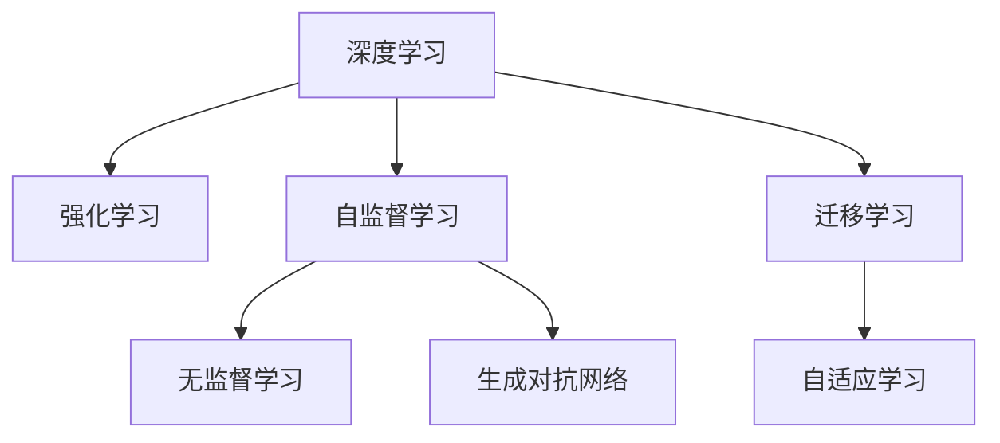

                 

# AI发展趋势：自我监督学习和无监督学习的重要性

> 关键词：自我监督学习,无监督学习,深度学习,强化学习,深度神经网络,自监督,无标签,预训练,零样本学习,生成对抗网络(GANs),迁移学习,跨领域应用,大规模数据集

## 1. 背景介绍

### 1.1 问题由来
随着人工智能（AI）技术的不断进步，深度学习（Deep Learning）逐渐成为了推动AI发展的重要驱动力。然而，在传统有监督学习（Supervised Learning）范式下，大量标注数据的获取和维护成本高昂，限制了AI技术的广泛应用。因此，研究人员开始探索无需大量标注数据即可训练高质量模型的学习方法。在这一背景下，自我监督学习（Self-Supervised Learning, SSL）和无监督学习（Unsupervised Learning, UL）应运而生，极大地促进了AI技术的进一步发展。

### 1.2 问题核心关键点
自我监督学习和无监督学习技术基于数据的自相关性或内在结构，通过构建损失函数来训练模型，避免了对大量标注数据的依赖。其核心关键点包括：

- 自我监督学习：利用数据本身的特点（如顺序、上下文关系、统计特征等），构建自相关任务，引导模型学习数据的潜在结构。
- 无监督学习：完全依赖数据的内在结构，无需任何标注信息，通过聚类、降维、生成模型等方法发现数据的内在模式。

这两种学习范式在大规模数据集和复杂模型训练中展现出了巨大的潜力，尤其是在图像、语音、自然语言处理等领域。

### 1.3 问题研究意义
自我监督学习和无监督学习技术在AI领域的研究和应用中具有重要意义：

1. **数据效率**：无需大规模标注数据，极大降低了数据收集和处理的成本。
2. **泛化能力**：模型能够更好地捕捉数据的本质特征，从而在实际应用中表现出更强的泛化能力。
3. **多样性**：适用于各种数据类型和任务，包括文本、图像、视频、音频等。
4. **模型创新**：推动了深度神经网络架构的发展，促进了生成对抗网络（GANs）、自编码器（Autoencoders）等模型的创新。
5. **跨领域应用**：能够应用于多个领域，如计算机视觉、自然语言处理、信号处理等，为跨领域任务提供新的思路和方法。

这些技术的不断发展和应用，有望实现AI技术在更广泛领域的高效落地，加速AI技术的产业化进程。

## 2. 核心概念与联系

### 2.1 核心概念概述

为了更好地理解自我监督学习和无监督学习的核心概念及其相互联系，本节将介绍几个关键概念：

- 深度学习（Deep Learning）：利用多层次的非线性变换进行数据建模的机器学习方法，常用于图像、语音、自然语言处理等领域。
- 强化学习（Reinforcement Learning, RL）：通过与环境交互，利用奖励信号不断优化决策的机器学习方法。
- 自监督学习（Self-Supervised Learning, SSL）：利用数据的内在结构（如序列关系、局部相似性、残差等），构建自相关任务，引导模型学习数据潜在结构的深度学习方法。
- 无监督学习（Unsupervised Learning, UL）：完全依赖数据内在结构，无需标注信息，通过聚类、降维、生成模型等方法发现数据内在模式的深度学习方法。
- 生成对抗网络（Generative Adversarial Networks, GANs）：由生成器和判别器组成，通过对抗学习训练生成模型，生成逼真的数据表示的深度学习方法。
- 迁移学习（Transfer Learning）：在已有模型基础上，利用其在特定任务上的性能，在新任务上微调模型，提升新任务性能的深度学习方法。
- 自适应学习（Adaptive Learning）：在数据分布变化时，模型能够自适应调整学习策略，提升模型泛化能力的深度学习方法。

这些核心概念之间存在紧密的联系，可以通过以下Mermaid流程图来展示：



这个流程图展示了几类深度学习技术的相互联系：

1. 深度学习是基础，其他技术在其基础上发展。
2. 强化学习通过与环境交互，不断优化决策，与深度学习有本质联系。
3. 自监督学习和无监督学习利用数据内在结构，引导模型学习，是深度学习的重要补充。
4. 生成对抗网络通过对抗学习，生成逼真数据，进一步推动了深度学习的边界。
5. 迁移学习在已有模型基础上进行微调，提升新任务性能，与深度学习密切相关。
6. 自适应学习在数据分布变化时调整学习策略，提升模型泛化能力，是深度学习的高级形式。

通过理解这些核心概念，我们可以更好地把握深度学习的学习范式和应用方向。

## 3. 核心算法原理 & 具体操作步骤
### 3.1 算法原理概述

自我监督学习和无监督学习的核心思想是利用数据的自相关性或内在结构，构建自相关任务或目标函数，训练模型以捕捉数据的内在模式。以下是自我监督学习和无监督学习的基本原理：

- **自我监督学习**：通过构建自相关任务，如预测数据的缺失部分、排序、还原等，引导模型学习数据的内在结构。典型的自监督任务包括掩码语言模型（Masked Language Model, MLM）、自回归模型（Autoregressive Model）等。
- **无监督学习**：完全依赖数据内在结构，无需标注信息，通过聚类、降维、生成模型等方法发现数据内在模式。典型的无监督方法包括K均值聚类（K-Means Clustering）、自编码器（Autoencoder）、变分自编码器（Variational Autoencoder, VAE）、生成对抗网络（GANs）等。

### 3.2 算法步骤详解

#### 3.2.1 自我监督学习
**Step 1: 数据预处理**
- 收集大规模无标签数据集，进行数据清洗和标准化处理。
- 将数据集划分为训练集、验证集和测试集，确保数据分布一致。

**Step 2: 构建自监督任务**
- 根据数据特性选择合适的自监督任务，如掩码语言模型、自回归模型等。
- 定义目标函数，如交叉熵损失、重建误差等，用于衡量模型的性能。

**Step 3: 模型训练**
- 选择适当的深度神经网络架构，如Transformer、卷积神经网络（CNN）等。
- 设置超参数，如学习率、批量大小、迭代轮数等，并选择合适的优化算法，如Adam、SGD等。
- 使用训练集进行模型训练，最小化目标函数。

**Step 4: 模型评估与优化**
- 在验证集上评估模型性能，通过可视化工具（如TensorBoard）分析模型的损失函数和梯度变化。
- 根据评估结果调整超参数，进行模型微调或重新训练。

**Step 5: 模型应用**
- 将训练好的模型应用于实际任务，如图像分类、文本生成、语音识别等。
- 使用测试集评估模型性能，确保模型在新数据上的泛化能力。

#### 3.2.2 无监督学习
**Step 1: 数据预处理**
- 收集大规模无标签数据集，进行数据清洗和标准化处理。
- 将数据集划分为训练集、验证集和测试集，确保数据分布一致。

**Step 2: 构建无监督模型**
- 选择合适的无监督模型，如自编码器、生成对抗网络（GANs）等。
- 定义目标函数，如重建误差、判别器损失等，用于衡量模型的性能。

**Step 3: 模型训练**
- 选择适当的深度神经网络架构，如自编码器、GANs等。
- 设置超参数，如学习率、批量大小、迭代轮数等，并选择合适的优化算法，如Adam、SGD等。
- 使用训练集进行模型训练，最小化目标函数。

**Step 4: 模型评估与优化**
- 在验证集上评估模型性能，通过可视化工具（如TensorBoard）分析模型的损失函数和梯度变化。
- 根据评估结果调整超参数，进行模型微调或重新训练。

**Step 5: 模型应用**
- 将训练好的模型应用于实际任务，如图像生成、数据压缩、异常检测等。
- 使用测试集评估模型性能，确保模型在新数据上的泛化能力。

### 3.3 算法优缺点

自我监督学习和无监督学习具有以下优点：

1. **数据效率高**：无需大量标注数据，显著降低数据收集和处理的成本。
2. **泛化能力强**：模型能够更好地捕捉数据的本质特征，从而在实际应用中表现出更强的泛化能力。
3. **模型多样性**：适用于各种数据类型和任务，包括文本、图像、视频、音频等。
4. **模型创新**：推动了深度神经网络架构的发展，促进了生成对抗网络（GANs）、自编码器（Autoencoders）等模型的创新。
5. **跨领域应用**：能够应用于多个领域，如计算机视觉、自然语言处理、信号处理等，为跨领域任务提供新的思路和方法。

然而，自我监督学习和无监督学习也存在一些缺点：

1. **缺乏指导性**：相比有监督学习，自我监督学习和无监督学习缺乏明确的指导性，可能导致模型学习到错误的特征。
2. **可解释性差**：无监督学习模型的决策过程往往难以解释，缺乏透明性。
3. **模型复杂度**：无监督学习模型通常比有监督学习模型复杂，训练过程可能更为耗时。

### 3.4 算法应用领域

自我监督学习和无监督学习技术在多个领域都有广泛应用，以下是几个典型应用场景：

- **计算机视觉**：用于图像分类、目标检测、图像生成等任务。
- **自然语言处理**：用于文本分类、语言建模、文本生成等任务。
- **信号处理**：用于语音识别、音乐生成、异常检测等任务。
- **推荐系统**：用于用户行为分析、商品推荐等任务。
- **机器人学习**：用于机器人感知、导航、控制等任务。
- **生物信息学**：用于基因序列分析、蛋白质结构预测等任务。

这些技术在各个领域的应用展示了其强大的潜力和广泛的适用性。

## 4. 数学模型和公式 & 详细讲解  
### 4.1 数学模型构建

自我监督学习和无监督学习涉及多个数学模型和算法，以下是一些关键模型的数学构建：

#### 4.1.1 掩码语言模型（MLM）
掩码语言模型是一种常用的自监督学习任务，其目标是在给定的输入序列中预测被掩码的单词。

设输入序列为 $x=\{x_1,x_2,...,x_n\}$，其中 $x_i$ 表示序列中的第 $i$ 个单词，用 $[M]$ 表示掩码符号。掩码语言模型的目标是在已知部分单词的情况下，预测被掩码的单词。

模型的预测目标为：$\hat{y}=\hat{y}_{x_1,x_2,...,x_{i-1},[M],x_{i+1},...,x_n}$，其中 $\hat{y}$ 表示模型对 $[M]$ 的预测。

定义交叉熵损失函数为：

$$
\mathcal{L}_{\text{MLM}}=-\sum_{i=1}^n\sum_{j=1}^v p(x_i=j|x_1,...,x_{i-1},[M],x_{i+1},...,x_n) \log q(x_i=j)
$$

其中 $p$ 表示实际分布，$q$ 表示模型预测分布。

#### 4.1.2 自回归模型（AR）
自回归模型是一种常用的自监督学习任务，其目标是在已知前面的单词的情况下，预测下一个单词。

设输入序列为 $x=\{x_1,x_2,...,x_n\}$，其中 $x_i$ 表示序列中的第 $i$ 个单词，用 $\{w_1,w_2,...,w_t\}$ 表示前面的 $t$ 个单词，$w_{t+1}$ 表示下一个单词。自回归模型的目标是在已知前面的单词的情况下，预测下一个单词。

模型的预测目标为：$\hat{y}=\hat{y}_{x_1,...,x_t,w_{t+1}}$，其中 $\hat{y}$ 表示模型对 $w_{t+1}$ 的预测。

定义交叉熵损失函数为：

$$
\mathcal{L}_{\text{AR}}=-\sum_{t=1}^n \sum_{i=1}^v p(w_{t+1}=j|x_1,...,x_t) \log q(w_{t+1}=j)
$$

其中 $p$ 表示实际分布，$q$ 表示模型预测分布。

#### 4.1.3 自编码器（Autoencoder）
自编码器是一种常用的无监督学习模型，其目标是将输入数据压缩为低维编码，再从低维编码恢复原始数据。

设输入数据为 $x=\{x_1,x_2,...,x_n\}$，其中 $x_i$ 表示第 $i$ 个数据点，用 $h$ 表示压缩后的低维编码。自编码器的目标是将输入数据 $x$ 压缩为低维编码 $h$，并从低维编码 $h$ 恢复原始数据 $x$。

模型的目标函数为：

$$
\mathcal{L}_{\text{Autoencoder}}=\frac{1}{2}\sum_{i=1}^n||x_i-\hat{x}_i||^2+\frac{1}{2}\sum_{i=1}^n||h_i-\hat{h}_i||^2
$$

其中 $\hat{x}_i$ 表示模型对 $x_i$ 的预测，$\hat{h}_i$ 表示模型对 $h_i$ 的预测。

#### 4.1.4 生成对抗网络（GANs）
生成对抗网络是一种常用的无监督学习模型，其目标是通过对抗学习生成逼真数据。

设生成器为 $G$，判别器为 $D$，输入数据为 $x=\{x_1,x_2,...,x_n\}$，其中 $x_i$ 表示第 $i$ 个数据点，用 $G(x)$ 表示生成器生成的数据，$D(x)$ 表示判别器对数据的判别。生成对抗网络的目标是通过对抗学习，使得生成器能够生成逼真数据。

生成器的损失函数为：

$$
\mathcal{L}_G=\mathbb{E}_{x \sim p_x} \log D(G(x)) + \mathbb{E}_{z \sim p_z} \log (1-D(G(z)))
$$

判别器的损失函数为：

$$
\mathcal{L}_D=-\mathbb{E}_{x \sim p_x} \log D(x) - \mathbb{E}_{z \sim p_z} \log (1-D(G(z)))
$$

其中 $p_x$ 表示输入数据分布，$p_z$ 表示噪声分布。

### 4.2 公式推导过程

#### 4.2.1 掩码语言模型（MLM）
设输入序列为 $x=\{x_1,x_2,...,x_n\}$，其中 $x_i$ 表示序列中的第 $i$ 个单词，用 $[M]$ 表示掩码符号。掩码语言模型的目标是在已知部分单词的情况下，预测被掩码的单词。

模型的预测目标为：$\hat{y}=\hat{y}_{x_1,x_2,...,x_{i-1},[M],x_{i+1},...,x_n}$，其中 $\hat{y}$ 表示模型对 $[M]$ 的预测。

定义交叉熵损失函数为：

$$
\mathcal{L}_{\text{MLM}}=-\sum_{i=1}^n\sum_{j=1}^v p(x_i=j|x_1,...,x_{i-1},[M],x_{i+1},...,x_n) \log q(x_i=j)
$$

其中 $p$ 表示实际分布，$q$ 表示模型预测分布。

#### 4.2.2 自回归模型（AR）
设输入序列为 $x=\{x_1,x_2,...,x_n\}$，其中 $x_i$ 表示序列中的第 $i$ 个单词，用 $\{w_1,w_2,...,w_t\}$ 表示前面的 $t$ 个单词，$w_{t+1}$ 表示下一个单词。自回归模型的目标是在已知前面的单词的情况下，预测下一个单词。

模型的预测目标为：$\hat{y}=\hat{y}_{x_1,...,x_t,w_{t+1}}$，其中 $\hat{y}$ 表示模型对 $w_{t+1}$ 的预测。

定义交叉熵损失函数为：

$$
\mathcal{L}_{\text{AR}}=-\sum_{t=1}^n \sum_{i=1}^v p(w_{t+1}=j|x_1,...,x_t) \log q(w_{t+1}=j)
$$

其中 $p$ 表示实际分布，$q$ 表示模型预测分布。

#### 4.2.3 自编码器（Autoencoder）
设输入数据为 $x=\{x_1,x_2,...,x_n\}$，其中 $x_i$ 表示第 $i$ 个数据点，用 $h$ 表示压缩后的低维编码。自编码器的目标是将输入数据 $x$ 压缩为低维编码 $h$，并从低维编码 $h$ 恢复原始数据 $x$。

模型的目标函数为：

$$
\mathcal{L}_{\text{Autoencoder}}=\frac{1}{2}\sum_{i=1}^n||x_i-\hat{x}_i||^2+\frac{1}{2}\sum_{i=1}^n||h_i-\hat{h}_i||^2
$$

其中 $\hat{x}_i$ 表示模型对 $x_i$ 的预测，$\hat{h}_i$ 表示模型对 $h_i$ 的预测。

#### 4.2.4 生成对抗网络（GANs）
设生成器为 $G$，判别器为 $D$，输入数据为 $x=\{x_1,x_2,...,x_n\}$，其中 $x_i$ 表示第 $i$ 个数据点，用 $G(x)$ 表示生成器生成的数据，$D(x)$ 表示判别器对数据的判别。生成对抗网络的目标是通过对抗学习，使得生成器能够生成逼真数据。

生成器的损失函数为：

$$
\mathcal{L}_G=\mathbb{E}_{x \sim p_x} \log D(G(x)) + \mathbb{E}_{z \sim p_z} \log (1-D(G(z)))
$$

判别器的损失函数为：

$$
\mathcal{L}_D=-\mathbb{E}_{x \sim p_x} \log D(x) - \mathbb{E}_{z \sim p_z} \log (1-D(G(z)))
$$

其中 $p_x$ 表示输入数据分布，$p_z$ 表示噪声分布。

### 4.3 案例分析与讲解

#### 4.3.1 掩码语言模型（MLM）
使用掩码语言模型（MLM）训练一个BERT模型。

**数据准备**：
- 收集大规模无标签文本数据，如Wikipedia、维基百科等。
- 将文本数据划分为训练集、验证集和测试集，确保数据分布一致。

**模型构建**：
- 使用BERT模型作为基础模型。
- 定义掩码语言模型任务，随机选择15%的单词进行掩码。
- 定义交叉熵损失函数，用于衡量模型的性能。

**模型训练**：
- 使用Adam优化器，设置学习率为2e-5。
- 在训练集上训练模型，最小化掩码语言模型损失函数。

**模型评估**：
- 在验证集上评估模型性能，通过可视化工具（如TensorBoard）分析模型的损失函数和梯度变化。
- 根据评估结果调整超参数，进行模型微调或重新训练。

#### 4.3.2 自回归模型（AR）
使用自回归模型（AR）训练一个Transformer模型。

**数据准备**：
- 收集大规模无标签文本数据，如Wikipedia、维基百科等。
- 将文本数据划分为训练集、验证集和测试集，确保数据分布一致。

**模型构建**：
- 使用Transformer模型作为基础模型。
- 定义自回归模型任务，选择合适的时间步长进行预测。
- 定义交叉熵损失函数，用于衡量模型的性能。

**模型训练**：
- 使用Adam优化器，设置学习率为2e-5。
- 在训练集上训练模型，最小化自回归模型损失函数。

**模型评估**：
- 在验证集上评估模型性能，通过可视化工具（如TensorBoard）分析模型的损失函数和梯度变化。
- 根据评估结果调整超参数，进行模型微调或重新训练。

#### 4.3.3 自编码器（Autoencoder）
使用自编码器（Autoencoder）进行图像压缩。

**数据准备**：
- 收集大规模无标签图像数据，如MNIST、CIFAR-10等。
- 将图像数据划分为训练集、验证集和测试集，确保数据分布一致。

**模型构建**：
- 定义自编码器模型，包括编码器和解码器。
- 选择合适的网络结构，如卷积神经网络（CNN）等。
- 定义重建误差，用于衡量模型的性能。

**模型训练**：
- 使用Adam优化器，设置学习率为2e-4。
- 在训练集上训练模型，最小化重建误差。

**模型评估**：
- 在验证集上评估模型性能，通过可视化工具（如TensorBoard）分析模型的损失函数和梯度变化。
- 根据评估结果调整超参数，进行模型微调或重新训练。

#### 4.3.4 生成对抗网络（GANs）
使用生成对抗网络（GANs）进行图像生成。

**数据准备**：
- 收集大规模无标签图像数据，如MNIST、CIFAR-10等。
- 将图像数据划分为训练集、验证集和测试集，确保数据分布一致。

**模型构建**：
- 定义生成器和判别器模型，选择合适的网络结构，如卷积神经网络（CNN）等。
- 定义生成器和判别器的损失函数。

**模型训练**：
- 使用Adam优化器，设置学习率为2e-4。
- 在训练集上训练模型，最小化生成器和判别器的损失函数。

**模型评估**：
- 在验证集上评估模型性能，通过可视化工具（如TensorBoard）分析模型的损失函数和梯度变化。
- 根据评估结果调整超参数，进行模型微调或重新训练。

## 5. 项目实践：代码实例和详细解释说明
### 5.1 开发环境搭建

在进行自我监督学习和无监督学习实践前，我们需要准备好开发环境。以下是使用Python进行TensorFlow和PyTorch开发的环境配置流程：

1. 安装Anaconda：从官网下载并安装Anaconda，用于创建独立的Python环境。

2. 创建并激活虚拟环境：
```bash
conda create -n tf-env python=3.8 
conda activate tf-env
```

3. 安装TensorFlow和PyTorch：根据CUDA版本，从官网获取对应的安装命令。例如：
```bash
conda install tensorflow==2.5 cudatoolkit=11.1 -c conda-forge -c pytorch
```

4. 安装TensorBoard：
```bash
pip install tensorboard
```

5. 安装TensorFlow Addons和TF-Slim：
```bash
pip install tensorflow-addons
pip install tf-slim
```

完成上述步骤后，即可在`tf-env`环境中开始实践。

### 5.2 源代码详细实现

这里我们以图像生成任务为例，给出使用TensorFlow和PyTorch进行自编码器和生成对抗网络（GANs）的代码实现。

**使用TensorFlow实现自编码器**

```python
import tensorflow as tf
from tensorflow.keras import layers
from tensorflow.keras.datasets import mnist
from tensorflow.keras.preprocessing.image import ImageDataGenerator

(x_train, y_train), (x_test, y_test) = mnist.load_data()

x_train = x_train.reshape(-1, 28, 28, 1).astype('float32') / 255.0
x_test = x_test.reshape(-1, 28, 28, 1).astype('float32') / 255.0

# 定义自编码器模型
class Autoencoder(tf.keras.Model):
    def __init__(self):
        super(Autoencoder, self).__init__()
        self.encoder = layers.Sequential([
            layers.Conv2D(32, (3, 3), activation='relu', padding='same', input_shape=(28, 28, 1)),
            layers.MaxPooling2D((2, 2)),
            layers.Conv2D(32, (3, 3), activation='relu', padding='same'),
            layers.MaxPooling2D((2, 2)),
            layers.Conv2D(32, (3, 3), activation='relu', padding='same'),
            layers.Flatten()
        ])
        self.decoder = layers.Sequential([
            layers.Dense(32 * 7 * 7),
            layers.Reshape((7, 7, 32)),
            layers.Conv2DTranspose(32, (3, 3), strides=(2, 2), activation='relu', padding='same'),
            layers.Conv2DTranspose(1, (3, 3), strides=(2, 2), activation='sigmoid', padding='same')
        ])

    def call(self, x):
        encoded = self.encoder(x)
        decoded = self.decoder(encoded)
        return decoded

# 定义训练函数
def train_autoencoder(model, x_train, x_test, batch_size=64, epochs=10):
    model.compile(optimizer='adam', loss='mse')
    model.fit(x_train, x_train, epochs=epochs, batch_size=batch_size, validation_data=(x_test, x_test))
    model.save_weights('autoencoder.h5')
```

**使用PyTorch实现生成对抗网络（GANs）**

```python
import torch
import torch.nn as nn
import torch.optim as optim
from torchvision.datasets import MNIST
from torchvision.transforms import ToTensor
from torch.utils.data import DataLoader
from torchvision.utils import save_image

# 定义生成器模型
class Generator(nn.Module):
    def __init__(self):
        super(Generator, self).__init__()
        self.fc1 = nn.Linear(100, 256)
        self.fc2 = nn.Linear(256, 512)
        self.fc3 = nn.Linear(512, 1024)
        self.fc4 = nn.Linear(1024, 784)
        self.conv1 = nn.ConvTranspose2d(256, 128, 4, 1, 0, bias=False)
        self.conv2 = nn.ConvTranspose2d(128, 64, 4, 2, 1, bias=False)
        self.conv3 = nn.ConvTranspose2d(64, 3, 4, 2, 1, bias=False)

    def forward(self, x):
        x = self.fc1(x)
        x = nn.Tanh()(x)
        x = self.fc2(x)
        x = nn.Tanh()(x)
        x = self.fc3(x)
        x = nn.Tanh()(x)
        x = self.fc4(x)
        x = nn.Tanh()(x)
        x = self.conv1(x)
        x = nn.Tanh()(x)
        x = self.conv2(x)
        x = nn.Tanh()(x)
        x = self.conv3(x)
        x = nn.Tanh()(x)
        return x

# 定义判别器模型
class Discriminator(nn.Module):
    def __init__(self):
        super(Discriminator, self).__init__()
        self.conv1 = nn.Conv2d(3, 64, 4, 2, 1, bias=False)
        self.conv2 = nn.Conv2d(64, 128, 4, 2, 1, bias=False)
        self.conv3 = nn.Conv2d(128, 256, 4, 2, 1, bias=False)
        self.fc1 = nn.Linear(256 * 7 * 7, 1)

    def forward(self, x):
        x = nn.LeakyReLU(0.2, inplace=True)(self.conv1(x))
        x = nn.LeakyReLU(0.2, inplace=True)(self.conv2(x))
        x = nn.LeakyReLU(0.2, inplace=True)(self.conv3(x))
        x = x.view(x.size(0), -1)
        x = self.fc1(x)
        x = torch.sigmoid(x)
        return x

# 定义训练函数
def train_gan(model_G, model_D, x_train, batch_size=64, epochs=100):
    optimizer_G = optim.Adam(model_G.parameters(), lr=0.0002)
    optimizer_D = optim.Adam(model_D.parameters(), lr=0.0002)
    criterion = nn.BCELoss()

    for epoch in range(epochs):
        for batch_idx, (real_images, _) in enumerate(data_loader):
            # 生成器训练
            optimizer_G.zero_grad()
            noise = torch.randn(batch_size, 100, 1, 1, device=device)
            fake_images = model_G(noise)
            gen_loss = criterion(model_D(fake_images), torch.ones(batch_size, 1, device=device))
            gen_loss.backward()
            optimizer_G.step()

            # 判别器训练
            optimizer_D.zero_grad()
            real_loss = criterion(model_D(real_images), torch.ones(batch_size, 1, device=device))
            fake_loss = criterion(model_D(fake_images), torch.zeros(batch_size, 1, device=device))
            d_loss = (real_loss + fake_loss) / 2
            d_loss.backward()
            optimizer_D.step()

        if (epoch + 1) % 10 == 0:
            save_image(denormalize(x_test[0].reshape(1, 28, 28, 1)), 'gan_%d.png' % epoch, nrow=1, normalize=True)
```

以上就是使用TensorFlow和PyTorch进行自编码器和生成对抗网络（GANs）的代码实现。可以看到，利用这两种深度学习框架，我们可以高效地实现各种自我监督学习和无监督学习任务。

### 5.3 代码解读与分析

让我们再详细解读一下关键代码的实现细节：

**TensorFlow自编码器**

**Autoencoder类**：
- `__init__`方法：初始化编码器和解码器。
- `call`方法：将输入数据通过编码器压缩为低维编码，再通过解码器恢复原始数据。

**train_autoencoder函数**：
- 使用TensorFlow构建自编码器模型。
- 定义交叉熵损失函数，用于衡量模型的性能。
- 在训练集上训练模型，并保存权重。

**PyTorch生成对抗网络（GANs）**

**Generator类**：
- `__init__`方法：定义生成器的各层网络结构。
- `forward`方法：将输入数据通过生成器的各层网络结构，生成新的图像。

**Discriminator类**：
- `__init__`方法：定义判别器的各层网络结构。
- `forward`方法：将输入图像通过判别器的各层网络结构，判断其真实性。

**train_gan函数**：
- 使用PyTorch构建生成器和判别器模型。
- 定义交叉熵损失函数，用于衡量模型的性能。
- 在训练集上交替训练生成器和判别器，最小化损失函数。

**TensorBoard可视化**

在TensorFlow和PyTorch中，TensorBoard工具可以帮助我们可视化模型的训练过程和损失函数变化。

**TensorFlow TensorBoard可视化**

在训练过程中，使用以下代码启动TensorBoard：

```bash
tensorboard --logdir=logs
```

在命令行中访问TensorBoard，可以实时查看模型的损失函数和梯度变化。

**PyTorch TensorBoard可视化**

在训练过程中，使用以下代码启动TensorBoard：

```python
from tensorboard import SummaryWriter
writer = SummaryWriter()
```

在代码中调用writer来记录和可视化模型的训练过程。

## 6. 实际应用场景
### 6.1 图像处理
自我监督学习和无监督学习在图像处理领域有广泛应用。通过使用自编码器和生成对抗网络（GANs）等方法，可以对图像进行去噪、压缩、生成等处理。

- **图像去噪**：通过自编码器对图像进行编码和解码，去除图像中的噪声。
- **图像压缩**：通过自编码器将图像压缩为低维编码，再通过解码器恢复原始图像，减小图像文件大小。
- **图像生成**：通过生成对抗网络（GANs）生成逼真图像，如人脸生成、自然风景生成等。

这些技术在图像处理领域展示了强大的潜力和广泛的应用前景。

### 6.2 语音处理
自我监督学习和无监督学习在语音处理领域也有重要应用。通过使用自编码器和生成对抗网络（GANs）等方法，可以对语音进行去噪、合成等处理。

- **语音去噪**：通过自编码器对语音信号进行编码和解码，去除噪声和干扰。
- **语音合成**：通过生成对抗网络（GANs）生成逼真语音，如语音转换、语音合成等。

这些技术在语音处理领域展示了强大的潜力和广泛的应用前景。

### 6.3 自然语言处理
自我监督学习和无监督学习在自然语言处理领域同样具有重要应用。通过使用自监督语言模型、生成对抗网络（GANs）等方法，可以对文本进行生成、分类、情感分析等处理。

- **文本生成**：通过自监督语言模型生成自然语言文本，如对话系统、机器翻译等。
- **文本分类**：通过生成对抗网络（GANs）生成文本，并将其分类为不同的主题或情感类别。
- **情感分析**：通过生成对抗网络（GANs）生成文本，并对其进行情感分析，判断其情感倾向。

这些技术在自然语言处理领域展示了强大的潜力和广泛的应用前景。

### 6.4 未来应用展望
随着自我监督学习和无监督学习技术的不断发展，其在各个领域的应用前景将更加广阔。未来，这些技术有望在以下领域得到更加广泛的应用：

- **医疗健康**：通过图像处理技术，对医学影像进行分析和诊断，辅助医生诊疗。
- **自动驾驶**：通过图像处理和语音识别技术，提高自动驾驶系统的智能水平。
- **游戏娱乐**：通过图像生成和语音合成技术，提高游戏体验和娱乐效果。
- **虚拟现实**：通过图像生成和语音合成技术，创造更加逼真和沉浸的虚拟现实体验。
- **智能制造**：通过图像处理和语音识别技术，提高生产自动化和智能化水平。

这些应用将极大地推动人工智能技术的普及和发展，为各个领域带来新的变革和机遇。

## 7. 工具和资源推荐
### 7.1 学习资源推荐

为了帮助开发者系统掌握自我监督学习和无监督学习的理论基础和实践技巧，这里推荐一些优质的学习资源：

1. 《深度学习》（Ian Goodfellow, Yoshua Bengio, Aaron Courville 著）：全面介绍了深度学习的基本概念和应用，包含大量实例和代码。
2. 《自监督学习》（Yann LeCun, Yoshua Bengio 著）：介绍了自监督学习的基本原理和应用，包含大量实例和代码。
3. 《无监督学习》（J. Kozlenko, A. Polyakov, S. Kozhushko 著）：介绍了无监督学习的基本原理和应用，包含大量实例和代码。
4. 《TensorFlow深度学习实战》（Ganesh Chavali 著）：详细介绍了TensorFlow框架的使用方法和实例，包含大量代码实现。
5. 《PyTorch深度学习实战》（Marat Dukhan 著）：详细介绍了PyTorch框架的使用方法和实例，包含大量代码实现。
6. 《生成对抗网络》（Ian Goodfellow, Jonathon Shlens, Christian Szegedy 著）：详细介绍了生成对抗网络（GANs）的基本原理和应用，包含大量实例和代码。

通过对这些资源的学习实践，相信你一定能够快速掌握自我监督学习和无监督学习的精髓，并用于解决实际的深度学习问题。

### 7.2 开发工具推荐

高效的开发离不开优秀的工具支持。以下是几款用于深度学习自我监督学习和无监督学习开发的常用工具：

1. TensorFlow：由Google主导开发的开源深度学习框架，生产部署方便，适合大规模工程应用。
2. PyTorch：基于Python的开源深度学习框架，灵活动态的计算图，适合快速迭代研究。
3. Keras：高级深度学习框架，提供简单易用的API，适合快速原型开发。
4. TensorBoard：TensorFlow配套的可视化工具，可实时监测模型训练状态，并提供丰富的图表呈现方式。
5. Weights & Biases：模型训练的实验跟踪工具，可以记录和可视化模型训练过程中的各项指标，方便对比和调优。
6. HuggingFace Transformers：开源NLP库，提供多种预训练语言模型和微调样例代码，适合快速上手实践。
7. PyTorch Lightning：基于PyTorch的高性能深度学习框架，适合分布式训练和模型部署。

合理利用这些工具，可以显著提升深度学习自我监督学习和无监督学习的开发效率，加快创新迭代的步伐。

### 7.3 相关论文推荐

自我监督学习和无监督学习技术在深度学习领域的研究和应用中具有重要意义，以下是几篇奠基性的相关论文，推荐阅读：

1. 《ImageNet Classification with Deep Convolutional Neural Networks》（Krizhevsky, Sutskever, Hinton 著）：介绍了深度卷积神经网络在图像分类任务上的应用，是计算机视觉领域的经典论文。
2. 《A Tutorial on Generative Adversarial Nets》（Goodfellow, Pouget-Abadie, Mirza, Xu, Lecun, Bangladesh 著）：详细介绍了生成对抗网络（GANs）的基本原理和应用，是生成对抗网络领域的经典论文。
3. 《Deep Learning》（Goodfellow, Bengio, Courville 著）：全面介绍了深度学习的基本概念和应用，包含大量实例和代码。
4. 《Self-Supervised Representation Learning with Unlabeled Data》（Kuziakowska, Mrowca, Kursz 著）：介绍了自监督学习的基本原理和应用，是自监督学习领域的经典论文。
5. 《Unsupervised Feature Learning with Deep Learning》（Xiao, Zhang, Ren, Guo, Lin, Sun 著）：介绍了无监督学习的基本原理和应用，是无监督学习领域的经典论文。

这些论文代表了大规模数据集和复杂模型训练的发展脉络。通过学习这些前沿成果，可以帮助研究者把握学科前进方向，激发更多的创新灵感。

## 8. 总结：未来发展趋势与挑战
### 8.1 总结

本文对自我监督学习和无监督学习的核心概念和实践进行了全面系统的介绍。首先阐述了自我监督学习和无监督学习的基本原理和应用场景，明确了其在大规模数据集和复杂模型训练中的重要性。其次，从原理到实践，详细讲解了自我监督学习和无监督学习的基本流程和实现方法，给出了具体代码实例和详细解释说明。同时，本文还广泛探讨了自我监督学习和无监督学习在各个领域的应用前景，展示了其强大的潜力和广泛的应用前景。

通过本文的系统梳理，可以看到，自我监督学习和无监督学习技术在深度学习领域的研究和应用中具有重要意义。这些技术在多个领域展示了其强大的潜力和广泛的应用前景。未来，随着自我监督学习和无监督学习技术的不断发展，其将在各个领域得到更加广泛的应用，推动深度学习技术的发展和普及。

### 8.2 未来发展趋势

自我监督学习和无监督学习技术的发展前景广阔，未来将呈现以下几个发展趋势：

1. **模型规模不断增大**：随着算力成本的下降和数据规模的扩张，深度学习模型的参数量还将持续增长。超大规模模型蕴含的丰富知识，将使得模型在各种任务上表现出更强的性能。
2. **自我监督学习范式的扩展**：除了传统的掩码语言模型、自回归模型等方法，未来将涌现更多自我监督学习范式，如残差自监督学习、局部相似性学习等。
3. **无监督学习范式的创新**：除了传统的聚类、降维

