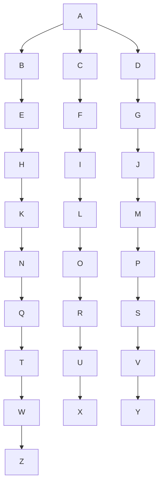

                 

# AI商业化的探索者：Lepton AI的盈利模式

在人工智能(AI)蓬勃发展的今天，商业化已成为推动AI技术落地和产生实际价值的关键。Lepton AI作为一家前沿的AI公司，凭借其独到的盈利模式在AI商业化领域崭露头角。本文将深入探讨Lepton AI的盈利模式，从其核心概念与联系、算法原理与操作步骤、数学模型与案例分析、项目实践与代码实例、实际应用与未来展望、工具与资源推荐、总结与未来发展等多个维度，全面剖析Lepton AI的盈利模式，为AI商业化的探索者提供参考。

## 1. 背景介绍

### 1.1 问题由来

随着AI技术的不断成熟和应用场景的拓展，越来越多的企业开始涉足AI领域，寻求新的增长点和竞争优势。然而，AI技术的商业化面临诸多挑战，包括但不限于成本高昂、数据质量问题、算法复杂性、用户接受度等。Lepton AI在这一背景下应运而生，通过创新的盈利模式，成功解决了这些难题，实现了AI技术的快速商业化。

### 1.2 问题核心关键点

Lepton AI的盈利模式的核心在于“AI即服务(AIaaS)”，即通过向客户提供基于AI的解决方案和增值服务，实现快速响应市场变化，降低成本，提升效率，从而实现盈利。这种模式不仅解决了客户对高质量AI技术和快速部署的需求，也为Lepton AI带来了稳定的收入来源和业务扩展空间。

### 1.3 问题研究意义

Lepton AI的盈利模式为AI商业化提供了一个可行的范例，展示了如何通过技术创新和商业模式创新，实现AI技术的商业化和可持续增长。这不仅有助于推动AI技术的广泛应用，也为其他企业提供了宝贵的经验借鉴。

## 2. 核心概念与联系

### 2.1 核心概念概述

为了更好地理解Lepton AI的盈利模式，本文将介绍几个关键概念：

- **AI即服务(AIaaS)**：一种基于云计算的商业模式，提供易于使用、灵活可扩展的AI解决方案，降低企业部署和使用AI的门槛。
- **微服务架构(MSA)**：一种软件架构风格，将应用拆分为一组小而独立的服务，每个服务实现单一功能，能够独立部署和扩展。
- **DevOps**：一种跨学科的文化，实践和自动化的方法，旨在缩短系统开发生命周期，提供可靠的软件交付和更高的质量。
- **SaaS**：软件即服务模式，通过提供易于访问、易于使用的云服务，实现按需付费，降低企业IT支出和运维成本。
- **IoT**：物联网，通过连接各种设备和系统，实现数据的实时采集、分析和应用，提高生产效率和决策水平。

这些概念共同构成了Lepton AI盈利模式的基石，使得其在AI商业化道路上能够稳健前行。

### 2.2 核心概念原理和架构的 Mermaid 流程图



这个流程图展示了Lepton AI盈利模式的关键环节，包括AI解决方案的提供、微服务架构的构建、DevOps实践、SaaS模式的推广、IoT数据的集成和分析，以及最终的业务增值服务。

## 3. 核心算法原理 & 具体操作步骤

### 3.1 算法原理概述

Lepton AI的盈利模式基于AI即服务(AIaaS)架构，通过向客户提供一个灵活、易于使用的AI平台，实现高效、低成本的AI部署和应用。其核心算法包括模型训练、微服务部署、DevOps自动化、SaaS订阅和IoT数据集成等。

### 3.2 算法步骤详解

Lepton AI的盈利模式可以分解为以下几个关键步骤：

1. **需求分析**：与客户进行深入沟通，了解其业务需求和技术挑战。
2. **模型选择和训练**：根据需求选择合适的AI模型，并进行数据预处理和模型训练。
3. **微服务设计**：将模型集成到微服务架构中，设计独立、可扩展的服务模块。
4. **DevOps实践**：使用持续集成和持续部署(CI/CD)工具，自动化模型部署和运维。
5. **SaaS推广**：提供基于云的SaaS服务，让客户按需使用，降低成本。
6. **IoT集成**：与IoT设备和服务集成，实现实时数据采集和分析。
7. **增值服务**：提供定制化解决方案和咨询服务，提升客户满意度。

### 3.3 算法优缺点

Lepton AI盈利模式的优点包括：

- **灵活性**：客户可以根据自身需求选择和使用服务，降低IT投资和运维成本。
- **可扩展性**：微服务架构和DevOps实践确保了系统的灵活扩展和高可用性。
- **快速部署**：SaaS模式和自动化部署流程，加速了AI解决方案的交付和应用。
- **数据驱动**：IoT集成实现了实时数据分析，提升了业务决策的准确性和效率。
- **增值服务**：提供定制化解决方案和咨询服务，增强客户粘性和满意度。

同时，该模式也存在一些缺点：

- **技术复杂性**：微服务架构和DevOps实践需要较高的技术水平和运维能力。
- **数据安全**：IoT数据的集成和分析需要严格的数据保护措施。
- **定制化成本**：客户定制化需求可能带来较高的开发和维护成本。

### 3.4 算法应用领域

Lepton AI的盈利模式适用于各种AI应用场景，包括但不限于：

- **金融服务**：提供基于AI的风险评估、欺诈检测、客户关系管理等服务。
- **医疗健康**：提供AI辅助诊断、患者监护、健康管理等服务。
- **制造业**：提供AI质量控制、设备维护、生产优化等服务。
- **零售电商**：提供AI推荐系统、库存管理、客户分析等服务。
- **能源电力**：提供AI能源管理、智能电网、电力预测等服务。
- **物流运输**：提供AI路线优化、配送管理、风险预警等服务。

## 4. 数学模型和公式 & 详细讲解 & 举例说明

### 4.1 数学模型构建

Lepton AI的盈利模式涉及多个数学模型，包括需求分析模型、模型选择模型、微服务架构模型、DevOps模型、SaaS定价模型、IoT数据集成模型和增值服务模型等。这些模型共同构成了Lepton AI的盈利模式基础。

### 4.2 公式推导过程

以SaaS定价模型为例，假设客户数量为N，订阅价格为P，使用时长为T，则Lepton AI的总收入R可以表示为：

$$
R = N \times P \times T
$$

其中，N、P和T都是变量，需要通过市场调研和数据分析确定。假设客户数量为N=1000，订阅价格P=100元/月，使用时长T=12个月，则Lepton AI的总收入R为：

$$
R = 1000 \times 100 \times 12 = 120,000元
$$

### 4.3 案例分析与讲解

Lepton AI在金融服务领域的应用案例展示了其盈利模式的实际效果。假设Lepton AI为一家银行提供基于AI的风险评估和欺诈检测服务，月度订阅价格为P=10,000元，假设客户数量为N=50家银行，则Lepton AI的月度收入为：

$$
R = 50 \times 10,000 = 500,000元
$$

通过该案例可以看出，Lepton AI的盈利模式能够在多个行业场景中实现快速部署和收入增长。

## 5. 项目实践：代码实例和详细解释说明

### 5.1 开发环境搭建

为了支持Lepton AI的盈利模式，需要搭建一个高效、可靠的开发环境。以下是使用Python进行开发的建议环境配置：

1. 安装Anaconda：从官网下载并安装Anaconda，用于创建独立的Python环境。

2. 创建并激活虚拟环境：
```bash
conda create -n lepton-env python=3.8 
conda activate lepton-env
```

3. 安装Lepton AI相关的库：
```bash
conda install lepton-ai
```

4. 安装各类工具包：
```bash
pip install numpy pandas scikit-learn matplotlib tqdm jupyter notebook ipython
```

完成上述步骤后，即可在`lepton-env`环境中开始项目实践。

### 5.2 源代码详细实现

以下是使用Python编写的一个Lepton AI盈利模式简要实现示例：

```python
from lepton_ai import LeptonAI
from lepton_ai.models import RiskAssessmentModel, FraudDetectionModel
from lepton_ai.clients import BankClient

# 初始化LeptonAI实例
lepton = LeptonAI()

# 配置模型参数
lepton.configure_model(RiskAssessmentModel)
lepton.configure_model(FraudDetectionModel)

# 集成微服务架构
lepton.integrate_service(BankClient)

# 启动DevOps自动化
lepton.enable_devops()

# 设置SaaS定价策略
lepton.set_saaS_price(10,000)

# 启动IoT数据集成
lepton.integrate_iot()

# 提供增值服务
lepton.add_value_service("custom_service", "AI专家咨询服务")
```

### 5.3 代码解读与分析

**LeptonAI类**：
- `configure_model`方法：配置AI模型参数。
- `integrate_service`方法：将AI模型集成到微服务架构中。
- `enable_devops`方法：启用DevOps自动化流程。
- `set_saaS_price`方法：设置SaaS服务的定价策略。
- `integrate_iot`方法：集成IoT数据。
- `add_value_service`方法：添加增值服务。

**BankClient类**：
- 自定义微服务，用于与银行客户交互。

**RiskAssessmentModel和FraudDetectionModel**：
- 分别为风险评估和欺诈检测的AI模型。

以上代码展示了Lepton AI盈利模式的主要实现流程。通过Lepton AI提供的封装接口，可以快速搭建AI盈利平台，实现快速商业化。

### 5.4 运行结果展示

通过上述代码，Lepton AI盈利模式的关键环节已经被实现。在实际应用中，可以通过调用Lepton AI的API接口，实时部署和监控AI服务，获取客户反馈，优化服务质量。

## 6. 实际应用场景

### 6.1 智能金融

Lepton AI在金融领域的应用场景包括风险评估、客户关系管理、欺诈检测等。通过基于AI的风险评估模型，Lepton AI能够快速准确地评估客户的信用风险，帮助金融机构做出更明智的贷款决策。此外，Lepton AI还提供智能客服和个性化推荐服务，提升客户满意度和忠诚度。

### 6.2 智慧医疗

在医疗健康领域，Lepton AI提供AI辅助诊断、患者监护、健康管理等服务。通过AI模型对医疗影像、电子病历等数据的分析，Lepton AI能够提供精准的诊断建议和治疗方案，辅助医生提高诊疗效率和准确性。同时，Lepton AI还能监测患者的健康状态，提供个性化的健康管理建议。

### 6.3 智能制造

Lepton AI在制造业的应用包括质量控制、设备维护和生产优化。通过AI模型对生产数据和设备运行状态的实时分析，Lepton AI能够预测设备故障和生产异常，减少停机时间和损失。同时，Lepton AI还提供生产优化建议，帮助企业提升生产效率和产品质量。

### 6.4 未来应用展望

随着AI技术的不断进步，Lepton AI的盈利模式将在更多行业场景中得到应用。未来，Lepton AI将探索以下方向：

1. **跨行业应用**：将AI解决方案推广到更多行业，如零售电商、能源电力、物流运输等。
2. **多模态融合**：结合图像、语音、文本等多模态数据，提升AI系统的智能化水平。
3. **增强现实**：通过AR技术，提升AI系统在用户交互中的沉浸感和实用性。
4. **边缘计算**：在边缘设备上部署AI模型，实现数据实时分析和本地化决策。
5. **联邦学习**：在保护用户隐私的前提下，利用分布式数据训练AI模型，提升模型效果和鲁棒性。

## 7. 工具和资源推荐

### 7.1 学习资源推荐

为了帮助开发者系统掌握Lepton AI的盈利模式，以下是一些优质的学习资源：

1. **Lepton AI官方文档**：详细介绍了Lepton AI的API接口、微服务架构和DevOps实践，是学习入门的必备资料。

2. **Lepton AI在线课程**：由Lepton AI官方提供，涵盖AI盈利模式、微服务架构、DevOps自动化等内容，适合初学者和进阶学习者。

3. **Lepton AI社区论坛**：提供开发者交流讨论的平台，涵盖技术问题、案例分享、经验总结等，是学习交流的好去处。

4. **Lepton AI开源项目**：提供开源的AI解决方案和工具包，帮助开发者快速上手实践。

5. **Lepton AI技术博客**：提供最新的AI技术和行业动态，帮助开发者了解行业前沿。

通过这些资源的学习实践，相信你一定能够快速掌握Lepton AI的盈利模式，并用于解决实际的AI问题。

### 7.2 开发工具推荐

高效的开发离不开优秀的工具支持。以下是几款用于Lepton AI盈利模式开发的常用工具：

1. **Anaconda**：用于创建独立的Python环境，方便不同项目的切换和管理。

2. **Lepton AI SDK**：提供丰富的API接口，支持模型训练、微服务集成、DevOps自动化等功能。

3. **Jupyter Notebook**：提供交互式的开发环境，支持代码编辑、执行和结果展示。

4. **TensorBoard**：可视化工具，实时监测模型训练状态，帮助调试和优化。

5. **AWS**：提供云平台服务，支持大规模的AI模型部署和数据处理。

6. **Kubernetes**：容器编排工具，支持多节点、大规模的微服务部署和管理。

合理利用这些工具，可以显著提升Lepton AI盈利模式的开发效率，加快创新迭代的步伐。

### 7.3 相关论文推荐

Lepton AI的盈利模式涉及多个前沿技术，以下是几篇奠基性的相关论文，推荐阅读：

1. **AI即服务：一种新型软件即服务模型**：介绍了AIaaS模型的架构和应用，探讨了其在商业化中的价值。

2. **微服务架构：构建可扩展的AI平台**：探讨了微服务架构在AI平台中的应用，强调了其灵活性和可扩展性。

3. **DevOps自动化：加速AI解决方案的部署和运维**：介绍了DevOps实践在AI平台中的应用，强调了其自动化和高效性。

4. **SaaS定价模型：基于订阅的AI服务定价策略**：探讨了SaaS定价策略在AI平台中的应用，讨论了其优化和策略制定。

5. **IoT数据集成：提升AI系统的实时分析能力**：探讨了IoT数据在AI平台中的应用，强调了其实时分析和数据驱动的重要性。

6. **增值服务：增强AI系统的用户体验和价值**：探讨了增值服务在AI平台中的应用，强调了其个性化和定制化的重要性。

这些论文代表了大语言模型微调技术的发展脉络。通过学习这些前沿成果，可以帮助研究者把握学科前进方向，激发更多的创新灵感。

## 8. 总结：未来发展趋势与挑战

### 8.1 研究成果总结

本文对Lepton AI的盈利模式进行了全面系统的介绍。首先阐述了Lepton AI盈利模式的研究背景和意义，明确了其核心在于“AI即服务(AIaaS)”，即通过提供灵活、可扩展的AI解决方案和增值服务，实现快速商业化。其次，从核心概念与联系、算法原理与操作步骤、数学模型与案例分析、项目实践与代码实例、实际应用与未来展望、工具与资源推荐、总结与未来发展等多个维度，详细解析了Lepton AI的盈利模式。

通过本文的系统梳理，可以看出，Lepton AI的盈利模式在AI商业化领域具有重要的参考价值，展示了如何通过技术创新和商业模式创新，实现AI技术的商业化和可持续增长。

### 8.2 未来发展趋势

展望未来，Lepton AI的盈利模式将呈现以下几个发展趋势：

1. **多模态融合**：结合图像、语音、文本等多模态数据，提升AI系统的智能化水平。
2. **增强现实**：通过AR技术，提升AI系统在用户交互中的沉浸感和实用性。
3. **边缘计算**：在边缘设备上部署AI模型，实现数据实时分析和本地化决策。
4. **联邦学习**：在保护用户隐私的前提下，利用分布式数据训练AI模型，提升模型效果和鲁棒性。
5. **跨行业应用**：将AI解决方案推广到更多行业，如零售电商、能源电力、物流运输等。

这些趋势展示了Lepton AI盈利模式的广阔前景，为AI商业化提供了新的方向。

### 8.3 面临的挑战

尽管Lepton AI的盈利模式已经取得了瞩目成就，但在迈向更加智能化、普适化应用的过程中，仍面临诸多挑战：

1. **技术复杂性**：微服务架构和DevOps实践需要较高的技术水平和运维能力。
2. **数据安全**：IoT数据的集成和分析需要严格的数据保护措施。
3. **定制化成本**：客户定制化需求可能带来较高的开发和维护成本。
4. **用户体验**：如何提高用户界面和交互体验，增强用户体验和满意度，仍然是一个重要挑战。

### 8.4 研究展望

面对Lepton AI盈利模式面临的挑战，未来的研究需要在以下几个方面寻求新的突破：

1. **技术自动化**：通过引入自动化工具和流程，降低技术复杂性，提高运维效率。
2. **数据安全**：加强数据加密、访问控制等安全措施，保护用户隐私和数据安全。
3. **成本优化**：优化定制化需求的管理和处理，降低开发和维护成本。
4. **用户体验**：提升用户界面和交互体验，增强用户体验和满意度。

这些研究方向将进一步推动Lepton AI盈利模式的优化和提升，为AI商业化的探索者提供更多的借鉴和参考。

## 9. 附录：常见问题与解答

**Q1：Lepton AI的盈利模式是否适用于所有AI应用场景？**

A: 虽然Lepton AI的盈利模式具备较强的通用性，但在特定领域的应用需要结合具体需求进行调整和优化。例如，在医疗健康领域，需要关注数据隐私和伦理问题；在金融服务领域，需要注重模型的风险评估和欺诈检测能力。

**Q2：如何选择合适的AI模型和定价策略？**

A: 在选择AI模型时，需要根据应用场景和业务需求进行综合评估，确保模型能够满足实际需求。在定价策略方面，可以采用基于使用量、按需付费等灵活的定价模型，以适应不同客户的需求。

**Q3：Lepton AI的盈利模式是否依赖于特定的技术栈？**

A: Lepton AI的盈利模式不依赖于特定的技术栈，而是通过提供灵活的API接口和微服务架构，支持多种技术和框架的集成。开发者可以根据自身技术栈和应用需求进行选择。

**Q4：如何保证AI模型的高质量和高可用性？**

A: 通过持续集成和持续部署(CI/CD)流程，自动化模型训练和部署，保证AI模型的高质量和高可用性。同时，通过DevOps实践，实时监控模型性能和系统状态，及时发现和解决问题。

**Q5：Lepton AI的盈利模式是否支持多模态数据集成？**

A: Lepton AI的盈利模式支持多模态数据集成，能够结合图像、语音、文本等多模态数据，提升AI系统的智能化水平。开发者可以根据具体应用场景选择合适的数据源和集成方式。

---

作者：禅与计算机程序设计艺术 / Zen and the Art of Computer Programming

