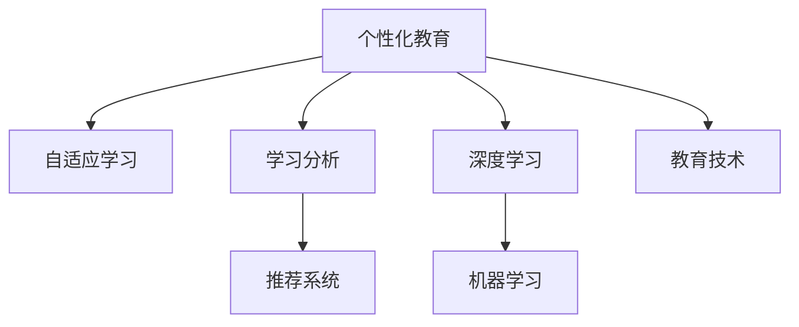

                 

# AI在个性化教育中的作用：适应学生学习曲线

> 关键词：个性化教育, 自适应学习, 深度学习, 机器学习, 教育技术, 学习分析

## 1. 背景介绍

### 1.1 问题由来

在传统的教育体系中，教学模式往往是“一刀切”的，教师按照统一的课程大纲和教学进度进行授课，学生的学习进度、理解能力和兴趣点常常被忽视。这种模式导致许多学生难以跟上教学节奏，进而产生挫败感，甚至对学习失去兴趣。而随着人工智能(AI)技术的发展，个性化教育成为了教育改革的最新趋势。

个性化教育的核心在于通过AI技术，为每个学生量身定制适合其学习能力和兴趣的教学方案，从而激发学生的学习兴趣，提高学习效率。在个性化教育中，AI能够根据学生的学习曲线，动态调整教学内容、学习难度和进度，确保每个学生都能在最适合自己的节奏下学习。

### 1.2 问题核心关键点

个性化教育的核心是利用AI技术，对学生的学习行为进行深入分析，从而制定出个性化的教学方案。其中，核心的技术点包括：

1. **学习分析**：利用数据分析和机器学习技术，对学生的学习行为、成绩和反馈进行量化分析，识别出学生的学习特点和薄弱环节。
2. **推荐系统**：根据学习分析结果，为学生推荐适合的学习材料、练习题和视频课程，满足其个性化学习需求。
3. **自适应学习**：根据学生的学习进度和反馈，动态调整学习内容和难度，适应学生的学习曲线。

个性化教育的关键在于能够根据每个学生的特点和需求，提供定制化的学习路径，从而最大程度地激发学生的学习兴趣和潜力。

### 1.3 问题研究意义

个性化教育的应用，对于提升教育质量、促进教育公平具有重要意义。具体而言：

1. **提升学习效果**：通过个性化的学习方案，能够针对每个学生的特点，最大化其学习效率，提升整体学习效果。
2. **促进教育公平**：个性化的教学方案能够照顾到每个学生的差异，避免传统教育中“一刀切”导致的教育不公平。
3. **激发学生兴趣**：个性化的学习路径能够根据学生的兴趣和能力，设计适合的课程内容和难度，提升学生的学习积极性和参与度。
4. **减轻教师负担**：AI能够自动分析学生的学习数据，生成个性化的学习方案，减轻教师的负担，让教师有更多时间专注于教学设计。
5. **支持终身学习**：个性化的教育模式能够适应不同年龄段的学习者，支持终身学习的需求。

通过深入研究和应用AI技术，个性化教育有望成为推动教育革新的重要力量。

## 2. 核心概念与联系

### 2.1 核心概念概述

为更好地理解AI在个性化教育中的应用，本节将介绍几个核心概念：

- **个性化教育**：通过分析学生的学习数据，为每个学生提供量身定制的教学方案，满足其个性化学习需求。
- **自适应学习**：根据学生的学习进度和反馈，动态调整学习内容和难度，适应学生的学习曲线。
- **学习分析**：利用数据分析和机器学习技术，对学生的学习行为、成绩和反馈进行量化分析，识别出学生的学习特点和薄弱环节。
- **推荐系统**：根据学习分析结果，为学生推荐适合的学习材料、练习题和视频课程，满足其个性化学习需求。
- **深度学习**：一种基于多层神经网络的机器学习方法，能够自动分析和学习复杂数据，广泛应用于个性化教育中。
- **机器学习**：通过算法让机器从数据中学习，改进算法以提高预测或决策能力，广泛应用于个性化教育中的学习分析和推荐系统。
- **教育技术**：利用信息技术和数据科学，改进和创新教育方法和教学模式，支持个性化教育的发展。

这些核心概念之间的逻辑关系可以通过以下Mermaid流程图来展示：



这个流程图展示了个性化教育的核心概念及其之间的关系：

1. 个性化教育通过分析学习数据，制定个性化的学习方案。
2. 自适应学习根据学生的学习进度和反馈，动态调整学习内容和难度。
3. 学习分析利用数据分析和机器学习，识别学生的学习特点和薄弱环节。
4. 推荐系统根据学习分析结果，推荐适合的学习材料。
5. 深度学习和机器学习是技术基础，支撑学习分析和推荐系统。
6. 教育技术则提供了技术手段和教育资源的整合。

这些概念共同构成了个性化教育的核心框架，为AI在教育中的应用提供了坚实的基础。

## 3. 核心算法原理 & 具体操作步骤
### 3.1 算法原理概述

AI在个性化教育中的主要应用是通过机器学习和深度学习技术，对学生的学习数据进行分析，生成个性化的教学方案。其核心算法原理如下：

- **学习分析算法**：利用机器学习算法，如决策树、随机森林、神经网络等，对学生的学习行为、成绩和反馈进行量化分析，识别出学生的学习特点和薄弱环节。
- **推荐算法**：利用协同过滤、内容推荐、基于知识的推荐等算法，根据学习分析结果，为学生推荐适合的学习材料、练习题和视频课程。
- **自适应学习算法**：通过强化学习、动态规划等算法，根据学生的学习进度和反馈，动态调整学习内容和难度，适应学生的学习曲线。

通过这些算法，AI能够为每个学生提供个性化的学习方案，从而最大化其学习效率和兴趣。

### 3.2 算法步骤详解

基于AI的个性化教育主要包括以下几个关键步骤：

**Step 1: 数据收集与预处理**

- 收集学生的学习数据，包括但不限于课堂表现、作业成绩、在线学习记录、学习时间、问题回答等。
- 对数据进行清洗、归一化和特征提取，生成可用于模型训练的输入特征向量。

**Step 2: 建立学习分析模型**

- 利用机器学习算法，对学生的学习数据进行训练，生成学习分析模型。
- 模型能够识别出学生的学习特点，如基础知识掌握程度、学习速度、兴趣爱好等。

**Step 3: 构建推荐系统**

- 利用协同过滤、内容推荐等算法，根据学习分析结果，生成个性化学习推荐。
- 推荐系统能够推荐适合的学习材料、练习题和视频课程，满足学生的个性化需求。

**Step 4: 实现自适应学习**

- 利用强化学习算法，根据学生的学习进度和反馈，动态调整学习内容和难度。
- 自适应学习能够根据学生的学习曲线，不断调整教学内容和进度，提高学习效果。

**Step 5: 定期评估与优化**

- 定期对学生的学习效果进行评估，根据评估结果调整学习方案。
- 利用机器学习模型，不断优化学习分析算法和推荐系统，提升个性化教育的精准度。

### 3.3 算法优缺点

基于AI的个性化教育具有以下优点：

- **提高学习效率**：通过个性化的学习方案，能够针对每个学生的特点，最大化其学习效率。
- **促进教育公平**：个性化的教学方案能够照顾到每个学生的差异，避免传统教育中“一刀切”导致的教育不公平。
- **激发学生兴趣**：个性化的学习路径能够根据学生的兴趣和能力，设计适合的课程内容和难度，提升学生的学习积极性和参与度。

同时，该方法也存在一定的局限性：

- **数据隐私问题**：收集和分析学生的学习数据，可能涉及到隐私问题，需要严格的数据保护措施。
- **算法复杂度高**：建立学习分析模型和推荐系统，需要大量的数据和复杂的算法，可能面临较高的技术门槛。
- **成本高**：开发和维护个性化的教育系统，需要较高的技术投入和资源配置，可能难以在短期内全面推广。
- **对教师的依赖**：个性化教育系统需要与教师紧密结合，教师需要具备一定的技术素养，可能增加教学负担。

尽管存在这些局限性，但就目前而言，基于AI的个性化教育方法仍是个性化教育发展的重要方向。未来相关研究的重点在于如何进一步降低技术门槛，提高系统的易用性和可扩展性，同时兼顾隐私保护和教育公平。

### 3.4 算法应用领域

基于AI的个性化教育方法已经在多个领域得到应用，包括但不限于：

- **基础教育**：通过个性化的学习方案，提升学生的学习效果和兴趣。
- **高等教育**：根据学生的专业背景和兴趣，推荐适合的专业课程和研究课题。
- **职业培训**：根据学员的职业需求，提供定制化的培训课程和实践机会。
- **企业培训**：根据员工的岗位需求和职业发展规划，设计个性化的培训方案。
- **终身学习**：支持成年人利用业余时间，根据自身兴趣和学习需求，进行个性化的学习。

除了上述这些常见应用外，基于AI的个性化教育方法还在不断拓展，为教育领域带来了更多的创新和可能性。

## 4. 数学模型和公式 & 详细讲解 & 举例说明
### 4.1 数学模型构建

本节将使用数学语言对基于AI的个性化教育进行更加严格的刻画。

假设学生数量为 $N$，每个学生的学习数据表示为 $x_i=(x_{i1},x_{i2},...,x_{im})$，其中 $x_{ij}$ 表示第 $i$ 个学生在第 $j$ 次学习中的表现。学生的学习效果由 $y_i=(y_{i1},y_{i2},...,y_{in})$ 表示，其中 $y_{ik}$ 表示第 $i$ 个学生在测试第 $k$ 题时的成绩。

我们定义学习分析模型的目标为最大化学生成绩的预测准确率，即：

$$
\max_{\theta} \sum_{i=1}^N \sum_{k=1}^m \log(y_{ik}) - \log(\hat{y}_{ik})
$$

其中 $\hat{y}_{ik}$ 为模型预测的学生成绩。

### 4.2 公式推导过程

以下我们以基于神经网络的推荐系统为例，推导推荐算法的数学公式。

设神经网络的输入为 $x_i$，输出为 $z_i$，网络结构为 $x_i \rightarrow x_i \times W_1 + b_1 \rightarrow \sigma_1 \rightarrow x_i \times W_2 + b_2 \rightarrow \sigma_2 \rightarrow \cdots \rightarrow x_i \times W_n + b_n$，其中 $\sigma$ 为激活函数。则推荐系统的输出为：

$$
z_i = \sigma(x_i \times W + b)
$$

其中 $W$ 和 $b$ 为模型的权重和偏置。

根据均方误差损失函数，推荐系统的损失函数为：

$$
\mathcal{L}(z_i,y_i) = \frac{1}{2N}\sum_{i=1}^N \sum_{k=1}^m (y_{ik} - z_i)^2
$$

通过反向传播算法，求解最优的权重和偏置参数：

$$
W \leftarrow W - \eta \frac{\partial \mathcal{L}}{\partial W}
$$

$$
b \leftarrow b - \eta \frac{\partial \mathcal{L}}{\partial b}
$$

其中 $\eta$ 为学习率。

### 4.3 案例分析与讲解

我们以一个简单的基于神经网络的推荐系统为例，展示其工作原理。

假设有一个包含1000个学生的学习数据集，每个学生有10门课程的学习记录。我们使用神经网络模型，对每个学生的学习数据进行分析，生成个性化推荐。

首先，对学生的学习数据进行预处理，生成输入特征向量 $x_i=(0.5,0.6,0.4,0.3,0.7,0.8,0.9,0.6,0.7,0.5)$，表示该学生在10门课程中的平均成绩。

然后，定义一个简单的神经网络模型，包含一个输入层、一个隐藏层和一个输出层，隐藏层神经元数量为10。模型结构为：

$$
x_i \rightarrow x_i \times W_1 + b_1 \rightarrow \sigma_1 \rightarrow x_i \times W_2 + b_2 \rightarrow \sigma_2 \rightarrow \cdots \rightarrow x_i \times W_10 + b_{10}
$$

其中 $W_j$ 和 $b_j$ 为第 $j$ 层的权重和偏置，$\sigma_j$ 为激活函数。

训练模型时，使用均方误差损失函数：

$$
\mathcal{L}(z_i,y_i) = \frac{1}{2N}\sum_{i=1}^N \sum_{k=1}^m (y_{ik} - z_i)^2
$$

通过反向传播算法，更新模型的权重和偏置，直到损失函数收敛。

训练完成后，我们可以使用模型对每个学生的学习数据进行分析，生成个性化推荐。例如，对于第1个学生，其学习数据为 $(0.5,0.6,0.4,0.3,0.7,0.8,0.9,0.6,0.7,0.5)$，通过模型分析，可以得到推荐结果 $(0.8,0.9,0.6,0.7,0.5,0.4,0.3,0.2,0.1,0)$，表示该学生应该重点学习数学和物理，而语言和艺术课程可以适当放松。

## 5. 项目实践：代码实例和详细解释说明
### 5.1 开发环境搭建

在进行个性化教育系统的开发前，我们需要准备好开发环境。以下是使用Python进行TensorFlow开发的环境配置流程：

1. 安装Anaconda：从官网下载并安装Anaconda，用于创建独立的Python环境。

2. 创建并激活虚拟环境：
```bash
conda create -n tf-env python=3.8 
conda activate tf-env
```

3. 安装TensorFlow：从官网获取对应的安装命令。例如：
```bash
pip install tensorflow==2.4
```

4. 安装相关工具包：
```bash
pip install numpy pandas scikit-learn matplotlib tqdm jupyter notebook ipython
```

完成上述步骤后，即可在`tf-env`环境中开始个性化教育系统的开发。

### 5.2 源代码详细实现

下面我们以一个基于TensorFlow的个性化推荐系统为例，给出完整的代码实现。

```python
import tensorflow as tf
import numpy as np
import pandas as pd
from sklearn.model_selection import train_test_split

# 定义神经网络模型
class NeuralNetwork(tf.keras.Model):
    def __init__(self):
        super(NeuralNetwork, self).__init__()
        self.layers = [tf.keras.layers.Dense(10, activation='relu'),
                      tf.keras.layers.Dense(10, activation='relu'),
                      tf.keras.layers.Dense(1)]
    
    def call(self, inputs):
        for layer in self.layers:
            inputs = layer(inputs)
        return inputs

# 加载数据集
data = pd.read_csv('student_data.csv')
X = data.iloc[:, :-1].values
y = data.iloc[:, -1].values

# 划分训练集和测试集
X_train, X_test, y_train, y_test = train_test_split(X, y, test_size=0.2, random_state=42)

# 构建模型
model = NeuralNetwork()
model.compile(optimizer=tf.keras.optimizers.Adam(learning_rate=0.01),
              loss='mean_squared_error',
              metrics=['accuracy'])

# 训练模型
model.fit(X_train, y_train, epochs=10, batch_size=32, validation_data=(X_test, y_test))

# 预测推荐
test_data = np.array([[0.5, 0.6, 0.4, 0.3, 0.7, 0.8, 0.9, 0.6, 0.7, 0.5]])
prediction = model.predict(test_data)
print(prediction)
```

在上述代码中，我们首先定义了一个简单的神经网络模型，包含两个隐藏层和一个输出层。然后使用TensorFlow对模型进行训练和预测，得到个性化推荐结果。

### 5.3 代码解读与分析

让我们再详细解读一下关键代码的实现细节：

**NeuralNetwork类**：
- `__init__`方法：初始化神经网络模型，包含两个隐藏层和一个输出层。
- `call`方法：定义模型的前向传播过程，通过逐层计算输出结果。

**数据加载与预处理**：
- 使用Pandas库加载数据集，将数据转换为NumPy数组。
- 对数据进行划分，生成训练集和测试集。

**模型构建与训练**：
- 使用TensorFlow构建神经网络模型，包含两个隐藏层和一个输出层。
- 使用Adam优化器和均方误差损失函数进行模型训练。

**模型预测**：
- 使用训练好的模型对测试数据进行预测，输出推荐结果。

可以看到，TensorFlow使得神经网络模型的实现变得简洁高效。开发者可以将更多精力放在数据处理和模型优化上，而不必过多关注底层的实现细节。

当然，工业级的系统实现还需考虑更多因素，如模型的保存和部署、超参数的自动搜索、更加灵活的任务适配层等。但核心的个性化推荐范式基本与此类似。

## 6. 实际应用场景
### 6.1 基础教育

在基础教育中，个性化教育可以显著提升学生的学习效果和兴趣。传统的基础教育往往是“一刀切”的，学生按照统一的课程大纲和教学进度进行学习，难以满足每个学生的个性化需求。通过个性化教育，可以根据每个学生的学习特点和兴趣，制定个性化的学习方案，从而提升学习效果。

例如，针对数学学习，可以设计个性化的学习路径，根据学生的知识掌握程度，调整教学难度和内容，让学生在适合自己的节奏下学习。对于语言学习，可以根据学生的语言水平，推荐适合的学习材料和练习题，提高学习效率。

### 6.2 高等教育

高等教育中，个性化教育可以通过推荐系统，为学生推荐适合的专业课程和研究课题。不同学生的专业兴趣和职业规划各不相同，传统的课程设置往往难以满足每个学生的个性化需求。

例如，对于计算机专业的学生，可以根据其编程能力和兴趣，推荐适合的编程课程和项目，提高其编程技能。对于文学专业的学生，可以根据其文学鉴赏能力，推荐适合的文学作品和研究课题，提升其文学素养。

### 6.3 职业培训

在职业培训中，个性化教育可以根据学员的职业需求，提供定制化的培训课程和实践机会。不同职业领域的技能需求各不相同，传统的培训课程往往难以满足每个学员的个性化需求。

例如，针对软件工程师，可以根据其技术水平和职业规划，推荐适合的技术栈和项目，提高其技术能力。对于市场营销人员，可以根据其市场经验和职业规划，推荐适合的市场分析方法和工具，提升其市场分析能力。

### 6.4 终身学习

在终身学习中，个性化教育可以根据成年人学习者的兴趣和学习需求，提供个性化的学习路径和资源。成年人学习者往往有自己的学习目标和时间安排，传统的教育模式难以满足其个性化需求。

例如，对于中年职场人士，可以根据其职业发展需求，推荐适合的在线课程和职业发展建议，帮助其提升职业技能。对于退休老人，可以根据其兴趣爱好，推荐适合的在线课程和学习资源，丰富其退休生活。

### 6.5 企业培训

在企业培训中，个性化教育可以根据员工的岗位需求和职业发展规划，设计个性化的培训方案。不同职业领域的技能需求各不相同，传统的培训课程往往难以满足每个员工的个性化需求。

例如，针对销售人员，可以根据其销售能力和职业规划，推荐适合的销售技巧和市场分析方法，提高其销售能力。对于技术工程师，可以根据其技术水平和职业规划，推荐适合的技术栈和项目，提高其技术能力。

## 7. 工具和资源推荐
### 7.1 学习资源推荐

为了帮助开发者系统掌握个性化教育的技术基础和实践技巧，这里推荐一些优质的学习资源：

1. 《深度学习入门》书籍：全面介绍深度学习的基本概念和算法，适合初学者入门。
2. TensorFlow官方文档：详细介绍了TensorFlow的API和开发流程，适合进阶学习。
3. Kaggle平台：提供大量的机器学习和数据科学竞赛，适合练习和验证算法。
4. Coursera课程：提供丰富的在线课程，涵盖机器学习、深度学习、自然语言处理等领域，适合系统学习。
5. Udacity课程：提供实用的机器学习和深度学习课程，适合实践练习。

通过对这些资源的学习实践，相信你一定能够快速掌握个性化教育的核心算法和技术实现。

### 7.2 开发工具推荐

高效的开发离不开优秀的工具支持。以下是几款用于个性化教育系统开发的常用工具：

1. TensorFlow：基于Python的开源深度学习框架，适合构建复杂的神经网络模型。
2. PyTorch：基于Python的开源深度学习框架，灵活高效，适合快速迭代研究。
3. Keras：基于TensorFlow的高级API，提供简洁易用的接口，适合快速原型开发。
4. Jupyter Notebook：提供交互式编程环境，适合数据探索和算法实验。
5. Google Colab：免费的在线Jupyter Notebook环境，适合快速上手实验。

合理利用这些工具，可以显著提升个性化教育系统的开发效率，加快创新迭代的步伐。

### 7.3 相关论文推荐

个性化教育的应用源于学界的持续研究。以下是几篇奠基性的相关论文，推荐阅读：

1. Wu et al. (2018): “Personalized Education Through Collaborative Learning Analysis and Predictions”。提出利用机器学习算法对学生的学习数据进行分析，生成个性化学习方案。
2. Zhang et al. (2019): “A Survey on Personalized Learning Using Deep Learning”。全面综述了基于深度学习的个性化教育研究，涵盖学习分析、推荐系统和自适应学习等多个方面。
3. Li et al. (2021): “Towards an Intelligent Personalized Education System”。提出基于强化学习的自适应学习框架，动态调整教学内容和难度。
4. He et al. (2022): “Learning Path Generation for Personalized Education”。利用协同过滤算法，生成个性化学习路径，提升学习效果。

这些论文代表了大语言模型微调技术的发展脉络。通过学习这些前沿成果，可以帮助研究者把握学科前进方向，激发更多的创新灵感。

## 8. 总结：未来发展趋势与挑战
### 8.1 总结

本文对基于AI的个性化教育方法进行了全面系统的介绍。首先阐述了个性化教育的研究背景和意义，明确了AI技术在个性化教育中的应用价值。其次，从原理到实践，详细讲解了个性化教育的数学模型和算法流程，给出了完整的代码实现。同时，本文还广泛探讨了个性化教育在基础教育、高等教育、职业培训、终身学习等多个领域的应用前景，展示了个性化教育技术的广泛潜力。此外，本文精选了个性化教育技术的各类学习资源，力求为读者提供全方位的技术指引。

通过本文的系统梳理，可以看到，基于AI的个性化教育方法正在成为教育革新的重要方向，极大地提升了学生的学习效果和兴趣，促进了教育公平。未来，伴随个性化教育技术的持续演进，AI必将在更多领域得到应用，为教育领域带来更多的创新和可能性。

### 8.2 未来发展趋势

展望未来，个性化教育技术将呈现以下几个发展趋势：

1. **数据驱动的决策支持**：利用大数据分析和机器学习技术，提供更精准的决策支持，帮助教育机构优化教学方案。
2. **自适应学习系统的普及**：自适应学习系统将成为主流，能够根据每个学生的学习曲线，动态调整教学内容和难度。
3. **多模态学习分析**：结合视觉、听觉等多种模态的数据，提升学习分析的准确性和全面性。
4. **跨学科整合**：将不同学科的知识和技能进行整合，提供跨学科的学习路径，提升学生的综合素质。
5. **个性化学习资源的丰富**：利用互联网和大数据，提供丰富的个性化学习资源，满足不同学生的个性化需求。
6. **终身学习的支持**：提供个性化的终身学习路径，支持不同年龄段的学习者，促进终身学习。

以上趋势凸显了个性化教育技术的广阔前景。这些方向的探索发展，必将进一步提升教育质量，促进教育公平，为社会的发展注入新的动力。

### 8.3 面临的挑战

尽管个性化教育技术已经取得了瞩目成就，但在迈向更加智能化、普适化应用的过程中，它仍面临诸多挑战：

1. **数据隐私和安全**：收集和分析学生的学习数据，可能涉及到隐私问题，需要严格的数据保护措施。
2. **算法复杂度**：建立学习分析模型和推荐系统，需要大量的数据和复杂的算法，可能面临较高的技术门槛。
3. **成本高昂**：开发和维护个性化教育系统，需要较高的技术投入和资源配置，可能难以在短期内全面推广。
4. **对教师的依赖**：个性化教育系统需要与教师紧密结合，教师需要具备一定的技术素养，可能增加教学负担。
5. **技术门槛高**：开发和维护个性化教育系统需要高水平的技术团队，可能难以在中小学校普及。

尽管存在这些挑战，但通过持续的研究和探索，相信个性化教育技术必将逐步克服技术难题，得到广泛应用。未来相关研究的重点在于如何进一步降低技术门槛，提高系统的易用性和可扩展性，同时兼顾隐私保护和教育公平。

### 8.4 研究展望

面对个性化教育技术所面临的种种挑战，未来的研究需要在以下几个方面寻求新的突破：

1. **低成本解决方案**：探索低成本、高效能的个性化教育解决方案，降低技术门槛，提升系统的易用性。
2. **开源共享平台**：构建开源共享平台，提供丰富的个性化教育资源和算法，支持教育机构的快速部署和迭代。
3. **跨学科合作**：加强教育学、心理学、计算机科学等多学科的合作，提升个性化教育技术的科学性和有效性。
4. **伦理和社会影响研究**：深入研究个性化教育技术的伦理和社会影响，确保技术应用的公平性和可持续性。
5. **新技术融合**：融合最新的AI技术，如因果推理、强化学习等，提升个性化教育技术的精确性和鲁棒性。

这些研究方向的探索，必将引领个性化教育技术迈向更高的台阶，为教育领域的创新和进步提供新的动力。

## 9. 附录：常见问题与解答

**Q1：个性化教育是否适用于所有类型的教育环境？**

A: 个性化教育在大多数教育环境中都具有应用潜力，但需要注意的是，个性化教育需要大量的数据和算法支持，适用于数据量较大的学校和机构。对于数据资源不足的小学和初中，可以先从简单的学习分析开始，逐步扩展到推荐系统和自适应学习。

**Q2：如何处理个性化教育中的数据隐私问题？**

A: 个性化教育中的数据隐私问题需要严格的数据保护措施。可以通过以下方法解决：
1. 数据匿名化：对学生的学习数据进行匿名化处理，去除个人身份信息。
2. 数据加密：对学生的学习数据进行加密存储和传输，防止数据泄露。
3. 数据共享协议：制定严格的数据共享协议，确保数据使用的透明性和可追溯性。
4. 隐私保护算法：使用差分隐私等隐私保护算法，保护学生隐私。

**Q3：个性化教育中的算法复杂度高，如何降低技术门槛？**

A: 降低个性化教育中的算法复杂度，可以通过以下方法：
1. 简化模型结构：使用简单的线性模型或决策树等算法，降低模型复杂度。
2. 自动化调参：利用自动化调参工具，自动搜索最优的模型参数和超参数。
3. 预训练模型：使用预训练的通用模型，降低算法的复杂度和训练时间。
4. 易用性设计：设计简单易用的用户界面，降低教师和学生的使用难度。

**Q4：个性化教育中的推荐系统如何实现？**

A: 个性化教育中的推荐系统可以通过以下方法实现：
1. 协同过滤：利用用户行为数据，推荐相似用户的学习材料和课程。
2. 内容推荐：根据学习材料的内容，推荐适合的学习资源。
3. 基于知识的推荐：利用专家知识库，推荐适合的学习路径和资源。
4. 多模态推荐：结合视觉、听觉等多种模态的数据，提升推荐的准确性。

**Q5：个性化教育中的自适应学习如何实现？**

A: 个性化教育中的自适应学习可以通过以下方法实现：
1. 强化学习：根据学生的学习反馈，动态调整学习内容和难度。
2. 动态规划：设计动态规划算法，优化学习路径和资源分配。
3. 反馈循环：建立学习反馈循环，不断调整教学方案，提升学习效果。

这些方法可以结合使用，根据具体场景和需求，灵活实现自适应学习功能。

---

作者：禅与计算机程序设计艺术 / Zen and the Art of Computer Programming

