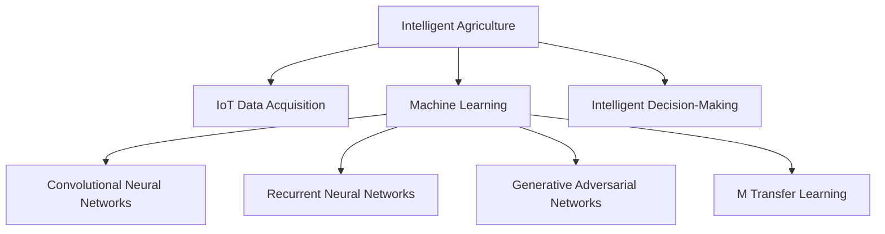

                 

# AI在智能农作物病虫害防治中的应用：提高产量

## 1. 背景介绍

### 1.1 问题由来
随着全球人口的持续增长和耕地资源的紧缺，确保农作物的稳定产量成为了全球农业生产的首要任务。传统的农作物病虫害防治主要依靠人工巡查和化学农药，存在劳动强度大、成本高、环境污染等问题。近年来，人工智能(AI)技术在农业领域的逐渐普及，为农作物病虫害防治提供了新的方向，成为提高农作物产量的重要手段。

### 1.2 问题核心关键点
人工智能在农作物病虫害防治中的应用，主要集中在三个方面：
1. **数据获取与处理**：利用无人机、传感器等设备获取作物生长状态、病虫害数据。
2. **模型训练与优化**：基于机器学习模型对病虫害进行预测和识别。
3. **智能决策与执行**：构建智能决策系统，指导病虫害防治措施，提高防治效果。

### 1.3 问题研究意义
智能农作物病虫害防治技术的应用，能够显著降低人工成本，减少农药使用，保护环境，提升作物产量和品质。此外，该技术还可以实时监测和管理农田，提高农业生产的智能化和自动化水平，为农业可持续发展和食品安全提供有力保障。

## 2. 核心概念与联系

### 2.1 核心概念概述

为更好地理解AI在智能农作物病虫害防治中的应用，本节将介绍几个密切相关的核心概念：

- **智能农业**：通过信息化技术，实现农作物种植、病虫害防治、气象预报、田间管理等各环节的智能化，提升农业生产效率和质量。
- **物联网(IoT)**：利用传感器、智能设备等，实时收集农作物生长和病虫害信息，为精准农业提供数据支持。
- **机器学习**：通过构建和训练算法模型，对农作物生长状态和病虫害进行预测和诊断，实现智能决策。
- **深度学习**：一种高级的机器学习方法，通过构建神经网络模型，学习数据的隐含特征，用于复杂问题的解决。
- **卷积神经网络(CNN)**：一种经典的深度学习模型，常用于图像处理和识别任务。
- **递归神经网络(RNN)**：适用于序列数据处理的深度学习模型，常用于时间序列数据的预测。
- **生成对抗网络(GAN)**：通过对抗学习的方式，生成高保真的假数据，用于数据增强和生成任务。
- **迁移学习**：将一个领域学习到的知识，迁移应用到另一个相关领域，提升模型的泛化能力。

这些核心概念之间的逻辑关系可以通过以下Mermaid流程图来展示：



这个流程图展示了一个完整的智能农业系统，从数据采集到模型训练，再到智能决策，各环节的紧密联系。

## 3. 核心算法原理 & 具体操作步骤
### 3.1 算法原理概述

基于AI的智能农作物病虫害防治，主要通过数据采集、特征提取、模型训练和智能决策四个步骤来实现。具体来说：

1. **数据采集**：利用无人机、传感器等设备，实时获取农田的土壤、气象、植物生长状态等信息。
2. **特征提取**：对采集到的数据进行预处理和特征提取，提取出有助于病虫害诊断和防治的关键特征。
3. **模型训练**：基于提取出的特征，训练机器学习或深度学习模型，用于病虫害的预测和识别。
4. **智能决策**：根据模型预测结果，结合专家知识库，构建智能决策系统，指导病虫害防治措施。

### 3.2 算法步骤详解

**Step 1: 数据采集与预处理**
- 选择适合的传感器和设备，获取农田的土壤、气象、植物生长状态等信息。
- 对采集到的数据进行清洗和预处理，去除噪声和异常值。
- 将数据转换为机器学习模型可以处理的格式。

**Step 2: 特征提取与选择**
- 基于采集到的数据，提取有助于病虫害诊断和防治的关键特征。
- 使用PCA、LDA等降维技术，对特征进行选择和降维，提高模型训练效率。
- 利用CNN、RNN等深度学习模型，对数据进行更深层次的特征提取。

**Step 3: 模型训练与优化**
- 选择适合的机器学习模型（如决策树、随机森林、支持向量机等），或深度学习模型（如CNN、RNN、GAN等）。
- 划分训练集和测试集，使用训练集训练模型，测试集评估模型性能。
- 根据测试集的结果，调整模型参数，优化模型性能。

**Step 4: 智能决策与执行**
- 构建智能决策系统，根据模型预测结果，结合专家知识库，生成防治方案。
- 将防治方案转化为具体的执行步骤，例如喷洒农药、灌溉、施肥等。
- 实时监控防治效果，根据反馈调整防治措施，确保防治效果最大化。

### 3.3 算法优缺点

基于AI的智能农作物病虫害防治方法具有以下优点：
1. **精准化防治**：能够精确识别病虫害种类和范围，提高防治的针对性和效果。
2. **高效化管理**：利用自动化设备，减少人力成本，提高农业生产效率。
3. **智能化决策**：结合专家知识和数据分析，生成最优防治方案。
4. **环保化操作**：减少农药使用量，保护环境。

但该方法也存在一定的局限性：
1. **初始数据需求高**：需要大量的初始数据进行模型训练，数据获取和处理成本较高。
2. **模型复杂度高**：深度学习模型结构复杂，训练和推理过程耗时较长。
3. **算法鲁棒性差**：对数据噪声和变化较为敏感，模型泛化能力有限。
4. **成本投入高**：设备购置和维护成本较高，大规模部署难度大。

尽管存在这些局限性，但基于AI的智能病虫害防治方法仍是大规模农业生产的理想选择。未来相关研究的重点在于如何进一步降低数据和设备成本，提高模型鲁棒性，加速模型训练和推理过程，从而更好地适应农业生产的实际需求。

### 3.4 算法应用领域

基于AI的智能农作物病虫害防治技术，已经在全球多个农业生产国得到了应用，取得了显著效果。具体而言：

- **美国**：采用无人机和传感器监测农田，使用机器学习模型进行病虫害预测和防治。
- **中国**：利用卫星遥感和无人机技术，实时监测农田病虫害，智能决策防治措施。
- **印度**：结合GIS和物联网技术，构建智能农业平台，优化农作物生长和病虫害防治。
- **巴西**：采用深度学习模型进行病虫害图像识别，提高农业生产智能化水平。

这些应用实例表明，AI技术在智能农作物病虫害防治中的巨大潜力，为农业生产的可持续发展提供了新的方向。

## 4. 数学模型和公式 & 详细讲解 & 举例说明
### 4.1 数学模型构建

基于AI的智能农作物病虫害防治，主要使用机器学习和深度学习模型。这里以决策树模型为例，介绍模型的构建过程。

决策树模型是通过训练数据构建一棵决策树，对新数据进行分类和预测的模型。其数学模型可以表示为：

$$
T = \{t_1, t_2, ..., t_k\}
$$

其中 $t_i$ 为第 $i$ 个决策树，$k$ 为决策树的棵数。每个决策树可以表示为一个树结构：

```
             A1
            /  \
           B1    B2
          / \   / \
         C1  D1 C2  D2
```

其中 $A_1, B_1, C_1, D_1$ 为特征，$B_2, C_2, D_2$ 为类别。

决策树模型的构建过程可以概括为以下步骤：

1. **特征选择**：从数据中选择最具有区分性的特征。
2. **数据分割**：将数据按照选择的特征进行分割。
3. **计算信息增益**：计算每个分割点的信息增益，选择信息增益最大的点作为分割点。
4. **递归构建**：对分割后的数据，递归构建子树。

### 4.2 公式推导过程

决策树模型的信息增益公式为：

$$
IG = -\sum_{i=1}^{N} \frac{|D_i|}{N} \log_2\left(\frac{|D_i|}{N}\right)
$$

其中 $D$ 为数据集，$D_i$ 为分割后的子集，$N$ 为数据集大小。

在实际应用中，可以使用特征选择算法（如信息增益、基尼不纯度等），对特征进行评估和选择，构建决策树模型。

### 4.3 案例分析与讲解

假设有一个农业生产项目，目标是识别和防治棉花上的病虫害。以下是基于决策树模型的应用案例：

1. **数据采集**：利用无人机和传感器获取棉花生长状态、气象、病虫害数据。
2. **特征提取**：提取棉花生长状态、气象、病虫害特征，如叶绿素含量、温度、湿度等。
3. **模型训练**：使用决策树算法对数据进行训练，构建病虫害预测模型。
4. **智能决策**：根据模型预测结果，结合专家知识库，生成防治方案，如喷洒农药、灌溉等。

在训练过程中，可以使用交叉验证技术，评估模型的泛化能力。在部署后，实时监控防治效果，根据反馈调整防治措施。

## 5. 项目实践：代码实例和详细解释说明
### 5.1 开发环境搭建

在进行智能农作物病虫害防治的项目开发前，我们需要准备好开发环境。以下是使用Python进行Scikit-Learn开发的环境配置流程：

1. 安装Anaconda：从官网下载并安装Anaconda，用于创建独立的Python环境。

2. 创建并激活虚拟环境：
```bash
conda create -n agriculture-env python=3.8 
conda activate agriculture-env
```

3. 安装Scikit-Learn：
```bash
pip install scikit-learn
```

4. 安装其他必要的工具包：
```bash
pip install pandas numpy matplotlib seaborn
```

完成上述步骤后，即可在`agriculture-env`环境中开始项目开发。

### 5.2 源代码详细实现

下面我们以棉花病虫害识别项目为例，给出使用Scikit-Learn进行决策树模型训练的Python代码实现。

首先，定义数据处理函数：

```python
from sklearn.model_selection import train_test_split
from sklearn.tree import DecisionTreeClassifier
from sklearn.metrics import accuracy_score
import pandas as pd

def process_data(data_path):
    # 读取数据集
    data = pd.read_csv(data_path)
    
    # 数据预处理
    data.fillna(method='ffill', inplace=True)
    data = data.dropna()
    
    # 特征选择
    features = data[['叶绿素含量', '温度', '湿度']]
    labels = data['病虫害类型']
    
    # 数据分割
    features_train, features_test, labels_train, labels_test = train_test_split(features, labels, test_size=0.2)
    
    return features_train, features_test, labels_train, labels_test
```

然后，定义模型训练函数：

```python
def train_model(features_train, labels_train, features_test, labels_test):
    # 构建决策树模型
    model = DecisionTreeClassifier(max_depth=5, random_state=42)
    
    # 模型训练
    model.fit(features_train, labels_train)
    
    # 模型评估
    predictions = model.predict(features_test)
    accuracy = accuracy_score(labels_test, predictions)
    
    return model, accuracy
```

接着，定义模型评估和预测函数：

```python
def evaluate_model(model, features_test, labels_test):
    # 模型评估
    predictions = model.predict(features_test)
    accuracy = accuracy_score(labels_test, predictions)
    
    # 模型预测
    new_data = pd.read_csv('new_data.csv')
    new_data.fillna(method='ffill', inplace=True)
    new_data = new_data.dropna()
    new_features = new_data[['叶绿素含量', '温度', '湿度']]
    new_predictions = model.predict(new_features)
    
    return accuracy, new_predictions
```

最后，启动模型训练和评估流程：

```python
features_train, features_test, labels_train, labels_test = process_data('data.csv')
model, accuracy = train_model(features_train, labels_train, features_test, labels_test)
print(f'模型训练准确度：{accuracy:.2f}')
predictions = evaluate_model(model, features_test, labels_test)
print(f'模型预测准确度：{predictions[0]:.2f}')
```

以上就是使用Scikit-Learn进行棉花病虫害识别项目开发的完整代码实现。可以看到，借助Scikit-Learn库，决策树模型的构建和训练变得简洁高效。

### 5.3 代码解读与分析

让我们再详细解读一下关键代码的实现细节：

**process_data函数**：
- 读取数据集，并进行数据清洗、特征选择和数据分割。
- 使用fillna方法填充缺失值，避免影响模型训练。
- 使用dropna方法删除缺失值较多的样本，确保模型训练数据质量。

**train_model函数**：
- 使用DecisionTreeClassifier类构建决策树模型，设置最大深度和随机状态。
- 使用fit方法训练模型，并使用predict方法进行预测。
- 使用accuracy_score计算模型评估准确度。

**evaluate_model函数**：
- 使用evaluate_model函数评估模型在测试集上的准确度。
- 使用predict方法进行新数据的预测，并输出预测结果。

**模型训练流程**：
- 首先定义数据集，进行特征选择和数据分割。
- 然后定义决策树模型，使用fit方法训练模型，并使用predict方法进行预测。
- 最后输出模型训练和评估的结果。

可以看到，决策树模型在智能农作物病虫害防治中的应用，通过数据预处理和特征提取，使用机器学习算法构建模型，并进行智能决策。开发者可以通过修改特征选择算法和模型参数，提升模型性能。

当然，工业级的系统实现还需考虑更多因素，如模型的保存和部署、超参数的自动搜索、更灵活的任务适配层等。但核心的模型构建和训练过程基本与此类似。

## 6. 实际应用场景

### 6.1 智能农业系统

基于AI的智能农作物病虫害防治技术，可以应用于智能农业系统的构建。传统农业生产中，病虫害防治主要依靠人工巡查和化学农药，劳动强度大，效率低，防治效果难以保证。通过智能农业系统，可以实现实时监测和智能决策，提高防治效率和效果。

在技术实现上，可以利用无人机、传感器等设备，实时采集农田数据，构建数据仓库，存储和处理数据。使用机器学习算法，如决策树、随机森林、支持向量机等，对数据进行分析和建模，生成智能决策方案。结合专家知识库和领域经验，构建智能决策系统，指导病虫害防治措施。

### 6.2 精准农业

精准农业是现代农业的重要发展方向，通过智能技术手段，实现对农田的精细管理和优化决策。智能农作物病虫害防治技术，可以应用于精准农业的各个环节，如病虫害预测、农作物生长监测、土壤分析等。

具体而言，可以利用卫星遥感、无人机、传感器等设备，实时采集农田数据。使用机器学习算法，对数据进行分析和建模，生成智能决策方案。结合专家知识库和领域经验，构建智能决策系统，优化农作物生长和病虫害防治措施。精准农业系统可以通过智能决策，实现对农田的精准管理和高效生产。

### 6.3 智慧农场

智慧农场是未来农业发展的重要方向，通过智能技术手段，实现对农田的精细化管理和自动化操作。智能农作物病虫害防治技术，可以应用于智慧农场的各个环节，如病虫害预测、农作物生长监测、土壤分析等。

具体而言，可以利用传感器、智能设备等，实时采集农田数据。使用机器学习算法，对数据进行分析和建模，生成智能决策方案。结合专家知识库和领域经验，构建智能决策系统，优化农作物生长和病虫害防治措施。智慧农场系统可以通过智能决策，实现对农田的自动化管理和高效生产。

### 6.4 未来应用展望

随着AI技术在农业领域的逐渐普及，智能农作物病虫害防治技术将呈现出以下几个发展趋势：

1. **多模态融合**：利用无人机、传感器、卫星等设备，采集多模态数据，提高病虫害诊断的准确性和全面性。
2. **深度学习优化**：利用深度学习模型，如卷积神经网络、递归神经网络等，提升病虫害预测和识别的精度。
3. **专家系统集成**：结合专家知识库和领域经验，构建专家系统，提高智能决策的合理性和有效性。
4. **智能设备普及**：推广智能设备和传感器，提高数据采集的实时性和全面性。
5. **智慧农业平台**：构建智慧农业平台，实现对农田的实时监测和智能管理。
6. **跨领域协同**：结合农业气象、土壤分析等跨领域知识，提高病虫害防治的全面性和高效性。

这些发展趋势表明，智能农作物病虫害防治技术将在未来农业生产中发挥越来越重要的作用，为农业生产的智能化和自动化提供有力支持。

## 7. 工具和资源推荐

### 7.1 学习资源推荐

为了帮助开发者系统掌握智能农作物病虫害防治的理论基础和实践技巧，这里推荐一些优质的学习资源：

1. **农业智能传感器与物联网**：该书详细介绍了农业物联网技术的原理和应用，包括传感器、智能设备、数据采集和处理等。
2. **机器学习与农业应用**：该书介绍了机器学习在农业领域的应用，包括数据预处理、特征提取、模型构建和智能决策等。
3. **深度学习与农业预测**：该书介绍了深度学习在农业预测中的应用，包括卷积神经网络、递归神经网络等模型的构建和优化。
4. **智能农业系统设计与实现**：该书介绍了智能农业系统的设计与实现，包括数据采集、特征提取、模型构建和智能决策等。
5. **智慧农场技术实践**：该书详细介绍了智慧农场技术的实践，包括传感器、智能设备、数据分析和智能决策等。

通过对这些资源的学习实践，相信你一定能够快速掌握智能农作物病虫害防治的精髓，并用于解决实际的农业问题。

### 7.2 开发工具推荐

高效的开发离不开优秀的工具支持。以下是几款用于智能农作物病虫害防治开发的常用工具：

1. **Jupyter Notebook**：Jupyter Notebook是一个交互式编程环境，支持Python、R等多种编程语言，适合数据分析和模型构建。
2. **PyTorch**：PyTorch是一个开源深度学习框架，灵活高效，适合研究性实验和工程应用。
3. **Scikit-Learn**：Scikit-Learn是一个Python机器学习库，提供了各种机器学习算法和工具，适合快速原型开发。
4. **TensorFlow**：TensorFlow是Google主导的深度学习框架，功能丰富，支持分布式计算和大规模模型训练。
5. **OpenCV**：OpenCV是一个开源计算机视觉库，支持图像处理和识别任务，适合图像数据采集和处理。
6. **Keras**：Keras是一个高层次的深度学习库，提供简单易用的API，适合快速原型开发。

合理利用这些工具，可以显著提升智能农作物病虫害防治任务的开发效率，加快创新迭代的步伐。

### 7.3 相关论文推荐

智能农作物病虫害防治技术的发展源于学界的持续研究。以下是几篇奠基性的相关论文，推荐阅读：

1. **农业智能传感器与物联网**：该论文介绍了农业物联网技术的原理和应用，包括传感器、智能设备、数据采集和处理等。
2. **机器学习与农业应用**：该论文介绍了机器学习在农业领域的应用，包括数据预处理、特征提取、模型构建和智能决策等。
3. **深度学习与农业预测**：该论文介绍了深度学习在农业预测中的应用，包括卷积神经网络、递归神经网络等模型的构建和优化。
4. **智能农业系统设计与实现**：该论文介绍了智能农业系统的设计与实现，包括数据采集、特征提取、模型构建和智能决策等。
5. **智慧农场技术实践**：该论文详细介绍了智慧农场技术的实践，包括传感器、智能设备、数据分析和智能决策等。

这些论文代表了大语言模型微调技术的发展脉络。通过学习这些前沿成果，可以帮助研究者把握学科前进方向，激发更多的创新灵感。

## 8. 总结：未来发展趋势与挑战

### 8.1 总结

本文对基于AI的智能农作物病虫害防治方法进行了全面系统的介绍。首先阐述了智能病虫害防治技术的研究背景和意义，明确了AI技术在农业生产中的重要作用。其次，从原理到实践，详细讲解了智能防治方法的数学模型和关键步骤，给出了智能防治任务开发的完整代码实例。同时，本文还广泛探讨了智能防治方法在智能农业、精准农业、智慧农场等多个领域的应用前景，展示了智能防治范式的巨大潜力。此外，本文精选了智能防治技术的各类学习资源，力求为读者提供全方位的技术指引。

通过本文的系统梳理，可以看到，基于AI的智能病虫害防治方法正在成为现代农业生产的重要工具，极大地提高了农作物产量和质量，促进了农业生产的智能化和自动化。未来，伴随AI技术的进一步发展，智能防治方法还将拓展到更多农业应用场景，为农业可持续发展和食品安全提供新的助力。

### 8.2 未来发展趋势

展望未来，智能农作物病虫害防治技术将呈现以下几个发展趋势：

1. **数据采集智能化**：利用无人机、卫星、传感器等设备，实时采集农田数据，提高数据采集的全面性和实时性。
2. **模型训练优化**：利用深度学习算法，如卷积神经网络、递归神经网络等，提升病虫害预测和识别的精度。
3. **智能决策智能化**：结合专家知识库和领域经验，构建智能决策系统，优化病虫害防治措施。
4. **多模态融合**：利用无人机、传感器、卫星等设备，采集多模态数据，提高病虫害诊断的准确性和全面性。
5. **跨领域协同**：结合农业气象、土壤分析等跨领域知识，提高病虫害防治的全面性和高效性。
6. **智慧农业平台**：构建智慧农业平台，实现对农田的实时监测和智能管理。

这些发展趋势表明，智能病虫害防治技术将在未来农业生产中发挥越来越重要的作用，为农业生产的智能化和自动化提供有力支持。

### 8.3 面临的挑战

尽管智能病虫害防治技术已经取得了瞩目成就，但在迈向更加智能化、普适化应用的过程中，它仍面临着诸多挑战：

1. **初始数据需求高**：需要大量的初始数据进行模型训练，数据获取和处理成本较高。
2. **模型复杂度高**：深度学习模型结构复杂，训练和推理过程耗时较长。
3. **算法鲁棒性差**：对数据噪声和变化较为敏感，模型泛化能力有限。
4. **成本投入高**：设备购置和维护成本较高，大规模部署难度大。
5. **数据安全问题**：数据采集和传输过程中，存在数据泄露和篡改的风险。

尽管存在这些挑战，但基于AI的智能病虫害防治方法仍是大规模农业生产的理想选择。未来相关研究的重点在于如何进一步降低数据和设备成本，提高模型鲁棒性，加速模型训练和推理过程，从而更好地适应农业生产的实际需求。

### 8.4 研究展望

面对智能病虫害防治技术所面临的种种挑战，未来的研究需要在以下几个方面寻求新的突破：

1. **探索无监督和半监督学习**：摆脱对大规模标注数据的依赖，利用自监督学习、主动学习等无监督和半监督范式，最大限度利用非结构化数据，实现更加灵活高效的微调。
2. **研究参数高效和计算高效的微调范式**：开发更加参数高效的微调方法，在固定大部分预训练参数的同时，只更新极少量的任务相关参数。同时优化微调模型的计算图，减少前向传播和反向传播的资源消耗，实现更加轻量级、实时性的部署。
3. **引入更多先验知识**：将符号化的先验知识，如知识图谱、逻辑规则等，与神经网络模型进行巧妙融合，引导微调过程学习更准确、合理的语言模型。同时加强不同模态数据的整合，实现视觉、语音等多模态信息与文本信息的协同建模。
4. **结合因果分析和博弈论工具**：将因果分析方法引入微调模型，识别出模型决策的关键特征，增强输出解释的因果性和逻辑性。借助博弈论工具刻画人机交互过程，主动探索并规避模型的脆弱点，提高系统稳定性。
5. **纳入伦理道德约束**：在模型训练目标中引入伦理导向的评估指标，过滤和惩罚有偏见、有害的输出倾向。同时加强人工干预和审核，建立模型行为的监管机制，确保输出符合人类价值观和伦理道德。

这些研究方向的探索，必将引领智能病虫害防治技术迈向更高的台阶，为构建安全、可靠、可解释、可控的智能系统铺平道路。面向未来，智能病虫害防治技术还需要与其他人工智能技术进行更深入的融合，如知识表示、因果推理、强化学习等，多路径协同发力，共同推动农业智能化的进步。只有勇于创新、敢于突破，才能不断拓展智能病虫害防治的边界，让智能技术更好地造福农业生产。

## 9. 附录：常见问题与解答

**Q1：智能农作物病虫害防治是否适用于所有农业生产场景？**

A: 智能农作物病虫害防治技术主要适用于规模化农业生产，对于小规模农业生产场景，需要结合实际情况进行适应性改进。同时，该技术在特殊作物、特定病虫害场景下的效果也需要进一步验证和优化。

**Q2：智能农作物病虫害防治的初始数据需求是否较高？**

A: 智能农作物病虫害防治技术的初始数据需求较高，需要大量的病虫害数据和作物生长数据进行模型训练。但随着技术的进步，数据需求正在逐渐降低，如通过数据增强、迁移学习等技术，可以更加高效地训练模型。

**Q3：智能农作物病虫害防治技术是否存在数据安全问题？**

A: 智能农作物病虫害防治技术在数据采集和传输过程中，存在数据泄露和篡改的风险。为保障数据安全，需要采用数据加密、访问控制等措施，确保数据传输和存储的安全性。

**Q4：智能农作物病虫害防治技术的成本投入是否较高？**

A: 智能农作物病虫害防治技术的设备购置和维护成本较高，但长远来看，通过提高防治效果和降低农药使用量，可以显著减少人工成本和环境成本，实现经济和环境效益的双重提升。

**Q5：智能农作物病虫害防治技术在实际应用中是否存在算法鲁棒性问题？**

A: 智能农作物病虫害防治技术在实际应用中，算法鲁棒性问题确实存在。可以通过数据预处理、特征选择、模型优化等手段，提高模型的泛化能力和鲁棒性，确保在不同数据和环境条件下，模型仍能稳定运行。

通过本文的系统梳理，可以看到，基于AI的智能农作物病虫害防治方法正在成为现代农业生产的重要工具，极大地提高了农作物产量和质量，促进了农业生产的智能化和自动化。未来，伴随AI技术的进一步发展，智能防治方法还将拓展到更多农业应用场景，为农业可持续发展和食品安全提供新的助力。

