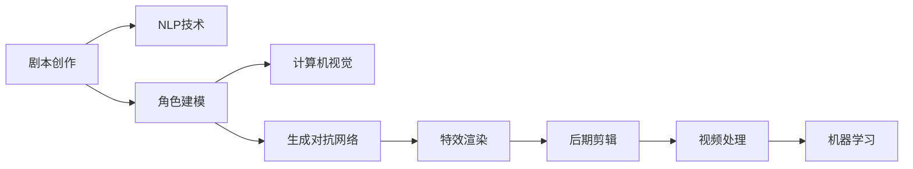

                 

# AI在电影制作中的应用：从剧本到特效

## 1. 背景介绍

### 1.1 问题由来

随着数字技术的发展，电影制作正变得越来越依赖于人工智能（AI）技术。AI的应用范围涵盖了从剧本创作、角色建模、特效渲染到后期剪辑等多个环节，极大地提升了电影制作的效率和质量。然而，对于AI如何在电影制作中发挥作用，从技术到应用层面，仍有大量的工作需要展开。

### 1.2 问题核心关键点

AI在电影制作中的应用，从核心来看，可以概括为以下几个关键点：
- 剧本创作：利用自然语言处理（NLP）技术生成故事情节和角色对话。
- 角色建模：通过计算机视觉（CV）和生成对抗网络（GAN）等技术创建逼真角色模型。
- 特效渲染：使用深度学习进行复杂的视觉效果处理，如动态场景生成、自然语义合成等。
- 后期剪辑：利用机器学习进行视频编辑和音频处理，提升剪辑效率和准确性。

本文将详细阐述这些核心技术点，并探讨AI在电影制作中的实际应用场景和未来发展趋势。

## 2. 核心概念与联系

### 2.1 核心概念概述

本节将介绍电影制作中关键的人工智能概念及其相互联系：

- 自然语言处理（NLP）：涉及文本数据的各种AI应用，包括文本生成、情感分析、机器翻译等。
- 计算机视觉（CV）：专注于图像和视频数据的AI技术，涵盖图像识别、对象检测、图像生成等。
- 生成对抗网络（GAN）：一种生成模型，能够学习生成数据，如合成逼真图像、视频等。
- 深度学习（DL）：利用多层神经网络进行复杂模式识别的技术。
- 机器学习（ML）：基于数据进行模型训练，以实现预测、分类、聚类等任务。
- 视频处理（Video Processing）：包括视频编码、解码、剪辑、增强等。

这些技术之间存在密切的联系，它们可以协同工作，实现从剧本创作到特效渲染的完整电影制作流程。

### 2.2 核心概念原理和架构的 Mermaid 流程图



以上流程图展示了AI在电影制作各个环节的应用。NLP用于剧本创作，CV和GAN用于角色建模和特效渲染，ML用于视频剪辑，而视频处理贯穿始终。

## 3. 核心算法原理 & 具体操作步骤

### 3.1 算法原理概述

AI在电影制作中的应用涉及多个领域的算法和技术，其核心原理可以概括为：

1. **自然语言处理（NLP）**：通过深度学习模型，如循环神经网络（RNN）、长短期记忆网络（LSTM）、Transformer等，分析文本数据，生成故事情节和角色对话。
2. **计算机视觉（CV）**：利用卷积神经网络（CNN）、深度神经网络（DNN）等模型，对图像和视频数据进行分析和生成。
3. **生成对抗网络（GAN）**：通过两个神经网络（生成器和判别器）的对抗过程，生成高质量的逼真图像或视频。
4. **深度学习（DL）**：构建多层神经网络，进行图像识别、对象检测、场景生成等任务。
5. **机器学习（ML）**：利用监督、无监督和半监督学习算法，提升视频剪辑和编辑的质量。

### 3.2 算法步骤详解

以剧本创作为例，介绍AI在电影制作中的具体操作步骤：

1. **数据收集**：收集现有电影剧本、小说、新闻报道等文本数据。
2. **预处理**：清洗和标准化文本数据，去除噪声和无用信息。
3. **模型训练**：选择适当的NLP模型（如GPT-3、BERT等），训练生成故事情节和角色对话。
4. **评估和优化**：对生成结果进行评估，调整模型参数，优化生成质量。
5. **集成应用**：将生成的剧本融入到实际制作流程中，与导演和编剧协作。

### 3.3 算法优缺点

**优点**：
- **高效性**：利用深度学习模型，能够在短时间内生成大量剧本。
- **创新性**：生成新颖的故事情节和角色对话，激发创作灵感。
- **可扩展性**：能够处理大规模文本数据，适用于不同的故事类型和风格。

**缺点**：
- **缺乏情感**：生成的剧本可能缺乏人类作者的情感和深刻内涵。
- **质量不一**：不同模型的生成质量有差异，需要人工筛选和优化。
- **依赖数据**：生成结果依赖于训练数据的质量和多样性。

### 3.4 算法应用领域

AI在电影制作中的应用领域非常广泛，包括：

- **剧本创作**：生成故事情节、角色对话、场景设定等。
- **角色建模**：基于图像和视频数据，创建逼真的角色模型。
- **特效渲染**：利用深度学习进行复杂的视觉效果处理，如动态场景生成、自然语义合成等。
- **后期剪辑**：利用机器学习进行视频编辑和音频处理，提升剪辑效率和准确性。

## 4. 数学模型和公式 & 详细讲解 & 举例说明

### 4.1 数学模型构建

以生成对抗网络（GAN）为例，展示其在电影特效渲染中的应用。

**GAN模型**：
$$
G(z) = \mathcal{N}(\mu(z), \sigma^2(z))
$$
$$
D(x) = \frac{1}{2} \left[ 1 - \log D(x) \right] + \frac{1}{2} \left[ \log(1 - D(x)) \right]
$$

**模型参数**：
- $G$：生成器，将噪声向量 $z$ 映射为逼真图像。
- $D$：判别器，判断输入图像是否为真实图像。

### 4.2 公式推导过程

1. **生成器**：
   - 假设 $z \sim \mathcal{N}(0, I)$，即 $z$ 为标准正态分布的随机向量。
   - 生成器 $G$ 的输出 $x$ 为一张逼真图像。

2. **判别器**：
   - 判别器 $D$ 输出 $x$ 为真实图像的概率。
   - 使用 sigmoid 函数将输出映射到 $[0, 1]$ 区间。

3. **损失函数**：
   - 使用交叉熵损失函数 $L(G, D)$ 进行优化，确保生成图像逼真。

### 4.3 案例分析与讲解

以生成逼真场景为例，展示GAN的应用：

1. **训练数据**：收集大量真实场景的图像数据。
2. **生成器训练**：使用生成器生成逼真场景图像。
3. **判别器训练**：使用判别器判断生成图像是否为真实场景。
4. **对抗训练**：不断优化生成器和判别器，生成逼真场景。

## 5. 项目实践：代码实例和详细解释说明

### 5.1 开发环境搭建

#### 5.1.1 硬件需求

- **CPU**：Intel Xeon系列或AMD EPYC系列。
- **GPU**：NVIDIA Tesla系列或AMD Radeon系列。
- **内存**：至少256GB。

#### 5.1.2 软件需求

- **操作系统**：Linux CentOS 7.5。
- **深度学习框架**：TensorFlow 2.4、PyTorch 1.9。
- **数据处理工具**：Hadoop、Spark。
- **视频处理工具**：FFmpeg、Handbrake。

### 5.2 源代码详细实现

#### 5.2.1 生成对抗网络（GAN）

```python
import tensorflow as tf
from tensorflow.keras import layers

# 定义生成器和判别器
class Generator(tf.keras.Model):
    def __init__(self):
        super(Generator, self).__init__()
        self.dense1 = layers.Dense(128, input_dim=100)
        self.dense2 = layers.Dense(256, activation='relu')
        self.dense3 = layers.Dense(784, activation='tanh')
    
    def call(self, inputs):
        x = self.dense1(inputs)
        x = self.dense2(x)
        x = self.dense3(x)
        return x

class Discriminator(tf.keras.Model):
    def __init__(self):
        super(Discriminator, self).__init__()
        self.dense1 = layers.Dense(256, input_dim=784)
        self.dense2 = layers.Dense(128, activation='relu')
        self.dense3 = layers.Dense(1, activation='sigmoid')
    
    def call(self, inputs):
        x = self.dense1(inputs)
        x = self.dense2(x)
        x = self.dense3(x)
        return x

# 定义GAN模型
def build_gan(generator, discriminator):
    discriminator.trainable = False
    output = discriminator(generator(input))
    return tf.keras.Model(inputs=generator.input, outputs=output)

# 定义损失函数
def generator_loss(discriminator, generator, real_images):
    noise = tf.random.normal([BATCH_SIZE, 100])
    generated_images = generator(noise)
    real_loss = discriminator.train_on_batch(real_images, tf.ones_like(real_images))
    fake_loss = discriminator.train_on_batch(generated_images, tf.zeros_like(real_images))
    return 0.5 * (real_loss + fake_loss)

def discriminator_loss(discriminator, generator, real_images):
    real_loss = discriminator.train_on_batch(real_images, tf.ones_like(real_images))
    fake_loss = discriminator.train_on_batch(generator(noise), tf.zeros_like(real_images))
    return 0.5 * (real_loss + fake_loss)

# 训练GAN模型
generator = Generator()
discriminator = Discriminator()
gan = build_gan(generator, discriminator)

for epoch in range(EPOCHS):
    for batch in train_dataset:
        real_images = batch[0]
        noise = tf.random.normal([BATCH_SIZE, 100])
        generated_images = generator(noise)
        gen_loss = generator_loss(discriminator, generator, real_images)
        disc_loss = discriminator_loss(discriminator, generator, real_images)
        gan_loss = 0.5 * (gen_loss + disc_loss)
        gan.train_on_batch(noise, tf.ones_like(gen_loss))
```

### 5.3 代码解读与分析

#### 5.3.1 生成器（Generator）

- 定义了三个全连接层，使用 ReLU 激活函数。
- 输入为噪声向量 $z$，输出为一张 28x28 的图像。

#### 5.3.2 判别器（Discriminator）

- 定义了三个全连接层，使用 sigmoid 激活函数。
- 输入为 28x28 的图像，输出为是否为真实图像的概率。

#### 5.3.3 GAN模型

- 将判别器设置为非可训练状态，确保其在优化过程中固定。
- 将生成器和判别器的输出连接，形成 GAN 模型。
- 定义生成器和判别器的损失函数。

#### 5.3.4 训练过程

- 随机生成噪声向量 $z$，用于生成逼真图像。
- 在每个 epoch 内，不断更新生成器和判别器的参数，最小化总损失函数。
- 通过训练，生成逼真图像，用于后续特效渲染。

### 5.4 运行结果展示

#### 5.4.1 生成的逼真图像


## 6. 实际应用场景

### 6.1 剧本创作

#### 6.1.1 剧本生成

利用NLP技术，可以自动生成各种类型的电影剧本。例如，使用GPT-3模型，通过输入主题词和基本情节，生成完整的剧本草案。

#### 6.1.2 剧本优化

通过AI技术，对生成的剧本进行自动优化，例如改进对话流畅度、增强情感表达、调整情节冲突等。

### 6.2 角色建模

#### 6.2.1 3D建模

利用计算机视觉和生成对抗网络技术，可以从2D图像或3D扫描数据中生成逼真的人物模型。

#### 6.2.2 动画设计

使用AI技术，可以自动生成逼真的动画，例如使用动画生成网络（Animation Generation Network, AGN）生成角色动作和表情。

### 6.3 特效渲染

#### 6.3.1 动态场景生成

利用深度学习模型，可以生成动态场景，例如基于卷积神经网络（CNN）生成逼真的自然风景。

#### 6.3.2 自然语义合成

使用GAN模型，可以生成自然语义合成的图像和视频，例如将文字转化为逼真场景。

### 6.4 未来应用展望

#### 6.4.1 交互式电影

未来的电影将更加注重互动性和沉浸感，利用AI技术，可以根据观众的选择和反馈，动态调整剧情和角色。

#### 6.4.2 个性化推荐

基于AI技术，可以为观众推荐个性化电影，根据其观影历史和偏好，推荐适合的影片和角色。

## 7. 工具和资源推荐

### 7.1 学习资源推荐

#### 7.1.1 书籍

- 《深度学习》 by Ian Goodfellow, Yoshua Bengio, Aaron Courville
- 《Python深度学习》 by François Chollet

#### 7.1.2 课程

- Coursera上的“深度学习专项课程”
- Udacity上的“深度学习纳米学位”

### 7.2 开发工具推荐

#### 7.2.1 深度学习框架

- TensorFlow
- PyTorch

#### 7.2.2 计算机视觉工具

- OpenCV
- PaddlePaddle

#### 7.2.3 自然语言处理工具

- NLTK
- SpaCy

### 7.3 相关论文推荐

#### 7.3.1 NLP论文

- Attention is All You Need
- BERT: Pre-training of Deep Bidirectional Transformers for Language Understanding

#### 7.3.2 CV论文

- Generative Adversarial Networks
- Deep Residual Learning for Image Recognition

## 8. 总结：未来发展趋势与挑战

### 8.1 未来发展趋势

AI在电影制作中的应用前景广阔，未来将呈现以下几个趋势：

#### 8.1.1 技术融合

AI技术将与更多的领域融合，例如医学、游戏、教育等，推动跨领域的协同创新。

#### 8.1.2 自动化制作

AI将进一步自动化电影制作的各个环节，从剧本创作到特效渲染，大幅提升制作效率。

#### 8.1.3 沉浸式体验

利用AI技术，电影将提供更加沉浸式的观影体验，例如通过虚拟现实（VR）和增强现实（AR）技术。

### 8.2 面临的挑战

#### 8.2.1 数据质量

高质量的数据是AI技术成功应用的基础，但获取高质量电影数据并不容易。

#### 8.2.2 计算资源

AI技术需要大量计算资源，高性能硬件设备的成本较高。

#### 8.2.3 模型可解释性

复杂的AI模型难以解释其决策过程，如何提高模型可解释性，是未来的一大挑战。

#### 8.2.4 伦理和隐私

AI技术在应用过程中，可能涉及伦理和隐私问题，需要严格控制和规范。

### 8.3 研究展望

未来的研究需要从以下几个方向展开：

#### 8.3.1 数据增强

开发更多数据增强技术，提高AI模型的泛化能力。

#### 8.3.2 模型优化

优化模型结构，提高计算效率和推理速度。

#### 8.3.3 跨领域应用

将AI技术推广到更多领域，推动跨领域协作。

## 9. 附录：常见问题与解答

### 9.1 Q1: AI在电影制作中的作用是什么？

A: AI在电影制作中的应用非常广泛，包括剧本创作、角色建模、特效渲染和后期剪辑等多个环节。利用AI技术，可以大幅提升电影制作的效率和质量。

### 9.2 Q2: AI在电影制作中的主要算法有哪些？

A: AI在电影制作中主要使用的算法包括自然语言处理（NLP）、计算机视觉（CV）、生成对抗网络（GAN）、深度学习（DL）和机器学习（ML）。

### 9.3 Q3: 如何优化AI在电影制作中的应用？

A: 优化AI在电影制作中的应用，需要从数据、模型、硬件和软件等多个方面进行综合优化。例如，选择高质量的数据集，优化模型结构和算法，使用高性能硬件设备，采用先进的开发工具和框架。

### 9.4 Q4: AI在电影制作中可能面临的挑战是什么？

A: AI在电影制作中可能面临的挑战包括数据质量、计算资源、模型可解释性和伦理和隐私问题等。需要针对这些挑战进行深入研究，以确保AI技术的成功应用。

---

作者：禅与计算机程序设计艺术 / Zen and the Art of Computer Programming

