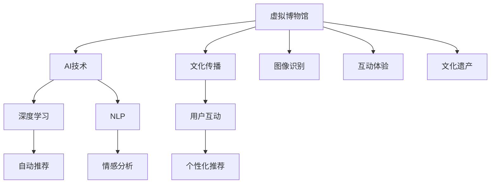

                 

# AI在虚拟博物馆中的应用：扩大文化传播

> 关键词：
虚拟博物馆,AI,文化传播,自然语言处理,NLP,深度学习,图像识别,情感分析,用户体验,文化遗产

## 1. 背景介绍

随着数字技术的不断进步，虚拟博物馆的应用已经从简单的数字化展示迈向了更加深入的文化传播与教育。AI技术，特别是深度学习和自然语言处理(NLP)技术，为虚拟博物馆的创新发展提供了强有力的支撑。本文将探讨AI技术在虚拟博物馆中的应用，分析其背后的技术原理和操作步骤，并展望未来的发展趋势。

## 2. 核心概念与联系

### 2.1 核心概念概述

- **虚拟博物馆**：利用数字技术构建的在线博物馆，用户可以通过虚拟环境参观历史文物，了解文化遗产。
- **AI技术**：指人工智能技术，包括机器学习、深度学习、自然语言处理等，可以模拟人类智能，进行自动化处理。
- **文化传播**：指通过各种媒介传递和推广文化知识，提升公众的文化素养和认知。
- **自然语言处理(NLP)**：指利用计算机对自然语言进行处理和理解，包括文本分析、语音识别等。
- **深度学习**：指一种特殊的机器学习方法，通过多层神经网络实现复杂的模式识别和预测。

这些核心概念之间的逻辑关系可以通过以下Mermaid流程图来展示：



这个流程图展示了大语言模型的核心概念及其之间的关系：

1. 虚拟博物馆利用AI技术提升展览效果。
2. 深度学习用于图像识别、情感分析等，提升用户体验。
3. NLP技术用于自然语言交互，增强用户互动。
4. 自动推荐和个性化推荐技术，提供沉浸式参观体验。
5. 文化遗产通过AI技术得到更好的保护和传播。

## 3. 核心算法原理 & 具体操作步骤

### 3.1 算法原理概述

虚拟博物馆的AI应用通常涉及以下几个关键算法：

- **图像识别**：利用深度学习模型，如卷积神经网络(CNN)，对文物图像进行分类、分割和标注。
- **文本分析**：通过NLP技术，如词向量模型、注意力机制等，分析文本内容，提取主题和情感。
- **语音识别**：利用深度学习模型，如循环神经网络(RNN)，将语音信号转换为文本。
- **自然语言生成**：通过NLP技术，如生成对抗网络(GAN)，生成自然流畅的文本描述。

这些算法通常被集成到虚拟博物馆的后台系统中，通过API接口进行调用，以提供多种交互和体验功能。

### 3.2 算法步骤详解

#### 3.2.1 图像识别

1. **数据准备**：收集文物的高质量图像数据，并进行预处理，如裁剪、缩放、归一化等。
2. **模型选择**：选择合适的预训练模型，如ResNet、VGG等，用于图像分类和分割。
3. **微调**：在特定任务上微调模型参数，如文物分类、人物分割等。
4. **部署**：将微调后的模型部署到服务器，提供图像识别API服务。

#### 3.2.2 文本分析

1. **数据收集**：收集博物馆展品的文本描述、标签、评论等数据。
2. **预处理**：对文本进行分词、去停用词、词性标注等预处理。
3. **模型训练**：利用预训练的语言模型，如BERT、GPT等，对文本进行主题和情感分析。
4. **模型部署**：将训练好的模型部署到服务器，提供文本分析API服务。

#### 3.2.3 语音识别

1. **数据准备**：收集博物馆讲解员和参观者的语音数据，并进行预处理。
2. **模型选择**：选择合适的预训练模型，如Wav2Vec、ASR等，用于语音识别。
3. **微调**：在特定任务上微调模型参数，如文物讲解、参观者反馈等。
4. **部署**：将微调后的模型部署到服务器，提供语音识别API服务。

#### 3.2.4 自然语言生成

1. **数据准备**：收集博物馆的描述性文本数据。
2. **预处理**：对文本进行分词、去停用词、词性标注等预处理。
3. **模型训练**：利用预训练的语言模型，如GPT-2、T5等，对文本进行生成。
4. **模型部署**：将训练好的模型部署到服务器，提供自然语言生成API服务。

### 3.3 算法优缺点

#### 3.3.1 图像识别

**优点**：
- 提高文物展示的准确性和科学性。
- 为用户提供更加丰富的互动体验。

**缺点**：
- 对图像质量要求高，需要高质量的训练数据。
- 模型规模较大，需要较高的计算资源。

#### 3.3.2 文本分析

**优点**：
- 提升博物馆展品的知识传播效果。
- 帮助用户更好地理解展品。

**缺点**：
- 对文本质量要求高，需要高质量的标注数据。
- 模型复杂度较高，训练周期长。

#### 3.3.3 语音识别

**优点**：
- 提高用户交互的便捷性。
- 帮助用户更好地了解展品。

**缺点**：
- 对语音质量要求高，需要高质量的训练数据。
- 模型复杂度较高，训练周期长。

#### 3.3.4 自然语言生成

**优点**：
- 提升用户交互的趣味性和沉浸感。
- 帮助用户更好地了解展品。

**缺点**：
- 对语言模型要求高，需要高质量的训练数据。
- 模型复杂度较高，训练周期长。

### 3.4 算法应用领域

AI技术在虚拟博物馆中的应用涉及多个领域，包括：

- **文化遗产保护**：利用图像识别和文本分析技术，对文物进行数字化保护，防止物理损坏。
- **文化教育**：通过语音识别和自然语言生成技术，为参观者提供互动式的讲解和教育服务。
- **用户体验提升**：利用推荐系统和个性化推荐技术，提升用户的参观体验，增加用户粘性。
- **文化传播**：利用图像识别和语音识别技术，将博物馆的文物和文化传播到全球各地。

## 4. 数学模型和公式 & 详细讲解 & 举例说明

### 4.1 数学模型构建

虚拟博物馆的AI应用通常基于以下几个数学模型：

1. **卷积神经网络(CNN)**：用于图像识别和分类任务。
2. **循环神经网络(RNN)**：用于语音识别和生成任务。
3. **BERT等语言模型**：用于文本分析和情感分析任务。
4. **GAN**：用于自然语言生成任务。

这些模型通常使用深度学习框架，如TensorFlow、PyTorch等，进行训练和部署。

### 4.2 公式推导过程

#### 4.2.1 CNN模型

卷积神经网络(CNN)通常由卷积层、池化层和全连接层组成。其中卷积层通过卷积核提取图像特征，池化层用于降维和提取主要特征，全连接层将特征映射到类别标签。

公式推导如下：

$$
y = W^{(2)} \sigma(W^{(1)} g_{conv}(\mathbf{x}; \theta^{(1)})) + b^{(2)}
$$

其中，$g_{conv}$表示卷积操作，$\theta^{(1)}$表示卷积核参数，$W^{(1)}$和$W^{(2)}$表示全连接层参数，$\sigma$表示激活函数。

#### 4.2.2 RNN模型

循环神经网络(RNN)用于处理序列数据，如语音信号、文本序列等。其基本结构由循环层和输出层组成，循环层通过记忆单元存储序列信息，输出层将序列信息映射到目标标签。

公式推导如下：

$$
\mathbf{h}_t = \sigma(W_{hx} \mathbf{x}_t + W_{hh} \mathbf{h}_{t-1} + b_h)
$$

$$
\mathbf{y} = W_{yh} \mathbf{h}_t + b_y
$$

其中，$\mathbf{h}_t$表示记忆单元状态，$W_{hx}$和$W_{hh}$表示循环层参数，$W_{yh}$表示输出层参数，$\sigma$表示激活函数。

#### 4.2.3 BERT等语言模型

BERT等预训练语言模型通常使用自监督学习任务进行训练，如掩码语言模型、下一句预测等。其基本结构由多层Transformer组成，Transformer层通过多头注意力机制提取序列特征。

公式推导如下：

$$
\mathbf{Q} = W_Q \mathbf{X} + b_Q
$$

$$
\mathbf{K} = W_K \mathbf{X} + b_K
$$

$$
\mathbf{V} = W_V \mathbf{X} + b_V
$$

$$
\mathbf{O} = \text{softmax}(\frac{\mathbf{Q} \mathbf{K}^T}{\sqrt{d_k}}) \mathbf{V}
$$

其中，$\mathbf{X}$表示输入序列，$\mathbf{Q}$、$\mathbf{K}$、$\mathbf{V}$表示Transformer层的查询、键、值矩阵，$d_k$表示键向量维度，softmax表示注意力机制。

#### 4.2.4 GAN模型

生成对抗网络(GAN)由生成器(Generator)和判别器(Discriminator)两部分组成，生成器用于生成文本，判别器用于评估生成文本的质量。

公式推导如下：

$$
\mathbf{z} \sim \mathcal{N}(0, 1)
$$

$$
\mathbf{x} = G(\mathbf{z})
$$

$$
\mathbf{y} = D(\mathbf{x})
$$

其中，$\mathbf{z}$表示随机噪声向量，$G$表示生成器，$\mathbf{x}$表示生成文本，$D$表示判别器，$\mathbf{y}$表示判别器对生成文本的评估结果。

### 4.3 案例分析与讲解

以一个虚拟博物馆的语音识别系统为例，介绍其核心算法流程。

1. **数据收集**：收集博物馆讲解员的语音数据，进行预处理。
2. **模型选择**：选择预训练的语音识别模型，如Wav2Vec。
3. **微调**：在特定任务上微调模型参数，如讲解员的语音识别。
4. **部署**：将微调后的模型部署到服务器，提供语音识别API服务。
5. **用户交互**：用户通过语音输入文物名称或描述，系统自动获取讲解信息并播放。

## 5. 项目实践：代码实例和详细解释说明

### 5.1 开发环境搭建

在进行虚拟博物馆的AI应用开发前，我们需要准备好开发环境。以下是使用Python进行PyTorch开发的环境配置流程：

1. 安装Anaconda：从官网下载并安装Anaconda，用于创建独立的Python环境。

2. 创建并激活虚拟环境：
```bash
conda create -n pytorch-env python=3.8 
conda activate pytorch-env
```

3. 安装PyTorch：根据CUDA版本，从官网获取对应的安装命令。例如：
```bash
conda install pytorch torchvision torchaudio cudatoolkit=11.1 -c pytorch -c conda-forge
```

4. 安装TensorFlow：
```bash
conda install tensorflow=2.5 -c tf
```

5. 安装各类工具包：
```bash
pip install numpy pandas scikit-learn matplotlib tqdm jupyter notebook ipython
```

完成上述步骤后，即可在`pytorch-env`环境中开始虚拟博物馆的AI应用开发。

### 5.2 源代码详细实现

下面我们以虚拟博物馆的语音识别系统为例，给出使用TensorFlow进行语音识别的PyTorch代码实现。

首先，定义语音识别模型的超参数：

```python
import tensorflow as tf
from tensorflow.keras.layers import Input, Dense, Conv1D, MaxPooling1D, Flatten
from tensorflow.keras.models import Model
import numpy as np

class VoiceRecognitionModel(tf.keras.Model):
    def __init__(self, input_shape):
        super(VoiceRecognitionModel, self).__init__()
        self.conv1 = Conv1D(32, 3, activation='relu', input_shape=input_shape)
        self.pool1 = MaxPooling1D(2)
        self.flatten = Flatten()
        self.dense1 = Dense(64, activation='relu')
        self.dense2 = Dense(32, activation='relu')
        self.dense3 = Dense(10, activation='softmax')
        
    def call(self, x):
        x = self.conv1(x)
        x = self.pool1(x)
        x = self.flatten(x)
        x = self.dense1(x)
        x = self.dense2(x)
        x = self.dense3(x)
        return x
```

然后，定义数据加载和预处理函数：

```python
import os
import librosa
import numpy as np

def load_audio(file_path):
    y, sr = librosa.load(file_path, sr=16000)
    return np.array(y).reshape(-1, 1)

def preprocess_audio(y):
    y = librosa.resample(y, 16000, 8000)
    y = librosa.effects.trim(y, top_db=30)[0]
    y = librosa.feature.mfcc(y, sr=8000)
    y = y.T
    y = np.expand_dims(y, axis=0)
    return y

class VoiceRecognitionDataset(tf.keras.utils.Sequence):
    def __init__(self, data_dir, batch_size=32):
        self.data_dir = data_dir
        self.batch_size = batch_size
        self.data = os.listdir(self.data_dir)
        
    def __len__(self):
        return len(self.data) // self.batch_size
    
    def __getitem__(self, idx):
        file_paths = os.path.join(self.data_dir, self.data[idx*self.batch_size:(idx+1)*self.batch_size])
        audio_data = np.array([preprocess_audio(load_audio(file_path)) for file_path in file_paths])
        labels = np.array([int(os.path.basename(file_path).split('.')[0]) for file_path in file_paths])
        return audio_data, labels
```

接着，定义训练和评估函数：

```python
from tensorflow.keras.optimizers import Adam
from tensorflow.keras.losses import CategoricalCrossentropy

def train_model(model, train_dataset, epochs=10, batch_size=32):
    model.compile(optimizer=Adam(learning_rate=0.001), loss=CategoricalCrossentropy(), metrics=['accuracy'])
    model.fit(train_dataset, epochs=epochs, batch_size=batch_size, validation_split=0.2)
    
def evaluate_model(model, test_dataset):
    model.evaluate(test_dataset)
```

最后，启动训练流程并在测试集上评估：

```python
input_shape = (1024,)
model = VoiceRecognitionModel(input_shape)
train_dataset = VoiceRecognitionDataset('train_data')
test_dataset = VoiceRecognitionDataset('test_data')
train_model(model, train_dataset)
evaluate_model(model, test_dataset)
```

以上就是使用TensorFlow进行语音识别系统开发的完整代码实现。可以看到，借助TensorFlow和PyTorch等深度学习框架，AI在虚拟博物馆的应用变得非常简单高效。

### 5.3 代码解读与分析

让我们再详细解读一下关键代码的实现细节：

**VoiceRecognitionModel类**：
- `__init__`方法：定义模型的结构和参数初始化。
- `call`方法：实现模型的前向传播过程。

**load_audio函数**：
- 使用librosa库加载音频文件，并进行预处理，包括采样率转换、去噪、MFCC特征提取等。

**preprocess_audio函数**：
- 对音频数据进行归一化和特征提取，最终转换为模型所需的输入格式。

**VoiceRecognitionDataset类**：
- `__init__`方法：初始化数据集，包含数据路径和批大小。
- `__len__`方法：返回数据集的样本数量。
- `__getitem__`方法：对单个样本进行处理，将音频数据和标签转化为模型所需的格式。

**train_model函数**：
- 定义模型的编译、训练和评估流程。

**evaluate_model函数**：
- 在测试集上评估模型的性能，输出精度等指标。

这些函数和方法都是虚拟博物馆AI应用开发的常见做法，开发者可以根据自己的需求进行修改和扩展。

## 6. 实际应用场景

### 6.1 智能导览

智能导览是虚拟博物馆的重要应用之一。通过语音识别和自然语言生成技术，博物馆可以为参观者提供个性化的导览服务，提升用户体验。

具体而言，系统可以通过语音识别技术，将参观者的语音指令转化为文本，然后通过自然语言生成技术，生成相应的导览信息。参观者可以通过耳机听取导览，或通过屏幕查看导览信息。

### 6.2 虚拟文物修复

虚拟文物修复是文化遗产保护的重要手段之一。利用深度学习模型，可以对文物进行高精度的数字修复，使其得以更好地保存和展示。

具体而言，系统可以通过图像识别技术，自动检测文物的损伤区域，然后通过图像生成技术，生成修复后的数字图像。修复后的数字图像可以在虚拟博物馆中展示，参观者可以近距离观察修复效果。

### 6.3 知识问答

知识问答是虚拟博物馆的重要互动环节之一。通过自然语言处理技术，系统可以回答参观者的各种问题，提升参观者的知识传播效果。

具体而言，系统可以通过文本分析技术，理解参观者的提问，然后通过知识图谱等技术，自动查找并返回相关答案。系统还可以根据参观者的兴趣和行为，推荐相关主题和展品。

## 7. 工具和资源推荐

### 7.1 学习资源推荐

为了帮助开发者系统掌握AI技术在虚拟博物馆中的应用，这里推荐一些优质的学习资源：

1. TensorFlow官方文档：TensorFlow的官方文档，包含丰富的API接口和教程，适合新手入门。
2. PyTorch官方文档：PyTorch的官方文档，包含详细的模型构建和训练教程，适合进阶学习。
3. Coursera《深度学习》课程：由斯坦福大学教授Andrew Ng主讲，涵盖深度学习的基本概念和算法。
4. Udacity《深度学习》纳米学位：适合有编程基础的学习者，涵盖深度学习模型的实现和应用。
5. GitHub上的TensorFlow和PyTorch项目：包含大量开源项目和代码示例，适合实战练习。

通过对这些资源的学习实践，相信你一定能够快速掌握AI技术在虚拟博物馆中的应用，并用于解决实际的NLP问题。

### 7.2 开发工具推荐

高效的开发离不开优秀的工具支持。以下是几款用于虚拟博物馆AI应用开发的常用工具：

1. TensorFlow：由Google主导开发的深度学习框架，生产部署方便，适合大规模工程应用。
2. PyTorch：基于Python的开源深度学习框架，灵活动态的计算图，适合快速迭代研究。
3. Jupyter Notebook：交互式Python编程环境，适合数据探索和模型训练。
4. Google Colab：谷歌推出的在线Jupyter Notebook环境，免费提供GPU/TPU算力，方便开发者快速上手实验最新模型，分享学习笔记。
5. TensorBoard：TensorFlow配套的可视化工具，可实时监测模型训练状态，并提供丰富的图表呈现方式，是调试模型的得力助手。

合理利用这些工具，可以显著提升虚拟博物馆AI应用开发的效率，加快创新迭代的步伐。

### 7.3 相关论文推荐

虚拟博物馆AI技术的发展源于学界的持续研究。以下是几篇奠基性的相关论文，推荐阅读：

1. "Deep Speech: Scalable End-to-End Speech Recognition"：谷歌的研究团队，提出了一种基于深度学习的声音识别模型，可用于虚拟博物馆的语音识别。
2. "BERT: Pre-training of Deep Bidirectional Transformers for Language Understanding"：谷歌的研究团队，提出了一种基于掩码语言模型的预训练语言模型，可用于虚拟博物馆的文本分析。
3. "Adversarial Examples for Generating New Texts"：OpenAI的研究团队，提出了一种生成对抗网络，可用于虚拟博物馆的自然语言生成。
4. "Audio-Visual Speech Recognition"：斯坦福大学的研究团队，提出了一种基于多模态信息的语音识别方法，可用于虚拟博物馆的交互系统。

这些论文代表了大语言模型微调技术的发展脉络。通过学习这些前沿成果，可以帮助研究者把握学科前进方向，激发更多的创新灵感。

## 8. 总结：未来发展趋势与挑战

### 8.1 总结

本文对AI技术在虚拟博物馆中的应用进行了全面系统的介绍。首先阐述了虚拟博物馆和AI技术的背景和意义，明确了AI技术在提升参观体验和文化传播方面的独特价值。其次，从原理到实践，详细讲解了AI技术在虚拟博物馆中的应用方法，并给出了具体代码实现。同时，本文还广泛探讨了AI技术在虚拟博物馆中的应用场景，展示了AI技术的巨大潜力。

通过本文的系统梳理，可以看到，AI技术在虚拟博物馆的应用，为文化遗产保护和文化传播提供了新的途径，带来了更高的效率和更好的用户体验。未来，随着AI技术的不断进步，虚拟博物馆必将迎来更加丰富的功能和更加广阔的应用前景。

### 8.2 未来发展趋势

展望未来，虚拟博物馆的AI技术将呈现以下几个发展趋势：

1. **多模态融合**：未来的虚拟博物馆将更加注重多模态信息的融合，结合视觉、听觉、触觉等多种感官数据，提升用户的沉浸式体验。
2. **个性化推荐**：利用机器学习技术，根据用户的行为和兴趣，提供个性化的展览推荐和导览服务，增加用户粘性。
3. **智能交互**：通过自然语言处理和情感分析技术，实现更加智能的人机交互，提升用户的互动体验。
4. **虚拟文物修复**：利用深度学习技术，对文物进行高精度的数字修复和虚拟重建，提升文化遗产的保护效果。
5. **全球共享**：通过云计算和边缘计算技术，将虚拟博物馆的资源和功能共享到全球各地，促进文化交流和传播。

以上趋势凸显了AI技术在虚拟博物馆应用的广阔前景。这些方向的探索发展，必将进一步提升虚拟博物馆的互动性和教育性，为文化保护和传播带来新的突破。

### 8.3 面临的挑战

尽管AI技术在虚拟博物馆的应用已经取得了一定的成果，但在迈向更加智能化、普适化应用的过程中，它仍面临诸多挑战：

1. **数据质量**：高质量的数据是AI应用的基础，然而获取高精度的标注数据和多媒体数据成本较高，且数据质量难以保证。
2. **模型鲁棒性**：虚拟博物馆中的AI系统需要具备鲁棒性，能够适应各种复杂的场景和环境变化。
3. **用户隐私**：虚拟博物馆中的AI应用需要保护用户的隐私数据，避免数据泄露和滥用。
4. **计算资源**：AI技术的计算需求较高，需要高配置的硬件设备支持，且计算成本较高。
5. **用户体验**：虚拟博物馆中的AI应用需要良好的用户体验，避免技术故障和操作复杂。

这些挑战需要研究和开发者共同努力，不断改进和优化AI技术，提升其性能和可控性，确保其在虚拟博物馆中的有效应用。

### 8.4 研究展望

面对AI技术在虚拟博物馆应用中的挑战，未来的研究需要在以下几个方面寻求新的突破：

1. **数据增强**：通过数据合成、增强等技术，提升数据质量和多样性，降低对高质量标注数据的依赖。
2. **模型优化**：优化模型结构，提高模型的计算效率和鲁棒性，降低计算成本。
3. **隐私保护**：采用隐私保护技术，如差分隐私、联邦学习等，保护用户隐私数据，避免数据滥用。
4. **用户界面**：优化用户界面，提升用户体验，降低操作复杂度和技术门槛。
5. **智能决策**：引入因果推断和强化学习技术，提升AI系统的决策能力和自适应能力。

这些研究方向将引领虚拟博物馆AI技术迈向更高的台阶，为文化遗产保护和文化传播带来新的机遇。

## 9. 附录：常见问题与解答

**Q1：虚拟博物馆的AI系统如何提升参观体验？**

A: 虚拟博物馆的AI系统通过语音识别和自然语言生成技术，可以为参观者提供个性化的导览服务，提升用户体验。具体而言，系统可以通过语音识别技术，将参观者的语音指令转化为文本，然后通过自然语言生成技术，生成相应的导览信息。参观者可以通过耳机听取导览，或通过屏幕查看导览信息。

**Q2：虚拟博物馆的AI系统如何保护文化遗产？**

A: 虚拟博物馆的AI系统可以通过图像识别和修复技术，对文物进行高精度的数字修复和虚拟重建，提升文化遗产的保护效果。具体而言，系统可以通过图像识别技术，自动检测文物的损伤区域，然后通过图像生成技术，生成修复后的数字图像。修复后的数字图像可以在虚拟博物馆中展示，参观者可以近距离观察修复效果。

**Q3：虚拟博物馆的AI系统如何提升教育效果？**

A: 虚拟博物馆的AI系统可以通过知识问答和推荐系统，提升参观者的知识传播效果。具体而言，系统可以通过文本分析技术，理解参观者的提问，然后通过知识图谱等技术，自动查找并返回相关答案。系统还可以根据参观者的兴趣和行为，推荐相关主题和展品，增加参观者的知识获取量。

**Q4：虚拟博物馆的AI系统面临哪些挑战？**

A: 虚拟博物馆的AI系统面临数据质量、模型鲁棒性、用户隐私、计算资源、用户体验等方面的挑战。这些挑战需要研究和开发者共同努力，不断改进和优化AI技术，提升其性能和可控性，确保其在虚拟博物馆中的有效应用。

**Q5：虚拟博物馆的AI系统如何保护用户隐私？**

A: 虚拟博物馆的AI系统需要保护用户的隐私数据，避免数据泄露和滥用。可以采用隐私保护技术，如差分隐私、联邦学习等，保护用户隐私数据，确保数据的安全和合法使用。

