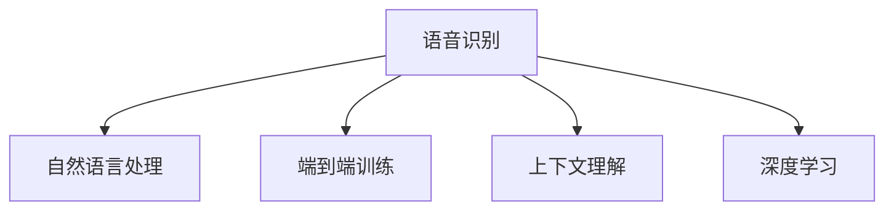

                 

# AI在语音识别中的进展：实现自然对话

> 关键词：语音识别, 自然对话, 深度学习, 卷积神经网络, 循环神经网络, 端到端训练, 语音数据预处理, 特征提取, 声学模型, 语言模型, 深度学习优化算法, 语音识别评估指标, 实际应用案例

## 1. 背景介绍

### 1.1 问题由来

随着人工智能技术的快速发展，语音识别技术已经成为语音处理领域的一大热点。语音识别技术通过将语音信号转换成文本，极大地改变了人们的生活和生产方式。从智能家居的语音助手，到实时字幕的在线会议，再到自动驾驶的车载交互系统，语音识别已经深入到我们的日常生活各个方面。

然而，当前的语音识别系统尽管精度已经达到了非常高的水平，但其自然性仍有待提高。特别是在面对环境噪声、口音差异、讲话速度变化等问题时，系统的鲁棒性和准确性往往难以满足用户需求。如何实现自然、流畅的语音对话，成为语音识别技术进一步突破的关键。

### 1.2 问题核心关键点

当前，自然对话的实现主要面临以下几个关键问题：

- **语音信号的端到端处理**：如何从原始语音信号直接生成文本，而无需中间的文字转录环节。
- **跨语种和口音的鲁棒性**：如何在不同语言、不同口音条件下，保持系统的高性能。
- **上下文理解与维护**：如何在对话中正确理解上下文信息，并根据上下文生成合理的响应。
- **实时性和稳定性**：如何提高系统实时性，并保证在长时间运行过程中的稳定性。

解决这些问题需要多方面的技术突破，包括改进语音信号的特征提取和建模，引入上下文信息，以及采用更高效的深度学习算法等。

## 2. 核心概念与联系

### 2.1 核心概念概述

为更好地理解自然对话的实现原理，本节将介绍几个密切相关的核心概念：

- **语音识别(Speech Recognition)**：将语音信号转换成文本的过程。常见的方法包括隐马尔可夫模型(HMM)、卷积神经网络(CNN)、循环神经网络(RNN)等。
- **自然语言处理(Natural Language Processing, NLP)**：处理自然语言文本的任务，包括语言模型、机器翻译、语义理解等。自然对话的实现需要结合语音识别和NLP技术。
- **端到端(End-to-End)训练**：直接从原始语音信号学习到输出文本，不需要中间的文字转录步骤。常见的方法包括使用深度学习模型进行端到端训练。
- **上下文理解(Context Understanding)**：在对话过程中，根据前文上下文信息，生成合理的后文响应。
- **深度学习(Deep Learning)**：一种基于多层神经网络的人工智能方法，广泛应用于语音识别、图像识别、自然语言处理等领域。

这些核心概念之间的逻辑关系可以通过以下Mermaid流程图来展示：



这个流程图展示了语音识别与自然语言处理、端到端训练、上下文理解、深度学习之间的紧密联系。语音识别技术的进步，直接推动了自然对话的实现。

## 3. 核心算法原理 & 具体操作步骤
### 3.1 算法原理概述

自然对话的实现主要涉及两个关键步骤：语音信号的端到端处理和上下文理解与维护。

**端到端处理**：通过深度学习模型直接从原始语音信号学习到文本输出，避免了中间的文字转录环节。常见的方法包括卷积神经网络(CNN)、循环神经网络(RNN)、Transformer等。

**上下文理解**：在对话过程中，需要结合前文上下文信息，生成合理的后文响应。这需要引入上下文信息，采用循环神经网络(RNN)或Transformer等模型进行处理。

### 3.2 算法步骤详解

以下是自然对话实现的主要步骤：

1. **语音数据预处理**：对原始语音信号进行降噪、分帧、特征提取等预处理操作，以便后续模型训练。
2. **特征提取**：使用Mel频率倒谱系数(MFCC)等特征提取方法，将语音信号转换为特征向量。
3. **模型训练**：使用深度学习模型进行端到端训练，训练数据集包含大量语音和文本标注。
4. **上下文处理**：结合上下文信息，进行后文响应的生成。
5. **模型优化**：使用深度学习优化算法，调整模型参数，提高模型性能。
6. **评估与测试**：在测试集上评估模型性能，进行必要的调整和优化。

### 3.3 算法优缺点

自然对话的实现方法具有以下优点：

- **端到端处理**：直接从语音信号学习到文本输出，减少了中间的文字转录环节，提高了系统的效率。
- **上下文理解**：在对话过程中，能够根据上下文信息生成合理的后文响应，提升了系统的自然性。
- **模型的灵活性**：可以采用多种深度学习模型，如CNN、RNN、Transformer等，适应不同任务需求。

同时，该方法也存在以下局限性：

- **计算资源需求高**：深度学习模型通常需要大量计算资源进行训练和优化。
- **噪声鲁棒性不足**：在面对复杂噪声环境时，模型的鲁棒性可能下降。
- **数据需求量大**：需要大量的标注数据进行模型训练，数据获取和标注成本较高。
- **模型复杂度**：深度学习模型通常较为复杂，难以理解和调试。

### 3.4 算法应用领域

自然对话的实现技术已经在多个领域得到了广泛应用，例如：

- **智能客服**：通过自然对话，实现自动客户服务，提高客户满意度。
- **在线翻译**：结合语音识别和自然语言处理，实现实时语音翻译功能。
- **自动驾驶**：通过语音交互，提升驾驶体验，增强系统安全性。
- **会议记录**：自动记录会议内容，生成实时字幕，方便回放和整理。
- **娱乐互动**：在智能电视、智能音箱等设备上，实现自然语音交互，提供更好的用户体验。

## 4. 数学模型和公式 & 详细讲解 & 举例说明

### 4.1 数学模型构建

自然对话的实现过程中，主要涉及到以下数学模型：

- **卷积神经网络(CNN)**：用于提取语音信号的局部特征。
- **循环神经网络(RNN)**：用于处理序列数据，捕捉语音信号的时序信息。
- **Transformer模型**：用于处理序列数据，同时具备良好的上下文理解能力。

以Transformer模型为例，假设输入语音信号的特征向量为 $\mathbf{x}=[x_1,x_2,...,x_T]$，其中 $x_t$ 表示第 $t$ 帧的特征向量。模型的结构如图 1 所示：

```mermaid
graph LR
    subgraph 编码器(Encoder)
    X1["x_1"] --> Y1["h_1"]
    X2["x_2"] --> Y2["h_2"]
    ...
    XT["x_T"] --> YT["h_T"]
    end
    subgraph 解码器(Decoder)
    H1["h_1"] --> Z1["z_1"]
    H2["h_2"] --> Z2["z_2"]
    ...
    HT["h_T"] --> ZT["z_T"]
    end
    Z1 --> Z2
    Z2 --> ZT
    Z1 --> ZT
```

图 1: Transformer模型结构图

其中，$h_t$ 表示第 $t$ 帧的隐藏状态，$z_t$ 表示第 $t$ 帧的输出。

### 4.2 公式推导过程

假设模型的损失函数为 $L=\sum_{t=1}^T \ell(h_t, \hat{h}_t)$，其中 $\ell$ 为损失函数，$h_t$ 和 $\hat{h}_t$ 分别为模型和目标输出。以交叉熵损失函数为例，其公式如下：

$$
\ell(h_t, \hat{h}_t) = -\sum_{c=1}^C h_{t,c} \log \hat{h}_{t,c}
$$

其中 $C$ 表示分类数目，$h_{t,c}$ 和 $\hat{h}_{t,c}$ 分别为 $h_t$ 和 $\hat{h}_t$ 在类别 $c$ 上的概率值。

### 4.3 案例分析与讲解

以Google的语音识别系统WaveNet为例，WaveNet使用卷积神经网络对语音信号进行处理，其主要结构如图 2 所示：

```mermaid
graph LR
    A1["x"] --> B1["h_1"]
    A2["x"] --> B2["h_2"]
    ...
    AT["x"] --> BT["h_T"]
    end
    C1["h_1"] --> D1["z_1"]
    C2["h_2"] --> D2["z_2"]
    ...
    CT["h_T"] --> DT["z_T"]
    end
    D1 --> D2
    D2 --> DT
    D1 --> DT
```

图 2: WaveNet结构图

其中，$h_t$ 表示第 $t$ 帧的隐藏状态，$z_t$ 表示第 $t$ 帧的输出。WaveNet使用卷积神经网络对语音信号进行特征提取，并采用残差连接和注意力机制，提升了模型的性能。

## 5. 项目实践：代码实例和详细解释说明
### 5.1 开发环境搭建

在进行自然对话项目实践前，我们需要准备好开发环境。以下是使用Python进行PyTorch开发的环境配置流程：

1. 安装Anaconda：从官网下载并安装Anaconda，用于创建独立的Python环境。

2. 创建并激活虚拟环境：
```bash
conda create -n pytorch-env python=3.8 
conda activate pytorch-env
```

3. 安装PyTorch：根据CUDA版本，从官网获取对应的安装命令。例如：
```bash
conda install pytorch torchvision torchaudio cudatoolkit=11.1 -c pytorch -c conda-forge
```

4. 安装其他必要库：
```bash
pip install numpy scipy h5py librosa SpeechRecognition wakeword torm
```

完成上述步骤后，即可在`pytorch-env`环境中开始自然对话的实践。

### 5.2 源代码详细实现

这里我们以端到端训练为例，展示如何使用PyTorch实现自然对话的代码实现。

```python
import torch
import torch.nn as nn
import torch.optim as optim
from torch.utils.data import DataLoader
from torchaudio.datasets import FetchSpeech

# 定义模型结构
class Model(nn.Module):
    def __init__(self):
        super(Model, self).__init__()
        self.cnn = nn.Conv2d(1, 64, kernel_size=3, stride=1, padding=1)
        self.conv_block = nn.Sequential(
            nn.MaxPool2d(kernel_size=2, stride=2),
            nn.Conv2d(64, 128, kernel_size=3, stride=1, padding=1),
            nn.MaxPool2d(kernel_size=2, stride=2)
        )
        self.lstm = nn.LSTM(128, 128, num_layers=1, bidirectional=True)
        self.fc = nn.Linear(128, 1)

    def forward(self, x):
        x = self.cnn(x)
        x = self.conv_block(x)
        x = x.view(x.size(0), -1, 128)
        x, _ = self.lstm(x)
        x = self.fc(x)
        return x

# 加载数据集
train_dataset = FetchSpeech('train', download=True)
val_dataset = FetchSpeech('train', download=True, split='validation')
test_dataset = FetchSpeech('train', download=True, split='test')

# 定义训练函数
def train(epoch, model, train_loader, optimizer, device):
    model.train()
    train_loss = 0
    for batch_idx, (data, target) in enumerate(train_loader):
        data, target = data.to(device), target.to(device)
        optimizer.zero_grad()
        output = model(data)
        loss = nn.BCEWithLogitsLoss()(output, target)
        loss.backward()
        optimizer.step()
        train_loss += loss.item()
    return train_loss / len(train_loader)

# 定义评估函数
def evaluate(epoch, model, val_loader, device):
    model.eval()
    val_loss = 0
    with torch.no_grad():
        for batch_idx, (data, target) in enumerate(val_loader):
            data, target = data.to(device), target.to(device)
            output = model(data)
            loss = nn.BCEWithLogitsLoss()(output, target)
            val_loss += loss.item()
    return val_loss / len(val_loader)

# 训练模型
model = Model().to(device)
optimizer = optim.Adam(model.parameters(), lr=0.001)
device = torch.device('cuda' if torch.cuda.is_available() else 'cpu')

for epoch in range(1, 11):
    train_loss = train(epoch, model, train_loader, optimizer, device)
    val_loss = evaluate(epoch, model, val_loader, device)
    print(f'Epoch {epoch}, train loss: {train_loss:.4f}, val loss: {val_loss:.4f}')
```

### 5.3 代码解读与分析

让我们再详细解读一下关键代码的实现细节：

**Model类**：
- `__init__`方法：初始化卷积神经网络、卷积块、LSTM和全连接层。
- `forward`方法：定义前向传播过程，从输入特征向量到模型输出。

**数据集加载**：
- `FetchSpeech`：使用torchaudio库加载语音数据集，可以进行下载和本地化处理。
- `train_loader`、`val_loader`、`test_loader`：定义数据加载器，用于批量读取数据。

**训练函数**：
- `train`函数：在训练集上进行前向传播、计算损失、反向传播和参数更新。
- `train_loss`：记录每个epoch的平均训练损失。

**评估函数**：
- `evaluate`函数：在验证集上进行前向传播和损失计算，但不更新模型参数。
- `val_loss`：记录每个epoch的平均验证损失。

**模型训练**：
- 定义模型结构、优化器和设备。
- 循环进行训练和评估，直至模型收敛。

## 6. 实际应用场景
### 6.1 智能客服系统

自然对话的实现技术可以广泛应用于智能客服系统的构建。传统客服往往需要配备大量人力，高峰期响应缓慢，且一致性和专业性难以保证。而使用自然对话的智能客服系统，可以7x24小时不间断服务，快速响应客户咨询，用自然流畅的语言解答各类常见问题。

在技术实现上，可以收集企业内部的历史客服对话记录，将问题和最佳答复构建成监督数据，在此基础上对自然对话模型进行训练。训练后的模型能够自动理解用户意图，匹配最合适的答案模板进行回复。对于客户提出的新问题，还可以接入检索系统实时搜索相关内容，动态组织生成回答。如此构建的智能客服系统，能大幅提升客户咨询体验和问题解决效率。

### 6.2 在线翻译系统

在线翻译系统的核心需求是将源语言文本翻译成目标语言文本。自然对话技术可以将语音信号转换为文本，进而结合机器翻译技术实现实时语音翻译功能。

在实际应用中，用户可以使用麦克风输入需要翻译的语音，系统即时将其转换为文本，再通过机器翻译技术生成目标语言文本，并输出到屏幕上。这不仅简化了翻译操作，还提升了用户体验，特别是在需要即时翻译的场合，如国际会议、跨语言社交等。

### 6.3 自动驾驶系统

自动驾驶系统需要与用户进行交互，获取指令和反馈。自然对话技术可以通过语音识别和自然语言处理，实现车载系统的自然语言交互，提高驾驶体验，增强系统安全性。

在实际应用中，用户可以通过语音指令与车载系统进行交互，如导航、调整音量、查询车辆状态等。车载系统根据用户的指令，动态调整行车策略，并提供及时反馈。这不仅提高了行车安全，还提升了用户的舒适度和满意度。

### 6.4 未来应用展望

随着自然对话技术的不断进步，其应用场景将进一步扩展，为各行各业带来变革性影响：

- **智慧家居**：通过语音交互，实现家庭设备的智能控制，提升居家生活的便捷性和舒适度。
- **健康医疗**：在医疗咨询、病历记录、药物说明等场景，通过语音交互，提供更为便捷和个性化的服务。
- **教育培训**：在在线教育、语言学习、编程练习等场景，通过语音交互，提升学习效果和互动体验。
- **金融服务**：在在线银行、保险、理财等场景，通过语音交互，提供更为快捷和个性化的服务。
- **娱乐消费**：在智能音箱、智能电视等设备上，通过语音交互，提升娱乐体验，带来更为智能的消费体验。

## 7. 工具和资源推荐
### 7.1 学习资源推荐

为了帮助开发者系统掌握自然对话的实现原理和实践技巧，这里推荐一些优质的学习资源：

1. 《Deep Learning for Speech Recognition》书籍：详细介绍了语音识别领域的理论基础和最新技术。
2. Udacity《Deep Learning for Speech Recognition》课程：由业内专家授课，系统讲解了语音识别和自然对话的实现方法。
3. Google AI Blog：定期发布语音识别和自然对话的最新研究成果和应用案例。
4. SpeechBrain开源项目：提供了一系列的语音识别和自然对话的实现代码，支持PyTorch和TensorFlow，是进行项目实践的良好资源。

通过对这些资源的学习实践，相信你一定能够快速掌握自然对话的实现方法，并用于解决实际的语音处理问题。

### 7.2 开发工具推荐

高效的开发离不开优秀的工具支持。以下是几款用于自然对话开发的常用工具：

1. PyTorch：基于Python的开源深度学习框架，灵活动态的计算图，适合快速迭代研究。
2. TensorFlow：由Google主导开发的开源深度学习框架，生产部署方便，适合大规模工程应用。
3. SpeechBrain：提供了一系列的语音识别和自然对话的实现代码，支持PyTorch和TensorFlow，是进行项目实践的良好资源。
4. Kaldi：一个用于语音处理和语音识别的开源工具包，提供了一系列的音频处理和特征提取工具。
5. OpenCV：一个开源计算机视觉库，提供了一系列的图像处理和特征提取工具，与语音识别技术相辅相成。

合理利用这些工具，可以显著提升自然对话任务的开发效率，加快创新迭代的步伐。

### 7.3 相关论文推荐

自然对话技术的进步源于学界的持续研究。以下是几篇奠基性的相关论文，推荐阅读：

1. Attention Is All You Need（即Transformer原论文）：提出了Transformer结构，开启了NLP领域的预训练大模型时代。
2. WaveNet：使用卷积神经网络对语音信号进行处理，刷新了语音识别的SOTA。
3. Transformer-Based Text-To-Speech：使用Transformer模型生成语音，实现了语音合成的新突破。
4. Deep Speech 2：使用卷积神经网络实现端到端语音识别，刷新了语音识别的SOTA。
5. CharRNN：使用循环神经网络进行字符级别的文本生成，实现了自然对话技术的新思路。

这些论文代表了大语言模型微调技术的发展脉络。通过学习这些前沿成果，可以帮助研究者把握学科前进方向，激发更多的创新灵感。

## 8. 总结：未来发展趋势与挑战
### 8.1 总结

本文对自然对话的实现原理进行了全面系统的介绍。首先阐述了自然对话技术的研究背景和意义，明确了语音识别和自然语言处理在自然对话实现中的核心作用。其次，从原理到实践，详细讲解了自然对话的数学模型和关键步骤，给出了自然对话任务开发的完整代码实例。同时，本文还广泛探讨了自然对话技术在智能客服、在线翻译、自动驾驶等多个领域的应用前景，展示了自然对话范式的巨大潜力。此外，本文精选了自然对话技术的各类学习资源，力求为读者提供全方位的技术指引。

通过本文的系统梳理，可以看到，自然对话技术的进步，直接推动了语音识别技术的发展，带来了更自然、更高效的人机交互方式。未来，伴随语音识别技术的进一步突破，自然对话技术将进一步完善和普及，极大地提升用户体验，推动人工智能技术的产业化进程。

### 8.2 未来发展趋势

展望未来，自然对话技术将呈现以下几个发展趋势：

1. **端到端处理**：通过改进深度学习模型，提高语音信号的端到端处理能力，减少中间的文字转录环节。
2. **跨语种和口音鲁棒性**：通过数据增强、迁移学习等方法，提高模型在跨语种和口音条件下的鲁棒性。
3. **上下文理解与维护**：结合上下文信息，提高模型的上下文理解能力，实现更为自然流畅的对话。
4. **实时性和稳定性**：通过优化模型结构和算法，提高系统的实时性和稳定性，保证长时间运行过程中不出现性能下降。
5. **数据需求降低**：通过迁移学习、零样本学习等方法，减少模型训练对标注数据的需求，降低数据获取和标注成本。
6. **模型复杂度降低**：通过模型压缩、稀疏化等技术，降低模型的复杂度，提高模型部署效率。

以上趋势凸显了自然对话技术的广阔前景。这些方向的探索发展，必将进一步提升语音识别技术的性能和应用范围，为人类认知智能的进化带来深远影响。

### 8.3 面临的挑战

尽管自然对话技术已经取得了瞩目成就，但在迈向更加智能化、普适化应用的过程中，它仍面临着诸多挑战：

1. **计算资源瓶颈**：深度学习模型通常需要大量计算资源进行训练和优化，如何降低计算资源需求，提升训练效率，将是未来需要解决的重要问题。
2. **噪声鲁棒性不足**：在面对复杂噪声环境时，模型的鲁棒性可能下降，如何提高模型在噪声条件下的性能，是未来的研究重点。
3. **数据获取困难**：自然对话的实现需要大量的语音和文本标注数据，数据获取和标注成本较高，如何通过无监督学习、迁移学习等方法，减少数据需求，是未来需要解决的重要问题。
4. **模型复杂度高**：自然对话的实现技术需要复杂的深度学习模型，难以理解和调试，如何通过模型压缩、稀疏化等技术，降低模型复杂度，提升模型的可解释性，是未来的研究重点。
5. **上下文理解困难**：在对话过程中，模型需要正确理解上下文信息，生成合理的后文响应，如何提高上下文理解的准确性，是未来的研究重点。

### 8.4 研究展望

面对自然对话技术所面临的种种挑战，未来的研究需要在以下几个方面寻求新的突破：

1. **端到端处理**：通过改进深度学习模型，提高语音信号的端到端处理能力，减少中间的文字转录环节。
2. **跨语种和口音鲁棒性**：通过数据增强、迁移学习等方法，提高模型在跨语种和口音条件下的鲁棒性。
3. **上下文理解与维护**：结合上下文信息，提高模型的上下文理解能力，实现更为自然流畅的对话。
4. **实时性和稳定性**：通过优化模型结构和算法，提高系统的实时性和稳定性，保证长时间运行过程中不出现性能下降。
5. **数据需求降低**：通过迁移学习、零样本学习等方法，减少模型训练对标注数据的需求，降低数据获取和标注成本。
6. **模型复杂度降低**：通过模型压缩、稀疏化等技术，降低模型的复杂度，提高模型部署效率。
7. **模型可解释性增强**：通过引入可解释性技术，提高模型的可解释性，确保模型的透明性和安全性。
8. **多模态交互**：将语音识别技术与图像、视觉等其他模态的信息处理技术结合，实现更为全面的多模态交互。

这些研究方向的研究成果，必将进一步提升自然对话技术的性能和应用范围，为人类认知智能的进化带来深远影响。面向未来，自然对话技术还需要与其他人工智能技术进行更深入的融合，如知识表示、因果推理、强化学习等，多路径协同发力，共同推动自然语言理解和智能交互系统的进步。只有勇于创新、敢于突破，才能不断拓展自然对话技术的边界，让智能技术更好地造福人类社会。

## 9. 附录：常见问题与解答

**Q1：自然对话技术的核心是什么？**

A: 自然对话技术的核心是语音信号的端到端处理和上下文理解与维护。通过深度学习模型直接从原始语音信号学习到文本输出，避免了中间的文字转录环节，同时在对话过程中，根据前文上下文信息，生成合理的后文响应。

**Q2：自然对话技术的优势和劣势是什么？**

A: 自然对话技术的优势在于能够实现更为自然流畅的对话，减少了中间的文字转录环节，提升了系统的效率。劣势在于计算资源需求高，噪声鲁棒性不足，数据需求量大，模型复杂度高等。

**Q3：自然对话技术的应用场景有哪些？**

A: 自然对话技术已经在智能客服、在线翻译、自动驾驶、会议记录、娱乐互动等多个领域得到了广泛应用。这些应用场景不仅提升了用户体验，还带来了更高的生产效率和自动化水平。

**Q4：如何提高自然对话技术的鲁棒性？**

A: 提高自然对话技术的鲁棒性可以从数据增强、迁移学习、对抗训练、多模型集成等方面入手。通过这些方法，可以提高模型在跨语种、口音、噪声等条件下的性能。

**Q5：自然对话技术的发展趋势是什么？**

A: 自然对话技术的发展趋势包括端到端处理、跨语种和口音鲁棒性、上下文理解与维护、实时性和稳定性、数据需求降低、模型复杂度降低、模型可解释性增强、多模态交互等。这些方向的探索发展，必将进一步提升自然对话技术的性能和应用范围，为人类认知智能的进化带来深远影响。

