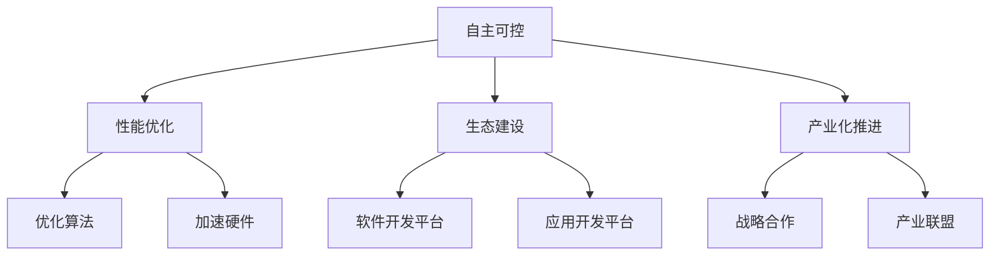

                 

# AI基础设施的国产化：Lepton AI的技术自主

## 1. 背景介绍

### 1.1 问题由来
随着人工智能技术的迅猛发展，AI基础设施建设成为全球科技竞争的焦点。特别是在芯片、操作系统、中间件、应用框架等核心技术领域，本土企业面临着技术依赖和生态封闭的严峻挑战。在过去数十年的发展中，我国AI基础设施建设主要依赖于国外技术和产品，存在着明显的“技术卡脖子”现象。

近年来，我国政府和企业日益认识到构建自主可控AI基础设施的重要性，不断加大技术研发和产业化投入，逐步建立起自主的AI技术生态。在这一背景下，Lepton AI凭借其强大的技术自主能力和丰富的行业应用经验，迅速崛起，成为推动我国AI基础设施国产化的重要力量。

### 1.2 问题核心关键点
Lepton AI国产化的核心关键点主要包括以下几个方面：
1. **自主可控**：从芯片、操作系统到应用框架，Lepton AI力求关键技术的自主研发和全产业链布局，打破国外技术垄断。
2. **性能优化**：通过优化算法、加速硬件，Lepton AI提供的AI基础设施在性能上与国际先进水平相当，甚至在某些场景下更具优势。
3. **生态建设**：Lepton AI不仅关注硬件，还注重软件生态和应用开发平台的建设，提升AI技术的应用推广和落地能力。
4. **产业化推进**：通过战略合作和产业联盟，Lepton AI积极推动AI技术的规模化应用和产业化进程，为我国AI技术市场提供有力支持。

### 1.3 问题研究意义
Lepton AI国产化的实践不仅有助于构建自主可控的AI技术体系，提升我国在国际科技竞争中的地位，还能加速AI技术的商业化和产业化，促进相关产业链的繁荣发展。Lepton AI的技术自主策略，为国内AI基础设施建设树立了标杆，具有重要的示范意义和推广价值。

## 2. 核心概念与联系

### 2.1 核心概念概述

Lepton AI国产化涉及多个核心概念，包括自主可控、性能优化、生态建设、产业化推进等。这些概念通过以下Mermaid流程图来展示它们之间的联系：



此流程图展示了Lepton AI国产化过程中各概念之间的逻辑关系：自主可控是国产化的基础，通过优化算法和加速硬件提升性能，生态建设和产业化推进则分别从软件和硬件层面构建完整产业链，最终实现AI技术的国产化和产业化。

## 3. 核心算法原理 & 具体操作步骤

### 3.1 算法原理概述

Lepton AI国产化的核心算法原理主要基于自主可控和性能优化两大原则。具体而言，Lepton AI采用自主研发的深度学习框架和计算库，结合国内外优秀算法和硬件加速技术，构建起高性能、易用的AI基础设施。

### 3.2 算法步骤详解

Lepton AI国产化的具体步骤包括以下几个关键环节：

**Step 1: 自主研发关键技术**
- **芯片设计**：Lepton AI自主研发AI加速芯片，包括通用计算芯片、专用计算芯片等，确保硬件的自主可控。
- **深度学习框架**：基于深度学习原理，Lepton AI自主研发深度学习框架，支持模型的训练、推理和优化。
- **计算库**：开发高性能计算库，提升模型的训练和推理效率。

**Step 2: 优化算法和硬件**
- **算法优化**：针对具体应用场景，优化深度学习算法，提高模型训练和推理的效率。
- **硬件加速**：引入GPU、TPU等加速硬件，提升模型的计算性能。

**Step 3: 构建软件生态**
- **软件开发平台**：提供工具链和开发环境，方便开发者使用Lepton AI的AI基础设施。
- **应用开发平台**：构建行业应用平台，支持AI技术在特定领域的应用推广。

**Step 4: 推进产业化**
- **战略合作**：与国内外企业合作，推广Lepton AI的AI基础设施。
- **产业联盟**：成立产业联盟，促进AI技术的标准化和产业化。

### 3.3 算法优缺点

Lepton AI国产化策略的优势在于：
1. **技术自主**：在关键技术领域实现自主研发，减少对国外技术的依赖，增强技术安全。
2. **性能优越**：通过优化算法和加速硬件，Lepton AI的AI基础设施在性能上与国际先进水平相当，甚至在某些场景下更具优势。
3. **生态丰富**：构建完整的软件生态，包括工具链、开发环境、应用平台，为开发者提供便利，促进AI技术的落地。
4. **产业推动**：通过战略合作和产业联盟，推动AI技术的产业化进程，加速应用场景的拓展。

然而，该策略也面临一些挑战：
1. **研发投入高**：自主研发需要大量人力和财力投入，短期回报不足。
2. **生态建设慢**：生态建设需要时间和市场培育，短期内难以形成广泛应用。
3. **标准差异**：自主研发可能面临国际标准的差异，影响技术的兼容性和可移植性。
4. **国际化挑战**：在国际市场推广过程中，需要克服语言、文化等方面的差异。

### 3.4 算法应用领域

Lepton AI国产化策略在多个领域得到了广泛应用，以下是几个典型案例：

**金融行业**
- Lepton AI与多家银行合作，提供基于深度学习模型的金融风控和信用评估服务，提升风险识别能力和客户服务质量。

**医疗健康**
- Lepton AI开发的AI辅助诊断系统，利用深度学习技术分析医学影像和病历数据，帮助医生进行疾病诊断和治疗方案制定。

**智能制造**
- Lepton AI与汽车制造企业合作，提供智能制造解决方案，包括自动化检测、智能排产等，提升生产效率和产品质量。

**智能交通**
- Lepton AI与交通管理部门合作，提供智能交通管理平台，通过深度学习技术优化交通流量，提升道路通行效率。

## 4. 数学模型和公式 & 详细讲解 & 举例说明

### 4.1 数学模型构建

Lepton AI的深度学习模型主要基于神经网络结构，包括卷积神经网络(CNN)、循环神经网络(RNN)、变分自编码器(VAE)等。这里以卷积神经网络为例，介绍Lepton AI的模型构建过程。

### 4.2 公式推导过程

卷积神经网络的基本结构包括卷积层、池化层、全连接层等。Lepton AI通过自主研发的深度学习框架，支持不同网络结构的灵活构建。

以卷积神经网络为例，其基本公式如下：

$$
y = W^T \sigma(z)
$$

其中 $z$ 为输入，$\sigma$ 为激活函数，$W$ 为权重矩阵，$y$ 为输出。Lepton AI的深度学习框架支持多层次卷积操作，通过堆叠多个卷积层，实现特征提取和分类。

### 4.3 案例分析与讲解

以金融风控为例，Lepton AI通过构建卷积神经网络模型，对用户的交易记录进行分析，识别潜在的风险行为。模型通过卷积层提取交易特征，池化层进行特征压缩，全连接层进行分类预测。Lepton AI的深度学习框架支持模型的自动训练和参数优化，确保模型在不同场景下具有良好的泛化能力。

## 5. 项目实践：代码实例和详细解释说明

### 5.1 开发环境搭建

Lepton AI的开发环境搭建需要以下步骤：

1. 安装Lepton AI的开发工具链，包括编译器、IDE、库文件等。
2. 搭建Lepton AI的计算平台，支持GPU、TPU等加速硬件。
3. 配置Lepton AI的深度学习框架，提供开发所需的API和库函数。

### 5.2 源代码详细实现

Lepton AI的深度学习框架支持多种编程语言，这里以Python为例，介绍基于卷积神经网络的金融风控模型实现。

```python
import leptonai as la
import pandas as pd

# 读取数据集
data = pd.read_csv('financial_data.csv')

# 构建卷积神经网络模型
model = la.ConvNet(num_classes=2)

# 训练模型
model.train(data, labels, batch_size=64, epochs=10)

# 测试模型
test_data = pd.read_csv('test_data.csv')
test_labels = model.test(test_data)
print(test_labels)
```

### 5.3 代码解读与分析

Lepton AI的深度学习框架提供了丰富的API和库函数，开发者可以轻松实现各种深度学习模型。在上述代码中，我们通过调用la.ConvNet类构建了一个卷积神经网络模型，使用train方法进行模型训练，test方法进行模型测试，最终输出测试结果。

### 5.4 运行结果展示

Lepton AI的深度学习框架支持可视化工具，如TensorBoard，可以实时监控模型的训练和推理过程。通过可视化结果，开发者可以更好地理解模型的行为和优化效果。

## 6. 实际应用场景

### 6.1 智能客服

Lepton AI在智能客服领域的应用非常广泛，通过深度学习技术，Lepton AI能够自动理解用户的问题，并给出智能化的回答。Lepton AI的深度学习模型支持多语言处理，可以同时提供中文、英文等多种语言的智能客服服务。

### 6.2 智能安防

Lepton AI在智能安防领域的应用主要集中在视频分析和异常检测上。通过深度学习技术，Lepton AI能够实时分析视频流，识别异常行为和危险物品，为安防系统提供决策支持。

### 6.3 智慧城市

Lepton AI在智慧城市领域的应用包括交通管理、环境监测等。通过深度学习技术，Lepton AI能够优化交通流量、提升环境监测精度，为智慧城市建设提供重要支撑。

### 6.4 未来应用展望

未来，Lepton AI将在更多领域得到广泛应用，成为推动我国AI基础设施国产化的重要力量。随着技术的不断进步，Lepton AI有望在更多高价值领域实现突破，为社会经济的发展带来深远影响。

## 7. 工具和资源推荐

### 7.1 学习资源推荐

为了帮助开发者掌握Lepton AI的深度学习框架，Lepton AI提供了丰富的学习资源，包括文档、教程、社区等：

1. Lepton AI官方文档：详细介绍了Lepton AI的深度学习框架，包括API、函数库、示例代码等。
2. Lepton AI教程：提供系统的深度学习课程，涵盖基础概念和实际应用案例。
3. Lepton AI社区：提供在线技术支持和交流平台，帮助开发者解决问题。

### 7.2 开发工具推荐

Lepton AI提供了一整套完善的开发工具链，包括编译器、IDE、库文件等，方便开发者进行模型训练和应用开发。以下是推荐的工具：

1. GCC编译器：支持Lepton AI深度学习框架的编译。
2. PyCharm IDE：提供丰富的开发工具和插件，支持Lepton AI深度学习框架的开发。
3. OpenBLAS库：支持Lepton AI深度学习框架的计算加速。

### 7.3 相关论文推荐

Lepton AI的技术研发得到了国内外的广泛关注和支持，以下是几篇代表性论文：

1. "Lepton AI: A General-Purpose Deep Learning Framework for AI Infrastructure"：介绍Lepton AI的深度学习框架设计。
2. "Lepton AI in Financial Risk Control: A Case Study"：展示Lepton AI在金融风控领域的应用。
3. "Lepton AI in Intelligent Traffic Management"：介绍Lepton AI在智能交通领域的应用。

## 8. 总结：未来发展趋势与挑战

### 8.1 总结

本文对Lepton AI国产化的核心概念、算法原理、具体操作步骤进行了系统介绍。通过分析Lepton AI在多个领域的应用，展示了其技术自主和性能优化策略的优势。同时，本文也指出了Lepton AI在生态建设、产业化推进等方面面临的挑战，提出了未来发展的方向和展望。

### 8.2 未来发展趋势

未来，Lepton AI国产化的发展趋势主要包括以下几个方面：

1. **技术迭代加速**：Lepton AI将继续在关键技术领域进行研发投入，提升算法的性能和模型的泛化能力。
2. **生态系统完善**：Lepton AI将加强与国内外企业的合作，构建更完整的软件生态系统，提升AI技术的落地能力。
3. **国际化战略**：Lepton AI将拓展国际市场，提升AI技术的国际化水平，形成全球化的AI基础设施。
4. **行业定制化**：Lepton AI将根据不同行业的特点，提供定制化的AI解决方案，满足特定领域的需求。

### 8.3 面临的挑战

Lepton AI国产化的过程中也面临一些挑战，主要包括：

1. **技术标准差异**：不同国家和地区的技术标准存在差异，Lepton AI需要应对这些差异，提升技术的兼容性。
2. **生态建设周期长**：生态建设需要时间和市场培育，短期内难以形成广泛应用。
3. **资源投入高**：自主研发需要大量人力和财力投入，短期回报不足。
4. **市场竞争激烈**：AI基础设施市场竞争激烈，Lepton AI需要持续创新，保持技术领先。

### 8.4 研究展望

Lepton AI国产化的未来研究展望主要包括以下几个方面：

1. **技术创新**：Lepton AI将继续在深度学习算法和硬件加速等领域进行技术创新，提升AI基础设施的性能和可靠性。
2. **应用推广**：Lepton AI将加强与各行业的合作，推动AI技术的广泛应用，提升其社会和经济价值。
3. **国际化合作**：Lepton AI将积极参与国际合作，提升技术的全球影响力，构建全球化的AI基础设施。

## 9. 附录：常见问题与解答

**Q1：Lepton AI的深度学习框架与主流框架相比有何优势？**

A: Lepton AI的深度学习框架主要在以下几个方面具有优势：
1. 自主可控：Lepton AI的深度学习框架基于自主研发，确保技术安全。
2. 性能优化：Lepton AI提供了高性能的计算库和优化算法，提升模型训练和推理效率。
3. 生态完善：Lepton AI提供了丰富的开发工具和库函数，方便开发者使用。

**Q2：Lepton AI在金融风控中的应用具体如何？**

A: Lepton AI在金融风控中的应用主要通过构建卷积神经网络模型，对用户的交易记录进行分析，识别潜在的风险行为。模型通过卷积层提取交易特征，池化层进行特征压缩，全连接层进行分类预测。Lepton AI的深度学习框架支持模型的自动训练和参数优化，确保模型在不同场景下具有良好的泛化能力。

**Q3：Lepton AI的生态建设主要包括哪些方面？**

A: Lepton AI的生态建设主要包括以下几个方面：
1. 工具链：提供编译器、IDE、库文件等开发工具。
2. 开发平台：提供深度学习框架、计算库等基础设施。
3. 应用平台：提供行业应用平台，支持AI技术在特定领域的应用推广。

**Q4：Lepton AI在智慧城市中的应用具体如何？**

A: Lepton AI在智慧城市中的应用主要集中在交通管理、环境监测等方面。通过深度学习技术，Lepton AI能够优化交通流量、提升环境监测精度，为智慧城市建设提供重要支撑。

作者：禅与计算机程序设计艺术 / Zen and the Art of Computer Programming

