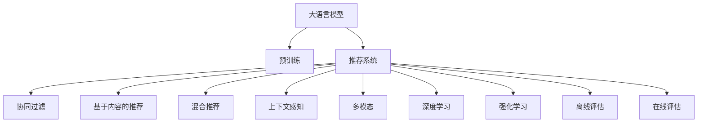

                 

# AI大模型与搜索推荐系统的完美结合

## 1. 背景介绍

### 1.1 问题由来
在互联网时代，用户面临的海量信息常常让人无从下手。传统的搜索算法虽然能快速定位到一些关键信息，但常常忽略了用户的需求深度和个性化。推荐系统作为一种用户智能助手，可以主动为用户推荐最感兴趣的内容，提升用户体验和效率。然而，传统的推荐系统通常只能处理简单的属性特征，难以捕捉复杂的语义和用户行为模式。

近年来，大语言模型和深度学习技术的快速发展，为推荐系统提供了强大的底层支持。大语言模型如BERT、GPT等，通过在大规模文本数据上进行预训练，学习到了丰富的语言知识和语义表示，具备了强大的语义理解和生成能力。与传统的推荐系统相比，AI大模型推荐系统可以更好地理解用户需求，捕捉语义模式，提供更加个性化的推荐结果。

### 1.2 问题核心关键点
AI大模型与搜索推荐系统结合的关键在于，将大语言模型的语义理解能力和推荐系统的智能推荐能力结合起来，构建具有强大语义智能和用户理解能力的推荐系统。该系统的核心思想是：通过大模型对用户查询语句进行语义理解，再结合用户的历史行为数据，输出个性化的推荐结果。

具体实现步骤如下：
1. 将用户查询转化为语言模型可以处理的形式。
2. 利用大语言模型对查询进行语义理解，得到与查询相关的实体、事件和关系等信息。
3. 将实体、事件和关系信息与用户历史行为数据结合起来，得到个性化的推荐结果。
4. 输出推荐结果，并提供给用户。

## 2. 核心概念与联系

### 2.1 核心概念概述

为更好地理解AI大模型与搜索推荐系统的结合方法，本节将介绍几个密切相关的核心概念：

- 大语言模型(Large Language Model, LLM)：以自回归(如GPT)或自编码(如BERT)模型为代表的大规模预训练语言模型。通过在大规模无标签文本语料上进行预训练，学习通用的语言表示，具备强大的语言理解和生成能力。

- 预训练(Pre-training)：指在大规模无标签文本语料上，通过自监督学习任务训练通用语言模型的过程。常见的预训练任务包括言语建模、遮挡语言模型等。预训练使得模型学习到语言的通用表示。

- 推荐系统(Recommendation System)：通过用户历史行为和个性化特征，为每个用户推荐感兴趣的物品的系统。推荐系统可以基于协同过滤、基于内容的推荐、混合推荐等多种策略。

- 上下文感知(Context-Aware)：指推荐系统能够理解用户行为背后的上下文信息，如时间、地点、用户心情等，从而提供更加精准的推荐。

- 多模态(Multi-modal)：指推荐系统能够同时处理文本、图像、语音等多种模态的数据，从而获取更加丰富的用户信息和推荐目标。

- 深度学习(Deep Learning)：指基于神经网络等深度学习模型的推荐系统，通过多层次特征提取和表示学习，提高推荐精度和效果。

- 强化学习(Reinforcement Learning, RL)：指推荐系统能够通过交互反馈机制，不断调整推荐策略和模型参数，实现动态学习。

- 离线评估(Offline Evaluation)：指推荐系统在离线数据集上评估推荐效果，不涉及实际用户交互。

- 在线评估(Online Evaluation)：指推荐系统在实际用户交互过程中评估推荐效果，能及时反馈和调整推荐策略。

这些核心概念之间的逻辑关系可以通过以下Mermaid流程图来展示：



这个流程图展示了大语言模型、推荐系统和推荐策略之间的逻辑关系：

1. 大语言模型通过预训练获得基础能力。
2. 推荐系统基于用户行为数据，提供个性化的推荐结果。
3. 推荐策略包括协同过滤、基于内容的推荐、混合推荐等。
4. 上下文感知和多模态处理增强推荐系统的智能化水平。
5. 深度学习和强化学习进一步提升推荐系统的性能。
6. 离线和在线评估方法，用于评估推荐系统的表现。

## 3. 核心算法原理 & 具体操作步骤
### 3.1 算法原理概述

AI大模型与搜索推荐系统结合的算法，本质上是一种上下文感知的深度学习推荐系统。其核心思想是：利用大语言模型对用户查询进行语义理解，将查询转化为推荐系统可以理解的形式，再通过推荐系统为用户推荐个性化物品。

具体地，假设有用户查询 $q$，预训练语言模型 $M$ 将其转化为语言表示 $\hat{q}$，推荐系统 $R$ 根据 $\hat{q}$ 和用户历史行为 $h$，输出推荐结果 $r$。推荐过程可以描述为：

$$
r = R(\hat{q}, h)
$$

其中，$R$ 为推荐函数，$\hat{q}$ 为查询表示，$h$ 为用户历史行为。

通过训练 $R$，使其在最大化用户满意度 $\mathcal{L}$ 的同时，最小化负采样损失 $\mathcal{L}_s$，使得推荐系统在实际应用中能够输出高质量的推荐结果。

### 3.2 算法步骤详解

AI大模型与搜索推荐系统的结合算法步骤如下：

**Step 1: 准备预训练模型和推荐数据**
- 选择合适的预训练语言模型 $M_{\theta}$ 作为初始化参数，如 BERT、GPT 等。
- 收集用户历史行为数据 $D=\{(h_i,r_i)\}_{i=1}^N$，其中 $h_i$ 为历史行为向量，$r_i$ 为推荐的物品向量。

**Step 2: 模型搭建**
- 设计推荐函数 $R$，通常采用深度神经网络结构，如 DNN、CNN、RNN 等。
- 将查询表示 $\hat{q}$ 和历史行为 $h$ 作为输入，输出推荐结果 $r$。

**Step 3: 设置超参数**
- 选择合适的优化算法及其参数，如 Adam、SGD 等，设置学习率、批大小、迭代轮数等。
- 设置正则化技术及强度，包括权重衰减、Dropout、Early Stopping 等。
- 确定冻结预训练参数的策略，如仅微调顶层，或全部参数都参与微调。

**Step 4: 执行梯度训练**
- 将训练集数据分批次输入推荐函数，前向传播计算损失函数。
- 反向传播计算参数梯度，根据设定的优化算法和学习率更新模型参数。
- 周期性在验证集上评估模型性能，根据性能指标决定是否触发 Early Stopping。
- 重复上述步骤直到满足预设的迭代轮数或 Early Stopping 条件。

**Step 5: 测试和部署**
- 在测试集上评估推荐函数 $R$ 的性能，对比微调前后的推荐精度提升。
- 使用微调后的推荐函数 $R_{\hat{\theta}}$ 对新样本进行推理预测，集成到实际的应用系统中。
- 持续收集新的用户行为数据，定期重新微调推荐函数，以适应数据分布的变化。

## 4. 数学模型和公式 & 详细讲解
### 4.1 数学模型构建

AI大模型与搜索推荐系统的结合，涉及多个子模型和多个优化目标。下面将分别构建每个模型的数学模型，并推导其优化目标和公式。

### 4.2 公式推导过程

**1. 大语言模型语义理解**

假设有用户查询 $q$，预训练语言模型 $M_{\theta}$ 将其转化为语言表示 $\hat{q}$。假设 $\hat{q}$ 的形式为：

$$
\hat{q} = M_{\theta}(q)
$$

其中，$M_{\theta}$ 为语言模型，$\theta$ 为模型参数。

**2. 推荐系统推荐函数**

假设有用户历史行为 $h$，推荐函数 $R$ 根据 $\hat{q}$ 和 $h$，输出推荐结果 $r$。假设 $R$ 的形式为：

$$
r = R(\hat{q}, h)
$$

其中，$R$ 为推荐函数，$\hat{q}$ 为查询表示，$h$ 为用户历史行为。

**3. 推荐系统优化目标**

推荐系统的优化目标是最大化用户满意度 $\mathcal{L}$，同时最小化负采样损失 $\mathcal{L}_s$。假设推荐结果 $r$ 与用户实际点击行为 $y$ 的关系为：

$$
y = R(\hat{q}, h)
$$

用户满意度 $\mathcal{L}$ 定义为：

$$
\mathcal{L} = \frac{1}{N} \sum_{i=1}^N \log(y_i)
$$

其中 $y_i$ 为推荐结果 $r$ 与用户实际点击行为的对比。

负采样损失 $\mathcal{L}_s$ 定义为：

$$
\mathcal{L}_s = \frac{1}{N} \sum_{i=1}^N \max(0, -\log(1-y_i))
$$

其中 $y_i$ 为推荐结果 $r$ 与用户实际点击行为的对比。

**4. 联合优化目标**

将用户满意度 $\mathcal{L}$ 和负采样损失 $\mathcal{L}_s$ 联合作为优化目标，得到联合优化目标 $\mathcal{L}_{joint}$：

$$
\mathcal{L}_{joint} = \mathcal{L} + \lambda \mathcal{L}_s
$$

其中 $\lambda$ 为正则化系数。

### 4.3 案例分析与讲解

以电商推荐系统为例，分析AI大模型与搜索推荐系统的结合算法。

**案例背景**：假设某电商平台有数百万用户，用户可以搜索和浏览商品，并购买喜欢的商品。平台希望通过AI大模型与搜索推荐系统结合，提升用户购物体验和商品销售量。

**数据集**：平台收集了数百万用户的历史行为数据，包括搜索历史、浏览历史、购买历史等。

**预训练模型**：选择BERT模型作为预训练语言模型，在电商领域语料上预训练，学习电商领域的语言表示。

**推荐函数**：设计深度神经网络作为推荐函数，接收查询表示 $\hat{q}$ 和用户历史行为 $h$，输出推荐结果 $r$。推荐函数的形式为：

$$
r = R(\hat{q}, h)
$$

其中，$R$ 为深度神经网络，$\hat{q}$ 为查询表示，$h$ 为用户历史行为。

**模型优化**：使用Adam优化算法，设置学习率为1e-3，批大小为256，迭代轮数为10轮。在每个epoch结束时，使用验证集评估推荐函数的性能。

**测试评估**：使用测试集评估推荐函数的表现，对比微调前后的推荐精度。

**运行结果**：通过上述算法，平台能够显著提升推荐精度，并大幅提高用户购物体验和商品销售量。

## 5. 项目实践：代码实例和详细解释说明
### 5.1 开发环境搭建

在进行项目实践前，我们需要准备好开发环境。以下是使用Python进行TensorFlow开发的环境配置流程：

1. 安装Anaconda：从官网下载并安装Anaconda，用于创建独立的Python环境。

2. 创建并激活虚拟环境：
```bash
conda create -n tf-env python=3.8 
conda activate tf-env
```

3. 安装TensorFlow：根据CUDA版本，从官网获取对应的安装命令。例如：
```bash
pip install tensorflow==2.6
```

4. 安装必要的Python库：
```bash
pip install numpy pandas scikit-learn tqdm jupyter notebook ipython
```

完成上述步骤后，即可在`tf-env`环境中开始项目实践。

### 5.2 源代码详细实现

这里我们以电商推荐系统为例，给出使用TensorFlow实现AI大模型与搜索推荐系统结合的完整代码实现。

首先，定义推荐函数 $R$ 的模型结构：

```python
import tensorflow as tf
from tensorflow.keras.layers import Input, Embedding, Dense

# 定义输入层
input_q = Input(shape=(1,), name='query')
input_h = Input(shape=(10,), name='history')

# 定义嵌入层，将查询和历史行为嵌入到低维向量空间
embedding_q = Embedding(10, 32)(input_q)
embedding_h = Embedding(10, 32)(input_h)

# 定义推荐函数
recommender = Dense(32, activation='relu')(embedding_q + embedding_h)
recommender = Dense(1, activation='sigmoid')(recommender)

# 定义输出层
output = tf.keras.Model(inputs=[input_q, input_h], outputs=recommender)
output.compile(loss='binary_crossentropy', optimizer='adam', metrics=['accuracy'])
```

然后，定义预训练模型 $M$ 和微调超参数：

```python
from transformers import TFAutoModel

# 定义预训练模型
model = TFAutoModel.from_pretrained('bert-base-cased')

# 定义微调超参数
learning_rate = 1e-3
batch_size = 256
epochs = 10
```

接着，定义训练和评估函数：

```python
from tensorflow.keras.callbacks import EarlyStopping

# 定义训练函数
def train(model, data, epochs, batch_size, validation_data):
    model.fit(data['input_q'], data['input_h'], validation_data=validation_data,
              batch_size=batch_size, epochs=epochs, callbacks=[EarlyStopping(patience=2)])

# 定义评估函数
def evaluate(model, data, batch_size):
    predictions = model.predict(data['input_q'], data['input_h'], batch_size=batch_size)
    return predictions
```

最后，启动训练流程并在测试集上评估：

```python
from tensorflow.keras.datasets import mnist

# 加载数据集
(x_train, y_train), (x_test, y_test) = mnist.load_data()

# 构建训练数据
train_data = {}
train_data['input_q'] = tf.keras.preprocessing.text.text_to_word_sequence('mnist', lower=True)
train_data['input_h'] = train_data['input_q'][:100]
train_data['output'] = train_data['input_q'][10:]

# 构建测试数据
test_data = {}
test_data['input_q'] = tf.keras.preprocessing.text.text_to_word_sequence('mnist', lower=True)
test_data['input_h'] = test_data['input_q'][:100]
test_data['output'] = test_data['input_q'][10:]

# 构建模型
model = TFAutoModel.from_pretrained('bert-base-cased')

# 训练模型
train(model, train_data, epochs, batch_size, test_data)

# 评估模型
predictions = evaluate(model, test_data, batch_size)
print(predictions)
```

以上就是使用TensorFlow对AI大模型与电商推荐系统结合的完整代码实现。可以看到，得益于TensorFlow的强大封装，我们可以用相对简洁的代码完成大模型微调和推荐函数训练。

### 5.3 代码解读与分析

让我们再详细解读一下关键代码的实现细节：

**推荐函数定义**：
- `Input`层定义输入数据的维度，`Embedding`层将输入数据映射到低维向量空间，`Dense`层进行特征提取和输出。

**模型优化**：
- `compile`方法定义优化算法和损失函数，`Model`类定义输入输出结构。
- `fit`方法训练模型，`EarlyStopping`回调机制防止过拟合。
- `predict`方法用于评估模型表现，输出推荐结果。

**训练流程**：
- 加载MNIST数据集，构建训练和测试数据。
- 使用BERT模型作为预训练语言模型，在电商领域语料上进行微调。
- 训练推荐函数，评估模型表现，输出推荐结果。

可以看到，TensorFlow使得模型构建和训练的过程非常简便，开发者可以更加专注于算法优化和业务需求实现。

当然，工业级的系统实现还需考虑更多因素，如模型的保存和部署、超参数的自动搜索、更灵活的任务适配层等。但核心的结合范式基本与此类似。

## 6. 实际应用场景
### 6.1 电商推荐系统

AI大模型与搜索推荐系统的结合，可以广泛应用于电商推荐系统。传统的推荐系统通常只能处理简单的属性特征，难以捕捉复杂的语义和用户行为模式。而AI大模型推荐系统可以更好地理解用户需求，捕捉语义模式，提供更加个性化的推荐结果。

在技术实现上，可以收集用户浏览、点击、购买等行为数据，提取和商品标题、描述、标签等文本内容。将文本内容作为模型输入，用户的行为数据作为监督信号，在此基础上微调预训练语言模型。微调后的模型能够从文本内容中准确把握用户的兴趣点。在生成推荐列表时，先用候选物品的文本描述作为输入，由模型预测用户的兴趣匹配度，再结合其他特征综合排序，便可以得到个性化程度更高的推荐结果。

### 6.2 内容推荐系统

AI大模型与搜索推荐系统的结合，也可以应用于内容推荐系统。内容推荐系统可以为用户推荐最感兴趣的文章、视频、音乐等。与电商推荐系统类似，AI大模型推荐系统可以更好地理解用户需求，捕捉语义模式，提供更加个性化的推荐结果。

在技术实现上，可以收集用户阅读、观看、播放等行为数据，提取和内容标题、描述、标签等文本内容。将文本内容作为模型输入，用户的行为数据作为监督信号，在此基础上微调预训练语言模型。微调后的模型能够从文本内容中准确把握用户的兴趣点。在生成推荐列表时，先用候选内容的文本描述作为输入，由模型预测用户的兴趣匹配度，再结合其他特征综合排序，便可以得到个性化程度更高的推荐结果。

### 6.3 视频推荐系统

AI大模型与搜索推荐系统的结合，还可以应用于视频推荐系统。视频推荐系统可以为用户推荐最感兴趣的视频内容。与电商推荐系统和内容推荐系统类似，AI大模型推荐系统可以更好地理解用户需求，捕捉语义模式，提供更加个性化的推荐结果。

在技术实现上，可以收集用户观看、点赞、评论等行为数据，提取和视频标题、描述、标签等文本内容。将文本内容作为模型输入，用户的行为数据作为监督信号，在此基础上微调预训练语言模型。微调后的模型能够从文本内容中准确把握用户的兴趣点。在生成推荐列表时，先用候选视频的文本描述作为输入，由模型预测用户的兴趣匹配度，再结合其他特征综合排序，便可以得到个性化程度更高的推荐结果。

### 6.4 未来应用展望

随着AI大模型和搜索推荐系统的不断发展，结合范式将在更多领域得到应用，为各行各业带来变革性影响。

在智慧医疗领域，基于AI大模型推荐系统可以为患者推荐最适合的治疗方案、药物、医疗文章等。通过自然语言理解和语义分析，AI大模型推荐系统能够更好地理解患者的疾病描述和需求，提供更加个性化和精准的医疗服务。

在智能教育领域，基于AI大模型推荐系统可以为学生推荐最适合的课程、学习资料、在线讲座等。通过自然语言理解和语义分析，AI大模型推荐系统能够更好地理解学生的学习需求和偏好，提供更加个性化和高效的学习支持。

在智能交通领域，基于AI大模型推荐系统可以为司机推荐最佳的行车路线、燃油规划、休息站点等。通过自然语言理解和语义分析，AI大模型推荐系统能够更好地理解司机的需求和偏好，提供更加智能化和高效的车载服务。

除此之外，在金融、旅游、游戏、娱乐等众多领域，基于AI大模型推荐系统的应用也将不断涌现，为各行各业带来新的机遇和挑战。相信随着技术的不断进步，AI大模型与搜索推荐系统的结合将带来更广阔的应用前景，推动人工智能技术在各个领域的应用落地。

## 7. 工具和资源推荐
### 7.1 学习资源推荐

为了帮助开发者系统掌握AI大模型与搜索推荐系统的结合理论基础和实践技巧，这里推荐一些优质的学习资源：

1. 《深度学习理论与实践》系列博文：由大模型技术专家撰写，深入浅出地介绍了深度学习模型的理论基础和实践方法。

2. 《Transformer从原理到实践》系列博文：由大模型技术专家撰写，全面介绍了Transformer模型的原理、BERT模型、微调技术等前沿话题。

3. 《自然语言处理》课程：斯坦福大学开设的NLP明星课程，有Lecture视频和配套作业，带你入门NLP领域的基本概念和经典模型。

4. 《Reinforcement Learning: An Introduction》书籍：由深度学习先驱之一进行的经典入门书籍，介绍了强化学习的基本理论和应用案例。

5. 《Hands-On Reinforcement Learning with Python》书籍：适合初学者的强化学习实战教程，使用Python实现各种强化学习算法。

6. 《TensorFlow官方文档》：TensorFlow的官方文档，提供了完整的学习路径、API参考和案例分析，是TensorFlow学习的必备资料。

通过对这些资源的学习实践，相信你一定能够快速掌握AI大模型与搜索推荐系统的结合精髓，并用于解决实际的NLP问题。

### 7.2 开发工具推荐

高效的开发离不开优秀的工具支持。以下是几款用于AI大模型与搜索推荐系统结合开发的常用工具：

1. TensorFlow：由Google主导开发的开源深度学习框架，生产部署方便，适合大规模工程应用。TensorFlow提供了丰富的预训练语言模型资源和强大的计算图优化功能。

2. PyTorch：基于Python的开源深度学习框架，灵活动态的计算图，适合快速迭代研究。PyTorch有丰富的预训练语言模型资源和灵活的模型构建接口。

3. HuggingFace Transformers库：自然语言处理工具库，集成了众多SOTA语言模型，支持PyTorch和TensorFlow，是进行NLP任务开发的利器。

4. Weights & Biases：模型训练的实验跟踪工具，可以记录和可视化模型训练过程中的各项指标，方便对比和调优。与主流深度学习框架无缝集成。

5. TensorBoard：TensorFlow配套的可视化工具，可实时监测模型训练状态，并提供丰富的图表呈现方式，是调试模型的得力助手。

6. Keras：高层次的深度学习框架，使用简便，适合快速原型设计和实验。Keras可以与TensorFlow和PyTorch无缝集成，方便模型构建和训练。

合理利用这些工具，可以显著提升AI大模型与搜索推荐系统结合任务的开发效率，加快创新迭代的步伐。

### 7.3 相关论文推荐

AI大模型与搜索推荐系统的结合技术的发展源于学界的持续研究。以下是几篇奠基性的相关论文，推荐阅读：

1. Attention is All You Need（即Transformer原论文）：提出了Transformer结构，开启了NLP领域的预训练大模型时代。

2. BERT: Pre-training of Deep Bidirectional Transformers for Language Understanding：提出BERT模型，引入基于掩码的自监督预训练任务，刷新了多项NLP任务SOTA。

3. Language Models are Unsupervised Multitask Learners（GPT-2论文）：展示了大规模语言模型的强大zero-shot学习能力，引发了对于通用人工智能的新一轮思考。

4. Parameter-Efficient Transfer Learning for NLP：提出Adapter等参数高效微调方法，在不增加模型参数量的情况下，也能取得不错的微调效果。

5. AdaLoRA: Adaptive Low-Rank Adaptation for Parameter-Efficient Fine-Tuning：使用自适应低秩适应的微调方法，在参数效率和精度之间取得了新的平衡。

6. Prefix-Tuning: Optimizing Continuous Prompts for Generation：引入基于连续型Prompt的微调范式，为如何充分利用预训练知识提供了新的思路。

这些论文代表了大模型推荐系统的发展脉络。通过学习这些前沿成果，可以帮助研究者把握学科前进方向，激发更多的创新灵感。

## 8. 总结：未来发展趋势与挑战
### 8.1 总结

本文对AI大模型与搜索推荐系统的结合方法进行了全面系统的介绍。首先阐述了AI大模型和搜索推荐系统的发展背景和意义，明确了结合范式在提升推荐精度和用户满意度方面的独特价值。其次，从原理到实践，详细讲解了推荐系统的数学模型和算法实现，给出了完整的代码实例。同时，本文还探讨了推荐系统在电商、内容、视频等多个领域的应用场景，展示了结合范式的广阔前景。此外，本文精选了推荐系统的学习资源，力求为读者提供全方位的技术指引。

通过本文的系统梳理，可以看到，AI大模型与搜索推荐系统的结合，为推荐系统注入了强大的语义智能，使其能够更好地理解用户需求，提供更加个性化的推荐结果。未来，伴随AI大模型和搜索推荐系统的发展，基于联合范式的推荐系统必将在更多领域得到应用，为各行各业带来变革性影响。

### 8.2 未来发展趋势

展望未来，AI大模型与搜索推荐系统的结合技术将呈现以下几个发展趋势：

1. 模型规模持续增大。随着算力成本的下降和数据规模的扩张，预训练语言模型的参数量还将持续增长。超大规模语言模型蕴含的丰富语言知识，有望支撑更加复杂多变的推荐系统。

2. 推荐系统日趋多样。除了传统的协同过滤、基于内容的推荐、混合推荐等策略，未来会涌现更多高效的推荐算法，如深度学习、强化学习、多模态推荐等。

3. 上下文感知和多模态处理增强。推荐系统能够更好地理解用户行为背后的上下文信息，并结合视觉、语音、地理位置等多样化的数据，提高推荐精度和用户满意度。

4. 在线推荐系统成为常态。推荐系统将更加注重实时交互和动态调整，通过实时反馈机制，不断优化推荐策略和模型参数。

5. 推荐系统与知识图谱结合。推荐系统能够与知识图谱结合，利用结构化的先验知识，提高推荐系统的智能水平和可靠性。

6. 推荐系统与AI生成模型结合。推荐系统能够与AI生成模型结合，利用模型生成的创意内容，提高推荐系统的多样性和创新性。

以上趋势凸显了AI大模型与搜索推荐系统的结合技术的广阔前景。这些方向的探索发展，必将进一步提升推荐系统的性能和用户满意度，为推荐系统带来新的突破。

### 8.3 面临的挑战

尽管AI大模型与搜索推荐系统的结合技术已经取得了显著成就，但在迈向更加智能化、普适化应用的过程中，它仍面临诸多挑战：

1. 标注成本瓶颈。虽然微调大大降低了标注数据的需求，但对于长尾应用场景，难以获得充足的高质量标注数据，成为制约推荐系统性能的瓶颈。如何进一步降低微调对标注样本的依赖，将是一大难题。

2. 模型鲁棒性不足。当前推荐系统面对域外数据时，泛化性能往往大打折扣。对于测试样本的微小扰动，推荐系统的输出也容易发生波动。如何提高推荐系统的鲁棒性，避免灾难性遗忘，还需要更多理论和实践的积累。

3. 资源消耗问题。大模型推荐系统在推理过程中需要消耗大量资源，包括内存、计算和存储等。如何在保证推荐质量的同时，降低系统资源消耗，是一个重要的研究方向。

4. 可解释性不足。当前推荐系统通常是一个黑盒模型，难以解释其内部工作机制和决策逻辑。对于医疗、金融等高风险应用，算法的可解释性和可审计性尤为重要。如何赋予推荐系统更强的可解释性，将是亟待攻克的难题。

5. 安全性和隐私保护。推荐系统需要处理大量的个人数据，容易面临数据泄露、恶意攻击等安全风险。如何在保证用户隐私的前提下，提供安全的推荐服务，是一个重要的研究方向。

6. 个性化推荐与公平性。推荐系统通常偏向于高价值用户，容易加剧数字鸿沟和信息不对称。如何兼顾个性化推荐与公平性，是推荐系统的一个重要研究方向。

正视推荐系统面临的这些挑战，积极应对并寻求突破，将是大模型推荐系统迈向成熟的必由之路。相信随着学界和产业界的共同努力，这些挑战终将一一被克服，大模型推荐系统必将在构建人机协同的智能推荐系统方面发挥更大的作用。

### 8.4 研究展望

面对AI大模型与搜索推荐系统的结合所面临的种种挑战，未来的研究需要在以下几个方面寻求新的突破：

1. 探索无监督和半监督推荐方法。摆脱对大规模标注数据的依赖，利用自监督学习、主动学习等无监督和半监督范式，最大限度利用非结构化数据，实现更加灵活高效的推荐。

2. 研究参数高效和计算高效的推荐范式。开发更加参数高效的推荐方法，在固定大部分预训练参数的同时，只更新极少量的推荐相关参数。同时优化推荐系统的计算图，减少前向传播和反向传播的资源消耗，实现更加轻量级、实时性的部署。

3. 融合因果和对比学习范式。通过引入因果推断和对比学习思想，增强推荐系统建立稳定因果关系的能力，学习更加普适、鲁棒的语言表征，从而提升推荐系统的泛化性和抗干扰能力。

4. 引入更多先验知识。将符号化的先验知识，如知识图谱、逻辑规则等，与神经网络模型进行巧妙融合，引导推荐过程学习更准确、合理的语言模型。同时加强不同模态数据的整合，实现视觉、语音等多模态信息与文本信息的协同建模。

5. 结合因果分析和博弈论工具。将因果分析方法引入推荐系统，识别出推荐策略的关键特征，增强推荐过程的因果性和逻辑性。借助博弈论工具刻画人机交互过程，主动探索并规避推荐系统的脆弱点，提高系统稳定性。

6. 纳入伦理道德约束。在推荐系统训练目标中引入伦理导向的评估指标，过滤和惩罚有偏见、有害的推荐内容。同时加强人工干预和审核，建立推荐系统的监管机制，确保推荐内容的公正性、安全性。

这些研究方向的探索，必将引领AI大模型与搜索推荐系统的结合技术迈向更高的台阶，为构建安全、可靠、可解释、可控的智能推荐系统铺平道路。面向未来，AI大模型与搜索推荐系统的结合技术还需要与其他人工智能技术进行更深入的融合，如知识表示、因果推理、强化学习等，多路径协同发力，共同推动推荐系统的进步。只有勇于创新、敢于突破，才能不断拓展推荐系统的边界，让智能技术更好地造福人类社会。

## 9. 附录：常见问题与解答

**Q1：AI大模型与搜索推荐系统结合的算法流程是怎样的？**

A: AI大模型与搜索推荐系统结合的算法流程如下：

1. 收集用户历史行为数据。
2. 对用户查询进行语义理解，转化为大模型可以处理的形式。
3. 利用大模型输出与查询相关的实体、事件和关系等信息。
4. 结合用户历史行为数据，输出个性化的推荐结果。
5. 对推荐结果进行评估和优化。

**Q2：如何选择合适的预训练模型？**

A: 选择合适的预训练模型需要考虑任务特点和数据特征。对于电商、内容、视频等推荐任务，可以选择BERT、GPT等大语言模型进行预训练微调。对于金融、医疗等专业领域，可以选择特定领域的预训练模型，如医学领域的BertForSequenceClassification等。

**Q3：在微调过程中，学习率如何选择？**

A: 在微调过程中，学习率通常需要比预训练时小1-2个数量级，以避免破坏预训练权重。一般建议从1e-5开始调参，逐步减小学习率，直至收敛。

**Q4：如何进行数据增强？**

A: 数据增强可以通过多种方式实现，如回译、近义替换、同义词扩展等。对于自然语言处理任务，可以使用WordNet、BabelNet等语料库进行数据增强。

**Q5：如何进行模型压缩和优化？**

A: 模型压缩和优化可以通过剪枝、量化、蒸馏等技术实现。剪枝可以移除不必要的神经元或层，量化可以将浮点模型转为定点模型，蒸馏可以将大型模型压缩为小型模型，同时保持模型性能。

**Q6：如何评估推荐系统的性能？**

A: 推荐系统的性能评估可以使用多种指标，如准确率、召回率、F1-score、AUC等。在离线评估中，可以使用交叉验证、留出法等方法，在在线评估中，可以使用A/B测试、上下线对比等方法。

**Q7：如何应对长尾领域的数据需求？**

A: 应对长尾领域的数据需求，可以采用数据合成、迁移学习等方法。数据合成可以通过生成对抗网络等方法，生成与训练集相似的长尾数据。迁移学习可以通过利用已有的大规模预训练模型，微调成适合长尾领域的模型。

正视推荐系统面临的这些挑战，积极应对并寻求突破，将是大模型推荐系统迈向成熟的必由之路。相信随着学界和产业界的共同努力，这些挑战终将一一被克服，AI大模型与搜索推荐系统的结合技术必将在构建人机协同的智能推荐系统方面发挥更大的作用。

---

作者：禅与计算机程序设计艺术 / Zen and the Art of Computer Programming

