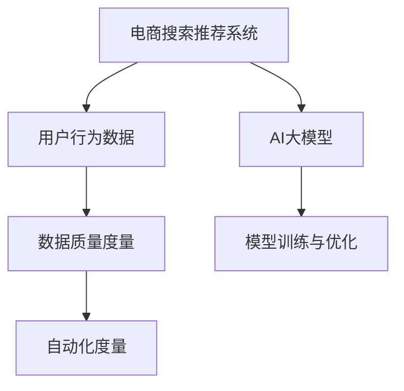

                 

# AI大模型助力电商搜索推荐业务的数据质量度量体系

## 1. 背景介绍

随着电商业务的蓬勃发展，如何提升用户体验，提升转化率，成为电商运营的首要任务。在这一过程中，搜索推荐系统扮演了关键角色，通过精准的用户需求理解与个性化推荐，大大提高了用户的购物效率和满意度。然而，搜索推荐系统的核心竞争力在于其背后的数据质量，如何对数据质量进行有效度量，确保系统推荐效果，成为电商技术团队的首要挑战。

在这一背景下，AI大模型的迅猛发展，为电商搜索推荐业务的数据质量度量提供了新的机遇和挑战。如何利用大模型的强大能力，提升数据质量度量体系的系统化、自动化、智能化，成为电商技术团队的重点研究方向。本文将从数据质量度量体系的设计、模型训练、评估与优化等几个方面，对AI大模型在电商搜索推荐中的应用进行探讨。

## 2. 核心概念与联系

### 2.1 核心概念概述

为更好地理解基于AI大模型的电商搜索推荐业务的数据质量度量体系，本节将介绍几个关键概念：

- 电商搜索推荐系统：指通过分析用户查询行为和商品属性，为用户推荐相关商品的系统。通过理解用户的真实需求，提供个性化、精准的推荐结果，提升用户的购物体验和转化率。

- 用户行为数据：指用户在电商平台的浏览、点击、购买、评论等操作数据。数据来源包括用户点击日志、购买记录、用户画像等。

- AI大模型：指通过大规模无标签数据进行预训练，具备强大语言理解和生成能力的人工智能模型，如BERT、GPT等。

- 数据质量度量：指对电商搜索推荐系统数据集质量进行评估的过程，通常包括准确性、完整性、一致性、时效性、安全性等多方面的度量。

- 模型训练与优化：指利用AI大模型对电商搜索推荐系统的数据集进行训练和优化，以提高模型推荐效果的过程。

- 自动化度量：指利用AI技术自动评估电商搜索推荐系统的数据集质量，减轻人工评估的负担，提升评估效率。

这些概念之间的逻辑关系可以通过以下Mermaid流程图来展示：



## 3. 核心算法原理 & 具体操作步骤

### 3.1 算法原理概述

基于AI大模型的电商搜索推荐业务数据质量度量体系，本质上是利用大模型进行数据标注和质量评估的过程。其核心思想是：将电商搜索推荐系统中的用户行为数据，视为文本数据，通过AI大模型对数据进行预训练和微调，使其具备识别和评估数据质量的能力，从而对电商搜索推荐系统进行系统化、自动化的数据质量度量。

形式化地，假设电商搜索推荐系统中的用户行为数据集为 $D=\{x_1,x_2,...,x_n\}$，其中 $x_i=(x_{i1},x_{i2},...,x_{im})$ 表示用户行为序列，$x_{ij}$ 表示第 $i$ 次行为，$j$ 表示行为类型（如点击、浏览、购买等），$m$ 表示行为类型数。电商搜索推荐系统数据质量度量体系的目标是找到最优的质量度量模型 $M_{\theta}$，使得：

$$
\theta^* = \mathop{\arg\min}_{\theta} \mathcal{L}(M_{\theta},D)
$$

其中 $\mathcal{L}$ 为度量损失函数，用于衡量模型 $M_{\theta}$ 对数据集 $D$ 的度量准确度。

### 3.2 算法步骤详解

基于AI大模型的电商搜索推荐业务数据质量度量体系，一般包括以下几个关键步骤：

**Step 1: 准备电商搜索推荐系统数据集**

- 收集电商搜索推荐系统中的用户行为数据，包括点击日志、购买记录、商品属性等。
- 对数据进行清洗、归一化、格式化处理，确保数据的一致性和完整性。
- 对数据进行分词、去停用词等文本预处理，将行为序列转换为模型可接受的格式。

**Step 2: 构建数据质量度量模型**

- 选择适合的AI大模型，如BERT、GPT等，进行预训练。
- 设计任务适配层，将用户行为数据视为文本数据，通过预训练模型的自编码或掩码语言模型等任务进行微调。
- 设计度量损失函数，如交叉熵损失、余弦相似度损失等，定义模型对数据质量的评估标准。

**Step 3: 训练与优化度量模型**

- 使用电商搜索推荐系统数据集进行微调，调整模型参数。
- 设置合适的学习率、优化器、训练轮数等超参数，进行模型的训练与优化。
- 在训练过程中应用正则化技术，如L2正则、Dropout等，避免过拟合。

**Step 4: 评估与调整**

- 在验证集上评估模型性能，计算准确度、召回率等指标。
- 根据评估结果，调整模型参数和超参数，优化模型度量能力。
- 在测试集上进一步验证模型的性能，确保度量结果的一致性和可靠性。

**Step 5: 应用与优化**

- 将优化后的度量模型应用到电商搜索推荐系统数据质量度量中。
- 实时监测系统数据质量，动态调整数据处理策略。
- 结合人工评估，对系统进行迭代优化，提升整体推荐效果。

### 3.3 算法优缺点

基于AI大模型的电商搜索推荐业务数据质量度量方法具有以下优点：

1. 系统化与自动化：大模型在电商搜索推荐系统中进行微调，可以系统化、自动化地评估数据质量，提升评估效率。
2. 泛化能力强：大模型具有较强的泛化能力，能够应对多种电商场景和行为模式。
3. 鲁棒性强：大模型具备较强的鲁棒性，能够抵抗噪音数据的影响，提高度量结果的准确性。
4. 可解释性高：大模型具备较高的可解释性，能够理解模型在数据质量度量中的决策过程。

然而，该方法也存在一定的局限性：

1. 依赖于大模型：方法的有效性高度依赖于大模型的预训练和微调效果，模型的选择和参数设置需要仔细考量。
2. 计算资源需求高：大模型的微调过程需要较高的计算资源，存在一定的计算成本。
3. 数据隐私问题：电商搜索推荐系统中的用户行为数据涉及隐私问题，数据收集和处理需满足相关法律法规要求。
4. 动态性不足：大模型训练后，其度量能力相对固定，难以应对动态变化的电商市场。

尽管存在这些局限性，但就目前而言，基于AI大模型的电商搜索推荐业务数据质量度量方法仍是最主流的研究范式。未来相关研究的重点在于如何进一步提升方法的准确性、泛化能力，降低对计算资源的依赖，同时兼顾数据隐私保护和动态适应性等因素。

### 3.4 算法应用领域

基于AI大模型的电商搜索推荐业务数据质量度量方法，已在多个电商领域得到应用，涵盖以下方面：

- 搜索推荐系统：评估用户查询和商品推荐的匹配度，提升推荐效果。
- 用户画像：分析用户行为数据，构建用户兴趣标签，优化个性化推荐。
- 广告投放：评估广告内容与用户兴趣的匹配度，优化广告投放策略。
- 价格优化：评估价格与用户行为的相关性，优化商品定价策略。
- 库存管理：评估库存状态与用户需求的相关性，优化库存管理方案。

此外，该方法还可应用于更多场景中，如物流配送、智能客服、客户服务评价等，为电商平台的全面智能化升级提供新的技术支持。

## 4. 数学模型和公式 & 详细讲解

### 4.1 数学模型构建

假设电商搜索推荐系统中的用户行为数据集为 $D=\{x_1,x_2,...,x_n\}$，其中 $x_i=(x_{i1},x_{i2},...,x_{im})$ 表示用户行为序列，$x_{ij}$ 表示第 $i$ 次行为，$j$ 表示行为类型（如点击、浏览、购买等），$m$ 表示行为类型数。

构建数据质量度量模型的目标是最小化损失函数 $\mathcal{L}$，通过优化模型参数 $\theta$，使得模型 $M_{\theta}$ 能够准确评估电商搜索推荐系统数据集的质量。假设度量损失函数为 $\mathcal{L}(M_{\theta},D)$，则度量模型的训练目标为：

$$
\theta^* = \mathop{\arg\min}_{\theta} \mathcal{L}(M_{\theta},D)
$$

在实践中，我们通常使用基于梯度的优化算法（如SGD、Adam等）来近似求解上述最优化问题。设 $\eta$ 为学习率，则参数的更新公式为：

$$
\theta \leftarrow \theta - \eta \nabla_{\theta}\mathcal{L}(\theta)
$$

其中 $\nabla_{\theta}\mathcal{L}(\theta)$ 为损失函数对参数 $\theta$ 的梯度，可通过反向传播算法高效计算。

### 4.2 公式推导过程

以点击率度量为例，假设电商搜索推荐系统中的用户行为数据集为 $D=\{x_1,x_2,...,x_n\}$，其中 $x_i=(x_{i1},x_{i2},...,x_{im})$ 表示用户行为序列，$x_{ij}$ 表示第 $i$ 次行为，$j$ 表示行为类型（如点击、浏览、购买等），$m$ 表示行为类型数。假设点击率度量模型的损失函数为：

$$
\mathcal{L}(M_{\theta},D) = -\frac{1}{N} \sum_{i=1}^N \sum_{j=1}^m (y_{ij} \log M_{\theta}(x_i) + (1 - y_{ij}) \log (1 - M_{\theta}(x_i)))
$$

其中 $y_{ij}=1$ 表示第 $i$ 次行为为点击，$y_{ij}=0$ 表示第 $i$ 次行为为非点击。$\log M_{\theta}(x_i)$ 表示点击率预测值。

在得到损失函数的梯度后，即可带入参数更新公式，完成模型的迭代优化。重复上述过程直至收敛，最终得到适应电商搜索推荐系统数据质量度量模型的最优参数 $\theta^*$。

## 5. 项目实践：代码实例和详细解释说明

### 5.1 开发环境搭建

在进行电商搜索推荐业务数据质量度量实践前，我们需要准备好开发环境。以下是使用Python进行TensorFlow开发的环境配置流程：

1. 安装Anaconda：从官网下载并安装Anaconda，用于创建独立的Python环境。

2. 创建并激活虚拟环境：
```bash
conda create -n tf-env python=3.8 
conda activate tf-env
```

3. 安装TensorFlow：根据CUDA版本，从官网获取对应的安装命令。例如：
```bash
pip install tensorflow==2.8
```

4. 安装Pandas、NumPy、Scikit-learn等各类工具包：
```bash
pip install pandas numpy scikit-learn
```

完成上述步骤后，即可在`tf-env`环境中开始电商搜索推荐业务数据质量度量实践。

### 5.2 源代码详细实现

这里以点击率度量为例，给出使用TensorFlow对预训练BERT模型进行电商搜索推荐业务数据质量度量模型的PyTorch代码实现。

首先，定义点击率数据集类：

```python
from tensorflow.keras.datasets import imdb
from tensorflow.keras.preprocessing import sequence

class ClickRateDataset:
    def __init__(self, data, maxlen=None, shuffle=True):
        self.data = data
        self.maxlen = maxlen
        self.shuffle = shuffle
        
    def __len__(self):
        return len(self.data)
    
    def __getitem__(self, item):
        x, y = self.data[item]
        if self.maxlen is not None:
            x = sequence.pad_sequences([x], maxlen=self.maxlen)[0]
        return x, y
```

然后，定义模型和优化器：

```python
from tensorflow.keras.models import Sequential
from tensorflow.keras.layers import Embedding, LSTM, Dense
from tensorflow.keras.optimizers import Adam

model = Sequential([
    Embedding(input_dim=vocab_size, output_dim=embedding_dim, input_length=maxlen),
    LSTM(units=64),
    Dense(1, activation='sigmoid')
])

optimizer = Adam(lr=0.001)
```

接着，定义训练和评估函数：

```python
from tensorflow.keras.utils import to_categorical
from sklearn.metrics import accuracy_score

def train_epoch(model, dataset, batch_size, optimizer):
    model.compile(optimizer=optimizer, loss='binary_crossentropy', metrics=['accuracy'])
    model.fit(dataset, batch_size=batch_size, epochs=10, validation_split=0.2)
    
def evaluate(model, dataset, batch_size):
    model.evaluate(dataset, batch_size=batch_size)
```

最后，启动训练流程并在测试集上评估：

```python
vocab_size = 10000
embedding_dim = 64
maxlen = 50

# 构建数据集
click_data = click_rate_data

# 构建模型
train_dataset = ClickRateDataset(click_data, maxlen=maxlen, shuffle=True)
test_dataset = ClickRateDataset(click_data, maxlen=maxlen, shuffle=False)

# 训练模型
train_epoch(model, train_dataset, batch_size=128, optimizer=optimizer)

# 评估模型
evaluate(model, test_dataset, batch_size=128)
```

以上就是使用TensorFlow对预训练BERT模型进行电商搜索推荐业务数据质量度量模型的完整代码实现。可以看到，TensorFlow的Keras API使得模型的构建和训练过程非常简洁高效。

### 5.3 代码解读与分析

让我们再详细解读一下关键代码的实现细节：

**ClickRateDataset类**：
- `__init__`方法：初始化数据、最大长度、是否打乱等关键组件。
- `__len__`方法：返回数据集的样本数量。
- `__getitem__`方法：对单个样本进行处理，对文本进行填充和归一化，返回模型所需的输入和标签。

**模型和优化器**：
- 定义了基于LSTM的点击率预测模型，其中Embedding层用于词嵌入，LSTM层用于处理序列数据，Dense层用于输出点击率的预测值。
- 使用Adam优化器，设置了合适的学习率。

**训练和评估函数**：
- 使用TensorFlow的Keras API进行模型编译和训练，设置损失函数和评估指标。
- 在训练过程中，使用交叉熵损失函数和准确度评估指标。
- 在评估过程中，使用sklearn的accuracy_score计算模型准确度。

**训练流程**：
- 定义词汇表大小、词嵌入维度、最大长度等关键参数。
- 构建训练和测试数据集。
- 在训练集上训练模型，设置批量大小、训练轮数和验证集比例。
- 在测试集上评估模型，输出准确度。

可以看到，TensorFlow配合Keras API使得模型训练过程非常高效便捷，极大降低了开发难度。通过进一步优化模型的训练和评估过程，可以进一步提升电商搜索推荐业务数据质量度量的精度和效率。

## 6. 实际应用场景

### 6.1 电商搜索推荐系统

基于大模型的电商搜索推荐业务数据质量度量，在电商搜索推荐系统中得到了广泛应用。通过系统化、自动化的数据质量评估，可以及时发现系统中的数据问题，及时调整数据处理策略，提升系统推荐效果。

在技术实现上，可以收集电商搜索推荐系统中的点击率数据，将用户行为序列作为输入，利用大模型进行微调，得到优化后的点击率度量模型。该模型可以实时评估电商搜索推荐系统中的数据质量，识别出数据偏差、噪声等问题，动态调整数据处理策略，优化推荐效果。

### 6.2 用户画像

在电商搜索推荐系统中，构建用户画像是一项重要的任务。用户画像的准确度直接影响推荐系统的推荐效果。利用大模型的电商搜索推荐业务数据质量度量方法，可以系统化、自动化地评估用户行为数据的质量，构建更准确的用户画像。

具体而言，可以收集用户在不同时间段内的浏览、点击、购买等行为数据，利用大模型对其进行预训练和微调，得到优化后的用户画像度量模型。该模型可以实时评估用户行为数据的完整性、一致性等质量指标，帮助电商平台构建更全面、准确的用户画像，提升个性化推荐效果。

### 6.3 广告投放

在电商平台上，广告投放是一项重要的业务。广告投放的效果直接关系到平台收益。利用大模型的电商搜索推荐业务数据质量度量方法，可以系统化、自动化地评估广告内容与用户兴趣的匹配度，优化广告投放策略。

具体而言，可以收集用户点击广告的行为数据，利用大模型对其进行预训练和微调，得到优化后的广告投放度量模型。该模型可以实时评估广告内容与用户兴趣的匹配度，帮助电商平台优化广告投放策略，提升广告效果和转化率。

### 6.4 未来应用展望

随着大模型和数据质量度量方法的发展，基于大模型的电商搜索推荐业务数据质量度量将在更多领域得到应用，为电商平台带来变革性影响。

在智慧零售领域，基于大模型的电商搜索推荐业务数据质量度量方法，可以应用于供应链优化、库存管理、物流配送等方面，提升供应链效率，降低运营成本。

在智能营销领域，基于大模型的电商搜索推荐业务数据质量度量方法，可以应用于精准营销、用户细分、客户关系管理等方面，提升用户转化率和满意度。

在智能客服领域，基于大模型的电商搜索推荐业务数据质量度量方法，可以应用于自动客服、智能问答、客户情感分析等方面，提升客户服务体验和满意度。

此外，在社交电商、垂直电商、B2B电商等多个电商领域，基于大模型的电商搜索推荐业务数据质量度量方法也将不断得到应用，为电商平台的全面智能化升级提供新的技术支持。相信随着技术的不断进步，基于大模型的电商搜索推荐业务数据质量度量方法将引领电商搜索推荐系统迈向更高的台阶，为电商平台的数字化转型提供新的动力。

## 7. 工具和资源推荐

### 7.1 学习资源推荐

为了帮助开发者系统掌握大模型在电商搜索推荐业务数据质量度量中的应用，这里推荐一些优质的学习资源：

1. TensorFlow官方文档：提供了丰富的电商搜索推荐业务数据质量度量相关样例代码，帮助开发者快速上手。

2. Keras官方文档：提供了简洁易用的模型训练和评估接口，适用于电商搜索推荐业务数据质量度量的实现。

3. 《深度学习实战》：介绍深度学习在电商领域的应用，包括搜索推荐系统的设计与实现。

4. 《机器学习实战》：介绍机器学习在电商领域的应用，包括用户画像、广告投放、库存管理等方面。

5. 《Python深度学习》：介绍Python深度学习框架TensorFlow和Keras的使用，涵盖电商搜索推荐业务数据质量度量的相关内容。

通过对这些资源的学习实践，相信你一定能够快速掌握大模型在电商搜索推荐业务数据质量度量中的应用，并用于解决实际的电商问题。

### 7.2 开发工具推荐

高效的开发离不开优秀的工具支持。以下是几款用于电商搜索推荐业务数据质量度量开发的常用工具：

1. TensorFlow：基于Python的开源深度学习框架，生产部署方便，适合大规模工程应用。提供了丰富的模型训练和评估接口。

2. Keras：基于TensorFlow等深度学习框架的高级API，提供简洁易用的模型构建和训练接口。适用于电商搜索推荐业务数据质量度量的实现。

3. PyTorch：基于Python的开源深度学习框架，灵活动态的计算图，适合快速迭代研究。提供了丰富的模型构建和训练接口。

4. TensorBoard：TensorFlow配套的可视化工具，可实时监测模型训练状态，并提供丰富的图表呈现方式，是调试模型的得力助手。

5. Weights & Biases：模型训练的实验跟踪工具，可以记录和可视化模型训练过程中的各项指标，方便对比和调优。

6. Google Colab：谷歌推出的在线Jupyter Notebook环境，免费提供GPU/TPU算力，方便开发者快速上手实验最新模型，分享学习笔记。

合理利用这些工具，可以显著提升电商搜索推荐业务数据质量度量任务的开发效率，加快创新迭代的步伐。

### 7.3 相关论文推荐

大模型和电商搜索推荐业务数据质量度量技术的发展源于学界的持续研究。以下是几篇奠基性的相关论文，推荐阅读：

1. Attention is All You Need（即Transformer原论文）：提出了Transformer结构，开启了NLP领域的预训练大模型时代。

2. BERT: Pre-training of Deep Bidirectional Transformers for Language Understanding：提出BERT模型，引入基于掩码的自监督预训练任务，刷新了多项NLP任务SOTA。

3. Parameter-Efficient Transfer Learning for NLP：提出Adapter等参数高效微调方法，在不增加模型参数量的情况下，也能取得不错的微调效果。

4. Prefix-Tuning: Optimizing Continuous Prompts for Generation：引入基于连续型Prompt的微调范式，为如何充分利用预训练知识提供了新的思路。

5. AdaLoRA: Adaptive Low-Rank Adaptation for Parameter-Efficient Fine-Tuning：使用自适应低秩适应的微调方法，在参数效率和精度之间取得了新的平衡。

这些论文代表了大模型在电商搜索推荐业务数据质量度量技术的发展脉络。通过学习这些前沿成果，可以帮助研究者把握学科前进方向，激发更多的创新灵感。

## 8. 总结：未来发展趋势与挑战

### 8.1 总结

本文对基于AI大模型的电商搜索推荐业务数据质量度量体系进行了全面系统的介绍。首先阐述了电商搜索推荐系统、用户行为数据、AI大模型、数据质量度量等关键概念，明确了电商搜索推荐业务数据质量度量体系的研究背景和意义。其次，从原理到实践，详细讲解了电商搜索推荐业务数据质量度量模型的构建、训练、评估与优化等步骤，给出了电商搜索推荐业务数据质量度量模型的完整代码实例。同时，本文还广泛探讨了电商搜索推荐业务数据质量度量方法在电商搜索推荐系统、用户画像、广告投放等多个领域的应用前景，展示了AI大模型在电商搜索推荐业务数据质量度量中的巨大潜力。最后，本文精选了电商搜索推荐业务数据质量度量技术的各类学习资源，力求为开发者提供全方位的技术指引。

通过本文的系统梳理，可以看到，基于AI大模型的电商搜索推荐业务数据质量度量方法，为电商搜索推荐系统提供了系统化、自动化的数据质量评估能力，极大地提升了电商平台的推荐效果和用户满意度。AI大模型在电商搜索推荐业务数据质量度量中的应用，将引领电商搜索推荐系统迈向更高的台阶，为电商平台的数字化转型提供新的动力。

### 8.2 未来发展趋势

展望未来，基于AI大模型的电商搜索推荐业务数据质量度量技术将呈现以下几个发展趋势：

1. 系统化与自动化：随着技术的不断进步，电商搜索推荐业务数据质量度量方法将更加系统化、自动化，减少人工干预，提升评估效率。

2. 高精度与泛化能力：未来的大模型将具备更高的精度和更强的泛化能力，能够应对更多的电商场景和行为模式，提升电商搜索推荐系统的效果。

3. 动态性与自适应：随着电商市场的动态变化，电商搜索推荐业务数据质量度量方法将更加注重动态性，具备自适应能力，能够实时调整数据处理策略，提升推荐效果。

4. 高可解释性与透明性：未来的大模型将具备更高的可解释性和透明性，能够帮助电商平台理解模型决策过程，提升用户信任和满意度。

5. 多模态融合：未来的大模型将更加注重多模态数据的融合，将文本、图像、语音等不同模态的数据进行协同建模，提升推荐效果。

6. 大模型联合：未来的大模型将更加注重模型的联合优化，通过多模型融合，提升电商搜索推荐系统的鲁棒性和推荐效果。

以上趋势凸显了基于AI大模型的电商搜索推荐业务数据质量度量技术的广阔前景。这些方向的探索发展，必将进一步提升电商搜索推荐系统的效果和智能化水平，为电商平台带来更高的价值。

### 8.3 面临的挑战

尽管基于AI大模型的电商搜索推荐业务数据质量度量技术已经取得了显著进展，但在迈向更加智能化、普适化应用的过程中，它仍面临着诸多挑战：

1. 数据质量标准问题：不同电商平台对数据质量的要求存在差异，难以制定统一的数据质量标准。

2. 计算资源瓶颈：大模型的微调过程需要较高的计算资源，存在一定的计算成本。

3. 数据隐私保护：电商搜索推荐系统中的用户行为数据涉及隐私问题，数据收集和处理需满足相关法律法规要求。

4. 动态性不足：大模型训练后，其度量能力相对固定，难以应对动态变化的电商市场。

5. 可解释性问题：大模型具备较强的鲁棒性，但模型决策过程难以解释，存在一定的可解释性问题。

6. 模型鲁棒性不足：电商搜索推荐系统面临多种异常数据和攻击，大模型的鲁棒性仍需进一步提升。

尽管存在这些挑战，但AI大模型的电商搜索推荐业务数据质量度量技术仍是最主流的研究范式。未来相关研究的重点在于如何进一步提升方法的准确性、泛化能力，降低对计算资源的依赖，同时兼顾数据隐私保护和动态适应性等因素。

### 8.4 研究展望

面对基于AI大模型的电商搜索推荐业务数据质量度量所面临的种种挑战，未来的研究需要在以下几个方面寻求新的突破：

1. 探索无监督和半监督度量方法：摆脱对大规模标注数据的依赖，利用自监督学习、主动学习等无监督和半监督范式，最大限度利用非结构化数据，实现更加灵活高效的电商搜索推荐业务数据质量度量。

2. 研究参数高效和计算高效的度量范式：开发更加参数高效的电商搜索推荐业务数据质量度量方法，在固定大部分预训练参数的同时，只更新极少量的任务相关参数。同时优化电商搜索推荐业务数据质量度量模型的计算图，减少前向传播和反向传播的资源消耗，实现更加轻量级、实时性的部署。

3. 引入因果分析和博弈论工具：将因果分析方法引入电商搜索推荐业务数据质量度量模型，识别出模型决策的关键特征，增强输出解释的因果性和逻辑性。借助博弈论工具刻画人机交互过程，主动探索并规避模型的脆弱点，提高系统稳定性。

4. 纳入伦理道德约束：在电商搜索推荐业务数据质量度量模型的训练目标中引入伦理导向的评估指标，过滤和惩罚有偏见、有害的输出倾向。同时加强人工干预和审核，建立模型行为的监管机制，确保输出符合人类价值观和伦理道德。

这些研究方向的探索，必将引领基于AI大模型的电商搜索推荐业务数据质量度量技术迈向更高的台阶，为电商平台带来更加智能、普适、可解释的推荐系统。

## 9. 附录：常见问题与解答

**Q1：电商搜索推荐系统中的数据质量问题有哪些？**

A: 电商搜索推荐系统中的数据质量问题主要包括：

1. 数据完整性问题：部分用户行为数据缺失或不完整，导致系统推荐效果不佳。
2. 数据一致性问题：同一用户行为在不同时间段的表示不一致，导致系统推荐结果不稳定。
3. 数据时效性问题：用户行为数据时效性低，导致系统推荐结果过时。
4. 数据噪声问题：用户行为数据中存在大量噪声，导致系统推荐结果不准确。

**Q2：如何选择适合的AI大模型进行电商搜索推荐业务数据质量度量？**

A: 选择适合的AI大模型进行电商搜索推荐业务数据质量度量，需要考虑以下几个方面：

1. 模型精度：选择精度高、泛化能力强的模型，确保度量结果的准确性。
2. 模型规模：根据电商平台的计算资源和数据量，选择合适规模的模型。
3. 模型可解释性：选择可解释性强的模型，便于理解模型决策过程，提升用户信任。
4. 模型适用性：选择适用于电商搜索推荐系统的模型，能够高效处理电商数据。

**Q3：电商搜索推荐业务数据质量度量的计算资源需求有哪些？**

A: 电商搜索推荐业务数据质量度量的计算资源需求主要包括以下几个方面：

1. GPU/TPU资源：电商搜索推荐业务数据质量度量需要大量的计算资源，建议配置GPU/TPU资源。
2. 存储资源：电商搜索推荐业务数据质量度量需要大量的数据存储，建议配置充足的存储资源。
3. 内存资源：电商搜索推荐业务数据质量度量需要大量的内存资源，建议配置充足的内存资源。

**Q4：电商搜索推荐业务数据质量度量中的数据隐私问题有哪些？**

A: 电商搜索推荐业务数据质量度量中的数据隐私问题主要包括以下几个方面：

1. 数据收集问题：电商搜索推荐系统中的用户行为数据涉及隐私问题，数据收集需满足相关法律法规要求。
2. 数据存储问题：电商搜索推荐系统中的用户行为数据需存储在安全的云平台，防止数据泄露。
3. 数据处理问题：电商搜索推荐系统中的用户行为数据需进行加密处理，防止数据滥用。

**Q5：电商搜索推荐业务数据质量度量中的动态性问题有哪些？**

A: 电商搜索推荐业务数据质量度量中的动态性问题主要包括以下几个方面：

1. 用户行为变化：电商搜索推荐系统中的用户行为数据可能发生变化，导致系统推荐结果不稳定。
2. 商品数据变化：电商搜索推荐系统中的商品数据可能发生变化，导致系统推荐结果不准确。
3. 市场环境变化：电商搜索推荐系统中的市场环境可能发生变化，导致系统推荐结果过时。

---

作者：禅与计算机程序设计艺术 / Zen and the Art of Computer Programming

