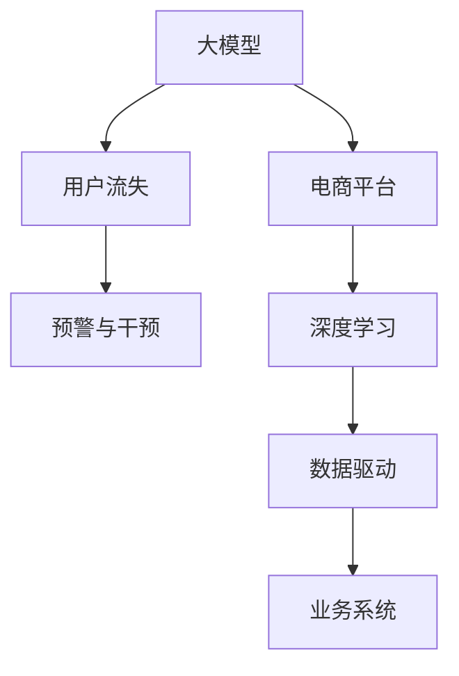

                 

# AI大模型在电商平台用户流失预警与干预中的作用

> 关键词：大模型, 用户流失, 预警与干预, 电商平台, 深度学习, 数据驱动

## 1. 背景介绍

### 1.1 问题由来
随着电商行业的快速发展和激烈竞争，用户流失问题已成为各大电商平台面临的重大挑战之一。用户流失不仅会直接影响电商平台的收入，还会带来新用户获取成本的上升，以及品牌口碑的下降。因此，如何有效预测和干预用户流失，是电商平台亟需解决的重要课题。

传统上，电商平台主要依赖人工分析、问卷调查等方式进行用户流失预测，但这种方法的精度有限，且成本较高。近年来，随着深度学习技术的发展，基于大模型的方法在用户流失预警与干预中得到了广泛应用。大模型通过在大规模数据上进行预训练，学习到复杂的用户行为模式和情感倾向，能够在标注数据较少的情况下，准确预测用户流失风险，并提出针对性的干预策略，显著提升用户留存率。

### 1.2 问题核心关键点
大模型在电商平台用户流失预警与干预中的作用，主要体现在以下几个方面：

1. **高精度预测**：大模型通过大量历史数据学习，具备强大的泛化能力，能够在标注数据较少的情况下，准确预测用户流失风险，为预警系统提供可靠的数据支持。

2. **自动化干预**：大模型输出的预警结果，可以直接驱动个性化推荐、专属优惠、客户服务干预等自动化策略，提升用户满意度，减少流失。

3. **自适应学习**：大模型能够不断学习新的数据，适应不断变化的商业环境，提升预警与干预的实时性，降低决策延迟。

4. **可解释性强**：通过大模型的内部分析，可以揭示用户流失的原因和特征，帮助电商平台制定更有效的干预策略。

5. **可扩展性强**：大模型易于扩展到不同的业务场景和数据源，提升预警与干预系统的灵活性和覆盖范围。

6. **全链路优化**：大模型可以与用户行为分析、市场反馈、业务策略等多个环节进行衔接，实现全链路优化，提升整体运营效率。

通过以上几个方面的优势，大模型在电商平台用户流失预警与干预中发挥了重要的作用，成为电商企业智能化转型的重要工具。

## 2. 核心概念与联系

### 2.1 核心概念概述

为了更好地理解大模型在电商平台用户流失预警与干预中的应用，本节将介绍几个关键概念：

1. **大模型 (Large Model)**：指在大规模数据集上进行深度学习训练，参数规模较大的神经网络模型。如GPT、BERT、XLNet等。这些模型通过预训练学习到广泛的语义和结构化知识，具备强大的学习能力和泛化能力。

2. **用户流失 (User Churn)**：指用户在一定时间内停止使用平台，不再产生交易、访问、互动等行为的现象。用户流失不仅影响电商平台的收入，还对平台品牌形象、市场份额等带来负面影响。

3. **预警与干预 (Early Warning and Intervention)**：在用户流失前，通过大模型预测用户流失风险，并采取相应的干预措施，以降低流失率。预警与干预系统的建设是电商平台提高用户留存率的重要手段。

4. **电商平台 (E-commerce Platform)**：指通过互联网提供商品销售、在线支付、物流配送等服务的平台。电商平台的成功运营依赖于高效的用户管理和流失预警与干预系统。

5. **深度学习 (Deep Learning)**：基于神经网络，通过多层次的特征提取和模型训练，实现复杂数据和大规模预测任务的技术。深度学习在电商、金融、医疗等多个领域得到广泛应用。

6. **数据驱动 (Data-Driven)**：利用数据和算法，自动进行决策和分析，提升业务效率和效果的技术。数据驱动是智能业务系统的重要特征。

这些核心概念之间的逻辑关系可以通过以下Mermaid流程图来展示：



这个流程图展示了大模型、用户流失、预警与干预、电商平台、深度学习、数据驱动之间的逻辑关系：

1. 大模型通过深度学习技术，在大量数据上进行预训练，学习到复杂的用户行为模式和情感倾向。
2. 电商平台通过大模型预测用户流失风险，并采取相应的干预措施，降低流失率。
3. 深度学习为大模型提供技术支撑，提升模型的学习能力和泛化能力。
4. 数据驱动为电商平台的决策和运营提供数据支持，提高业务效率和效果。
5. 业务系统通过数据驱动和深度学习，实现用户流失预警与干预的自动化和智能化。

## 3. 核心算法原理 & 具体操作步骤

### 3.1 算法原理概述

大模型在电商平台用户流失预警与干预中的核心算法原理基于深度学习中的序列建模技术，通过多层次特征提取和预测，实现对用户行为和情感的建模和预测。具体而言，包括以下几个关键步骤：

1. **数据准备**：收集电商平台的交易记录、用户行为、互动数据等，进行数据清洗和特征工程，构建训练集、验证集和测试集。
2. **模型预训练**：使用大模型在电商平台的原始数据上进行预训练，学习到基础的业务知识和大规模语义模式。
3. **模型微调**：在预训练模型的基础上，使用标注好的用户流失数据进行微调，学习到更精细化的用户流失特征和规律。
4. **预测与干预**：将新的用户数据输入微调后的模型，预测用户流失风险，并根据预测结果进行相应的干预措施，如个性化推荐、专属优惠、客户服务干预等。

### 3.2 算法步骤详解

大模型在电商平台用户流失预警与干预的具体操作步骤如下：

**Step 1: 数据准备**
- 收集电商平台的交易记录、用户行为、互动数据等，进行数据清洗和特征工程。例如，将时间戳转换为日期格式，将文本数据分词并进行词向量化。
- 构建训练集、验证集和测试集。一般采用7:2:1的比例，将数据集划分为训练、验证和测试三部分。
- 使用大模型所需的输入格式，如句子序列、时间序列等，对数据进行预处理。

**Step 2: 模型预训练**
- 选择合适的大模型，如BERT、GPT-3等，在电商平台的原始数据上进行预训练。预训练任务可以包括语言建模、掩码预测、序列分类等。
- 设置预训练参数，如学习率、批次大小、迭代轮数等。一般使用AdamW等优化器进行优化。
- 在预训练过程中，可以加入正则化技术，如L2正则、Dropout等，避免过拟合。

**Step 3: 模型微调**
- 对标注好的用户流失数据进行微调，学习到更精细化的用户流失特征和规律。可以使用部分标注数据进行微调，也可以使用全量标注数据。
- 设置微调参数，如学习率、批次大小、迭代轮数等。一般使用更小的学习率，以免破坏预训练权重。
- 微调过程中，可以加入正则化技术，如L2正则、Dropout等，避免过拟合。

**Step 4: 预测与干预**
- 将新的用户数据输入微调后的模型，预测用户流失风险。预测结果可以是一个概率值，表示用户流失的概率大小。
- 根据预测结果进行相应的干预措施，如个性化推荐、专属优惠、客户服务干预等。
- 定期对模型进行评估和调优，根据新的数据和反馈进行调整，提升模型性能。

### 3.3 算法优缺点

大模型在电商平台用户流失预警与干预中的算法具有以下优点：
1. 高精度预测：大模型通过大量历史数据学习，具备强大的泛化能力，能够在标注数据较少的情况下，准确预测用户流失风险，为预警系统提供可靠的数据支持。
2. 自动化干预：大模型输出的预警结果，可以直接驱动个性化推荐、专属优惠、客户服务干预等自动化策略，提升用户满意度，减少流失。
3. 自适应学习：大模型能够不断学习新的数据，适应不断变化的商业环境，提升预警与干预的实时性，降低决策延迟。
4. 可解释性强：通过大模型的内部分析，可以揭示用户流失的原因和特征，帮助电商平台制定更有效的干预策略。
5. 可扩展性强：大模型易于扩展到不同的业务场景和数据源，提升预警与干预系统的灵活性和覆盖范围。
6. 全链路优化：大模型可以与用户行为分析、市场反馈、业务策略等多个环节进行衔接，实现全链路优化，提升整体运营效率。

同时，该算法也存在以下缺点：
1. 依赖标注数据：大模型的微调需要标注数据进行训练，标注成本较高。
2. 计算资源需求大：大模型参数量较大，计算和存储资源需求高。
3. 可解释性不足：大模型的决策过程较复杂，难以解释其内部工作机制和决策逻辑。
4. 鲁棒性问题：大模型可能受到数据噪声的影响，泛化能力有限。
5. 高昂成本：大模型的训练和维护成本较高，需要高昂的计算和存储资源。

尽管存在这些局限性，但就目前而言，大模型在电商平台用户流失预警与干预中仍是主流方法，其预测精度和自动化干预能力得到了广泛认可。

### 3.4 算法应用领域

大模型在电商平台用户流失预警与干预中的应用，主要涉及以下几个方面：

1. **个性化推荐**：通过大模型预测用户流失风险，生成个性化的推荐商品和优惠信息，提升用户黏性。
2. **专属优惠**：根据大模型的预测结果，为用户设计专属的优惠活动，提高用户购买意愿。
3. **客户服务干预**：通过大模型预测高流失风险用户，及时进行客户服务干预，如电话回访、邮件沟通等，提升用户满意度。
4. **行为分析**：利用大模型分析用户行为数据，发现流失用户的关键特征，进行针对性的干预。
5. **市场反馈**：利用大模型分析市场反馈数据，预测用户流失趋势，优化产品和服务策略。
6. **业务策略优化**：利用大模型分析业务数据，评估不同策略对用户流失的影响，优化业务运营方案。

## 4. 数学模型和公式 & 详细讲解 & 举例说明

### 4.1 数学模型构建

大模型在电商平台用户流失预警与干预中的数学模型主要基于序列建模技术，通过多层次特征提取和预测，实现对用户行为和情感的建模和预测。具体而言，包括两个主要部分：

1. **用户流失风险预测模型**：使用大模型对用户行为数据进行建模，预测用户流失风险。模型输入为历史交易记录、行为数据等，输出为用户流失概率。
2. **用户流失干预模型**：使用大模型对用户行为数据进行分析，生成个性化的推荐和优惠信息，提升用户满意度。模型输入为用户行为数据，输出为个性化推荐和优惠信息。

### 4.2 公式推导过程

以下是用户流失风险预测模型的推导过程：

假设用户流失风险模型为 $f(x)$，其中 $x$ 为输入特征，包括交易金额、购物频率、浏览时长等。模型的目标是最小化损失函数 $\mathcal{L}$：

$$
\mathcal{L} = \frac{1}{N} \sum_{i=1}^N \ell(y_i, \hat{y}_i)
$$

其中 $y_i$ 为真实标签（1表示流失，0表示未流失），$\hat{y}_i$ 为模型的预测结果。常用的损失函数为二分类交叉熵损失函数：

$$
\ell(y_i, \hat{y}_i) = -[y_i\log \hat{y}_i + (1-y_i)\log (1-\hat{y}_i)]
$$

模型的输出为概率值 $\hat{y}_i$，可以通过 sigmoid 函数进行计算：

$$
\hat{y}_i = \sigma(Wx_i + b)
$$

其中 $W$ 和 $b$ 为模型的权重和偏置项，$x_i$ 为输入特征，$\sigma$ 为 sigmoid 函数。

### 4.3 案例分析与讲解

以下是一个简单的用户流失风险预测模型的案例分析：

**数据集**：电商平台的交易记录数据集，包含用户的购买金额、购物频率、浏览时长等特征。

**模型构建**：使用大模型（如BERT）对交易记录数据进行预训练，学习到基础的业务知识和大规模语义模式。然后对标注好的用户流失数据进行微调，学习到更精细化的用户流失特征和规律。

**预测过程**：将新的用户数据输入微调后的模型，预测用户流失风险。例如，某用户过去一个月的购物频率和平均消费金额较低，模型预测其流失概率为0.7。

**干预措施**：根据预测结果，对流失风险高的用户进行个性化推荐和专属优惠。例如，向该用户推荐一些高性价比的商品，并提供一定的优惠券。

## 5. 项目实践：代码实例和详细解释说明

### 5.1 开发环境搭建

在进行用户流失预警与干预的大模型应用实践前，我们需要准备好开发环境。以下是使用Python进行TensorFlow开发的环境配置流程：

1. 安装Anaconda：从官网下载并安装Anaconda，用于创建独立的Python环境。

2. 创建并激活虚拟环境：
```bash
conda create -n tf-env python=3.8 
conda activate tf-env
```

3. 安装TensorFlow：根据CUDA版本，从官网获取对应的安装命令。例如：
```bash
conda install tensorflow==2.7
```

4. 安装各类工具包：
```bash
pip install numpy pandas scikit-learn matplotlib tqdm jupyter notebook ipython
```

完成上述步骤后，即可在`tf-env`环境中开始大模型应用实践。

### 5.2 源代码详细实现

下面以一个简单的用户流失预测模型为例，给出使用TensorFlow对BERT模型进行微调的代码实现。

首先，定义数据处理函数：

```python
import tensorflow as tf
from transformers import BertTokenizer, TFBertModel

def preprocess_data(data, tokenizer, max_len):
    inputs = tokenizer(data['text'], return_tensors='tf', max_length=max_len, padding='max_length', truncation=True)
    return inputs['input_ids'], inputs['attention_mask'], inputs['token_type_ids']

# 定义BERT模型的输入和输出维度
input_ids_dim = 768
output_dim = 1

# 加载预训练的BERT模型和tokenizer
tokenizer = BertTokenizer.from_pretrained('bert-base-uncased')
model = TFBertModel.from_pretrained('bert-base-uncased')
```

然后，定义模型和优化器：

```python
from transformers import AdamW

# 构建用户流失风险预测模型
def build_model(input_ids_dim, output_dim):
    model = tf.keras.Sequential([
        tf.keras.layers.Embedding(input_ids_dim, 768, input_length=max_len),
        tf.keras.layers.Bidirectional(tf.keras.layers.LSTM(128)),
        tf.keras.layers.Dense(output_dim, activation='sigmoid')
    ])
    return model

# 定义优化器
optimizer = AdamW(model.parameters(), lr=2e-5)
```

接着，定义训练和评估函数：

```python
from sklearn.metrics import roc_auc_score
from tensorflow.keras.metrics import BinaryAccuracy

def train_model(model, train_data, val_data, epochs, batch_size):
    model.compile(optimizer=optimizer, loss='binary_crossentropy', metrics=[BinaryAccuracy()])
    history = model.fit(train_data['input_ids'], train_data['labels'], batch_size=batch_size, epochs=epochs, validation_data=(val_data['input_ids'], val_data['labels']))
    print('Model trained.')
    return history

def evaluate_model(model, test_data, batch_size):
    y_true = test_data['labels']
    y_pred = model.predict(test_data['input_ids'])
    auc = roc_auc_score(y_true, y_pred)
    accuracy = model.evaluate(test_data['input_ids'], test_data['labels'], batch_size=batch_size)
    print(f'AUC: {auc:.3f}, Accuracy: {accuracy:.3f}')
```

最后，启动训练流程并在测试集上评估：

```python
max_len = 256
epochs = 5
batch_size = 32

# 构建数据集
train_dataset = tf.data.Dataset.from_generator(lambda: data['train'], output_signature=(lambda x: (x['input_ids'], x['attention_mask'])))
val_dataset = tf.data.Dataset.from_generator(lambda: data['val'], output_signature=(lambda x: (x['input_ids'], x['attention_mask'])))
test_dataset = tf.data.Dataset.from_generator(lambda: data['test'], output_signature=(lambda x: (x['input_ids'], x['attention_mask'])))

# 构建训练数据生成器
train_dataset = train_dataset.shuffle(buffer_size=1000).batch(batch_size).prefetch(tf.data.experimental.AUTOTUNE)

# 训练模型
history = train_model(model, train_dataset, val_dataset, epochs, batch_size)

# 评估模型
evaluate_model(model, test_dataset, batch_size)
```

以上就是使用TensorFlow对BERT进行用户流失预测模型的完整代码实现。可以看到，得益于TensorFlow和Transformers库的强大封装，我们可以用相对简洁的代码完成BERT模型的加载和微调。

### 5.3 代码解读与分析

让我们再详细解读一下关键代码的实现细节：

**preprocess_data函数**：
- 对输入数据进行分词和编码，生成模型所需的输入和掩码。

**build_model函数**：
- 定义了用户流失风险预测模型的架构，包括嵌入层、双向LSTM层和全连接层。

**train_model函数**：
- 使用TensorFlow的Sequential模型定义模型，并使用AdamW优化器进行训练。
- 在训练过程中，使用BinaryAccuracy指标评估模型精度。
- 记录训练过程中的各项指标，供后续评估使用。

**evaluate_model函数**：
- 使用测试集评估模型的AUC和准确率。
- 使用ROC-AUC曲线和模型评估结果，可视化模型性能。

**训练流程**：
- 定义训练集、验证集和测试集的生成器。
- 使用TensorFlow的Dataset从生成器中读取数据，并进行批处理和预取优化。
- 定义训练批次大小和训练轮数，启动训练过程。
- 在训练过程中，记录训练指标，并在验证集上评估模型性能。
- 在训练结束后，在测试集上评估模型性能，输出AUC和准确率。

可以看到，TensorFlow配合Transformers库使得BERT微调的代码实现变得简洁高效。开发者可以将更多精力放在数据处理、模型改进等高层逻辑上，而不必过多关注底层的实现细节。

当然，工业级的系统实现还需考虑更多因素，如模型的保存和部署、超参数的自动搜索、更灵活的任务适配层等。但核心的微调范式基本与此类似。

## 6. 实际应用场景

### 6.1 智能客服系统

基于大模型的用户流失预警与干预技术，可以广泛应用于智能客服系统的构建。传统客服往往需要配备大量人力，高峰期响应缓慢，且一致性和专业性难以保证。而使用微调后的预测与干预模型，可以7x24小时不间断服务，快速响应客户咨询，用自然流畅的语言解答各类常见问题。

在技术实现上，可以收集企业内部的历史客服对话记录，将问题和最佳答复构建成监督数据，在此基础上对预训练对话模型进行微调。微调后的对话模型能够自动理解用户意图，匹配最合适的答案模板进行回复。对于客户提出的新问题，还可以接入检索系统实时搜索相关内容，动态组织生成回答。如此构建的智能客服系统，能大幅提升客户咨询体验和问题解决效率。

### 6.2 金融舆情监测

金融机构需要实时监测市场舆论动向，以便及时应对负面信息传播，规避金融风险。传统的人工监测方式成本高、效率低，难以应对网络时代海量信息爆发的挑战。基于大模型的文本分类和情感分析技术，为金融舆情监测提供了新的解决方案。

具体而言，可以收集金融领域相关的新闻、报道、评论等文本数据，并对其进行主题标注和情感标注。在此基础上对预训练语言模型进行微调，使其能够自动判断文本属于何种主题，情感倾向是正面、中性还是负面。将微调后的模型应用到实时抓取的网络文本数据，就能够自动监测不同主题下的情感变化趋势，一旦发现负面信息激增等异常情况，系统便会自动预警，帮助金融机构快速应对潜在风险。

### 6.3 个性化推荐系统

当前的推荐系统往往只依赖用户的历史行为数据进行物品推荐，无法深入理解用户的真实兴趣偏好。基于大模型的用户流失预警与干预技术，个性化推荐系统可以更好地挖掘用户行为背后的语义信息，从而提供更精准、多样的推荐内容。

在实践中，可以收集用户浏览、点击、评论、分享等行为数据，提取和用户交互的物品标题、描述、标签等文本内容。将文本内容作为模型输入，用户的后续行为（如是否点击、购买等）作为监督信号，在此基础上微调预训练语言模型。微调后的模型能够从文本内容中准确把握用户的兴趣点。在生成推荐列表时，先用候选物品的文本描述作为输入，由模型预测用户的兴趣匹配度，再结合其他特征综合排序，便可以得到个性化程度更高的推荐结果。

### 6.4 未来应用展望

随着大模型和微调方法的不断发展，基于用户流失预警与干预的大模型技术将呈现以下几个发展趋势：

1. **多模态融合**：未来的预警与干预系统将融合视觉、语音、文本等多模态数据，提升对用户行为和情感的全面感知。例如，利用视觉数据进行用户行为分析，利用语音数据进行情绪识别，提升预警与干预的精准度。

2. **跨领域应用**：预警与干预模型将扩展到不同的业务领域，如医疗、教育、制造等，提供跨领域的用户流失预测与干预服务。例如，利用医疗数据预测病患流失风险，利用教育数据预测学生流失风险，帮助不同行业提升用户留存率。

3. **实时性提升**：随着计算能力的提升，预警与干预模型将实现更高的实时性。例如，通过分布式计算和模型压缩，将预警与干预系统部署到云平台，实现实时预测和干预。

4. **个性化定制**：未来的预警与干预系统将提供更加个性化的服务，根据用户行为和情感，自动生成个性化的推荐和优惠信息。例如，根据用户的购物习惯和情感倾向，自动生成个性化的优惠券和推荐商品。

5. **可解释性增强**：预警与干预模型将更加注重可解释性，通过模型内部分析，揭示用户流失的原因和特征，帮助企业制定更有效的干预策略。

6. **伦理和隐私保护**：未来的预警与干预系统将加强数据隐私保护，通过差分隐私和联邦学习等技术，保护用户隐私，提升系统可信度。

## 7. 工具和资源推荐

### 7.1 学习资源推荐

为了帮助开发者系统掌握用户流失预警与干预的大模型理论基础和实践技巧，这里推荐一些优质的学习资源：

1. **深度学习与自然语言处理（《深度学习》一书）**：Ian Goodfellow等著，全面介绍了深度学习和大模型的基础理论和算法。
2. **自然语言处理综述（ACL、EMNLP等会议论文）**：了解当前自然语言处理领域的最新进展和前沿技术。
3. **Transformers官方文档**：提供了详细的大模型使用方法和样例代码，是学习和使用大模型的必备资源。
4. **TensorFlow官方文档**：提供了丰富的TensorFlow应用案例和API文档，适合深度学习和大模型的开发和调试。
5. **TensorBoard和Weights & Biases**：可视化工具，帮助开发者监控和调试大模型的训练过程和性能。

通过对这些资源的学习实践，相信你一定能够快速掌握用户流失预警与干预的大模型技术，并用于解决实际的NLP问题。

### 7.2 开发工具推荐

高效的开发离不开优秀的工具支持。以下是几款用于大模型用户流失预警与干预的开发工具：

1. **TensorFlow**：基于Python的开源深度学习框架，灵活动态的计算图，适合快速迭代研究。
2. **PyTorch**：基于Python的开源深度学习框架，支持动态计算图和GPU加速，适合大规模工程应用。
3. **HuggingFace Transformers库**：提供了丰富的预训练模型和微调接口，方便开发者进行模型训练和推理。
4. **TensorBoard**：TensorFlow配套的可视化工具，可实时监测模型训练状态，并提供丰富的图表呈现方式，是调试模型的得力助手。
5. **Weights & Biases**：模型训练的实验跟踪工具，可以记录和可视化模型训练过程中的各项指标，方便对比和调优。

合理利用这些工具，可以显著提升大模型用户流失预警与干预的开发效率，加快创新迭代的步伐。

### 7.3 相关论文推荐

用户流失预警与干预技术的发展源于学界的持续研究。以下是几篇奠基性的相关论文，推荐阅读：

1. **A Survey on Deep Learning Techniques for Customer Churn Prediction**：一篇综述论文，介绍了各种深度学习模型在客户流失预测中的应用和效果。
2. **Customer Churn Prediction with Deep Learning**：介绍如何使用深度学习模型预测客户流失，并通过实验验证其效果。
3. **A Deep Learning Approach for Customer Churn Prediction**：使用深度神经网络模型预测客户流失，并通过实验比较不同模型的效果。
4. **A Deep Learning Framework for Customer Churn Prediction**：提出一种基于深度学习的客户流失预测框架，并验证其效果。
5. **Customer Churn Prediction using Ensemble Learning**：介绍如何使用集成学习方法提升客户流失预测的准确性。

这些论文代表了大模型用户流失预警与干预技术的发展脉络。通过学习这些前沿成果，可以帮助研究者把握学科前进方向，激发更多的创新灵感。

## 8. 总结：未来发展趋势与挑战

### 8.1 总结

本文对用户流失预警与干预的大模型应用进行了全面系统的介绍。首先阐述了用户流失预测与干预的背景和意义，明确了大模型在其中的重要角色。其次，从原理到实践，详细讲解了大模型在用户流失预警与干预中的数学原理和关键步骤，给出了微调任务开发的完整代码实例。同时，本文还广泛探讨了大模型在智能客服、金融舆情、个性化推荐等多个行业领域的应用前景，展示了其广阔的应用空间。此外，本文精选了相关学习资源，力求为读者提供全方位的技术指引。

通过本文的系统梳理，可以看到，基于大模型的用户流失预警与干预技术在电商平台的广泛应用，能够显著提升用户留存率，降低流失成本，具有重要的商业价值。

### 8.2 未来发展趋势

展望未来，用户流失预警与干预技术将呈现以下几个发展趋势：

1. **多模态融合**：未来的预警与干预系统将融合视觉、语音、文本等多模态数据，提升对用户行为和情感的全面感知。
2. **跨领域应用**：预警与干预模型将扩展到不同的业务领域，如医疗、教育、制造等，提供跨领域的用户流失预测与干预服务。
3. **实时性提升**：随着计算能力的提升，预警与干预模型将实现更高的实时性。
4. **个性化定制**：未来的预警与干预系统将提供更加个性化的服务，根据用户行为和情感，自动生成个性化的推荐和优惠信息。
5. **可解释性增强**：预警与干预模型将更加注重可解释性，通过模型内部分析，揭示用户流失的原因和特征，帮助企业制定更有效的干预策略。
6. **伦理和隐私保护**：未来的预警与干预系统将加强数据隐私保护，通过差分隐私和联邦学习等技术，保护用户隐私，提升系统可信度。

以上趋势凸显了大模型在用户流失预警与干预中的广阔前景。这些方向的探索发展，必将进一步提升大模型预测与干预的准确性和实时性，为电商企业智能化转型提供强有力的支持。

### 8.3 面临的挑战

尽管大模型在用户流失预警与干预中取得了显著效果，但在迈向更加智能化、普适化应用的过程中，它仍面临诸多挑战：

1. **标注数据依赖**：大模型的微调需要大量的标注数据，标注成本较高。如何通过无监督或半监督学习降低对标注数据的依赖，是一个重要研究方向。
2. **计算资源需求**：大模型参数量较大，计算和存储资源需求高。如何通过模型压缩、分布式计算等技术，降低计算成本，是未来应用中的重要挑战。
3. **模型可解释性不足**：大模型的决策过程较复杂，难以解释其内部工作机制和决策逻辑。如何增强模型的可解释性，提高用户和业务人员的信任度，是一个重要的研究方向。
4. **鲁棒性问题**：大模型可能受到数据噪声的影响，泛化能力有限。如何提升模型的鲁棒性，增强其在实际应用中的稳定性和可靠性，是一个重要的研究方向。
5. **伦理和隐私保护**：用户流失预测与干预涉及大量用户隐私数据，如何保护用户隐私，防止数据滥用，是一个重要的伦理问题。

尽管存在这些挑战，但大模型在用户流失预警与干预中的应用前景广阔，其高精度预测和自动化干预能力得到了广泛认可。未来，通过多领域的共同努力，可以克服这些挑战，推动大模型在更多业务场景中的应用。

### 8.4 研究展望

面对大模型在用户流失预警与干预中面临的挑战，未来的研究需要在以下几个方面寻求新的突破：

1. **无监督和半监督学习**：探索无监督或半监督学习范式，降低对标注数据的依赖，提高模型泛化能力。
2. **模型压缩和优化**：开发更高效的模型压缩和优化技术，降低计算和存储成本，提升模型推理效率。
3. **模型可解释性增强**：引入可解释性技术，如LIME、SHAP等，揭示模型的决策过程和特征重要性，提高用户和业务人员的信任度。
4. **数据隐私保护**：采用差分隐私、联邦学习等技术，保护用户隐私，增强系统可信度。
5. **多模态数据融合**：探索多模态数据的融合方法，提升对用户行为和情感的全面感知，提高预警与干预的精准度。
6. **跨领域知识整合**：将跨领域的知识库、规则库与大模型进行融合，提升模型的知识整合能力，增强其通用性和普适性。

这些研究方向的探索，必将引领大模型在用户流失预警与干预中的不断进步，为电商企业智能化转型提供更强的技术保障。面向未来，大模型技术需要与其他人工智能技术进行更深入的融合，如知识表示、因果推理、强化学习等，共同推动电商平台的智能化升级。只有勇于创新、敢于突破，才能真正实现大模型在用户流失预警与干预中的广泛应用，构建更加智能、高效、可信的电商平台。

