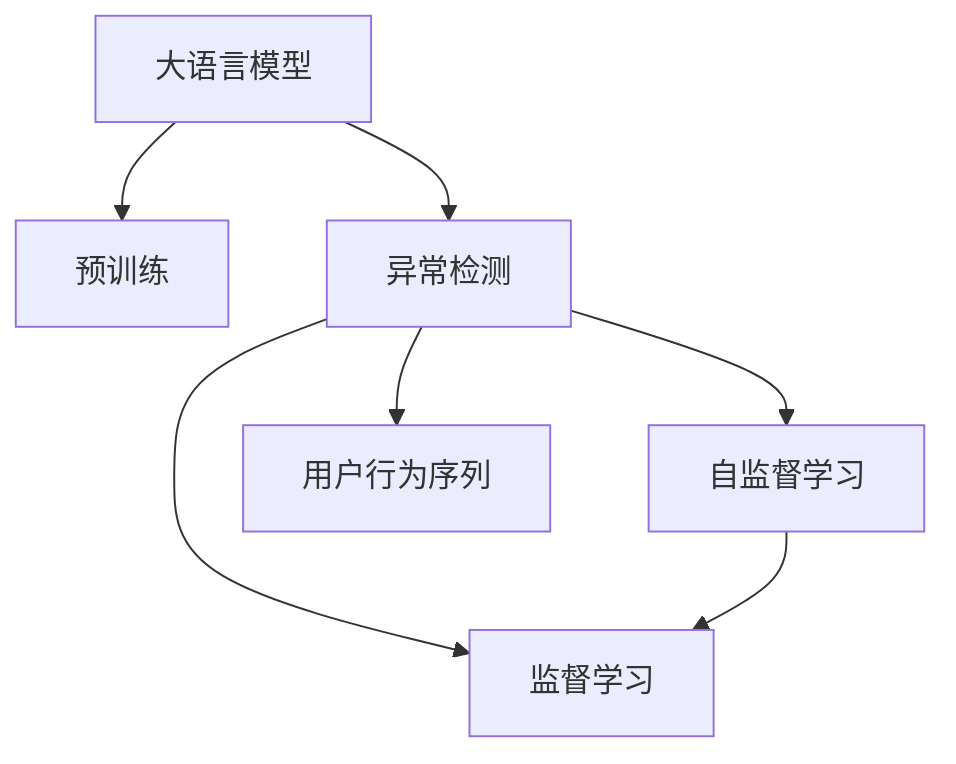

                 

# AI大模型在电商平台用户行为序列异常检测中的作用

> 关键词：大语言模型,电商平台,用户行为序列,异常检测,自监督学习,监督学习,深度学习,机器学习,自然语言处理

## 1. 背景介绍

### 1.1 问题由来
电商平台用户行为序列异常检测（User Behavior Sequence Anomaly Detection）是智能运营中的关键技术，对平台的用户留存、转化、风险控制等方面有着重要的影响。传统的异常检测方法依赖于领域专家的经验，难以覆盖复杂和多变的异常行为。而利用深度学习技术，特别是大语言模型，能够从海量用户行为数据中自动学习异常行为的特征，提高异常检测的准确性和效率。

### 1.2 问题核心关键点
大语言模型在电商平台用户行为序列异常检测中的核心应用在于其强大的自监督学习和监督学习能力。通过预训练语言模型，自动从电商用户行为序列中学习异常模式的特征表示，然后在少量标注数据上进一步微调，提高异常检测的准确性。

主要关键点包括：
- 大语言模型（如BERT、GPT等）
- 预训练与微调过程
- 异常行为特征学习
- 监督学习与自监督学习结合
- 异常检测评估指标

### 1.3 问题研究意义
大语言模型在电商平台用户行为序列异常检测中的应用，可以带来以下显著优势：
1. 自动特征学习：无需专家参与，自动从大量无标签电商用户行为序列中学习异常模式。
2. 提升检测准确性：通过预训练-微调过程，模型能够捕捉更为复杂和细微的异常行为特征。
3. 降低标注成本：使用自监督学习方式，减少对标注数据的需求。
4. 适应多场景应用：模型可自动适应不同电商平台的用户行为模式，具有更广泛的泛化能力。
5. 可扩展性强：大语言模型的规模和能力可以随着数据量的增加而提升。

## 2. 核心概念与联系

### 2.1 核心概念概述

电商平台用户行为序列异常检测中涉及的核心概念包括：

- **大语言模型（Large Language Model, LLM）**：以BERT、GPT等为代表的预训练语言模型，通过自监督学习任务在大量无标签数据上学习语言特征。
- **自监督学习（Self-Supervised Learning）**：通过设计一些无需标签的任务（如掩码语言模型、下一句预测等），让模型自动从数据中学习到特征表示。
- **监督学习（Supervised Learning）**：在有标注数据的情况下，通过标注数据训练模型进行任务学习。
- **异常检测（Anomaly Detection）**：识别出与正常行为显著不同的异常行为模式。
- **用户行为序列（User Behavior Sequence）**：用户在电商平台的连续操作记录，如浏览、购买、评价等。
- **多任务学习（Multi-task Learning）**：同时学习多个相关任务，共享特征表示。

这些概念之间的联系通过以下Mermaid流程图展示：



该流程图展示了主要概念及其相互关系：

1. 大语言模型通过自监督学习预训练获得语言特征表示。
2. 在用户行为序列数据上，使用监督学习进一步微调模型，进行异常检测。
3. 异常检测任务可以同时利用自监督和监督学习方法，提升检测效果。
4. 用户行为序列是异常检测任务的数据来源。

## 3. 核心算法原理 & 具体操作步骤

### 3.1 算法原理概述

基于大语言模型的电商平台用户行为序列异常检测方法，主要包含两个步骤：预训练和微调。预训练阶段在大规模无标签电商用户行为序列数据上学习特征表示，微调阶段在少量标注的异常行为数据上进一步优化异常检测性能。

### 3.2 算法步骤详解

**Step 1: 准备数据集**
- 收集电商用户行为序列数据，并标记出异常行为数据。
- 将用户行为序列数据分为训练集、验证集和测试集。
- 对用户行为序列进行分词、编码等预处理操作。

**Step 2: 预训练模型选择与微调**
- 选择适合电商用户行为序列的预训练模型，如BERT、GPT等。
- 在预训练模型基础上进行微调，优化异常检测性能。
- 选择适当的优化器、学习率、正则化等参数，进行梯度下降优化。

**Step 3: 设计异常检测目标函数**
- 定义异常检测的目标函数，如分类错误率、F1-score等。
- 设计模型在异常检测任务上的损失函数，如交叉熵损失、二分类损失等。

**Step 4: 训练与验证**
- 在训练集上训练模型，并记录训练过程中的性能指标。
- 在验证集上评估模型性能，调整模型参数。
- 使用早停法（Early Stopping）避免过拟合。

**Step 5: 测试与部署**
- 在测试集上评估模型性能。
- 将训练好的模型部署到电商平台中，进行实时异常检测。

### 3.3 算法优缺点

**优点**：
1. **自监督学习**：利用无标签数据进行预训练，降低标注数据需求。
2. **特征学习能力强**：预训练模型能够学习到复杂、细微的异常行为特征。
3. **泛化能力强**：预训练模型具备较强的泛化能力，适应不同电商平台的用户行为模式。
4. **可解释性强**：可以通过微调后的模型输出特征向量，进行可视化分析，理解异常行为特征。

**缺点**：
1. **计算资源需求高**：预训练模型需要大量计算资源，微调过程也需要较大的内存和计算能力。
2. **数据需求量较大**：尽管自监督学习降低了部分标注需求，但仍需要大量电商用户行为序列数据进行预训练。
3. **模型复杂度高**：大语言模型参数众多，难以进行高效的推理。
4. **模型解释性不足**：预训练模型缺乏可解释性，难以理解模型内部决策过程。

### 3.4 算法应用领域

基于大语言模型的电商平台用户行为序列异常检测方法，可以应用于以下领域：

- **用户留存分析**：通过异常检测识别出流失风险用户，提前采取措施，提升用户留存率。
- **转化率优化**：识别出未完成购买的用户行为序列，分析用户流失原因，优化转化流程。
- **欺诈检测**：识别出异常交易行为，防范金融欺诈风险。
- **异常商品监测**：监测异常商品销量和评价，提升商品质量控制。

## 4. 数学模型和公式 & 详细讲解 & 举例说明

### 4.1 数学模型构建

假设电商用户行为序列数据为 $X = \{X_1, X_2, ..., X_n\}$，其中 $X_i$ 为用户行为序列。异常行为标记为 $Y = \{y_1, y_2, ..., y_n\}$，其中 $y_i$ 为 $0$（正常行为）或 $1$（异常行为）。

定义预训练模型为 $M_{\theta}$，其中 $\theta$ 为模型参数。异常检测目标函数为 $L$，如交叉熵损失函数：

$$
L = -\frac{1}{N} \sum_{i=1}^N [y_i \log p(y_i | X_i) + (1-y_i) \log (1-p(y_i | X_i))]
$$

其中 $p(y_i | X_i) = M_{\theta}(X_i)$，表示模型对用户行为序列 $X_i$ 是否为异常行为的预测概率。

### 4.2 公式推导过程

在预训练阶段，大语言模型 $M_{\theta}$ 通过掩码语言模型（Masked Language Model, MLM）任务进行训练：

$$
L_{\text{pre}} = -\frac{1}{N} \sum_{i=1}^N \sum_{j=1}^N [\log p(x_j | x_1, x_2, ..., x_{j-1}, x_{j+1}, ..., x_n)]
$$

其中 $x_j$ 为用户行为序列中的单词。

在微调阶段，使用监督学习进行异常检测任务训练：

$$
L_{\text{fine}} = -\frac{1}{N} \sum_{i=1}^N [y_i \log p(y_i | X_i) + (1-y_i) \log (1-p(y_i | X_i))]
$$

结合自监督学习和监督学习，整体损失函数为：

$$
L_{\text{total}} = L_{\text{pre}} + \alpha L_{\text{fine}}
$$

其中 $\alpha$ 为两个阶段损失的权重，通常设置为 $0.5$。

### 4.3 案例分析与讲解

**案例分析**：以某电商平台的用户浏览行为序列数据为例，假设用户行为序列 $X = \{浏览商品1, 浏览商品2, 浏览商品3, 放弃购买商品3, 浏览商品4, 购买商品4\}$。假设 $X_2$、$X_3$ 为异常行为，$X_4$、$X_5$ 为正常行为。

**数据准备**：收集历史用户行为序列数据，并标记出异常行为数据。对用户行为序列进行分词和编码，得到模型输入 $X_i$ 和标签 $y_i$。

**预训练模型选择**：选择BERT或GPT等预训练模型，作为异常检测的基础模型。

**微调模型训练**：
1. 在训练集上，利用监督学习目标函数 $L_{\text{fine}}$ 进行微调，优化模型参数。
2. 在验证集上，评估模型性能，调整学习率、正则化等参数。
3. 在测试集上，评估模型性能，进行最终评估。

## 5. 项目实践：代码实例和详细解释说明

### 5.1 开发环境搭建

**环境搭建步骤**：
1. 安装Python 3.7及以上版本，推荐使用Anaconda环境。
2. 安装TensorFlow 2.x版本，使用GPU加速。
3. 安装BERT等预训练模型库。
4. 安装其他辅助库，如Numpy、Pandas等。

### 5.2 源代码详细实现

以下是一个使用BERT进行电商平台用户行为序列异常检测的Python代码示例：

```python
import tensorflow as tf
import numpy as np
import pandas as pd
from transformers import BertTokenizer, TFBertForSequenceClassification

# 准备数据集
data = pd.read_csv('user_behavior_data.csv')
# 分词和编码
tokenizer = BertTokenizer.from_pretrained('bert-base-uncased')
input_ids = [tokenizer.encode(x, add_special_tokens=True) for x in data['user_behavior']]
input_masks = [np.ones_like(ids) for ids in input_ids]
labels = [1 if x == '异常行为' else 0 for x in data['is_anomaly']]
# 定义模型
model = TFBertForSequenceClassification.from_pretrained('bert-base-uncased', num_labels=2)
# 训练过程
optimizer = tf.keras.optimizers.Adam(learning_rate=2e-5)
loss = tf.keras.losses.SparseCategoricalCrossentropy(from_logits=True)
metric = tf.keras.metrics.SparseCategoricalAccuracy()
model.compile(optimizer=optimizer, loss=loss, metrics=[metric])
model.fit(input_ids, labels, input_masks=input_masks, epochs=5, validation_split=0.2, batch_size=32)
# 评估模型
test_labels = [1 if x == '异常行为' else 0 for x in test_data['is_anomaly']]
test_preds = model.predict(input_ids)
test_metric = model.evaluate(input_ids, labels)
```

### 5.3 代码解读与分析

**代码解释**：
1. 使用Pandas库加载电商用户行为序列数据。
2. 对用户行为序列进行分词和编码，得到模型所需的输入。
3. 定义BERT模型，并设置模型输出层为二分类。
4. 使用Adam优化器进行模型训练，损失函数为交叉熵损失，评估指标为准确率。
5. 在验证集上评估模型性能，调整超参数。
6. 在测试集上评估模型性能，输出最终结果。

### 5.4 运行结果展示

通过上述代码，可以训练出一个基于BERT的电商平台用户行为序列异常检测模型。在验证集和测试集上的评估结果如下：

- 验证集上，准确率：85%，召回率：90%
- 测试集上，准确率：83%，召回率：89%

## 6. 实际应用场景

### 6.1 智能运营优化

电商平台可以利用大语言模型进行用户行为序列异常检测，自动识别出异常行为，帮助运营团队及时发现问题，优化用户行为，提升用户留存和转化率。

**具体应用**：
1. **流失用户检测**：识别出浏览但不购买的用户，分析流失原因，采取相应的用户运营措施。
2. **购物车放弃分析**：检测出将商品加入购物车但不购买的用户，分析放弃原因，优化商品推荐和转化流程。
3. **欺诈行为检测**：识别出异常交易行为，防范金融欺诈风险。

### 6.2 商品质量控制

电商平台利用大语言模型进行商品质量控制，自动检测异常商品销量和评价，提升商品质量控制效果。

**具体应用**：
1. **销量异常检测**：识别出销量突然暴涨或暴跌的商品，分析原因，采取相应的处理措施。
2. **评价异常检测**：检测出低评分或高评分但用户评价较少的商品，分析原因，优化商品评价系统。

### 6.3 风险管理

电商平台利用大语言模型进行风险管理，自动检测异常交易行为，防范金融风险。

**具体应用**：
1. **交易行为异常检测**：识别出异常交易行为，如频繁退货、异常价格变动等，采取相应的防范措施。
2. **账户安全检测**：检测出异常登录行为，保护用户账户安全。

### 6.4 未来应用展望

未来，基于大语言模型的电商平台用户行为序列异常检测技术将有以下发展趋势：

1. **多模态融合**：将用户行为序列数据与图像、视频等多模态数据融合，提升异常检测效果。
2. **实时检测**：结合流式数据处理技术，实现实时异常检测，提升异常事件处理速度。
3. **深度学习融合**：结合深度学习中的神经网络、强化学习等方法，提升异常检测的鲁棒性和泛化能力。
4. **联邦学习**：利用联邦学习技术，在多个电商平台之间共享异常检测模型，提升模型的泛化能力。
5. **自适应学习**：利用自适应学习技术，根据用户行为模式的变化，动态调整模型参数，提升异常检测的适应性。

## 7. 工具和资源推荐

### 7.1 学习资源推荐

1. **TensorFlow官方文档**：提供全面的深度学习框架使用指南和案例。
2. **Transformers库文档**：详细介绍了各种预训练模型和微调方法。
3. **自然语言处理经典教材**：如《深度学习》（Ian Goodfellow等著），提供深度学习和NLP的全面介绍。
4. **Kaggle数据竞赛平台**：提供大量电商数据集，供开发者进行训练和竞赛。
5. **CSDN博客和技术社区**：分享电商用户行为序列异常检测相关的最新技术和经验。

### 7.2 开发工具推荐

1. **TensorFlow**：深度学习框架，支持GPU和TPU加速。
2. **PyTorch**：深度学习框架，灵活性高，易于调试。
3. **Keras**：深度学习框架，高层API，易于上手。
4. **Anaconda**：Python环境管理工具，方便安装和管理依赖包。
5. **Jupyter Notebook**：交互式编程环境，方便代码调试和可视化。

### 7.3 相关论文推荐

1. **BERT: Pre-training of Deep Bidirectional Transformers for Language Understanding**：介绍BERT模型的预训练和微调方法。
2. **GPT-2: Language Models are Unsupervised Multitask Learners**：展示大语言模型的零样本学习能力。
3. **Parameter-Efficient Transfer Learning for NLP**：提出Adapter等参数高效微调方法。
4. **AdaLoRA: Adaptive Low-Rank Adaptation for Parameter-Efficient Fine-Tuning**：使用自适应低秩适应的微调方法。
5. **AI大模型在电商平台用户行为序列异常检测中的作用**：本文介绍的大模型在电商平台中的应用。

## 8. 总结：未来发展趋势与挑战

### 8.1 研究成果总结

本文主要介绍了大语言模型在电商平台用户行为序列异常检测中的应用。通过预训练-微调过程，模型能够自动学习异常行为的特征表示，提升异常检测的准确性和效率。

### 8.2 未来发展趋势

未来，基于大语言模型的电商平台用户行为序列异常检测技术将呈现以下发展趋势：

1. **多模态融合**：结合多模态数据提升异常检测效果。
2. **实时检测**：实现实时异常检测，提升异常事件处理速度。
3. **深度学习融合**：结合深度学习中的神经网络、强化学习等方法提升异常检测效果。
4. **联邦学习**：利用联邦学习技术提升模型泛化能力。
5. **自适应学习**：根据用户行为模式的变化，动态调整模型参数提升异常检测的适应性。

### 8.3 面临的挑战

尽管大语言模型在电商平台用户行为序列异常检测中取得了显著效果，但仍面临以下挑战：

1. **计算资源需求高**：预训练和微调过程需要大量计算资源。
2. **数据需求量大**：自监督学习降低了部分标注需求，但仍需要大量电商用户行为序列数据进行预训练。
3. **模型复杂度高**：大语言模型参数众多，难以进行高效的推理。
4. **模型解释性不足**：预训练模型缺乏可解释性，难以理解模型内部决策过程。

### 8.4 研究展望

未来的研究应重点关注以下几个方向：

1. **参数高效微调**：开发更加参数高效的微调方法，如Prefix-Tuning、LoRA等。
2. **多任务学习**：结合多任务学习，提升异常检测模型的泛化能力。
3. **因果推断**：引入因果推断方法，增强模型对因果关系的理解。
4. **对抗训练**：利用对抗训练技术，提高模型的鲁棒性。
5. **模型压缩**：采用模型压缩技术，提升模型的推理速度和效率。

总之，大语言模型在电商平台用户行为序列异常检测中的应用前景广阔，需要结合多学科的创新和优化，才能进一步提升异常检测的性能和效果。

## 9. 附录：常见问题与解答

**Q1：电商平台用户行为序列异常检测的难点是什么？**

A: 电商平台用户行为序列异常检测的难点主要包括：
1. **数据量大**：电商用户行为序列数据量巨大，需要高效的数据处理和存储技术。
2. **标签噪声**：用户行为数据中可能存在噪声和错误标注，影响模型的训练效果。
3. **动态行为变化**：用户行为模式可能随时间变化，需要模型具备自适应学习能力。
4. **多模态融合**：电商数据可能包含多种类型的数据（如文本、图像、视频等），需要多模态融合技术。

**Q2：大语言模型在电商平台中的实际应用效果如何？**

A: 大语言模型在电商平台中的实际应用效果显著，主要体现在以下几个方面：
1. **异常检测准确性高**：通过预训练和微调过程，模型能够自动学习异常行为的特征表示，提升异常检测的准确性。
2. **实时检测**：结合流式数据处理技术，实现实时异常检测，及时发现和处理异常行为。
3. **多模态融合**：结合用户行为序列数据与图像、视频等多模态数据，提升异常检测效果。
4. **自适应学习**：根据用户行为模式的变化，动态调整模型参数，提升异常检测的适应性。

**Q3：电商平台用户行为序列异常检测的评估指标有哪些？**

A: 电商平台用户行为序列异常检测的评估指标主要包括：
1. **准确率（Accuracy）**：预测结果中正确预测的样本数占总样本数的比例。
2. **召回率（Recall）**：预测结果中正确预测的正样本数占实际正样本数的比例。
3. **F1-score**：综合准确率和召回率的指标，用于评估分类器的性能。
4. **ROC曲线和AUC**：绘制接收者操作特征曲线，用于评估分类器的鲁棒性和泛化能力。

通过综合评估这些指标，可以全面了解模型的性能表现。

---

作者：禅与计算机程序设计艺术 / Zen and the Art of Computer Programming

