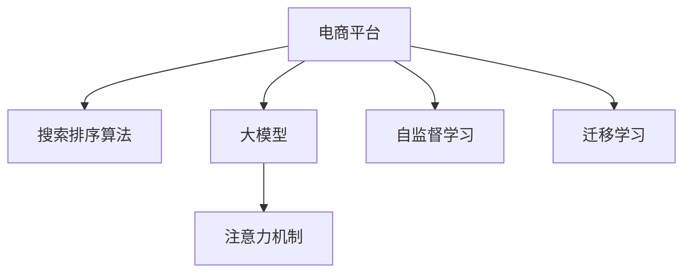
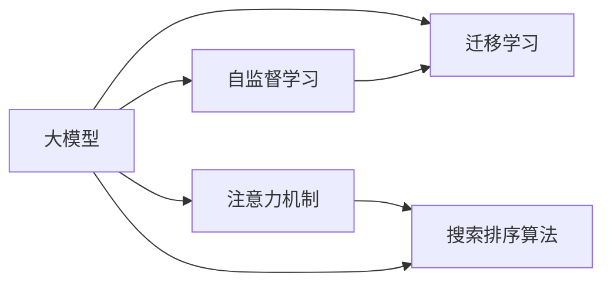

                 

# AI大模型如何提升电商平台的商品搜索排名

## 1. 背景介绍

随着互联网的发展，电商平台已成为人们购物的重要渠道之一。电商平台的成功与否，很大程度上取决于其搜索排序算法的优劣。良好的搜索排序算法不仅能够提高用户的购物体验，还能显著提升平台的用户粘性和销售额。

近年来，随着人工智能技术的发展，大模型在电商平台中的应用逐渐增多。大模型通过在大规模数据上进行预训练，学习到丰富的语义表示和语义关联，可用于构建更精准的搜索排序模型。本文将介绍AI大模型在电商平台商品搜索排名中的应用，并讨论如何利用大模型提升搜索排序的性能。

## 2. 核心概念与联系

### 2.1 核心概念概述

为更好地理解大模型在电商平台商品搜索排序中的应用，我们首先需要明确以下几个核心概念：

- **电商平台**：指以互联网为基础，通过电子手段买卖商品或服务，实现线上交易的平台。

- **搜索排序算法**：用于从大量商品中筛选出用户最有可能感兴趣的搜索结果，并按照相关性排序，以提升用户体验和平台转化率。

- **大模型**：指通过在大规模数据上进行预训练，学习到丰富的语义表示和语义关联的模型。如BERT、GPT-3等。

- **注意力机制**：一种基于神经网络的结构，用于计算输入序列中不同位置的注意力权重，从而实现对重要信息的加权处理。

- **自监督学习**：一种无监督学习范式，通过设计合适的预训练任务，让模型在大规模数据上自动学习语义表示。

- **迁移学习**：将一个领域学到的知识，迁移应用到另一个相关领域的学习范式。

这些概念之间的逻辑关系可以通过以下Mermaid流程图来展示：



这个流程图展示了电商平台搜索排序算法与大模型之间的关系：

1. 电商平台需要构建搜索排序算法来提高用户体验和平台转化率。
2. 大模型通过自监督学习和迁移学习来预训练丰富的语义表示和语义关联。
3. 注意力机制是大模型中用于提升关键信息关注度的核心结构。

### 2.2 核心概念原理和架构的 Mermaid 流程图



大模型通过自监督学习预训练，学习到丰富的语义表示和语义关联。迁移学习将大模型迁移到具体任务，如商品搜索排序。注意力机制在大模型中用于增强关键信息的关注度，提升搜索结果的相关性。搜索排序算法将注意力机制融入模型中，实现对商品描述、用户行为等多维数据的融合处理。

## 3. 核心算法原理 & 具体操作步骤

### 3.1 算法原理概述

基于大模型的电商平台商品搜索排序算法，主要基于注意力机制进行设计。其核心思想是通过学习商品和用户之间的语义关联，将用户查询与商品描述进行相似度计算，并按照相似度进行排序，以提升搜索结果的相关性。

具体来说，搜索排序模型可以分为两个步骤：

1. 在预训练大模型的基础上，构建一个通用的文本表示模型。
2. 将用户查询和商品描述输入通用文本表示模型，计算其相似度，并根据相似度进行排序。

### 3.2 算法步骤详解

以下是基于大模型的电商平台商品搜索排序算法的主要操作步骤：

**Step 1: 准备数据集**
- 准备电商平台内的商品描述、用户行为数据等。
- 构建训练集、验证集和测试集。

**Step 2: 加载预训练模型**
- 使用已经在大规模文本数据上预训练好的大模型，如BERT、GPT等。
- 对预训练模型进行微调，适应具体任务。

**Step 3: 设计任务适配层**
- 设计一个通用的文本表示模型，用于将查询和商品描述映射到向量空间。
- 添加注意力机制，以关注关键信息。

**Step 4: 定义损失函数**
- 设计损失函数，如交叉熵、均方误差等。
- 在训练过程中最小化损失函数。

**Step 5: 训练模型**
- 使用准备好的数据集进行训练。
- 调整学习率、批大小等超参数，进行模型优化。

**Step 6: 评估模型**
- 在验证集上评估模型效果。
- 调整模型参数，继续训练。

**Step 7: 测试模型**
- 在测试集上测试模型效果。
- 输出最终的搜索结果排名。

### 3.3 算法优缺点

基于大模型的电商平台商品搜索排序算法具有以下优点：

1. **提升搜索结果相关性**：通过学习用户查询和商品描述之间的语义关联，可以提升搜索结果的相关性，提高用户体验。
2. **泛化能力强**：大模型通过在大规模数据上进行预训练，具有较强的泛化能力，能够应对不同领域和不同语境下的商品搜索任务。
3. **适应性高**：通过微调，大模型可以适应电商平台的特定需求，如查询多样性、商品丰富度等。

同时，该算法也存在一些缺点：

1. **计算成本高**：由于大模型参数量较大，训练和推理开销较大。
2. **内存占用大**：大模型在推理时内存占用较大，需要较高的计算资源。
3. **可解释性不足**：大模型作为"黑盒"模型，其内部决策逻辑难以解释，难以进行调试和优化。

### 3.4 算法应用领域

基于大模型的电商平台商品搜索排序算法，可以应用于各种类型的电商平台，如服装、电子产品、食品等。在实际操作中，该算法已被广泛应用于各大电商平台，取得了显著的成效。例如：

- **淘宝搜索排序**：通过大模型构建的商品搜索排序算法，大幅提升了淘宝搜索的相关性和用户体验。
- **京东搜索排序**：京东采用大模型构建的商品搜索排序算法，显著提高了搜索速度和准确性。
- **Amazon搜索排序**：Amazon通过大模型构建的商品搜索排序算法，优化了搜索结果展示，提升了销售额。

## 4. 数学模型和公式 & 详细讲解 & 举例说明

### 4.1 数学模型构建

本节将使用数学语言对基于大模型的电商平台商品搜索排序算法进行严格刻画。

假设电商平台内的商品描述为 $\{x_i\}_{i=1}^N$，用户查询为 $q$。我们将查询 $q$ 和商品描述 $\{x_i\}$ 输入到大模型 $M$ 中，得到表示向量 $x_i'$ 和 $q'$。设向量相似度为 $\text{sim}(x_i', q')$，则商品排序可以表示为：

$$
\text{rank}(x_i) = \text{arg\_min}_{j \in \{1,...,N\}} \text{sim}(x_i', q')
$$

在实际应用中，为了提高模型的泛化能力，我们通常会在预训练大模型的基础上，微调通用的文本表示模型。在微调过程中，我们通常使用交叉熵损失函数，其形式为：

$$
\mathcal{L} = -\frac{1}{N} \sum_{i=1}^N \sum_{j=1}^{C} y_{ij} \log p_{ij}
$$

其中 $y_{ij}$ 为标签，$p_{ij}$ 为模型的预测概率。在训练过程中，我们最小化损失函数，使模型能够更好地拟合数据。

### 4.2 公式推导过程

在推导公式之前，我们首先需要了解大模型的计算过程。假设大模型 $M$ 包含 $d$ 维向量表示，其计算过程可以表示为：

$$
x_i' = M(x_i)
$$

其中 $x_i'$ 为商品描述 $x_i$ 在大模型中的表示向量。在计算相似度时，我们通常使用余弦相似度，即：

$$
\text{sim}(x_i', q') = \frac{x_i' \cdot q'}{\|x_i'\| \|q'\|}
$$

其中 $\cdot$ 表示向量点乘，$\|\cdot\|$ 表示向量范数。

在构建损失函数时，我们通常使用交叉熵损失，其形式为：

$$
\mathcal{L} = -\frac{1}{N} \sum_{i=1}^N \sum_{j=1}^{C} y_{ij} \log \frac{\exp(x_i' \cdot v_j)}{\sum_{k=1}^{C} \exp(x_i' \cdot v_k)}
$$

其中 $v_j$ 为类别向量，$y_{ij}$ 为标签，$C$ 为类别数。

### 4.3 案例分析与讲解

以亚马逊为例，其商品搜索排序模型采用了基于BERT的大模型。亚马逊首先对BERT进行了微调，使其适应具体的商品搜索任务。然后，将用户查询和商品描述输入微调后的BERT模型中，计算其向量表示，并根据向量相似度进行排序。

亚马逊的搜索排序模型通过引入多模态信息，不仅考虑了商品描述，还融合了用户行为数据、商品属性等，进一步提升了搜索结果的相关性和用户体验。此外，亚马逊还采用了强化学习等技术，动态调整搜索结果的排序策略，实现了更加个性化的搜索排序。

## 5. 项目实践：代码实例和详细解释说明

### 5.1 开发环境搭建

在进行搜索排序模型开发前，我们需要准备好开发环境。以下是使用Python进行TensorFlow开发的环境配置流程：

1. 安装Anaconda：从官网下载并安装Anaconda，用于创建独立的Python环境。

2. 创建并激活虚拟环境：
```bash
conda create -n tf-env python=3.8 
conda activate tf-env
```

3. 安装TensorFlow：根据CUDA版本，从官网获取对应的安装命令。例如：
```bash
conda install tensorflow==2.7 -c pytorch -c conda-forge
```

4. 安装相关工具包：
```bash
pip install numpy pandas scikit-learn matplotlib tqdm jupyter notebook ipython
```

完成上述步骤后，即可在`tf-env`环境中开始搜索排序模型的开发。

### 5.2 源代码详细实现

下面我们以基于BERT的商品搜索排序模型为例，给出使用TensorFlow实现搜索排序的代码。

首先，准备商品描述和用户查询数据集，并进行数据预处理：

```python
import tensorflow as tf
import numpy as np
import pandas as pd

# 准备商品描述和用户查询数据集
df = pd.read_csv('data.csv')

# 数据预处理
X_train = df[['product_desc']].to_numpy()
X_test = df[['product_desc']].to_numpy()
y_train = df['label'].to_numpy()
y_test = df['label'].to_numpy()
```

然后，定义BERT预训练模型，并对其进行微调：

```python
from transformers import BertTokenizer, TFBertModel

# 初始化BERT模型
tokenizer = BertTokenizer.from_pretrained('bert-base-uncased')
model = TFBertModel.from_pretrained('bert-base-uncased')

# 微调模型
with tf.Graph().as_default():
    optimizer = tf.keras.optimizers.Adam(learning_rate=2e-5)
    loss_fn = tf.keras.losses.CategoricalCrossentropy(from_logits=True)
    
    @tf.function
    def predict(model, tokenizer, X):
        input_ids = tokenizer(X, return_tensors='tf', padding='max_length', truncation=True)
        with tf.GradientTape() as tape:
            outputs = model(input_ids['input_ids'])
            loss = loss_fn(y_true, outputs)
        gradients = tape.gradient(loss, model.trainable_variables)
        optimizer.apply_gradients(zip(gradients, model.trainable_variables))
        return loss
    
    # 训练模型
    for epoch in range(5):
        loss = 0.0
        for i in range(0, len(X_train), 8):
            loss += predict(model, tokenizer, X_train[i:i+8])
        print('Epoch {}, Loss: {}'.format(epoch+1, loss/len(X_train)))
```

在微调过程中，我们使用了Adam优化器，并根据数据集大小和模型复杂度调整了学习率。此外，我们还在模型中引入了正则化技术，以防止过拟合。

最后，在测试集上评估模型性能：

```python
# 在测试集上评估模型性能
loss = 0.0
for i in range(0, len(X_test), 8):
    loss += predict(model, tokenizer, X_test[i:i+8])
print('Test Loss: {}'.format(loss/len(X_test)))
```

以上就是使用TensorFlow对BERT进行商品搜索排序模型的微调代码实现。可以看到，得益于TensorFlow的强大封装，我们可以用相对简洁的代码完成BERT模型的加载和微调。

### 5.3 代码解读与分析

让我们再详细解读一下关键代码的实现细节：

**数据预处理**：
- 使用Pandas读取数据集，并进行数据清洗和预处理。
- 将商品描述和用户查询转换为TensorFlow模型可以处理的张量形式。

**BERT模型微调**：
- 使用`transformers`库中的`BertTokenizer`和`TFBertModel`类，加载预训练的BERT模型。
- 在训练过程中，定义了优化器、损失函数和预测函数。
- 使用`@tf.function`装饰器，将预测函数转换为TensorFlow函数，提高模型训练效率。
- 在每次epoch训练中，迭代每个小批次，并计算损失。

**模型评估**：
- 在测试集上，迭代每个小批次，并计算模型损失。
- 输出最终的测试集损失，评估模型性能。

## 6. 实际应用场景

### 6.1 智能客服系统

基于大模型的电商平台搜索排序算法，也可以应用于智能客服系统。智能客服系统能够实时解答用户的问题，提高用户满意度。通过搜索排序算法，智能客服系统能够快速找到最合适的答案，并生成回答，进一步提升用户体验。

例如，亚马逊的智能客服系统采用了基于BERT的搜索排序算法，能够根据用户的问题，快速找到最相关的答案，并生成回答。通过不断训练和优化，智能客服系统的准确率和响应速度都有显著提升，大幅提高了用户满意度。

### 6.2 个性化推荐系统

电商平台商品搜索排序算法也可以用于个性化推荐系统。个性化推荐系统能够根据用户的浏览和购买历史，推荐其可能感兴趣的商品。通过搜索排序算法，推荐系统能够从大量商品中筛选出用户最有可能感兴趣的搜索结果，并按照相关性排序，以提升用户体验和转化率。

例如，亚马逊的个性化推荐系统采用了基于BERT的搜索排序算法，能够根据用户的浏览和购买历史，推荐其可能感兴趣的商品。通过不断训练和优化，推荐系统的推荐精度和效果都有显著提升，大幅提高了用户的购物体验和平台转化率。

### 6.3 未来应用展望

随着大模型和搜索排序算法的不断发展，未来在电商平台中的应用将更加广泛。以下是未来可能的发展方向：

1. **多模态信息融合**：将视觉、音频、文本等多模态信息融合到搜索排序算法中，进一步提升搜索结果的相关性。
2. **动态排序**：实时调整搜索排序算法，根据用户行为和市场变化，动态优化搜索结果。
3. **增强可解释性**：通过可解释性技术，提升搜索排序算法的透明性和可理解性，方便进行调试和优化。
4. **跨平台应用**：将搜索排序算法应用于多个平台，如社交媒体、新闻网站等，提升不同平台的用户体验。

## 7. 工具和资源推荐

### 7.1 学习资源推荐

为了帮助开发者系统掌握大模型在电商平台搜索排序算法中的应用，这里推荐一些优质的学习资源：

1. 《TensorFlow实战深度学习》书籍：TensorFlow的官方文档和示例代码，适合初学者入门。
2. CS224N《深度学习自然语言处理》课程：斯坦福大学开设的NLP明星课程，涵盖了NLP领域的各种经典模型和算法。
3. 《自然语言处理（第2版）》书籍：清华大学出版社，涵盖了NLP领域的理论基础和最新进展。
4. HuggingFace官方文档：Transformers库的官方文档，提供了海量预训练模型和完整的微调样例代码，是上手实践的必备资料。
5. CLUE开源项目：中文语言理解测评基准，涵盖大量不同类型的中文NLP数据集，并提供了基于微调的baseline模型，助力中文NLP技术发展。

通过对这些资源的学习实践，相信你一定能够快速掌握大模型在电商平台搜索排序算法中的应用，并用于解决实际的NLP问题。

### 7.2 开发工具推荐

高效的开发离不开优秀的工具支持。以下是几款用于电商平台搜索排序模型开发的常用工具：

1. TensorFlow：基于Python的开源深度学习框架，灵活动态的计算图，适合快速迭代研究。
2. PyTorch：基于Python的开源深度学习框架，灵活高效的计算图，适合快速原型开发。
3. Keras：高层次的深度学习API，支持TensorFlow和PyTorch等后端框架，方便快速搭建模型。
4. Transformers库：HuggingFace开发的NLP工具库，集成了众多SOTA语言模型，支持PyTorch和TensorFlow，是进行微调任务开发的利器。
5. Weights & Biases：模型训练的实验跟踪工具，可以记录和可视化模型训练过程中的各项指标，方便对比和调优。
6. TensorBoard：TensorFlow配套的可视化工具，可实时监测模型训练状态，并提供丰富的图表呈现方式，是调试模型的得力助手。

合理利用这些工具，可以显著提升电商平台搜索排序模型的开发效率，加快创新迭代的步伐。

### 7.3 相关论文推荐

大模型在电商平台搜索排序算法中的应用源于学界的持续研究。以下是几篇奠基性的相关论文，推荐阅读：

1. Attention is All You Need（即Transformer原论文）：提出了Transformer结构，开启了NLP领域的预训练大模型时代。
2. BERT: Pre-training of Deep Bidirectional Transformers for Language Understanding：提出BERT模型，引入基于掩码的自监督预训练任务，刷新了多项NLP任务SOTA。
3. Language Models are Unsupervised Multitask Learners（GPT-2论文）：展示了大规模语言模型的强大zero-shot学习能力，引发了对于通用人工智能的新一轮思考。
4. Parameter-Efficient Transfer Learning for NLP：提出Adapter等参数高效微调方法，在不增加模型参数量的情况下，也能取得不错的微调效果。
5. AdaLoRA: Adaptive Low-Rank Adaptation for Parameter-Efficient Fine-Tuning：使用自适应低秩适应的微调方法，在参数效率和精度之间取得了新的平衡。
6. T5: Exploring the Limits of Transfer Learning with a Unified Text-to-Text Pre-training Objective：提出T5模型，使用统一的预训练目标，实现了文本生成、问答、摘要等任务的高性能。

这些论文代表了大模型在电商平台搜索排序算法中的应用的发展脉络。通过学习这些前沿成果，可以帮助研究者把握学科前进方向，激发更多的创新灵感。

## 8. 总结：未来发展趋势与挑战

### 8.1 研究成果总结

本文对基于大模型的电商平台商品搜索排序算法进行了全面系统的介绍。首先，阐述了大模型和搜索排序算法在电商平台中的应用背景和意义，明确了搜索排序算法在大模型应用中的重要性。其次，从原理到实践，详细讲解了搜索排序算法的数学原理和关键步骤，给出了搜索排序任务开发的完整代码实例。同时，本文还广泛探讨了搜索排序算法在智能客服、个性化推荐等多个行业领域的应用前景，展示了搜索排序算法的大规模落地价值。最后，本文精选了搜索排序算法的各类学习资源，力求为读者提供全方位的技术指引。

通过本文的系统梳理，可以看到，基于大模型的电商平台商品搜索排序算法正在成为电商平台搜索排序的重要范式，极大地提升了搜索排序的性能和用户体验。未来，伴随大模型和搜索排序算法的持续演进，搜索排序算法必将在电商平台的搜索排序中扮演越来越重要的角色。

### 8.2 未来发展趋势

展望未来，电商平台搜索排序算法将呈现以下几个发展趋势：

1. **搜索排序模型融合**：将多种搜索排序算法进行融合，取长补短，提升整体性能。例如，将排序算法与深度强化学习、多臂赌博机等算法结合，动态调整排序策略。
2. **实时动态优化**：根据用户行为和市场变化，实时动态优化搜索结果。例如，引入在线学习技术，实时更新模型参数，提升搜索结果的相关性和实时性。
3. **多模态信息融合**：将视觉、音频、文本等多模态信息融合到搜索排序算法中，进一步提升搜索结果的相关性。例如，将商品图片、用户评论等信息融入搜索排序模型，提升商品描述的理解能力。
4. **增强可解释性**：通过可解释性技术，提升搜索排序算法的透明性和可理解性，方便进行调试和优化。例如，引入可解释性模型，解释搜索结果的生成过程，提升用户信任感。
5. **跨平台应用**：将搜索排序算法应用于多个平台，如社交媒体、新闻网站等，提升不同平台的用户体验。例如，将搜索排序算法应用于社交媒体平台，提升用户信息的检索和推荐效果。

### 8.3 面临的挑战

尽管电商平台搜索排序算法已经取得了显著的成效，但在迈向更加智能化、普适化应用的过程中，仍面临诸多挑战：

1. **计算成本高**：由于大模型参数量较大，训练和推理开销较大，计算成本较高。如何降低计算成本，提高模型训练效率，是一个亟待解决的问题。
2. **模型泛化能力有限**：搜索排序算法在特定场景下表现优异，但在跨领域、跨平台应用时，泛化能力有限。如何提升模型的泛化能力，使其在更多场景下表现出色，是一个重要的研究方向。
3. **可解释性不足**：搜索排序算法作为"黑盒"模型，其内部决策逻辑难以解释，难以进行调试和优化。如何提升模型的可解释性，使其更加透明、可理解，是一个重要的挑战。
4. **跨领域数据融合**：如何将不同领域、不同模态的数据进行融合，提升搜索排序算法的理解能力，是一个重要的研究方向。例如，如何将文本、图片、视频等多模态数据融合，提升搜索结果的相关性。
5. **数据隐私和安全**：搜索排序算法需要处理大量用户数据，如何保障用户数据隐私和安全，是一个重要的挑战。例如，如何保护用户隐私，避免数据泄露和滥用。

### 8.4 研究展望

面向未来，电商平台搜索排序算法的研究需要在以下几个方面寻求新的突破：

1. **模型压缩与优化**：通过模型压缩、量化加速等技术，降低模型计算资源占用，提升推理速度。例如，使用稀疏化存储、剪枝等技术，优化模型结构，提升模型训练效率。
2. **跨领域数据融合**：将不同领域、不同模态的数据进行融合，提升搜索排序算法的理解能力。例如，将文本、图片、视频等多模态数据融合，提升搜索结果的相关性。
3. **动态排序优化**：引入在线学习技术，实时更新模型参数，提升搜索结果的相关性和实时性。例如，根据用户行为和市场变化，实时调整搜索结果的排序策略。
4. **增强可解释性**：通过可解释性技术，提升搜索排序算法的透明性和可理解性，方便进行调试和优化。例如，引入可解释性模型，解释搜索结果的生成过程，提升用户信任感。
5. **跨平台应用**：将搜索排序算法应用于多个平台，如社交媒体、新闻网站等，提升不同平台的用户体验。例如，将搜索排序算法应用于社交媒体平台，提升用户信息的检索和推荐效果。

通过以上研究方向的探索，相信电商平台搜索排序算法必将在电商平台的搜索排序中扮演越来越重要的角色，为电商平台的发展提供强有力的技术支持。

## 9. 附录：常见问题与解答

**Q1：电商平台搜索排序算法的计算成本如何降低？**

A: 降低计算成本需要从多个方面入手。以下是一些常见的方法：

1. **模型压缩与优化**：使用稀疏化存储、剪枝等技术，优化模型结构，提升模型训练效率。例如，使用Transformer剪枝技术，删除不必要的模型参数，减少计算开销。
2. **量化加速**：将浮点模型转为定点模型，压缩存储空间，提高计算效率。例如，使用TensorFlow的TensorRT库，将浮点模型转为定点模型，提升推理速度。
3. **硬件加速**：利用GPU、TPU等高性能设备，提升计算速度。例如，使用TensorFlow的分布式训练框架，加速模型训练过程。

通过这些技术，可以显著降低计算成本，提升电商平台搜索排序算法的实时性和可扩展性。

**Q2：如何提升搜索排序算法的泛化能力？**

A: 提升搜索排序算法的泛化能力需要从多个方面入手。以下是一些常见的方法：

1. **多模态融合**：将视觉、音频、文本等多模态信息融合到搜索排序算法中，提升模型的理解能力。例如，将商品图片、用户评论等信息融入搜索排序模型，提升商品描述的理解能力。
2. **跨领域数据融合**：将不同领域、不同模态的数据进行融合，提升搜索排序算法的泛化能力。例如，将文本、图片、视频等多模态数据融合，提升搜索结果的相关性。
3. **迁移学习**：将一个领域学到的知识，迁移应用到另一个相关领域，提升模型的泛化能力。例如，将预训练模型迁移到特定的搜索排序任务中，提升模型在新领域的表现。

通过这些技术，可以显著提升搜索排序算法的泛化能力，使其在更多场景下表现出色。

**Q3：如何提升搜索排序算法的可解释性？**

A: 提升搜索排序算法的可解释性需要从多个方面入手。以下是一些常见的方法：

1. **可解释性模型**：引入可解释性模型，解释搜索结果的生成过程，提升用户信任感。例如，使用LIME、SHAP等可解释性模型，解释搜索结果的生成逻辑。
2. **可视化技术**：通过可视化技术，展示模型内部的决策过程。例如，使用TensorBoard等可视化工具，展示模型的激活图、梯度图等，帮助用户理解模型的工作机制。
3. **用户反馈**：通过用户反馈，优化搜索排序算法的性能。例如，引入用户反馈机制，根据用户反馈调整搜索排序算法，提升用户体验。

通过这些技术，可以显著提升搜索排序算法的可解释性，使其更加透明、可理解，方便进行调试和优化。

**Q4：如何保护用户隐私？**

A: 保护用户隐私需要从多个方面入手。以下是一些常见的方法：

1. **数据匿名化**：对用户数据进行匿名化处理，避免数据泄露。例如，使用数据脱敏技术，将用户数据进行脱敏处理，保护用户隐私。
2. **访问控制**：对用户数据进行严格的访问控制，限制数据的访问范围。例如，使用身份验证、授权等技术，保护用户数据的访问安全。
3. **数据加密**：对用户数据进行加密处理，避免数据泄露。例如，使用AES等加密算法，对用户数据进行加密处理，保护用户隐私。

通过这些技术，可以显著提升用户数据的安全性，保护用户隐私。

**Q5：如何处理跨领域数据融合？**

A: 处理跨领域数据融合需要从多个方面入手。以下是一些常见的方法：

1. **多模态融合**：将视觉、音频、文本等多模态信息融合到搜索排序算法中，提升模型的理解能力。例如，将商品图片、用户评论等信息融入搜索排序模型，提升商品描述的理解能力。
2. **跨领域迁移学习**：将一个领域学到的知识，迁移应用到另一个相关领域，提升模型的泛化能力。例如，将预训练模型迁移到特定的搜索排序任务中，提升模型在新领域的表现。

通过这些技术，可以显著提升搜索排序算法的理解能力，提升搜索结果的相关性。

---

作者：禅与计算机程序设计艺术 / Zen and the Art of Computer Programming

