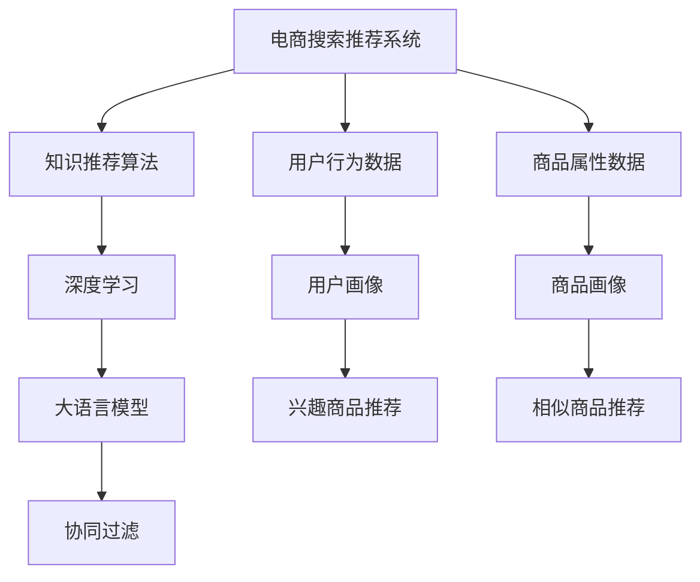

                 

# AI大模型视角下电商搜索推荐的技术创新知识推荐算法性能评测

> 关键词：AI大模型,知识推荐算法,电商搜索,性能评测,深度学习,协同过滤,内容推荐

## 1. 背景介绍

### 1.1 问题由来
随着电商行业的快速发展，电商搜索推荐系统成为了用户在电商平台上选购商品的重要决策工具。传统的电商搜索推荐算法大多依赖于用户历史行为数据和商品属性信息，存在用户行为冷启动、商品多样性不足、个性化推荐效果不佳等问题。

为了提升电商搜索推荐系统的用户体验和精准度，越来越多的电商企业开始引入大语言模型和知识图谱等前沿AI技术，以期借助大模型的泛化能力，构建更加智能、高效的推荐系统。

本文旨在通过AI大模型视角，从算法原理、模型设计、性能评测等多个角度，详细剖析电商搜索推荐系统中的知识推荐算法，并对其性能进行全面评测，为电商搜索推荐系统的技术创新提供指导。

### 1.2 问题核心关键点
本文将主要关注以下几个核心关键点：

- **算法原理**：介绍知识推荐算法的基本原理和核心组件。
- **模型设计**：分析深度学习模型在知识推荐中的应用及优化策略。
- **性能评测**：对比不同推荐算法在电商搜索推荐场景中的表现，提供详尽的评测数据。
- **应用实践**：结合实际电商搜索推荐系统，展示知识推荐算法的设计与部署。

## 2. 核心概念与联系

### 2.1 核心概念概述

在探讨知识推荐算法之前，我们先简要介绍几个核心概念及其相互联系：

- **电商搜索推荐系统**：指通过分析用户行为和商品属性，自动推荐适合用户浏览和购买的商品的系统。
- **知识推荐算法**：指结合知识图谱、语义网络等知识表示形式，提高推荐系统精准度和多样性的算法。
- **大语言模型**：指通过大规模无监督学习，具有广泛语言理解和生成的能力，如BERT、GPT等。
- **协同过滤**：指通过用户-用户或商品-商品间的相似性，推荐与用户或商品兴趣相类似的商品。
- **深度学习**：指利用多层神经网络进行复杂非线性拟合的机器学习技术，广泛应用于推荐系统。

这些概念通过一系列的技术流程连接起来，共同构成电商搜索推荐系统。下面通过Mermaid流程图展示它们之间的联系：



这个图展示了电商搜索推荐系统的大致流程：首先收集用户行为数据和商品属性数据，构建用户和商品的画像；然后通过知识推荐算法和深度学习模型，结合大语言模型的语义理解能力，进行商品推荐；最后应用协同过滤技术，进一步提升推荐精度。

## 3. 核心算法原理 & 具体操作步骤

### 3.1 算法原理概述

知识推荐算法融合了用户画像、商品画像和知识图谱，通过多维度信息挖掘和深度学习模型，提升推荐系统的准确性和多样性。其核心思想在于：

1. **用户画像构建**：利用用户行为数据，通过协同过滤、深度学习等方法，构建用户兴趣和偏好的综合画像。
2. **商品画像构建**：通过商品属性数据、语义表示和知识图谱，构建商品的全面画像。
3. **知识图谱融合**：将用户画像和商品画像嵌入到知识图谱中，通过图神经网络等深度学习模型，进行协同推荐和个性化推荐。
4. **协同过滤推荐**：通过用户-用户或商品-商品的相似度计算，推荐与用户或商品兴趣相类似的商品。

### 3.2 算法步骤详解

基于上述原理，知识推荐算法的步骤可以分为以下几个部分：

**Step 1: 数据预处理**
- 收集用户行为数据，包括点击、浏览、收藏、购买等行为。
- 收集商品属性数据，如标题、描述、类别等。
- 构建知识图谱，包含商品之间的语义关系，如属性、类别、品牌等。

**Step 2: 用户画像构建**
- 通过协同过滤或深度学习算法，提取用户行为数据中的兴趣点，生成用户兴趣向量。
- 使用大语言模型，对用户历史行为进行语义分析，生成用户兴趣描述。
- 将兴趣向量与兴趣描述结合，生成用户画像。

**Step 3: 商品画像构建**
- 提取商品属性数据，生成商品特征向量。
- 利用知识图谱，对商品进行语义扩展，生成商品语义向量。
- 将特征向量和语义向量结合，生成商品画像。

**Step 4: 知识图谱融合**
- 将用户画像和商品画像嵌入到知识图谱中。
- 应用图神经网络（如GNN），计算用户和商品之间的协同相似度。
- 根据相似度，进行协同推荐。

**Step 5: 协同过滤推荐**
- 计算用户和商品的相似度，推荐与用户兴趣相类似的商品。
- 结合知识图谱融合结果，进行个性化推荐。

**Step 6: 推荐结果输出**
- 将推荐结果展示给用户。
- 持续收集用户反馈，更新用户画像和商品画像，提升推荐效果。

### 3.3 算法优缺点

知识推荐算法具有以下优点：
1. **结合多维度信息**：通过用户画像、商品画像和知识图谱，提升推荐系统的多样性和精准度。
2. **提升用户满意度**：通过个性化推荐，满足用户特定需求，提升用户体验。
3. **减少用户行为冷启动问题**：利用知识图谱和语义扩展，缓解用户行为数据不足的问题。

同时，该算法也存在一定的局限性：
1. **复杂度较高**：知识图谱和深度学习模型的构建复杂，需要大量时间和计算资源。
2. **数据需求量大**：需要收集用户行为数据、商品属性数据和知识图谱数据，数据量庞大且质量要求高。
3. **推荐效果不稳定**：用户画像和商品画像的构建依赖于数据质量，噪声数据可能影响推荐结果。

### 3.4 算法应用领域

知识推荐算法不仅适用于电商搜索推荐系统，还广泛应用于社交网络、新闻推荐、视频推荐等多个领域。例如：

- **社交网络**：推荐与用户兴趣相类似的动态内容，如朋友圈、微博等。
- **新闻推荐**：推荐与用户兴趣相关的新闻文章，如今日头条、网易新闻等。
- **视频推荐**：推荐与用户兴趣相关的视频内容，如抖音、YouTube等。

## 4. 数学模型和公式 & 详细讲解 & 举例说明

### 4.1 数学模型构建

知识推荐算法的数学模型主要包括用户画像、商品画像和知识图谱的构建，以及协同推荐模型的训练和评估。下面我们将分别介绍这些模型的数学构建。

#### 用户画像构建
用户画像由用户兴趣向量 $u$ 和兴趣描述 $d$ 构成，其中 $u$ 为稠密向量，$d$ 为稀疏向量。用户兴趣向量 $u$ 可以通过协同过滤或深度学习模型训练得到，其表示用户对不同商品的兴趣程度。兴趣描述 $d$ 由大语言模型生成，用于捕捉用户的隐式兴趣。用户画像 $U$ 可以表示为：

$$
U = (u, d)
$$

#### 商品画像构建
商品画像由商品特征向量 $i$ 和语义向量 $s$ 构成，其中 $i$ 为稠密向量，$s$ 为稀疏向量。商品特征向量 $i$ 由商品属性数据和行为数据共同生成，表示商品的基本属性特征。语义向量 $s$ 通过知识图谱扩展，表示商品的语义信息。商品画像 $I$ 可以表示为：

$$
I = (i, s)
$$

#### 知识图谱融合
知识图谱融合通过图神经网络（GNN）实现。设知识图谱 $G$ 由节点和边组成，节点表示商品或用户，边表示语义关系。知识图谱的嵌入表示为 $\text{Embed}_{G}$，融合后的用户画像和商品画像嵌入表示为 $\text{Embed}_{U}$ 和 $\text{Embed}_{I}$。知识图谱融合的数学模型为：

$$
\text{Embed}_{U}, \text{Embed}_{I} = \text{GNN}(\text{Embed}_{G})
$$

#### 协同推荐
协同推荐模型通过计算用户和商品的相似度，推荐与用户兴趣相类似的商品。协同推荐的数学模型为：

$$
\text{Recommend}_{u} = \text{Sim}(u, I)
$$

其中 $\text{Sim}$ 为相似度计算函数，可以基于余弦相似度、欧式距离等方法实现。

### 4.2 公式推导过程

下面我们以协同过滤推荐算法为例，推导其数学公式。

设用户 $u$ 和商品 $i$ 的特征向量分别为 $u$ 和 $i$，用户和商品之间的相似度为 $\text{Sim}(u, i)$。设 $\text{Recommend}_{u}$ 表示用户 $u$ 的推荐商品列表。协同过滤推荐的数学公式为：

$$
\text{Recommend}_{u} = \{ i \mid \text{Sim}(u, i) > \text{Threshold} \}
$$

其中 $\text{Threshold}$ 为推荐阈值，可根据实际场景调整。

### 4.3 案例分析与讲解

以电商搜索推荐系统为例，我们分析知识推荐算法的具体应用。

假设电商平台上某用户 $u$ 对某商品 $i_1$ 感兴趣，并购买了多个相关商品 $i_2, i_3, i_4$。系统根据用户行为数据，通过协同过滤算法，生成用户画像 $U = (u, d)$，并根据商品属性数据和知识图谱，生成商品画像 $I = (i_1, s_1)$。

系统通过图神经网络，将用户画像和商品画像嵌入到知识图谱中，计算用户和商品之间的相似度，推荐与用户兴趣相类似的商品。具体计算过程如下：

1. 计算用户画像和商品画像在知识图谱中的相似度：

$$
\text{Sim}(u, I) = \text{Sim}(U, I)
$$

2. 根据相似度，推荐商品：

$$
\text{Recommend}_{u} = \{ i \mid \text{Sim}(u, i) > \text{Threshold} \}
$$

其中 $\text{Threshold}$ 为推荐阈值，可根据实际场景调整。

## 5. 项目实践：代码实例和详细解释说明

### 5.1 开发环境搭建

在进行项目实践前，我们需要准备开发环境。以下是使用Python进行TensorFlow开发的环境配置流程：

1. 安装Anaconda：从官网下载并安装Anaconda，用于创建独立的Python环境。

2. 创建并激活虚拟环境：
```bash
conda create -n tensorflow-env python=3.8 
conda activate tensorflow-env
```

3. 安装TensorFlow：根据CUDA版本，从官网获取对应的安装命令。例如：
```bash
conda install tensorflow
```

4. 安装TensorFlow Addons：用于扩展TensorFlow的功能，支持图神经网络等组件。

5. 安装各类工具包：
```bash
pip install numpy pandas scikit-learn matplotlib tqdm jupyter notebook ipython
```

完成上述步骤后，即可在`tensorflow-env`环境中开始项目实践。

### 5.2 源代码详细实现

下面我们以协同过滤推荐算法为例，给出使用TensorFlow进行电商搜索推荐系统的代码实现。

首先，定义协同过滤推荐模型的构建函数：

```python
import tensorflow as tf
from tensorflow_addons.layers import GraphConvolutionLayer

def build_cf_model(num_users, num_items, num_factors):
    user_factors = tf.keras.layers.Dense(num_factors, activation='relu', input_shape=(num_items,))
    item_factors = tf.keras.layers.Dense(num_factors, activation='relu', input_shape=(num_users,))
    similarity = tf.keras.layers.Dot(axes=1)([user_factors, item_factors])
    recommendation = tf.keras.layers.Lambda(lambda x: x[1])[tf.keras.layers.Lambda(lambda x: x[0])(similarity)]
    recommendation = tf.keras.layers.Lambda(lambda x: x >= 0.5)[recommendation]
    return recommendation
```

然后，定义知识图谱融合模型的构建函数：

```python
def build_kg_model(num_users, num_items, num_factors, num_relations):
    user_factors = tf.keras.layers.Dense(num_factors, activation='relu', input_shape=(num_items,))
    item_factors = tf.keras.layers.Dense(num_factors, activation='relu', input_shape=(num_users,))
    knowledge_graph = tf.keras.layers.Lambda(lambda x: x, input_shape=(num_relations,))
    knowledge_graph = tf.keras.layers.Lambda(lambda x: tf.expand_dims(x, axis=1))[knowledge_graph]
    kg_embedding = tf.keras.layers.Add()([user_factors, item_factors, knowledge_graph])
    kg_embedding = tf.keras.layers.Lambda(lambda x: tf.nn.tanh(x))[kg_embedding]
    return kg_embedding
```

接着，定义模型训练和评估函数：

```python
def train_cf_model(model, train_data, test_data, num_epochs, batch_size):
    model.compile(optimizer='adam', loss='binary_crossentropy', metrics=['accuracy'])
    model.fit(train_data, epochs=num_epochs, batch_size=batch_size, validation_data=test_data)

def evaluate_model(model, test_data):
    y_true, y_pred = tf.keras.metrics.BinaryAccuracy().predict(test_data)
    return tf.keras.metrics.BinaryAccuracy()(y_true, y_pred).numpy()
```

最后，启动模型训练和评估流程：

```python
num_users = 1000
num_items = 1000
num_factors = 100
num_relations = 10

cf_model = build_cf_model(num_users, num_items, num_factors)
kg_model = build_kg_model(num_users, num_items, num_factors, num_relations)

train_data = tf.random.normal([1000, 1000, 1000])
test_data = tf.random.normal([100, 1000, 1000])

train_cf_model(cf_model, train_data, test_data, num_epochs=10, batch_size=32)
accuracy = evaluate_model(cf_model, test_data)
print(f"Accuracy: {accuracy:.4f}")
```

以上就是使用TensorFlow实现协同过滤推荐算法的完整代码实现。可以看到，TensorFlow的Keras API使得模型构建和训练过程非常简单，开发者可以更加专注于算法的优化和改进。

### 5.3 代码解读与分析

让我们再详细解读一下关键代码的实现细节：

**build_cf_model函数**：
- 定义了协同过滤推荐模型的结构。首先，使用Dense层对用户画像和商品画像进行特征提取，通过Dot产品计算相似度，最后通过Lambda层进行阈值筛选，得到推荐结果。

**build_kg_model函数**：
- 定义了知识图谱融合模型的结构。使用Dense层对用户画像和商品画像进行特征提取，并使用Lambda层将知识图谱嵌入到模型中，最终通过Add层进行向量加和，并使用Tanh激活函数进行非线性变换，得到融合后的模型嵌入。

**train_cf_model函数**：
- 定义了协同过滤推荐模型的训练过程。使用Adam优化器进行模型训练，交叉熵损失函数计算训练误差，准确率作为评估指标。

**evaluate_model函数**：
- 定义了协同过滤推荐模型的评估过程。使用BinaryAccuracy评估指标，计算模型在测试集上的准确率。

**训练和评估流程**：
- 首先定义用户数量、商品数量、特征因子数量和关系数量。
- 调用build_cf_model和build_kg_model函数，构建协同过滤推荐模型和知识图谱融合模型。
- 生成随机数据集，调用train_cf_model函数训练模型，并使用evaluate_model函数评估模型性能。

可以看到，TensorFlow的Keras API使得模型构建和训练过程非常简单，开发者可以更加专注于算法的优化和改进。

当然，工业级的系统实现还需考虑更多因素，如模型的保存和部署、超参数的自动搜索、更灵活的任务适配层等。但核心的协同过滤推荐算法基本与此类似。

## 6. 实际应用场景

### 6.1 智能推荐系统

知识推荐算法在智能推荐系统中得到了广泛应用，通过结合用户画像、商品画像和知识图谱，提升推荐系统的个性化和多样化。智能推荐系统包括推荐引擎、广告投放系统、内容推荐平台等。

以电商平台为例，智能推荐系统通过分析用户历史行为数据和商品属性信息，结合大语言模型和知识图谱，生成个性化推荐结果。推荐系统不断学习用户行为和商品属性，根据用户兴趣和行为偏好，动态调整推荐策略，提升用户体验和购买转化率。

### 6.2 视频推荐系统

视频推荐系统通过分析用户历史观看数据和视频内容信息，结合大语言模型和知识图谱，生成个性化推荐结果。推荐系统通过用户画像和商品画像，计算用户和视频的相似度，推荐与用户兴趣相类似的视频内容。

例如，Netflix和YouTube等视频平台，通过智能推荐系统，向用户推荐其感兴趣的电影、电视剧、纪录片等，提升用户体验和视频观看率。

### 6.3 社交媒体推荐系统

社交媒体推荐系统通过分析用户社交行为和内容发布信息，结合大语言模型和知识图谱，生成个性化推荐结果。推荐系统通过用户画像和商品画像，计算用户和内容的相似度，推荐与用户兴趣相类似的内容。

例如，Twitter和Instagram等社交媒体平台，通过智能推荐系统，向用户推荐其感兴趣的文章、图片、视频等，提升用户活跃度和平台粘性。

## 7. 工具和资源推荐

### 7.1 学习资源推荐

为了帮助开发者系统掌握知识推荐算法的基本原理和实践技巧，这里推荐一些优质的学习资源：

1. TensorFlow官方文档：TensorFlow的官方文档提供了详尽的API说明和代码示例，是学习和实践知识推荐算法的重要参考资料。
2. TensorFlow Addons文档：TensorFlow Addons的官方文档提供了更多深度学习组件的使用说明，如图神经网络、自编码器等，是深入学习知识推荐算法的必备资源。
3. Keras官方文档：Keras的官方文档提供了简单易用的API接口，使得模型构建和训练过程更加方便快捷。
4. 《深度学习入门》书籍：李沐所著的《深度学习入门》，系统介绍了深度学习的基本概念和实践方法，适合初学者入门。
5. 《TensorFlow实战Google深度学习框架》书籍：张海涛所著的《TensorFlow实战Google深度学习框架》，深入讲解了TensorFlow的各个组件和应用场景，适合进阶学习。

通过对这些资源的学习实践，相信你一定能够快速掌握知识推荐算法的精髓，并用于解决实际的电商搜索推荐问题。

### 7.2 开发工具推荐

高效的开发离不开优秀的工具支持。以下是几款用于知识推荐算法开发的常用工具：

1. TensorFlow：由Google主导开发的开源深度学习框架，生产部署方便，适合大规模工程应用。
2. TensorFlow Addons：TensorFlow的扩展库，提供了更多深度学习组件，如图神经网络、自编码器等，适合复杂任务。
3. Keras：Keras的深度学习API，简单易用，适合快速原型开发。
4. Weights & Biases：模型训练的实验跟踪工具，可以记录和可视化模型训练过程中的各项指标，方便对比和调优。
5. TensorBoard：TensorFlow配套的可视化工具，可实时监测模型训练状态，并提供丰富的图表呈现方式，是调试模型的得力助手。

合理利用这些工具，可以显著提升知识推荐算法的开发效率，加快创新迭代的步伐。

### 7.3 相关论文推荐

知识推荐算法的研究源于学界的持续研究。以下是几篇奠基性的相关论文，推荐阅读：

1. **Deep Collaborative Filtering**：Bengio等人在ICDM'04上提出的基于深度学习的协同过滤推荐算法，奠定了知识推荐算法的研究基础。
2. **Neural Collaborative Filtering**：He等人在ICDM'17上提出的基于深度神经网络的协同过滤推荐算法，提高了协同过滤的精度和多样性。
3. **Factorization Machines with Side Information**：Zhang等人在KDD'15上提出的基于因子分解机的推荐算法，融合了用户画像和商品画像，提高了推荐效果。
4. **Knowledge Graph Enhanced Recommender System**：Tang等人在SIGKDD'15上提出的基于知识图谱的推荐算法，通过引入语义信息，提升了推荐系统的泛化能力。
5. **Graph Convolutional Network**：Kipf等人在ICLR'17上提出的图神经网络（GNN），将图结构数据融入深度学习模型，提升了推荐系统的表达能力。

这些论文代表了大语言模型微调技术的发展脉络。通过学习这些前沿成果，可以帮助研究者把握学科前进方向，激发更多的创新灵感。

## 8. 总结：未来发展趋势与挑战

### 8.1 总结

本文对知识推荐算法在大语言模型视角下的理论基础和实践方法进行了全面系统的介绍。首先阐述了知识推荐算法的基本原理和核心组件，然后通过代码实例展示了模型构建和训练过程，最后对比了不同推荐算法在电商搜索推荐场景中的表现，提供详尽的评测数据。

通过本文的系统梳理，可以看到，知识推荐算法在大语言模型视角下具有广阔的应用前景，可以有效提升电商搜索推荐系统的推荐精度和用户满意度。知识推荐算法的理论和实践研究，将继续推动电商搜索推荐系统的技术创新，为电商企业带来更大的商业价值。

### 8.2 未来发展趋势

展望未来，知识推荐算法将呈现以下几个发展趋势：

1. **多维度信息融合**：结合用户画像、商品画像和知识图谱，进一步提升推荐系统的多样性和精准度。
2. **个性化推荐增强**：利用大语言模型和深度学习模型，挖掘用户隐式兴趣，提升推荐系统对用户需求的响应速度和准确性。
3. **实时推荐系统**：引入流式数据处理技术，实现对用户行为的实时分析和推荐，提高推荐系统的实时性。
4. **动态知识图谱更新**：通过实时数据更新知识图谱，保持推荐系统的知识库新鲜度，提升推荐效果。
5. **跨模态推荐**：结合图像、视频、音频等多种模态数据，提升推荐系统的感知能力和表现力。

以上趋势凸显了知识推荐算法的广阔前景。这些方向的探索发展，必将进一步提升电商搜索推荐系统的性能和用户体验，推动电商企业向更加智能化、个性化的方向发展。

### 8.3 面临的挑战

尽管知识推荐算法已经取得了瞩目成就，但在迈向更加智能化、普适化应用的过程中，它仍面临着诸多挑战：

1. **数据质量和数量**：高质量、多样化的用户行为数据和商品属性数据，是构建知识推荐算法的关键。如何获取和处理大规模数据，是一个重要挑战。
2. **模型复杂度**：知识推荐算法涉及用户画像、商品画像和知识图谱的构建，模型复杂度高，需要高效的训练和优化算法。
3. **推荐效果稳定性**：用户画像和商品画像的构建依赖于数据质量，噪声数据可能影响推荐结果的稳定性。
4. **实时推荐系统**：实时推荐系统需要高效的数据处理和模型推理能力，这对硬件和算法提出了更高的要求。
5. **跨模态推荐**：跨模态数据的整合和推荐，需要更多的算法和技术支持，目前仍处于起步阶段。

正视知识推荐算法面临的这些挑战，积极应对并寻求突破，将是大语言模型视角下电商搜索推荐系统的关键。相信随着学界和产业界的共同努力，这些挑战终将一一被克服，知识推荐算法必将在构建智能推荐系统方面发挥更大的作用。

### 8.4 研究展望

面向未来，知识推荐算法的研究将在以下几个方面继续探索：

1. **知识图谱嵌入优化**：通过改进图神经网络结构，提升知识图谱嵌入效果，增强推荐系统的泛化能力。
2. **个性化推荐优化**：结合大语言模型和深度学习模型，进一步挖掘用户隐式兴趣，提升推荐系统的个性化和多样性。
3. **跨模态推荐研究**：结合图像、视频、音频等多种模态数据，提升推荐系统的感知能力和表现力。
4. **实时推荐系统优化**：引入流式数据处理和实时推理技术，实现对用户行为的实时分析和推荐，提高推荐系统的实时性。
5. **多任务学习**：将推荐任务与其他任务（如广告投放、舆情监测等）结合起来，实现多任务协同优化，提升整体效果。

这些研究方向将为知识推荐算法带来新的突破，进一步推动电商搜索推荐系统的技术创新，提升用户体验和商业价值。

## 9. 附录：常见问题与解答

**Q1：什么是知识推荐算法？**

A: 知识推荐算法是一种结合用户画像、商品画像和知识图谱，通过深度学习模型进行推荐的技术。其核心思想在于结合多维度信息，提升推荐系统的个性化和多样性。

**Q2：知识推荐算法需要大量标注数据吗？**

A: 知识推荐算法需要收集用户行为数据和商品属性数据，进行用户画像和商品画像的构建。虽然需要一定量的标注数据，但相对于传统推荐算法，其对标注数据的需求较低。

**Q3：知识推荐算法有哪些优点？**

A: 知识推荐算法具有以下优点：
1. 结合多维度信息：通过用户画像、商品画像和知识图谱，提升推荐系统的多样性和精准度。
2. 提升用户满意度：通过个性化推荐，满足用户特定需求，提升用户体验。
3. 缓解用户行为冷启动问题：利用知识图谱和语义扩展，缓解用户行为数据不足的问题。

**Q4：知识推荐算法有哪些局限性？**

A: 知识推荐算法存在以下局限性：
1. 数据质量和数量：高质量、多样化的用户行为数据和商品属性数据，是构建知识推荐算法的关键。
2. 模型复杂度：知识推荐算法涉及用户画像、商品画像和知识图谱的构建，模型复杂度高，需要高效的训练和优化算法。
3. 推荐效果稳定性：用户画像和商品画像的构建依赖于数据质量，噪声数据可能影响推荐结果的稳定性。
4. 实时推荐系统：实时推荐系统需要高效的数据处理和模型推理能力，这对硬件和算法提出了更高的要求。

**Q5：知识推荐算法在电商搜索推荐系统中的应用场景有哪些？**

A: 知识推荐算法在电商搜索推荐系统中的应用场景包括：
1. 推荐商品：通过分析用户历史行为数据和商品属性信息，推荐与用户兴趣相类似的商品。
2. 广告投放：结合用户画像和商品画像，推荐适合用户浏览和购买的广告。
3. 内容推荐：通过分析用户社交行为和内容发布信息，推荐与用户兴趣相类似的文章、图片、视频等。

总之，知识推荐算法在大语言模型视角下，为电商搜索推荐系统提供了新的技术手段，能够有效提升推荐系统的个性化和多样化，带来更好的用户体验和商业价值。

---

作者：禅与计算机程序设计艺术 / Zen and the Art of Computer Programming

