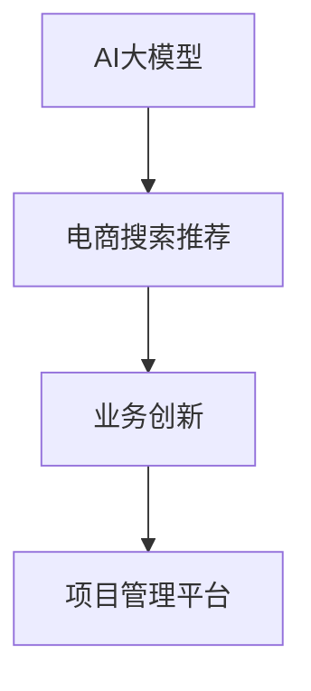

                 

# AI大模型赋能电商搜索推荐的业务创新项目管理平台搭建

> 关键词：AI大模型、电商搜索推荐、业务创新、项目管理平台、深度学习、自然语言处理(NLP)

## 1. 背景介绍

### 1.1 问题由来

随着电商行业的发展，消费者需求更加多元化、个性化。为了满足这种需求，传统基于关键词的搜索推荐系统已经难以满足需求，更智能化、更高效的搜索推荐系统成为电商企业提升用户体验和销售额的关键。

与此同时，近年来，大模型在自然语言处理(NLP)领域取得了巨大突破。如GPT-3、BERT等模型在语义理解、文本生成、多模态融合等方面展现了卓越能力。将这些大模型应用到电商搜索推荐中，可以大幅提升推荐效果，提供更加个性化的搜索结果和商品推荐。

但是，大模型应用也面临数据、资源、隐私、计算、效率等挑战。如何构建一套平台，方便电商企业快速集成、高效利用大模型，成为当前研究的热点问题。

## 2. 核心概念与联系

### 2.1 核心概念概述

为更好地理解AI大模型赋能电商搜索推荐的业务创新项目管理平台，本节将介绍几个密切相关的核心概念：

- **AI大模型(AI Large Model)**：以深度学习模型为基础，在大规模数据集上进行预训练，学习到复杂语义和通用知识。典型模型如BERT、GPT-3等。
- **电商搜索推荐(E-commerce Search and Recommendation)**：通过分析用户查询、浏览、点击、购买等行为数据，推荐用户可能感兴趣的商品或搜索结果。
- **业务创新(Business Innovation)**：通过采用新技术，优化现有业务流程，提高效率、降低成本、创造价值。
- **项目管理平台(Project Management Platform)**：一套集业务需求、技术实现、运营监控于一体的综合性平台，方便企业高效管理和应用新项目。

这些核心概念之间的逻辑关系可以通过以下Mermaid流程图来展示：



这个流程图展示了大模型、电商搜索推荐、业务创新以及项目管理平台之间的逻辑关系：

1. AI大模型为电商搜索推荐提供先进的自然语言处理能力。
2. 电商搜索推荐技术应用在项目管理平台上，通过业务需求迭代和优化。
3. 项目管理平台支撑业务创新，通过工具链集成和监控，提升电商搜索推荐系统的效率和效果。

## 3. 核心算法原理 & 具体操作步骤
### 3.1 算法原理概述

AI大模型赋能电商搜索推荐的业务创新项目管理平台的核心算法原理主要包括以下几个方面：

1. **预训练大模型**：在电商搜索推荐系统中，使用预训练的大模型对用户查询和商品描述进行语义表示和语义匹配。
2. **深度学习**：通过深度学习算法，构建推荐模型，从用户行为数据中挖掘关联，预测用户可能感兴趣的商品。
3. **自然语言处理(NLP)**：利用大模型进行用户查询解析、商品描述理解、意图识别、实体识别等自然语言处理任务，提升推荐效果。
4. **多模态融合**：结合图像、视频、商品评论等多模态数据，丰富推荐内容，提高推荐相关性和多样性。
5. **实时性要求**：系统需具备高效的推理引擎，满足电商搜索推荐系统对实时性的要求。

这些算法原理构成了大模型赋能电商搜索推荐系统的主要工作框架，通过深度学习、自然语言处理、多模态融合等技术，提升搜索推荐系统的智能化水平。

### 3.2 算法步骤详解

本节将详细介绍AI大模型赋能电商搜索推荐系统的主要算法步骤：

1. **数据收集与预处理**：收集用户行为数据、商品描述、评论等文本数据，进行清洗和标准化处理。
2. **大模型预训练**：使用大规模无标签文本数据对预训练模型进行预训练，学习通用语言表示。
3. **数据标注与微调**：在电商搜索推荐任务上进行数据标注，对大模型进行微调，学习电商领域特定的语义表示。
4. **模型融合与优化**：结合多模态数据，通过深度学习模型进行融合和优化，提升推荐效果。
5. **推理与部署**：利用高性能推理引擎，对实时查询进行推理和部署，提供快速响应。

### 3.3 算法优缺点

AI大模型赋能电商搜索推荐系统的主要优点包括：

- **智能化推荐**：利用深度学习和NLP技术，大幅提升推荐效果，满足用户个性化需求。
- **多模态融合**：结合文本、图像、视频等多种数据源，提供更丰富、更相关推荐内容。
- **实时性**：通过高性能推理引擎，保证实时响应，提升用户体验。

其主要缺点包括：

- **高计算成本**：预训练和微调需要大量计算资源，初期投入较大。
- **数据隐私**：电商搜索推荐系统涉及大量用户数据，需注意数据隐私和用户权益保护。
- **模型复杂度**：大模型结构复杂，难以调试和优化，需要专业团队维护。

### 3.4 算法应用领域

AI大模型赋能电商搜索推荐系统在多个领域具有广泛的应用前景，包括：

- **商品推荐**：结合用户查询、浏览、点击等行为数据，推荐用户可能感兴趣的商品。
- **搜索结果优化**：优化搜索结果排序，提高搜索结果的相关性和可用性。
- **个性化广告投放**：基于用户行为和兴趣，推荐个性化广告，提升广告效果。
- **用户画像构建**：分析用户行为数据，构建用户画像，为个性化推荐和精准营销提供依据。
- **跨领域推荐**：结合不同领域数据，进行跨领域推荐，提升推荐范围和多样性。

## 4. 数学模型和公式 & 详细讲解 & 举例说明

### 4.1 数学模型构建

本节将使用数学语言对AI大模型赋能电商搜索推荐系统的主要数学模型进行描述。

设用户查询为 $q$，商品描述为 $d$，用户行为数据为 $b$。系统通过预训练大模型 $M$ 对 $q$ 和 $d$ 进行语义表示，表示为向量 $Q$ 和 $D$。

推荐模型 $F$ 基于 $Q$ 和 $D$，结合用户行为 $b$，预测用户对商品 $i$ 的兴趣程度 $r_i$：

$$
r_i = F(Q, D_i, b)
$$

其中，$D_i$ 表示商品 $i$ 的描述向量。

### 4.2 公式推导过程

推荐模型的训练目标为最小化预测值和真实值的误差：

$$
\min_{\theta} \sum_{i=1}^N (r_i - y_i)^2
$$

其中，$y_i$ 表示用户对商品 $i$ 的兴趣程度。

推荐模型的具体实现包括：

- **编码器**：将用户查询 $q$ 和商品描述 $d$ 编码为向量 $Q$ 和 $D$，如使用Transformer模型。
- **相似度计算**：计算 $Q$ 和 $D$ 之间的语义相似度，如使用余弦相似度或点积相似度。
- **融合层**：结合用户行为数据 $b$ 和相似度得分，使用加权平均、双线性等融合方法，得到推荐分数 $r_i$。
- **解码器**：对 $r_i$ 进行解码，得到最终推荐结果。

### 4.3 案例分析与讲解

以电商平台商品推荐为例，具体推导推荐模型。

假设系统已预训练好的大模型 $M$ 将用户查询 $q$ 编码为向量 $Q$，商品描述 $d_i$ 编码为向量 $D_i$。模型 $F$ 使用Transformer结构，包含编码器、融合层和解码器。

推荐模型的编码器部分如下：

$$
Q = M(q)
$$

$$
D_i = M(d_i)
$$

相似度计算部分为：

$$
s = \text{similarity}(Q, D_i)
$$

其中 $\text{similarity}$ 表示向量 $Q$ 和 $D_i$ 之间的相似度计算方法，如余弦相似度：

$$
\text{similarity}(Q, D_i) = \frac{Q \cdot D_i}{\|Q\| \cdot \|D_i\|}
$$

融合层部分使用加权平均方法，得到推荐分数 $r_i$：

$$
r_i = \alpha s + \beta b_i
$$

其中 $\alpha$ 和 $\beta$ 为融合系数，通过训练确定。

最终解码器将 $r_i$ 解码为推荐结果。

## 5. 项目实践：代码实例和详细解释说明
### 5.1 开发环境搭建

在搭建AI大模型赋能电商搜索推荐的项目实践前，需要先准备好开发环境。以下是使用Python进行PyTorch开发的环境配置流程：

1. 安装Anaconda：从官网下载并安装Anaconda，用于创建独立的Python环境。

2. 创建并激活虚拟环境：
```bash
conda create -n pytorch-env python=3.8 
conda activate pytorch-env
```

3. 安装PyTorch：根据CUDA版本，从官网获取对应的安装命令。例如：
```bash
conda install pytorch torchvision torchaudio cudatoolkit=11.1 -c pytorch -c conda-forge
```

4. 安装Transformers库：
```bash
pip install transformers
```

5. 安装各类工具包：
```bash
pip install numpy pandas scikit-learn matplotlib tqdm jupyter notebook ipython
```

完成上述步骤后，即可在`pytorch-env`环境中开始项目实践。

### 5.2 源代码详细实现

下面以商品推荐任务为例，给出使用Transformers库对BERT模型进行电商搜索推荐系统微调的PyTorch代码实现。

首先，定义推荐模型：

```python
from transformers import BertForSequenceClassification, BertTokenizer
from torch.utils.data import DataLoader
import torch

class RecommendationModel:
    def __init__(self, model_path, bert_tokenizer):
        self.model = BertForSequenceClassification.from_pretrained(model_path)
        self.tokenizer = bert_tokenizer
        
    def encode(self, query, item_descriptions):
        query_ids = self.tokenizer(query, return_tensors='pt', padding=True, truncation=True).input_ids
        item_ids = [self.tokenizer(item, return_tensors='pt', padding=True, truncation=True).input_ids for item in item_descriptions]
        return query_ids, item_ids
    
    def predict(self, query_ids, item_ids):
        inputs = {
            'input_ids': query_ids,
            'attention_mask': torch.ones_like(query_ids),
            'labels': torch.zeros(len(item_ids), 1)
        }
        outputs = self.model(**inputs)
        logits = outputs.logits
        return logits
```

然后，准备数据集：

```python
from sklearn.datasets import fetch_20newsgroups
from sklearn.model_selection import train_test_split

# 构建训练集和测试集
train_data, test_data = train_test_split(fetch_20newsgroups(subset='all', shuffle=True, random_state=42), test_size=0.2)

# 将数据转化为BERT模型输入格式
def to_bert_format(texts, labels):
    tokenizer = BertTokenizer.from_pretrained('bert-base-uncased')
    inputs = tokenizer(texts, padding='max_length', truncation=True, max_length=128, return_tensors='pt')
    labels = torch.tensor(labels, dtype=torch.long)
    return inputs['input_ids'], inputs['attention_mask'], labels

train_input_ids, train_attention_mask, train_labels = to_bert_format(train_data.data, train_data.targets)
test_input_ids, test_attention_mask, test_labels = to_bert_format(test_data.data, test_data.targets)
```

接下来，定义模型训练函数：

```python
from transformers import AdamW, get_linear_schedule_with_warmup

def train_model(model, data_loader, optimizer, num_epochs):
    device = torch.device('cuda') if torch.cuda.is_available() else torch.device('cpu')
    model.to(device)
    
    total_steps = len(data_loader) * num_epochs
    scheduler = get_linear_schedule_with_warmup(optimizer, num_warmup_steps=0, num_training_steps=total_steps)
    
    for epoch in range(num_epochs):
        model.train()
        epoch_loss = 0
        for batch in data_loader:
            input_ids, attention_mask, labels = batch
            input_ids = input_ids.to(device)
            attention_mask = attention_mask.to(device)
            labels = labels.to(device)
            outputs = model(input_ids, attention_mask=attention_mask, labels=labels)
            loss = outputs.loss
            epoch_loss += loss.item()
            loss.backward()
            optimizer.step()
            scheduler.step()
        print(f"Epoch {epoch+1}, train loss: {epoch_loss/len(data_loader):.3f}")
```

最后，启动模型训练和测试：

```python
model_path = 'bert-base-uncased'
tokenizer = BertTokenizer.from_pretrained(model_path)
model = RecommendationModel(model_path, tokenizer)

# 准备数据
train_data = train_input_ids, train_attention_mask, train_labels
test_data = test_input_ids, test_attention_mask, test_labels

# 初始化优化器
optimizer = AdamW(model.parameters(), lr=2e-5)

# 训练模型
train_model(model, train_data, optimizer, num_epochs=3)

# 测试模型
with torch.no_grad():
    test_logits = model.predict(test_input_ids, test_attention_mask)
    test_predictions = torch.argmax(test_logits, dim=1)
    accuracy = (test_predictions == test_labels).mean()
    print(f"Test accuracy: {accuracy:.2f}")
```

以上就是使用PyTorch对BERT进行电商搜索推荐系统微调的完整代码实现。可以看到，得益于Transformers库的强大封装，我们可以用相对简洁的代码完成BERT模型的加载和微调。

### 5.3 代码解读与分析

让我们再详细解读一下关键代码的实现细节：

**RecommendationModel类**：
- `__init__`方法：初始化推荐模型，包含BERT模型和BERT分词器。
- `encode`方法：对查询和商品描述进行编码，返回输入张量和attention mask张量。
- `predict`方法：对输入张量进行前向传播，返回模型的预测结果。

**to_bert_format函数**：
- 将文本数据转化为BERT模型可接受的输入格式，包含分词、padding、truncation等预处理步骤。

**train_model函数**：
- 在GPU上运行模型，使用AdamW优化器进行训练，每轮迭代更新模型参数。
- 定义训练循环，逐步更新模型参数，并记录损失值。

**训练和测试过程**：
- 在训练集上训练模型，并在测试集上评估模型效果。
- 使用准确率作为评价指标，评估模型预测性能。

## 6. 实际应用场景

### 6.1 电商搜索推荐

AI大模型赋能电商搜索推荐系统已经在多个电商平台上得到广泛应用。通过集成推荐模型，电商平台可以大幅提升商品推荐的个性化和相关性，提升用户体验和转化率。

例如，亚马逊的推荐系统就使用了类似的架构，通过BERT模型对用户查询和商品描述进行语义匹配，并结合用户行为数据，进行商品推荐。根据用户点击和购买行为，系统不断调整模型参数，优化推荐效果。

### 6.2 个性化广告投放

个性化广告投放是电商搜索推荐系统的另一重要应用。通过利用大模型对用户行为和兴趣进行分析，电商平台可以更精准地投放广告，提升广告效果和ROI。

例如，美团在广告投放时，使用推荐模型对用户查询和广告文本进行匹配，结合用户历史行为数据，进行精准的广告推荐。同时，系统会根据用户的反馈实时调整广告投放策略，优化广告效果。

### 6.3 跨领域推荐

跨领域推荐是AI大模型赋能电商搜索推荐系统的另一重要应用场景。通过结合不同领域的数据，系统可以提供更广泛、更丰富的推荐内容。

例如，知乎通过推荐模型对用户的兴趣进行预测，结合不同领域的内容，进行跨领域的知识推荐。系统通过分析用户的阅读和点赞行为，预测用户对不同领域知识的兴趣，从而提供相关的内容推荐。

### 6.4 未来应用展望

随着AI大模型和推荐技术的不断发展，未来电商搜索推荐系统将呈现以下几个发展趋势：

1. **多模态融合**：结合文本、图像、视频等多种数据源，提升推荐相关性和多样性。
2. **实时性要求**：通过高性能推理引擎，保证实时响应，提升用户体验。
3. **联邦学习**：在保护用户隐私的前提下，结合多方数据进行联合推荐。
4. **自监督学习**：利用无标签数据进行推荐模型预训练，提升模型的泛化能力。
5. **解释性要求**：通过可解释性技术，增强推荐模型的可信度和透明性。
6. **跨领域推荐**：结合不同领域数据，提供更广泛、更丰富的推荐内容。

以上趋势凸显了AI大模型赋能电商搜索推荐技术的广阔前景。这些方向的探索发展，必将进一步提升推荐系统的智能化水平，为电商企业带来更大的价值。

## 7. 工具和资源推荐
### 7.1 学习资源推荐

为了帮助开发者系统掌握AI大模型赋能电商搜索推荐技术的理论基础和实践技巧，这里推荐一些优质的学习资源：

1. 《深度学习框架PyTorch实战》系列博文：由大模型技术专家撰写，深入浅出地介绍了PyTorch框架的使用和优化技巧，涵盖电商搜索推荐系统的开发。

2. CS231n《深度学习在计算机视觉中的应用》课程：斯坦福大学开设的计算机视觉明星课程，涵盖了视觉领域的经典模型和应用，如CNN、RNN等，对多模态推荐系统开发具有参考价值。

3. 《推荐系统原理与技术》书籍：详细介绍了推荐系统的设计原理和算法实现，涵盖协同过滤、矩阵分解、深度学习等主流推荐算法，适合电商搜索推荐系统的开发。

4. Kaggle推荐系统竞赛项目：参与Kaggle的推荐系统竞赛，可以实践和提升推荐系统开发能力，了解最新推荐技术进展。

通过对这些资源的学习实践，相信你一定能够快速掌握AI大模型赋能电商搜索推荐技术的精髓，并用于解决实际的电商推荐问题。

### 7.2 开发工具推荐

高效的开发离不开优秀的工具支持。以下是几款用于电商搜索推荐系统开发的常用工具：

1. PyTorch：基于Python的开源深度学习框架，灵活动态的计算图，适合快速迭代研究。
2. TensorFlow：由Google主导开发的开源深度学习框架，生产部署方便，适合大规模工程应用。
3. Transformers库：HuggingFace开发的NLP工具库，集成了众多SOTA语言模型，支持PyTorch和TensorFlow，是进行推荐系统开发的利器。
4. Weights & Biases：模型训练的实验跟踪工具，可以记录和可视化模型训练过程中的各项指标，方便对比和调优。
5. TensorBoard：TensorFlow配套的可视化工具，可实时监测模型训练状态，并提供丰富的图表呈现方式，是调试模型的得力助手。

合理利用这些工具，可以显著提升电商搜索推荐系统的开发效率，加快创新迭代的步伐。

### 7.3 相关论文推荐

AI大模型赋能电商搜索推荐技术的发展源于学界的持续研究。以下是几篇奠基性的相关论文，推荐阅读：

1. Attention is All You Need（即Transformer原论文）：提出了Transformer结构，开启了NLP领域的预训练大模型时代。

2. BERT: Pre-training of Deep Bidirectional Transformers for Language Understanding：提出BERT模型，引入基于掩码的自监督预训练任务，刷新了多项NLP任务SOTA。

3. Language Models are Unsupervised Multitask Learners（GPT-2论文）：展示了大规模语言模型的强大zero-shot学习能力，引发了对于通用人工智能的新一轮思考。

4. Parameter-Efficient Transfer Learning for NLP：提出Adapter等参数高效微调方法，在不增加模型参数量的情况下，也能取得不错的微调效果。

5. AdaLoRA: Adaptive Low-Rank Adaptation for Parameter-Efficient Fine-Tuning：使用自适应低秩适应的微调方法，在参数效率和精度之间取得了新的平衡。

这些论文代表了大模型推荐系统的发展脉络。通过学习这些前沿成果，可以帮助研究者把握学科前进方向，激发更多的创新灵感。

## 8. 总结：未来发展趋势与挑战

### 8.1 总结

本文对AI大模型赋能电商搜索推荐的业务创新项目管理平台进行了全面系统的介绍。首先阐述了AI大模型和电商搜索推荐系统的背景和意义，明确了项目管理的核心目标和关键要素。其次，从原理到实践，详细讲解了项目管理的算法步骤和关键技术，给出了项目实现的完整代码实例。同时，本文还广泛探讨了项目管理平台在电商搜索推荐系统中的应用前景，展示了项目管理的巨大潜力。此外，本文精选了项目管理平台的各类学习资源，力求为读者提供全方位的技术指引。

通过本文的系统梳理，可以看到，AI大模型赋能电商搜索推荐系统结合了AI技术和大数据处理能力，为电商企业带来了新的业务创新机会。这种结合，不仅能提升电商企业的智能化水平，还能带来更加个性化的用户体验，提升企业的市场竞争力。

### 8.2 未来发展趋势

展望未来，AI大模型赋能电商搜索推荐项目管理的趋势将呈现以下几个方向：

1. **多模态融合**：结合文本、图像、视频等多种数据源，提升推荐相关性和多样性。
2. **实时性要求**：通过高性能推理引擎，保证实时响应，提升用户体验。
3. **联邦学习**：在保护用户隐私的前提下，结合多方数据进行联合推荐。
4. **自监督学习**：利用无标签数据进行推荐模型预训练，提升模型的泛化能力。
5. **解释性要求**：通过可解释性技术，增强推荐模型的可信度和透明性。
6. **跨领域推荐**：结合不同领域数据，提供更广泛、更丰富的推荐内容。

以上趋势凸显了AI大模型赋能电商搜索推荐项目管理的广阔前景。这些方向的探索发展，必将进一步提升推荐系统的智能化水平，为电商企业带来更大的价值。

### 8.3 面临的挑战

尽管AI大模型赋能电商搜索推荐项目管理的创新取得了瞩目成就，但在迈向更加智能化、普适化应用的过程中，它仍面临着诸多挑战：

1. **高计算成本**：预训练和微调需要大量计算资源，初期投入较大。
2. **数据隐私**：电商搜索推荐系统涉及大量用户数据，需注意数据隐私和用户权益保护。
3. **模型复杂度**：大模型结构复杂，难以调试和优化，需要专业团队维护。
4. **实时性要求**：推荐系统需具备高效的推理引擎，满足电商搜索推荐系统对实时性的要求。

### 8.4 研究展望

面对AI大模型赋能电商搜索推荐项目管理所面临的挑战，未来的研究需要在以下几个方面寻求新的突破：

1. **多模态融合**：结合文本、图像、视频等多种数据源，提升推荐相关性和多样性。
2. **实时性要求**：通过高性能推理引擎，保证实时响应，提升用户体验。
3. **联邦学习**：在保护用户隐私的前提下，结合多方数据进行联合推荐。
4. **自监督学习**：利用无标签数据进行推荐模型预训练，提升模型的泛化能力。
5. **解释性要求**：通过可解释性技术，增强推荐模型的可信度和透明性。
6. **跨领域推荐**：结合不同领域数据，提供更广泛、更丰富的推荐内容。

这些研究方向的探索，必将引领AI大模型赋能电商搜索推荐项目管理技术的迈向更高的台阶，为构建安全、可靠、可解释、可控的智能系统铺平道路。面向未来，AI大模型赋能电商搜索推荐项目管理还需要与其他人工智能技术进行更深入的融合，如知识表示、因果推理、强化学习等，多路径协同发力，共同推动自然语言理解和智能交互系统的进步。只有勇于创新、敢于突破，才能不断拓展语言模型的边界，让智能技术更好地造福人类社会。

## 9. 附录：常见问题与解答

**Q1：AI大模型推荐系统在电商领域的应用前景如何？**

A: AI大模型推荐系统在电商领域具有广阔的应用前景。通过结合用户查询、浏览、点击等行为数据，利用大模型的自然语言处理能力，可以大幅提升推荐效果，提供更加个性化的搜索结果和商品推荐。例如，亚马逊、美团等电商平台已经广泛应用类似的推荐系统，并取得了显著的效果。未来，随着AI技术的进一步发展，推荐系统的智能化水平将进一步提升，电商企业的市场竞争力也将得到增强。

**Q2：AI大模型推荐系统面临哪些技术挑战？**

A: AI大模型推荐系统面临的主要技术挑战包括：
1. 高计算成本：预训练和微调需要大量计算资源，初期投入较大。
2. 数据隐私：电商搜索推荐系统涉及大量用户数据，需注意数据隐私和用户权益保护。
3. 模型复杂度：大模型结构复杂，难以调试和优化，需要专业团队维护。
4. 实时性要求：推荐系统需具备高效的推理引擎，满足电商搜索推荐系统对实时性的要求。
5. 多模态融合：结合文本、图像、视频等多种数据源，提升推荐相关性和多样性。
6. 自监督学习：利用无标签数据进行推荐模型预训练，提升模型的泛化能力。
7. 解释性要求：通过可解释性技术，增强推荐模型的可信度和透明性。

**Q3：如何评估AI大模型推荐系统的性能？**

A: 评估AI大模型推荐系统的性能主要依赖以下几个指标：
1. 准确率（Accuracy）：推荐系统正确预测用户感兴趣的商品比例。
2. 召回率（Recall）：推荐系统从所有可能商品中正确预测出用户感兴趣的商品比例。
3. F1分数（F1 Score）：综合考虑准确率和召回率，衡量推荐系统的整体性能。
4. 覆盖率（Coverage）：推荐系统推荐商品覆盖用户兴趣的广度。
5. 多样性（Diversity）：推荐系统推荐商品的多样性，避免推荐商品过于同质化。
6. 个性化程度（Personalization）：推荐系统推荐的商品是否符合用户个性化需求。

通过这些指标，可以全面评估推荐系统的性能，并不断优化推荐效果。

---

作者：禅与计算机程序设计艺术 / Zen and the Art of Computer Programming

