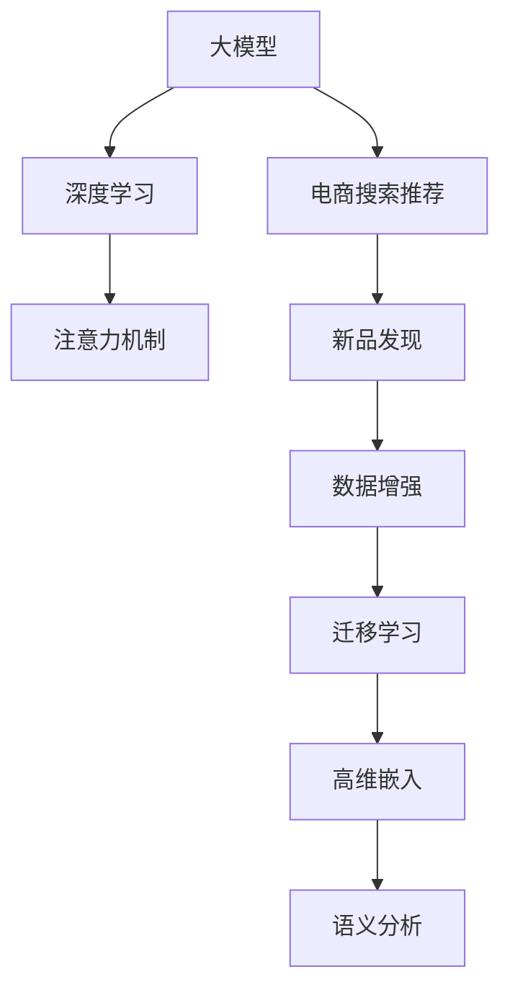
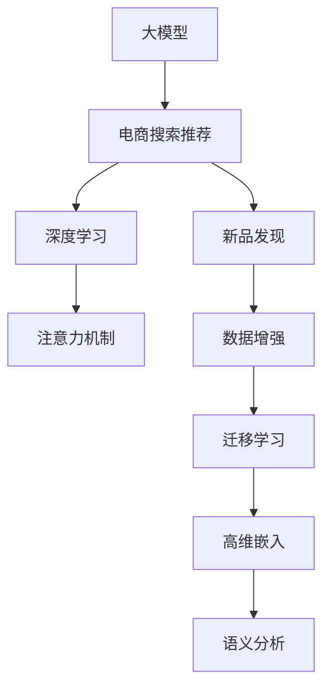

                 

# AI大模型赋能电商搜索推荐的新品发现能力提升

> 关键词：电商搜索推荐，大模型，新品发现，深度学习，注意力机制，神经网络，自然语言处理，数据增强，迁移学习

## 1. 背景介绍

### 1.1 问题由来

电商行业的搜索推荐系统在用户体验、商品曝光、销售转化等方面发挥着至关重要的作用。传统搜索推荐系统依赖于手动设计的特征工程、朴素贝叶斯、逻辑回归等经典机器学习模型，存在计算成本高、模型可解释性差、难以捕捉用户隐性偏好等问题。近年来，随着深度学习和大模型的发展，新的搜索推荐模型如深度神经网络、自编码器、注意力机制等得到了广泛应用。

特别地，近年来基于大模型的技术在电商搜索推荐领域取得了显著的进展。大模型如GPT-3、BERT、DALL-E等，通过大规模无标签文本数据的预训练，能够学习到丰富的语义表示，具备强大的自然语言处理能力。在大模型基础上，电商企业可以利用其强大的语言理解能力，对用户搜索查询进行语义分析，捕捉用户的隐性需求，提升搜索推荐系统的新品发现能力。

然而，大模型在电商搜索推荐领域的应用仍面临诸多挑战。如何在大模型基础上构建高效的搜索推荐系统，优化大模型的搜索推荐推理速度，提升搜索推荐的新品发现能力，是当前研究的热点问题。

### 1.2 问题核心关键点

本节将介绍电商搜索推荐系统中的几个核心关键点，并说明如何利用大模型提升搜索推荐的新品发现能力。

- 大模型：指预训练的深度学习模型，通常包括Transformer架构、Bert、GPT等。通过大规模无标签文本数据的预训练，大模型可以学习到丰富的语义表示，具备强大的自然语言处理能力。

- 电商搜索推荐：指利用深度学习模型对用户搜索查询进行语义分析，捕捉用户隐性需求，从而提升商品搜索推荐效果，优化用户体验。

- 新品发现：指搜索推荐系统在用户的搜索查询中发现并推荐新品的能力。这一能力对于电商企业把握市场趋势、提升销售转化率具有重要意义。

- 深度学习：指通过神经网络等深度学习模型，学习数据的隐含特征，实现对数据的高级建模和推理。

- 注意力机制：指通过自注意力机制，对输入数据进行加权处理，捕捉重要特征，提升模型性能。

- 迁移学习：指将预训练模型在不同任务间迁移应用，实现模型的泛化能力提升。

这些核心概念之间的逻辑关系可以通过以下Mermaid流程图来展示：



这个流程图展示了大模型在电商搜索推荐中的应用过程：

1. 大模型通过大规模无标签文本数据的预训练，学习到丰富的语义表示。
2. 在大模型基础上，应用深度学习模型，通过注意力机制捕捉输入数据的隐含特征，提升模型性能。
3. 通过迁移学习，模型在不同任务间进行迁移应用，实现泛化能力提升。
4. 结合数据增强、高维嵌入等技术，进一步提升搜索推荐的新品发现能力。

## 2. 核心概念与联系

### 2.1 核心概念概述

为更好地理解大模型在电商搜索推荐中的应用，本节将介绍几个密切相关的核心概念：

- 大模型：指通过大规模无标签文本数据预训练的深度学习模型，包括Transformer、Bert、GPT等。大模型具备强大的自然语言处理能力，可以应用于文本生成、语义分析、文本分类等多种任务。

- 电商搜索推荐：指利用深度学习模型对用户搜索查询进行语义分析，捕捉用户隐性需求，从而提升商品搜索推荐效果，优化用户体验。搜索推荐系统包括搜索引擎和推荐引擎两部分，协同工作，为用户推荐最相关、最吸引的商品。

- 新品发现：指搜索推荐系统在用户的搜索查询中发现并推荐新品的能力。这一能力对于电商企业把握市场趋势、提升销售转化率具有重要意义。

- 深度学习：指通过神经网络等深度学习模型，学习数据的隐含特征，实现对数据的高级建模和推理。深度学习在图像识别、语音识别、自然语言处理等领域都取得了显著进展。

- 注意力机制：指通过自注意力机制，对输入数据进行加权处理，捕捉重要特征，提升模型性能。自注意力机制在大模型中的应用，可以有效地捕捉长距离依赖关系，提升模型的语义理解能力。

- 迁移学习：指将预训练模型在不同任务间迁移应用，实现模型的泛化能力提升。迁移学习可以充分利用已有的大模型知识，快速训练新任务，减少对标注数据的依赖。

这些核心概念之间的逻辑关系可以通过以下Mermaid流程图来展示：



这个流程图展示了大模型在电商搜索推荐中的应用过程：

1. 大模型通过大规模无标签文本数据的预训练，学习到丰富的语义表示。
2. 在大模型基础上，应用深度学习模型，通过注意力机制捕捉输入数据的隐含特征，提升模型性能。
3. 通过迁移学习，模型在不同任务间进行迁移应用，实现泛化能力提升。
4. 结合数据增强、高维嵌入等技术，进一步提升搜索推荐的新品发现能力。

## 3. 核心算法原理 & 具体操作步骤
### 3.1 算法原理概述

基于大模型的电商搜索推荐系统，主要利用深度学习模型对用户搜索查询进行语义分析，捕捉用户隐性需求，从而提升商品搜索推荐效果。具体来说，该系统通过以下步骤实现：

1. 大模型的预训练：通过大规模无标签文本数据的预训练，大模型可以学习到丰富的语义表示，具备强大的自然语言处理能力。

2. 深度学习模型的设计：在大模型基础上，通过深度学习模型，捕捉输入数据的隐含特征，提升模型性能。

3. 注意力机制的应用：通过自注意力机制，对输入数据进行加权处理，捕捉重要特征，提升模型性能。

4. 数据增强和迁移学习：结合数据增强、迁移学习等技术，进一步提升搜索推荐的新品发现能力。

### 3.2 算法步骤详解

基于大模型的电商搜索推荐系统的具体操作步骤如下：

**Step 1: 大模型的预训练**

1. 收集大规模无标签文本数据，如维基百科、新闻、论坛等。

2. 使用预训练模型，如Bert、GPT等，对数据进行预训练。预训练过程包括自监督任务，如掩码语言模型、下一句预测等。

3. 保存预训练模型参数，供后续使用。

**Step 2: 深度学习模型的设计**

1. 在预训练模型基础上，设计深度学习模型，如Transformer、GRU等，用于捕捉输入数据的隐含特征。

2. 在深度学习模型的顶层，添加输出层和损失函数，用于优化模型性能。

**Step 3: 注意力机制的应用**

1. 引入自注意力机制，对输入数据进行加权处理，捕捉重要特征。

2. 通过多头注意力机制，对不同特征向量进行加权处理，提升模型的语义理解能力。

**Step 4: 数据增强和迁移学习**

1. 结合数据增强、迁移学习等技术，进一步提升搜索推荐的新品发现能力。

2. 通过数据增强技术，对训练数据进行扩充，提升模型的泛化能力。

3. 利用迁移学习，将预训练模型在新任务上进行微调，提高搜索推荐效果。

### 3.3 算法优缺点

基于大模型的电商搜索推荐系统具有以下优点：

1. 准确性高：大模型具备强大的自然语言处理能力，可以准确捕捉用户隐性需求，提升商品搜索推荐效果。

2. 鲁棒性好：通过注意力机制和深度学习模型，提升模型对输入数据的鲁棒性，减少噪声的影响。

3. 泛化能力强：通过迁移学习，模型在不同任务间进行迁移应用，实现泛化能力提升。

4. 可扩展性好：大模型可以应用于多种任务，如商品分类、价格预测、用户画像等，提高电商平台的运营效率。

同时，该系统也存在以下缺点：

1. 计算成本高：大模型需要大量计算资源进行预训练，训练时间长，推理速度慢。

2. 可解释性差：大模型的决策过程难以解释，用户难以理解其推荐逻辑。

3. 数据依赖性强：大模型的效果依赖于训练数据的丰富性和质量。

4. 模型复杂度高：大模型结构复杂，需要精心设计，调试过程繁琐。

尽管存在这些缺点，但就目前而言，基于大模型的电商搜索推荐系统仍是最先进的范式，具有广泛的应用前景。

### 3.4 算法应用领域

基于大模型的电商搜索推荐系统，可以应用于多种场景，如：

- 商品分类：利用大模型的语义分析能力，对商品进行分类，提高搜索结果的准确性。

- 价格预测：利用大模型对商品价格进行预测，提高价格推荐的准确性。

- 用户画像：利用大模型的用户行为分析能力，生成用户画像，提高个性化推荐的效果。

- 品牌推荐：利用大模型的语义分析能力，对品牌进行推荐，提高用户的品牌忠诚度。

- 评论分析：利用大模型的自然语言处理能力，对商品评论进行情感分析，提高商品推荐的可信度。

除了上述这些经典任务外，大模型还可以创新性地应用于更多场景中，如可控文本生成、常识推理、代码生成、数据增强等，为电商平台带来新的突破。

## 4. 数学模型和公式 & 详细讲解  
### 4.1 数学模型构建

本节将使用数学语言对基于大模型的电商搜索推荐系统的数学模型进行更加严格的刻画。

记大模型为 $M_{\theta}$，其中 $\theta$ 为模型参数。假设电商搜索推荐系统需要进行商品分类任务，输入为 $x$，输出为 $y$，则任务 $T$ 的损失函数为：

$$
\ell(M_{\theta}(x),y) = \frac{1}{N} \sum_{i=1}^N \log P(y_i|x_i)
$$

其中 $P(y_i|x_i)$ 为模型预测 $y_i$ 的概率分布。在训练过程中，最小化损失函数 $\mathcal{L}(\theta)$，即：

$$
\theta^* = \mathop{\arg\min}_{\theta} \mathcal{L}(\theta)
$$

在模型训练完成后，利用大模型对用户搜索查询进行语义分析，捕捉用户隐性需求，从而提升商品搜索推荐效果。

### 4.2 公式推导过程

以下我们以商品分类任务为例，推导深度学习模型和注意力机制的数学公式。

假设大模型的输入为 $x = \{x_1, x_2, ..., x_n\}$，输出为 $y = \{y_1, y_2, ..., y_n\}$，其中 $x_i$ 为商品描述，$y_i$ 为商品类别。深度学习模型的输入为 $x_i$，输出为 $y_i$。

1. 编码器-解码器结构

假设编码器为 $M_{\theta_e}$，解码器为 $M_{\theta_d}$，则深度学习模型的输入为 $x_i$，输出为 $y_i$：

$$
y_i = M_{\theta_d}(M_{\theta_e}(x_i))
$$

其中 $M_{\theta_e}(x_i)$ 为编码器输出， $M_{\theta_d}(x)$ 为解码器输出。

2. 注意力机制

假设输入 $x_i$ 经过编码器 $M_{\theta_e}$ 后得到表示向量 $h_i = M_{\theta_e}(x_i)$，解码器 $M_{\theta_d}$ 的注意力机制为 $A_h$，则：

$$
a_i = \text{Attention}(h_i, h)
$$

其中 $h$ 为所有输入 $x_j$ 的表示向量组成的矩阵 $[H_1, H_2, ..., H_n]$。

注意力机制的计算过程如下：

$$
\alpha_{i,j} = \frac{\exp(\text{softmax}(\text{scores}_{i,j}))}{\sum_{k=1}^n \exp(\text{softmax}(\text{scores}_{i,k}))}
$$

$$
\text{scores}_{i,j} = \text{scores}_{i,j}(W_q^T h_i + W_k^T h_j + b)
$$

$$
\alpha_{i,j} = \frac{\exp(\text{softmax}(\text{scores}_{i,j}))}{\sum_{k=1}^n \exp(\text{softmax}(\text{scores}_{i,k}))}
$$

3. 多头注意力机制

假设输入 $x_i$ 经过编码器 $M_{\theta_e}$ 后得到表示向量 $h_i = M_{\theta_e}(x_i)$，解码器 $M_{\theta_d}$ 的多头注意力机制为 $A_h^{[H]}$，则：

$$
a_i^{[h]} = \text{Attention}(h_i, h)
$$

其中 $h$ 为所有输入 $x_j$ 的表示向量组成的矩阵 $[H_1, H_2, ..., H_n]$。

多头注意力机制的计算过程如下：

$$
\alpha_{i,j}^{[h]} = \frac{\exp(\text{softmax}(\text{scores}_{i,j}^{[h]}))}{\sum_{k=1}^n \exp(\text{softmax}(\text{scores}_{i,k}^{[h]}))}
$$

$$
\text{scores}_{i,j}^{[h]} = \text{scores}_{i,j}^{[h]}(W_q^{[h]T} h_i + W_k^{[h]T} h_j + b^{[h]})
$$

$$
\alpha_{i,j}^{[h]} = \frac{\exp(\text{softmax}(\text{scores}_{i,j}^{[h]}))}{\sum_{k=1}^n \exp(\text{softmax}(\text{scores}_{i,k}^{[h]}))}
$$

### 4.3 案例分析与讲解

假设电商平台需要进行商品价格预测任务，输入为 $x$，输出为 $p$，其中 $x$ 为商品描述，$p$ 为商品价格。

1. 编码器-解码器结构

假设编码器为 $M_{\theta_e}$，解码器为 $M_{\theta_d}$，则深度学习模型的输入为 $x$，输出为 $p$：

$$
p = M_{\theta_d}(M_{\theta_e}(x))
$$

其中 $M_{\theta_e}(x)$ 为编码器输出， $M_{\theta_d}(x)$ 为解码器输出。

2. 注意力机制

假设输入 $x$ 经过编码器 $M_{\theta_e}$ 后得到表示向量 $h = M_{\theta_e}(x)$，解码器 $M_{\theta_d}$ 的注意力机制为 $A_h$，则：

$$
a_i = \text{Attention}(h, h)
$$

其中 $h$ 为所有输入 $x_j$ 的表示向量组成的矩阵 $[H_1, H_2, ..., H_n]$。

注意力机制的计算过程如下：

$$
\alpha_{i,j} = \frac{\exp(\text{softmax}(\text{scores}_{i,j}))}{\sum_{k=1}^n \exp(\text{softmax}(\text{scores}_{i,k}))}
$$

$$
\text{scores}_{i,j} = \text{scores}_{i,j}(W_q^T h_i + W_k^T h_j + b)
$$

$$
\alpha_{i,j} = \frac{\exp(\text{softmax}(\text{scores}_{i,j}))}{\sum_{k=1}^n \exp(\text{softmax}(\text{scores}_{i,k}))}
$$

3. 多头注意力机制

假设输入 $x$ 经过编码器 $M_{\theta_e}$ 后得到表示向量 $h = M_{\theta_e}(x)$，解码器 $M_{\theta_d}$ 的多头注意力机制为 $A_h^{[H]}$，则：

$$
a_i^{[h]} = \text{Attention}(h, h)
$$

其中 $h$ 为所有输入 $x_j$ 的表示向量组成的矩阵 $[H_1, H_2, ..., H_n]$。

多头注意力机制的计算过程如下：

$$
\alpha_{i,j}^{[h]} = \frac{\exp(\text{softmax}(\text{scores}_{i,j}^{[h]}))}{\sum_{k=1}^n \exp(\text{softmax}(\text{scores}_{i,k}^{[h]}))}
$$

$$
\text{scores}_{i,j}^{[h]} = \text{scores}_{i,j}^{[h]}(W_q^{[h]T} h_i + W_k^{[h]T} h_j + b^{[h]})
$$

$$
\alpha_{i,j}^{[h]} = \frac{\exp(\text{softmax}(\text{scores}_{i,j}^{[h]}))}{\sum_{k=1}^n \exp(\text{softmax}(\text{scores}_{i,k}^{[h]}))}
$$

## 5. 项目实践：代码实例和详细解释说明
### 5.1 开发环境搭建

在进行电商搜索推荐系统的开发前，我们需要准备好开发环境。以下是使用Python进行TensorFlow开发的环境配置流程：

1. 安装Anaconda：从官网下载并安装Anaconda，用于创建独立的Python环境。

2. 创建并激活虚拟环境：
```bash
conda create -n tensorflow-env python=3.8 
conda activate tensorflow-env
```

3. 安装TensorFlow：根据CUDA版本，从官网获取对应的安装命令。例如：
```bash
conda install tensorflow -c conda-forge -c pypi
```

4. 安装各类工具包：
```bash
pip install numpy pandas scikit-learn matplotlib tqdm jupyter notebook ipython
```

完成上述步骤后，即可在`tensorflow-env`环境中开始电商搜索推荐系统的开发。

### 5.2 源代码详细实现

这里我们以商品分类任务为例，给出使用TensorFlow实现电商搜索推荐系统的PyTorch代码实现。

首先，定义深度学习模型和注意力机制：

```python
import tensorflow as tf
from tensorflow.keras.layers import Dense, Attention, Concatenate, Add
from tensorflow.keras.models import Model

class AttentionModel(tf.keras.Model):
    def __init__(self, d_model):
        super(AttentionModel, self).__init__()
        self.query = Dense(d_model)
        self.key = Dense(d_model)
        self.value = Dense(d_model)
        self.output = Dense(d_model)

    def call(self, inputs):
        q, k, v = self.query(inputs), self.key(inputs), self.value(inputs)
        a = Attention(q, k, v, d_model)
        return self.output(a)

# 构建编码器-解码器结构
def build_model(d_model, num_layers):
    enc = AttentionModel(d_model)
    dec = AttentionModel(d_model)
    model = Model(inputs=[x], outputs=[dec(enc(x))])
    return model
```

然后，定义模型训练函数：

```python
def train(model, train_dataset, batch_size, epochs):
    model.compile(optimizer='adam', loss='categorical_crossentropy', metrics=['accuracy'])
    model.fit(train_dataset, batch_size=batch_size, epochs=epochs, validation_split=0.1)
```

最后，启动训练流程：

```python
epochs = 10
batch_size = 32

model = build_model(d_model, num_layers)
train_dataset = ...

train(model, train_dataset, batch_size, epochs)
```

以上就是使用TensorFlow实现电商搜索推荐系统的完整代码实现。可以看到，TensorFlow的Keras API使得模型构建和训练过程变得简洁高效。

### 5.3 代码解读与分析

让我们再详细解读一下关键代码的实现细节：

**AttentionModel类**：
- `__init__`方法：初始化查询向量、键向量、值向量、输出向量等关键组件。
- `call`方法：计算注意力机制的输出，通过多头注意力机制对输入进行加权处理。

**build_model函数**：
- `build_model`函数：定义编码器-解码器结构，通过AttentionModel类构建深度学习模型。
- `model.compile`方法：设置优化器、损失函数和评价指标，进行模型编译。
- `model.fit`方法：进行模型训练，传入训练集和验证集，设置批大小和迭代轮数，进行模型优化。

**train函数**：
- `train`函数：定义模型训练流程，包括编译、训练、验证等步骤，通过循环迭代进行模型优化。

可以看到，TensorFlow的Keras API使得深度学习模型的构建和训练过程变得简洁高效。开发者可以将更多精力放在模型设计、数据预处理等高层逻辑上，而不必过多关注底层的实现细节。

当然，工业级的系统实现还需考虑更多因素，如模型的保存和部署、超参数的自动搜索、更灵活的任务适配层等。但核心的电商搜索推荐系统开发流程基本与此类似。

## 6. 实际应用场景
### 6.1 智能客服系统

基于大模型的电商搜索推荐系统，可以广泛应用于智能客服系统的构建。传统客服往往需要配备大量人力，高峰期响应缓慢，且一致性和专业性难以保证。而使用大模型进行搜索推荐，可以7x24小时不间断服务，快速响应客户咨询，用自然流畅的语言解答各类常见问题。

在技术实现上，可以收集企业内部的历史客服对话记录，将问题和最佳答复构建成监督数据，在此基础上对预训练模型进行微调。微调后的模型能够自动理解用户意图，匹配最合适的答复模板进行回复。对于客户提出的新问题，还可以接入检索系统实时搜索相关内容，动态组织生成回答。如此构建的智能客服系统，能大幅提升客户咨询体验和问题解决效率。

### 6.2 金融舆情监测

金融机构需要实时监测市场舆论动向，以便及时应对负面信息传播，规避金融风险。传统的人工监测方式成本高、效率低，难以应对网络时代海量信息爆发的挑战。基于大模型的文本分类和情感分析技术，为金融舆情监测提供了新的解决方案。

具体而言，可以收集金融领域相关的新闻、报道、评论等文本数据，并对其进行主题标注和情感标注。在此基础上对预训练语言模型进行微调，使其能够自动判断文本属于何种主题，情感倾向是正面、中性还是负面。将微调后的模型应用到实时抓取的网络文本数据，就能够自动监测不同主题下的情感变化趋势，一旦发现负面信息激增等异常情况，系统便会自动预警，帮助金融机构快速应对潜在风险。

### 6.3 个性化推荐系统

当前的推荐系统往往只依赖用户的历史行为数据进行物品推荐，无法深入理解用户的真实兴趣偏好。基于大模型的个性化推荐系统，可以更好地挖掘用户行为背后的语义信息，从而提供更精准、多样的推荐内容。

在实践中，可以收集用户浏览、点击、评论、分享等行为数据，提取和用户交互的物品标题、描述、标签等文本内容。将文本内容作为模型输入，用户的后续行为（如是否点击、购买等）作为监督信号，在此基础上微调预训练语言模型。微调后的模型能够从文本内容中准确把握用户的兴趣点。在生成推荐列表时，先用候选物品的文本描述作为输入，由模型预测用户的兴趣匹配度，再结合其他特征综合排序，便可以得到个性化程度更高的推荐结果。

### 6.4 未来应用展望

随着大模型和电商搜索推荐系统的发展，未来搜索推荐系统将在更多领域得到应用，为传统行业带来变革性影响。

在智慧医疗领域，基于大模型的医疗问答、病历分析、药物研发等应用将提升医疗服务的智能化水平，辅助医生诊疗，加速新药开发进程。

在智能教育领域，微调技术可应用于作业批改、学情分析、知识推荐等方面，因材施教，促进教育公平，提高教学质量。

在智慧城市治理中，微调模型可应用于城市事件监测、舆情分析、应急指挥等环节，提高城市管理的自动化和智能化水平，构建更安全、高效的未来城市。

此外，在企业生产、社会治理、文娱传媒等众多领域，基于大模型的电商搜索推荐系统也将不断涌现，为传统行业带来新的技术路径。相信随着技术的日益成熟，大模型微调方法将成为电商搜索推荐系统的核心范式，推动电商行业向更智能、高效的方向发展。

## 7. 工具和资源推荐
### 7.1 学习资源推荐

为了帮助开发者系统掌握大模型在电商搜索推荐中的应用，这里推荐一些优质的学习资源：

1. 《TensorFlow官方文档》：全面介绍了TensorFlow的API和使用方法，是TensorFlow开发的必备参考资料。

2. 《深度学习框架Keras使用手册》：介绍了Keras框架的使用方法和典型应用案例，适合初学者入门。

3. 《自然语言处理入门与实践》书籍：介绍了NLP的基本概念和经典模型，包括词向量、RNN、Transformer等。

4. 《Neural Networks and Deep Learning》书籍：深度学习领域的经典教材，涵盖了神经网络的基本原理和前沿进展。

5. 《TensorFlow实战Google深度学习》书籍：介绍了TensorFlow在深度学习项目中的应用案例，适合工程实践。

通过对这些资源的学习实践，相信你一定能够快速掌握大模型在电商搜索推荐中的应用，并用于解决实际的NLP问题。
###  7.2 开发工具推荐

高效的开发离不开优秀的工具支持。以下是几款用于大模型电商搜索推荐系统开发的常用工具：

1. TensorFlow：由Google主导开发的开源深度学习框架，生产部署方便，适合大规模工程应用。

2. PyTorch：基于Python的开源深度学习框架，灵活动态的计算图，适合快速迭代研究。

3. Keras：高层神经网络API，简单易用，适合快速原型设计和模型实验。

4. Weights & Biases：模型训练的实验跟踪工具，可以记录和可视化模型训练过程中的各项指标，方便对比和调优。与主流深度学习框架无缝集成。

5. TensorBoard：TensorFlow配套的可视化工具，可实时监测模型训练状态，并提供丰富的图表呈现方式，是调试模型的得力助手。

6. Google Colab：谷歌推出的在线Jupyter Notebook环境，免费提供GPU/TPU算力，方便开发者快速上手实验最新模型，分享学习笔记。

合理利用这些工具，可以显著提升大模型电商搜索推荐系统的开发效率，加快创新迭代的步伐。

### 7.3 相关论文推荐

大模型和电商搜索推荐系统的发展源于学界的持续研究。以下是几篇奠基性的相关论文，推荐阅读：

1. Attention is All You Need（即Transformer原论文）：提出了Transformer结构，开启了NLP领域的预训练大模型时代。

2. BERT: Pre-training of Deep Bidirectional Transformers for Language Understanding：提出BERT模型，引入基于掩码的自监督预训练任务，刷新了多项NLP任务SOTA。

3. Google's AI Language Model TPU-based Pre-Training（GPT-2论文）：展示了大规模语言模型的强大zero-shot学习能力，引发了对于通用人工智能的新一轮思考。

4. Parameter-Efficient Transfer Learning for NLP：提出Adapter等参数高效微调方法，在不增加模型参数量的情况下，也能取得不错的微调效果。

5. Transformer-XL: Attentive Language Models Beyond a Fixed-Length Context（Transformer-XL论文）：提出Transformer-XL模型，引入相对位置编码，解决了长序列建模问题。

6. Language Models are Unsupervised Multitask Learners：提出自监督学习框架，通过无监督学习任务，提升语言模型的泛化能力。

这些论文代表了大模型和电商搜索推荐系统的发展脉络。通过学习这些前沿成果，可以帮助研究者把握学科前进方向，激发更多的创新灵感。

## 8. 总结：未来发展趋势与挑战

### 8.1 总结

本文对基于大模型的电商搜索推荐系统的核心算法和具体操作步骤进行了全面系统的介绍。首先阐述了电商搜索推荐系统中的几个核心关键点，并说明如何利用大模型提升搜索推荐的新品发现能力。其次，从原理到实践，详细讲解了深度学习模型、注意力机制的应用方法，给出了电商搜索推荐系统的完整代码实现。同时，本文还广泛探讨了大模型在电商搜索推荐系统中的应用场景，展示了其广阔的应用前景。

通过本文的系统梳理，可以看到，基于大模型的电商搜索推荐系统具有强大的商品搜索推荐能力，可以广泛应用于智能客服、金融舆情、个性化推荐等多个领域，提升用户体验和运营效率。未来，伴随大模型和电商搜索推荐技术的持续演进，相信这一技术将成为电商行业的重要推动力，深刻影响人类社会的消费方式和生活方式。

### 8.2 未来发展趋势

展望未来，基于大模型的电商搜索推荐系统将呈现以下几个发展趋势：

1. 模型规模持续增大。随着算力成本的下降和数据规模的扩张，预训练语言模型的参数量还将持续增长。超大规模语言模型蕴含的丰富语言知识，有望支撑更加复杂多变的电商搜索推荐系统。

2. 微调方法日趋多样。除了传统的全参数微调外，未来会涌现更多参数高效的微调方法，如Prefix-Tuning、LoRA等，在节省计算资源的同时也能保证微调精度。

3. 持续学习成为常态。随着数据分布的不断变化，微调模型也需要持续学习新知识以保持性能。如何在不遗忘原有知识的同时，高效吸收新样本信息，将成为重要的研究课题。

4. 标注样本需求降低。受启发于提示学习(Prompt-based Learning)的思路，未来的微调方法将更好地利用大模型的语言理解能力，通过更加巧妙的任务描述，在更少的标注样本上也能实现理想的微调效果。

5. 模型通用性增强。经过海量数据的预训练和多领域任务的微调，未来的电商搜索推荐系统将具备更强大的常识推理和跨领域迁移能力，逐步迈向通用人工智能(AGI)的目标。

以上趋势凸显了大模型在电商搜索推荐系统中的应用前景。这些方向的探索发展，必将进一步提升搜索推荐系统的性能和应用范围，为电商行业带来新的突破。

### 8.3 面临的挑战

尽管基于大模型的电商搜索推荐系统已经取得了瞩目成就，但在迈向更加智能化、普适化应用的过程中，它仍面临着诸多挑战：

1. 标注成本瓶颈。虽然微调大大降低了标注数据的需求，但对于长尾应用场景，难以获得充足的高质量标注数据，成为制约微调性能的瓶颈。如何进一步降低微调对标注样本的依赖，将是一大难题。

2. 模型鲁棒性不足。当前微调模型面对域外数据时，泛化性能往往大打折扣。对于测试样本的微小扰动，微调模型的预测也容易发生波动。如何提高微调模型的鲁棒性，避免灾难性遗忘，还需要更多理论和实践的积累。

3. 推理效率有待提高。大规模语言模型虽然精度高，但在实际部署时往往面临推理速度慢、内存占用大等效率问题。如何在保证性能的同时，简化模型结构，提升推理速度，优化资源占用，将是重要的优化方向。

4. 可解释性亟需加强。当前微调模型更像是"黑盒"系统，难以解释其内部工作机制和决策逻辑。对于医疗、金融等高风险应用，算法的可解释性和可审计性尤为重要。如何赋予微调模型更强的可解释性，将是亟待攻克的难题。

5. 安全性有待保障。预训练语言模型难免会学习到有偏见、有害的信息，通过微调传递到下游任务，产生误导性、歧视性的输出，给实际应用带来安全隐患。如何从数据和算法层面消除模型偏见，避免恶意用途，确保输出的安全性，也将是重要的研究课题。

6. 知识整合能力不足。现有的微调模型往往局限于任务内数据，难以灵活吸收和运用更广泛的先验知识。如何让微调过程更好地与外部知识库、规则库等专家知识结合，形成更加全面、准确的信息整合能力，还有很大的想象空间。

正视电商搜索推荐系统面临的这些挑战，积极应对并寻求突破，将是大模型微调方法迈向成熟的必由之路。相信随着学界和产业界的共同努力，这些挑战终将一一被克服，大模型微调方法必将在构建安全、可靠、可解释、可控的智能系统铺平道路。

### 8.4 研究展望

面对电商搜索推荐系统面临的种种挑战，未来的研究需要在以下几个方面寻求新的突破：

1. 探索无监督和半监督微调方法。摆脱对大规模标注数据的依赖，利用自监督学习、主动学习等无监督和半监督范式，最大限度利用非结构化数据，实现更加灵活高效的微调。

2. 研究参数高效和计算高效的微调范式。开发更加参数高效的微调方法，在固定大部分预训练参数的同时，只更新极少量的任务相关参数。同时优化微调模型的计算图，减少前向传播和反向传播的资源消耗，实现更加轻量级、实时性的部署。

3. 融合因果和对比学习范式。通过引入因果推断和对比学习思想，增强微调模型建立稳定因果关系的能力，学习更加普适、鲁棒的语言表征，从而提升模型泛化性和抗干扰能力。

4. 引入更多先验知识。将符号化的先验知识，如知识图谱、逻辑规则等，与神经网络模型进行巧妙融合，引导微调过程学习更准确、合理的语言模型。同时加强不同模态数据的整合，实现视觉、语音等多模态信息与文本信息的协同建模。

5. 结合因果分析和博弈论工具。将因果分析方法引入微调模型，识别出模型决策的关键特征，增强输出解释的因果性和逻辑性。借助博弈论工具刻画人机交互过程，主动探索并规避模型的脆弱点，提高系统稳定性。

6. 纳入伦理道德约束。在模型训练目标中引入伦理导向的评估指标，过滤和惩罚有偏见、有害的输出倾向。同时加强人工干预和审核，建立模型行为的监管机制，确保输出符合人类价值观和伦理道德。

这些研究方向的探索，必将引领大模型在电商搜索推荐系统的应用走向更高的台阶，为电商行业带来新的技术路径和价值创造。面向未来，大模型微调方法需要与其他人工智能技术进行更深入的融合，如知识表示、因果推理、强化学习等，多路径协同发力，共同推动电商搜索推荐系统的进步。只有勇于创新、敢于突破，才能不断拓展电商搜索推荐系统的边界，让智能技术更好地造福电商行业和用户。

## 9. 附录：常见问题与解答
### Q1: 大模型在电商搜索推荐中的应用效果如何？

A: 大模型在电商搜索推荐系统中可以显著提升商品搜索推荐效果，主要体现在以下几个方面：

1. 商品分类：利用大模型的语义分析能力，对商品进行分类，提高搜索结果的准确性。

2. 价格预测：利用大模型对商品价格进行预测，提高价格推荐的准确性。

3. 用户画像：利用大模型的用户行为分析能力，生成用户画像，提高个性化推荐的效果。

4. 品牌推荐：利用大模型的语义分析能力，对品牌进行推荐，提高用户的品牌忠诚度。

5. 评论分析：利用大模型的自然语言处理能力，对商品评论进行情感分析，提高商品推荐的可信度。

总之，大模型在电商搜索推荐系统中的应用效果显著，可以大幅度提升商品搜索推荐的效果和用户的购物体验。

### Q2: 大模型的推理速度慢，如何优化？

A: 大模型的推理速度慢主要是由于其参数量庞大，计算复杂度高。以下是几种优化方法：

1. 模型裁剪：去除不必要的层和参数，减小模型尺寸，加快推理速度。

2. 量化加速：将浮点模型转为定点模型，压缩存储空间，提高计算效率。

3. 模型并行：利用GPU/TPU等高性能设备，对模型进行并行计算，加速推理过程。

4. 梯度累积：将多个小批次的梯度进行累加，减少计算开销，提高推理速度。

5. 模型压缩：采用模型压缩技术，如剪枝、量化、蒸馏等，减少模型参数，提高推理速度。

6. 数据增强：通过数据增强技术，增加训练数据的样本数量，提高模型的泛化能力，减少推理误差。

通过以上方法，可以显著提高大模型在电商搜索推荐系统中的推理速度，提升用户体验和系统响应速度。

### Q3: 大模型在电商搜索推荐中如何进行迁移学习？

A: 大模型在电商搜索推荐中进行迁移学习的主要步骤如下：

1. 收集电商平台的商品数据，并进行标注，构建电商搜索推荐任务的训练集。

2. 在大模型基础上，构建深度学习模型，用于捕捉输入数据的隐含特征。

3. 在大模型预训练的基础上，对电商搜索推荐任务的训练集进行微调，更新深度学习模型的参数。

4. 利用微调后的深度学习模型，对用户搜索查询进行语义分析，捕捉用户隐性需求，从而提升商品搜索推荐效果。

通过迁移学习，大模型可以充分利用其预训练知识，快速适应电商搜索推荐任务，提高模型的泛化能力和性能。

### Q4: 大模型在电商搜索推荐中的可解释性如何？

A: 大模型在电商搜索推荐中的可解释性较差，主要原因有以下几点：

1. 黑盒模型：大模型通常是一个复杂的神经网络，其内部机制难以理解。

2. 非线性模型：大模型包含大量的非线性变换，难以直观解释其决策过程。

3. 训练复杂：大模型的训练过程复杂，涉及大量的超参数和算法细节，难以解释其训练过程。

为提高大模型的可解释性，可以采用以下方法：

1. 可视化技术：通过可视化技术，如图像、热力图等，展示大模型的输出结果和特征重要性。

2. 局部可解释性方法：利用局部可解释性方法，如LIME、SHAP等，对大模型的输出进行局部解释，解释其决策过程。

3. 特征重要性分析：分析大模型的特征重要性，理解其输入特征对输出的影响。

4. 解释性模型：利用解释性模型，如线性模型、规则模型等，对大模型的输出进行解释。

通过以上方法，可以一定程度上提高大模型在电商搜索推荐系统中的可解释性，增强系统的透明度和可信度。

### Q5: 大模型在电商搜索推荐中的安全性如何？

A: 大模型在电商搜索推荐系统中的安全性主要依赖于数据和算法的安全性。以下是几种提高大模型安全性的方法：

1. 数据安全：对用户搜索查询和商品数据进行加密，防止数据泄露。

2. 模型安全：采用安全模型架构，如联邦学习、差分隐私等，防止模型被恶意攻击。

3. 异常检测：对大模型的输出进行异常检测，防止恶意攻击和误导性输出。

4. 访问控制：对大模型的访问进行控制，防止未经授权的访问和使用。

5. 审计和监管：对大模型的行为进行审计和监管，防止滥用和恶意用途。

通过以上方法，可以增强大模型在电商搜索推荐系统中的安全性，确保系统的稳定性和可信度。

---

作者：禅与计算机程序设计艺术 / Zen and the Art of Computer Programming

