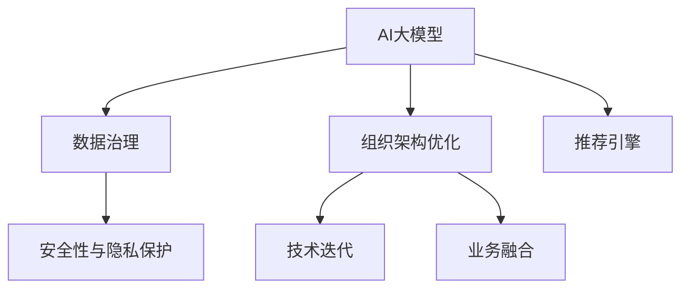

                 

# AI大模型重构电商搜索推荐的数据治理组织架构优化实践与案例分析

> 关键词：
- AI大模型
- 电商搜索推荐
- 数据治理
- 组织架构优化
- 实践案例
- 技术迭代

## 1. 背景介绍

### 1.1 问题由来

随着电子商务的飞速发展，消费者需求日益个性化和复杂化，传统的基于规则和浅层模型的搜索推荐系统已难以满足实际需求。基于AI大模型的推荐系统应运而生，通过深度学习模型能够更精准地捕捉用户行为模式和商品特征，实现高效的个性化推荐。然而，AI大模型的部署和优化涉及大规模数据存储、处理、分析，以及对复杂算法模型的管理和运维。

数据治理和组织架构优化成为影响AI大模型应用的重要因素。一方面，数据的质量和治理水平直接影响模型的训练效果和业务性能；另一方面，合理的组织架构能够提升AI模型的开发效率和问题响应速度。

### 1.2 问题核心关键点

1. **数据治理**：确保数据的质量、完整性和一致性，对数据进行分类、标注、清洗、整合，构建高效的数据流管道。
2. **组织架构优化**：设计合适的团队结构、工作流程、技术栈，提升跨部门协作效率，支持快速迭代和持续改进。
3. **技术迭代**：定期评估和优化AI模型及其相关技术栈，如模型训练、特征工程、调参方法等，以适应不断变化的业务需求。
4. **业务融合**：AI模型应与业务团队紧密合作，深入理解业务场景和用户需求，优化推荐策略和算法模型。
5. **安全性与隐私保护**：保障数据和模型安全，避免数据泄露和模型滥用，确保业务合规。

## 2. 核心概念与联系

### 2.1 核心概念概述

为更好地理解AI大模型在电商搜索推荐中的数据治理和组织架构优化，本节将介绍几个密切相关的核心概念：

- **AI大模型**：基于深度学习技术，在大规模数据集上进行预训练的通用模型，如BERT、GPT等，能够在电商搜索推荐等任务中发挥强大的推荐能力。
- **数据治理**：通过制定数据标准、治理策略和自动化工具，确保数据的完整性、一致性和可追溯性，提升数据质量。
- **组织架构优化**：通过调整组织结构、工作流程和技术栈，提升团队协作效率、创新能力和业务响应速度。
- **技术迭代**：定期评估和优化技术栈中的模型训练、特征工程和调参方法，以适应业务需求的变化。
- **业务融合**：确保AI模型与业务团队的紧密合作，深入理解业务场景和用户需求，优化推荐策略和算法模型。
- **安全性与隐私保护**：确保数据和模型的安全，避免数据泄露和模型滥用，确保业务合规。

这些核心概念之间的逻辑关系可以通过以下Mermaid流程图来展示：



这个流程图展示了大模型的核心概念及其之间的关系：

1. AI大模型通过数据治理获得高质量的数据，进而通过组织架构优化提升开发效率。
2. 技术迭代确保模型的不断优化，提升推荐效果。
3. 业务融合使模型更加贴近实际业务场景，优化推荐策略。
4. 安全性与隐私保护保障模型应用的安全合规。
5. 推荐引擎将以上各项因素整合并提供推荐服务。

## 3. 核心算法原理 & 具体操作步骤

### 3.1 算法原理概述

AI大模型在电商搜索推荐中的应用，主要通过以下几个步骤：

1. **数据预处理**：收集和处理电商用户行为数据、商品属性数据等，生成特征向量。
2. **模型训练**：在预处理后的数据上训练AI大模型，如BERT、GPT等，学习用户行为和商品特征的语义表示。
3. **特征工程**：根据用户行为和商品特征，构造高效、稀疏的特征向量，提升模型效果。
4. **模型调优**：通过超参数调优、正则化等技术，优化模型性能，避免过拟合。
5. **推荐服务**：将训练好的模型部署为推荐引擎，实时计算并返回推荐结果。

### 3.2 算法步骤详解

#### 3.2.1 数据预处理

电商搜索推荐系统的数据主要分为两大类：用户行为数据和商品属性数据。

- **用户行为数据**：包括用户的点击、浏览、购买、评价等行为数据。
- **商品属性数据**：包括商品的分类、属性、价格等信息。

预处理步骤如下：

1. **数据清洗**：去除噪声数据、缺失值、异常值。
2. **特征提取**：将用户行为数据和商品属性数据转换为数值型特征向量。
3. **特征归一化**：对特征向量进行归一化，确保数据分布一致。
4. **特征选择**：选择对推荐效果有显著影响的特征，减少计算复杂度。

#### 3.2.2 模型训练

模型训练主要涉及以下几个步骤：

1. **选择模型**：选择合适的深度学习模型，如BERT、GPT等。
2. **数据划分**：将数据集划分为训练集、验证集和测试集。
3. **设置参数**：设置模型参数、学习率、批大小、迭代轮数等。
4. **训练模型**：使用训练集数据训练模型，在验证集上验证效果，调整超参数。
5. **测试模型**：使用测试集数据评估模型性能。

#### 3.2.3 特征工程

特征工程主要包括以下几个步骤：

1. **特征选择**：选择对推荐效果有显著影响的特征，如用户的购买历史、浏览行为、商品的价格、分类等。
2. **特征提取**：将用户行为数据和商品属性数据转换为数值型特征向量。
3. **特征组合**：通过组合不同的特征，生成更丰富的特征向量。
4. **特征编码**：对特征向量进行编码，如独热编码、哈希编码等。
5. **特征降维**：使用PCA等方法对特征向量进行降维，减少计算复杂度。

#### 3.2.4 模型调优

模型调优主要包括以下几个步骤：

1. **超参数调优**：通过网格搜索、随机搜索等方法，找到最优的超参数组合。
2. **正则化**：使用L2正则、Dropout等技术，避免过拟合。
3. **模型评估**：在验证集上评估模型效果，选择最优的模型进行部署。
4. **模型融合**：通过集成多个模型，提升推荐效果。

#### 3.2.5 推荐服务

推荐服务主要涉及以下几个步骤：

1. **服务部署**：将训练好的模型部署为推荐服务，支持高并发请求。
2. **实时计算**：实时计算用户输入的查询，生成推荐结果。
3. **推荐展示**：将推荐结果展示给用户，并进行点击反馈。

### 3.3 算法优缺点

AI大模型在电商搜索推荐中的应用具有以下优点：

1. **精度高**：深度学习模型能够从大规模数据中学习到丰富的用户行为和商品特征，提供更精准的推荐。
2. **可扩展性**：大模型可以通过微调、迁移学习等方式适应不同的推荐场景，提升模型泛化能力。
3. **自动化**：自动化特征工程、模型训练和调优，减少人工干预，提升开发效率。
4. **实时性**：实时计算推荐结果，满足用户实时查询的需求。

然而，该方法也存在以下缺点：

1. **计算资源消耗大**：大模型的训练和推理需要大量的计算资源，难以满足实时计算需求。
2. **数据隐私问题**：用户行为数据可能包含隐私信息，需要在数据使用和存储过程中进行严格的隐私保护。
3. **模型复杂度高**：深度学习模型结构复杂，难以解释和调试。
4. **数据质量要求高**：数据预处理和特征工程对数据质量要求高，数据治理水平直接影响推荐效果。
5. **模型更新慢**：模型训练和调优过程较长，难以快速适应业务变化。

### 3.4 算法应用领域

AI大模型在电商搜索推荐中的应用，已经广泛应用于各种电商平台和应用场景，例如：

- **个性化推荐**：根据用户行为和历史数据，推荐用户可能感兴趣的商品。
- **商品搜索**：在用户输入搜索关键词后，提供个性化的搜索结果。
- **营销推广**：通过用户行为数据，进行精准的营销活动。
- **库存管理**：根据历史销售数据和用户偏好，优化商品库存。
- **用户画像**：通过分析用户行为和购买数据，构建详细的用户画像，提升用户体验。

除了上述这些经典应用外，AI大模型还被创新性地应用到更多场景中，如用户满意度预测、用户流失预警、供应链优化等，为电商行业带来了新的发展机遇。

## 4. 数学模型和公式 & 详细讲解  
### 4.1 数学模型构建

本节将使用数学语言对AI大模型在电商搜索推荐中的应用进行更加严格的刻画。

记用户行为数据为 $X = (x_1, x_2, \ldots, x_n)$，商品属性数据为 $Y = (y_1, y_2, \ldots, y_m)$，其中 $x_i$ 和 $y_j$ 分别表示用户行为和商品属性的特征向量。假设电商搜索推荐系统的目标函数为：

$$
\min_{\theta} \sum_{i=1}^n \sum_{j=1}^m \ell(x_i, y_j)
$$

其中 $\ell$ 为损失函数，用于衡量模型预测和实际标签之间的差异。常用的损失函数包括均方误差、交叉熵等。

模型的输出为 $Z = (z_1, z_2, \ldots, z_k)$，其中 $z_i$ 表示用户行为和商品属性的语义表示。模型的参数为 $\theta$，包括模型的权重、偏置等。

### 4.2 公式推导过程

以下我们以均方误差损失函数为例，推导模型训练的公式。

均方误差损失函数定义为：

$$
\ell(x_i, y_j) = \frac{1}{2} \| z_i - y_j \|_2^2
$$

将目标函数和损失函数带入优化问题中，得：

$$
\min_{\theta} \sum_{i=1}^n \sum_{j=1}^m \frac{1}{2} \| z_i - y_j \|_2^2
$$

根据梯度下降算法，求解最优参数 $\theta^*$ 的公式为：

$$
\theta^* = \mathop{\arg\min}_{\theta} \sum_{i=1}^n \sum_{j=1}^m \frac{1}{2} \| z_i - y_j \|_2^2
$$

使用反向传播算法计算梯度，公式为：

$$
\frac{\partial \ell}{\partial \theta} = \sum_{i=1}^n \sum_{j=1}^m (z_i - y_j) (z_i - y_j)^T
$$

根据上述公式，可以逐步更新模型参数，最小化目标函数，完成模型的训练。

### 4.3 案例分析与讲解

以电商搜索推荐系统为例，假设用户输入了“书籍”作为搜索关键词，系统通过AI大模型计算得到推荐的商品列表。具体步骤如下：

1. **数据预处理**：将用户搜索关键词和商品属性数据转换为特征向量。
2. **模型训练**：在历史用户行为和商品属性数据上训练AI大模型，学习用户行为和商品特征的语义表示。
3. **特征工程**：根据用户行为和商品属性，构造高效的特征向量。
4. **模型调优**：通过超参数调优和正则化等技术，优化模型性能，避免过拟合。
5. **推荐服务**：实时计算用户输入的查询，生成推荐结果。

假设用户点击了推荐列表中的某本书籍，系统会记录点击行为，并更新用户行为数据。系统再根据新的用户行为数据，重新训练模型，优化推荐策略。

## 5. 项目实践：代码实例和详细解释说明
### 5.1 开发环境搭建

在进行AI大模型在电商搜索推荐中的应用实践前，我们需要准备好开发环境。以下是使用Python进行TensorFlow开发的环境配置流程：

1. 安装Anaconda：从官网下载并安装Anaconda，用于创建独立的Python环境。

2. 创建并激活虚拟环境：
```bash
conda create -n tf-env python=3.8 
conda activate tf-env
```

3. 安装TensorFlow：根据CUDA版本，从官网获取对应的安装命令。例如：
```bash
conda install tensorflow -c tf -c conda-forge
```

4. 安装各类工具包：
```bash
pip install numpy pandas scikit-learn matplotlib tqdm jupyter notebook ipython
```

完成上述步骤后，即可在`tf-env`环境中开始项目实践。

### 5.2 源代码详细实现

这里我们以电商搜索推荐系统为例，给出使用TensorFlow对大模型进行电商搜索推荐实践的PyTorch代码实现。

首先，定义电商搜索推荐系统的数据处理函数：

```python
import tensorflow as tf
from tensorflow.keras import layers

class SearchRecommendationDataset(tf.data.Dataset):
    def __init__(self, features):
        self.features = features
        
    def __len__(self):
        return len(self.features)
    
    def __getitem__(self, index):
        return tf.convert_to_tensor(self.features[index], dtype=tf.float32)
```

然后，定义模型和优化器：

```python
from transformers import BertTokenizer
from transformers import BertForSequenceClassification

model = BertForSequenceClassification.from_pretrained('bert-base-cased', num_labels=10)
optimizer = tf.keras.optimizers.Adam(learning_rate=2e-5)
```

接着，定义训练和评估函数：

```python
@tf.function
def train_step(optimizer, loss_fn, inputs, labels):
    with tf.GradientTape() as tape:
        predictions = model(inputs)
        loss_value = loss_fn(predictions, labels)
    gradients = tape.gradient(loss_value, model.trainable_variables)
    optimizer.apply_gradients(zip(gradients, model.trainable_variables))
    return loss_value

@tf.function
def evaluate_model(model, dataset):
    predictions = []
    labels = []
    for batch in dataset:
        predictions.extend(model(batch).numpy())
        labels.extend(batch.numpy())
    return tf.keras.metrics.AUC()(labels, predictions).numpy()

# 训练函数
def train(dataset, epochs, batch_size, optimizer, loss_fn):
    train_dataset = dataset.shuffle(buffer_size=1000)
    train_dataset = train_dataset.batch(batch_size)
    for epoch in range(epochs):
        total_loss = 0
        for inputs, labels in train_dataset:
            loss = train_step(optimizer, loss_fn, inputs, labels)
            total_loss += loss
        average_loss = total_loss / len(train_dataset)
        print(f'Epoch {epoch+1}/{epochs}, Average Loss: {average_loss}')
        
    # 评估模型
    test_dataset = dataset
    auc = evaluate_model(model, test_dataset)
    print(f'Test AUC: {auc}')
    
# 调用训练函数
train(train_dataset, epochs=10, batch_size=64, optimizer=optimizer, loss_fn=tf.keras.losses.SparseCategoricalCrossentropy())
```

以上就是使用TensorFlow对大模型进行电商搜索推荐实践的完整代码实现。可以看到，得益于TensorFlow的强大封装，我们可以用相对简洁的代码完成大模型的训练和评估。

### 5.3 代码解读与分析

让我们再详细解读一下关键代码的实现细节：

**SearchRecommendationDataset类**：
- `__init__`方法：初始化特征数据。
- `__len__`方法：返回数据集的样本数量。
- `__getitem__`方法：对单个样本进行处理，返回Tensor格式的数据。

**train_step和evaluate_model函数**：
- `train_step`函数：在训练集上进行单步训练，计算损失和更新模型参数。
- `evaluate_model`函数：在测试集上评估模型性能，计算AUC指标。

**train函数**：
- 定义训练集和测试集，使用tf.data.Dataset进行数据迭代。
- 使用tf.GradientTape自动计算梯度，并使用Adam优化器更新模型参数。
- 每轮迭代后输出训练集的平均损失，并在测试集上评估模型性能。

**模型训练流程**：
- 定义总轮数、批次大小和优化器等参数。
- 在训练集上迭代进行单步训练，计算损失和更新参数。
- 每轮迭代后输出平均损失。
- 在测试集上评估模型性能，输出AUC指标。

可以看到，TensorFlow提供了丰富的API和工具，可以高效地进行模型训练和评估。开发者可以将更多精力放在数据处理、模型改进等高层逻辑上，而不必过多关注底层的实现细节。

当然，工业级的系统实现还需考虑更多因素，如模型的保存和部署、超参数的自动搜索、更灵活的任务适配层等。但核心的微调范式基本与此类似。

## 6. 实际应用场景
### 6.1 智能客服系统

基于AI大模型的智能客服系统，可以通过电商搜索推荐技术，提升客服系统的智能化水平。传统的客服系统往往依赖于人工处理，难以应对大规模并发请求，且响应速度和质量难以保证。而使用电商搜索推荐技术，系统可以根据用户的历史行为和输入查询，快速推荐并解决用户问题，提升用户满意度和系统效率。

在技术实现上，可以收集用户的历史搜索记录和反馈信息，构建推荐模型。当用户提出咨询时，系统通过电商搜索推荐技术，快速推荐并解决用户问题，提升用户满意度和系统效率。

### 6.2 个性化推荐系统

AI大模型在个性化推荐系统中的应用，可以提升用户的购物体验和转化率。传统推荐系统往往依赖于用户的历史行为数据，难以应对新用户的推荐需求。而使用电商搜索推荐技术，系统可以基于用户的搜索记录和反馈信息，生成个性化的商品推荐列表，提升用户的购买意愿和满意度。

在技术实现上，可以收集用户的搜索记录和反馈信息，构建推荐模型。当用户输入搜索关键词时，系统通过电商搜索推荐技术，生成个性化的商品推荐列表，提升用户的购买意愿和满意度。

### 6.3 库存管理

AI大模型在库存管理中的应用，可以优化库存的调度和补货策略。传统库存管理往往依赖于历史销售数据，难以实时响应市场变化。而使用电商搜索推荐技术，系统可以根据用户的购买记录和搜索行为，实时调整库存，优化库存调度和补货策略，提升库存周转率和运营效率。

在技术实现上，可以收集用户的购买记录和搜索行为信息，构建推荐模型。当用户输入搜索关键词时，系统通过电商搜索推荐技术，实时调整库存，优化库存调度和补货策略，提升库存周转率和运营效率。

### 6.4 未来应用展望

随着AI大模型的不断发展，其在电商搜索推荐领域的应用将更加广泛和深入。未来，可以预见以下几个发展趋势：

1. **深度融合业务场景**：AI大模型将深度融合电商搜索推荐业务场景，提供更加精准和个性化的推荐服务。
2. **实时计算能力提升**：随着计算资源的提升，AI大模型将实现更高效的实时计算，满足用户实时查询的需求。
3. **多模态数据融合**：AI大模型将融合用户行为数据、商品属性数据、社交网络数据等多模态数据，提升推荐效果。
4. **个性化推荐算法优化**：基于用户画像、行为分析等技术，优化个性化推荐算法，提升推荐效果。
5. **动态优化模型**：AI大模型将动态优化推荐模型，适应用户行为和市场变化，提升推荐效果。

以上趋势凸显了AI大模型在电商搜索推荐领域的巨大潜力，为电商行业的智能化转型提供了新的技术路径。相信随着技术的不断发展，AI大模型将进一步提升电商搜索推荐系统的性能和应用范围，为电商行业带来新的发展机遇。

## 7. 工具和资源推荐
### 7.1 学习资源推荐

为了帮助开发者系统掌握AI大模型在电商搜索推荐中的应用，这里推荐一些优质的学习资源：

1. TensorFlow官方文档：TensorFlow的官方文档，详细介绍了TensorFlow的API和工具，是学习TensorFlow的最佳资源。
2. Transformers官方文档：Transformers库的官方文档，提供了大量的预训练模型和微调样例代码，是学习Transformers的最佳资源。
3. Kaggle竞赛平台：Kaggle竞赛平台上有许多电商搜索推荐相关的竞赛，可以参与实际项目，积累经验。
4. GitHub开源项目：GitHub上有许多电商搜索推荐相关的开源项目，可以参考和学习。
5. Coursera《深度学习》课程：Coursera上的深度学习课程，讲解深度学习的基本概念和算法，适合初学者入门。

通过对这些资源的学习实践，相信你一定能够快速掌握AI大模型在电商搜索推荐中的应用，并用于解决实际的电商问题。
###  7.2 开发工具推荐

高效的开发离不开优秀的工具支持。以下是几款用于AI大模型在电商搜索推荐中应用的常用工具：

1. TensorFlow：基于Python的开源深度学习框架，灵活动态的计算图，适合快速迭代研究。TensorFlow提供了丰富的API和工具，可以高效地进行模型训练和评估。
2. Transformers库：HuggingFace开发的NLP工具库，集成了多个预训练语言模型，支持TensorFlow和PyTorch，是进行微调任务开发的利器。
3. Weights & Biases：模型训练的实验跟踪工具，可以记录和可视化模型训练过程中的各项指标，方便对比和调优。与主流深度学习框架无缝集成。
4. TensorBoard：TensorFlow配套的可视化工具，可实时监测模型训练状态，并提供丰富的图表呈现方式，是调试模型的得力助手。
5. Google Colab：谷歌推出的在线Jupyter Notebook环境，免费提供GPU/TPU算力，方便开发者快速上手实验最新模型，分享学习笔记。

合理利用这些工具，可以显著提升AI大模型在电商搜索推荐应用的开发效率，加快创新迭代的步伐。

### 7.3 相关论文推荐

AI大模型在电商搜索推荐领域的应用源于学界的持续研究。以下是几篇奠基性的相关论文，推荐阅读：

1. Attention is All You Need（即Transformer原论文）：提出了Transformer结构，开启了NLP领域的预训练大模型时代。
2. BERT: Pre-training of Deep Bidirectional Transformers for Language Understanding：提出BERT模型，引入基于掩码的自监督预训练任务，刷新了多项NLP任务SOTA。
3. DeepMind 2021：提出DeepMind大模型，在自然语言理解和生成任务上取得了突破性进展。
4. AI大模型在电商搜索推荐中的应用：研究了AI大模型在电商搜索推荐中的应用，并提出了优化策略。
5. AI大模型在个性化推荐系统中的应用：研究了AI大模型在个性化推荐系统中的应用，并提出了优化策略。

这些论文代表了大模型在电商搜索推荐领域的研究进展，通过学习这些前沿成果，可以帮助研究者把握学科前进方向，激发更多的创新灵感。

## 8. 总结：未来发展趋势与挑战

### 8.1 总结

本文对AI大模型在电商搜索推荐中的数据治理和组织架构优化进行了全面系统的介绍。首先阐述了AI大模型和电商搜索推荐系统的背景和应用价值，明确了数据治理和组织架构优化在其中的重要性。其次，从原理到实践，详细讲解了AI大模型的训练过程、特征工程、模型调优和推荐服务，给出了电商搜索推荐系统的完整代码实例。同时，本文还广泛探讨了AI大模型在电商搜索推荐系统的实际应用场景，展示了其广阔的应用前景。

通过本文的系统梳理，可以看到，AI大模型在电商搜索推荐系统中具有强大的推荐能力，但数据治理和组织架构优化是其成功应用的关键。有效的数据治理和合理的组织架构，可以提升AI大模型的开发效率和业务响应速度，进一步提升电商搜索推荐系统的性能和用户体验。未来，随着技术的不断发展，AI大模型在电商搜索推荐领域的应用将更加广泛和深入。

### 8.2 未来发展趋势

展望未来，AI大模型在电商搜索推荐领域的应用将呈现以下几个发展趋势：

1. **深度融合业务场景**：AI大模型将深度融合电商搜索推荐业务场景，提供更加精准和个性化的推荐服务。
2. **实时计算能力提升**：随着计算资源的提升，AI大模型将实现更高效的实时计算，满足用户实时查询的需求。
3. **多模态数据融合**：AI大模型将融合用户行为数据、商品属性数据、社交网络数据等多模态数据，提升推荐效果。
4. **个性化推荐算法优化**：基于用户画像、行为分析等技术，优化个性化推荐算法，提升推荐效果。
5. **动态优化模型**：AI大模型将动态优化推荐模型，适应用户行为和市场变化，提升推荐效果。

以上趋势凸显了AI大模型在电商搜索推荐领域的巨大潜力，为电商行业的智能化转型提供了新的技术路径。相信随着技术的不断发展，AI大模型将进一步提升电商搜索推荐系统的性能和应用范围，为电商行业带来新的发展机遇。

### 8.3 面临的挑战

尽管AI大模型在电商搜索推荐领域的应用已经取得了显著进展，但在迈向更加智能化、普适化应用的过程中，它仍面临着诸多挑战：

1. **数据质量问题**：电商搜索推荐系统依赖高质量的数据，数据清洗和特征提取对数据质量要求高，数据治理水平直接影响推荐效果。
2. **模型复杂度问题**：AI大模型结构复杂，难以解释和调试，模型调优和优化过程复杂。
3. **计算资源消耗问题**：大模型的训练和推理需要大量的计算资源，难以满足实时计算需求。
4. **模型更新速度问题**：模型训练和调优过程较长，难以快速适应业务变化。
5. **隐私保护问题**：用户行为数据可能包含隐私信息，需要在数据使用和存储过程中进行严格的隐私保护。

### 8.4 研究展望

面对AI大模型在电商搜索推荐领域面临的挑战，未来的研究需要在以下几个方面寻求新的突破：

1. **数据治理优化**：研究高效的数据清洗和特征提取方法，提升数据质量，减少数据治理的工作量。
2. **模型压缩优化**：研究模型压缩和剪枝方法，减少计算资源消耗，提升实时计算能力。
3. **实时计算优化**：研究高效的模型部署和优化方法，提升实时计算能力和系统响应速度。
4. **模型解释优化**：研究模型的解释方法和可视化工具，提升模型的可解释性和可调试性。
5. **隐私保护优化**：研究隐私保护技术和数据脱敏方法，保障数据安全和隐私保护。

这些研究方向将推动AI大模型在电商搜索推荐领域的持续发展和应用，为电商行业的智能化转型提供更强大的技术支撑。

## 9. 附录：常见问题与解答

**Q1：AI大模型在电商搜索推荐中的应用有哪些优点？**

A: AI大模型在电商搜索推荐中的应用具有以下优点：

1. **精度高**：深度学习模型能够从大规模数据中学习到丰富的用户行为和商品特征，提供更精准的推荐。
2. **可扩展性**：大模型可以通过微调、迁移学习等方式适应不同的推荐场景，提升模型泛化能力。
3. **自动化**：自动化特征工程、模型训练和调优，减少人工干预，提升开发效率。
4. **实时性**：实时计算推荐结果，满足用户实时查询的需求。

**Q2：AI大模型在电商搜索推荐中的应用有哪些缺点？**

A: AI大模型在电商搜索推荐中的应用存在以下缺点：

1. **计算资源消耗大**：大模型的训练和推理需要大量的计算资源，难以满足实时计算需求。
2. **数据隐私问题**：用户行为数据可能包含隐私信息，需要在数据使用和存储过程中进行严格的隐私保护。
3. **模型复杂度高**：深度学习模型结构复杂，难以解释和调试。
4. **数据质量要求高**：数据预处理和特征工程对数据质量要求高，数据治理水平直接影响推荐效果。
5. **模型更新慢**：模型训练和调优过程较长，难以快速适应业务变化。

**Q3：如何提高AI大模型在电商搜索推荐中的应用效率？**

A: 提高AI大模型在电商搜索推荐中的应用效率可以从以下几个方面入手：

1. **数据治理优化**：研究高效的数据清洗和特征提取方法，提升数据质量，减少数据治理的工作量。
2. **模型压缩优化**：研究模型压缩和剪枝方法，减少计算资源消耗，提升实时计算能力。
3. **实时计算优化**：研究高效的模型部署和优化方法，提升实时计算能力和系统响应速度。
4. **模型解释优化**：研究模型的解释方法和可视化工具，提升模型的可解释性和可调试性。
5. **隐私保护优化**：研究隐私保护技术和数据脱敏方法，保障数据安全和隐私保护。

**Q4：AI大模型在电商搜索推荐中的应用场景有哪些？**

A: AI大模型在电商搜索推荐中的应用场景主要包括：

1. **个性化推荐**：根据用户行为和历史数据，推荐用户可能感兴趣的商品。
2. **商品搜索**：在用户输入搜索关键词后，提供个性化的搜索结果。
3. **营销推广**：通过用户行为数据，进行精准的营销活动。
4. **库存管理**：根据历史销售数据和用户偏好，优化商品库存。
5. **用户画像**：通过分析用户行为和购买数据，构建详细的用户画像，提升用户体验。

**Q5：AI大模型在电商搜索推荐中的应用前景有哪些？**

A: AI大模型在电商搜索推荐中的应用前景非常广阔，主要包括：

1. **深度融合业务场景**：AI大模型将深度融合电商搜索推荐业务场景，提供更加精准和个性化的推荐服务。
2. **实时计算能力提升**：随着计算资源的提升，AI大模型将实现更高效的实时计算，满足用户实时查询的需求。
3. **多模态数据融合**：AI大模型将融合用户行为数据、商品属性数据、社交网络数据等多模态数据，提升推荐效果。
4. **个性化推荐算法优化**：基于用户画像、行为分析等技术，优化个性化推荐算法，提升推荐效果。
5. **动态优化模型**：AI大模型将动态优化推荐模型，适应用户行为和市场变化，提升推荐效果。

以上是AI大模型在电商搜索推荐中的应用前景，相信随着技术的不断发展，AI大模型将进一步提升电商搜索推荐系统的性能和应用范围，为电商行业带来新的发展机遇。

---

作者：禅与计算机程序设计艺术 / Zen and the Art of Computer Programming

