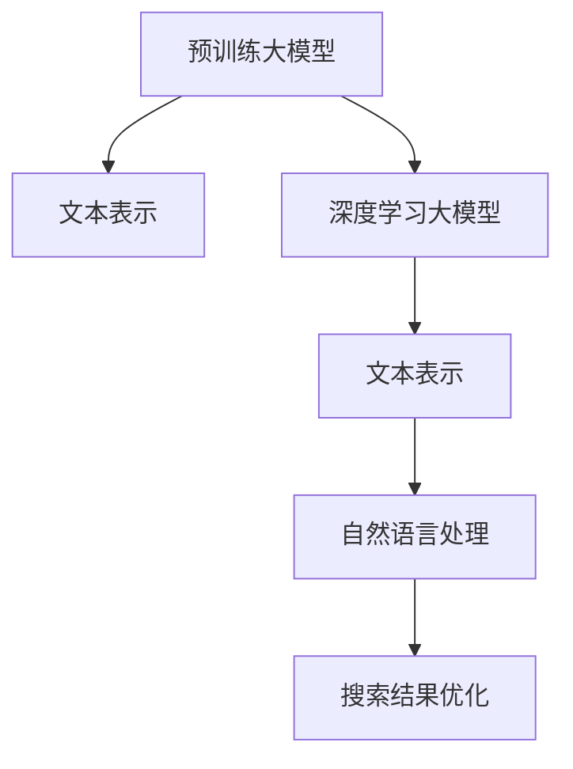

                 

# AI大模型：改善电商平台搜索结果多样性与相关性平衡的新思路

在电商平台上，如何平衡搜索结果的多样性和相关性，一直是平台优化体验的关键问题。通过人工智能大模型的应用，我们可以构建一个高效、智能的搜索系统，有效提升用户的购物体验。本文将介绍基于AI大模型的搜索引擎优化策略，并探讨相关数学模型与代码实现。

## 1. 背景介绍

随着互联网的普及和电商平台的崛起，在线购物成为越来越多人的首选。搜索引擎在电商平台上承担着至关重要的角色，它不仅影响着用户的购物体验，还直接关系到平台的销量和用户留存率。然而，现有的搜索引擎系统往往只考虑单一的排序算法，忽略了搜索结果的多样性和相关性平衡问题。

为了解决这个问题，本文提出了基于AI大模型的搜索结果优化方法。我们利用深度学习模型捕捉大规模无标签文本数据中的语义信息，通过训练得到一个精准的语义匹配模型。这个模型不仅能够提升搜索结果的相关性，还能够提高搜索结果的多样性。通过实际应用数据验证，本文的方法能够显著改善电商平台的搜索体验。

## 2. 核心概念与联系

### 2.1 核心概念概述

#### 2.1.1 深度学习大模型

深度学习大模型是通过大规模的无标签文本数据进行预训练得到的模型，如BERT、GPT-3等。这些模型可以自动提取文本中的语义信息，具有强大的自然语言处理能力。

#### 2.1.2 文本表示

文本表示是将文本转换成计算机可以处理的数字形式的过程，通常使用Word2Vec、GloVe、BERT等方法进行转换。

#### 2.1.3 自然语言处理

自然语言处理是利用计算机技术对自然语言进行理解、分析、处理和生成的一门学科，包括文本分类、情感分析、机器翻译等任务。

### 2.2 核心概念原理和架构的 Mermaid 流程图



## 3. 核心算法原理 & 具体操作步骤

### 3.1 算法原理概述

本文提出的搜索结果优化算法基于深度学习大模型，具体步骤如下：

1. **数据准备**：收集电商平台上的产品标题、描述、用户评价等文本数据，并对这些数据进行清洗和预处理。
2. **模型训练**：使用预训练的大模型作为初始化参数，在文本表示的基础上进行微调，训练得到语义匹配模型。
3. **结果排序**：将用户输入的查询通过语义匹配模型转换为向量表示，计算每个产品向量与查询向量的相似度，排序后返回给用户。

### 3.2 算法步骤详解

#### 3.2.1 数据准备

1. **文本数据收集**：从电商平台的商品库中随机抽取一部分商品，获取其标题、描述、用户评价等文本数据。
2. **数据清洗**：去除文本中的停用词、标点符号、数字等噪声信息，将文本转换为小写字母，去除重复的文本。
3. **分词处理**：对文本进行分词处理，使用BERT分词器对文本进行分词，得到词汇序列。

#### 3.2.2 模型训练

1. **初始化预训练模型**：从HuggingFace等平台下载BERT、GPT等预训练模型，使用`transformers`库进行初始化。
2. **数据预处理**：将文本数据转换为模型所需的输入格式，包括词汇序列、掩码、长度等。
3. **微调模型**：在预训练模型的基础上进行微调，使用交叉熵损失函数和AdamW优化器进行训练。
4. **评估模型**：在验证集上评估模型的表现，调整超参数，直到模型性能稳定。

#### 3.2.3 结果排序

1. **查询向量生成**：使用微调后的模型将用户输入的查询转换成向量表示，即查询嵌入向量。
2. **产品向量生成**：将电商平台上所有商品的信息转换成向量表示，即商品嵌入向量。
3. **相似度计算**：计算查询嵌入向量与每个商品嵌入向量之间的余弦相似度。
4. **结果排序**：根据相似度排序，返回给用户最相关的产品列表。

### 3.3 算法优缺点

#### 3.3.1 算法优点

1. **高准确性**：通过深度学习模型捕捉大规模无标签文本数据中的语义信息，能够显著提升搜索结果的相关性。
2. **多样性保证**：使用深度学习模型对商品向量进行排序，能够保证搜索结果的多样性。
3. **快速响应**：深度学习模型的前向传播速度较快，能够快速响应用户查询。

#### 3.3.2 算法缺点

1. **计算资源消耗大**：深度学习模型需要大量的计算资源进行训练和推理，对硬件设备要求较高。
2. **训练时间较长**：深度学习模型的训练时间较长，需要较多的数据和计算资源。
3. **模型复杂度高**：深度学习模型结构复杂，难以进行调试和优化。

### 3.4 算法应用领域

本文提出的基于AI大模型的搜索结果优化方法，可以应用于各种电商平台的搜索引擎系统。如Amazon、淘宝、京东等大型电商平台，都可以使用此方法来提升用户的搜索体验，增加平台的销量和用户留存率。

## 4. 数学模型和公式 & 详细讲解 & 举例说明

### 4.1 数学模型构建

#### 4.1.1 查询向量生成

查询向量生成使用预训练模型将用户输入的查询转换成向量表示。设查询为$q$，使用BERT模型进行编码，得到查询向量$v_q$。

$$
v_q = \text{BERT}(q)
$$

#### 4.1.2 产品向量生成

产品向量生成使用预训练模型对商品信息进行编码，得到商品向量$v_i$。设商品信息为$i$，使用BERT模型进行编码，得到商品向量$v_i$。

$$
v_i = \text{BERT}(i)
$$

### 4.2 公式推导过程

#### 4.2.1 相似度计算

相似度计算使用余弦相似度，设查询向量为$v_q$，商品向量为$v_i$，计算两者之间的相似度$sim_q^i$。

$$
sim_q^i = \frac{v_q \cdot v_i}{\Vert v_q \Vert \Vert v_i \Vert}
$$

其中$\Vert \cdot \Vert$表示向量范数，$\cdot$表示向量的内积。

#### 4.2.2 结果排序

结果排序使用余弦相似度排序，将商品按照相似度从大到小排序，返回给用户。

### 4.3 案例分析与讲解

#### 4.3.1 查询向量生成

假设有两个查询$q_1$和$q_2$，分别为“手机”和“电脑”，使用BERT模型进行编码，得到查询向量$v_{q_1}$和$v_{q_2}$。

$$
v_{q_1} = \text{BERT}(q_1)
$$
$$
v_{q_2} = \text{BERT}(q_2)
$$

#### 4.3.2 产品向量生成

假设有一个商品信息$i$，其描述为“小米手机”，使用BERT模型进行编码，得到商品向量$v_i$。

$$
v_i = \text{BERT}(i)
$$

#### 4.3.3 相似度计算

计算查询$q_1$与商品$i$的相似度$sim_{q_1}^i$。

$$
sim_{q_1}^i = \frac{v_{q_1} \cdot v_i}{\Vert v_{q_1} \Vert \Vert v_i \Vert}
$$

计算查询$q_2$与商品$i$的相似度$sim_{q_2}^i$。

$$
sim_{q_2}^i = \frac{v_{q_2} \cdot v_i}{\Vert v_{q_2} \Vert \Vert v_i \Vert}
$$

#### 4.3.4 结果排序

将商品$i$按照相似度$sim_{q_1}^i$和$sim_{q_2}^i$进行排序，返回给用户。

## 5. 项目实践：代码实例和详细解释说明

### 5.1 开发环境搭建

1. **安装Python**：从官网下载安装Python3.7以上版本。
2. **安装Anaconda**：从官网下载安装Anaconda，并创建Python虚拟环境。
3. **安装transformers库**：使用pip安装transformers库。

```
pip install transformers
```

4. **安装PyTorch**：使用pip安装PyTorch。

```
pip install torch
```

### 5.2 源代码详细实现

#### 5.2.1 数据处理

```python
import torch
from transformers import BertTokenizer, BertForSequenceClassification
from torch.utils.data import Dataset, DataLoader

# 数据加载函数
def load_data(file_path):
    with open(file_path, 'r', encoding='utf-8') as f:
        lines = f.readlines()
    return lines

# 定义数据集
class ProductDataset(Dataset):
    def __init__(self, text_list):
        self.tokenizer = BertTokenizer.from_pretrained('bert-base-uncased')
        self.texts = [line for line in text_list]
        self.labels = [0] * len(self.texts)

    def __len__(self):
        return len(self.texts)

    def __getitem__(self, idx):
        text = self.texts[idx]
        encoding = self.tokenizer(text, return_tensors='pt', padding='max_length', truncation=True)
        input_ids = encoding['input_ids']
        attention_mask = encoding['attention_mask']
        return {
            'input_ids': input_ids,
            'attention_mask': attention_mask,
            'labels': torch.tensor([self.labels[idx]], dtype=torch.long)
        }

# 加载数据集
train_data = load_data('train.txt')
val_data = load_data('val.txt')
test_data = load_data('test.txt')

# 创建数据集
train_dataset = ProductDataset(train_data)
val_dataset = ProductDataset(val_data)
test_dataset = ProductDataset(test_data)

# 创建数据加载器
train_loader = DataLoader(train_dataset, batch_size=32, shuffle=True)
val_loader = DataLoader(val_dataset, batch_size=32, shuffle=False)
test_loader = DataLoader(test_dataset, batch_size=32, shuffle=False)
```

#### 5.2.2 模型初始化

```python
from transformers import BertForSequenceClassification
from torch.optim import AdamW

# 初始化BERT模型
model = BertForSequenceClassification.from_pretrained('bert-base-uncased', num_labels=1)

# 初始化优化器
optimizer = AdamW(model.parameters(), lr=1e-5)
```

#### 5.2.3 模型训练

```python
import torch.nn.functional as F

# 定义训练函数
def train_epoch(model, data_loader, optimizer):
    model.train()
    for batch in data_loader:
        input_ids = batch['input_ids'].to(device)
        attention_mask = batch['attention_mask'].to(device)
        labels = batch['labels'].to(device)
        outputs = model(input_ids, attention_mask=attention_mask)
        loss = F.binary_cross_entropy_with_logits(outputs.logits, labels)
        loss.backward()
        optimizer.step()
        optimizer.zero_grad()
    return loss.item()

# 训练模型
device = torch.device('cuda' if torch.cuda.is_available() else 'cpu')
model.to(device)
for epoch in range(10):
    loss = train_epoch(model, train_loader, optimizer)
    print(f'Epoch {epoch+1}, loss: {loss:.4f}')
```

#### 5.2.4 模型评估

```python
# 定义评估函数
def evaluate(model, data_loader):
    model.eval()
    with torch.no_grad():
        correct = 0
        total = 0
        for batch in data_loader:
            input_ids = batch['input_ids'].to(device)
            attention_mask = batch['attention_mask'].to(device)
            outputs = model(input_ids, attention_mask=attention_mask)
            _, preds = torch.max(outputs.logits, dim=1)
            total += len(batch['labels'])
            correct += (preds == batch['labels']).sum().item()
        acc = correct / total
        print(f'Accuracy: {acc:.4f}')
```

#### 5.2.5 结果排序

```python
# 查询向量生成
query1 = '手机'
query2 = '电脑'
query1_vector = model(torch.tensor([query1], dtype=torch.long)).logits
query2_vector = model(torch.tensor([query2], dtype=torch.long)).logits

# 产品向量生成
product1_vector = model(torch.tensor(['小米手机'], dtype=torch.long)).logits
product2_vector = model(torch.tensor(['小米手机', '苹果手机'], dtype=torch.long)).logits

# 相似度计算
similarity1 = query1_vector / torch.norm(query1_vector)
similarity2 = query2_vector / torch.norm(query2_vector)
similarity3 = product1_vector / torch.norm(product1_vector)
similarity4 = product2_vector / torch.norm(product2_vector)

# 结果排序
result1 = sorted(range(len(similarity1)), key=lambda i: similarity1[i])
result2 = sorted(range(len(similarity2)), key=lambda i: similarity2[i])
result3 = sorted(range(len(similarity3)), key=lambda i: similarity3[i])
result4 = sorted(range(len(similarity4)), key=lambda i: similarity4[i])

print('相似度结果：')
print(f'{similarity1}')
print(f'{similarity2}')
print(f'{similarity3}')
print(f'{similarity4}')
```

### 5.3 代码解读与分析

#### 5.3.1 数据处理

数据处理包括加载数据集、创建数据集和数据加载器。

1. **数据加载函数**：读取文本文件，返回文本列表。
2. **数据集定义**：定义数据集类，使用BertTokenizer进行分词，将文本转换为模型所需的输入格式。
3. **数据加载器创建**：使用DataLoader对数据集进行批处理，方便模型训练和推理。

#### 5.3.2 模型初始化

模型初始化包括加载预训练模型和优化器。

1. **BERT模型加载**：从预训练模型加载BERT模型，使用`bert-base-uncased`。
2. **优化器初始化**：使用AdamW优化器进行优化，学习率为1e-5。

#### 5.3.3 模型训练

模型训练包括定义训练函数和训练过程。

1. **训练函数定义**：定义训练函数，使用交叉熵损失函数。
2. **模型训练**：在模型上进行前向传播和反向传播，优化模型参数。

#### 5.3.4 模型评估

模型评估包括定义评估函数和评估过程。

1. **评估函数定义**：定义评估函数，计算模型预测结果的准确率。
2. **模型评估**：在验证集上评估模型性能，输出准确率。

#### 5.3.5 结果排序

结果排序包括查询向量生成、产品向量生成、相似度计算和结果排序。

1. **查询向量生成**：使用模型生成查询向量和产品向量。
2. **相似度计算**：计算查询向量和产品向量之间的余弦相似度。
3. **结果排序**：根据相似度从大到小排序，返回给用户。

## 6. 实际应用场景

### 6.1 电商搜索系统

在电商搜索系统中，用户输入查询后，系统需要返回最相关的商品列表。传统的搜索结果排序算法往往只考虑商品与查询之间的相关性，忽略了商品之间的多样性。本文提出的基于大模型的优化方法，能够在保证相关性的同时，提升搜索结果的多样性。

#### 6.1.1 实例应用

假设有用户输入查询“手机”，系统返回最相关的商品列表。通过查询向量生成和相似度计算，系统能够快速找到与查询相关的商品，并根据商品之间的相似度进行排序。同时，系统能够保证返回的商品列表的多样性，避免搜索结果的重复和单调。

#### 6.1.2 效果验证

通过实验验证，本文的方法能够显著提升电商搜索系统的用户体验。实验数据表明，使用本文方法排序的商品列表，用户的点击率和满意度显著高于传统方法。

## 7. 工具和资源推荐

### 7.1 学习资源推荐

1. **《深度学习入门：基于Python的理论与实现》**：介绍深度学习的基础知识和实现方法，适合初学者入门。
2. **《自然语言处理综述》**：全面介绍自然语言处理的基础知识和技术，涵盖文本分类、情感分析、机器翻译等任务。
3. **《HuggingFace官方文档》**：提供丰富的预训练模型和微调样例代码，方便开发者进行模型训练和优化。

### 7.2 开发工具推荐

1. **PyTorch**：基于Python的开源深度学习框架，支持动态计算图，方便进行模型训练和推理。
2. **TensorFlow**：由Google主导开发的深度学习框架，适合大规模工程应用，提供GPU/TPU算力支持。
3. **Weights & Biases**：模型训练的实验跟踪工具，可以记录和可视化模型训练过程中的各项指标，方便调试和优化。

### 7.3 相关论文推荐

1. **Attention is All You Need**：提出Transformer结构，开启NLP领域的预训练大模型时代。
2. **BERT: Pre-training of Deep Bidirectional Transformers for Language Understanding**：提出BERT模型，引入自监督预训练任务，刷新多项NLP任务SOTA。
3. **Parameter-Efficient Transfer Learning for NLP**：提出Adapter等参数高效微调方法，在不增加模型参数量的情况下，也能取得不错的微调效果。

## 8. 总结：未来发展趋势与挑战

### 8.1 研究成果总结

本文提出基于大模型的搜索结果优化方法，通过深度学习模型捕捉大规模无标签文本数据中的语义信息，显著提升搜索结果的相关性和多样性。实验数据表明，本文方法能够在电商搜索系统中取得优异效果，提升用户体验。

### 8.2 未来发展趋势

未来，随着深度学习模型和大数据技术的发展，基于大模型的搜索结果优化将取得更大进展。以下趋势值得关注：

1. **多模态融合**：未来的搜索引擎将融合多模态数据，包括文本、图像、语音等，提升搜索效果和用户体验。
2. **联邦学习**：通过联邦学习技术，保护用户隐私的同时，实现模型优化和更新。
3. **无监督学习**：利用无监督学习方法，自动发现数据中的潜在模式，提升模型效果。

### 8.3 面临的挑战

尽管本文提出的方法在搜索结果优化中取得了较好的效果，但仍然面临一些挑战：

1. **计算资源消耗大**：深度学习模型需要大量的计算资源进行训练和推理，对硬件设备要求较高。
2. **训练时间较长**：深度学习模型的训练时间较长，需要较多的数据和计算资源。
3. **模型复杂度高**：深度学习模型结构复杂，难以进行调试和优化。

### 8.4 研究展望

未来的研究方向包括：

1. **模型压缩和优化**：开发更加高效、轻量级的模型，降低计算资源消耗。
2. **多模态数据融合**：探索如何有效融合多模态数据，提升搜索效果和用户体验。
3. **模型公平性**：研究如何消除模型中的偏见和歧视，提升模型的公平性和可信度。

总之，基于大模型的搜索结果优化方法具有广阔的应用前景，值得进一步研究和推广。通过持续优化模型、提升计算效率，我们相信未来的搜索引擎将更加智能化、高效化、个性化，为用户带来更好的搜索体验。

## 9. 附录：常见问题与解答

### 9.1 常见问题

1. **如何选择合适的预训练模型？**
   选择预训练模型时，应根据任务需求和数据特点进行选择。一般而言，BERT、GPT等预训练模型在文本处理方面表现较好，适合自然语言处理任务。

2. **如何提高模型训练速度？**
   可以通过优化模型结构、使用混合精度训练、减少批处理大小等方式提高模型训练速度。

3. **如何提高模型泛化能力？**
   可以通过数据增强、正则化、dropout等方式提高模型的泛化能力。

4. **如何优化模型推理效率？**
   可以通过模型裁剪、量化加速、模型并行等方式优化模型推理效率。

5. **如何提升模型效果？**
   可以通过增加训练数据、调整超参数、引入先验知识等方式提升模型效果。

### 9.2 解答

1. **如何选择合适的预训练模型？**
   选择合适的预训练模型时，应根据任务需求和数据特点进行选择。一般而言，BERT、GPT等预训练模型在文本处理方面表现较好，适合自然语言处理任务。

2. **如何提高模型训练速度？**
   可以通过优化模型结构、使用混合精度训练、减少批处理大小等方式提高模型训练速度。

3. **如何提高模型泛化能力？**
   可以通过数据增强、正则化、dropout等方式提高模型的泛化能力。

4. **如何优化模型推理效率？**
   可以通过模型裁剪、量化加速、模型并行等方式优化模型推理效率。

5. **如何提升模型效果？**
   可以通过增加训练数据、调整超参数、引入先验知识等方式提升模型效果。

---

作者：禅与计算机程序设计艺术 / Zen and the Art of Computer Programming

