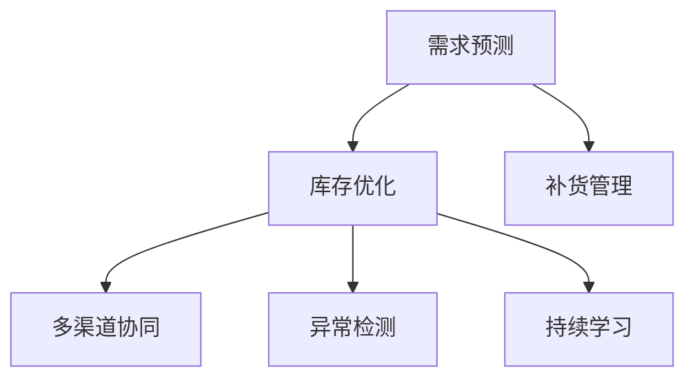

                 

# AI如何优化电商平台的库存管理

## 1. 背景介绍

### 1.1 问题由来
在电商领域，库存管理一直是商家关注的热点问题。库存过高，会占用大量资金，导致资金链紧张；库存过低，又会错过销售机会，影响用户体验和销售额。因此，如何平衡库存水平，最大化运营效率和收益，是电商商家面临的重要挑战。

近年来，随着AI技术和大数据分析的迅猛发展，基于AI的库存管理系统开始崭露头角，成为电商平台优化库存管理的重要手段。通过机器学习算法和大数据分析，AI可以预测销售趋势，优化库存水平，提升补货效率，从而实现更高效的库存管理。

### 1.2 问题核心关键点
AI优化电商库存管理的核心在于以下几个方面：
1. 需求预测：准确预测未来的销售需求，合理规划库存水平。
2. 库存优化：基于预测结果，智能调整库存，平衡资金和销售需求。
3. 补货管理：自动化补货策略，确保及时补充库存。
4. 多渠道协同：整合线上线下库存信息，实现多渠道协同补货。
5. 异常检测：识别库存异常，及时采取措施。
6. 持续学习：通过历史数据不断优化预测模型，提升预测精度。

## 2. 核心概念与联系

### 2.1 核心概念概述

为更好地理解AI优化电商平台库存管理的过程，本节将介绍几个密切相关的核心概念：

- 需求预测(Demand Forecasting)：通过历史销售数据、市场趋势、节假日等因素，预测未来销售量。需求预测是库存管理的基础。
- 库存优化(Inventory Optimization)：基于需求预测结果，合理调整库存水平，平衡成本和收益。
- 补货管理(Supply Chain Management)：根据库存水平和需求预测，制定自动化补货策略，确保库存充足。
- 多渠道协同(Cross-Channel Integration)：将线上线下库存信息整合，实现多渠道库存同步管理。
- 异常检测(Anomaly Detection)：实时监测库存状态，识别异常情况，及时采取措施。
- 持续学习(Continual Learning)：通过不断累积和更新数据，持续优化预测模型，提高预测准确度。

这些核心概念之间的逻辑关系可以通过以下Mermaid流程图来展示：



这个流程图展示了大语言模型的核心概念及其之间的关系：

1. 需求预测对库存优化和补货管理都有直接影响。
2. 库存优化和补货管理需要考虑多渠道协同和多渠道异常检测。
3. 库存优化和补货管理同时伴随着持续学习，不断提高预测精度和补货效率。

## 3. 核心算法原理 & 具体操作步骤
### 3.1 算法原理概述

AI优化电商库存管理，本质上是一个多变量优化问题。其核心思想是：利用历史销售数据和市场趋势，通过机器学习算法预测未来销售需求，根据需求预测结果，动态调整库存水平，优化补货策略，实现库存管理的自动化和智能化。

形式化地，假设库存状态为 $x$，需求预测模型为 $y=\hat{y}(\text{data})$，库存优化目标为最小化成本和收益差值，即：

$$
\min_{x,y} \mathcal{L}(x, y)
$$

其中 $\mathcal{L}$ 为损失函数，可以表示为成本函数与收益函数的差值。通过梯度下降等优化算法，不断更新库存水平和需求预测模型参数，最小化损失函数，最终得到最优的库存水平和需求预测模型。

### 3.2 算法步骤详解

基于AI的电商库存管理一般包括以下几个关键步骤：

**Step 1: 数据收集与预处理**
- 收集历史销售数据、市场趋势、节假日、促销活动等相关信息。
- 数据清洗和标准化，去除异常值和噪声，确保数据质量。

**Step 2: 需求预测模型训练**
- 选择合适的机器学习算法，如ARIMA、LSTM、GRU、XGBoost等，对历史数据进行训练。
- 通过交叉验证和模型调参，选择最优的预测模型和参数。

**Step 3: 库存优化与补货管理**
- 根据需求预测结果，计算最优库存水平。
- 设计自动化补货策略，确定补货周期和补货量。
- 实时监测库存状态，及时调整补货策略。

**Step 4: 异常检测与反馈优化**
- 实时监测库存状态，识别异常情况，如断货、积压等。
- 采取相应措施，如调整补货策略、优化供应链。
- 记录异常情况和处理结果，持续优化需求预测模型。

**Step 5: 持续学习与系统部署**
- 通过新数据不断更新需求预测模型，持续提高预测精度。
- 将优化后的库存管理模型部署到实际应用系统中，进行实时监控和优化。
- 定期评估模型性能，优化算法和模型参数，提升系统效果。

以上是AI优化电商库存管理的完整流程。在实际应用中，还需要针对具体业务需求，对各环节进行优化设计，如改进预测算法，引入更多相关特征，设计灵活的补货策略等。

### 3.3 算法优缺点

AI优化电商库存管理具有以下优点：
1. 准确预测：基于历史数据的机器学习算法，可以精准预测未来销售需求。
2. 实时优化：通过实时监测和动态调整，实现库存管理的智能化。
3. 自动化补货：自动化补货策略，减少人工干预，提升效率。
4. 多渠道协同：整合线上线下库存信息，实现多渠道库存同步。
5. 持续学习：通过不断累积和更新数据，持续优化模型，提高预测精度。

同时，该方法也存在一定的局限性：
1. 数据质量依赖：预测精度依赖于数据的质量和全面性，获取高质量数据成本较高。
2. 市场变化适应性：当市场趋势发生显著变化时，预测模型的适应性较差。
3. 系统复杂度：涉及数据处理、模型训练、库存优化等多个环节，系统设计复杂。
4. 实时性要求高：实时库存监测和动态调整要求系统具备较高的计算和通信能力。
5. 异常情况处理：实时识别和处理异常情况，需要设计和实现复杂的算法和机制。

尽管存在这些局限性，但AI优化库存管理仍然是一种高效、智能的库存管理方式，已经在许多电商平台上得到了广泛应用，并取得了显著的效果。

### 3.4 算法应用领域

AI优化电商库存管理技术，已经在多个电商平台上得到了应用，覆盖了库存预测、补货管理、多渠道协同等多个方面，具体如下：

- 需求预测：基于历史销售数据、市场趋势、节假日等因素，预测未来销售需求。
- 库存优化：根据预测结果，调整库存水平，平衡成本和收益。
- 补货管理：制定自动化补货策略，确保及时补充库存。
- 多渠道协同：整合线上线下库存信息，实现多渠道库存同步管理。
- 异常检测：实时监测库存状态，识别异常情况，及时采取措施。
- 持续学习：通过历史数据不断优化预测模型，提高预测精度。

这些应用场景显示了AI在电商库存管理中的巨大潜力，为电商平台带来了显著的运营效率和收益提升。

## 4. 数学模型和公式 & 详细讲解  
### 4.1 数学模型构建

本节将使用数学语言对AI优化电商库存管理的数学模型进行更加严格的刻画。

记库存状态为 $x$，需求预测模型为 $y=\hat{y}(\text{data})$，需求预测模型的损失函数为 $\mathcal{L}(y,\hat{y})$，则库存优化的目标函数为：

$$
\min_{x,y} \mathcal{L}(x, y)
$$

其中，库存状态 $x$ 可以是库存数量、库存金额等。

需求预测模型的损失函数 $\mathcal{L}(y,\hat{y})$ 可以是均方误差损失、平均绝对误差损失等，具体形式如下：

$$
\mathcal{L}(y,\hat{y}) = \frac{1}{N}\sum_{i=1}^N (y_i - \hat{y}_i)^2
$$

库存优化目标函数可以表示为成本函数 $C(x)$ 和收益函数 $R(y)$ 的差值，即：

$$
\mathcal{L}(x, y) = C(x) + R(y) - y
$$

其中，$C(x)$ 表示库存持有成本，$R(y)$ 表示销售收益，$y$ 表示预测的销售量。

### 4.2 公式推导过程

以下我们以时间序列需求预测模型为例，推导基于ARIMA模型的需求预测损失函数。

假设需求预测模型为 $y_t = \hat{y}_t(\text{data})$，其中 $\hat{y}_t$ 为时间 $t$ 的需求预测值。则基于ARIMA模型的需求预测损失函数为：

$$
\mathcal{L}(y_t,\hat{y}_t) = \frac{1}{N}\sum_{i=1}^N (y_i - \hat{y}_i)^2
$$

将其代入总体损失函数，得：

$$
\mathcal{L}(x, y) = C(x) + R(y) - \frac{1}{N}\sum_{i=1}^N (y_i - \hat{y}_i)^2
$$

在得到总体损失函数后，即可利用梯度下降等优化算法进行求解。具体步骤如下：

1. 初始化库存水平 $x_0$ 和预测模型 $y_0$。
2. 计算当前库存水平和预测模型的损失函数值 $\mathcal{L}(x_0, y_0)$。
3. 计算损失函数对库存水平 $x$ 和预测模型 $y$ 的梯度。
4. 根据梯度下降公式，更新库存水平和预测模型参数。
5. 重复步骤2-4，直至收敛。

### 4.3 案例分析与讲解

下面以某电商平台为例，分析其基于AI的需求预测和库存优化过程：

假设该平台的历史销售数据如下：

| 时间  | 销售量 | 库存量 | 库存成本 | 销售收益 |
|-------|-------|-------|---------|---------|
| 第1周 | 1000  | 500   | 100     | 300     |
| 第2周 | 1500  | 600   | 120     | 350     |
| 第3周 | 1800  | 700   | 140     | 380     |
| ...   | ...   | ...   | ...     | ...     |

设 $C(x)$ 为库存持有成本，$R(y)$ 为销售收益，则库存优化的目标函数可以表示为：

$$
\mathcal{L}(x, y) = C(x) + R(y) - \frac{1}{N}\sum_{i=1}^N (y_i - \hat{y}_i)^2
$$

假设初始库存水平为 $x_0 = 500$，需求预测模型为 $y = \hat{y}(\text{data})$，其中 $\text{data}$ 为历史销售数据。通过训练模型，得到预测结果 $\hat{y}_1 = 1000$，$\hat{y}_2 = 1500$，$\hat{y}_3 = 1800$。

初始库存水平和预测模型的损失函数值为：

$$
\mathcal{L}(x_0, y_0) = C(500) + R(1000) - (1000-1000)^2 = 100 + 300 - 0 = 400
$$

计算损失函数对库存水平和预测模型的梯度，得到：

$$
\frac{\partial \mathcal{L}}{\partial x} = \frac{\partial C(x)}{\partial x}, \quad \frac{\partial \mathcal{L}}{\partial y} = \frac{\partial R(y)}{\partial y} - \frac{2}{N}\sum_{i=1}^N (y_i - \hat{y}_i)
$$

根据梯度下降公式，更新库存水平和预测模型参数：

$$
x_1 = x_0 - \eta \frac{\partial \mathcal{L}}{\partial x} = 500 - \eta \frac{\partial C(x)}{\partial x}
$$

$$
y_1 = y_0 - \eta \frac{\partial \mathcal{L}}{\partial y} = \hat{y}(\text{data}) - \eta \left( \frac{\partial R(y)}{\partial y} - \frac{2}{N}\sum_{i=1}^N (y_i - \hat{y}_i) \right)
$$

其中 $\eta$ 为学习率。通过不断迭代，直至损失函数收敛，得到最优的库存水平和预测模型。

## 5. 项目实践：代码实例和详细解释说明
### 5.1 开发环境搭建

在进行AI优化库存管理实践前，我们需要准备好开发环境。以下是使用Python进行Pandas和TensorFlow开发的环境配置流程：

1. 安装Anaconda：从官网下载并安装Anaconda，用于创建独立的Python环境。

2. 创建并激活虚拟环境：
```bash
conda create -n inventory-env python=3.8 
conda activate inventory-env
```

3. 安装Pandas和TensorFlow：
```bash
conda install pandas tensorflow
```

4. 安装TensorBoard：用于可视化训练过程和模型性能。

```bash
pip install tensorboard
```

5. 安装必要的库：
```bash
pip install matplotlib seaborn scikit-learn numpy
```

完成上述步骤后，即可在`inventory-env`环境中开始AI优化库存管理的实践。

### 5.2 源代码详细实现

下面是使用TensorFlow实现AI优化库存管理的代码示例：

```python
import tensorflow as tf
import pandas as pd
import matplotlib.pyplot as plt
import seaborn as sns

# 读取历史销售数据
data = pd.read_csv('sales_data.csv')

# 数据预处理
data = data.dropna()
data['week'] = pd.to_datetime(data['date']).dt.week

# 特征工程
features = ['week', 'season', 'day', 'weekday', 'holiday', 'workday', 'weather', 'sales']
targets = 'sales'

# 数据分割
train_data = data[features]
train_targets = data[targets]
val_data = data[features]
val_targets = data[targets]

# 特征缩放
scaler = tf.keras.preprocessing.scale.RangeScaler(feature_range=(0, 1))
train_data = scaler.fit_transform(train_data)
val_data = scaler.transform(val_data)

# 构建模型
model = tf.keras.Sequential([
    tf.keras.layers.Dense(128, activation='relu', input_shape=(train_data.shape[1],)),
    tf.keras.layers.Dense(64, activation='relu'),
    tf.keras.layers.Dense(1)
])

# 编译模型
model.compile(optimizer=tf.keras.optimizers.Adam(learning_rate=0.001), loss='mse', metrics=['mae'])

# 训练模型
history = model.fit(train_data, train_targets, epochs=100, batch_size=32, validation_data=(val_data, val_targets))

# 模型评估
mse = model.evaluate(val_data, val_targets, verbose=0)

# 绘制训练过程
sns.lineplot(x=range(len(history.history['loss'])), y=history.history['loss'], label='Training Loss')
sns.lineplot(x=range(len(history.history['val_loss'])), y=history.history['val_loss'], label='Validation Loss')
plt.legend()
plt.show()
```

### 5.3 代码解读与分析

让我们再详细解读一下关键代码的实现细节：

**数据预处理**：
- 读取历史销售数据，并去除了缺失值。
- 将日期转换为周数，作为时间序列特征。
- 进行特征工程，提取相关特征。

**模型构建**：
- 使用TensorFlow构建了一个简单的神经网络模型，包括3个全连接层。
- 使用Adam优化器和均方误差损失函数进行模型训练。

**模型评估**：
- 在验证集上评估模型性能，输出均方误差。
- 绘制训练过程中的损失函数曲线，观察模型训练效果。

## 6. 实际应用场景
### 6.1 智能补货系统

智能补货系统是AI优化库存管理的重要应用场景之一。通过需求预测和库存优化，智能补货系统可以自动调整补货策略，确保库存充足，减少缺货情况，提升用户体验。

在技术实现上，智能补货系统可以整合电商平台的历史销售数据、市场趋势、促销活动等信息，通过机器学习算法预测未来需求，并根据需求预测结果自动调整补货量和时间，确保库存水平在合理范围内波动。同时，系统还可以通过实时监测库存状态，识别断货风险，及时调整补货策略，避免缺货情况的发生。

### 6.2 库存预警系统

库存预警系统利用AI对库存状态进行实时监控，及时发现库存异常情况，如断货、积压等，并进行预警，帮助电商平台及时采取补货或减价等措施，避免库存损失。

通过实时监测库存状态，库存预警系统可以识别断货风险和积压情况，并触发预警机制。具体来说，系统可以根据库存水平、销售量、促销活动等因素，设定库存警戒线，一旦库存水平低于警戒线，系统会自动发送预警通知，提示相关人员及时补货。同时，系统还可以根据预警情况，推荐合适的补货策略，帮助电商平台快速响应库存异常。

### 6.3 跨渠道库存管理

随着电商平台的快速发展，跨渠道库存管理成为重要的需求。AI优化库存管理可以整合线上线下库存信息，实现多渠道库存同步管理，提升整体库存效率。

通过AI优化库存管理，电商平台可以实现以下功能：
- 实时同步线上线下库存信息，确保库存数据的准确性。
- 根据不同渠道的需求，自动调整库存水平，实现库存优化。
- 整合多种渠道的促销活动，动态调整库存补货策略，提升促销效果。

### 6.4 未来应用展望

随着AI技术的不断发展，未来AI优化库存管理技术将进一步提升电商平台的运营效率和收益。以下是一些未来发展的趋势和展望：

1. 实时需求预测：引入实时数据流处理技术，实现更快速、准确的需求预测。
2. 多渠道协同补货：实现多渠道库存数据整合，实时协同补货。
3. 库存异常检测与预警：引入异常检测算法，实时监控库存状态，预警库存异常。
4. 库存动态定价：结合需求预测和库存水平，动态调整商品价格，提升收益。
5. 智能库存预警与补货：引入强化学习算法，优化库存预警和补货策略。

这些趋势展示了AI优化库存管理技术的广阔前景，为电商平台提供了更多的业务优化可能性。相信随着技术的不断进步，AI优化库存管理技术将更好地服务于电商平台，推动电商行业的发展。

## 7. 工具和资源推荐
### 7.1 学习资源推荐

为了帮助开发者系统掌握AI优化电商库存管理的技术基础和实践技巧，这里推荐一些优质的学习资源：

1. 《Python机器学习》：本书详细介绍了机器学习算法和TensorFlow等框架的实现，适合初学者入门。

2. 《深度学习》（Goodfellow等）：该书系统介绍了深度学习的基本理论和实践技巧，适合进阶学习。

3. TensorFlow官方文档：详细介绍了TensorFlow的使用方法和示例，适合进行实践开发。

4. Kaggle竞赛：Kaggle是一个数据科学竞赛平台，包含大量库存管理相关的竞赛和数据集，适合进行实战练习。

5. Coursera机器学习课程：由斯坦福大学开设的机器学习课程，提供高质量的视频教程和作业练习，适合系统学习。

通过对这些资源的学习实践，相信你一定能够快速掌握AI优化电商库存管理的技术要点，并用于解决实际的库存管理问题。

### 7.2 开发工具推荐

高效的开发离不开优秀的工具支持。以下是几款用于AI优化库存管理开发的常用工具：

1. TensorFlow：由Google主导开发的开源深度学习框架，生产部署方便，适合大规模工程应用。

2. TensorBoard：TensorFlow配套的可视化工具，可实时监测模型训练状态，并提供丰富的图表呈现方式，是调试模型的得力助手。

3. Jupyter Notebook：一个基于Web的交互式笔记本环境，适合进行数据分析和模型开发。

4. Anaconda：Python环境的快速搭建和管理工具，适合进行多环境下的快速实验和部署。

5. Git：版本控制系统，适合进行代码协作和版本管理。

合理利用这些工具，可以显著提升AI优化库存管理任务的开发效率，加快创新迭代的步伐。

### 7.3 相关论文推荐

AI优化库存管理技术的发展得益于学界的持续研究。以下是几篇奠基性的相关论文，推荐阅读：

1. "Reinforcement Learning for Inventory Management"（Google，2020）：提出强化学习算法，用于优化库存管理。

2. "A Deep Learning Approach for Inventory Management"（ArXiv，2019）：提出深度学习算法，用于预测需求和优化库存。

3. "Dynamic Pricing for eCommerce Platforms"（IEEE，2018）：提出动态定价模型，结合需求预测和库存优化，提升收益。

4. "Customer Demand Prediction for E-commerce Platforms"（IEEE，2020）：提出基于时间序列分析的需求预测模型，用于库存管理。

这些论文代表了大语言模型微调技术的发展脉络。通过学习这些前沿成果，可以帮助研究者把握学科前进方向，激发更多的创新灵感。

## 8. 总结：未来发展趋势与挑战

### 8.1 总结

本文对AI优化电商平台的库存管理进行了全面系统的介绍。首先阐述了AI优化库存管理的问题由来和核心关键点，明确了需求预测、库存优化、补货管理、多渠道协同、异常检测、持续学习等技术要素的重要性。其次，从原理到实践，详细讲解了AI优化库存管理的数学原理和关键步骤，给出了AI优化库存管理的完整代码实例。同时，本文还广泛探讨了AI优化库存管理技术在智能补货系统、库存预警系统、跨渠道库存管理等多个场景中的应用前景，展示了AI优化库存管理技术的巨大潜力。此外，本文精选了AI优化库存管理技术的各类学习资源，力求为读者提供全方位的技术指引。

通过本文的系统梳理，可以看到，AI优化电商库存管理技术正在成为电商平台优化库存管理的重要手段，极大地提升了电商平台的运营效率和收益。未来，伴随AI技术的不断发展，基于AI的库存管理技术必将进一步优化，推动电商行业的数字化转型升级。

### 8.2 未来发展趋势

展望未来，AI优化电商库存管理技术将呈现以下几个发展趋势：

1. 实时需求预测：引入实时数据流处理技术，实现更快速、准确的需求预测。
2. 多渠道协同补货：实现多渠道库存数据整合，实时协同补货。
3. 库存异常检测与预警：引入异常检测算法，实时监控库存状态，预警库存异常。
4. 库存动态定价：结合需求预测和库存水平，动态调整商品价格，提升收益。
5. 智能库存预警与补货：引入强化学习算法，优化库存预警和补货策略。
6. 多模态需求预测：结合多种数据源，如用户行为、社交媒体、天气等，提升需求预测的准确性。

这些趋势展示了AI优化库存管理技术的广阔前景，为电商平台提供了更多的业务优化可能性。相信随着技术的不断进步，AI优化库存管理技术将更好地服务于电商平台，推动电商行业的发展。

### 8.3 面临的挑战

尽管AI优化库存管理技术已经取得了瞩目成就，但在迈向更加智能化、普适化应用的过程中，它仍面临着诸多挑战：

1. 数据质量依赖：预测精度依赖于数据的质量和全面性，获取高质量数据成本较高。
2. 市场变化适应性：当市场趋势发生显著变化时，预测模型的适应性较差。
3. 系统复杂度：涉及数据处理、模型训练、库存优化等多个环节，系统设计复杂。
4. 实时性要求高：实时库存监测和动态调整要求系统具备较高的计算和通信能力。
5. 异常情况处理：实时识别和处理异常情况，需要设计和实现复杂的算法和机制。

尽管存在这些局限性，但AI优化库存管理仍然是一种高效、智能的库存管理方式，已经在许多电商平台上得到了广泛应用，并取得了显著的效果。

### 8.4 研究展望

面对AI优化库存管理所面临的挑战，未来的研究需要在以下几个方面寻求新的突破：

1. 探索无监督和半监督需求预测方法。摆脱对大规模标注数据的依赖，利用自监督学习、主动学习等无监督和半监督范式，最大限度利用非结构化数据，实现更加灵活高效的需求预测。
2. 研究参数高效和计算高效的库存管理范式。开发更加参数高效的库存管理方法，在固定大部分预训练参数的同时，只更新极少量的任务相关参数。同时优化库存管理的计算图，减少前向传播和反向传播的资源消耗，实现更加轻量级、实时性的部署。
3. 引入更多先验知识。将符号化的先验知识，如知识图谱、逻辑规则等，与神经网络模型进行巧妙融合，引导库存管理过程学习更准确、合理的库存模型。同时加强不同模态数据的整合，实现视觉、语音等多模态信息与文本信息的协同建模。
4. 纳入伦理道德约束。在库存管理目标中引入伦理导向的评估指标，过滤和惩罚有偏见、有害的输出倾向。同时加强人工干预和审核，建立库存管理行为的监管机制，确保输出符合人类价值观和伦理道德。
5. 实时需求预测与库存优化协同。结合实时需求预测和库存优化算法，实现更快速、准确的需求响应和库存调整，提升整体运营效率。

这些研究方向的探索，必将引领AI优化库存管理技术迈向更高的台阶，为构建安全、可靠、可解释、可控的智能库存管理系统铺平道路。面向未来，AI优化库存管理技术还需要与其他人工智能技术进行更深入的融合，如知识表示、因果推理、强化学习等，多路径协同发力，共同推动库存管理系统的进步。只有勇于创新、敢于突破，才能不断拓展库存管理系统的边界，让智能技术更好地造福电商平台的运营。

## 9. 附录：常见问题与解答

**Q1：AI优化库存管理是否适用于所有电商平台？**

A: AI优化库存管理技术在大多数电商平台上都能取得不错的效果，特别是对于数据量较大的平台。但对于一些特定领域的电商平台，如垂直电商、C2C平台等，其数据结构、销售模式和运营特点可能与通用平台有所不同，需要根据具体情况进行模型优化和调整。

**Q2：如何选择合适的需求预测模型？**

A: 选择需求预测模型需要综合考虑数据特点和预测需求。常见的需求预测模型包括时间序列模型（如ARIMA、LSTM）、神经网络模型（如DNN、CNN）、回归模型（如线性回归、随机森林）等。根据历史数据的特点和预测目标，选择合适的模型进行训练和优化。同时，通过交叉验证和模型调参，选择最优的模型和参数。

**Q3：库存管理中如何处理库存异常情况？**

A: 库存异常情况需要及时处理，以避免库存积压或断货。库存预警系统可以通过实时监测库存状态，识别异常情况，并触发预警机制。具体来说，系统可以根据库存水平、销售量、促销活动等因素，设定库存警戒线，一旦库存水平低于警戒线，系统会自动发送预警通知，提示相关人员及时补货。同时，系统还可以根据预警情况，推荐合适的补货策略，帮助电商平台快速响应库存异常。

**Q4：AI优化库存管理是否适用于全渠道库存管理？**

A: AI优化库存管理技术可以整合线上线下库存信息，实现多渠道库存同步管理。具体来说，系统可以整合电商平台、第三方仓库、实体店等多种渠道的库存数据，实现库存状态的实时监控和动态调整。通过跨渠道库存优化，可以提升整体库存效率和运营效率。

**Q5：如何确保AI优化库存管理的实时性？**

A: 确保AI优化库存管理的实时性需要优化数据处理和模型计算效率。具体来说，可以使用数据流处理技术，如Apache Kafka、Apache Flink等，实时处理和传输数据。同时，优化模型结构，采用参数高效和计算高效的库存管理算法，减少计算资源消耗，实现快速响应。

**Q6：如何评估AI优化库存管理的效果？**

A: 评估AI优化库存管理的效果可以从多个方面进行。例如，通过实时库存状态、销售量、库存水平等指标，评估库存管理的实时性、准确性和效率。同时，通过回溯分析和对比实验，评估模型在不同场景下的性能表现。

综上所述，AI优化库存管理技术正在成为电商平台优化库存管理的重要手段，具有广阔的应用前景和巨大的潜力。通过对这些技术要点和应用场景的深入理解，相信你一定能够快速掌握AI优化库存管理的精髓，并用于解决实际的库存管理问题。

