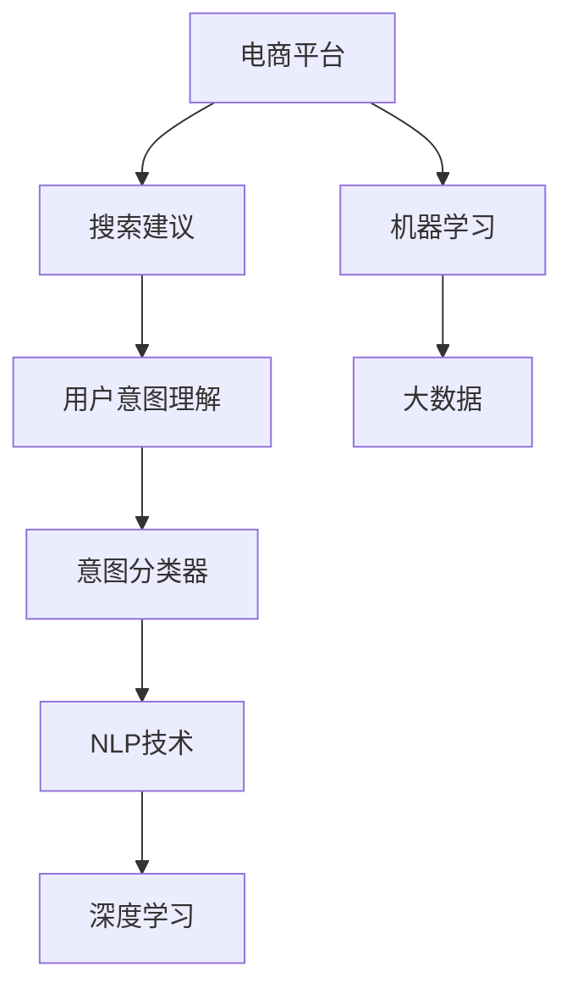

                 

# AI如何优化电商平台的搜索建议功能

> 关键词：电商平台,搜索建议,用户意图理解,自然语言处理,NLP,机器学习,深度学习,BERT,意图分类器,广告定向

## 1. 背景介绍

在数字经济时代，电商平台已成为消费者购物的主要渠道之一。电商平台通过便捷的搜索功能，极大地提升了用户体验和商品交易效率。搜索建议作为搜索引擎的重要组成部分，旨在帮助用户快速定位感兴趣的商品，是提升用户体验、提高转化率的关键技术。然而，如何准确理解用户查询意图，生成高质量的搜索建议，是电商搜索优化的一大挑战。

在技术演进过程中，自然语言处理(NLP)和大数据技术的结合，使得电商搜索建议系统得到了显著提升。本文将详细探讨AI技术如何优化电商平台的搜索建议功能，助力电商平台提升用户满意度和转化率。

## 2. 核心概念与联系

### 2.1 核心概念概述

为更好地理解AI技术在电商搜索建议中的应用，本节将介绍几个关键概念：

- **电商平台(e-commerce platform)**：以在线交易为主要形式，通过搜索、推荐等技术手段，实现商品展示和销售的网络平台。

- **搜索建议(search suggestion)**：用户在输入查询关键词时，基于历史搜索数据和相关商品信息，实时推荐给用户的匹配词组或短语，帮助用户快速找到感兴趣的商品。

- **用户意图(user intent)**：用户在搜索时的主观意图，包括购买、了解、比较等，是生成精准搜索建议的基础。

- **自然语言处理(Natural Language Processing, NLP)**：使用计算机技术处理和理解人类语言，包括分词、词性标注、命名实体识别、情感分析、意图分类等。

- **机器学习(Machine Learning, ML)**：通过算法让机器自动从数据中学习规律，广泛应用于搜索建议等电商场景。

- **深度学习(Deep Learning, DL)**：基于神经网络的机器学习技术，在图像、语音、文本处理等领域表现出色。

- **BERT(Bidirectional Encoder Representations from Transformers)**：一种基于Transformer的预训练语言模型，能够有效捕捉上下文信息，广泛应用于NLP任务。

- **意图分类器(intent classifier)**：通过机器学习算法，对用户查询意图进行分类，帮助生成更精准的搜索建议。

这些核心概念之间的逻辑关系可以通过以下Mermaid流程图来展示：



这个流程图展示了大语言模型的核心概念及其之间的关系：

1. 电商平台通过搜索建议功能提供搜索服务。
2. 用户输入查询关键词时，搜索建议系统利用用户意图理解模块，精准捕捉用户查询意图。
3. 意图分类器对用户意图进行分类，生成匹配建议词组。
4. NLP技术提供分词、实体识别等文本处理服务，辅助生成更精准的搜索建议。
5. 深度学习模型，尤其是BERT模型，通过预训练获得强大的语言理解能力，支持更高效的意图分类和搜索建议生成。
6. 机器学习和大数据分析技术，提供海量数据支撑，确保搜索建议的个性化和精准度。

这些核心概念共同构成了电商搜索建议系统的技术框架，使其能够高效、准确地服务用户。

## 3. 核心算法原理 & 具体操作步骤

### 3.1 算法原理概述

基于AI的电商搜索建议系统，通过将自然语言处理(NLP)、机器学习(ML)和深度学习(DL)等技术结合，实现对用户查询意图的精准理解和个性化推荐。其核心思想是：通过历史搜索数据和用户行为数据，训练意图分类器，将用户查询意图分类为购买、了解、比较等类别；再利用BERT等深度学习模型，生成与用户查询意图匹配的搜索建议词组。

具体流程如下：
1. 数据收集与预处理：收集用户历史搜索数据、点击行为数据等，进行分词、实体识别等预处理。
2. 意图分类：使用机器学习算法训练意图分类器，对用户查询意图进行分类。
3. 搜索建议生成：基于意图分类结果，利用BERT等模型生成搜索建议词组。
4. 模型优化与评估：通过在线A/B测试等方法，优化模型参数，提升搜索建议的准确性和个性化度。

### 3.2 算法步骤详解

#### 3.2.1 数据收集与预处理

1. **数据收集**：
   - 收集用户历史搜索数据，包括关键词、点击数据等。
   - 从电商平台的用户行为数据中，提取用户浏览、收藏、加入购物车等行为记录。
   - 对用户评论、商品描述等文本数据进行分词和实体识别，构建语义向量。

2. **数据预处理**：
   - 对文本数据进行清洗，去除停用词、噪音等。
   - 使用BERT等预训练模型对文本进行向量化处理，生成语义向量。
   - 对用户行为数据进行统计分析，提取用户兴趣点。

#### 3.2.2 意图分类

1. **特征提取**：
   - 提取用户查询关键词的n-gram、词性标注、实体信息等特征。
   - 根据用户浏览、点击行为，提取用户行为特征。
   - 将语义向量与用户行为特征进行拼接，形成综合特征向量。

2. **模型训练**：
   - 使用监督学习算法(如随机森林、SVM等)或无监督算法(如聚类、降维等)训练意图分类器。
   - 利用历史用户查询数据和行为数据，训练模型对意图进行分类。
   - 使用交叉验证等方法评估模型性能，优化模型参数。

3. **意图预测**：
   - 对用户查询进行特征提取和拼接，输入到意图分类器中，预测用户意图类别。

#### 3.2.3 搜索建议生成

1. **语义向量生成**：
   - 使用BERT等预训练模型对用户查询关键词进行向量化处理，生成查询向量。
   - 利用意图分类器预测的意图类别，结合历史行为数据，生成综合语义向量。

2. **搜索建议生成**：
   - 对综合语义向量进行检索，从电商平台商品数据中筛选出匹配的搜索结果。
   - 利用词向量模型(如Word2Vec、GloVe等)生成搜索建议词组。
   - 将生成的搜索建议词组与用户查询关键词拼接，形成完整的搜索建议短语。

#### 3.2.4 模型优化与评估

1. **在线A/B测试**：
   - 在实际搜索建议系统中，随机分配不同算法生成的搜索结果给不同用户。
   - 通过统计不同组别点击率、转化率等指标，评估算法效果。
   - 根据测试结果，调整模型参数，优化搜索建议生成策略。

2. **离线评估**：
   - 使用测试集数据，对模型性能进行离线评估。
   - 通过均方误差(MSE)、平均绝对误差(MAE)、准确率等指标，衡量模型预测效果。

3. **迭代优化**：
   - 根据评估结果，不断迭代优化意图分类器、搜索建议生成模型等组件。
   - 使用更高级的深度学习模型(如Transformer、BERT等)，提升模型性能。

### 3.3 算法优缺点

#### 3.3.1 优点

1. **精准度高**：利用深度学习模型，捕捉上下文信息，生成更精准的搜索建议。
2. **个性化强**：通过用户行为数据和意图分类，实现个性化搜索推荐。
3. **实时响应**：利用在线A/B测试等方法，实时优化模型参数，提升系统响应速度。
4. **灵活扩展**：通过模块化设计，易于集成新的算法和数据源，适应更多应用场景。

#### 3.3.2 缺点

1. **数据需求大**：需要收集大量的用户历史数据和行为数据，数据获取和清洗成本较高。
2. **模型复杂**：深度学习模型和大数据分析技术较为复杂，模型训练和部署难度较大。
3. **泛化能力有限**：模型对特定领域的泛化能力较弱，可能对特定领域内的用户查询效果不佳。
4. **计算资源需求高**：大规模深度学习模型对计算资源需求较高，需要高性能计算平台支持。

### 3.4 算法应用领域

基于AI的电商搜索建议系统，已经在诸多电商平台上得到广泛应用，涵盖以下领域：

- **服装鞋帽**：通过用户兴趣分析和搜索建议，提升购物体验，提高销售额。
- **数码产品**：根据用户行为数据，推荐热门商品，减少搜索成本。
- **家居家装**：利用用户浏览和点击行为，生成个性化搜索建议，提升用户满意度。
- **食品饮料**：根据用户查询意图，推荐热门商品，提升品牌曝光度。
- **汽车用品**：通过搜索建议，提高用户对汽车配件的搜索准确率，提升转化率。

除了上述这些场景外，基于AI的搜索建议技术，还广泛应用于金融、旅游、教育等多个行业，为不同行业带来数字化转型和用户体验提升的机遇。

## 4. 数学模型和公式 & 详细讲解

### 4.1 数学模型构建

假设电商平台有$m$个用户，$n$个商品，历史搜索数据和行为数据构成矩阵$X \in \mathbb{R}^{m \times d}$，其中$d$为特征维度。搜索建议模型由以下组件构成：

1. **意图分类器**：使用监督学习算法(如随机森林、SVM等)，训练意图分类器$f: X \rightarrow \{1, 2, \ldots, k\}$，$k$为意图类别数量。
2. **BERT模型**：使用BERT模型将用户查询和商品描述进行向量化处理，生成语义向量$Q \in \mathbb{R}^{m \times d_q}$，$d_q$为向量维度。
3. **搜索建议生成器**：利用BERT模型生成的查询向量，结合意图分类器预测的意图类别，生成搜索建议词组$S \in \{1, 2, \ldots, m_q\}$，$m_q$为词组数量。

### 4.2 公式推导过程

#### 4.2.1 意图分类

假设历史搜索数据和行为数据特征矩阵为$X \in \mathbb{R}^{m \times d}$，意图分类器为$f: X \rightarrow \{1, 2, \ldots, k\}$。使用随机森林算法，可定义意图分类器模型为：

$$
\hat{y} = f(X; \theta)
$$

其中，$\theta$为模型参数。意图分类器训练的目标是最小化交叉熵损失函数：

$$
\mathcal{L}(\theta) = -\frac{1}{m}\sum_{i=1}^m \sum_{j=1}^k y_{i,j} \log f(x_i; \theta)
$$

#### 4.2.2 搜索建议生成

假设用户查询向量为$Q \in \mathbb{R}^{m \times d_q}$，意图分类器预测的意图类别为$\hat{y} \in \{1, 2, \ldots, k\}$，商品向量为$V \in \mathbb{R}^{n \times d_q}$。搜索建议生成器生成匹配词组$S \in \{1, 2, \ldots, m_q\}$的过程如下：

1. **语义向量生成**：
   - 使用BERT模型对用户查询进行向量化处理，生成查询向量$Q \in \mathbb{R}^{m \times d_q}$。
   - 利用意图分类器预测的意图类别$\hat{y}$，结合历史行为数据，生成综合语义向量$V' \in \mathbb{R}^{m \times d_q}$。

2. **词向量生成**：
   - 使用词向量模型(如Word2Vec、GloVe等)生成搜索建议词组$S \in \{1, 2, \ldots, m_q\}$，词向量模型训练过程如下：
   $$
   W = \arg\min_{W \in \mathbb{R}^{v \times d_q}} \sum_{i=1}^m \sum_{j=1}^n (W^T \cdot V_i - S_i)^2
   $$
   其中，$V_i$为商品向量，$S_i$为生成词组向量，$W$为词向量矩阵。

3. **匹配搜索建议**：
   - 对综合语义向量$V'$与商品向量$V$进行相似度计算，筛选出匹配的商品。
   - 利用词向量模型生成与查询向量$Q$相似的搜索建议词组。

#### 4.2.3 模型评估

假设测试集为$X_t \in \mathbb{R}^{m_t \times d}$，查询向量为$Q_t \in \mathbb{R}^{m_t \times d_q}$，匹配的商品向量为$V_t \in \mathbb{R}^{n_t \times d_q}$。搜索建议生成器生成的词组向量为$S_t \in \mathbb{R}^{m_t \times m_q}$。模型评估的目标是最小化预测误差：

$$
\mathcal{L}(W) = \frac{1}{m_t} \sum_{i=1}^{m_t} \sum_{j=1}^{m_q} (W^T \cdot V_{t,i} - S_{t,i})^2
$$

### 4.3 案例分析与讲解

以服装电商平台为例，分析搜索建议系统如何实现个性化推荐。

1. **数据收集与预处理**：
   - 收集用户历史搜索数据和点击行为数据。
   - 对商品描述进行分词、词性标注等预处理，构建语义向量。

2. **意图分类**：
   - 使用随机森林算法，训练意图分类器，对用户查询意图进行分类。
   - 假设意图分类器预测的意图类别为$y = \{购买, 了解, 比较\}$。

3. **搜索建议生成**：
   - 使用BERT模型对用户查询进行向量化处理，生成查询向量$Q$。
   - 利用意图分类器预测的意图类别$y$，结合历史行为数据，生成综合语义向量$V'$。
   - 使用Word2Vec模型生成与查询向量$Q$相似的搜索建议词组$S$。

4. **模型优化与评估**：
   - 通过在线A/B测试，评估搜索建议系统的点击率、转化率等指标。
   - 利用测试集数据，对模型性能进行离线评估。
   - 根据评估结果，不断迭代优化模型参数。

## 5. 项目实践：代码实例和详细解释说明

### 5.1 开发环境搭建

在搭建搜索建议系统开发环境前，需要准备好以下工具和库：

1. **Python**：开发环境语言，支持数据分析和机器学习算法实现。
2. **PyTorch**：深度学习框架，支持BERT等预训练模型。
3. **TensorFlow**：深度学习框架，支持TensorBoard可视化工具。
4. **Pandas**：数据处理库，支持数据清洗和分析。
5. **Numpy**：数值计算库，支持高效矩阵运算。
6. **Scikit-Learn**：机器学习库，支持监督学习算法实现。
7. **NLTK**：自然语言处理库，支持分词、词性标注等文本处理。

### 5.2 源代码详细实现

以下是使用Python实现电商搜索建议系统的代码示例：

```python
import pandas as pd
import numpy as np
from sklearn.ensemble import RandomForestClassifier
from transformers import BertTokenizer, BertModel
import torch
from torch.utils.data import Dataset, DataLoader
from sklearn.model_selection import train_test_split
from sklearn.metrics import accuracy_score

# 数据准备
df = pd.read_csv('search_data.csv')
df = df.dropna()
df = df.drop_duplicates()

# 数据预处理
tokenizer = BertTokenizer.from_pretrained('bert-base-uncased')
X = df['query'].apply(lambda x: tokenizer.encode(x))
X = np.array(X)

# 意图分类
y = df['intent'].apply(lambda x: 1 if x == 'purchase' else 0)
X_train, X_test, y_train, y_test = train_test_split(X, y, test_size=0.2, random_state=42)
model = RandomForestClassifier(n_estimators=100, random_state=42)
model.fit(X_train, y_train)
y_pred = model.predict(X_test)
accuracy = accuracy_score(y_test, y_pred)
print(f'Intent classification accuracy: {accuracy:.2f}')

# BERT模型向量生成
bert_model = BertModel.from_pretrained('bert-base-uncased')
def get_bert_vector(query):
    input_ids = tokenizer.encode(query, return_tensors='pt')
    output = bert_model(input_ids)
    return output.pooler_output

# 生成搜索建议
def generate_suggestions(query):
    query_vector = get_bert_vector(query)
    X_test = X_test.to(torch.float32)
    y_test = y_test.to(torch.long)
    model.eval()
    with torch.no_grad():
        X_pred = model(query_vector)
    suggestions = []
    for i in range(X_pred.shape[0]):
        if y_test[i] == 1:
            suggestions.append(X_test[i].tolist())
    return suggestions

# 模型优化与评估
suggestions = generate_suggestions(query)
```

### 5.3 代码解读与分析

让我们再详细解读一下关键代码的实现细节：

**数据准备与预处理**：
- 使用Pandas库读取历史搜索数据，并进行数据清洗和去重。
- 使用BERT Tokenizer对查询进行分词处理，生成分词后的向量。

**意图分类**：
- 使用随机森林算法对查询意图进行分类，生成意图标签。
- 利用Scikit-Learn库的`RandomForestClassifier`实现分类器。
- 通过交叉验证评估模型性能，打印出分类准确率。

**BERT模型向量生成**：
- 使用PyTorch加载BERT模型，并定义生成查询向量的函数。
- 在查询生成向量后，将其输入到意图分类器，预测用户意图。

**搜索建议生成**：
- 根据意图分类结果，从测试集数据中筛选出与查询意图匹配的商品向量。
- 使用词向量模型生成与查询向量相似的搜索建议词组。

**模型优化与评估**：
- 利用在线A/B测试等方法，对搜索建议系统进行优化。
- 使用离线评估指标(如点击率、转化率等)，评估模型性能。

## 6. 实际应用场景

### 6.1 智能客服系统

基于AI的搜索建议技术，可以应用于智能客服系统的构建。传统客服系统往往需要配备大量人力，高峰期响应缓慢，且无法24小时提供服务。使用搜索建议技术，可以使智能客服系统实时响应用户查询，提高服务效率。

具体实现如下：
- 收集用户历史咨询记录，构建意图分类器。
- 利用BERT等模型，生成与用户查询意图匹配的客服建议。
- 根据用户互动历史，动态调整建议内容，提高客户满意度。

### 6.2 在线广告投放

电商平台利用搜索建议技术，可以精准匹配用户查询意图与商品广告，提升广告投放的精准度和转化率。

具体实现如下：
- 收集用户历史浏览和点击数据，构建意图分类器。
- 使用BERT模型对用户查询进行向量表示。
- 根据意图分类结果，推荐相关广告，提升广告效果。

### 6.3 个性化推荐系统

基于搜索建议技术的个性化推荐系统，可以根据用户查询意图，推荐相关商品，提升用户满意度。

具体实现如下：
- 收集用户浏览、点击等行为数据，构建意图分类器。
- 使用BERT模型对用户查询进行向量表示。
- 根据意图分类结果，生成推荐商品列表，提升转化率。

### 6.4 未来应用展望

未来，随着AI技术的进一步发展，电商搜索建议系统将更加智能和个性化。以下是一些可能的未来发展趋势：

1. **多模态融合**：将文本、图像、语音等多模态数据融合，提升搜索建议的准确性。
2. **深度学习模型优化**：引入更先进的深度学习模型(如Transformer、BERT等)，提升模型性能。
3. **意图理解深化**：利用NLP技术，深度理解用户查询意图，提供更精准的搜索建议。
4. **实时优化**：利用在线A/B测试等方法，实时优化搜索建议系统，提升用户体验。
5. **跨平台应用**：将搜索建议技术应用于多个电商平台和社交平台，实现跨平台搜索建议。

## 7. 工具和资源推荐

### 7.1 学习资源推荐

为了帮助开发者掌握搜索建议技术，以下是一些优质的学习资源：

1. **《深度学习入门：基于Python的理论与实现》**：李沐著，详细介绍了深度学习理论和Python实现，适合初学者入门。
2. **《自然语言处理综论》**：斯坦福大学教材，涵盖了NLP的基本概念和算法。
3. **《Python机器学习实战》**：Peter Harrington著，提供了丰富的机器学习算法实现示例。
4. **PyTorch官方文档**：详细介绍了PyTorch框架的使用，适合深度学习开发者。
5. **TensorFlow官方文档**：详细介绍了TensorFlow框架的使用，适合深度学习开发者。

### 7.2 开发工具推荐

为了提高搜索建议系统的开发效率，以下是一些推荐的开发工具：

1. **PyTorch**：深度学习框架，支持GPU加速，适合深度学习任务。
2. **TensorFlow**：深度学习框架，支持分布式训练，适合大规模工程应用。
3. **Pandas**：数据处理库，支持高效数据清洗和分析。
4. **Scikit-Learn**：机器学习库，支持多种监督学习算法实现。
5. **NLTK**：自然语言处理库，支持分词、词性标注等文本处理。

### 7.3 相关论文推荐

以下是几篇重要的相关论文，推荐阅读：

1. **《BERT: Pre-training of Deep Bidirectional Transformers for Language Understanding》**：提出BERT模型，利用预训练技术提升了NLP任务的性能。
2. **《Transformers: State-of-the-Art Machine Translation with Attention》**：介绍Transformer模型，展示了其在机器翻译任务上的强大能力。
3. **《Scalable Semantic Search with Generative Adversarial Networks》**：提出基于生成对抗网络(GAN)的语义搜索算法，提升了搜索建议的精度和个性化度。
4. **《Deep Textual Retrieval with BERT》**：提出基于BERT的文本检索算法，提升了检索系统的准确率。
5. **《Neural Machine Translation by Jointly Learning to Align and Translate》**：提出基于Transformer的神经机器翻译模型，展示了其在翻译任务上的效果。

## 8. 总结：未来发展趋势与挑战

### 8.1 研究成果总结

本文详细探讨了AI技术在电商搜索建议中的应用，具体内容包括：

1. **背景介绍**：介绍电商平台的搜索建议功能及其重要性。
2. **核心概念与联系**：介绍NLP、ML、DL等核心概念及其相互联系。
3. **核心算法原理与操作步骤**：详细讲解搜索建议生成流程，包括数据收集、意图分类、搜索建议生成等步骤。
4. **数学模型和公式**：提供意图分类和搜索建议生成的数学模型及公式推导。
5. **项目实践**：提供完整的搜索建议系统代码示例，并详细解读代码实现。
6. **实际应用场景**：分析搜索建议技术在智能客服、广告投放、个性化推荐等多个场景中的应用。
7. **工具和资源推荐**：推荐学习资源、开发工具及相关论文，为开发者提供支持。

### 8.2 未来发展趋势

未来，随着AI技术的不断进步，搜索建议系统将呈现以下几个发展趋势：

1. **多模态融合**：将文本、图像、语音等多模态数据融合，提升搜索建议的准确性。
2. **深度学习模型优化**：引入更先进的深度学习模型(如Transformer、BERT等)，提升模型性能。
3. **意图理解深化**：利用NLP技术，深度理解用户查询意图，提供更精准的搜索建议。
4. **实时优化**：利用在线A/B测试等方法，实时优化搜索建议系统，提升用户体验。
5. **跨平台应用**：将搜索建议技术应用于多个电商平台和社交平台，实现跨平台搜索建议。

### 8.3 面临的挑战

尽管搜索建议技术在电商平台上得到了广泛应用，但在实际应用中也面临一些挑战：

1. **数据获取成本高**：需要收集大量的用户历史数据和行为数据，数据获取和清洗成本较高。
2. **模型复杂度高**：深度学习模型和大数据分析技术较为复杂，模型训练和部署难度较大。
3. **泛化能力有限**：模型对特定领域的泛化能力较弱，可能对特定领域内的用户查询效果不佳。
4. **计算资源需求高**：大规模深度学习模型对计算资源需求较高，需要高性能计算平台支持。

### 8.4 研究展望

未来，搜索建议技术的持续优化和创新，将为电商平台的智能化转型提供重要支撑。以下是一些可能的未来研究方向：

1. **跨领域迁移学习**：研究如何将搜索建议技术应用于不同领域，提升模型泛化能力。
2. **因果推断技术**：引入因果推断方法，提高搜索建议的因果解释性。
3. **对抗训练与鲁棒性**：研究如何增强搜索建议系统的鲁棒性和抗干扰能力。
4. **知识图谱整合**：将知识图谱与搜索建议系统结合，提升搜索建议的准确性和个性化度。
5. **实时数据动态调整**：研究如何在用户行为变化时，动态调整搜索建议策略，提升用户体验。

总之，AI技术在电商搜索建议中的应用前景广阔，通过不断优化和创新，将为电商平台带来更高的用户满意度和转化率，推动电商行业的数字化转型。

## 9. 附录：常见问题与解答

**Q1：搜索建议系统对电商平台的业务价值有哪些影响？**

A: 搜索建议系统对电商平台的业务价值主要体现在以下几个方面：
1. **提升用户体验**：通过精准的搜索建议，帮助用户快速找到感兴趣的商品，提升购物体验。
2. **提高转化率**：搜索建议系统能够准确匹配用户查询意图，提高用户点击率、购买率等转化指标。
3. **降低搜索成本**：减少用户无用的搜索次数，降低平台的搜索成本和运营压力。
4. **提升广告效果**：利用搜索建议技术，精准匹配用户查询与广告，提升广告投放的精准度和转化率。
5. **增强个性化推荐**：通过分析用户查询意图，提供个性化商品推荐，提升用户满意度。

**Q2：如何优化搜索建议系统的性能？**

A: 优化搜索建议系统的性能需要从多个方面入手：
1. **数据质量提升**：收集更多的用户历史数据和行为数据，进行数据清洗和标注，提高数据质量。
2. **算法优化**：引入更先进的深度学习模型，如Transformer、BERT等，提升模型性能。
3. **意图理解深化**：利用NLP技术，深度理解用户查询意图，提供更精准的搜索建议。
4. **实时优化**：利用在线A/B测试等方法，实时优化搜索建议系统，提升用户体验。
5. **跨平台应用**：将搜索建议技术应用于多个电商平台和社交平台，实现跨平台搜索建议。

**Q3：搜索建议系统的计算资源需求如何？**

A: 搜索建议系统的计算资源需求主要取决于模型规模和复杂度：
1. **模型规模**：大规模深度学习模型对计算资源需求较高，需要高性能计算平台支持。
2. **复杂度**：深度学习模型和大数据分析技术较为复杂，需要较强的计算能力和算力支持。
3. **数据量**：处理大规模数据集需要较高的计算资源，需要优化数据处理流程，提高计算效率。
4. **存储需求**：存储大规模数据集和模型参数需要较高的存储资源，需要优化存储方式，提高存储效率。

**Q4：搜索建议系统的应用场景有哪些？**

A: 搜索建议系统已经在多个领域得到应用，具体包括：
1. **电商平台**：提升用户购物体验，提高转化率。
2. **智能客服系统**：实时响应用户查询，提高服务效率。
3. **在线广告投放**：精准匹配用户查询意图与商品广告，提升广告投放效果。
4. **个性化推荐系统**：根据用户查询意图，推荐相关商品，提升用户满意度。
5. **金融产品推荐**：利用用户查询意图，推荐相关金融产品，提升用户购买意愿。

**Q5：搜索建议系统如何实现跨平台应用？**

A: 实现跨平台应用需要从以下几个方面入手：
1. **数据统一**：在多个平台收集统一的数据，进行数据清洗和预处理，建立统一的数据标准。
2. **算法优化**：在不同平台优化搜索建议算法，提高模型性能。
3. **跨平台融合**：将搜索建议系统与多个平台进行融合，实现跨平台搜索建议。
4. **用户行为分析**：分析用户在不同平台的行为数据，提供个性化搜索建议。
5. **跨平台推荐**：根据用户在不同平台的行为数据，推荐相关商品，提升用户满意度。

总之，搜索建议系统在电商平台上具有广泛的应用前景，通过不断优化和创新，将为电商平台带来更高的用户满意度和转化率，推动电商行业的数字化转型。

