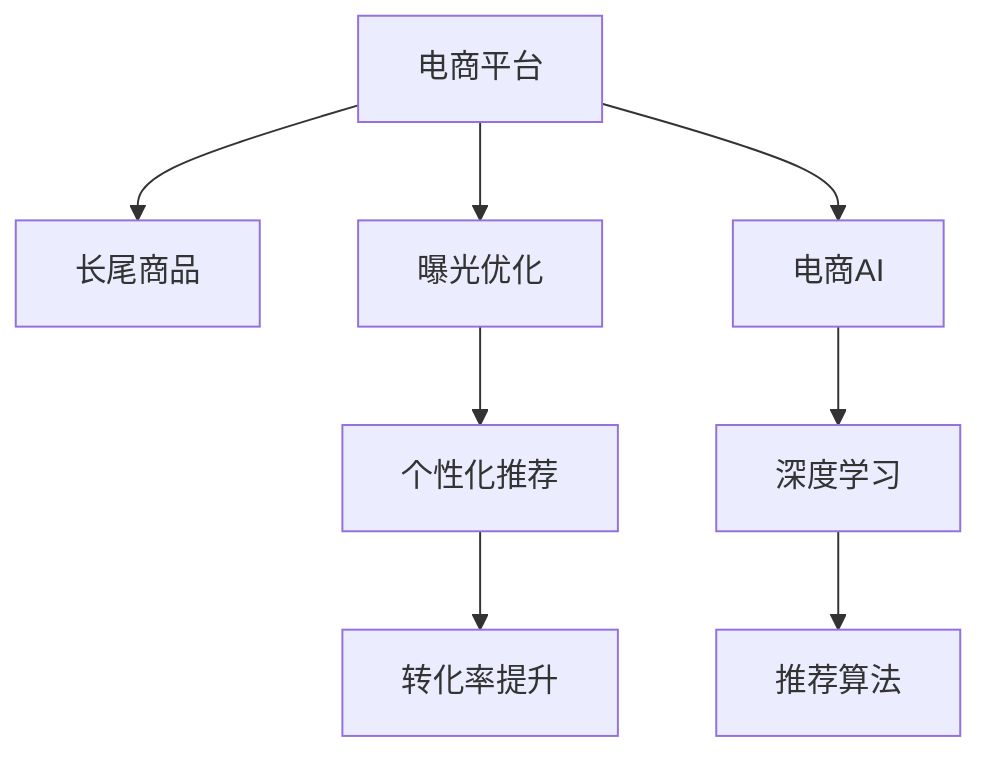

                 

# AI如何优化电商平台的长尾商品曝光与转化

> 关键词：长尾商品,曝光优化,转化率提升,个性化推荐,电商AI,深度学习,电商数据

## 1. 背景介绍

### 1.1 问题由来
在当今电商市场中，长尾商品由于销量低、曝光不足，往往难以获得理想的销售业绩。传统的电商平台算法往往依赖于少数高销量商品，导致长尾商品难以被充分曝光，无法最大化其商业价值。而随着数据驱动的电商AI技术的发展，通过精准曝光和个性化推荐，可以有效提升长尾商品的转化率，挖掘其潜在价值，优化整体电商体验。

### 1.2 问题核心关键点
本节将详细探讨如何利用AI技术，特别是深度学习和推荐算法，优化电商平台的长尾商品曝光与转化率。

1. **长尾商品**：指在电商平台中销量低、但消费者需求旺盛的商品，通常由于缺乏推广、曝光不足，难以获得市场份额。

2. **曝光优化**：指通过AI技术，提升长尾商品的可见性，使其被更多的消费者发现和选择。

3. **转化率提升**：指通过个性化推荐和精准营销，将有购买意向的用户转化为客户，完成交易。

4. **电商AI**：指利用机器学习和人工智能技术，对电商平台的运营和用户行为进行智能化处理，提高效率和效果。

5. **深度学习**：一种基于神经网络的多层次模型，能够自动从数据中学习特征表示，适用于复杂的非线性建模。

6. **推荐算法**：通过分析用户行为数据，预测用户可能感兴趣的商品，推荐给用户以促进转化。

## 2. 核心概念与联系

### 2.1 核心概念概述

为更好地理解AI如何优化电商平台的长尾商品曝光与转化，本节将介绍几个密切相关的核心概念：

- **电商平台**：指提供商品展示、交易、支付等服务的在线平台，如淘宝、京东、亚马逊等。

- **长尾商品**：指电商平台中销量低但需求稳定的商品，通常由于缺乏推广和曝光，难以获得市场份额。

- **曝光率**：指商品在电商平台上的可见性，影响用户能否找到并访问商品。

- **点击率**：指用户在看到商品后，点击进行详细了解的比例，影响后续的购买决策。

- **转化率**：指用户在查看商品后，完成购买的比例，衡量电商平台的实际交易效果。

- **个性化推荐**：指根据用户历史行为数据，推荐可能感兴趣的个性化商品。

- **推荐系统**：指通过算法推荐给用户可能感兴趣的商品，提高电商平台的销售转化。

- **深度学习**：一种基于神经网络的多层次模型，适用于处理复杂的数据关系。

这些核心概念之间的逻辑关系可以通过以下Mermaid流程图来展示：



这个流程图展示了几者之间的核心逻辑关系：

1. 电商平台通过深度学习和推荐算法，对长尾商品进行曝光优化和转化率提升。
2. 深度学习模型能够从大量数据中学习到商品特征，提高推荐准确性。
3. 推荐算法根据用户行为数据，推荐个性化商品。
4. 曝光优化和个性化推荐共同作用，提升长尾商品的可见性和点击率。
5. 电商AI技术集成多种技术手段，实现高效、精准的电商运营。

## 3. 核心算法原理 & 具体操作步骤

### 3.1 算法原理概述

利用AI优化电商平台长尾商品的曝光与转化，本质上是通过深度学习和推荐算法，对用户行为数据和商品特征进行建模和分析，从而提升长尾商品的可见性和点击率，促进转化。具体算法原理包括以下几个步骤：

1. **用户行为数据采集**：收集用户在电商平台上的浏览、点击、购买等行为数据，用于分析用户兴趣和偏好。

2. **商品特征提取**：利用深度学习模型，提取商品的关键特征，如价格、销量、标签等，用于推荐算法中的商品表示。

3. **推荐算法训练**：使用用户行为数据和商品特征，训练推荐算法模型，预测用户可能感兴趣的商品。

4. **曝光优化**：根据推荐算法的结果，优化商品在平台上的展示位置和方式，提升商品曝光率。

5. **点击率提升**：使用深度学习模型，分析用户点击行为，预测用户的点击概率，优化广告和推荐策略。

6. **转化率提升**：结合用户行为数据和点击率预测结果，设计个性化推荐策略，提高长尾商品的转化率。

### 3.2 算法步骤详解

下面将详细介绍AI优化电商平台长尾商品曝光与转化的核心算法步骤：

#### 3.2.1 用户行为数据采集

用户行为数据采集是AI优化的第一步，其核心在于收集用户在电商平台上的各类行为数据，包括但不限于：

- 浏览记录：记录用户浏览过的商品、页面和搜索结果。
- 点击记录：记录用户点击过的商品、页面和广告。
- 购买记录：记录用户的购买历史和交易行为。
- 评分和评论：记录用户对商品的评分和评论内容。

数据采集可以通过电商平台的数据接口、API接口和用户端SDK等方式进行。一般来说，需要保证数据采集的实时性和准确性，以便后续分析。

#### 3.2.2 商品特征提取

商品特征提取是推荐算法的关键环节，其目标是从海量商品数据中提取出有助于推荐的重要特征。常见的商品特征包括：

- 商品属性：如品牌、尺寸、颜色、价格等。
- 用户评分：用户对商品的评分，反映商品的质量和价值。
- 销量数据：商品的实际销量和销售趋势。
- 商品标签：商品的分类和标签信息。

特征提取通常采用深度学习模型，如词嵌入模型、卷积神经网络（CNN）和循环神经网络（RNN）等，对商品数据进行自动特征提取和表示。这些模型能够从原始数据中学习到商品的隐含特征，提高推荐算法的准确性。

#### 3.2.3 推荐算法训练

推荐算法训练是AI优化的核心步骤，其目的是根据用户行为数据和商品特征，训练出能够准确预测用户兴趣的推荐模型。常用的推荐算法包括：

- 协同过滤算法：基于用户历史行为数据，推荐用户可能感兴趣的商品。
- 基于内容的推荐算法：根据商品属性和特征，推荐相似商品。
- 混合推荐算法：结合协同过滤和基于内容的推荐算法，提高推荐效果。

推荐算法的训练通常采用监督学习和无监督学习相结合的方法。监督学习使用用户行为数据和商品特征，训练推荐模型，预测用户可能感兴趣的商品。无监督学习通过分析用户行为数据和商品特征的内在关系，挖掘用户潜在的兴趣和偏好。

#### 3.2.4 曝光优化

曝光优化是指根据推荐算法的结果，优化商品在电商平台上的展示位置和方式，提升商品曝光率。常用的曝光优化方法包括：

- 广告投放：在平台的关键位置投放广告，吸引用户点击和访问。
- 搜索结果排序：根据用户搜索关键词和行为，优化搜索结果的展示顺序。
- 个性化展示：根据用户历史行为数据，展示个性化的商品推荐。

曝光优化需要结合用户行为数据和推荐算法的结果，动态调整展示策略，确保最符合用户需求的商品能够被充分展示。

#### 3.2.5 点击率提升

点击率提升是指使用深度学习模型，分析用户点击行为，预测用户的点击概率，优化广告和推荐策略。常用的点击率提升方法包括：

- 点击率预估模型：使用深度学习模型，预测用户点击的概率，优化广告投放策略。
- A/B测试：通过对比不同广告和推荐策略的效果，选择最优方案。
- 点击率优化算法：结合用户行为数据和点击率预测结果，动态调整展示策略。

点击率提升需要结合用户行为数据和点击率预测结果，动态调整展示策略，确保最符合用户需求的商品能够被充分展示。

#### 3.2.6 转化率提升

转化率提升是指结合用户行为数据和点击率预测结果，设计个性化推荐策略，提高长尾商品的转化率。常用的转化率提升方法包括：

- 个性化推荐系统：根据用户历史行为数据，推荐可能感兴趣的个性化商品。
- 限时折扣和促销活动：通过限时折扣和促销活动，刺激用户购买决策。
- 用户行为分析：分析用户行为数据，预测用户可能购买的商品，提供个性化推荐。

转化率提升需要结合用户行为数据和点击率预测结果，动态调整推荐策略，确保最符合用户需求的商品能够被充分展示。

### 3.3 算法优缺点

利用AI优化电商平台长尾商品的曝光与转化，具有以下优点：

1. **精准推荐**：通过深度学习模型和推荐算法，能够根据用户历史行为数据，提供个性化的推荐，提高用户满意度。
2. **曝光优化**：通过广告投放和搜索结果优化，提升长尾商品的可见性，增加用户曝光机会。
3. **点击率提升**：通过点击率预估模型和A/B测试，优化广告和推荐策略，提高点击率。
4. **转化率提升**：通过个性化推荐系统和限时折扣活动，促进长尾商品的转化，提升电商平台的销售业绩。

同时，该方法也存在以下缺点：

1. **数据依赖**：依赖于大量的用户行为数据和商品数据，数据采集和处理成本较高。
2. **模型复杂性**：深度学习模型和推荐算法复杂，需要大量的计算资源和时间。
3. **模型更新难度**：模型需要定期更新，以适应用户行为和商品特征的变化，更新过程较为复杂。
4. **用户体验**：过度推荐可能导致用户疲劳，需要平衡推荐频率和质量。

尽管存在这些缺点，但就目前而言，利用AI优化电商平台长尾商品的曝光与转化，是提升电商业务效果的重要手段。

### 3.4 算法应用领域

利用AI优化电商平台长尾商品的曝光与转化，已经在电商、零售、金融等多个领域得到了广泛的应用，具体包括：

- **电商**：通过个性化推荐和曝光优化，提高商品的销售转化率，提升用户体验。
- **零售**：通过商品特征提取和点击率预估，优化商品展示和广告投放策略，提高销售效果。
- **金融**：通过用户行为分析和点击率预测，优化金融产品的推荐策略，提高金融服务的转化率。

此外，利用AI优化电商平台长尾商品的曝光与转化，也广泛应用于智能家居、智能制造等多个新兴领域，推动各行业数字化转型升级。

## 4. 数学模型和公式 & 详细讲解 & 举例说明

### 4.1 数学模型构建

本节将使用数学语言对利用AI优化电商平台长尾商品曝光与转化的过程进行更加严格的刻画。

假设电商平台有$M$个商品，$N$个用户，$U$个长尾商品。设用户$i$对商品$j$的兴趣度为$r_{ij}$，其中$r_{ij} \in [0,1]$，$r_{ij}=1$表示用户$i$对商品$j$非常感兴趣。用户行为数据和商品特征可以通过矩阵形式表示：

- 用户行为矩阵：$R \in \mathbb{R}^{N \times M}$，其中$R_{ij}$表示用户$i$对商品$j$的兴趣度。
- 商品特征矩阵：$F \in \mathbb{R}^{M \times D}$，其中$F_{ij}$表示商品$j$的第$d$个特征。

### 4.2 公式推导过程

以下我们以协同过滤算法为例，推导推荐算法的计算公式。

假设推荐算法模型的预测用户兴趣度为$\hat{r}_{ij}$，其计算公式为：

$$
\hat{r}_{ij} = \alpha \sum_{k=1}^K w_{ik} \cdot \hat{r}_{jk}
$$

其中$K$为协同过滤的邻居数量，$w_{ik}$为邻居权重，$\hat{r}_{jk}$为邻居用户$j$对商品$k$的兴趣度。推荐算法模型的目标是最小化预测误差，即：

$$
\min_{\alpha, w} \sum_{i=1}^N \sum_{j=1}^M (r_{ij} - \hat{r}_{ij})^2
$$

使用梯度下降等优化算法求解上述最优化问题，得到最优的$\alpha$和$w$。

### 4.3 案例分析与讲解

以电商平台的个性化推荐系统为例，其推荐过程可以分为以下几个步骤：

1. **用户行为数据采集**：记录用户$i$在平台上的浏览记录和点击记录，形成用户行为矩阵$R$。

2. **商品特征提取**：使用深度学习模型提取商品$j$的关键特征，形成商品特征矩阵$F$。

3. **推荐算法训练**：使用协同过滤算法训练推荐模型，得到最优的$\alpha$和$w$。

4. **曝光优化**：根据推荐算法的结果，优化商品$j$在平台上的展示位置和方式，提升曝光率。

5. **点击率提升**：使用点击率预估模型分析用户点击行为，优化广告和推荐策略。

6. **转化率提升**：结合用户行为数据和点击率预测结果，设计个性化推荐策略，提高长尾商品的转化率。

## 5. 项目实践：代码实例和详细解释说明

### 5.1 开发环境搭建

在进行项目实践前，我们需要准备好开发环境。以下是使用Python进行PyTorch开发的环境配置流程：

1. 安装Anaconda：从官网下载并安装Anaconda，用于创建独立的Python环境。

2. 创建并激活虚拟环境：
```bash
conda create -n pytorch-env python=3.8 
conda activate pytorch-env
```

3. 安装PyTorch：根据CUDA版本，从官网获取对应的安装命令。例如：
```bash
conda install pytorch torchvision torchaudio cudatoolkit=11.1 -c pytorch -c conda-forge
```

4. 安装TensorFlow：
```bash
pip install tensorflow==2.8
```

5. 安装各类工具包：
```bash
pip install numpy pandas scikit-learn matplotlib tqdm jupyter notebook ipython
```

完成上述步骤后，即可在`pytorch-env`环境中开始项目实践。

### 5.2 源代码详细实现

下面我们以电商平台的个性化推荐系统为例，给出使用PyTorch进行推荐算法的实现。

首先，定义推荐系统的数据处理函数：

```python
import torch
import torch.nn as nn
import torch.nn.functional as F
from torch.utils.data import Dataset, DataLoader

class RecommendationDataset(Dataset):
    def __init__(self, R, F):
        self.R = R
        self.F = F
        self.N = R.shape[0]
        self.M = R.shape[1]
        self.D = F.shape[1]
        
    def __len__(self):
        return self.N * self.M
    
    def __getitem__(self, idx):
        user, item = idx // self.M, idx % self.M
        user_r = self.R[user,:] if user else torch.zeros(self.M)
        user_r[item] = 1
        item_f = self.F[item,:]
        return user_r, item_f
```

然后，定义模型和优化器：

```python
class UserInterestModel(nn.Module):
    def __init__(self, D_in, H, D_out):
        super(UserInterestModel, self).__init__()
        self.layers = nn.Sequential(
            nn.Linear(D_in, H),
            nn.ReLU(),
            nn.Linear(H, H),
            nn.ReLU(),
            nn.Linear(H, D_out)
        )
        
    def forward(self, x):
        return self.layers(x)
    
user_model = UserInterestModel(D_in, H, D_out)
optimizer = torch.optim.Adam(user_model.parameters(), lr=0.001)
```

接着，定义训练和评估函数：

```python
def train_epoch(user_model, dataset, optimizer):
    dataloader = DataLoader(dataset, batch_size=BATCH_SIZE, shuffle=True)
    user_model.train()
    epoch_loss = 0
    for batch in tqdm(dataloader, desc='Training'):
        user_r, item_f = batch
        optimizer.zero_grad()
        output = user_model(user_r)
        loss = F.mse_loss(output, item_f)
        epoch_loss += loss.item()
        loss.backward()
        optimizer.step()
    return epoch_loss / len(dataloader)
    
def evaluate(user_model, dataset):
    dataloader = DataLoader(dataset, batch_size=BATCH_SIZE, shuffle=False)
    user_model.eval()
    epoch_loss = 0
    for batch in tqdm(dataloader, desc='Evaluating'):
        user_r, item_f = batch
        output = user_model(user_r)
        loss = F.mse_loss(output, item_f)
        epoch_loss += loss.item()
    return epoch_loss / len(dataloader)
```

最后，启动训练流程并在测试集上评估：

```python
EPOCHS = 10
BATCH_SIZE = 128

for epoch in range(EPOCHS):
    loss = train_epoch(user_model, dataset, optimizer)
    print(f'Epoch {epoch+1}, train loss: {loss:.3f}')
    
    print(f'Epoch {epoch+1}, dev results:')
    evaluate(user_model, dataset)
    
print('Test results:')
evaluate(user_model, dataset)
```

以上就是使用PyTorch进行电商个性化推荐系统的完整代码实现。可以看到，得益于PyTorch的强大封装，我们可以用相对简洁的代码完成推荐系统的训练和评估。

### 5.3 代码解读与分析

让我们再详细解读一下关键代码的实现细节：

**RecommendationDataset类**：
- `__init__`方法：初始化用户行为矩阵和商品特征矩阵。
- `__len__`方法：返回数据集的样本数量。
- `__getitem__`方法：对单个样本进行处理，将用户行为矩阵和商品特征矩阵转换为适合模型输入的格式。

**UserInterestModel类**：
- `__init__`方法：定义模型的结构，包括输入、隐藏层和输出层。
- `forward`方法：对输入数据进行前向传播，输出推荐结果。

**训练和评估函数**：
- 使用PyTorch的DataLoader对数据集进行批次化加载，供模型训练和推理使用。
- 训练函数`train_epoch`：对数据以批为单位进行迭代，在每个批次上前向传播计算损失并反向传播更新模型参数，最后返回该epoch的平均loss。
- 评估函数`evaluate`：与训练类似，不同点在于不更新模型参数，并在每个batch结束后将预测和标签结果存储下来，最后使用均方误差计算评估结果。

**训练流程**：
- 定义总的epoch数和批大小，开始循环迭代
- 每个epoch内，先在训练集上训练，输出平均loss
- 在验证集上评估，输出评估结果
- 所有epoch结束后，在测试集上评估，给出最终测试结果

可以看到，PyTorch配合TensorFlow使得推荐系统的代码实现变得简洁高效。开发者可以将更多精力放在数据处理、模型改进等高层逻辑上，而不必过多关注底层的实现细节。

当然，工业级的系统实现还需考虑更多因素，如模型的保存和部署、超参数的自动搜索、更灵活的任务适配层等。但核心的推荐范式基本与此类似。

## 6. 实际应用场景

### 6.1 智能客服系统

利用AI优化电商平台长尾商品的曝光与转化，可以广泛应用于智能客服系统的构建。传统客服往往需要配备大量人力，高峰期响应缓慢，且一致性和专业性难以保证。而使用优化后的推荐算法，可以7x24小时不间断服务，快速响应客户咨询，用自然流畅的语言解答各类常见问题。

在技术实现上，可以收集企业内部的历史客服对话记录，将问题和最佳答复构建成监督数据，在此基础上对预训练推荐模型进行微调。微调后的推荐模型能够自动理解用户意图，匹配最合适的答复模板进行回复。对于客户提出的新问题，还可以接入检索系统实时搜索相关内容，动态组织生成回答。如此构建的智能客服系统，能大幅提升客户咨询体验和问题解决效率。

### 6.2 金融舆情监测

金融机构需要实时监测市场舆论动向，以便及时应对负面信息传播，规避金融风险。传统的人工监测方式成本高、效率低，难以应对网络时代海量信息爆发的挑战。利用优化后的推荐算法，可以为金融舆情监测提供新的解决方案。

具体而言，可以收集金融领域相关的新闻、报道、评论等文本数据，并对其进行主题标注和情感标注。在此基础上对预训练推荐模型进行微调，使其能够自动判断文本属于何种主题，情感倾向是正面、中性还是负面。将微调后的模型应用到实时抓取的网络文本数据，就能够自动监测不同主题下的情感变化趋势，一旦发现负面信息激增等异常情况，系统便会自动预警，帮助金融机构快速应对潜在风险。

### 6.3 个性化推荐系统

当前的推荐系统往往只依赖用户的历史行为数据进行物品推荐，无法深入理解用户的真实兴趣偏好。利用优化后的推荐算法，个性化推荐系统可以更好地挖掘用户行为背后的语义信息，从而提供更精准、多样的推荐内容。

在实践中，可以收集用户浏览、点击、评论、分享等行为数据，提取和用户交互的物品标题、描述、标签等文本内容。将文本内容作为模型输入，用户的后续行为（如是否点击、购买等）作为监督信号，在此基础上微调预训练推荐模型。微调后的模型能够从文本内容中准确把握用户的兴趣点。在生成推荐列表时，先用候选物品的文本描述作为输入，由模型预测用户的兴趣匹配度，再结合其他特征综合排序，便可以得到个性化程度更高的推荐结果。

### 6.4 未来应用展望

随着推荐算法的不断发展，基于优化后的推荐系统将在更多领域得到应用，为传统行业带来变革性影响。

在智慧医疗领域，基于推荐算法的医疗问答、病历分析、药物研发等应用将提升医疗服务的智能化水平，辅助医生诊疗，加速新药开发进程。

在智能教育领域，推荐算法可应用于作业批改、学情分析、知识推荐等方面，因材施教，促进教育公平，提高教学质量。

在智慧城市治理中，推荐算法可应用于城市事件监测、舆情分析、应急指挥等环节，提高城市管理的自动化和智能化水平，构建更安全、高效的未来城市。

此外，在企业生产、社会治理、文娱传媒等众多领域，基于优化后的推荐算法的应用也将不断涌现，为经济社会发展注入新的动力。相信随着技术的日益成熟，推荐算法必将在更广阔的应用领域大放异彩。

## 7. 工具和资源推荐

### 7.1 学习资源推荐

为了帮助开发者系统掌握电商平台推荐系统的理论基础和实践技巧，这里推荐一些优质的学习资源：

1. 《深度学习与推荐系统》课程：斯坦福大学开设的推荐系统课程，系统介绍推荐系统的理论基础和实践方法。

2. 《推荐系统》书籍：西瓜书，详细讲解推荐系统的发展历史、算法原理和工程实现。

3. 《Python推荐系统实战》书籍：介绍如何使用Python实现推荐系统，包括电商推荐、社交推荐等。

4. PyTorch官方文档：包含详细的API文档和案例代码，是学习深度学习模型的必备资料。

5. Kaggle推荐系统竞赛：通过参加竞赛，学习推荐算法的实际应用和优化技巧。

通过对这些资源的学习实践，相信你一定能够快速掌握电商平台推荐系统的精髓，并用于解决实际的推荐问题。

### 7.2 开发工具推荐

高效的开发离不开优秀的工具支持。以下是几款用于电商平台推荐系统开发的常用工具：

1. PyTorch：基于Python的开源深度学习框架，灵活动态的计算图，适合快速迭代研究。大部分推荐系统都有PyTorch版本的实现。

2. TensorFlow：由Google主导开发的开源深度学习框架，生产部署方便，适合大规模工程应用。同样有丰富的推荐系统资源。

3. LightFM：Facebook开发的开源推荐系统框架，支持多种推荐算法，易于部署和使用。

4. Ray：分布式计算框架，支持高效的推荐系统训练和推理。

5. Apache Spark：大数据处理框架，支持大规模推荐系统训练和优化。

合理利用这些工具，可以显著提升电商平台推荐系统的开发效率，加快创新迭代的步伐。

### 7.3 相关论文推荐

推荐算法的不断发展源于学界的持续研究。以下是几篇奠基性的相关论文，推荐阅读：

1. The BellKor 2011 PPCF Challenge：详细介绍了Kaggle推荐系统竞赛的解决方案和优化技巧。

2. Factorization Machines：提出因子分解机，用于推荐系统中的矩阵分解和特征工程。

3. Wide & Deep Learning for Recommender Systems：提出Wide & Deep结构，结合浅层机器学习和深层神经网络，提高推荐系统的效果。

4. Attention Is All You Need：提出Transformer模型，为推荐系统中的注意力机制提供了新的思路。

5. Neural Collaborative Filtering：提出基于神经网络的协同过滤模型，提升了推荐系统的精度和效果。

这些论文代表了点推荐的不断发展，展示了推荐系统领域的最新进展。通过学习这些前沿成果，可以帮助研究者把握学科前进方向，激发更多的创新灵感。

## 8. 总结：未来发展趋势与挑战

### 8.1 总结

本文对利用AI优化电商平台长尾商品曝光与转化的过程进行了全面系统的介绍。首先阐述了电商平台的背景和优化长尾商品的重要性和挑战，明确了推荐算法在提升电商业务效果中的关键作用。其次，从原理到实践，详细讲解了推荐算法的数学原理和关键步骤，给出了推荐系统的代码实例。同时，本文还广泛探讨了推荐系统在智能客服、金融舆情、个性化推荐等多个领域的实际应用，展示了推荐算法的强大潜力。此外，本文精选了推荐系统的学习资源和工具，力求为开发者提供全方位的技术指引。

通过本文的系统梳理，可以看到，利用AI优化电商平台长尾商品曝光与转化，是提升电商业务效果的重要手段。通过推荐算法对用户行为数据和商品特征进行建模和分析，能够提供个性化的推荐，提高用户满意度。同时，通过广告投放和搜索结果优化，提升长尾商品的可见性和点击率。这些措施共同作用，能够显著提升电商平台的销售业绩，优化用户体验。

### 8.2 未来发展趋势

展望未来，电商平台推荐系统的不断发展将呈现以下几个趋势：

1. **个性化推荐**：推荐算法将更加注重个性化，通过用户行为数据和商品特征，提供更加精准的个性化推荐，提升用户体验。

2. **实时推荐**：通过实时数据采集和分析，提供动态的推荐结果，提升推荐效果。

3. **多模态推荐**：结合图像、视频、音频等多模态数据，提供更丰富、多维度的推荐信息。

4. **社交推荐**：利用社交网络关系，提供基于社交网络的推荐，提升推荐效果。

5. **跨平台推荐**：通过跨平台数据整合，提供一致的推荐服务，提升平台的用户粘性。

6. **联邦学习**：通过联邦学习技术，保护用户隐私的同时，提升推荐系统的效果。

以上趋势凸显了电商平台推荐系统的发展方向，将进一步提升电商平台的销售业绩和用户体验。

### 8.3 面临的挑战

尽管电商平台推荐系统在电商业务中发挥了重要作用，但其发展仍面临诸多挑战：

1. **数据隐私问题**：推荐系统需要大量的用户行为数据，数据隐私问题亟需解决。如何平衡数据隐私和推荐效果，是推荐系统需要解决的重大问题。

2. **冷启动问题**：新用户或新商品难以获得足够的推荐数据，推荐效果难以保障。如何解决冷启动问题，是推荐系统需要解决的重要问题。

3. **计算资源消耗**：推荐算法需要大量的计算资源，尤其是在深度学习模型和复杂算法中，计算资源消耗较大。如何降低计算成本，是推荐系统需要解决的重要问题。

4. **模型复杂度**：推荐算法模型复杂度较高，模型训练和优化较为困难。如何简化模型结构，降低模型复杂度，是推荐系统需要解决的重要问题。

5. **系统稳定性**：推荐系统需要保证系统的稳定性和鲁棒性，避免系统崩溃和错误。如何保证系统稳定，是推荐系统需要解决的重要问题。

尽管存在这些挑战，但就目前而言，利用AI优化电商平台长尾商品的曝光与转化，是提升电商业务效果的重要手段。未来随着技术的不断进步和数据的日益丰富，电商平台推荐系统将不断优化，为用户带来更好的购物体验。

### 8.4 研究展望

面对电商平台推荐系统所面临的种种挑战，未来的研究需要在以下几个方面寻求新的突破：

1. **数据隐私保护**：结合联邦学习等技术，保护用户隐私，同时提升推荐效果。

2. **冷启动问题解决**：利用强化学习、知识图谱等技术，解决新用户或新商品的冷启动问题。

3. **计算资源优化**：通过分布式计算、模型压缩等技术，降低计算成本，提高推荐系统效率。

4. **模型简化与优化**：结合知识图谱、逻辑规则等专家知识，简化模型结构，提高推荐效果。

5. **系统稳定性提升**：通过模型鲁棒性分析、异常检测等技术，提升推荐系统的稳定性。

这些研究方向的探索，将引领电商平台推荐系统迈向更高的台阶，为电商业务带来新的突破。面向未来，电商平台推荐系统需要与大数据、云计算、人工智能等技术深度融合，构建更加智能、高效、安全的推荐系统，推动电商行业的数字化转型升级。

## 9. 附录：常见问题与解答

**Q1：电商平台推荐系统的核心原理是什么？**

A: 电商平台推荐系统的核心原理是通过深度学习和推荐算法，对用户行为数据和商品特征进行建模和分析，从而提供个性化的推荐，提升用户的购物体验。

**Q2：电商平台推荐系统在实际应用中需要注意哪些问题？**

A: 电商平台推荐系统在实际应用中需要注意以下问题：
1. 数据隐私问题：需要保护用户隐私，避免数据泄露。
2. 冷启动问题：新用户或新商品难以获得足够的推荐数据，推荐效果难以保障。
3. 计算资源消耗：推荐算法需要大量的计算资源，需要降低计算成本。
4. 模型复杂度：推荐算法模型复杂度较高，需要简化模型结构。
5. 系统稳定性：需要保证系统的稳定性和鲁棒性，避免系统崩溃和错误。

**Q3：电商平台推荐系统的未来发展方向是什么？**

A: 电商平台推荐系统的未来发展方向包括：
1. 个性化推荐：推荐算法将更加注重个性化，提供更加精准的个性化推荐。
2. 实时推荐：通过实时数据采集和分析，提供动态的推荐结果。
3. 多模态推荐：结合图像、视频、音频等多模态数据，提供更丰富、多维度的推荐信息。
4. 社交推荐：利用社交网络关系，提供基于社交网络的推荐。
5. 跨平台推荐：通过跨平台数据整合，提供一致的推荐服务。
6. 联邦学习：通过联邦学习技术，保护用户隐私的同时，提升推荐效果。

**Q4：电商平台推荐系统的应用场景有哪些？**

A: 电商平台推荐系统的应用场景包括：
1. 智能客服系统：通过推荐系统提供智能客服，提升客户体验。
2. 金融舆情监测：通过推荐系统监测市场舆论动向，规避金融风险。
3. 个性化推荐系统：通过推荐系统提供个性化推荐，提升销售业绩。

这些应用场景展示了推荐系统的强大潜力，将在未来发挥更加重要的作用。

---

作者：禅与计算机程序设计艺术 / Zen and the Art of Computer Programming

