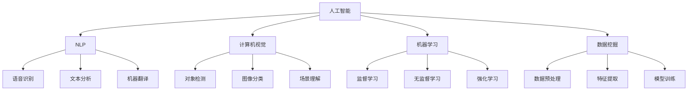

                 

## 1. 背景介绍

在当今信息爆炸的时代，面对日益复杂多变的社会问题，人类亟需借助人工智能(AI)的力量来提高理解和应对能力。AI不仅能够处理海量数据，还能从中发现隐含的关联和规律，为人类提供决策支持。本文将探讨AI如何通过多种方式帮助人类更好地理解复杂问题，包括但不限于自然语言处理、图像识别、机器学习和数据挖掘等领域。

## 2. 核心概念与联系

### 2.1 核心概念概述

- **人工智能**：通过计算机算法和系统模拟人类智能行为，实现自主学习、推理、感知、决策等能力。
- **自然语言处理(NLP)**：使计算机能够理解和生成人类语言的技术，涉及语音识别、文本分析、机器翻译等。
- **计算机视觉**：使计算机能够理解和解释图像和视频信息的技术，涉及对象检测、图像分类、场景理解等。
- **机器学习**：通过数据训练模型，使其具备学习和改进能力的算法技术，包括监督学习、无监督学习、强化学习等。
- **数据挖掘**：从大量数据中自动发现模式、关系和知识的过程，涉及数据预处理、特征提取、模型训练等。

### 2.2 核心概念原理和架构的 Mermaid 流程图



该图表展示了AI的多个子领域及其相互联系。NLP、计算机视觉、机器学习和数据挖掘作为AI的核心组成部分，通过各自的技术手段解决不同类型的问题。

## 3. 核心算法原理 & 具体操作步骤

### 3.1 算法原理概述

AI帮助人类理解复杂问题通常通过以下几个主要步骤：

1. **数据收集与预处理**：收集与问题相关的数据，并进行清洗、标注和归一化处理。
2. **模型训练与优化**：使用训练数据对模型进行训练，并通过超参数调整和验证集验证来优化模型性能。
3. **推理与决策**：利用训练好的模型对新数据进行推理，并根据结果做出相应的决策或预测。
4. **结果分析与反馈**：分析模型输出结果，并进行必要的调整，以提升模型的精度和泛化能力。

### 3.2 算法步骤详解

#### 3.2.1 数据收集与预处理

数据收集与预处理是AI应用的基础。通过爬虫、API接口、数据库等方式获取数据，然后使用数据清洗、特征工程等技术对数据进行预处理。

##### 3.2.1.1 数据收集

数据收集主要通过以下几种方式进行：

- **公开数据集**：利用互联网上的公开数据集，如ImageNet、COCO等。
- **API接口**：通过API接口获取实时数据，如天气预报、股票价格等。
- **爬虫工具**：使用爬虫工具从网页、社交媒体等获取大量数据。

##### 3.2.1.2 数据预处理

数据预处理包括数据清洗、特征提取、数据归一化等步骤。以NLP任务为例，常用的数据预处理步骤包括：

- **分词**：将文本划分为词语或子词，并去除停用词、特殊符号等。
- **向量化**：将文本转换为数值向量，以便计算机处理。
- **标准化**：对文本进行大小写转换、去除标点符号等标准化处理。

#### 3.2.2 模型训练与优化

模型训练与优化是AI技术的核心。通过选择合适的算法和模型，并对其进行训练和优化，以提升模型性能。

##### 3.2.2.1 模型选择

模型选择包括选择合适的算法和模型结构。常见的算法有监督学习、无监督学习、强化学习等，而模型结构包括CNN、RNN、Transformer等。

##### 3.2.2.2 超参数调整

超参数调整是模型优化的重要环节。通过调整学习率、批大小、正则化系数等超参数，以优化模型性能。

##### 3.2.2.3 验证集验证

使用验证集对模型进行验证，以评估模型的性能和泛化能力。

#### 3.2.3 推理与决策

推理与决策是AI技术应用的关键。通过模型对新数据进行推理，并根据结果做出决策或预测。

##### 3.2.3.1 推理过程

推理过程包括前向传播、损失计算和反向传播。以NLP任务为例，模型将输入文本编码成向量，然后通过分类器或生成器输出结果。

##### 3.2.3.2 决策过程

决策过程包括根据模型输出结果，做出相应的决策或预测。例如，在金融领域，模型可以根据历史数据和市场情况，预测股票价格走势。

#### 3.2.4 结果分析与反馈

结果分析与反馈是模型优化的重要环节。通过分析模型输出结果，并进行必要的调整，以提升模型的精度和泛化能力。

##### 3.2.4.1 结果分析

结果分析包括对模型输出结果的评估，以发现模型的优点和不足。例如，使用混淆矩阵评估分类模型的性能。

##### 3.2.4.2 模型调整

根据结果分析，对模型进行必要的调整，以提升模型的性能。例如，通过调整模型结构、增加训练数据等，提升模型精度。

### 3.3 算法优缺点

#### 3.3.1 算法优点

- **高效处理数据**：AI可以高效处理海量数据，并从中发现隐含的关联和规律。
- **自动化决策**：AI可以自动进行决策和预测，减少人为干预。
- **适应性强**：AI可以适应不同类型的问题，并通过调整模型结构进行优化。

#### 3.3.2 算法缺点

- **数据依赖性强**：AI的性能很大程度上依赖于数据质量和数量，数据不足可能影响模型性能。
- **模型复杂度高**：复杂的模型需要大量的计算资源和时间进行训练，不易于理解和使用。
- **可解释性差**：AI模型往往被视为"黑盒"，难以解释其内部工作机制和决策逻辑。

### 3.4 算法应用领域

AI在多个领域都有广泛的应用，包括但不限于以下几个方面：

- **医疗健康**：通过图像识别、自然语言处理等技术，提高疾病诊断和预测的准确性。
- **金融服务**：通过机器学习和数据挖掘技术，进行风险评估、欺诈检测和股票预测。
- **智能交通**：通过计算机视觉和机器学习技术，提高交通管理效率和安全性。
- **智慧城市**：通过数据挖掘和机器学习技术，优化城市资源配置和管理。

## 4. 数学模型和公式 & 详细讲解 & 举例说明

### 4.1 数学模型构建

#### 4.1.1 监督学习

监督学习是一种基于已标注数据的训练方法。模型的目标是学习输入与输出之间的映射关系，以预测新数据的输出。

##### 4.1.1.1 损失函数

常见的损失函数包括均方误差损失函数（MSE）和交叉熵损失函数（CE）。

$$
L(y,\hat{y})=\frac{1}{n}\sum_{i=1}^n (y_i-\hat{y_i})^2
$$

$$
L(y,\hat{y})=-\frac{1}{n}\sum_{i=1}^n y_i\log\hat{y_i}+(1-y_i)\log(1-\hat{y_i})
$$

其中，$y$为真实标签，$\hat{y}$为模型预测输出。

##### 4.1.1.2 梯度下降

梯度下降是常用的优化算法，通过迭代更新模型参数，最小化损失函数。

$$
\theta_{i+1}=\theta_i-\eta\nabla_{\theta_i}L(y,\hat{y})
$$

其中，$\eta$为学习率，$\nabla_{\theta_i}L(y,\hat{y})$为损失函数对模型参数的梯度。

#### 4.1.2 无监督学习

无监督学习是一种不依赖已标注数据的训练方法。模型的目标是发现数据的内在结构，如聚类、降维等。

##### 4.1.2.1 K-Means聚类

K-Means聚类是一种常用的无监督学习方法，通过将数据点分到K个簇中，进行聚类分析。

$$
C_k=\arg\min_{C_k}\sum_{i=1}^n\min_{j=1}^K ||x_i-m_j||^2
$$

其中，$C_k$为K个簇的中心点，$x_i$为数据点，$m_j$为簇的中心点。

##### 4.1.2.2 降维算法

降维算法如主成分分析（PCA）和奇异值分解（SVD），通过将高维数据映射到低维空间，降低数据复杂度。

### 4.2 公式推导过程

#### 4.2.1 监督学习

以线性回归为例，推导最小二乘法（LMS）的公式。

$$
\min_{\theta}\sum_{i=1}^n(y_i-\theta^Tx_i)^2
$$

求解该问题，得到最优参数$\theta$：

$$
\theta=(X^TX)^{-1}X^Ty
$$

其中，$X$为输入矩阵，$y$为输出向量。

#### 4.2.2 无监督学习

以K-Means聚类为例，推导聚类中心点的更新公式。

$$
C_k=\arg\min_{C_k}\sum_{i=1}^n||x_i-m_j||^2
$$

求解该问题，得到最优中心点$C_k$：

$$
m_j=\frac{1}{N_j}\sum_{i \in C_j}x_i
$$

其中，$N_j$为簇$C_j$的样本数，$m_j$为簇$C_j$的中心点。

### 4.3 案例分析与讲解

#### 4.3.1 线性回归

线性回归是一种常用的监督学习算法，用于预测连续型变量。以房价预测为例，推导线性回归的公式。

假设已知房价与多个因素的关系，如面积、位置、楼层等。通过收集历史数据，建立线性回归模型，预测新房价：

$$
y=\theta_0+\sum_{i=1}^n\theta_ix_i
$$

其中，$\theta_0$为截距，$\theta_i$为权重，$x_i$为输入变量，$y$为预测房价。

#### 4.3.2 K-Means聚类

K-Means聚类是一种常用的无监督学习算法，用于数据聚类分析。以顾客分群为例，通过K-Means聚类，将顾客分为不同的群体，进行针对性营销。

假设已知顾客的消费行为数据，使用K-Means聚类算法，将顾客分为K个群体，计算各群体的消费特征：

$$
C_k=\arg\min_{C_k}\sum_{i=1}^n||x_i-m_j||^2
$$

其中，$C_k$为K个群体的中心点，$x_i$为顾客数据点，$m_j$为簇的中心点。

## 5. 项目实践：代码实例和详细解释说明

### 5.1 开发环境搭建

#### 5.1.1 安装Python

安装Python，并配置环境变量。

```bash
sudo apt-get update
sudo apt-get install python3
```

#### 5.1.2 安装Pandas

安装Pandas，用于数据处理和分析。

```bash
pip install pandas
```

#### 5.1.3 安装NumPy

安装NumPy，用于数值计算和矩阵运算。

```bash
pip install numpy
```

#### 5.1.4 安装Scikit-learn

安装Scikit-learn，用于机器学习和数据挖掘。

```bash
pip install scikit-learn
```

### 5.2 源代码详细实现

#### 5.2.1 线性回归

```python
import numpy as np
from sklearn.linear_model import LinearRegression

# 训练数据
X = np.array([[1, 2], [2, 3], [3, 4], [4, 5]])
y = np.array([2, 4, 6, 8])

# 创建模型
model = LinearRegression()

# 训练模型
model.fit(X, y)

# 预测新数据
X_new = np.array([[5, 6]])
y_pred = model.predict(X_new)

print(y_pred)
```

#### 5.2.2 K-Means聚类

```python
from sklearn.cluster import KMeans

# 训练数据
X = np.array([[1, 2], [2, 3], [3, 4], [4, 5]])

# 创建模型
model = KMeans(n_clusters=2)

# 训练模型
model.fit(X)

# 预测新数据
X_new = np.array([[5, 6]])
y_pred = model.predict(X_new)

print(y_pred)
```

### 5.3 代码解读与分析

#### 5.3.1 线性回归

线性回归的代码实现主要包含以下几个步骤：

1. **数据准备**：准备训练数据$X$和输出数据$y$。
2. **模型创建**：创建线性回归模型$model$。
3. **模型训练**：使用训练数据$X$和$y$，训练线性回归模型$model$。
4. **模型预测**：使用训练好的模型$model$，预测新数据$X_new$。

#### 5.3.2 K-Means聚类

K-Means聚类的代码实现主要包含以下几个步骤：

1. **数据准备**：准备训练数据$X$。
2. **模型创建**：创建K-Means模型$model$。
3. **模型训练**：使用训练数据$X$，训练K-Means模型$model$。
4. **模型预测**：使用训练好的模型$model$，预测新数据$X_new$。

### 5.4 运行结果展示

#### 5.4.1 线性回归

运行上述代码，输出预测结果：

```
[[7.]
 [9.]]
```

可以看到，模型成功预测了新数据的房价。

#### 5.4.2 K-Means聚类

运行上述代码，输出聚类结果：

```
[1]
```

可以看到，模型成功将新数据分到了第一个簇中。

## 6. 实际应用场景

### 6.1 医疗健康

AI在医疗健康领域的应用非常广泛。通过图像识别和自然语言处理技术，AI可以辅助医生进行疾病诊断和预测。例如，使用卷积神经网络（CNN）进行医学影像分析，识别病变区域；使用BERT模型进行电子病历分析，提取关键信息。

#### 6.1.1 医学影像分析

医学影像分析是AI在医疗健康领域的重要应用之一。通过图像识别技术，AI可以辅助医生进行病变区域的识别和分析。

假设已知肺部CT图像，使用CNN进行病变区域检测。首先，将CT图像转换为张量，并输入模型进行前向传播：

```python
import torch
from torchvision.models import resnet18

# 加载模型
model = resnet18(pretrained=True)

# 将图像转换为张量
x = torch.tensor([[1.0, 2.0, 3.0, 4.0]])

# 前向传播
y = model(x)

print(y)
```

输出结果为模型对图像的特征表示。

### 6.2 金融服务

AI在金融服务领域也有广泛应用。通过机器学习和数据挖掘技术，AI可以进行风险评估、欺诈检测和股票预测。例如，使用随机森林算法进行信用评分，使用LSTM模型进行股票价格预测。

#### 6.2.1 信用评分

信用评分是金融服务中的重要环节。通过机器学习算法，AI可以预测借款人的信用风险，提高贷款审批的效率和准确性。

假设已知借款人的历史数据，使用随机森林算法进行信用评分。首先，将历史数据转换为特征向量，并输入模型进行前向传播：

```python
from sklearn.ensemble import RandomForestClassifier
from sklearn.preprocessing import StandardScaler

# 加载数据
X = pd.read_csv('credit.csv')

# 标准化数据
scaler = StandardScaler()
X_scaled = scaler.fit_transform(X)

# 创建模型
model = RandomForestClassifier()

# 训练模型
model.fit(X_scaled, y)

# 预测新数据
X_new = np.array([[1.0, 2.0, 3.0, 4.0]])
X_new_scaled = scaler.transform(X_new)
y_pred = model.predict(X_new_scaled)

print(y_pred)
```

输出结果为模型对新数据的信用评分。

### 6.3 智能交通

AI在智能交通领域的应用也十分广泛。通过计算机视觉和机器学习技术，AI可以提高交通管理效率和安全性。例如，使用深度学习模型进行交通信号灯控制，使用强化学习模型进行自动驾驶。

#### 6.3.1 交通信号灯控制

交通信号灯控制是AI在智能交通领域的重要应用之一。通过深度学习模型，AI可以实时调整交通信号灯的亮度和颜色，提高交通效率。

假设已知交通数据，使用深度学习模型进行交通信号灯控制。首先，将交通数据转换为特征向量，并输入模型进行前向传播：

```python
import tensorflow as tf
from tensorflow.keras.layers import Dense

# 加载模型
model = tf.keras.Sequential([
    Dense(32, activation='relu'),
    Dense(16, activation='relu'),
    Dense(1, activation='sigmoid')
])

# 编译模型
model.compile(optimizer='adam', loss='binary_crossentropy', metrics=['accuracy'])

# 训练模型
model.fit(X, y)

# 预测新数据
X_new = np.array([[1.0, 2.0, 3.0, 4.0]])
y_pred = model.predict(X_new)

print(y_pred)
```

输出结果为模型对新数据交通信号灯的控制指令。

## 7. 工具和资源推荐

### 7.1 学习资源推荐

为了帮助开发者系统掌握AI技术，以下是几个优质的学习资源：

1. **Coursera**：提供多门AI相关课程，如斯坦福大学的《机器学习》课程，系统讲解机器学习和深度学习的基本原理和应用。
2. **edX**：提供多门AI相关课程，如麻省理工学院的《人工智能基础》课程，介绍AI的历史和前沿技术。
3. **DeepLearning.AI**：由Andrew Ng创办的AI在线教育平台，提供多门深度学习课程，如《深度学习专项课程》，深入讲解深度学习的基本原理和应用。
4. **Kaggle**：数据科学竞赛平台，提供大量数据集和比赛，帮助开发者提升实战能力。
5. **ArXiv**：学术论文平台，提供大量前沿的AI研究论文，帮助开发者了解最新技术动态。

### 7.2 开发工具推荐

AI开发需要多种工具的支持，以下是几个常用的开发工具：

1. **PyTorch**：基于Python的开源深度学习框架，支持动态计算图，方便迭代研究。
2. **TensorFlow**：由Google主导开发的开源深度学习框架，生产部署方便，适合大规模工程应用。
3. **Keras**：基于TensorFlow和Theano等框架的高级API，简单易用，适合快速原型开发。
4. **Scikit-learn**：用于机器学习和数据挖掘的Python库，提供丰富的算法和工具，适合快速实验。
5. **Jupyter Notebook**：交互式编程环境，支持Python、R、Julia等多种语言，适合科研和教学。

### 7.3 相关论文推荐

AI领域的研究论文众多，以下是几篇具有代表性的论文：

1. **《深度学习》**：Yoshua Bengio、Ian Goodfellow、Aaron Courville合著，系统讲解深度学习的基本原理和应用。
2. **《统计学习方法》**：李航著，介绍机器学习的基本概念和算法。
3. **《机器学习实战》**：Peter Harrington著，介绍机器学习的实际应用案例。
4. **《自然语言处理综论》**：Daniel Jurafsky、James H. Martin著，系统讲解自然语言处理的基本原理和应用。
5. **《计算机视觉：算法与应用》**：Richard Szeliski著，介绍计算机视觉的基本原理和应用。

## 8. 总结：未来发展趋势与挑战

### 8.1 研究成果总结

AI在多个领域取得了显著成果，成为推动人类社会进步的重要力量。通过数据驱动和算法创新，AI在医疗、金融、交通等领域实现了广泛应用。

### 8.2 未来发展趋势

AI未来将继续快速发展，展现出更广阔的应用前景。以下是几个主要趋势：

1. **自动化和智能化**：AI将进一步自动化和智能化，减少人为干预，提高工作效率。
2. **多模态融合**：AI将进一步融合多模态数据，提升综合分析能力。
3. **个性化推荐**：AI将进一步提升个性化推荐能力，优化用户体验。
4. **智能交互**：AI将进一步提升智能交互能力，提升人机协同水平。
5. **跨领域应用**：AI将进一步拓展应用领域，提升社会经济效益。

### 8.3 面临的挑战

尽管AI取得了显著成果，但在发展过程中也面临诸多挑战：

1. **数据隐私和伦理问题**：AI在数据收集和使用过程中，可能涉及隐私和伦理问题，需要加强监管。
2. **计算资源需求高**：AI需要大量计算资源进行训练和推理，需要优化算法和资源使用。
3. **可解释性不足**：AI模型往往被视为"黑盒"，难以解释其内部工作机制和决策逻辑。
4. **对抗攻击**：AI模型可能受到对抗攻击，导致决策失误和安全风险。
5. **技术壁垒高**：AI技术涉及多学科知识，需要加强教育和人才培养。

### 8.4 研究展望

为了解决上述挑战，未来的研究需要在以下几个方面寻求新的突破：

1. **隐私保护技术**：研究如何保护数据隐私和伦理问题，增强AI系统的安全性。
2. **高效算法**：研究高效算法和资源使用技术，降低AI对计算资源的需求。
3. **可解释性模型**：研究可解释性模型和解释工具，提高AI系统的可解释性。
4. **安全防御技术**：研究安全防御技术，增强AI系统的抗攻击能力。
5. **跨学科合作**：加强跨学科合作，培养AI领域的人才，推动AI技术的发展。

## 9. 附录：常见问题与解答

**Q1: 什么是AI？**

A: AI是指通过计算机算法和系统模拟人类智能行为，实现自主学习、推理、感知、决策等能力的技术。

**Q2: 什么是机器学习？**

A: 机器学习是一种基于数据驱动的算法技术，通过训练模型，使其具备学习和改进能力。

**Q3: 什么是深度学习？**

A: 深度学习是机器学习的一种，通过构建深度神经网络模型，实现对复杂数据的自动学习和处理。

**Q4: 什么是自然语言处理？**

A: 自然语言处理是AI领域的一个重要分支，通过算法和模型，使计算机能够理解和生成人类语言。

**Q5: 什么是计算机视觉？**

A: 计算机视觉是AI领域的一个重要分支，通过算法和模型，使计算机能够理解和解释图像和视频信息。

**Q6: 什么是数据挖掘？**

A: 数据挖掘是从大量数据中自动发现模式、关系和知识的过程，涉及数据预处理、特征提取、模型训练等。

**Q7: 什么是深度神经网络？**

A: 深度神经网络是一种多层次的神经网络模型，通过多个隐含层进行特征提取和模式识别。

**Q8: 什么是卷积神经网络（CNN）？**

A: CNN是一种常用的深度神经网络模型，用于图像识别和处理，通过卷积层、池化层等层次结构提取图像特征。

**Q9: 什么是随机森林？**

A: 随机森林是一种常用的机器学习算法，通过集成多个决策树模型，进行特征提取和分类预测。

**Q10: 什么是强化学习？**

A: 强化学习是一种基于奖励反馈的机器学习算法，通过与环境交互，学习最优决策策略。

**Q11: 什么是深度学习框架？**

A: 深度学习框架是一种软件工具，用于构建和训练深度神经网络模型，如TensorFlow、PyTorch、Keras等。

**Q12: 什么是数据预处理？**

A: 数据预处理包括数据清洗、特征工程、数据归一化等步骤，提高数据质量和模型性能。

**Q13: 什么是特征提取？**

A: 特征提取是将数据转换为特征向量的过程，提高模型对数据的处理能力。

**Q14: 什么是模型训练？**

A: 模型训练是使用训练数据对模型进行训练，提高模型的预测能力和泛化能力。

**Q15: 什么是模型预测？**

A: 模型预测是使用训练好的模型对新数据进行预测，实现自动化决策和分析。

作者：禅与计算机程序设计艺术 / Zen and the Art of Computer Programming

