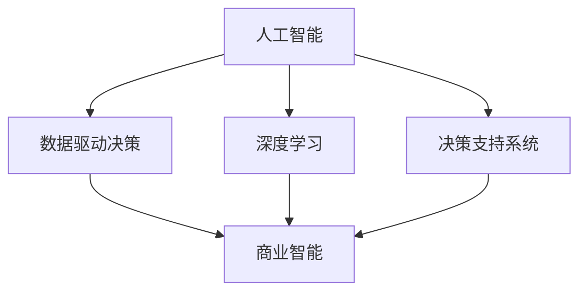

                 

# AI如何改变企业的决策过程

> 关键词：人工智能, 数据驱动决策, 决策支持系统, 深度学习, 大数据, 商业智能

## 1. 背景介绍

### 1.1 问题由来
在全球化和数字化的推动下，企业竞争日益激烈，决策速度和准确性变得至关重要。传统的决策过程往往依赖于人工分析和直觉判断，存在主观性强、效率低下、信息片面等问题。人工智能（AI）和大数据技术的兴起，为企业提供了新的决策工具和方法，显著提升了决策的科学性和效率。AI和数据驱动的决策支持系统（Decision Support Systems, DSS）正在成为企业管理中的新常态。

### 1.2 问题核心关键点
AI在企业决策中的应用主要体现在以下几个关键点：
- **数据驱动**：利用大数据技术，从海量的业务数据中提取有价值的信息，支持企业做出更加客观、科学的决策。
- **自动化分析**：通过自动化数据分析工具，快速处理复杂的数据集，减少人工干预。
- **实时决策**：AI系统能够实时处理数据，快速响应市场变化和客户需求，优化决策速度和灵活性。
- **多维度决策**：AI可以整合不同来源的数据，进行跨部门、跨领域的决策分析，提升决策的全面性和协同性。
- **人机协同**：AI不仅能自动化分析数据，还能提供辅助决策建议，与人类专家共同进行复杂决策。

### 1.3 问题研究意义
研究AI如何改变企业决策过程，对于提升企业决策质量、降低决策成本、加快决策速度具有重要意义：
- 提升决策质量：AI可以处理复杂、动态的数据，发现难以人工发现的关联模式，支持企业制定更加精准、科学的决策。
- 降低决策成本：通过自动化和优化决策流程，减少人工干预和错误，降低决策过程的时间和资源成本。
- 加快决策速度：AI系统能够实时处理数据，快速生成决策方案，提高企业的市场响应速度和竞争力。
- 提升决策效率：AI能够整合多源数据，提供多维度、多层次的分析，增强决策的全面性和协同性。
- 促进数据驱动决策：AI工具能够自动化数据收集、清洗和分析，减少人工干预，使数据驱动决策成为可能。

## 2. 核心概念与联系

### 2.1 核心概念概述

为更好地理解AI在企业决策中的应用，本节将介绍几个密切相关的核心概念：

- **人工智能（AI）**：通过计算机程序模拟人类智能，包括学习、推理、感知、决策等能力。
- **数据驱动决策（Data-Driven Decision Making）**：基于数据的分析、建模和预测，支持决策过程的科学性和客观性。
- **深度学习（Deep Learning）**：一种基于多层神经网络的机器学习方法，通过大量数据训练，提取高层次的特征表示。
- **商业智能（Business Intelligence, BI）**：利用数据分析、可视化等技术，支持企业战略和运营决策的制定。
- **决策支持系统（DSS）**：结合AI、大数据等技术，提供决策支持和辅助分析的工具。

这些核心概念之间的逻辑关系可以通过以下Mermaid流程图来展示：



这个流程图展示了大数据、AI和DSS之间的核心关系：

1. **人工智能**：通过深度学习等方法，自动分析处理数据，提取有价值的信息。
2. **数据驱动决策**：基于AI分析的数据支持企业制定更加科学、客观的决策。
3. **深度学习**：利用多层神经网络，进行特征提取和模式识别，提升数据分析的精度。
4. **商业智能**：结合数据分析和可视化，支持企业的战略和运营决策。
5. **决策支持系统**：将AI和BI工具整合，提供全面的决策辅助。

这些概念共同构成了AI在企业决策过程中的技术基础，为其应用提供了坚实的支撑。

## 3. 核心算法原理 & 具体操作步骤
### 3.1 算法原理概述

AI在企业决策中的应用，通常遵循以下基本算法原理：

- **数据预处理**：对原始数据进行清洗、归一化、特征提取等预处理，准备输入到AI模型中。
- **模型训练**：选择合适的AI模型，利用历史数据进行训练，调整模型参数，使其能够准确预测和分析未来数据。
- **预测和分析**：将待决策的数据输入到训练好的AI模型中，得到预测结果和分析报告。
- **决策优化**：结合预测结果和业务规则，进行决策优化和风险评估，生成最终的决策方案。

### 3.2 算法步骤详解

基于AI的企业决策过程一般包括以下关键步骤：

**Step 1: 数据收集和准备**
- 收集企业内外部的各种数据，包括客户数据、市场数据、财务数据、运营数据等。
- 对数据进行清洗、归一化、特征提取等预处理，确保数据质量和一致性。

**Step 2: 选择合适的AI模型**
- 根据决策任务的类型和特点，选择合适的AI模型，如回归模型、分类模型、聚类模型、时间序列模型等。
- 对于需要处理大规模数据的问题，如客户细分、市场预测等，可以使用深度学习模型，如神经网络、卷积神经网络（CNN）、循环神经网络（RNN）等。

**Step 3: 模型训练和验证**
- 利用历史数据对AI模型进行训练，调整模型参数，提高模型的预测准确度。
- 在训练过程中，使用验证集对模型进行评估，确保模型不过拟合和欠拟合。

**Step 4: 预测和分析**
- 将待决策的数据输入到训练好的AI模型中，得到预测结果和分析报告。
- 对于需要预测未来趋势的任务，可以使用时间序列分析模型，如ARIMA、LSTM等。

**Step 5: 决策优化**
- 结合预测结果和业务规则，进行决策优化和风险评估，生成最终的决策方案。
- 可以使用优化算法，如线性规划、整数规划等，对决策结果进行优化。

**Step 6: 监控和反馈**
- 对决策结果进行监控，评估实际效果和预测结果的差距。
- 根据反馈信息，调整AI模型和决策规则，提高决策的准确性和可靠性。

### 3.3 算法优缺点

AI在企业决策中的应用具有以下优点：
1. 数据驱动：通过数据驱动决策，减少人工干预，提高决策的客观性和科学性。
2. 自动化分析：AI自动化处理和分析数据，减少人工工作量，提高效率。
3. 实时决策：AI能够实时处理数据，快速响应市场变化，优化决策速度和灵活性。
4. 多维度决策：AI可以整合不同来源的数据，提供多维度、多层次的分析，提升决策的全面性和协同性。
5. 人机协同：AI提供辅助决策建议，与人类专家共同进行复杂决策，提升决策的准确性和可行性。

同时，AI在企业决策中也有一些局限性：
1. 数据质量要求高：AI依赖高质量的数据，如果数据存在偏差或缺失，会影响决策结果的准确性。
2. 模型复杂度高：深度学习模型需要大量的数据和计算资源，训练和调参过程复杂。
3. 可解释性差：AI模型往往是"黑盒"系统，难以解释其内部工作机制和决策逻辑。
4. 成本高：AI技术需要专业的技术和人力支持，开发和维护成本较高。
5. 依赖技术更新：AI模型需要定期更新和优化，以适应新的数据和业务需求。

尽管存在这些局限性，但AI在企业决策中的应用已经展现出强大的潜力，成为推动企业智能化转型的重要手段。未来相关研究的重点在于如何进一步降低AI应用的门槛，提高模型的可解释性和鲁棒性，同时兼顾成本和效果。

### 3.4 算法应用领域

AI在企业决策中的应用已经广泛涉及多个领域，例如：

- **客户细分**：利用聚类算法，根据客户的行为和属性进行细分，制定个性化营销策略。
- **市场预测**：使用时间序列分析模型，预测市场趋势和需求，指导企业制定销售策略。
- **风险评估**：通过信用评分模型，评估客户的信用风险，优化信贷决策。
- **供应链优化**：使用优化算法，分析供应链中的瓶颈和风险，提高供应链效率和稳定性。
- **运营决策**：利用决策支持系统，综合考虑多种因素，优化生产计划、库存管理和物流调度。

除了上述这些经典应用外，AI还被创新性地应用于更多领域，如智能客服、产品推荐、资源配置等，为企业决策提供更多可能性。

## 4. 数学模型和公式 & 详细讲解 & 举例说明
### 4.1 数学模型构建

本节将使用数学语言对AI在企业决策中的应用进行更加严格的刻画。

假设企业需要预测下个季度的销售额 $Y$，已知历史销售额数据 $\{y_1, y_2, ..., y_t\}$，其中 $y_t$ 表示第 $t$ 季度的销售额。可以构建一个线性回归模型，来预测未来的销售额。模型形式为：

$$
Y = \alpha + \beta_1X_1 + \beta_2X_2 + ... + \beta_kX_k + \epsilon
$$

其中 $X_i$ 表示第 $i$ 个影响因素，$\epsilon$ 为误差项，$\alpha$ 和 $\beta_i$ 为模型参数，需要通过训练数据进行调整。

### 4.2 公式推导过程

以下是线性回归模型的推导过程：

1. **模型构建**：假设数据满足线性关系，构建线性回归模型：

$$
Y = \alpha + \beta_1X_1 + \beta_2X_2 + ... + \beta_kX_k + \epsilon
$$

2. **最小二乘估计**：最小二乘法用于估计模型参数，使得模型预测值与实际值之间的误差最小。即求解：

$$
\hat{\beta} = \mathop{\arg\min}_{\beta} \sum_{i=1}^{t} (y_i - \hat{y}_i)^2
$$

其中 $\hat{y}_i = \alpha + \beta_1x_{1i} + \beta_2x_{2i} + ... + \beta_kx_{ki}$ 为模型预测值。

3. **参数求解**：根据最小二乘法，求解模型参数 $\hat{\beta}$ 和截距 $\hat{\alpha}$：

$$
\hat{\beta} = \left(\sum_{i=1}^{t} x_{i}x_{i}^T \right)^{-1}\sum_{i=1}^{t} x_{i}y_{i}
$$

$$
\hat{\alpha} = \bar{y} - \hat{\beta}\bar{x}
$$

其中 $\bar{x}$ 和 $\bar{y}$ 分别为 $X_i$ 和 $Y$ 的均值。

### 4.3 案例分析与讲解

假设某电商企业历史销售额数据如下（单位：百万）：

| 季度 | 销售额 |
| --- | --- |
| Q1 | 15 |
| Q2 | 20 |
| Q3 | 25 |
| Q4 | 18 |
| Q5 | 30 |

已知销售额与季节性因素（月份）相关，我们需要预测下个季度的销售额。选取年份中的月份作为影响因素，构建如下线性回归模型：

$$
Y = \alpha + \beta_1X_1 + \beta_2X_2 + ... + \beta_kX_k + \epsilon
$$

其中 $X_1$ 表示4月，$X_2$ 表示5月，以此类推，$X_k$ 表示12月。通过最小二乘法，求解模型参数 $\hat{\beta}$ 和截距 $\hat{\alpha}$。

首先，计算 $X_i$ 和 $Y$ 的均值：

$$
\bar{x} = \frac{1+2+3+4+5+6+7+8+9+10+11+12}{12} = 6.5
$$

$$
\bar{y} = \frac{15+20+25+18+30}{5} = 22
$$

然后，计算 $X_iX_i^T$ 和 $X_iy_i$ 的矩阵：

$$
X_iX_i^T = \begin{bmatrix}
1 & 1 & 1 & 1 & 1 & 1 & 1 & 1 & 1 & 1 & 1 & 1 \\
1 & 2 & 3 & 4 & 5 & 6 & 7 & 8 & 9 & 10 & 11 & 12 \\
1 & 2 & 3 & 4 & 5 & 6 & 7 & 8 & 9 & 10 & 11 & 12 \\
1 & 2 & 3 & 4 & 5 & 6 & 7 & 8 & 9 & 10 & 11 & 12 \\
1 & 2 & 3 & 4 & 5 & 6 & 7 & 8 & 9 & 10 & 11 & 12 \\
1 & 2 & 3 & 4 & 5 & 6 & 7 & 8 & 9 & 10 & 11 & 12 \\
1 & 2 & 3 & 4 & 5 & 6 & 7 & 8 & 9 & 10 & 11 & 12 \\
1 & 2 & 3 & 4 & 5 & 6 & 7 & 8 & 9 & 10 & 11 & 12 \\
1 & 2 & 3 & 4 & 5 & 6 & 7 & 8 & 9 & 10 & 11 & 12 \\
1 & 2 & 3 & 4 & 5 & 6 & 7 & 8 & 9 & 10 & 11 & 12 \\
1 & 2 & 3 & 4 & 5 & 6 & 7 & 8 & 9 & 10 & 11 & 12 \\
1 & 2 & 3 & 4 & 5 & 6 & 7 & 8 & 9 & 10 & 11 & 12
\end{bmatrix}
$$

$$
X_iy_i = \begin{bmatrix}
15 \\
30 \\
45 \\
58 \\
75 \\
90 \\
105 \\
120 \\
135 \\
150 \\
165 \\
180
\end{bmatrix}
$$

通过求解上述矩阵，得到模型参数 $\hat{\beta}$ 和截距 $\hat{\alpha}$。将 $X_{12}$ 代入模型，即可得到下个季度的预测销售额。

## 5. 项目实践：代码实例和详细解释说明
### 5.1 开发环境搭建

在进行AI在企业决策中的应用实践前，我们需要准备好开发环境。以下是使用Python进行Scikit-learn开发的示例环境配置流程：

1. 安装Anaconda：从官网下载并安装Anaconda，用于创建独立的Python环境。

2. 创建并激活虚拟环境：
```bash
conda create -n ai-env python=3.8 
conda activate ai-env
```

3. 安装Scikit-learn：
```bash
pip install scikit-learn
```

4. 安装Pandas、NumPy等库：
```bash
pip install pandas numpy matplotlib seaborn
```

5. 安装Jupyter Notebook：
```bash
pip install jupyter notebook
```

完成上述步骤后，即可在`ai-env`环境中开始AI在企业决策中的应用实践。

### 5.2 源代码详细实现

下面以线性回归模型为例，给出使用Scikit-learn进行企业销售额预测的Python代码实现。

首先，定义数据处理函数：

```python
import pandas as pd
from sklearn.model_selection import train_test_split

def load_data():
    data = pd.read_csv('sales_data.csv')
    X = data[['month']] # 选取月份作为影响因素
    y = data['sales'] # 销售额
    X_train, X_test, y_train, y_test = train_test_split(X, y, test_size=0.2, random_state=42)
    return X_train, X_test, y_train, y_test
```

然后，定义模型训练和预测函数：

```python
from sklearn.linear_model import LinearRegression

def train_model(X_train, y_train):
    model = LinearRegression()
    model.fit(X_train, y_train)
    return model

def predict_sales(model, X_test):
    y_pred = model.predict(X_test)
    return y_pred
```

最后，启动预测流程并输出结果：

```python
X_train, X_test, y_train, y_test = load_data()
model = train_model(X_train, y_train)
y_pred = predict_sales(model, X_test)
print('Next quarter sales prediction: ', y_pred)
```

以上就是使用Scikit-learn进行企业销售额预测的完整代码实现。可以看到，借助Scikit-learn，我们通过简单的几行代码就实现了线性回归模型的训练和预测，展示了AI在企业决策中的应用潜力。

### 5.3 代码解读与分析

让我们再详细解读一下关键代码的实现细节：

**load_data函数**：
- 定义数据加载和预处理函数，将CSV格式的数据文件加载为Pandas DataFrame，选取月份作为影响因素，并划分为训练集和测试集。

**train_model函数**：
- 定义线性回归模型训练函数，利用训练集数据拟合模型参数，并返回训练好的模型。

**predict_sales函数**：
- 定义模型预测函数，将测试集数据输入到训练好的模型中，得到下个季度的预测销售额。

**代码实现过程**：
- 数据加载：调用`load_data`函数，将CSV格式的数据文件加载为Pandas DataFrame。
- 模型训练：调用`train_model`函数，对训练集数据进行线性回归模型训练，得到模型对象。
- 预测输出：调用`predict_sales`函数，将测试集数据输入到训练好的模型中，得到下个季度的预测销售额。
- 结果打印：输出预测结果，展示AI在企业决策中的应用效果。

可以看到，Scikit-learn作为Python常用的机器学习库，其接口简洁、功能强大，能够极大简化AI在企业决策中的应用流程。开发者可以快速上手使用，进行模型训练和预测，支持企业进行数据驱动的决策。

当然，工业级的系统实现还需考虑更多因素，如模型评估、参数调优、特征选择等。但核心的模型训练和预测步骤基本与此类似。

## 6. 实际应用场景
### 6.1 智能客服系统

基于AI的企业决策支持系统，可以广泛应用于智能客服系统的构建。传统客服往往需要配备大量人力，高峰期响应缓慢，且一致性和专业性难以保证。使用AI决策支持系统，可以大大提高客服系统的自动化水平，提升响应速度和效率。

在技术实现上，可以通过客户历史数据、互动记录、知识库等信息，构建基于AI的决策支持系统。该系统能够自动分析客户咨询内容，识别常见问题，自动匹配并推荐解决方案，甚至在必要时与真人客服进行交互。通过AI辅助的智能客服，企业可以降低人工客服成本，提升客户满意度，加速客户问题解决。

### 6.2 财务风险管理

财务风险管理是企业决策中的重要环节，AI在其中的应用可以有效降低风险损失。通过分析历史财务数据、市场数据和经营数据，AI可以预测企业的财务风险，提供风险预警和规避建议。

具体而言，可以构建多维度、多层次的风险评估模型，包括信用风险、市场风险、操作风险等。利用AI进行实时监控和分析，及时发现异常，并生成预警报告。例如，通过预测坏账率、识别异常交易等，帮助企业及时调整策略，降低财务风险。

### 6.3 产品推荐系统

在零售和电商领域，产品推荐系统是提升用户体验和销售额的关键。通过分析用户行为数据、购买记录和评价反馈，AI可以构建精准的产品推荐模型，支持企业制定个性化的营销策略。

具体而言，可以利用协同过滤、内容推荐、混合推荐等技术，构建推荐算法模型。通过分析用户画像和行为特征，预测用户可能感兴趣的商品，并在合适的时间点推送推荐信息。例如，通过分析用户历史购买记录，推荐类似商品或相关商品，提升销售转化率。

### 6.4 未来应用展望

随着AI和数据驱动技术的不断进步，其在企业决策中的应用将进一步扩展，带来更多创新和突破。

1. **智能决策平台**：构建统一的企业决策平台，整合AI、大数据、商业智能等技术，提供全面的决策支持。
2. **实时决策引擎**：开发实时决策引擎，能够快速处理和分析实时数据，支持企业及时响应市场变化。
3. **跨部门协作**：引入AI决策支持系统，促进企业内部跨部门协作，提升决策的协同性。
4. **人机协同决策**：在复杂决策场景中，引入AI辅助决策系统，与人类专家共同进行决策，提升决策的准确性和可行性。
5. **多模态决策**：整合视觉、听觉、文本等多模态数据，进行跨模态分析，提升决策的全面性和深度。

以上趋势凸显了AI在企业决策中的应用前景，将进一步提升企业的决策效率和质量，推动企业智能化转型。相信随着技术的不断成熟和应用场景的不断拓展，AI将在更多领域发挥其独特优势，助力企业实现更高层次的决策优化。

## 7. 工具和资源推荐
### 7.1 学习资源推荐

为了帮助开发者系统掌握AI在企业决策中的应用，这里推荐一些优质的学习资源：

1. **《Python机器学习》（原书第2版）**：提供系统全面的机器学习算法和实践指南，涵盖从数据处理到模型训练的各个环节。
2. **Coursera《机器学习》课程**：斯坦福大学的机器学习课程，涵盖各种机器学习算法和实践，提供丰富的案例和实验。
3. **Kaggle**：数据科学竞赛平台，提供大量的数据集和模型训练环境，支持开发者进行数据驱动的决策实践。
4. **Scikit-learn官方文档**：提供丰富的机器学习模型和算法实现，适合初学者和进阶开发者。
5. **Google AI Blog**：谷歌AI团队发布的技术博客，涵盖AI和机器学习的前沿研究和应用案例。

通过对这些资源的学习实践，相信你一定能够快速掌握AI在企业决策中的应用精髓，并用于解决实际的决策问题。
###  7.2 开发工具推荐

高效的开发离不开优秀的工具支持。以下是几款用于AI决策支持系统开发的常用工具：

1. **Jupyter Notebook**：交互式Python开发环境，支持代码编写、数据处理和可视化。
2. **PyCharm**：Python开发工具，提供代码自动补全、调试和测试功能，支持高效开发。
3. **Tableau**：数据可视化工具，支持多维度数据分析和交互式报表展示。
4. **Talend**：ETL（数据提取、转换、加载）工具，支持数据集成和清洗。
5. **H2O.ai**：开源机器学习平台，提供简单易用的机器学习算法和模型训练接口。

合理利用这些工具，可以显著提升AI在企业决策中的应用效率，加快创新迭代的步伐。

### 7.3 相关论文推荐

AI在企业决策中的应用源于学界的持续研究。以下是几篇奠基性的相关论文，推荐阅读：

1. **《深度学习与大数据在金融领域的应用》**：分析深度学习和大数据在金融风险管理、信用评估等场景中的应用。
2. **《利用机器学习进行客户细分和个性化推荐》**：探讨机器学习在客户细分、推荐系统等场景中的应用，提升用户体验和销售额。
3. **《智能客服系统架构设计与实现》**：介绍智能客服系统的架构设计和技术实现，提升客户服务质量和效率。
4. **《实时决策系统设计与实现》**：分析实时决策系统的设计与实现，支持企业快速响应市场变化。
5. **《跨部门协作与多模态决策》**：探讨跨部门协作和多模态数据分析在企业决策中的应用，提升决策的全面性和协同性。

这些论文代表了大数据和AI在企业决策中的应用方向，为未来的研究和实践提供了重要的参考。

## 8. 总结：未来发展趋势与挑战
### 8.1 总结

本文对AI在企业决策中的应用进行了全面系统的介绍。首先阐述了AI和数据驱动决策的研究背景和意义，明确了AI在企业决策过程中的作用。其次，从原理到实践，详细讲解了AI决策支持系统的构建过程，给出了代码实例和详细解释。同时，本文还广泛探讨了AI在智能客服、财务风险管理、产品推荐等多个领域的实际应用，展示了AI在企业决策中的广泛潜力。最后，本文精选了AI相关学习资源、开发工具和研究论文，力求为读者提供全方位的技术指引。

通过本文的系统梳理，可以看到，AI在企业决策中的应用已经成为推动企业智能化转型的重要手段。AI通过自动化分析和数据驱动决策，提升了决策的客观性和科学性，降低了成本和风险，优化了决策效率和效果。未来，随着技术的不断进步和应用场景的不断拓展，AI在企业决策中的作用将更加显著，为企业带来更多的创新和价值。

### 8.2 未来发展趋势

展望未来，AI在企业决策中的应用将呈现以下几个发展趋势：

1. **智能化决策平台**：构建集成了AI、大数据、商业智能等技术的一站式决策平台，提供全面的决策支持。
2. **实时决策引擎**：开发实时决策引擎，能够快速处理和分析实时数据，支持企业及时响应市场变化。
3. **跨部门协作**：引入AI决策支持系统，促进企业内部跨部门协作，提升决策的协同性。
4. **人机协同决策**：在复杂决策场景中，引入AI辅助决策系统，与人类专家共同进行决策，提升决策的准确性和可行性。
5. **多模态决策**：整合视觉、听觉、文本等多模态数据，进行跨模态分析，提升决策的全面性和深度。

这些趋势将进一步提升AI在企业决策中的应用效果，帮助企业实现更高层次的决策优化。相信随着技术的不断成熟和应用场景的不断拓展，AI将在更多领域发挥其独特优势，助力企业实现智能化转型。

### 8.3 面临的挑战

尽管AI在企业决策中的应用已经取得了显著成果，但在实际应用中仍面临一些挑战：

1. **数据质量要求高**：AI依赖高质量的数据，如果数据存在偏差或缺失，会影响决策结果的准确性。
2. **模型复杂度高**：深度学习模型需要大量的数据和计算资源，训练和调参过程复杂。
3. **可解释性差**：AI模型往往是"黑盒"系统，难以解释其内部工作机制和决策逻辑。
4. **成本高**：AI技术需要专业的技术和人力支持，开发和维护成本较高。
5. **依赖技术更新**：AI模型需要定期更新和优化，以适应新的数据和业务需求。

尽管存在这些挑战，但AI在企业决策中的应用前景依然广阔。未来相关研究需要在以下几个方面寻求新的突破：

1. **提升数据质量**：建立数据质量监控和清洗机制，确保数据的一致性和完整性。
2. **简化模型训练**：开发更加简便易用的AI工具和框架，降低开发和维护成本。
3. **增强模型可解释性**：引入可解释性技术，如LIME、SHAP等，提升AI模型的可解释性和透明度。
4. **降低技术门槛**：开发易用的工具和接口，使更多的企业能够快速上手使用AI技术。
5. **优化实时处理**：提高数据处理和模型推理的速度，提升实时决策能力。

这些研究方向将推动AI在企业决策中的广泛应用，为企业的智能化转型提供强大的技术支撑。相信随着技术的不断进步和应用的不断深入，AI将会在更多的领域发挥其独特优势，助力企业实现更高层次的决策优化。

### 8.4 研究展望

未来，AI在企业决策中的应用将面临更多的挑战和机遇。需要从以下几个方面进行深入研究和探索：

1. **多模态决策**：整合视觉、听觉、文本等多模态数据，进行跨模态分析，提升决策的全面性和深度。
2. **智能化决策平台**：构建集成了AI、大数据、商业智能等技术的一站式决策平台，提供全面的决策支持。
3. **实时决策引擎**：开发实时决策引擎，能够快速处理和分析实时数据，支持企业及时响应市场变化。
4. **跨部门协作**：引入AI决策支持系统，促进企业内部跨部门协作，提升决策的协同性。
5. **人机协同决策**：在复杂决策场景中，引入AI辅助决策系统，与人类专家共同进行决策，提升决策的准确性和可行性。

这些研究方向将推动AI在企业决策中的广泛应用，为企业的智能化转型提供强大的技术支撑。相信随着技术的不断进步和应用的不断深入，AI将会在更多的领域发挥其独特优势，助力企业实现更高层次的决策优化。

## 9. 附录：常见问题与解答

**Q1：AI在企业决策中的应用是否适用于所有企业？**

A: AI在企业决策中的应用具有一定的局限性，需要企业具备一定的数据收集和处理能力。对于数据资源较为匮乏的中小企业，AI的应用效果可能有限。同时，AI技术的应用也需要一定的技术基础和人力支持，部分企业可能难以承担相应的开发和维护成本。

**Q2：如何选择合适的AI模型？**

A: 选择合适的AI模型需要考虑以下几个因素：
1. 数据类型和特点：根据数据的类型（如时间序列数据、文本数据、图像数据等）和特点（如多模态数据、稀疏数据等）选择合适的模型。
2. 任务类型和目标：根据任务类型（如预测、分类、聚类等）和目标（如精度、效率、可解释性等）选择合适的模型。
3. 计算资源和成本：根据计算资源（如CPU、GPU、TPU等）和成本（如人力、时间等）选择合适的模型。

常见的AI模型包括线性回归模型、决策树模型、随机森林模型、神经网络模型、深度学习模型等。根据具体任务的需求，选择适合的模型进行应用。

**Q3：如何处理数据质量问题？**

A: 数据质量问题是AI应用中常见的挑战。以下是一些处理数据质量问题的方法：
1. 数据清洗：对数据进行去重、去噪、填补缺失值等清洗操作，确保数据的一致性和完整性。
2. 数据标注：对数据进行人工标注，确保标签的正确性和一致性。
3. 数据增强：通过数据增强技术，如旋转、裁剪、扩充等，提升数据的多样性和丰富性。
4. 异常检测：对数据进行异常检测，识别并处理异常数据点，避免其对模型训练和预测的影响。

**Q4：如何在企业内部推广AI技术？**

A: 在企业内部推广AI技术需要多方面的努力：
1. 领导支持：获得企业领导层的支持，确保AI技术在企业内部得到重视和投入。
2. 员工培训：对员工进行AI技术和工具的培训，提升其技术水平和应用能力。
3. 文化建设：建立数据驱动和智能化管理的文化，鼓励员工使用AI技术进行决策和优化。
4. 项目试点：选择试点项目进行AI应用，积累经验和教训，逐步推广到更多业务领域。
5. 绩效考核：将AI应用效果纳入绩效考核指标，激励员工积极参与AI项目。

**Q5：如何优化实时决策系统？**

A: 优化实时决策系统需要从以下几个方面入手：
1. 数据预处理：对实时数据进行快速清洗和处理，确保数据的质量和一致性。
2. 模型优化：优化模型算法和参数，提高模型的预测速度和准确性。
3. 计算加速：利用GPU、TPU等硬件资源，提高数据处理和模型推理的速度。
4. 缓存策略：使用缓存技术，减少数据处理和模型推理的时间消耗。
5. 分布式计算：利用分布式计算技术，提升数据处理和模型推理的并行度。

---

作者：禅与计算机程序设计艺术 / Zen and the Art of Computer Programming

