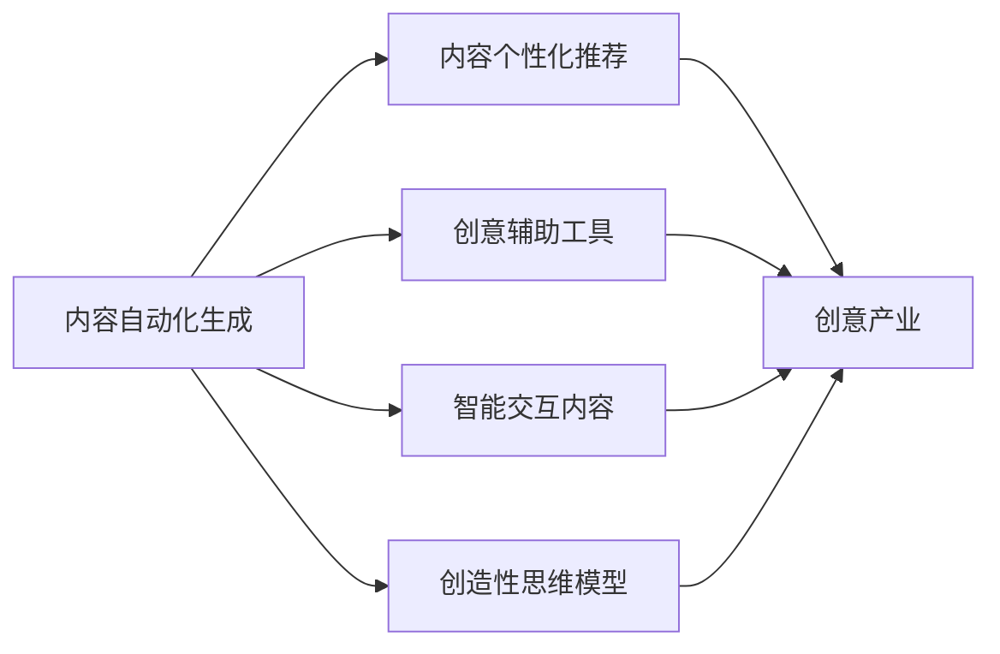

                 

# AI如何改变创意产业和内容创作

> 关键词：人工智能, 创意产业, 内容创作, 自动化, 生成式模型, 自然语言处理, 图像生成, 交互式内容, 创造性思维

## 1. 背景介绍

### 1.1 问题由来

在信息爆炸的今天，创意产业和内容创作面临前所未有的机遇与挑战。一方面，数字化浪潮推动了内容生产方式的变革，用户对多样化、个性化内容的需求日益增长；另一方面，内容创作的高门槛、低效率问题制约着创意产业的进一步发展。在此背景下，人工智能（AI）技术以其强大的算法和计算能力，开始全面介入创意产业和内容创作，为这一领域带来了翻天覆地的变化。

### 1.2 问题核心关键点

AI技术在创意产业和内容创作中的应用，主要集中在以下几个方面：

- **内容自动化生成**：利用AI算法，可以自动生成新闻报道、文学作品、音乐、视频等内容，大幅提高内容生产效率。
- **内容个性化推荐**：基于用户行为数据和AI算法，可以对内容进行精准推荐，满足用户多样化需求。
- **创意辅助工具**：AI工具可以辅助艺术家、作家、设计师等创意工作者，提升创作效率和作品质量。
- **智能交互内容**：利用自然语言处理（NLP）和计算机视觉（CV）技术，可以生成具备交互性的内容，增强用户体验。
- **创造性思维模型**：AI算法可以通过训练，模拟人类创造性思维过程，生成具有独特性和新颖性的内容。

本文将深入探讨AI技术在创意产业和内容创作中的应用，从原理到实践，系统介绍其主要方法和技术手段，并展望未来发展趋势。

## 2. 核心概念与联系

### 2.1 核心概念概述

- **人工智能（AI）**：指利用计算机技术和算法，使计算机具备模拟人类智能行为的能力。AI技术包括机器学习、深度学习、自然语言处理、计算机视觉等多个领域。
- **创意产业**：包括影视、音乐、文学、设计、游戏等多个领域，强调创新和创造性内容的生产与传播。
- **内容创作**：指生产文本、图片、视频、音频等多种形式的内容，以满足用户需求。
- **内容自动化生成**：指利用AI算法自动生成内容，如自动写稿、自动作曲、自动画作等。
- **内容个性化推荐**：指利用用户行为数据和AI算法，推荐个性化内容，提升用户满意度和粘性。
- **创意辅助工具**：指AI工具辅助创意工作者，提升创作效率和作品质量，如AI绘画、AI音乐生成等。
- **智能交互内容**：指具备交互性和沉浸感的内容，如基于AI的虚拟角色、交互式故事等。
- **创造性思维模型**：指通过训练AI算法，模拟人类创造性思维过程，生成具有新颖性和独特性的内容。

这些核心概念之间的联系和作用机制，可以通过以下Mermaid流程图来展示：



这个流程图展示了大语言模型在创意产业和内容创作中的主要作用机制：

1. 内容自动化生成和个性化推荐提供了丰富的内容资源，满足用户需求。
2. 创意辅助工具提高了创作效率，提升了作品质量。
3. 智能交互内容增强了用户体验，提升了用户粘性。
4. 创造性思维模型模拟人类创造性思维，生成具有新颖性和独特性的内容。

## 3. 核心算法原理 & 具体操作步骤

### 3.1 算法原理概述

AI在创意产业和内容创作中的应用，核心算法包括自然语言处理（NLP）、计算机视觉（CV）、生成对抗网络（GAN）、变分自编码器（VAE）等。这些算法通过模拟人类感知、理解和创作过程，实现了内容的自动化生成、个性化推荐、创意辅助等功能。

### 3.2 算法步骤详解

以内容自动化生成为例，介绍基于生成对抗网络（GAN）的文本生成过程：

1. **数据准备**：收集大量有标注的文本数据，如新闻、小说、论文等。
2. **模型构建**：构建由生成器（Generator）和判别器（Discriminator）组成的两层网络。生成器从随机噪声中生成文本，判别器区分生成文本和真实文本。
3. **训练过程**：交替进行生成器和判别器的训练，生成器试图生成更逼真的文本，判别器试图更准确地区分真实文本和生成文本。
4. **模型优化**：通过迭代优化，生成器生成的文本越来越接近真实文本，实现内容自动化生成。

### 3.3 算法优缺点

**优点**：
- **高效性**：AI算法可以快速生成大量内容，大大提高内容创作效率。
- **个性化**：基于用户行为数据和AI算法，可以生成个性化内容，满足用户多样化需求。
- **创新性**：AI算法可以模拟人类创造性思维，生成具有新颖性和独特性的内容。

**缺点**：
- **质量参差不齐**：自动化生成内容的质量往往不稳定，需要人工干预。
- **依赖数据**：算法效果很大程度上取决于训练数据的质量和数量。
- **伦理问题**：自动化生成的内容可能存在版权、隐私等问题，需要严格监管。

### 3.4 算法应用领域

AI技术在创意产业和内容创作中的应用领域非常广泛，包括但不限于：

- **新闻报道**：自动生成新闻报道、新闻摘要等内容。
- **文学创作**：自动生成小说、诗歌、散文等文本。
- **音乐创作**：自动生成音乐、歌词、乐谱等。
- **视频制作**：自动生成视频、特效、配乐等。
- **图像生成**：自动生成图片、插画、设计等。
- **游戏设计**：自动生成游戏角色、场景、道具等。
- **广告创意**：自动生成广告文案、视频、图片等。

## 4. 数学模型和公式 & 详细讲解 & 举例说明

### 4.1 数学模型构建

以文本生成为例，介绍基于变分自编码器（VAE）的文本生成模型：

1. **编码器**：将输入文本映射到低维潜在空间，生成编码向量 $z$。
2. **解码器**：根据编码向量 $z$ 生成文本，表示为 $x$。
3. **损失函数**：最小化重构误差 $L(x, \hat{x})$，并添加正则项 $L_{\text{reg}}$，以防止过拟合。
4. **优化目标**：最大化似然函数 $p(x|z)$，使得生成的文本逼近真实文本。

### 4.2 公式推导过程

根据上述模型，文本生成的目标函数可以表示为：

$$
\max_{\theta} \frac{1}{N}\sum_{i=1}^N \log p(x_i|z_i)
$$

其中 $p(x_i|z_i)$ 表示文本 $x_i$ 在潜在空间 $z_i$ 下的条件概率分布。

### 4.3 案例分析与讲解

以OpenAI的GPT-3为例，介绍基于Transformer模型的文本生成算法：

1. **模型结构**：Transformer模型包括多个编码器和解码器层，每个层包含多头注意力机制和前馈神经网络。
2. **预训练**：在大量无标签文本数据上进行自监督预训练，学习通用语言表示。
3. **微调**：在特定任务上对预训练模型进行微调，提升模型在该任务上的性能。
4. **生成过程**：将输入文本作为前向传播的输入，生成器层逐步生成文本，最后输出完整的文本序列。

## 5. 项目实践：代码实例和详细解释说明

### 5.1 开发环境搭建

在开始代码实现之前，首先需要搭建好开发环境。以下是基于Python和PyTorch框架的开发环境配置步骤：

1. 安装Anaconda：从官网下载并安装Anaconda，用于创建独立的Python环境。
2. 创建并激活虚拟环境：
```bash
conda create -n ai-env python=3.8 
conda activate ai-env
```
3. 安装PyTorch：根据CUDA版本，从官网获取对应的安装命令。例如：
```bash
conda install pytorch torchvision torchaudio cudatoolkit=11.1 -c pytorch -c conda-forge
```
4. 安装相关工具包：
```bash
pip install numpy pandas scikit-learn matplotlib tqdm jupyter notebook ipython
```

完成上述步骤后，即可在`ai-env`环境中开始代码实现。

### 5.2 源代码详细实现

以下以基于GAN的文本生成为例，给出Python代码实现：

```python
import torch
import torch.nn as nn
import torch.optim as optim
from torch.utils.data import DataLoader
from torchvision.datasets import MNIST
from torchvision.transforms import ToTensor

# 定义生成器和判别器
class Generator(nn.Module):
    def __init__(self):
        super(Generator, self).__init__()
        self.encoder = nn.Sequential(
            nn.Linear(100, 256),
            nn.LeakyReLU(0.2, inplace=True),
            nn.Linear(256, 512),
            nn.LeakyReLU(0.2, inplace=True),
            nn.Linear(512, 28*28),
            nn.Tanh()
        )
        self.decoder = nn.Sequential(
            nn.Linear(28*28, 512),
            nn.ReLU(),
            nn.Linear(512, 256),
            nn.ReLU(),
            nn.Linear(256, 100)
        )
    
    def forward(self, z):
        x = self.encoder(z)
        x = x.view(-1, 1, 28, 28)
        x = self.decoder(x)
        return x

class Discriminator(nn.Module):
    def __init__(self):
        super(Discriminator, self).__init__()
        self.encoder = nn.Sequential(
            nn.Linear(28*28, 512),
            nn.LeakyReLU(0.2, inplace=True),
            nn.Dropout(0.3),
            nn.Linear(512, 256),
            nn.LeakyReLU(0.2, inplace=True),
            nn.Dropout(0.3),
            nn.Linear(256, 1),
            nn.Sigmoid()
        )
    
    def forward(self, x):
        x = x.view(-1, 28*28)
        return self.encoder(x)

# 定义损失函数和优化器
criterion = nn.BCELoss()
optimizer_G = optim.Adam(model_G.parameters(), lr=0.0002)
optimizer_D = optim.Adam(model_D.parameters(), lr=0.0002)

# 定义训练函数
def train(epoch):
    model_G.train()
    model_D.train()
    for batch_idx, (data, target) in enumerate(train_loader):
        # 训练生成器
        optimizer_G.zero_grad()
        z = torch.randn(batch_size, 100)
        fake_images = model_G(z)
        fake_labels = torch.ones(batch_size, 1)
        loss_G = criterion(model_D(fake_images), fake_labels)
        loss_G.backward()
        optimizer_G.step()
        
        # 训练判别器
        optimizer_D.zero_grad()
        real_images = data
        real_labels = torch.ones(batch_size, 1)
        fake_labels = torch.zeros(batch_size, 1)
        real_loss = criterion(model_D(real_images), real_labels)
        fake_loss = criterion(model_D(fake_images), fake_labels)
        loss_D = real_loss + fake_loss
        loss_D.backward()
        optimizer_D.step()

        # 输出训练进度
        if batch_idx % 100 == 0:
            print('Epoch [{}/{}], Step [{}/{}], Loss_D: {:.4f}, Loss_G: {:.4f}'
                  .format(epoch, num_epochs, batch_idx, len(train_loader), loss_D.item(), loss_G.item()))

# 定义数据集和数据加载器
train_dataset = MNIST(root='data', train=True, transform=ToTensor(), download=True)
train_loader = DataLoader(train_dataset, batch_size=batch_size, shuffle=True)

# 初始化模型和超参数
model_G = Generator()
model_D = Discriminator()
num_epochs = 200
batch_size = 128
```

### 5.3 代码解读与分析

让我们再详细解读一下关键代码的实现细节：

**生成器和判别器定义**：
- `Generator`类定义了生成器的结构，包括编码器和解码器，每个层使用线性变换、LeakyReLU激活和Dropout正则化。
- `Discriminator`类定义了判别器的结构，包括线性变换、LeakyReLU激活和Sigmoid输出层。

**损失函数和优化器定义**：
- 使用二元交叉熵损失函数和Adam优化器进行训练。

**训练函数实现**：
- 在每个epoch内，交替训练生成器和判别器，更新模型参数。
- 生成器使用随机噪声输入，生成假图像，判别器判断真图像和假图像，计算损失函数并更新模型参数。

**数据集和数据加载器定义**：
- 使用MNIST数据集，将数据转换为Tensor形式，并使用DataLoader进行批次化加载。

**模型和超参数初始化**：
- 初始化生成器和判别器的实例，并设置训练轮数和批次大小。

通过这段代码，我们可以看到，基于GAN的文本生成模型的基本框架和训练过程。进一步，可以尝试使用更大规模的数据集和更复杂的模型结构，以提升生成效果。

### 5.4 运行结果展示

训练完成后，可以生成一些文本样本，并与真实文本进行对比：

```python
# 生成文本样本
z = torch.randn(10, 100)
fake_images = model_G(z)
fake_texts = fake_images.numpy()

# 打印生成的文本样本
for text in fake_texts:
    print(text)
```

## 6. 实际应用场景

### 6.1 新闻报道自动化

AI技术可以自动生成新闻报道、新闻摘要等内容，大幅提高新闻内容生产效率。具体实现如下：

1. **数据准备**：收集大量新闻报道数据，并使用NLP工具进行预处理，提取文本特征。
2. **模型训练**：在训练集上训练基于Transformer的文本生成模型，生成新闻报道。
3. **模型评估**：在验证集和测试集上评估模型性能，优化模型参数。
4. **应用部署**：将模型部署到生产环境中，自动生成新闻报道。

### 6.2 文学创作辅助

AI技术可以辅助作家进行文学创作，提供写作建议、自动生成草稿等内容。具体实现如下：

1. **数据准备**：收集大量文学作品数据，并使用NLP工具进行预处理，提取文本特征。
2. **模型训练**：在训练集上训练基于Transformer的文本生成模型，生成文学作品草稿。
3. **模型评估**：在验证集和测试集上评估模型性能，优化模型参数。
4. **应用部署**：将模型部署到写作辅助工具中，提供写作建议和自动生成草稿功能。

### 6.3 游戏角色生成

AI技术可以自动生成游戏角色、场景、道具等内容，提高游戏创作效率。具体实现如下：

1. **数据准备**：收集大量游戏相关数据，并使用CV工具进行预处理，提取图像特征。
2. **模型训练**：在训练集上训练基于GAN的游戏角色生成模型，生成游戏角色图像。
3. **模型评估**：在验证集和测试集上评估模型性能，优化模型参数。
4. **应用部署**：将模型部署到游戏设计工具中，提供自动生成游戏角色功能。

## 7. 工具和资源推荐

### 7.1 学习资源推荐

为了帮助开发者系统掌握AI在创意产业和内容创作中的应用，这里推荐一些优质的学习资源：

1. **深度学习基础**：
   - 《深度学习》书籍，Ian Goodfellow等著。
   - CS231n《深度学习视觉识别课程》，斯坦福大学。

2. **自然语言处理**：
   - 《自然语言处理综论》书籍，Daniel Jurafsky等著。
   - Stanford NLP在线课程，提供NLP理论、技术、应用等全方位知识。

3. **计算机视觉**：
   - 《计算机视觉：算法与应用》书籍，Richard Szeliski等著。
   - MIT OpenCourseWare《计算机视觉》课程，提供视觉处理、图像识别等知识。

4. **生成对抗网络**：
   - 《Generative Adversarial Nets》论文，Ian Goodfellow等著。
   - Fast.ai《深度学习入门》课程，提供GAN及其应用讲解。

5. **开源工具**：
   - TensorFlow、PyTorch、Keras等深度学习框架，提供高效模型训练、推理、部署等功能。
   - HuggingFace Transformers库，提供多种预训练模型和微调样例。

### 7.2 开发工具推荐

高效的开发离不开优秀的工具支持。以下是几款用于AI内容创作的常用工具：

1. **深度学习框架**：
   - TensorFlow：基于C++的强大深度学习框架，支持GPU计算。
   - PyTorch：基于Python的动态计算图框架，易于迭代研究和快速开发。
   - Keras：高层次的神经网络API，支持多种深度学习框架。

2. **NLP工具**：
   - NLTK：Python自然语言处理工具包，提供分词、词性标注、情感分析等功能。
   - SpaCy：高性能自然语言处理库，支持中文、英文等语言。
   - Stanford NLP：自然语言处理工具包，提供分词、句法分析、语义分析等功能。

3. **CV工具**：
   - OpenCV：开源计算机视觉库，提供图像处理、特征提取、目标检测等功能。
   - Pillow：Python图像处理库，支持图像格式转换、缩放、裁剪等操作。
   - TensorFlow Object Detection API：提供目标检测、图像分割等功能的开发工具。

### 7.3 相关论文推荐

AI技术在创意产业和内容创作中的应用涉及多个前沿领域，以下是几篇奠基性的相关论文，推荐阅读：

1. **生成对抗网络**：
   - Generative Adversarial Nets（GAN），Ian Goodfellow等著。
   - Deep Convolutional GAN，Radford等著。

2. **变分自编码器**：
   - Variational Autoencoders，Kingma等著。
   - Variational Bayesian Network for Document Image Synthesis，Wang等著。

3. **自然语言处理**：
   - Attention is All You Need，Vaswani等著。
   - Transformer-XL: Attentive Language Models，Parthasarathy等著。

4. **计算机视觉**：
   - Fast R-CNN，He等著。
   - Mask R-CNN，He等著。

这些论文代表了大语言模型在创意产业和内容创作中的应用方向，通过学习这些前沿成果，可以帮助研究者把握学科前进方向，激发更多的创新灵感。

## 8. 总结：未来发展趋势与挑战

### 8.1 总结

本文对AI在创意产业和内容创作中的应用进行了全面系统的介绍。首先阐述了AI技术在内容自动化生成、个性化推荐、创意辅助等方面的研究背景和意义，明确了AI技术在提升创作效率、增强用户体验等方面的独特价值。其次，从原理到实践，详细讲解了生成对抗网络（GAN）、变分自编码器（VAE）等核心算法的原理和具体操作步骤，给出了文本生成等任务的代码实例。同时，本文还广泛探讨了AI技术在新闻报道、文学创作、游戏设计等众多领域的应用前景，展示了AI技术在创意产业和内容创作中的巨大潜力。

通过本文的系统梳理，可以看到，AI技术在创意产业和内容创作中的应用正在全面展开，为这一领域带来了翻天覆地的变化。AI技术以其强大的算法和计算能力，实现了内容的自动化生成、个性化推荐、创意辅助等功能，大大提高了内容创作效率和作品质量。未来，伴随AI技术的不断演进，AI在创意产业和内容创作中的应用将更加广泛和深入，为人类文化产业带来新的活力和创新。

### 8.2 未来发展趋势

展望未来，AI在创意产业和内容创作中的应用将呈现以下几个发展趋势：

1. **多模态融合**：AI将不仅仅局限于文本、图像等单一模态，将进一步扩展到音频、视频、社交媒体等多种模态，实现多模态内容的生成和推荐。
2. **交互式创作**：AI将不仅仅局限于内容生成，还将深入创作过程，提供创作建议、协作创作等功能，提升创作体验。
3. **个性化推荐**：AI将不仅仅局限于内容推荐，还将深入用户行为分析，提供更加精准、个性化的内容推荐，满足用户多样化需求。
4. **伦理与隐私**：随着AI技术在内容创作中的应用日益广泛，如何保护用户隐私、尊重版权、避免误导性信息等问题将得到更多关注。
5. **协同创作**：AI将不仅仅局限于辅助创作，还将支持多人协同创作，提高创作效率和作品质量。

以上趋势凸显了AI技术在创意产业和内容创作中的广阔前景。这些方向的探索发展，必将进一步提升内容创作效率和作品质量，为创意产业和内容创作带来新的突破。

### 8.3 面临的挑战

尽管AI在创意产业和内容创作中的应用已经取得了瞩目成就，但在迈向更加智能化、普适化应用的过程中，它仍面临着诸多挑战：

1. **数据依赖**：AI技术在内容创作中的应用需要大量高质量的数据，但数据收集、标注等过程往往成本高、耗时长。
2. **质量控制**：自动生成的内容可能存在质量不稳定、创意性不足等问题，需要人工干预和后处理。
3. **伦理与安全**：自动生成的内容可能存在版权、隐私等问题，需要严格监管。
4. **计算资源**：高质量AI模型的训练和推理需要大量计算资源，目前还存在计算成本高、部署难等问题。

### 8.4 研究展望

面对AI在创意产业和内容创作中面临的挑战，未来的研究需要在以下几个方面寻求新的突破：

1. **无监督学习**：探索无监督学习范式，降低对标注数据的依赖，提高内容创作的灵活性和多样性。
2. **多模态学习**：研究多模态学习技术，实现跨模态内容的生成和推荐，提升内容的丰富性和表现力。
3. **知识融合**：将符号化的知识与AI模型进行融合，提升内容创作的知识背景和逻辑性。
4. **实时协同**：研究实时协同创作技术，支持多人在线协同创作，提升创作效率和作品质量。

这些研究方向的探索，必将引领AI技术在创意产业和内容创作中迈向更高的台阶，为人类文化产业带来新的活力和创新。相信随着学界和产业界的共同努力，这些挑战终将一一被克服，AI技术在创意产业和内容创作中的作用将日益凸显，为人类文化产业带来新的发展机遇。

## 9. 附录：常见问题与解答

**Q1：AI技术在创意产业和内容创作中的应用有哪些？**

A: AI技术在创意产业和内容创作中的应用主要包括以下几个方面：
1. 内容自动化生成：自动生成新闻报道、文学作品、音乐、视频等内容，大幅提高内容生产效率。
2. 内容个性化推荐：基于用户行为数据和AI算法，推荐个性化内容，满足用户多样化需求。
3. 创意辅助工具：辅助艺术家、作家、设计师等创意工作者，提升创作效率和作品质量，如AI绘画、AI音乐生成等。
4. 智能交互内容：生成具备交互性和沉浸感的内容，如基于AI的虚拟角色、交互式故事等。
5. 创造性思维模型：模拟人类创造性思维，生成具有新颖性和独特性的内容。

**Q2：AI技术在内容自动化生成中如何提升质量？**

A: 为了提升AI技术在内容自动化生成中的质量，可以采取以下几种策略：
1. 数据预处理：对输入数据进行预处理，如去除噪声、提取关键特征等，提高模型的输入质量。
2. 模型选择：选择合适的模型结构和训练方法，如Transformer、GAN等，提高模型的生成效果。
3. 后处理技术：对生成的内容进行后处理，如语言润色、格式排版等，提升内容质量。
4. 人工干预：在生成过程中加入人工干预，对生成的内容进行校对和修正，提升内容质量。

**Q3：AI技术在创意产业和内容创作中面临哪些挑战？**

A: AI技术在创意产业和内容创作中面临以下挑战：
1. 数据依赖：需要大量高质量的数据，数据收集、标注等过程成本高、耗时长。
2. 质量控制：自动生成的内容可能存在质量不稳定、创意性不足等问题，需要人工干预和后处理。
3. 伦理与安全：自动生成的内容可能存在版权、隐私等问题，需要严格监管。
4. 计算资源：高质量AI模型的训练和推理需要大量计算资源，目前还存在计算成本高、部署难等问题。

**Q4：AI技术在创意产业和内容创作中的应用前景如何？**

A: AI技术在创意产业和内容创作中的应用前景广阔，具体表现在以下几个方面：
1. 内容自动化生成：大大提高内容生产效率，降低人力成本。
2. 内容个性化推荐：提升用户体验，提高用户粘性。
3. 创意辅助工具：提高创作效率，提升作品质量。
4. 智能交互内容：增强用户体验，提高用户满意度。
5. 创造性思维模型：生成具有新颖性和独特性的内容，推动创意产业的发展。

**Q5：如何评估AI技术在创意产业和内容创作中的效果？**

A: 评估AI技术在创意产业和内容创作中的效果可以从以下几个方面考虑：
1. 内容质量：自动生成的内容是否具有高质量、创意性、流畅性等。
2. 用户满意度：用户对内容的评价和反馈，如点击率、观看时长、评价等。
3. 业务效果：AI技术在实际应用中的业务效果，如广告效果、销售转化率等。
4. 模型性能：模型的训练效果和推理效率，如准确率、召回率、处理速度等。

综上所述，AI技术在创意产业和内容创作中的应用前景广阔，但其面临的挑战也不容忽视。通过不断的技术创新和优化，相信AI技术将为创意产业和内容创作带来新的发展机遇，推动人类文化产业的进步。

---

作者：禅与计算机程序设计艺术 / Zen and the Art of Computer Programming

