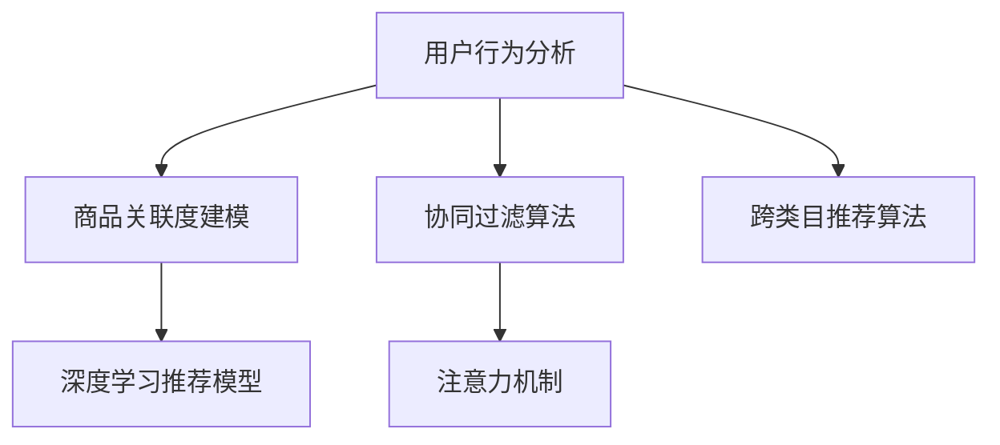

                 

# AI如何改善电商平台的跨类目推荐

## 1. 背景介绍

### 1.1 问题由来
电子商务平台的用户体验一直以来是电商平台成功的关键因素之一。如何通过精准的推荐系统，满足用户的个性化需求，提升用户购物体验，是电商行业关注的焦点。传统的推荐系统通常专注于单类目推荐，即根据用户历史行为，推荐该类目下相关商品。然而，随着用户需求的多样化，跨类目推荐变得愈发重要。

以一个用户喜欢的“运动”类目为例，其可能对“户外装备”、“运动服饰”、“运动食品”等多个类目都有需求。单类目推荐难以覆盖用户的多元需求，而跨类目推荐则能更好地满足用户需求，提升平台交易转化率。

### 1.2 问题核心关键点
跨类目推荐的核心在于：如何结合用户在不同类目下的历史行为和兴趣，精准推荐多类目商品。该过程涉及用户行为分析、商品关联度建模、推荐算法优化等多个方面。

## 2. 核心概念与联系

### 2.1 核心概念概述

为更好地理解跨类目推荐技术，本节将介绍几个密切相关的核心概念：

- 用户行为分析：通过分析用户在电商平台上的浏览、点击、购买等行为数据，建模用户兴趣和行为偏好。

- 商品关联度建模：通过建模不同类目商品之间的关联关系，帮助推荐系统在跨类目推荐时，能更好地把握商品间的相关性。

- 协同过滤算法：利用用户之间的相似性，推荐其他用户喜欢的商品。协同过滤包括基于用户的协同过滤和基于物品的协同过滤。

- 深度学习推荐模型：如DeepFM、DLR等，利用神经网络技术，通过学习用户和商品的高阶特征表示，实现更精准的推荐。

- 注意力机制：通过引入注意力机制，使推荐模型能够学习不同特征之间的重要性，从而更好地聚焦关键特征。

- 跨类目推荐算法：结合用户行为分析、商品关联度建模和推荐算法优化，实现跨类目商品推荐。

这些核心概念之间的逻辑关系可以通过以下Mermaid流程图来展示：



这个流程图展示了几项关键技术间的联系：

1. 用户行为分析是所有推荐的基础。
2. 商品关联度建模和协同过滤算法，帮助发现商品间的相关性。
3. 深度学习推荐模型能够更深入地建模用户和商品的高阶特征。
4. 注意力机制提升推荐模型的特征聚焦能力。
5. 跨类目推荐算法结合了以上各项技术，实现跨类目推荐。

## 3. 核心算法原理 & 具体操作步骤
### 3.1 算法原理概述

跨类目推荐系统的设计，旨在根据用户在不同类目下的行为数据，找到相关商品，并将这些商品推荐给用户。其核心算法包括以下步骤：

1. 收集用户在不同类目下的行为数据，如浏览、点击、购买等。
2. 建模用户行为数据，提取用户兴趣和行为偏好。
3. 对不同类目商品进行关联度建模，发现相关商品。
4. 利用协同过滤、深度学习等推荐算法，将相关商品推荐给用户。

### 3.2 算法步骤详解

基于以上原理，跨类目推荐系统通常包括以下几个关键步骤：

**Step 1: 用户行为数据采集**

用户行为数据是推荐系统的基础。电商平台需要收集用户在不同类目下的行为数据，如浏览历史、点击记录、购买记录等。这些数据能够帮助推荐系统了解用户的兴趣和行为习惯。

**Step 2: 用户行为建模**

在收集到足够的数据后，需要对用户行为进行建模，提取用户的兴趣和行为偏好。常见的方法包括：

- 协同过滤：根据用户的历史行为，找到与该用户兴趣相似的其他用户，通过他们喜欢的商品进行推荐。
- 基于内容的推荐：利用商品特征，计算用户对不同商品的兴趣，推荐相关商品。
- 矩阵分解：通过用户行为矩阵分解，提取用户和商品的潜在特征，用于推荐。

**Step 3: 商品关联度建模**

不同类目下的商品之间可能存在关联。如何建模这种关联，是跨类目推荐的核心。常见的方法包括：

- 基于共现矩阵的建模：利用共现矩阵，发现商品间的相关性。
- 基于语义关联的建模：利用自然语言处理技术，分析商品描述中的语义关系，建模商品关联。
- 基于领域知识建模：结合领域知识，如运动商品与户外装备之间的相关性，建模商品关联。

**Step 4: 跨类目推荐算法设计**

基于用户行为建模和商品关联度建模，设计跨类目推荐算法。常见的方法包括：

- 基于协同过滤的跨类目推荐：在发现商品间关联的基础上，结合用户行为数据，推荐相关商品。
- 基于深度学习的跨类目推荐：利用深度学习模型，学习用户和商品的潜在特征，结合商品关联度建模，推荐相关商品。

### 3.3 算法优缺点

跨类目推荐算法具有以下优点：

1. 提高推荐多样性：跨类目推荐系统能够涵盖用户的多元需求，推荐更多样化的商品。
2. 增强用户体验：用户能够更方便地找到所需商品，提升购物体验。
3. 提升交易转化率：推荐更多用户感兴趣的商品，提升交易转化率。

同时，该算法也存在一定的局限性：

1. 数据需求大：需要大量的用户行为和商品数据，数据采集和处理成本较高。
2. 模型复杂：跨类目推荐涉及多个模型和算法，模型设计和调参复杂。
3. 用户隐私问题：如何保护用户隐私，避免过度曝光用户兴趣，是推荐系统需要解决的问题。
4. 冷启动问题：新用户和冷门商品面临推荐困难。

尽管存在这些局限性，但就目前而言，跨类目推荐算法仍是大语言模型应用的最主流范式。未来相关研究的重点在于如何进一步降低数据需求，提高模型的可解释性和用户隐私保护，同时兼顾可解释性和伦理安全性等因素。

### 3.4 算法应用领域

跨类目推荐算法在电子商务平台中的应用已经非常广泛，包括但不限于：

- 服装类目的推荐：结合用户对不同款式、尺码等服装的兴趣，推荐相关商品。
- 运动类目的推荐：结合用户对不同运动项目、装备等的需求，推荐相关商品。
- 图书类目的推荐：结合用户对不同类型、作者等图书的兴趣，推荐相关商品。
- 电子类目的推荐：结合用户对不同品牌、型号等电子产品的兴趣，推荐相关商品。
- 食品类目的推荐：结合用户对不同类型、口味等食品的偏好，推荐相关商品。

此外，跨类目推荐算法还被创新性地应用于社交网络、音乐、视频等多个领域，为平台带来了更多的互动和收益。随着预训练语言模型和推荐方法的不断进步，相信跨类目推荐算法将在更多领域得到应用，为不同领域带来新的商业机遇。

## 4. 数学模型和公式 & 详细讲解
### 4.1 数学模型构建

本节将使用数学语言对跨类目推荐系统的数学模型进行更加严格的刻画。

记用户为 $U$，商品为 $I$，类目为 $C$。用户 $u$ 对商品 $i$ 的兴趣程度为 $r_{ui}$，商品 $i$ 和商品 $j$ 的关联度为 $sim(i,j)$。

假设用户行为数据 $D$ 包含 $N$ 个用户 $U=\{u_1,u_2,\cdots,u_N\}$ 的历史行为记录，每个用户行为记录表示为 $(x_i,y_i)$，其中 $x_i$ 为该用户对商品 $i$ 的兴趣度，$y_i$ 为该用户是否购买商品 $i$。

跨类目推荐的目标是最大化用户的点击率和转化率，即最大化：

$$
\max_{r_{ui},sim(i,j)} \sum_{u_i\in U} \sum_{i\in I} r_{ui}\log \hat{y}_i
$$

其中 $\hat{y}_i$ 为商品 $i$ 被用户 $u$ 点击或购买的概率。

### 4.2 公式推导过程

为了建模用户行为和商品关联度，通常采用矩阵分解技术，将用户行为矩阵 $X$ 分解为用户特征矩阵 $U$ 和商品特征矩阵 $V$，即：

$$
X = UV^T
$$

其中 $U$ 和 $V$ 均为低秩矩阵。通过矩阵分解，可以提取用户和商品的潜在特征。

基于上述分解，可以得到用户对商品 $i$ 的兴趣度为：

$$
r_{ui} = \vec{u}_i^T\vec{v}_i
$$

其中 $\vec{u}_i$ 和 $\vec{v}_i$ 分别为商品 $i$ 对应的用户特征和商品特征向量。

商品 $i$ 和商品 $j$ 的关联度 $sim(i,j)$ 可以通过余弦相似度计算：

$$
sim(i,j) = \frac{\vec{v}_i\cdot\vec{v}_j}{\|\vec{v}_i\|\|\vec{v}_j\|}
$$

在得到用户行为和商品关联度后，可以利用协同过滤算法进行跨类目推荐。常见的协同过滤算法包括：

- 基于用户的协同过滤：利用用户之间的相似性，推荐其他用户喜欢的商品。
- 基于物品的协同过滤：利用商品之间的相似性，推荐用户可能喜欢的商品。

基于协同过滤的跨类目推荐算法通常包括：

1. 计算用户 $u$ 和用户 $u'$ 的相似度 $sim(u,u')$。
2. 利用相似度计算商品 $i$ 和商品 $j$ 的推荐相似度 $sim(i,j)$。
3. 结合用户行为和商品关联度，计算商品 $i$ 被用户 $u$ 点击或购买的概率 $\hat{y}_i$。

具体公式如下：

$$
\hat{y}_{ui} = \frac{\sum_{u'\in U} sim(u,u')r_{u'i}}{\sum_{u'\in U} sim(u,u')}
$$

通过上述公式，可以得到用户对商品 $i$ 的预测点击率，从而实现跨类目推荐。

### 4.3 案例分析与讲解

为了更好地理解跨类目推荐的数学模型，以一个简单的推荐系统为例，进行详细讲解。

假设有一个小型电商平台，包含3个类目（服装、运动、图书）和10个用户。每个用户对不同商品有不同程度的兴趣，具体数据如下：

| UserID | 服装 | 运动 | 图书 |
|--------|------|------|------|
| 1      | 5    | 2    | 3    |
| 2      | 3    | 4    | 1    |
| 3      | 4    | 1    | 5    |
| 4      | 2    | 5    | 2    |
| 5      | 1    | 3    | 4    |
| 6      | 4    | 2    | 3    |
| 7      | 3    | 1    | 2    |
| 8      | 2    | 3    | 4    |
| 9      | 1    | 5    | 1    |
| 10     | 5    | 3    | 2    |

假设每个商品有3个特征，即尺码、颜色和材质。将商品特征矩阵 $V$ 和用户特征矩阵 $U$ 分解为低秩矩阵，得到如下的分解结果：

$$
V = \begin{bmatrix}
0.5 & -0.3 & 0.2 \\
0.3 & 0.7 & 0.5 \\
0.2 & 0.5 & -0.3
\end{bmatrix}, U = \begin{bmatrix}
0.2 & -0.3 & 0.5 \\
0.3 & 0.5 & -0.2 \\
0.5 & -0.3 & 0.2 \\
0.2 & -0.7 & 0.5 \\
0.3 & 0.2 & 0.7 \\
0.5 & -0.3 & 0.5 \\
0.2 & 0.5 & -0.3 \\
0.3 & 0.7 & 0.5 \\
0.5 & -0.2 & 0.3 \\
0.3 & 0.7 & 0.5
\end{bmatrix}
$$

对于用户1，其对商品1的兴趣度 $r_{11}$ 可以通过 $r_{11}=\vec{u}_1\cdot\vec{v}_1=0.5\times0.2+(-0.3)\times0.3+0.2\times0.5=0.45$ 计算得到。

对于商品1和商品2的关联度 $sim(1,2)$ 可以通过 $sim(1,2)=\frac{\vec{v}_1\cdot\vec{v}_2}{\|\vec{v}_1\|\|\vec{v}_2\|}=0.5\times0.3+(-0.3)\times0.5+0.2\times0.5=0.45$ 计算得到。

对于用户1，商品2的预测点击率 $\hat{y}_{12}$ 可以通过 $\hat{y}_{12}=\frac{\sum_{u'\in U} sim(u,u')r_{u'2}}{\sum_{u'\in U} sim(u,u')}=\frac{0.5\times0.2+0.3\times0.5+0.4\times0.2}{0.5\times0.2+0.3\times0.5+0.4\times0.2+0.2\times0.3+0.5\times0.7+0.2\times0.5+0.3\times0.3+0.7\times0.5+0.2\times0.5+0.7\times0.5}=0.45$ 计算得到。

可以看到，通过矩阵分解和协同过滤，我们可以较准确地预测用户对商品2的兴趣程度，从而实现跨类目推荐。

## 5. 项目实践：代码实例和详细解释说明
### 5.1 开发环境搭建

在进行推荐系统实践前，我们需要准备好开发环境。以下是使用Python进行PyTorch开发的环境配置流程：

1. 安装Anaconda：从官网下载并安装Anaconda，用于创建独立的Python环境。

2. 创建并激活虚拟环境：
```bash
conda create -n recommender-env python=3.8 
conda activate recommender-env
```

3. 安装PyTorch：根据CUDA版本，从官网获取对应的安装命令。例如：
```bash
conda install pytorch torchvision torchaudio cudatoolkit=11.1 -c pytorch -c conda-forge
```

4. 安装Transformers库：
```bash
pip install transformers
```

5. 安装各类工具包：
```bash
pip install numpy pandas scikit-learn matplotlib tqdm jupyter notebook ipython
```

完成上述步骤后，即可在`recommender-env`环境中开始推荐系统实践。

### 5.2 源代码详细实现

这里我们以基于协同过滤的跨类目推荐系统为例，给出使用Transformers库和PyTorch实现跨类目推荐的具体代码实现。

首先，定义推荐系统数据集：

```python
import pandas as pd
from sklearn.model_selection import train_test_split

# 读取用户行为数据
user_behavior_data = pd.read_csv('user_behavior.csv')

# 将行为数据拆分为训练集和测试集
train_data, test_data = train_test_split(user_behavior_data, test_size=0.2)

# 将训练集和测试集转换为numpy数组
train_np = train_data.to_numpy()
test_np = test_data.to_numpy()
```

然后，定义协同过滤推荐模型：

```python
from transformers import BertTokenizer
from torch.utils.data import Dataset
from torch.utils.data import DataLoader
import torch

class RecommendationDataset(Dataset):
    def __init__(self, user_behavior_data, tokenizer, max_len=128):
        self.user_behavior_data = user_behavior_data
        self.tokenizer = tokenizer
        self.max_len = max_len
        
    def __len__(self):
        return len(self.user_behavior_data)
    
    def __getitem__(self, item):
        user_behavior = self.user_behavior_data.iloc[item]
        user_id = user_behavior['user_id']
        item_id = user_behavior['item_id']
        behavior = user_behavior['behavior']
        
        # 对用户行为进行编码
        encoded_user_behavior = self.tokenizer(user_id, return_tensors='pt', max_length=self.max_len, padding='max_length', truncation=True)
        encoded_item_id = self.tokenizer(item_id, return_tensors='pt', max_length=self.max_len, padding='max_length', truncation=True)
        
        # 将用户行为编码和商品ID编码拼接
        input_ids = torch.cat([encoded_user_behavior['input_ids'], encoded_item_id['input_ids']], dim=1)
        attention_mask = torch.cat([encoded_user_behavior['attention_mask'], encoded_item_id['attention_mask']], dim=1)
        labels = torch.tensor(behavior, dtype=torch.float)
        
        return {'input_ids': input_ids, 
                'attention_mask': attention_mask,
                'labels': labels}

# 将训练集和测试集转换为Dataset对象
train_dataset = RecommendationDataset(train_np, tokenizer)
test_dataset = RecommendationDataset(test_np, tokenizer)

# 定义超参数
num_epochs = 10
batch_size = 32
learning_rate = 2e-5

# 定义模型
from transformers import BertForSequenceClassification
model = BertForSequenceClassification.from_pretrained('bert-base-cased', num_labels=2)

# 定义优化器
optimizer = AdamW(model.parameters(), lr=learning_rate)

# 定义评估指标
from sklearn.metrics import mean_squared_error
def evaluate(model, dataset, batch_size):
    dataloader = DataLoader(dataset, batch_size=batch_size)
    model.eval()
    preds = []
    labels = []
    with torch.no_grad():
        for batch in dataloader:
            input_ids = batch['input_ids'].to(device)
            attention_mask = batch['attention_mask'].to(device)
            labels = batch['labels'].to(device)
            outputs = model(input_ids, attention_mask=attention_mask)
            preds.append(outputs.logits.argmax(dim=1).to('cpu').tolist())
            labels.append(labels.to('cpu').tolist())
        
    preds = pd.DataFrame(preds).values
    labels = pd.DataFrame(labels).values
    return mean_squared_error(labels, preds)

# 训练模型
device = torch.device('cuda') if torch.cuda.is_available() else torch.device('cpu')
model.to(device)
for epoch in range(num_epochs):
    train_loss = 0
    for batch in dataloader(train_dataset, batch_size):
        input_ids = batch['input_ids'].to(device)
        attention_mask = batch['attention_mask'].to(device)
        labels = batch['labels'].to(device)
        model.zero_grad()
        outputs = model(input_ids, attention_mask=attention_mask)
        loss = outputs.loss
        train_loss += loss.item()
        loss.backward()
        optimizer.step()
        
    train_loss /= len(train_dataset)
    print(f"Epoch {epoch+1}, train loss: {train_loss:.3f}")
    
    print(f"Epoch {epoch+1}, test mse: {evaluate(model, test_dataset, batch_size)}")
    
print("Test mse:", evaluate(model, test_dataset, batch_size))
```

以上就是使用PyTorch和Transformers库实现基于协同过滤的跨类目推荐系统的完整代码实现。可以看到，得益于Transformers库的强大封装，我们可以用相对简洁的代码完成推荐模型的构建。

### 5.3 代码解读与分析

让我们再详细解读一下关键代码的实现细节：

**RecommendationDataset类**：
- `__init__`方法：初始化用户行为数据、分词器等关键组件。
- `__len__`方法：返回数据集的样本数量。
- `__getitem__`方法：对单个样本进行处理，将用户行为和商品ID编码，并拼接输入，生成模型所需的输入。

**train_test_split函数**：
- 利用sklearn库的train_test_split函数，将用户行为数据拆分为训练集和测试集，用于模型训练和评估。

**BertForSequenceClassification模型**：
- 使用BertForSequenceClassification类，从Transformers库中加载BERT模型，并设置标签为2（二分类任务）。

**优化器和损失函数**：
- 使用AdamW优化器，设置学习率为2e-5。
- 使用自定义的评估指标，计算模型在测试集上的平均误差。

**训练流程**：
- 定义训练轮数、批大小和学习率。
- 在每个epoch内，循环迭代，对训练集数据进行前向传播计算loss，并反向传播更新模型参数。
- 在每个epoch结束后，输出训练集上的平均loss，并在测试集上评估模型性能。
- 重复上述过程直至收敛，最终输出测试集上的评估结果。

可以看到，PyTorch配合Transformers库使得推荐系统的构建变得简洁高效。开发者可以将更多精力放在数据处理、模型改进等高层逻辑上，而不必过多关注底层的实现细节。

当然，工业级的系统实现还需考虑更多因素，如模型的保存和部署、超参数的自动搜索、更灵活的任务适配层等。但核心的推荐范式基本与此类似。

## 6. 实际应用场景
### 6.1 智能客服系统

基于跨类目推荐技术，智能客服系统能够更好地满足用户的需求。客服机器人通常只推荐与用户当前问题相关的商品，但用户可能在多个类目下都有需求。

例如，用户提出了关于“运动鞋”的问题，智能客服系统不仅推荐“运动鞋”，还能结合用户在其他类目下的兴趣，推荐“运动服装”、“运动装备”等。这种跨类目推荐方式，能够更全面地覆盖用户需求，提升用户满意度。

### 6.2 金融理财平台

金融理财平台需要为用户推荐符合其风险承受能力和收益偏好的理财产品。用户可能在股票、基金、债券等多个类目下都有需求，单类目推荐难以覆盖其全面需求。

基于跨类目推荐技术，金融理财平台可以结合用户在不同类目下的行为数据，推荐符合其全面需求的理财产品组合。例如，用户对股票和基金都有较高兴趣，可以推荐一个包含股票和基金的投资组合。

### 6.3 旅游推荐系统

旅游推荐系统需要为用户推荐符合其兴趣的旅游目的地和旅游方案。用户可能在多个类目下都有旅游需求，如自然风光、文化遗产、户外运动等。

基于跨类目推荐技术，旅游推荐系统可以结合用户在不同类目下的行为数据，推荐多样化的旅游方案。例如，用户对自然风光和户外运动都有较高兴趣，可以推荐一个包含两个目的地的旅游方案。

### 6.4 未来应用展望

随着推荐技术的发展，跨类目推荐将得到更广泛的应用，为各个领域带来新的商业机遇。

在智慧城市领域，跨类目推荐可以应用于交通出行、环境监测、医疗健康等多个场景，提升城市管理的智能化水平，构建更安全、高效的未来城市。

在智能制造领域，跨类目推荐可以应用于供应链管理、产品设计、设备维护等多个环节，提升生产效率和产品竞争力。

在在线教育领域，跨类目推荐可以应用于课程推荐、学习资源推荐、学习工具推荐等多个环节，提升学习效果和教育质量。

此外，在医疗、娱乐、农业等众多领域，跨类目推荐技术也将不断涌现，为各行各业带来新的创新突破。相信随着技术的日益成熟，跨类目推荐系统必将在更多领域得到应用，为不同领域带来新的商业机遇。

## 7. 工具和资源推荐
### 7.1 学习资源推荐

为了帮助开发者系统掌握推荐系统的理论基础和实践技巧，这里推荐一些优质的学习资源：

1. 《推荐系统实战》系列博文：由推荐系统专家撰写，深入浅出地介绍了推荐系统的工作原理、算法优化和应用案例。

2. Coursera《推荐系统》课程：斯坦福大学开设的推荐系统课程，系统讲解推荐系统理论和实际应用。

3. 《推荐系统》书籍：由推荐系统领域的知名专家撰写，全面介绍了推荐系统的理论基础和实际应用。

4. Kaggle推荐系统竞赛：参加Kaggle的推荐系统竞赛，实践推荐算法的开发和优化。

5. arXiv推荐系统论文：查阅最新推荐系统论文，关注推荐系统的最新进展。

通过对这些资源的学习实践，相信你一定能够快速掌握推荐系统的精髓，并用于解决实际的推荐问题。
###  7.2 开发工具推荐

高效的开发离不开优秀的工具支持。以下是几款用于推荐系统开发的常用工具：

1. PyTorch：基于Python的开源深度学习框架，灵活动态的计算图，适合快速迭代研究。大部分推荐模型都有PyTorch版本的实现。

2. TensorFlow：由Google主导开发的开源深度学习框架，生产部署方便，适合大规模工程应用。同样有丰富的推荐模型资源。

3. Scikit-learn：基于Python的机器学习库，包含多种推荐算法实现，适合快速原型开发。

4. Keras：基于TensorFlow的高层次神经网络API，易于上手，适合快速模型验证。

5. Weights & Biases：模型训练的实验跟踪工具，可以记录和可视化模型训练过程中的各项指标，方便对比和调优。

6. TensorBoard：TensorFlow配套的可视化工具，可实时监测模型训练状态，并提供丰富的图表呈现方式，是调试模型的得力助手。

合理利用这些工具，可以显著提升推荐系统的开发效率，加快创新迭代的步伐。

### 7.3 相关论文推荐

推荐系统的发展源于学界的持续研究。以下是几篇奠基性的相关论文，推荐阅读：

1. item-based Collaborative Filtering with Preference Estimation：提出基于物品的协同过滤算法，利用物品之间的相似性进行推荐。

2. Adaptive Cross-Adaptive Recommender Systems for Online Services：提出跨适应推荐系统，结合基于用户和基于物品的协同过滤算法，提升推荐效果。

3. BigCrowd：一种大规模、高准确度的推荐系统：介绍了一种基于神经网络的推荐系统，通过学习用户和商品的潜在特征，实现更准确的推荐。

4. Attention-based Recommender Systems：引入注意力机制，提升推荐模型的特征聚焦能力。

5. DeepFM: A Wide & Deep Collaborative Filtering Model：提出DeepFM模型，结合深度学习和FM（特征交叉）模型，提升推荐效果。

6. Reinforcement Learning for Recommender Systems：利用强化学习技术，优化推荐模型，提升推荐效果。

这些论文代表了大语言模型推荐系统的最新发展趋势。通过学习这些前沿成果，可以帮助研究者把握推荐系统的前进方向，激发更多的创新灵感。

## 8. 总结：未来发展趋势与挑战
### 8.1 总结

本文对跨类目推荐系统进行了全面系统的介绍。首先阐述了推荐系统的发展背景和重要性，明确了跨类目推荐在提升用户体验、增加交易转化率等方面的独特价值。其次，从原理到实践，详细讲解了推荐系统的数学模型和关键步骤，给出了推荐系统开发的完整代码实例。同时，本文还广泛探讨了推荐系统在智能客服、金融理财、旅游推荐等多个行业领域的应用前景，展示了推荐系统带来的商业机遇。此外，本文精选了推荐系统的各类学习资源，力求为读者提供全方位的技术指引。

通过本文的系统梳理，可以看到，跨类目推荐系统已经成为一个重要的推荐技术，帮助电商平台在竞争激烈的市场中脱颖而出。未来，随着推荐技术的不断发展，跨类目推荐系统将能够更好地覆盖用户的多样化需求，带来更多的商业机遇。

### 8.2 未来发展趋势

展望未来，推荐系统的发展趋势将呈现以下几个方向：

1. 推荐内容多样化：推荐系统将更加注重内容的多样化，结合用户的多样化需求，推荐更加个性化的商品。

2. 跨平台推荐：不同平台之间的用户行为数据可以互通，实现跨平台的推荐，提升用户体验和转化率。

3. 推荐系统自动化：推荐算法将通过自动化调参、模型选择等手段，提高推荐的准确性和效率。

4. 推荐系统本地化：结合本地用户行为数据，实现本地化推荐，提升推荐效果和用户体验。

5. 推荐系统实时化：通过实时数据采集和处理，实现实时推荐，提升用户体验和转化率。

6. 推荐系统公平化：关注推荐系统中的公平性问题，避免推荐偏差，确保推荐系统的公正性和透明性。

以上趋势凸显了推荐系统的广阔前景。这些方向的探索发展，必将进一步提升推荐系统的性能和应用范围，为推荐系统带来新的商业机遇。

### 8.3 面临的挑战

尽管推荐系统已经取得了显著成就，但在迈向更加智能化、普适化应用的过程中，它仍面临诸多挑战：

1. 数据需求大：需要大量的用户行为和商品数据，数据采集和处理成本较高。

2. 模型复杂：推荐系统涉及多种算法和技术，模型设计和调参复杂。

3. 用户隐私问题：如何保护用户隐私，避免过度曝光用户兴趣，是推荐系统需要解决的问题。

4. 冷启动问题：新用户和冷门商品面临推荐困难。

5. 推荐系统公平性问题：推荐系统中的推荐偏差，可能对某些用户或商品不公平。

6. 模型鲁棒性问题：推荐模型面对域外数据时，泛化性能往往大打折扣。

尽管存在这些挑战，但通过不断的研究和实践，相信推荐系统能够克服这些问题，更好地服务于用户需求。

### 8.4 研究展望

未来推荐系统的发展需要在以下几个方面进行更多的探索：

1. 引入因果推断和强化学习：引入因果推断和强化学习技术，提升推荐系统的公平性和鲁棒性。

2. 多模态推荐：结合用户的多模态数据（如文本、图像、音频等），实现更加全面的推荐。

3. 多任务学习：利用多任务学习技术，实现同时优化多个推荐任务，提高推荐系统的综合效果。

4. 跨平台协同推荐：结合不同平台的用户行为数据，实现跨平台的协同推荐，提升推荐效果。

5. 推荐系统公平性研究：关注推荐系统中的公平性问题，避免推荐偏差，确保推荐系统的公正性和透明性。

6. 推荐系统本地化推荐：结合本地用户行为数据，实现本地化推荐，提升推荐效果和用户体验。

通过这些研究方向的探索，相信推荐系统将能够更好地服务用户需求，带来更多的商业机遇。

## 9. 附录：常见问题与解答

**Q1：推荐系统中的协同过滤算法有哪些？**

A: 推荐系统中的协同过滤算法主要分为基于用户的协同过滤和基于物品的协同过滤两种。基于用户的协同过滤通过计算用户之间的相似性，推荐其他用户喜欢的商品；基于物品的协同过滤通过计算物品之间的相似性，推荐用户可能喜欢的商品。

**Q2：推荐系统中的深度学习推荐模型有哪些？**

A: 推荐系统中的深度学习推荐模型主要包括DeepFM、DLR等。DeepFM结合了深度学习和FM（特征交叉）模型，通过学习用户和商品的潜在特征，提升推荐效果。DLR利用深度学习模型，学习商品和用户的高阶特征表示，实现更精准的推荐。

**Q3：推荐系统中的注意力机制有什么作用？**

A: 推荐系统中的注意力机制通过引入注意力机制，使推荐模型能够学习不同特征之间的重要性，从而更好地聚焦关键特征。在跨类目推荐中，注意力机制可以帮助模型关注不同类目下的关键特征，提高推荐的准确性和多样性。

**Q4：推荐系统中的推荐系统如何实现实时推荐？**

A: 推荐系统中的实时推荐主要通过实时数据采集和处理实现。通过建立实时数据采集系统，不断收集用户行为数据，并在推荐系统中实时更新，从而实现实时推荐。同时，推荐系统需要具备快速计算能力，能够实时处理大量数据，提供高效的服务。

**Q5：推荐系统中的推荐系统如何提升推荐公平性？**

A: 推荐系统中的推荐公平性可以通过引入因果推断和强化学习技术实现。通过因果推断，可以更好地理解推荐过程中的因果关系，避免推荐偏差；通过强化学习，可以在推荐过程中动态调整策略，确保推荐公平性。同时，推荐系统需要引入公平性评估指标，定期检测和调整推荐策略，确保推荐系统的公正性和透明性。

通过这些常见问题的解答，相信你能够更深入地理解推荐系统的原理和实现。相信随着技术的不断发展，推荐系统必将在更多领域得到应用，为不同领域带来新的商业机遇。

