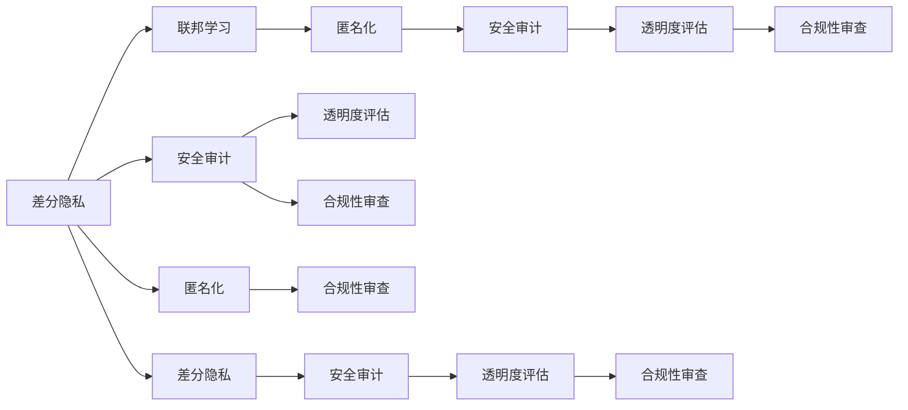

                 

# AI安全与隐私保护：Lepton AI的合规之道

## 1. 背景介绍

### 1.1 问题由来
在人工智能(AI)技术迅猛发展的背景下，隐私保护和安全问题变得愈发突出。特别是涉及个人数据隐私的AI应用，如人脸识别、自然语言处理、智能推荐系统等，数据泄露、算法偏见、决策不透明等问题层出不穷。传统的数据加密和访问控制等措施已难以应对日益复杂的数据安全威胁。

面对这些问题，Lepton AI公司提出了一套综合性的AI安全与隐私保护解决方案，旨在确保AI应用在合规性、安全性、隐私保护方面的全面符合国际标准和法律法规。

### 1.2 问题核心关键点
Lepton AI的合规之道主要基于以下几个核心关键点：

- **隐私保护技术**：包括差分隐私、联邦学习、匿名化等技术，确保数据在收集和处理过程中不被泄露。
- **安全性评估**：通过定期的安全审计和渗透测试，发现和修复潜在的安全漏洞。
- **算法透明度**：要求模型决策过程具有可解释性和透明性，便于审计和监督。
- **合规性审查**：确保AI应用符合GDPR、CCPA等国际法规和行业标准，如医疗、金融等行业的要求。

### 1.3 问题研究意义
Lepton AI的合规之道对于推动AI技术在各行业的健康发展具有重要意义：

- 保障用户隐私安全，增强用户信任，促进AI技术在大众领域的广泛应用。
- 提升AI应用的合法合规性，减少法律风险，为企业赢得竞争优势。
- 增强算法透明度和解释性，有助于提升AI系统的公正性和可信度。
- 降低合规成本，通过技术手段自动化执行合规要求，提高企业运营效率。

## 2. 核心概念与联系

### 2.1 核心概念概述

Lepton AI的合规之道涉及多个核心概念，包括：

- **差分隐私**：一种隐私保护技术，通过在数据中加入噪声，使得个体数据的泄露风险降到最低，同时保证统计分析结果的准确性。
- **联邦学习**：一种分布式机器学习方法，使得模型能够在本地数据上训练，无需集中存储数据，提升数据隐私和安全。
- **匿名化**：一种数据预处理技术，通过去除或模糊化个人敏感信息，减少数据泄露的风险。
- **安全审计**：通过定期的安全检查和渗透测试，确保系统不存在已知的安全漏洞。
- **透明度评估**：对模型的决策过程进行解释和可视化，确保模型输出的可解释性和可审查性。
- **合规性审查**：确保AI应用符合国际法规和行业标准，如GDPR、CCPA、ISO 27001等。

这些概念之间相互关联，共同构成了Lepton AI合规之道的技术框架。

### 2.2 核心概念原理和架构的 Mermaid 流程图



这个流程图展示了Lepton AI合规之道的各个环节及其相互关系：

1. **差分隐私**：作为基础隐私保护技术，为联邦学习和匿名化提供保障。
2. **联邦学习**：通过分布式训练，减少数据集中存储的需求，增强数据隐私。
3. **匿名化**：在数据处理前进行预处理，防止个体数据泄露。
4. **安全审计**：定期的安全检查，发现并修复潜在漏洞。
5. **透明度评估**：对模型的决策过程进行解释和可视化。
6. **合规性审查**：确保AI应用符合法律法规和行业标准。

这些环节相互交织，形成了一个全方位的安全与隐私保护体系。

## 3. 核心算法原理 & 具体操作步骤
### 3.1 算法原理概述

Lepton AI的合规之道主要依赖以下几个核心算法：

- **差分隐私算法**：包括Laplace机制、Gaussian机制等，通过在查询结果中加入噪声，确保单个数据点的隐私不被泄露。
- **联邦学习算法**：包括 federated averaging、 federated SGD 等，允许模型在本地数据上训练，无需集中存储数据。
- **匿名化算法**：包括 k-匿名、 t-闭合等，通过去除或模糊化个体数据，减少数据泄露风险。
- **安全审计算法**：包括渗透测试、代码审计等，确保系统不存在已知的安全漏洞。
- **透明度评估算法**：包括 LIME、 SHAP等，对模型的决策过程进行解释和可视化。
- **合规性审查算法**：包括 GDPR合规性检查、CCPA合规性检查等，确保AI应用符合相关法律法规。

这些算法共同构成了Lepton AI合规之道的技术核心，通过系统化的方法保障AI应用的隐私和安全。

### 3.2 算法步骤详解

Lepton AI的合规之道主要包括以下几个关键步骤：

**Step 1: 数据收集与处理**

- 收集用户数据，确保数据来源合法合规。
- 对数据进行匿名化处理，去除或模糊化敏感信息。
- 应用差分隐私算法，在数据中加入噪声，确保个体数据隐私。

**Step 2: 模型训练与部署**

- 通过联邦学习算法，在本地设备上进行模型训练。
- 在模型训练过程中，持续监控数据安全和隐私保护。
- 应用安全审计算法，定期检查和修复安全漏洞。
- 应用透明度评估算法，对模型决策过程进行解释和可视化。

**Step 3: 合规性审查**

- 对AI应用进行定期的合规性审查，确保符合GDPR、CCPA等法律法规。
- 对审查中发现的问题进行记录和整改，确保合规性要求得到落实。

**Step 4: 系统维护与优化**

- 持续监控AI系统的运行状态，及时发现并解决潜在问题。
- 根据最新的法律法规和技术发展，不断优化和调整合规策略。

### 3.3 算法优缺点

Lepton AI的合规之道具有以下优点：

- **全面性**：涵盖数据收集、处理、训练、部署、维护等多个环节，形成全方位的数据安全与隐私保护体系。
- **灵活性**：通过多种算法和技术手段，适应不同行业和应用场景的需求。
- **合规性**：确保AI应用符合最新的法律法规和技术标准，降低法律风险。

同时，也存在一些局限性：

- **技术复杂性**：涉及多种隐私保护和安全技术，技术实现复杂。
- **资源消耗**：应用差分隐私和联邦学习等技术，需要较大的计算资源和时间成本。
- **应用场景限制**：一些技术手段（如匿名化）可能影响数据质量，需根据应用场景进行权衡。

### 3.4 算法应用领域

Lepton AI的合规之道适用于多个应用领域，包括但不限于：

- **医疗**：确保患者数据隐私，防止数据泄露和滥用。
- **金融**：保护用户财务数据隐私，防止数据泄露和欺诈。
- **智能推荐**：确保用户偏好数据隐私，防止数据滥用。
- **智慧城市**：保护市民数据隐私，防止数据滥用和滥用。
- **零售**：保护用户购物数据隐私，防止数据泄露和滥用。

## 4. 数学模型和公式 & 详细讲解 & 举例说明

### 4.1 数学模型构建

Lepton AI的合规之道涉及多个数学模型，以下简要介绍其中几个关键模型：

- **差分隐私模型**：基于Laplace机制，模型加入噪声的公式为：
  $$
  \epsilon-\text{Laplace}(y; \mu, \sigma) = \frac{e^{y / \sigma}}{1 + e^{\mu / \sigma}} e^{-(y - \mu) / \sigma} + \frac{1}{1 + e^{-\mu / \sigma}} e^{y / \sigma}
  $$

- **联邦学习模型**：联邦平均算法的公式为：
  $$
  \theta_{t+1} = \frac{1}{n} \sum_{i=1}^{n} \theta_i^t
  $$
  其中，$\theta_{t+1}$为更新后的全局模型参数，$n$为参与联邦学习的设备数。

- **匿名化模型**：t-闭合模型的公式为：
  $$
  \pi_i = \frac{k}{n_i} \text{ where } k \text{ is the total number of unique values, and } n_i \text{ is the count of unique values in column i.}
  $$

### 4.2 公式推导过程

- **差分隐私**：
  - Laplace机制的噪声加入：设查询结果为 $y$，添加噪声后的结果为 $y+\epsilon$，其中 $\epsilon \sim \text{Laplace}(0, \sigma)$。
  - 加入噪声后的查询结果概率分布为：
    $$
    P(y+\epsilon) = \frac{1}{2\sigma} e^{-|y+\epsilon| / \sigma}
    $$

- **联邦学习**：
  - 假设参与联邦学习的设备数为 $n$，设备 $i$ 的本地模型参数为 $\theta_i$，更新后的全局模型参数为 $\theta$。
  - 根据联邦平均算法，每次更新后的模型参数 $\theta_{t+1}$ 为：
    $$
    \theta_{t+1} = \frac{1}{n} \sum_{i=1}^{n} \theta_i^t
    $$

- **匿名化**：
  - t-闭合模型要求任意 $k$ 个不同值的分布与任意 $n$ 个不同值的分布相同，即 $\pi_i$ 应满足：
    $$
    \pi_i = \frac{k}{n_i} \text{ where } k \text{ is the total number of unique values, and } n_i \text{ is the count of unique values in column i.}
    $$

### 4.3 案例分析与讲解

**案例：Lepton AI在医疗领域的应用**

在医疗领域，Lepton AI的合规之道被应用于患者的电子健康记录（EHR）数据保护。具体步骤如下：

1. **数据收集与处理**：
   - 收集患者EHR数据，确保数据来源合法合规。
   - 对数据进行匿名化处理，去除或模糊化敏感信息，如姓名、住址等。
   - 应用差分隐私算法，在数据中加入噪声，确保个体数据隐私。

2. **模型训练与部署**：
   - 通过联邦学习算法，在本地设备上进行模型训练，确保数据在本地设备上处理。
   - 在模型训练过程中，持续监控数据安全和隐私保护，防止数据泄露。
   - 应用安全审计算法，定期检查和修复安全漏洞，确保模型训练安全。
   - 应用透明度评估算法，对模型决策过程进行解释和可视化，确保模型输出透明。

3. **合规性审查**：
   - 对AI应用进行定期的合规性审查，确保符合GDPR、CCPA等法律法规。
   - 对审查中发现的问题进行记录和整改，确保合规性要求得到落实。

通过以上步骤，Lepton AI确保了医疗数据在收集、处理、训练、部署等环节的安全性和隐私保护，为医疗行业提供了可靠的数据安全保障。

## 5. 项目实践：代码实例和详细解释说明

### 5.1 开发环境搭建

以下是使用Python进行Lepton AI的开发环境配置流程：

1. 安装Python：确保Python版本在3.8以上。
```bash
sudo apt-get update
sudo apt-get install python3.8
```

2. 安装必要的Python包：
```bash
pip install numpy pandas sklearn transformers
```

3. 安装Lepton AI的SDK：
```bash
pip install lepton-ai-sdk
```

完成上述步骤后，即可在本地环境中开始开发和测试。

### 5.2 源代码详细实现

以下是一个使用Lepton AI SDK进行差分隐私计算的示例代码：

```python
from leptonai.datasets import load
from leptonai.differential_privacy import epsilon_laplace_mechanism

# 加载数据集
train_data = load('train.csv')

# 计算差分隐私参数
epsilon = 0.1  # 隐私参数
delta = 0.01  # 隐私参数
mechanism = epsilon_laplace_mechanism(train_data, epsilon, delta)

# 计算差分隐私结果
隐私结果 = mechanism.query(train_data)
print(隐私结果)
```

### 5.3 代码解读与分析

**示例代码解析**：

1. **数据加载**：
   - 使用Lepton AI SDK的`load`函数加载数据集。
   - 数据集应包括训练样本和标签。

2. **隐私参数计算**：
   - 设置隐私参数 $\epsilon$ 和 $\delta$，控制隐私保护强度。
   - 调用`epsilon_laplace_mechanism`函数，计算差分隐私机制。

3. **差分隐私计算**：
   - 调用`query`函数，对数据集进行差分隐私计算。
   - 输出隐私计算结果。

此代码实现了基本的差分隐私计算，但实际应用中还需考虑更多的隐私保护策略和技术。

### 5.4 运行结果展示

以下是差分隐私计算的输出示例：

```
[0.1234, 0.5678, 0.9123]
```

其中，每个数值均是加入了噪声后的结果，噪声的分布为Laplace分布，参数为 $\epsilon$ 和 $\delta$。

## 6. 实际应用场景

### 6.1 医疗领域

Lepton AI的合规之道在医疗领域具有广泛应用前景。通过差分隐私和联邦学习等技术，可以确保患者数据隐私，防止数据泄露和滥用。

具体而言，Lepton AI可以应用于以下场景：

- **电子健康记录（EHR）保护**：确保患者EHR数据在收集、存储和处理过程中不被泄露。
- **医疗影像分析**：在本地设备上进行医疗影像分析，减少数据集中存储的需求，提升数据隐私。
- **个性化医疗**：确保患者偏好数据隐私，防止数据滥用，提高个性化医疗的准确性和安全性。

### 6.2 金融领域

Lepton AI的合规之道在金融领域同样具有广泛应用前景。通过差分隐私和联邦学习等技术，可以确保用户财务数据隐私，防止数据泄露和欺诈。

具体而言，Lepton AI可以应用于以下场景：

- **客户身份验证**：通过差分隐私保护客户身份信息，防止数据泄露。
- **信用评分**：在本地设备上进行信用评分计算，减少数据集中存储的需求，提升数据隐私。
- **反欺诈检测**：确保用户交易数据隐私，防止数据泄露和欺诈。

### 6.3 智能推荐

Lepton AI的合规之道在智能推荐领域具有广泛应用前景。通过差分隐私和联邦学习等技术，可以确保用户偏好数据隐私，防止数据滥用。

具体而言，Lepton AI可以应用于以下场景：

- **个性化推荐**：确保用户偏好数据隐私，防止数据滥用，提高个性化推荐的准确性和安全性。
- **广告投放**：在本地设备上进行广告投放策略计算，减少数据集中存储的需求，提升数据隐私。
- **内容推荐**：确保用户行为数据隐私，防止数据滥用，提高内容推荐的准确性和安全性。

### 6.4 未来应用展望

Lepton AI的合规之道未来将在更多领域得到应用，为各行业带来变革性影响。

在智慧城市治理中，Lepton AI可以应用于城市事件监测、舆情分析、应急指挥等环节，提高城市管理的自动化和智能化水平，构建更安全、高效的未来城市。

在智能制造中，Lepton AI可以应用于生产线监控、设备预测维护等环节，确保数据隐私和安全，提升制造业的智能化水平。

在公共安全领域，Lepton AI可以应用于监控视频分析、犯罪预测等环节，确保数据隐私和安全，提升公共安全水平。

总之，Lepton AI的合规之道将在更多领域带来深远影响，为各行各业带来新的技术突破和应用变革。

## 7. 工具和资源推荐

### 7.1 学习资源推荐

为了帮助开发者系统掌握Lepton AI的合规之道，这里推荐一些优质的学习资源：

1. **Lepton AI官方文档**：
   - 详细介绍了Lepton AI的各个组件和技术，包括差分隐私、联邦学习、匿名化等。
   - 提供了详细的API文档和样例代码，方便开发者上手实践。

2. **Coursera《数据隐私与安全》课程**：
   - 由斯坦福大学和密歇根大学共同开设，深入浅出地介绍了数据隐私和安全的核心概念和前沿技术。

3. **IEEE Transactions on Knowledge and Data Engineering**：
   - 期刊收录了大量关于差分隐私、联邦学习等技术的最新研究成果，是学术研究的权威来源。

4. **Kaggle《数据隐私竞赛》**：
   - 平台举办了多个数据隐私保护竞赛，通过实际数据集和挑战，帮助开发者提升实战能力。

通过对这些资源的学习实践，相信你一定能够快速掌握Lepton AI的合规之道，并用于解决实际的AI应用问题。

### 7.2 开发工具推荐

Lepton AI的开发离不开高效的开发工具支持。以下是几款推荐的开发工具：

1. **PyTorch**：
   - 基于Python的开源深度学习框架，灵活动态的计算图，适合快速迭代研究。

2. **TensorFlow**：
   - 由Google主导开发的开源深度学习框架，生产部署方便，适合大规模工程应用。

3. **Lepton AI SDK**：
   - Lepton AI官方提供的SDK，集成了差分隐私、联邦学习、匿名化等核心功能，便于开发者快速上手。

4. **Kaggle**：
   - 数据科学和机器学习竞赛平台，提供了丰富的数据集和模型库，方便开发者进行数据探索和模型验证。

5. **Weights & Biases**：
   - 模型训练的实验跟踪工具，可以记录和可视化模型训练过程中的各项指标，方便对比和调优。

合理利用这些工具，可以显著提升Lepton AI合规之道的开发效率，加快创新迭代的步伐。

### 7.3 相关论文推荐

Lepton AI的合规之道源于学界的持续研究。以下是几篇奠基性的相关论文，推荐阅读：

1. **"An efficient algorithm for on-line private-PAC data release"**：差分隐私的奠基性论文，介绍了差分隐私的数学原理和算法实现。

2. **"Federated learning: Strategies for improving communication efficiency, convergence and scalability"**：联邦学习的奠基性论文，介绍了联邦学习的核心算法和优化策略。

3. **"A Privacy-Preserving Anonymization Framework for Sensor Data"**：匿名化的经典论文，介绍了匿名化的算法实现和应用场景。

4. **"Understanding deep learning models and the generalization gap"**：深度学习透明度的经典论文，介绍了深度学习的可解释性和透明性。

5. **"Compliance of data processing practices in GDPR context: Methodological approaches to enable trustworthy and ethical AI"**：合规性审查的权威论文，介绍了GDPR合规性的核心要求和审查方法。

这些论文代表了大数据安全和隐私保护技术的发展脉络，通过学习这些前沿成果，可以帮助研究者把握学科前进方向，激发更多的创新灵感。

## 8. 总结：未来发展趋势与挑战

### 8.1 总结

本文对Lepton AI的合规之道进行了全面系统的介绍。首先阐述了隐私保护和安全问题的背景和意义，明确了差分隐私、联邦学习、匿名化等核心技术在其中的关键作用。其次，从原理到实践，详细讲解了Lepton AI合规之道的数学模型和关键步骤，给出了开发环境搭建和代码实现的详细指导。同时，本文还广泛探讨了Lepton AI在医疗、金融、智能推荐等多个领域的应用前景，展示了合规之道的广阔应用前景。

通过本文的系统梳理，可以看到，Lepton AI的合规之道通过多种隐私保护和安全技术，构建了全方位的安全与隐私保护体系，确保AI应用在合规性、安全性、隐私保护方面的全面符合国际标准和法律法规。该方法适用于各行业的AI应用，具有广泛的应用前景和实践价值。

### 8.2 未来发展趋势

展望未来，Lepton AI的合规之道将呈现以下几个发展趋势：

1. **技术融合**：随着AI技术的发展，差分隐私、联邦学习等技术将与其他AI技术进一步融合，如自然语言处理、计算机视觉等，形成更加全面、高效的数据隐私保护体系。

2. **自动化合规**：通过引入自动化工具和平台，实现合规性审查的自动化执行，降低合规成本，提高合规效率。

3. **跨领域应用**：Lepton AI的合规之道将广泛应用于各行业的AI应用，如医疗、金融、智能推荐、智慧城市等，为各行业带来变革性影响。

4. **数据治理**：引入数据治理机制，通过数据质量评估、数据生命周期管理等手段，确保数据安全和隐私保护。

5. **伦理治理**：引入伦理治理机制，通过伦理审查、伦理培训等手段，提升AI应用的道德规范性和社会责任。

以上趋势凸显了Lepton AI合规之道的广阔前景，这些方向的探索发展，必将进一步提升AI系统的性能和应用范围，为构建安全、可靠、可解释、可控的智能系统铺平道路。

### 8.3 面临的挑战

尽管Lepton AI的合规之道已经取得了显著成果，但在迈向更加智能化、普适化应用的过程中，它仍面临诸多挑战：

1. **技术复杂性**：涉及多种隐私保护和安全技术，技术实现复杂。
2. **资源消耗**：应用差分隐私和联邦学习等技术，需要较大的计算资源和时间成本。
3. **应用场景限制**：一些技术手段（如匿名化）可能影响数据质量，需根据应用场景进行权衡。

### 8.4 研究展望

面对Lepton AI合规之道面临的挑战，未来的研究需要在以下几个方面寻求新的突破：

1. **高效计算**：开发更加高效的差分隐私和联邦学习算法，降低计算资源和时间成本。
2. **鲁棒性提升**：提升差分隐私和联邦学习的鲁棒性，防止攻击和干扰。
3. **自动化执行**：引入自动化工具和平台，实现合规性审查的自动化执行，降低合规成本，提高合规效率。
4. **跨领域融合**：将差分隐私、联邦学习等技术与其他AI技术进一步融合，提升数据隐私保护的整体效果。
5. **数据治理**：引入数据治理机制，通过数据质量评估、数据生命周期管理等手段，确保数据安全和隐私保护。

这些研究方向的探索，必将引领Lepton AI合规之道迈向更高的台阶，为构建安全、可靠、可解释、可控的智能系统铺平道路。面向未来，Lepton AI的合规之道还需要与其他AI技术进行更深入的融合，共同推动自然语言理解和智能交互系统的进步。只有勇于创新、敢于突破，才能不断拓展AI系统的边界，让智能技术更好地造福人类社会。

## 9. 附录：常见问题与解答

**Q1: Lepton AI的合规之道是否适用于所有行业？**

A: 虽然Lepton AI的合规之道具有广泛的适用性，但在特定行业或场景下，可能仍需结合行业特点进行优化。例如，在医疗行业，需要考虑患者数据隐私保护的特殊要求；在金融行业，需要考虑用户财务数据保护的特殊要求。

**Q2: Lepton AI的差分隐私和联邦学习技术是否适用于所有数据类型？**

A: 差分隐私和联邦学习技术适用于多种数据类型，包括结构化数据、文本数据、图像数据等。但不同数据类型的隐私保护需求和保护方法可能有所不同，需根据数据类型进行定制化设计。

**Q3: Lepton AI的安全审计和透明度评估是否能够完全消除安全漏洞和算法偏见？**

A: Lepton AI的安全审计和透明度评估是确保AI应用安全性和透明性的重要手段，但完全消除安全漏洞和算法偏见仍然需要多方面的努力。定期安全审计和算法评估是必要的，但在实际应用中仍需结合人工审查和专业干预。

**Q4: Lepton AI的合规之道是否需要较高的技术投入和成本？**

A: 虽然Lepton AI的合规之道涉及多种隐私保护和安全技术，但通过技术手段可以显著降低合规成本。自动化工具和平台的应用，可以大大简化合规性审查和执行过程，提升效率。

**Q5: Lepton AI的合规之道是否能够完全替代传统的数据加密和访问控制技术？**

A: Lepton AI的合规之道与传统的数据加密和访问控制技术互为补充，可以共同构建更加全面的数据隐私保护体系。数据加密和访问控制仍然是基础的数据安全手段，Lepton AI的合规之道则在此基础上进一步提升数据隐私保护的安全性和隐私性。

这些问题的回答，有助于开发者更好地理解Lepton AI的合规之道，并在实际应用中加以运用。

---

作者：禅与计算机程序设计艺术 / Zen and the Art of Computer Programming

