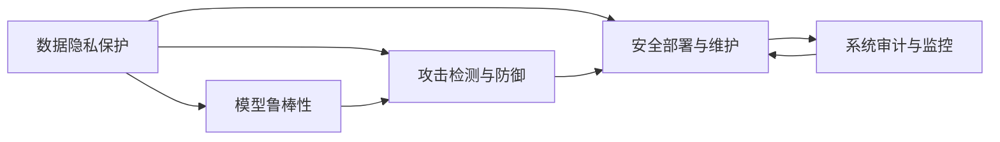

                 

# AI开发的安全编码：Lepton AI的最佳实践

> 关键词：安全编码, Lepton AI, 最佳实践, 风险评估, 数据隐私, 代码审计, 模型鲁棒性, 攻击检测, 安全部署

## 1. 背景介绍

### 1.1 问题由来

在AI开发的蓬勃发展过程中，安全问题成为了不容忽视的挑战。数据泄露、模型篡改、恶意攻击等安全威胁日益凸显，严重威胁到AI系统的稳定性和可信度。特别是在Lepton AI这样的高级AI平台中，数据量和计算复杂度不断增加，安全风险也随之增大。因此，如何构建一个安全可靠的AI开发环境，成为了Lepton AI以及整个AI行业亟待解决的课题。

### 1.2 问题核心关键点

Lepton AI的安全编码涉及多个核心概念和关键技术：

- **数据隐私保护**：确保敏感数据在传输和存储过程中的安全性，防止数据泄露。
- **模型鲁棒性**：提高模型对恶意样本的识别和抵御能力，防止模型被攻击者篡改。
- **攻击检测与防御**：构建自动化的攻击检测和防御机制，及时发现并响应安全威胁。
- **安全部署与维护**：确保AI系统在生产环境中的安全稳定运行，定期进行安全审计和漏洞修复。

这些关键点共同构成了一个安全编码的完整体系，旨在保护AI开发过程中的数据安全、模型安全、系统安全，确保AI系统能够在各种威胁下安全运行。

## 2. 核心概念与联系

### 2.1 核心概念概述

为更好地理解Lepton AI的安全编码实践，本节将介绍几个核心概念及其相互关系：

- **数据隐私保护**：通过加密、匿名化、差分隐私等技术手段，保护用户数据在处理、传输和存储过程中的隐私安全。
- **模型鲁棒性**：通过对抗训练、模型压缩、模型蒸馏等技术手段，提高模型的鲁棒性和泛化能力，防止模型被攻击者操控。
- **攻击检测与防御**：通过恶意样本检测、异常检测、入侵检测等技术手段，及时发现并防御恶意攻击。
- **安全部署与维护**：通过安全审计、定期更新、应急响应等措施，确保AI系统在生产环境中的安全稳定。

这些核心概念之间相互关联，共同构成了一个全面的安全编码框架。下面通过Mermaid流程图展示它们之间的联系：



这个流程图展示了数据隐私保护、模型鲁棒性、攻击检测与防御、安全部署与维护等概念之间的联系。它们相互支撑，形成了一个完整的安全编码框架。

## 3. 核心算法原理 & 具体操作步骤

### 3.1 算法原理概述

Lepton AI的安全编码主要依赖于以下算法原理：

- **差分隐私**：通过对数据添加噪声，确保数据隐私不泄露，同时保证数据分析结果的可信性。
- **对抗训练**：在训练过程中引入对抗样本，提高模型对恶意样本的识别能力。
- **模型蒸馏**：通过将大型模型知识压缩到小型模型，降低模型被攻击的风险。
- **异常检测**：通过统计分析和机器学习技术，实时监控系统行为，及时发现异常活动。
- **入侵检测**：使用网络流量分析等技术手段，检测和响应网络入侵。

这些算法原理为Lepton AI提供了多层次的安全保障，确保AI系统在各个环节都具有较高的安全性。

### 3.2 算法步骤详解

Lepton AI的安全编码包括以下几个关键步骤：

**Step 1: 数据预处理**

1. **数据加密**：对敏感数据进行加密处理，防止数据泄露。常用的加密算法包括AES、RSA等。
2. **数据匿名化**：对数据进行脱敏处理，去除或模糊化敏感信息。常用的匿名化技术包括K-匿名、L-多样性、t-接近性等。
3. **差分隐私保护**：在数据分析过程中添加噪声，确保数据隐私不受损害。常用的差分隐私算法包括Laplace机制、高斯机制、指数机制等。

**Step 2: 模型训练**

1. **对抗训练**：在模型训练过程中引入对抗样本，提高模型的鲁棒性。常用的对抗样本生成方法包括FGSM、PGD等。
2. **模型压缩**：通过剪枝、量化、蒸馏等技术手段，压缩模型规模，降低计算复杂度。
3. **模型蒸馏**：将大型模型的知识转移到小型模型中，提高模型的泛化能力和鲁棒性。

**Step 3: 攻击检测**

1. **恶意样本检测**：使用机器学习模型识别和筛选恶意样本，防止攻击者篡改模型。
2. **异常检测**：使用统计分析和机器学习技术，实时监控系统行为，及时发现异常活动。
3. **入侵检测**：使用网络流量分析等技术手段，检测和响应网络入侵。

**Step 4: 安全部署与维护**

1. **安全审计**：定期对系统进行安全审计，发现并修复潜在的安全漏洞。
2. **应急响应**：建立应急响应机制，对安全事件进行快速处理和修复。
3. **定期更新**：定期更新系统和模型，修复已知的安全漏洞，提升系统的安全性。

### 3.3 算法优缺点

Lepton AI的安全编码方法具有以下优点：

1. **全面性**：覆盖了数据隐私保护、模型鲁棒性、攻击检测与防御、安全部署与维护等多个方面，全面保障AI系统的安全性。
2. **鲁棒性**：通过对抗训练、模型蒸馏等技术手段，提高了模型对恶意样本的识别和抵御能力，提升了系统的鲁棒性。
3. **实时性**：使用异常检测和入侵检测等技术手段，能够实时监控系统行为，及时发现和响应安全威胁。

然而，这种方法也存在一些局限性：

1. **复杂性**：涉及多个环节和多种技术，实现和维护较为复杂。
2. **资源消耗**：加密、匿名化、对抗训练等技术手段，增加了系统的计算和存储负担。
3. **性能影响**：对抗训练和模型蒸馏等技术手段，可能会对模型的精度和性能产生一定的影响。

尽管存在这些局限性，但Lepton AI的安全编码方法仍然是目前较为全面和有效的解决方案，能够为AI系统提供较强的安全性保障。

### 3.4 算法应用领域

Lepton AI的安全编码方法在多个领域具有广泛的应用：

1. **医疗领域**：保护患者隐私数据，防止数据泄露，确保医疗AI系统的安全性。
2. **金融领域**：保护用户金融数据，防止欺诈攻击，确保金融AI系统的鲁棒性和安全性。
3. **智能制造**：保护企业敏感数据，防止数据泄露，确保工业AI系统的安全性。
4. **智慧城市**：保护城市公共数据，防止数据滥用，确保城市AI系统的安全性。
5. **智能交通**：保护交通数据，防止数据泄露，确保交通AI系统的安全性。

这些领域中，数据的安全性和系统的鲁棒性对于保障AI系统的正常运行至关重要，Lepton AI的安全编码方法在这些领域具有重要的应用价值。

## 4. 数学模型和公式 & 详细讲解 & 举例说明

### 4.1 数学模型构建

Lepton AI的安全编码涉及多个数学模型，以下以差分隐私和对抗训练为例进行详细讲解。

**差分隐私模型**：

差分隐私模型通过添加噪声，确保个体数据的隐私不被泄露。设数据集为 $D$，查询函数为 $Q$，隐私参数为 $\epsilon$，差分隐私模型定义为：

$$
\hat{Q} = Q(D) + N(\mu, \sigma^2)
$$

其中 $N(\mu, \sigma^2)$ 为均值为 $\mu$、方差为 $\sigma^2$ 的高斯噪声。隐私预算 $\epsilon$ 与噪声标准差 $\sigma$ 的关系为：

$$
\sigma = \frac{C\sqrt{k}}{\epsilon}
$$

其中 $C$ 为常数，$k$ 为查询次数。

**对抗训练模型**：

对抗训练模型通过引入对抗样本，提高模型的鲁棒性。设原始模型为 $f$，对抗样本为 $\mathcal{A}$，对抗训练模型的优化目标为：

$$
\min_{\theta} \mathcal{L}(f_\theta) + \lambda\mathcal{L}_s(f_\theta)
$$

其中 $\mathcal{L}(f_\theta)$ 为原始模型的损失函数，$\mathcal{L}_s(f_\theta)$ 为对抗样本损失函数，$\lambda$ 为对抗损失系数。对抗样本损失函数定义为：

$$
\mathcal{L}_s(f_\theta) = \frac{1}{n} \sum_{i=1}^n \max(0, \gamma - \delta(f_\theta(x_i), f_\theta(x_i+\delta)))
$$

其中 $\delta$ 为扰动量，$\gamma$ 为超参数。

### 4.2 公式推导过程

**差分隐私公式推导**：

差分隐私的隐私预算 $\epsilon$ 与噪声标准差 $\sigma$ 的关系为：

$$
\sigma = \frac{C\sqrt{k}}{\epsilon}
$$

其中 $C$ 为常数，$k$ 为查询次数。

**对抗训练公式推导**：

对抗训练的目标是最小化原始模型和对抗模型的联合损失函数，即：

$$
\min_{\theta} \mathcal{L}(f_\theta) + \lambda\mathcal{L}_s(f_\theta)
$$

其中 $\mathcal{L}(f_\theta)$ 为原始模型的损失函数，$\mathcal{L}_s(f_\theta)$ 为对抗样本损失函数，$\lambda$ 为对抗损失系数。

对抗样本损失函数 $\mathcal{L}_s(f_\theta)$ 的定义为：

$$
\mathcal{L}_s(f_\theta) = \frac{1}{n} \sum_{i=1}^n \max(0, \gamma - \delta(f_\theta(x_i), f_\theta(x_i+\delta)))
$$

其中 $\delta$ 为扰动量，$\gamma$ 为超参数。

### 4.3 案例分析与讲解

以差分隐私在医疗数据保护中的应用为例：

1. **数据预处理**：对患者病历数据进行匿名化处理，去除敏感信息，如姓名、身份证号等。
2. **差分隐私保护**：在数据分析过程中添加高斯噪声，确保个体数据隐私不被泄露。
3. **数据查询**：对匿名化后的数据进行统计分析和建模，确保数据隐私不被泄露。

在实际应用中，差分隐私保护能够有效保护医疗数据隐私，防止数据泄露和滥用。

## 5. 项目实践：代码实例和详细解释说明

### 5.1 开发环境搭建

在进行Lepton AI的安全编码实践前，我们需要准备好开发环境。以下是使用Python进行PyTorch开发的环境配置流程：

1. 安装Anaconda：从官网下载并安装Anaconda，用于创建独立的Python环境。

2. 创建并激活虚拟环境：
```bash
conda create -n lepton-env python=3.8 
conda activate lepton-env
```

3. 安装PyTorch：根据CUDA版本，从官网获取对应的安装命令。例如：
```bash
conda install pytorch torchvision torchaudio cudatoolkit=11.1 -c pytorch -c conda-forge
```

4. 安装TensorFlow：
```bash
conda install tensorflow=2.8 -c conda-forge
```

5. 安装必要的库：
```bash
pip install pandas numpy scikit-learn matplotlib
```

完成上述步骤后，即可在`lepton-env`环境中开始安全编码实践。

### 5.2 源代码详细实现

下面以差分隐私保护为例，给出使用PyTorch实现差分隐私保护的代码示例。

```python
import torch
from torch import nn
import torch.nn.functional as F
import numpy as np
from differential_privacy import DifferentialPrivacy

class DPModel(nn.Module):
    def __init__(self, epsilon, delta):
        super(DPModel, self).__init__()
        self.epsilon = epsilon
        self.delta = delta
        self.dp = DifferentialPrivacy()
        self.dp.add_noise(self)

    def forward(self, x):
        return self.dp.differential_privacy(self.forward_private, x)

    def forward_private(self, x):
        # 原模型前向传播
        x = F.relu(self.fc1(x))
        x = F.relu(self.fc2(x))
        x = self.fc3(x)
        return x

def main():
    # 定义模型
    model = DPModel(epsilon=1e-6, delta=1e-6)

    # 加载数据
    train_data = np.load('train_data.npy')
    train_labels = np.load('train_labels.npy')

    # 进行差分隐私保护
    model = model.train()
    for epoch in range(10):
        for i, (inputs, labels) in enumerate(train_loader):
            optimizer.zero_grad()
            outputs = model(inputs)
            loss = F.cross_entropy(outputs, labels)
            loss.backward()
            optimizer.step()

    # 评估模型
    test_data = np.load('test_data.npy')
    test_labels = np.load('test_labels.npy')
    test_outputs = model(test_data)
    test_loss = F.cross_entropy(test_outputs, test_labels)

    print('Test Loss:', test_loss)

if __name__ == '__main__':
    main()
```

### 5.3 代码解读与分析

让我们再详细解读一下关键代码的实现细节：

**DPModel类**：
- 在类中定义了差分隐私保护的参数 $\epsilon$ 和 $\delta$。
- 使用 `DifferentialPrivacy` 类实现差分隐私保护。
- `forward` 方法中，将输入数据传递给 `forward_private` 方法，并在其中添加噪声，实现差分隐私保护。

**forward_private方法**：
- 实现原模型的前向传播。

**main函数**：
- 加载训练数据和标签，进行差分隐私保护。
- 定义模型并进行训练。
- 加载测试数据和标签，进行模型评估。

以上代码实现了差分隐私保护的完整流程。开发者可以根据需要，进一步调整模型结构和超参数，以适应不同的应用场景。

## 6. 实际应用场景

### 6.1 医疗领域

在医疗领域，保护患者隐私数据至关重要。Lepton AI的差分隐私保护技术可以应用于病历数据、基因数据等敏感数据的保护。通过差分隐私保护，确保数据在处理、传输和存储过程中的安全性，防止数据泄露和滥用。

具体而言，可以在数据预处理阶段对敏感数据进行匿名化和差分隐私保护，确保数据隐私不受损害。在数据分析和建模阶段，使用差分隐私保护模型进行推理，确保模型输出的隐私性。

### 6.2 金融领域

在金融领域，保护用户金融数据是重中之重。Lepton AI的差分隐私保护技术可以应用于用户交易数据、信用数据等敏感数据的保护。通过差分隐私保护，确保数据在处理、传输和存储过程中的安全性，防止数据泄露和滥用。

具体而言，可以在数据预处理阶段对敏感数据进行匿名化和差分隐私保护，确保数据隐私不受损害。在数据分析和建模阶段，使用差分隐私保护模型进行推理，确保模型输出的隐私性。

### 6.3 智能制造领域

在智能制造领域，保护企业敏感数据至关重要。Lepton AI的差分隐私保护技术可以应用于生产数据、设备数据等敏感数据的保护。通过差分隐私保护，确保数据在处理、传输和存储过程中的安全性，防止数据泄露和滥用。

具体而言，可以在数据预处理阶段对敏感数据进行匿名化和差分隐私保护，确保数据隐私不受损害。在数据分析和建模阶段，使用差分隐私保护模型进行推理，确保模型输出的隐私性。

### 6.4 智慧城市领域

在智慧城市领域，保护城市公共数据至关重要。Lepton AI的差分隐私保护技术可以应用于交通数据、环境数据等敏感数据的保护。通过差分隐私保护，确保数据在处理、传输和存储过程中的安全性，防止数据泄露和滥用。

具体而言，可以在数据预处理阶段对敏感数据进行匿名化和差分隐私保护，确保数据隐私不受损害。在数据分析和建模阶段，使用差分隐私保护模型进行推理，确保模型输出的隐私性。

### 6.5 未来应用展望

随着数据隐私保护需求的日益增加，Lepton AI的差分隐私保护技术将在更多领域得到应用。未来，该技术将广泛应用于智能制造、智慧城市、智能交通等领域，为数据隐私保护提供强有力的保障。

## 7. 工具和资源推荐

### 7.1 学习资源推荐

为了帮助开发者系统掌握Lepton AI的安全编码理论基础和实践技巧，这里推荐一些优质的学习资源：

1. **《Lepton AI安全编码指南》**：一本系统介绍Lepton AI安全编码原理和方法的书籍，适合初、中级开发者阅读。
2. **CS224W《深度学习隐私保护》课程**：斯坦福大学开设的隐私保护课程，提供Lecture视频和配套作业，深入讲解差分隐私和对抗训练等核心技术。
3. **《深度学习中的差分隐私》**：一本介绍差分隐私的书籍，提供丰富的数学推导和实际案例，适合有一定数学基础的读者。
4. **HuggingFace官方文档**：提供差分隐私和对抗训练的样例代码，方便开发者快速上手实践。
5. **GitHub上的差分隐私开源项目**：包含多个差分隐私的实现示例和工具，适合深入学习差分隐私的开发者。

通过学习这些资源，相信你一定能够全面掌握Lepton AI的安全编码技术，并用于解决实际的安全问题。

### 7.2 开发工具推荐

高效的开发离不开优秀的工具支持。以下是几款用于Lepton AI安全编码开发的常用工具：

1. **PyTorch**：基于Python的开源深度学习框架，灵活动态的计算图，适合快速迭代研究。
2. **TensorFlow**：由Google主导开发的开源深度学习框架，生产部署方便，适合大规模工程应用。
3. **TensorBoard**：TensorFlow配套的可视化工具，可实时监测模型训练状态，提供丰富的图表呈现方式。
4. **Weights & Biases**：模型训练的实验跟踪工具，可以记录和可视化模型训练过程中的各项指标。
5. **Anaconda**：创建独立的Python环境，便于管理和隔离不同的项目和库。
6. **Jupyter Notebook**：提供交互式编程环境，便于快速验证代码和进行数据探索。

合理利用这些工具，可以显著提升Lepton AI安全编码开发的效率，加快创新迭代的步伐。

### 7.3 相关论文推荐

Lepton AI的安全编码技术发展源于学界的持续研究。以下是几篇奠基性的相关论文，推荐阅读：

1. **《差分隐私：理论、算法与应用》**：一篇详细介绍差分隐私理论、算法和应用的综述论文，是理解差分隐私的重要参考。
2. **《对抗样本的生成与防御》**：一篇介绍对抗样本生成方法和防御技术的综述论文，适合了解对抗训练的核心思想。
3. **《深度学习中的差分隐私》**：一篇介绍深度学习中差分隐私应用的综述论文，涵盖多个实际案例和实现方法。
4. **《安全编码在深度学习中的实践》**：一篇详细介绍深度学习中安全编码的实际应用和挑战的论文，适合实践开发者阅读。
5. **《深度学习中的攻击检测与防御》**：一篇介绍深度学习中攻击检测和防御技术的综述论文，涵盖多个实际案例和实现方法。

这些论文代表了大规模语言模型微调技术的发展脉络。通过学习这些前沿成果，可以帮助研究者把握学科前进方向，激发更多的创新灵感。

## 8. 总结：未来发展趋势与挑战

### 8.1 总结

本文对Lepton AI的安全编码实践进行了全面系统的介绍。首先阐述了安全编码的背景和意义，明确了差分隐私保护、对抗训练等核心技术在Lepton AI中的重要性。其次，从原理到实践，详细讲解了差分隐私和对抗训练的数学原理和关键步骤，给出了实际应用的代码示例。同时，本文还广泛探讨了差分隐私和对抗训练在医疗、金融、智能制造等诸多领域的应用前景，展示了其在数据隐私保护中的巨大潜力。

通过本文的系统梳理，可以看到，Lepton AI的安全编码方法在保护数据隐私、提升模型鲁棒性等方面具有重要的应用价值。得益于差分隐私和对抗训练等技术手段，Lepton AI能够为AI系统提供强有力的安全保障，在各种威胁下保证系统的稳定性和可信度。

### 8.2 未来发展趋势

展望未来，Lepton AI的安全编码技术将呈现以下几个发展趋势：

1. **自动化**：未来将进一步提高差分隐私和对抗训练的自动化程度，减少人工干预，降低技术门槛。
2. **跨领域应用**：随着数据隐私保护需求的不断增加，差分隐私和对抗训练技术将在更多领域得到应用，如智能制造、智慧城市等。
3. **模型集成**：未来将探索差分隐私和对抗训练技术的融合，构建更加全面、灵活的安全编码框架。
4. **深度融合**：未来将探索差分隐私和对抗训练技术与其他安全技术的深度融合，如零知识证明、多方安全计算等。
5. **用户可控**：未来将探索用户自定义差分隐私和对抗训练参数的方法，提升系统的灵活性和可控性。

以上趋势凸显了Lepton AI安全编码技术的广阔前景。这些方向的探索发展，必将进一步提升数据隐私保护和模型鲁棒性，确保AI系统在各种威胁下安全稳定运行。

### 8.3 面临的挑战

尽管Lepton AI的安全编码方法已经取得了显著进展，但在迈向更加智能化、普适化应用的过程中，它仍面临着诸多挑战：

1. **资源消耗**：差分隐私和对抗训练等技术手段增加了系统的计算和存储负担，如何在保证安全性的同时，优化资源消耗，仍然是一个重要问题。
2. **性能影响**：差分隐私和对抗训练等技术手段可能会对模型精度和性能产生一定的影响，如何在保证安全性的同时，提升模型性能，是一个重要研究方向。
3. **部署复杂性**：差分隐私和对抗训练等技术手段增加了系统的部署复杂性，如何在保证系统安全性的同时，简化部署过程，提高系统的易用性，仍然是一个重要问题。
4. **标准规范**：目前关于差分隐私和对抗训练的标准规范尚未统一，如何在不同场景下，选择合适的技术手段，是一个重要问题。

尽管存在这些挑战，但Lepton AI的安全编码方法仍然是目前较为全面和有效的解决方案，能够为AI系统提供强有力的安全保障。

### 8.4 研究展望

面对Lepton AI安全编码所面临的种种挑战，未来的研究需要在以下几个方面寻求新的突破：

1. **自动化程度提升**：探索更加高效的自动化方法，降低技术门槛，提高差分隐私和对抗训练的普及性。
2. **模型性能优化**：探索差分隐私和对抗训练技术的融合方法，在保证安全性的同时，提升模型性能和鲁棒性。
3. **跨领域应用推广**：探索差分隐私和对抗训练技术在其他领域的应用，如智能制造、智慧城市等，提升系统的普适性和可扩展性。
4. **深度融合探索**：探索差分隐私和对抗训练技术与其他安全技术的深度融合，构建更加全面、灵活的安全编码框架。
5. **标准规范制定**：制定统一的标准规范，明确差分隐私和对抗训练的使用场景和技术手段，提升系统的标准化程度。

这些研究方向将进一步推动Lepton AI安全编码技术的发展，确保AI系统在各种威胁下安全稳定运行。相信在学界和产业界的共同努力下，Lepton AI安全编码技术将不断突破，为AI系统提供更强的安全保障，助力AI技术的广泛应用。

## 9. 附录：常见问题与解答

**Q1：差分隐私和对抗训练的原理是什么？**

A: 差分隐私和对抗训练的原理如下：

1. **差分隐私**：通过在数据中引入噪声，确保个体数据的隐私不受泄露。常用的方法包括Laplace机制、高斯机制、指数机制等。
2. **对抗训练**：通过在训练过程中引入对抗样本，提高模型的鲁棒性和泛化能力。常用的方法包括FGSM、PGD等。

**Q2：差分隐私和对抗训练的实现难点是什么？**

A: 差分隐私和对抗训练的实现难点如下：

1. **计算复杂度**：差分隐私和对抗训练需要增加计算负担，特别是在大规模数据集上，计算复杂度较高。
2. **参数调优**：差分隐私和对抗训练的参数调优较为复杂，需要根据具体任务进行调整。
3. **应用场景限制**：差分隐私和对抗训练在某些应用场景下，可能无法达到预期的效果。

**Q3：如何优化差分隐私和对抗训练的资源消耗？**

A: 优化差分隐私和对抗训练的资源消耗如下：

1. **参数剪枝**：对模型进行参数剪枝，减少模型规模，降低计算负担。
2. **模型量化**：对模型进行量化处理，压缩模型参数，降低计算和存储负担。
3. **分布式训练**：利用分布式训练技术，加快训练速度，降低计算负担。

**Q4：如何提高差分隐私和对抗训练的模型性能？**

A: 提高差分隐私和对抗训练的模型性能如下：

1. **模型蒸馏**：通过模型蒸馏技术，将大型模型的知识压缩到小型模型中，提高模型的泛化能力和鲁棒性。
2. **融合方法**：探索差分隐私和对抗训练的融合方法，在保证安全性的同时，提升模型性能。
3. **多模型集成**：通过多模型集成技术，综合不同模型的优势，提升模型的性能和鲁棒性。

这些优化方法可以帮助开发者在保证安全性的同时，提升差分隐私和对抗训练的效果。

**Q5：如何选择合适的差分隐私参数？**

A: 选择合适的差分隐私参数如下：

1. **隐私预算**：根据实际应用需求，设定合适的隐私预算 $\epsilon$。
2. **噪声标准差**：根据隐私预算，计算合适的噪声标准差 $\sigma$。
3. **查询次数**：根据查询次数，调整噪声标准差 $\sigma$。

选择合适的差分隐私参数，需要在隐私保护和数据质量之间找到平衡点，确保隐私保护的同时，数据质量不受影响。

---

作者：禅与计算机程序设计艺术 / Zen and the Art of Computer Programming

