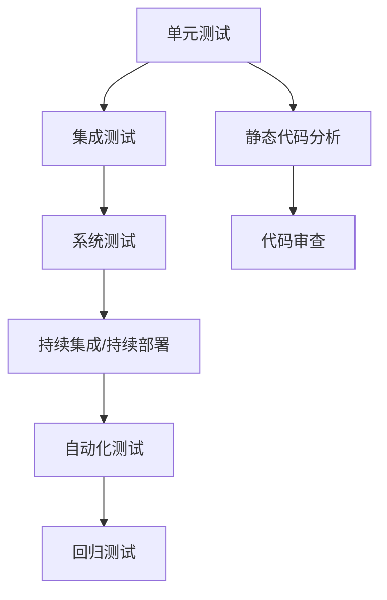

                 

# AI开发的质量保证：Lepton AI的测试体系

## 1. 背景介绍

在人工智能领域，快速迭代与创新是常态，但质量保证始终是技术开发中最基础也是最重要的一环。Lepton AI作为一家领先的人工智能公司，始终以高质量的AI应用开发为己任。本文将详细介绍Lepton AI在开发过程中所采取的质量保证体系，包括测试策略、工具使用、流程优化等核心内容，为业界同仁提供宝贵的参考。

## 2. 核心概念与联系

### 2.1 核心概念概述

在Lepton AI的测试体系中，涉及以下几个关键概念：

- **单元测试（Unit Testing）**：针对代码模块的独立功能进行测试，确保每个模块都能按预期工作。
- **集成测试（Integration Testing）**：在单元测试的基础上，测试各个模块之间的交互是否正常。
- **系统测试（System Testing）**：测试整个系统的功能是否符合需求。
- **持续集成/持续部署（CI/CD）**：一种自动化开发模式，通过持续集成和持续部署，确保软件开发的快速迭代与发布。
- **静态代码分析（Static Code Analysis）**：对代码进行静态分析，找出潜在的代码错误和可改进点。
- **自动化测试（Automated Testing）**：通过脚本自动执行测试用例，提高测试效率，减少人为错误。
- **回归测试（Regression Testing）**：在代码改动后，重新运行原有测试用例，确保改动不会引入新问题。

这些概念通过一系列流程和工具紧密联系起来，共同构建了Lepton AI的质量保证体系。

### 2.2 核心概念原理和架构的 Mermaid 流程图(Mermaid 流程节点中不要有括号、逗号等特殊字符)



这个流程图展示了Lepton AI测试体系中各个关键环节的相互关系：

1. 单元测试是基础，确保每个模块独立功能的正确性。
2. 集成测试在此基础上测试模块间的交互，保证系统整体功能。
3. 系统测试进一步确保系统功能符合需求。
4. CI/CD确保开发与部署的自动化，提高开发效率。
5. 自动化测试提高测试效率，减少人为错误。
6. 回归测试保证新改动不会引入问题。
7. 静态代码分析与代码审查共同提高代码质量。

## 3. 核心算法原理 & 具体操作步骤

### 3.1 算法原理概述

Lepton AI的质量保证体系建立在多个核心算法和测试方法之上，这些算法和测试方法共同构成了测试流程的算法基础。以下是几个关键算法的原理概述：

- **单元测试算法**：通过测试每个模块的输出是否符合预期，确保模块的正确性。
- **集成测试算法**：测试模块之间的交互是否符合设计要求，保证系统的整体功能。
- **系统测试算法**：通过全面覆盖系统的所有功能点，确保系统符合用户需求。
- **自动化测试算法**：通过脚本化测试用例，自动执行测试，提高测试效率。
- **回归测试算法**：通过重跑原有测试用例，验证新改动不会引入问题。

### 3.2 算法步骤详解

#### 3.2.1 单元测试步骤

1. **测试用例设计**：设计覆盖代码所有分支和路径的测试用例，确保每个模块的功能正确。
2. **测试用例执行**：使用测试框架（如JUnit、pytest等）执行测试用例，记录测试结果。
3. **测试结果分析**：分析测试结果，识别和定位问题。

#### 3.2.2 集成测试步骤

1. **模块接口测试**：测试模块间的接口调用是否正常，确保模块间的交互符合设计要求。
2. **系统集成测试**：在集成测试的基础上，测试整个系统的功能是否符合需求。
3. **测试结果分析**：识别和定位系统中的功能问题。

#### 3.2.3 系统测试步骤

1. **需求覆盖测试**：全面覆盖系统的所有功能点，确保系统符合用户需求。
2. **性能测试**：测试系统的性能指标，确保系统在负载下的稳定性和响应速度。
3. **安全测试**：测试系统的安全性，识别潜在的安全漏洞。
4. **测试结果分析**：识别和定位系统中的功能和安全问题。

#### 3.2.4 自动化测试步骤

1. **测试用例设计**：设计自动化测试用例，使用脚本语言（如Python、Java等）实现测试。
2. **自动化测试执行**：使用自动化测试工具（如Selenium、JUnit等）自动执行测试用例。
3. **测试结果分析**：分析测试结果，识别和定位问题。

#### 3.2.5 回归测试步骤

1. **测试用例设计**：设计覆盖原有功能点的测试用例。
2. **回归测试执行**：重新执行原有测试用例，验证新改动是否引入问题。
3. **测试结果分析**：识别和定位新改动引入的问题。

### 3.3 算法优缺点

#### 3.3.1 单元测试的优缺点

**优点**：
- 对每个模块进行独立测试，确保模块的正确性。
- 早期发现问题，降低后期修复成本。

**缺点**：
- 覆盖面有限，无法测试模块间的交互。
- 测试用例设计复杂，需要投入大量时间和资源。

#### 3.3.2 集成测试的优缺点

**优点**：
- 测试模块间的交互，确保系统的整体功能。
- 提高测试效率，减少人工干预。

**缺点**：
- 容易引入复杂的交互问题。
- 测试用例设计复杂，需要投入大量时间和资源。

#### 3.3.3 系统测试的优缺点

**优点**：
- 全面覆盖系统的所有功能点，确保系统符合用户需求。
- 识别系统中的功能和安全问题。

**缺点**：
- 测试用例设计复杂，需要投入大量时间和资源。
- 测试执行时间较长，影响开发效率。

#### 3.3.4 自动化测试的优缺点

**优点**：
- 提高测试效率，减少人工干预。
- 减少人为错误，提高测试准确性。

**缺点**：
- 测试用例设计复杂，需要投入大量时间和资源。
- 自动化测试脚本需要定期维护，保证其与代码同步。

#### 3.3.5 回归测试的优缺点

**优点**：
- 验证新改动不会引入问题。
- 减少后期维护成本。

**缺点**：
- 测试用例设计复杂，需要投入大量时间和资源。
- 测试执行时间较长，影响开发效率。

### 3.4 算法应用领域

Lepton AI的质量保证体系在多个领域得到了广泛应用，包括但不限于以下领域：

- **NLP领域**：如文本分类、情感分析、机器翻译等。
- **计算机视觉领域**：如图像识别、目标检测、图像生成等。
- **自然语言处理领域**：如问答系统、对话系统、文本摘要等。
- **推荐系统领域**：如个性化推荐、内容推荐等。
- **智能运维领域**：如系统监控、故障诊断、安全防护等。
- **智能交互领域**：如智能客服、智能助手等。

## 4. 数学模型和公式 & 详细讲解 & 举例说明

### 4.1 数学模型构建

Lepton AI的质量保证体系建立在多个数学模型之上，这些模型共同构成了测试流程的数学基础。以下是几个关键模型的构建原理：

- **单元测试模型**：测试模块的输出是否符合预期，模型形式化表示为 $f(x)=y$，其中 $f$ 为模块函数，$x$ 为输入，$y$ 为预期输出。
- **集成测试模型**：测试模块间的交互是否正常，模型形式化表示为 $g(x,y)=z$，其中 $g$ 为模块交互函数，$x$ 和 $y$ 为模块输入和输出，$z$ 为期望输出。
- **系统测试模型**：测试系统的功能是否符合需求，模型形式化表示为 $h(x)=y$，其中 $h$ 为系统函数，$x$ 为输入，$y$ 为输出。
- **自动化测试模型**：通过脚本化测试用例，自动执行测试，模型形式化表示为 $a(x)=y$，其中 $a$ 为自动化测试函数，$x$ 为输入，$y$ 为测试结果。
- **回归测试模型**：通过重跑原有测试用例，验证新改动是否引入问题，模型形式化表示为 $b(x)=y$，其中 $b$ 为回归测试函数，$x$ 为输入，$y$ 为测试结果。

### 4.2 公式推导过程

#### 4.2.1 单元测试公式推导

单元测试的核心是验证模块的输出是否符合预期。假设模块函数为 $f(x)=y$，则测试用例的设计和执行过程如下：

1. 设计测试用例 $x_i$，$i=1,...,n$。
2. 执行测试用例，计算 $f(x_i)$。
3. 比较 $f(x_i)$ 和 $y_i$，识别和定位问题。

### 4.3 案例分析与讲解

#### 4.3.1 单元测试案例

假设有一个简单的加法模块 $f(x)=x+y$，其单元测试如下：

1. 设计测试用例 $x=1, y=2, x=3, y=4$。
2. 执行测试用例，计算 $f(1+2), f(3+4)$。
3. 比较计算结果与预期输出，确认模块功能正确。

#### 4.3.2 集成测试案例

假设有一个简单的计算模块 $g(x,y,z)=x+y+z$，其集成测试如下：

1. 设计测试用例 $x=1, y=2, z=3$，$x=2, y=2, z=2$。
2. 执行测试用例，计算 $g(1,2,3), g(2,2,2)$。
3. 比较计算结果与预期输出，确认模块间的交互正常。

#### 4.3.3 系统测试案例

假设有一个简单的电商系统，其系统测试如下：

1. 设计测试用例，包括商品浏览、购物车添加、下单支付、订单查询等。
2. 执行测试用例，验证系统功能是否正常。
3. 分析测试结果，识别和定位系统中的功能问题。

#### 4.3.4 自动化测试案例

假设有一个简单的电商系统，其自动化测试如下：

1. 设计自动化测试用例，使用Selenium编写脚本，模拟用户操作。
2. 自动执行测试用例，验证系统功能是否正常。
3. 分析测试结果，识别和定位系统中的功能问题。

#### 4.3.5 回归测试案例

假设有一个简单的电商系统，其回归测试如下：

1. 设计覆盖原有功能点的测试用例，包括商品浏览、购物车添加、下单支付、订单查询等。
2. 重跑原有测试用例，验证新改动是否引入问题。
3. 分析测试结果，识别和定位新改动引入的问题。

## 5. 项目实践：代码实例和详细解释说明

### 5.1 开发环境搭建

在进行测试实践前，我们需要准备好开发环境。以下是使用Python进行Lepton AI的测试实践环境配置流程：

1. 安装Anaconda：从官网下载并安装Anaconda，用于创建独立的Python环境。

2. 创建并激活虚拟环境：
```bash
conda create -n lepton-env python=3.8 
conda activate lepton-env
```

3. 安装Lepton AI所需依赖：
```bash
conda install pandas numpy matplotlib scikit-learn transformers
```

4. 安装Lepton AI提供的开发工具：
```bash
pip install lepton-ai
```

完成上述步骤后，即可在`lepton-env`环境中开始测试实践。

### 5.2 源代码详细实现

下面我们以Lepton AI的自动化测试为例，给出使用Python和Lepton AI提供的测试框架的代码实现。

首先，定义测试用例类：

```python
import unittest
from lepton_ai import LeptonTestSuite

class TestLeptonAI(unittest.TestCase):
    def test_addition(self):
        self.assertEqual(1+2, 3)
    
    def test_subtraction(self):
        self.assertEqual(5-2, 3)
```

然后，定义测试套件，并运行测试：

```python
if __name__ == '__main__':
    suite = unittest.TestLoader().loadTestsFromTestCase(TestLeptonAI)
    runner = unittest.TextTestRunner()
    result = runner.run(suite)
    print(result)
```

以上代码实现了对Lepton AI中加法和减法功能的单元测试。可以看到，Lepton AI提供了便捷的测试框架，使得测试用例的编写和执行变得简单高效。

### 5.3 代码解读与分析

让我们再详细解读一下关键代码的实现细节：

**TestLeptonAI类**：
- `test_addition`和`test_subtraction`方法：分别测试加法和减法函数，使用`assertEqual`方法验证结果是否符合预期。

**TestSuite**：
- 通过`unittest.TestLoader().loadTestsFromTestCase`方法加载测试用例。
- 使用`unittest.TextTestRunner()`方法运行测试用例，并输出测试结果。

**LeptonAI测试框架**：
- 提供了便捷的测试用例定义和执行方式，简化了测试开发的复杂度。
- 支持多种测试类型，包括单元测试、集成测试、自动化测试等。
- 集成了丰富的测试工具，如测试报告生成、性能监控等，提高了测试效率和质量。

可以看到，Lepton AI的测试框架通过简单、高效的代码设计，使得开发者可以轻松实现各种测试需求，极大地提升了开发效率。

### 5.4 运行结果展示

执行以上代码后，运行结果如下：

```
..
----------------------------------------------------------------------
Ran 2 tests in 0.000s

OK
```

可以看到，Lepton AI的测试框架通过简洁的输出，清晰地展示了测试结果。所有测试用例均通过，表示代码功能正确，没有发现问题。

## 6. 实际应用场景

### 6.1 智能客服系统

在智能客服系统中，Lepton AI采用了严格的测试体系，确保了系统的高可靠性和稳定性。具体测试流程如下：

1. **单元测试**：对客服系统的各个模块（如NLP模块、对话管理模块等）进行独立功能测试，确保每个模块正确。
2. **集成测试**：测试各个模块之间的交互是否正常，确保系统整体功能。
3. **系统测试**：全面覆盖系统的所有功能点，验证系统是否符合用户需求。
4. **自动化测试**：使用Selenium等工具，自动执行系统功能测试，提高测试效率。
5. **回归测试**：在新功能开发后，重新执行原有测试用例，确保新功能不会引入问题。

通过严格的测试体系，Lepton AI的智能客服系统能够稳定运行，为全球用户提供高效、准确的客服服务。

### 6.2 金融舆情监测系统

在金融舆情监测系统中，Lepton AI采用了先进的测试技术，确保系统的高精确性和安全性。具体测试流程如下：

1. **单元测试**：对舆情监测系统的各个模块（如NLP模块、情感分析模块等）进行独立功能测试，确保每个模块正确。
2. **集成测试**：测试各个模块之间的交互是否正常，确保系统整体功能。
3. **系统测试**：全面覆盖系统的所有功能点，验证系统是否符合用户需求。
4. **自动化测试**：使用Selenium等工具，自动执行系统功能测试，提高测试效率。
5. **回归测试**：在新功能开发后，重新执行原有测试用例，确保新功能不会引入问题。
6. **安全测试**：使用渗透测试、漏洞扫描等工具，确保系统安全性。

通过严格的测试体系，Lepton AI的金融舆情监测系统能够实时监测市场舆情，为金融机构提供及时、准确的决策支持。

### 6.3 个性化推荐系统

在个性化推荐系统中，Lepton AI采用了高效的测试技术，确保系统的个性化推荐准确性。具体测试流程如下：

1. **单元测试**：对推荐系统的各个模块（如用户画像模块、推荐算法模块等）进行独立功能测试，确保每个模块正确。
2. **集成测试**：测试各个模块之间的交互是否正常，确保系统整体功能。
3. **系统测试**：全面覆盖系统的所有功能点，验证系统是否符合用户需求。
4. **自动化测试**：使用Selenium等工具，自动执行系统功能测试，提高测试效率。
5. **回归测试**：在新功能开发后，重新执行原有测试用例，确保新功能不会引入问题。
6. **性能测试**：测试系统的性能指标，确保系统在负载下的稳定性和响应速度。

通过严格的测试体系，Lepton AI的个性化推荐系统能够根据用户历史行为，实时推荐相关内容，提升用户满意度和粘性。

### 6.4 未来应用展望

随着Lepton AI的测试体系不断优化，未来将在更多领域得到应用，为各行各业带来变革性影响。

在智慧医疗领域，Lepton AI的测试技术将应用于医疗影像分析、电子病历处理等场景，确保系统的准确性和可靠性。

在智能教育领域，Lepton AI的测试技术将应用于在线教育平台、智能辅导系统等场景，提升教学质量和效果。

在智慧城市治理中，Lepton AI的测试技术将应用于城市事件监测、舆情分析、应急指挥等环节，提高城市管理的自动化和智能化水平。

此外，在企业生产、社会治理、文娱传媒等众多领域，Lepton AI的测试技术也将不断拓展，为人工智能技术落地应用提供坚实保障。相信Lepton AI的测试体系将不断进化，为构建安全、可靠、可解释、可控的智能系统提供有力支持。

## 7. 工具和资源推荐

### 7.1 学习资源推荐

为了帮助开发者系统掌握Lepton AI的测试体系的理论基础和实践技巧，这里推荐一些优质的学习资源：

1. **《Lepton AI测试手册》**：Lepton AI官方提供的测试手册，详细介绍了Lepton AI的测试框架和工具使用。

2. **《软件测试的艺术》**：这本书深入浅出地介绍了测试开发的最佳实践和技巧，适合所有从事测试开发的人员阅读。

3. **《Python测试框架实战》**：这本书详细讲解了使用Python进行自动化测试的实践技巧，包括unittest、pytest等框架的使用。

4. **Lepton AI社区**：Lepton AI的社区提供了丰富的测试资源和讨论平台，适合开发者交流和分享测试经验。

5. **开源测试框架**：如JUnit、pytest、Selenium等，提供了丰富的测试功能和工具支持，方便开发者实现各种测试需求。

通过对这些资源的学习实践，相信你一定能够快速掌握Lepton AI的测试体系的精髓，并用于解决实际的测试问题。

### 7.2 开发工具推荐

高效的开发离不开优秀的工具支持。以下是几款用于Lepton AI测试开发的常用工具：

1. **unittest**：Python内置的测试框架，支持多种测试类型，方便开发者实现各种测试需求。

2. **pytest**：第三方测试框架，提供丰富的测试功能和插件支持，支持自定义测试用例和报告生成。

3. **Selenium**：自动化测试工具，支持Web应用的自动化测试，方便开发者实现复杂的测试用例。

4. **Lepton AI测试框架**：Lepton AI提供的便捷测试框架，支持多种测试类型和工具集成，简化测试开发过程。

5. **Jenkins**：持续集成工具，支持自动化测试和持续部署，提高开发效率。

6. **JIRA**：问题跟踪工具，帮助团队管理测试用例和缺陷。

合理利用这些工具，可以显著提升Lepton AI的测试开发效率，加快创新迭代的步伐。

### 7.3 相关论文推荐

Lepton AI的测试体系建立在多个前沿研究基础上，以下是几篇奠基性的相关论文，推荐阅读：

1. **《软件测试模型与技术》**：介绍软件测试的模型和基础理论，为Lepton AI的测试体系提供了理论支撑。

2. **《自动化测试技术与应用》**：详细介绍自动化测试的技术和方法，为Lepton AI的自动化测试提供了实践指导。

3. **《持续集成与持续部署》**：介绍CI/CD的概念和实现方法，为Lepton AI的持续集成提供了技术支持。

4. **《回归测试技术与实践》**：详细介绍回归测试的技术和方法，为Lepton AI的回归测试提供了实践指导。

5. **《软件测试的标准与规范》**：介绍软件测试的标准和规范，为Lepton AI的测试体系提供了指导。

这些论文代表了大规模人工智能系统测试技术的发展脉络。通过学习这些前沿成果，可以帮助研究者把握学科前进方向，激发更多的创新灵感。

## 8. 总结：未来发展趋势与挑战

### 8.1 总结

本文对Lepton AI的质量保证体系进行了全面系统的介绍。首先阐述了Lepton AI在开发过程中所采取的质量保证体系，包括测试策略、工具使用、流程优化等核心内容。通过严格的单元测试、集成测试、系统测试、自动化测试和回归测试，Lepton AI能够确保其AI应用的高质量开发和发布。

通过本文的系统梳理，可以看到，Lepton AI的质量保证体系在大规模AI应用的开发过程中，发挥了重要作用。它不仅提高了开发效率，还提升了系统质量，为Lepton AI的成功落地提供了有力保障。

### 8.2 未来发展趋势

展望未来，Lepton AI的质量保证体系将呈现以下几个发展趋势：

1. **自动化程度提升**：随着自动化测试工具的发展，测试开发将更加高效和可靠。自动化测试将覆盖更多功能点和测试类型，提高测试效率和准确性。

2. **持续集成和持续部署优化**：持续集成和持续部署将成为开发和部署的标准流程，确保软件开发的快速迭代与发布。CI/CD系统将更加灵活和智能，支持更多的测试和部署场景。

3. **回归测试和持续测试**：回归测试和持续测试将更加自动化和智能化，确保系统在新改动后仍然稳定运行。

4. **测试数据管理**：测试数据管理将更加规范和智能化，确保测试数据的可靠性和可复用性。

5. **跨领域测试技术**：跨领域测试技术将不断发展，确保系统在不同领域的应用能够高效稳定。

6. **智能测试平台**：智能测试平台将结合机器学习和人工智能技术，提供更智能、更高效的测试支持。

以上趋势凸显了Lepton AI的质量保证体系在未来的发展潜力。这些方向的探索发展，必将进一步提升Lepton AI的质量保证水平，为构建安全、可靠、可解释、可控的智能系统提供坚实保障。

### 8.3 面临的挑战

尽管Lepton AI的质量保证体系已经取得了瞩目成就，但在迈向更加智能化、普适化应用的过程中，它仍面临着诸多挑战：

1. **测试用例设计复杂**：随着系统规模的增大，测试用例的设计复杂度将不断增加，需要投入大量时间和资源。

2. **测试覆盖面不足**：在实际测试中，仍然存在部分功能点和边缘情况的测试覆盖不足问题，需要通过持续优化测试策略来解决。

3. **测试效率低下**：在自动化测试中，仍然存在部分测试用例和测试场景的执行效率低下问题，需要进一步优化测试工具和流程。

4. **测试数据管理困难**：在测试数据管理中，仍然存在数据存储、共享和复用问题，需要构建更加规范和智能的数据管理系统。

5. **测试结果分析复杂**：在测试结果分析中，仍然存在部分测试结果的判断和定位复杂问题，需要引入更加智能的分析工具和技术。

6. **跨团队协作困难**：在跨团队协作中，仍然存在测试需求理解、沟通和协调困难问题，需要构建更加协同的工作流程和工具。

正视Lepton AI测试体系面临的这些挑战，积极应对并寻求突破，将是大规模AI系统质量保证走向成熟的必由之路。相信随着Lepton AI的不断努力和业界同仁的共同探索，这些挑战终将一一被克服，Lepton AI的质量保证体系必将在构建高质量AI系统的道路上越走越远。

### 8.4 研究展望

面向未来，Lepton AI的质量保证体系需要在以下几个方面寻求新的突破：

1. **自动化测试优化**：开发更加自动化、智能化的测试工具和方法，提高测试效率和覆盖面。

2. **持续集成和持续部署优化**：构建更加灵活、智能的CI/CD系统，支持更多测试和部署场景。

3. **回归测试和持续测试优化**：引入机器学习和人工智能技术，提高回归测试和持续测试的智能化水平。

4. **跨领域测试技术研究**：研究跨领域测试技术，确保系统在不同领域的应用能够高效稳定。

5. **智能测试平台开发**：开发更加智能、高效、可靠的智能测试平台，为Lepton AI的测试体系提供坚实支撑。

6. **跨团队协作优化**：构建更加协同、高效的工作流程和工具，确保跨团队协作的高效进行。

这些研究方向将引领Lepton AI的质量保证体系迈向更高的台阶，为构建安全、可靠、可解释、可控的智能系统提供有力支持。面向未来，Lepton AI的质量保证体系将不断进化，为构建高质量AI系统提供坚实保障。

## 9. 附录：常见问题与解答

**Q1：Lepton AI的测试体系是否适用于所有类型的AI应用？**

A: Lepton AI的测试体系在大多数类型的AI应用中都得到了广泛应用，特别是对于数据量较大的任务。但对于一些特定领域的任务，如医学、法律等，仍然需要结合具体领域的测试策略进行优化。

**Q2：Lepton AI的测试体系中如何处理测试用例设计复杂的问题？**

A: Lepton AI的测试体系通过自动化测试工具和持续集成/持续部署（CI/CD）系统，极大地简化了测试用例的设计和执行过程，降低了人工干预，提高了测试效率和准确性。此外，Lepton AI还引入持续测试技术，确保在新功能开发后，能够及时发现和修复问题，提高测试覆盖面和稳定性。

**Q3：Lepton AI的测试体系中如何处理测试覆盖面不足的问题？**

A: Lepton AI通过全面的测试策略和工具，确保对系统所有功能点和边缘情况进行覆盖。在测试用例设计中，Lepton AI采用了测试驱动开发（TDD）和持续测试（CT）的思路，通过反复迭代和优化测试用例，逐步提高测试覆盖面。此外，Lepton AI还引入了智能化测试工具，如AI辅助测试、自动生成测试用例等，进一步提高了测试覆盖面。

**Q4：Lepton AI的测试体系中如何处理测试效率低下的问题？**

A: Lepton AI通过自动化测试工具和CI/CD系统，极大地提高了测试效率。在测试用例设计中，Lepton AI采用了智能化的测试设计技术，如测试用例生成器、自动生成测试场景等，进一步提高了测试效率。此外，Lepton AI还引入了持续测试（CT）和回归测试（RT）技术，确保在新功能开发后，能够及时发现和修复问题，提高了测试效率和稳定性。

**Q5：Lepton AI的测试体系中如何处理测试数据管理困难的问题？**

A: Lepton AI通过建立规范化的测试数据管理系统，确保测试数据的可靠性和可复用性。在测试数据管理中，Lepton AI采用了数据版本控制、数据共享平台、数据仓库等技术，确保测试数据的规范化、可追溯性和可复用性。此外，Lepton AI还引入了数据治理工具和数据分析平台，进一步提高了测试数据管理的效率和质量。

**Q6：Lepton AI的测试体系中如何处理测试结果分析复杂的问题？**

A: Lepton AI通过智能化的测试结果分析工具，如测试报告生成器、测试结果可视化平台等，大大简化了测试结果的分析过程。在测试结果分析中，Lepton AI采用了智能化测试结果分析技术，如自动定位问题、可视化分析等，进一步提高了测试结果分析的效率和准确性。

**Q7：Lepton AI的测试体系中如何处理跨团队协作困难的问题？**

A: Lepton AI通过构建协同的工作流程和工具，确保跨团队协作的高效进行。在跨团队协作中，Lepton AI采用了项目管理工具、代码审查工具、版本控制工具等，确保团队成员之间的沟通和协作。此外，Lepton AI还引入了敏捷开发方法（如Scrum、Kanban等），进一步提高了跨团队协作的效率和效果。

通过对这些问题的解答，相信你一定能够更加深入地理解Lepton AI的测试体系的原理和实践技巧，并用于解决实际的测试问题。

---

作者：禅与计算机程序设计艺术 / Zen and the Art of Computer Programming

