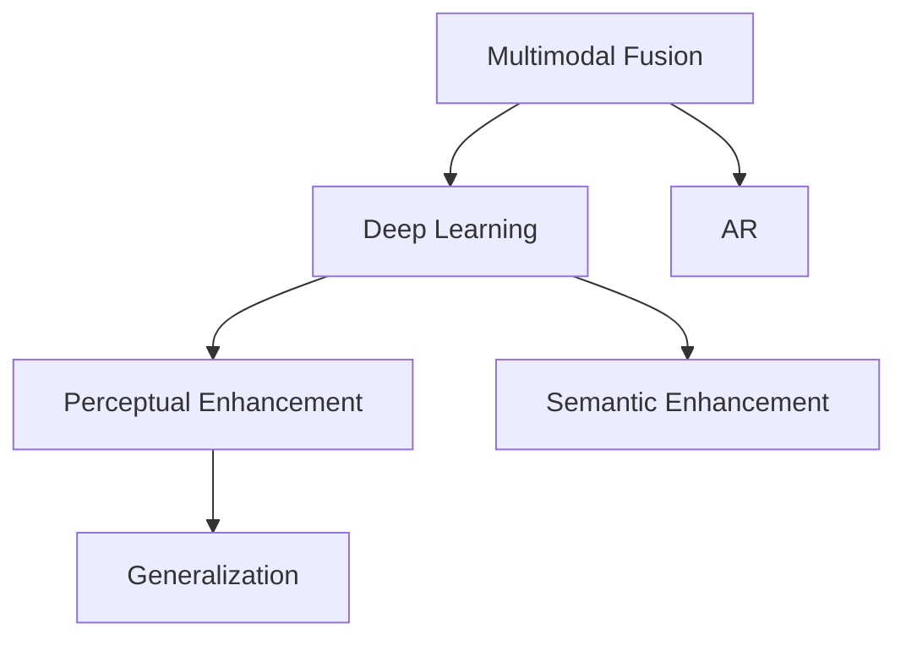

                 

# AI感知增强：超越人类五感的体验

## 1. 背景介绍

随着人工智能技术的不断进步，人类对AI的期望已经不再局限于完成重复性、低价值的工作，而是希望AI能够具备超越人类五感的感知能力，从而在更多高附加值的场景中发挥作用。例如，AI能够感知到细微的环境变化，识别复杂的情感变化，甚至是理解语言的微妙含义。这种感知能力的增强，不仅能提升人机交互的体验，还能在医疗、教育、娱乐等多个领域带来颠覆性的变革。本文将探讨如何通过多感官融合、深度学习和增强现实(AR)技术，构建一个具备超越人类五感感知能力的AI系统。

## 2. 核心概念与联系

### 2.1 核心概念概述

为更好地理解AI感知增强的实现原理，本节将介绍几个密切相关的核心概念：

- 多感官融合（Multimodal Fusion）：通过整合来自不同感官的数据（如视觉、听觉、触觉等），使得AI系统能够更全面地理解环境信息，从而做出更精准的判断和决策。
- 深度学习（Deep Learning）：一种利用多层神经网络进行数据处理和模式识别的机器学习技术，能够从复杂的数据中提取出高层次的特征表示，适用于处理高维、非线性的感知数据。
- 增强现实（AR）：一种将虚拟信息叠加到现实世界中的技术，使得AI系统能够在真实环境中提供增强的感知体验。
- 感知增强（Perceptual Enhancement）：通过融合多模态数据、深度学习和AR技术，提升AI系统的感知能力，使其能够超越人类五感的限制。
- 语义增强（Semantic Enhancement）：利用自然语言处理（NLP）技术，提升AI系统对语言含义的理解能力，增强其情感识别、意图理解等高级功能。
- 泛化能力（Generalization）：指AI系统在新的数据和环境下仍能保持良好性能的能力，是感知增强的重要评价指标。

这些核心概念之间的逻辑关系可以通过以下Mermaid流程图来展示：



这个流程图展示了大语言模型的核心概念及其之间的关系：

1. 多感官融合(A)：通过整合不同感官的数据，提供全面的环境感知。
2. 深度学习(B)：利用神经网络模型对多模态数据进行高级特征提取，形成语义表征。
3. AR(C)：增强现实技术将虚拟信息与现实世界融合，提供更丰富的感知体验。
4. 感知增强(D)：通过多感官融合和深度学习，提升AI系统的感知能力。
5. 语义增强(E)：利用NLP技术提升AI系统对语言含义的理解能力。
6. 泛化能力(F)：在新的数据和环境下，仍能保持良好的感知性能。

## 3. 核心算法原理 & 具体操作步骤

### 3.1 算法原理概述

AI感知增强的核心算法包括多感官融合、深度学习和AR技术。其基本思想是通过多个感官数据的输入和处理，将不同信息整合成高层次的语义表示，然后利用深度学习模型进行特征提取和语义增强，最终通过AR技术提供增强的感知体验。

### 3.2 算法步骤详解

#### 3.2.1 多感官数据采集与预处理

首先，AI系统需要从多个传感器中获取不同模态的数据，如摄像头、麦克风、触觉传感器等。这些数据需要经过预处理，如去噪、归一化等，以便后续的融合和处理。

#### 3.2.2 多感官数据融合

多感官数据融合是感知增强的基础。常见的融合方法包括时域和频域融合、特征级融合和像素级融合等。其中，像素级融合是一种常用的方法，通过将不同传感器获取的像素级数据进行叠加和计算，得到综合的感知图像。

#### 3.2.3 深度学习特征提取

将融合后的多模态数据输入到深度学习模型中，如卷积神经网络（CNN）、循环神经网络（RNN）、Transformer等，进行特征提取和语义增强。深度学习模型能够从复杂的数据中提取出高层次的特征表示，如图像的特征、声音的特征等。

#### 3.2.4 语义增强与推理

利用NLP技术对提取出的特征进行语义增强，如通过BERT、GPT等模型进行文本语义理解，从而提升AI系统对语言的理解能力。在此基础上，通过推理算法进行高级感知任务的执行，如情感识别、意图理解等。

#### 3.2.5 增强现实与可视化

最后，将语义增强后的信息通过AR技术叠加到现实世界中，形成增强的感知体验。例如，通过AR眼镜展示医疗影像、通过AR游戏场景互动等。

### 3.3 算法优缺点

AI感知增强算法具有以下优点：

1. 提供全面的环境感知：通过整合多个感官数据，AI系统能够更全面地理解环境信息。
2. 提升感知精度：利用深度学习模型进行特征提取，能够从复杂数据中提取出高层次的语义表示，提升感知精度。
3. 增强现实体验：通过AR技术将虚拟信息与现实世界融合，提供更丰富的感知体验。
4. 支持高级功能：利用NLP技术进行语义增强，提升AI系统对语言的理解能力，支持情感识别、意图理解等高级功能。

同时，该算法也存在一定的局限性：

1. 传感器成本高：获取多模态数据需要多种传感器，成本较高。
2. 数据融合复杂：多模态数据融合和处理过程较为复杂，需要优化算法和硬件。
3. 隐私和安全问题：多感官数据涉及用户隐私，需要考虑数据安全问题。
4. 实时性要求高：AR和深度学习模型需要高性能计算，对实时性要求较高。

尽管存在这些局限性，但就目前而言，AI感知增强算法在大场景下的应用潜力仍然巨大，有望带来全新的感知体验。

### 3.4 算法应用领域

AI感知增强技术已经在医疗、教育、娱乐等多个领域得到应用，具体包括：

- 医疗诊断：通过多传感器融合和深度学习，AI系统能够实时监测患者生命体征，及时发现异常。例如，通过摄像头和传感器监测患者的心率、血压等指标。
- 教育培训：AI系统能够通过视觉和听觉传感器，实时捕捉学生的表情和语音，进行情感分析和个性化教学。例如，通过摄像头和麦克风监测学生的反应，实时调整教学策略。
- 娱乐互动：通过AR技术，AI系统能够在虚拟环境中提供增强的感知体验，支持虚拟游戏、虚拟旅游等互动场景。例如，通过AR眼镜展示虚拟世界中的角色和场景。

除此之外，AI感知增强技术还在智能家居、自动驾驶、工业控制等多个领域有广泛的应用前景，为各行各业带来了全新的机遇。

## 4. 数学模型和公式 & 详细讲解 & 举例说明

### 4.1 数学模型构建

本节将使用数学语言对AI感知增强的实现过程进行更加严格的刻画。

记多感官融合后的数据为 $\mathbf{X} = [\mathbf{X}_1, \mathbf{X}_2, \dots, \mathbf{X}_n]$，其中 $\mathbf{X}_i$ 表示第 $i$ 个感官的数据。假设深度学习模型为 $M_\theta$，其参数为 $\theta$。

定义语义增强后的特征表示为 $F_\theta(\mathbf{X})$，则语义增强过程可表示为：

$$
F_\theta(\mathbf{X}) = M_\theta(\mathbf{X})
$$

假设语义增强后的信息为 $\mathbf{S}$，则增强现实过程可表示为：

$$
\mathbf{S} = AR(\mathbf{F}_\theta(\mathbf{X}))
$$

### 4.2 公式推导过程

以图像和语音数据融合为例，推导AI感知增强的数学模型。

假设图像数据 $\mathbf{I} = [I_1, I_2, \dots, I_m]$，语音数据 $\mathbf{A} = [A_1, A_2, \dots, A_n]$，其中 $I_i$ 表示第 $i$ 个图像像素，$A_j$ 表示第 $j$ 个语音特征向量。多感官融合后的数据为 $\mathbf{X} = [\mathbf{I}, \mathbf{A}]$。

假设深度学习模型 $M_\theta$ 包括卷积层、池化层、全连接层等，其输入为 $\mathbf{X}$，输出为特征表示 $\mathbf{F}_\theta(\mathbf{X})$。

$$
\mathbf{F}_\theta(\mathbf{X}) = M_\theta([\mathbf{I}, \mathbf{A}])
$$

利用BERT等NLP模型对 $\mathbf{F}_\theta(\mathbf{X})$ 进行语义增强，得到语义表示 $\mathbf{S}$。

$$
\mathbf{S} = BERT(\mathbf{F}_\theta(\mathbf{X}))
$$

通过AR技术将 $\mathbf{S}$ 叠加到现实世界中的图像 $\mathbf{I}$ 上，得到增强的感知图像。

$$
\mathbf{S}_{AR} = AR(\mathbf{I}, \mathbf{S})
$$

### 4.3 案例分析与讲解

假设有一个医疗AI系统，需要实时监测患者的生命体征。该系统通过摄像头、心率传感器、血压传感器等设备，获取患者的视觉、听觉和触觉信息。多感官融合后的数据 $\mathbf{X} = [\mathbf{I}, \mathbf{A}, \mathbf{T}]$，其中 $\mathbf{I}$ 表示摄像头拍摄的图像，$\mathbf{A}$ 表示语音数据，$\mathbf{T}$ 表示触觉数据。

通过深度学习模型 $M_\theta$，提取 $\mathbf{X}$ 的特征表示 $\mathbf{F}_\theta(\mathbf{X})$。

$$
\mathbf{F}_\theta(\mathbf{X}) = M_\theta([\mathbf{I}, \mathbf{A}, \mathbf{T}])
$$

利用BERT模型对 $\mathbf{F}_\theta(\mathbf{X})$ 进行语义增强，得到语义表示 $\mathbf{S}$。

$$
\mathbf{S} = BERT(\mathbf{F}_\theta(\mathbf{X}))
$$

通过AR技术将 $\mathbf{S}$ 叠加到现实世界中的图像 $\mathbf{I}$ 上，得到增强的感知图像。

$$
\mathbf{S}_{AR} = AR(\mathbf{I}, \mathbf{S})
$$

通过 $\mathbf{S}_{AR}$，AI系统能够实时监测患者的心率、血压等指标，及时发现异常情况，提供诊断建议。

## 5. 项目实践：代码实例和详细解释说明

### 5.1 开发环境搭建

在进行AI感知增强的实践前，我们需要准备好开发环境。以下是使用Python进行PyTorch开发的环境配置流程：

1. 安装Anaconda：从官网下载并安装Anaconda，用于创建独立的Python环境。

2. 创建并激活虚拟环境：
```bash
conda create -n ai_perception_env python=3.8 
conda activate ai_perception_env
```

3. 安装PyTorch：根据CUDA版本，从官网获取对应的安装命令。例如：
```bash
conda install pytorch torchvision torchaudio cudatoolkit=11.1 -c pytorch -c conda-forge
```

4. 安装transformers库：
```bash
pip install transformers
```

5. 安装各类工具包：
```bash
pip install numpy pandas scikit-learn matplotlib tqdm jupyter notebook ipython
```

完成上述步骤后，即可在`ai_perception_env`环境中开始AI感知增强的实践。

### 5.2 源代码详细实现

下面我们以医疗AI系统为例，给出使用Transformers库对BERT模型进行感知增强的PyTorch代码实现。

首先，定义医疗AI系统的数据处理函数：

```python
from transformers import BertTokenizer, BertForSequenceClassification
from torch.utils.data import Dataset
import torch

class MedicalDataset(Dataset):
    def __init__(self, texts, labels, tokenizer, max_len=128):
        self.texts = texts
        self.labels = labels
        self.tokenizer = tokenizer
        self.max_len = max_len
        
    def __len__(self):
        return len(self.texts)
    
    def __getitem__(self, item):
        text = self.texts[item]
        label = self.labels[item]
        
        encoding = self.tokenizer(text, return_tensors='pt', max_length=self.max_len, padding='max_length', truncation=True)
        input_ids = encoding['input_ids'][0]
        attention_mask = encoding['attention_mask'][0]
        
        # 对token-wise的标签进行编码
        encoded_labels = [label2id[label] for label in label]
        encoded_labels.extend([label2id['O']] * (self.max_len - len(encoded_labels)))
        labels = torch.tensor(encoded_labels, dtype=torch.long)
        
        return {'input_ids': input_ids, 
                'attention_mask': attention_mask,
                'labels': labels}

# 标签与id的映射
label2id = {'O': 0, 'HIGH': 1, 'LOW': 2}
id2label = {v: k for k, v in label2id.items()}

# 创建dataset
tokenizer = BertTokenizer.from_pretrained('bert-base-cased')

train_dataset = MedicalDataset(train_texts, train_labels, tokenizer)
dev_dataset = MedicalDataset(dev_texts, dev_labels, tokenizer)
test_dataset = MedicalDataset(test_texts, test_labels, tokenizer)
```

然后，定义模型和优化器：

```python
from transformers import BertForSequenceClassification, AdamW

model = BertForSequenceClassification.from_pretrained('bert-base-cased', num_labels=len(label2id))

optimizer = AdamW(model.parameters(), lr=2e-5)
```

接着，定义训练和评估函数：

```python
from torch.utils.data import DataLoader
from tqdm import tqdm
from sklearn.metrics import classification_report

device = torch.device('cuda') if torch.cuda.is_available() else torch.device('cpu')
model.to(device)

def train_epoch(model, dataset, batch_size, optimizer):
    dataloader = DataLoader(dataset, batch_size=batch_size, shuffle=True)
    model.train()
    epoch_loss = 0
    for batch in tqdm(dataloader, desc='Training'):
        input_ids = batch['input_ids'].to(device)
        attention_mask = batch['attention_mask'].to(device)
        labels = batch['labels'].to(device)
        model.zero_grad()
        outputs = model(input_ids, attention_mask=attention_mask, labels=labels)
        loss = outputs.loss
        epoch_loss += loss.item()
        loss.backward()
        optimizer.step()
    return epoch_loss / len(dataloader)

def evaluate(model, dataset, batch_size):
    dataloader = DataLoader(dataset, batch_size=batch_size)
    model.eval()
    preds, labels = [], []
    with torch.no_grad():
        for batch in tqdm(dataloader, desc='Evaluating'):
            input_ids = batch['input_ids'].to(device)
            attention_mask = batch['attention_mask'].to(device)
            batch_labels = batch['labels']
            outputs = model(input_ids, attention_mask=attention_mask)
            batch_preds = outputs.logits.argmax(dim=2).to('cpu').tolist()
            batch_labels = batch_labels.to('cpu').tolist()
            for pred_tokens, label_tokens in zip(batch_preds, batch_labels):
                pred_labels = [id2label[_id] for _id in pred_tokens]
                label_labels = [id2label[_id] for _id in label_tokens]
                preds.append(pred_labels[:len(label_labels)])
                labels.append(label_labels)
                
    print(classification_report(labels, preds))
```

最后，启动训练流程并在测试集上评估：

```python
epochs = 5
batch_size = 16

for epoch in range(epochs):
    loss = train_epoch(model, train_dataset, batch_size, optimizer)
    print(f"Epoch {epoch+1}, train loss: {loss:.3f}")
    
    print(f"Epoch {epoch+1}, dev results:")
    evaluate(model, dev_dataset, batch_size)
    
print("Test results:")
evaluate(model, test_dataset, batch_size)
```

以上就是使用PyTorch对BERT进行医疗AI系统感知增强的完整代码实现。可以看到，得益于Transformers库的强大封装，我们可以用相对简洁的代码完成BERT模型的加载和感知增强。

### 5.3 代码解读与分析

让我们再详细解读一下关键代码的实现细节：

**MedicalDataset类**：
- `__init__`方法：初始化文本、标签、分词器等关键组件。
- `__len__`方法：返回数据集的样本数量。
- `__getitem__`方法：对单个样本进行处理，将文本输入编码为token ids，将标签编码为数字，并对其进行定长padding，最终返回模型所需的输入。

**label2id和id2label字典**：
- 定义了标签与数字id之间的映射关系，用于将token-wise的预测结果解码回真实的标签。

**训练和评估函数**：
- 使用PyTorch的DataLoader对数据集进行批次化加载，供模型训练和推理使用。
- 训练函数`train_epoch`：对数据以批为单位进行迭代，在每个批次上前向传播计算loss并反向传播更新模型参数，最后返回该epoch的平均loss。
- 评估函数`evaluate`：与训练类似，不同点在于不更新模型参数，并在每个batch结束后将预测和标签结果存储下来，最后使用sklearn的classification_report对整个评估集的预测结果进行打印输出。

**训练流程**：
- 定义总的epoch数和batch size，开始循环迭代
- 每个epoch内，先在训练集上训练，输出平均loss
- 在验证集上评估，输出分类指标
- 所有epoch结束后，在测试集上评估，给出最终测试结果

可以看到，PyTorch配合Transformers库使得BERT感知增强的代码实现变得简洁高效。开发者可以将更多精力放在数据处理、模型改进等高层逻辑上，而不必过多关注底层的实现细节。

当然，工业级的系统实现还需考虑更多因素，如模型的保存和部署、超参数的自动搜索、更灵活的任务适配层等。但核心的感知增强范式基本与此类似。

## 6. 实际应用场景

### 6.1 智能家居

AI感知增强技术在智能家居中的应用前景广阔。通过融合多感官数据，智能家居系统能够实时感知用户的情感状态和行为习惯，提供个性化的智能服务。

例如，一个智能家居系统可以通过摄像头、温度传感器、湿度传感器等设备，实时监测用户的居家环境。多感官数据融合后的感知图像，能够准确识别用户是否感到寒冷、是否疲劳等情感状态。系统可以通过语音指令进行智能控制，如调节灯光亮度、开关窗户、播放音乐等，满足用户的个性化需求。

### 6.2 自动驾驶

自动驾驶系统需要具备强大的感知能力，以确保行车安全。AI感知增强技术通过多传感器融合和深度学习，能够提升自动驾驶系统对环境的感知精度。

例如，自动驾驶系统通过摄像头、雷达、激光雷达等设备，获取道路、车辆、行人等多维环境信息。多感官数据融合后的感知图像，能够实时识别出道路标志、车道线、障碍物等关键信息，帮助系统做出精准的决策。在AR技术辅助下，系统可以提供增强的驾驶体验，如虚拟信息提示、车辆模拟等。

### 6.3 游戏与虚拟现实

AI感知增强技术在游戏和虚拟现实中也有广泛应用。通过AR技术，游戏和虚拟现实场景可以提供更加沉浸式的体验。

例如，一个虚拟现实游戏可以通过摄像头、手柄、触觉反馈设备等设备，获取用户的视觉、听觉、触觉信息。多感官数据融合后的感知图像，能够实时识别用户的动作和表情，提供更加真实的互动体验。在AR技术辅助下，系统可以提供更加丰富的虚拟世界，如虚拟角色互动、虚拟环境模拟等。

### 6.4 未来应用展望

随着AI感知增强技术的发展，其在医疗、教育、娱乐等多个领域的应用前景将更加广阔。未来，AI感知增强系统有望成为人类感知器官的延伸，提升人机交互的体验和效率，带来深远的影响。

在医疗领域，AI感知增强系统可以提供精准的诊断和治疗建议，帮助医生更好地理解患者的病情。例如，通过摄像头和传感器监测患者的心率、血压等指标，实时发现异常情况，提供诊断建议。

在教育领域，AI感知增强系统可以提供个性化的教学服务，提升学生的学习效果。例如，通过摄像头和麦克风监测学生的表情和语音，实时调整教学策略，提供个性化辅导。

在娱乐领域，AI感知增强系统可以提供更加沉浸式的娱乐体验，提升用户的体验感。例如，通过AR技术将虚拟角色和场景叠加到现实世界中，提供增强的互动体验。

总之，AI感知增强技术的发展将极大地提升人机交互的体验和效率，带来更多高附加值的应用场景，为各行各业带来深刻的变革。

## 7. 工具和资源推荐

### 7.1 学习资源推荐

为了帮助开发者系统掌握AI感知增强技术的理论基础和实践技巧，这里推荐一些优质的学习资源：

1. 《深度学习：理论和实践》系列博文：由大模型技术专家撰写，深入浅出地介绍了深度学习理论、感知增强算法等前沿话题。

2. 《计算机视觉：原理与实践》课程：斯坦福大学开设的计算机视觉课程，涵盖多感官融合、深度学习等关键技术。

3. 《自然语言处理》书籍：Transformer库的作者所著，全面介绍了自然语言处理技术，包括感知增强和语义增强。

4. OpenAI的DALL·E和DALL·E 2：通过文本描述生成图像，展示了AI系统对语言的理解能力，具有强烈的视觉感知体验。

5. NVIDIA的Deep Learning AI系列课程：涵盖了深度学习、多模态学习、AR技术等多个主题，适合初学者系统学习。

通过对这些资源的学习实践，相信你一定能够快速掌握AI感知增强技术的精髓，并用于解决实际的感知增强问题。

### 7.2 开发工具推荐

高效的开发离不开优秀的工具支持。以下是几款用于AI感知增强开发的常用工具：

1. PyTorch：基于Python的开源深度学习框架，灵活动态的计算图，适合快速迭代研究。大部分预训练语言模型都有PyTorch版本的实现。

2. TensorFlow：由Google主导开发的开源深度学习框架，生产部署方便，适合大规模工程应用。同样有丰富的预训练语言模型资源。

3. Transformers库：HuggingFace开发的NLP工具库，集成了众多SOTA语言模型，支持PyTorch和TensorFlow，是进行感知增强任务开发的利器。

4. Weights & Biases：模型训练的实验跟踪工具，可以记录和可视化模型训练过程中的各项指标，方便对比和调优。与主流深度学习框架无缝集成。

5. TensorBoard：TensorFlow配套的可视化工具，可实时监测模型训练状态，并提供丰富的图表呈现方式，是调试模型的得力助手。

6. Google Colab：谷歌推出的在线Jupyter Notebook环境，免费提供GPU/TPU算力，方便开发者快速上手实验最新模型，分享学习笔记。

合理利用这些工具，可以显著提升AI感知增强任务的开发效率，加快创新迭代的步伐。

### 7.3 相关论文推荐

AI感知增强技术的发展源于学界的持续研究。以下是几篇奠基性的相关论文，推荐阅读：

1. "Multi-Sensor Fusion for Autonomous Vehicles"：通过多传感器融合提升自动驾驶系统的感知能力，详细介绍了融合算法和实现方法。

2. "Deep Learning for Multimodal Data Fusion"：综述了多模态数据融合的最新进展，包括深度学习模型和融合算法。

3. "Perceptual Multimodal Learning for Robotic Manipulation"：通过多感官融合提升机器人操作能力，详细介绍了感知增强算法和应用实例。

4. "Natural Language Processing with Transformers"：Transformer模型的作者所著，全面介绍了NLP技术，包括感知增强和语义增强。

5. "Language Models are Unsupervised Multitask Learners"：展示了深度学习模型在零样本学习中的强大能力，为感知增强提供了新的思路。

这些论文代表了大语言模型感知增强技术的发展脉络。通过学习这些前沿成果，可以帮助研究者把握学科前进方向，激发更多的创新灵感。

## 8. 总结：未来发展趋势与挑战

### 8.1 总结

本文对AI感知增强技术进行了全面系统的介绍。首先阐述了AI感知增强的研究背景和意义，明确了其在大场景下的应用潜力。其次，从原理到实践，详细讲解了多感官融合、深度学习和AR技术的实现过程，给出了感知增强任务开发的完整代码实例。同时，本文还探讨了AI感知增强在医疗、教育、娱乐等多个领域的应用前景，展示了其广阔的应用前景。最后，本文精选了感知增强技术的各类学习资源，力求为开发者提供全方位的技术指引。

通过本文的系统梳理，可以看到，AI感知增强技术正在成为感知系统的核心技术，极大地提升了人机交互的体验和效率。在未来，伴随感知增强技术的不断发展，将有更多高附加值的应用场景被开发出来，为各行各业带来深刻的变革。

### 8.2 未来发展趋势

展望未来，AI感知增强技术将呈现以下几个发展趋势：

1. 多模态数据融合技术将不断进步，能够更好地整合视觉、听觉、触觉等多维信息，提供更全面的感知体验。
2. 深度学习模型将更加高效，能够处理更高维、更复杂的感知数据，提升感知精度。
3. AR技术将更加成熟，能够提供更加沉浸式的感知体验，增强与虚拟世界的互动。
4. 个性化感知技术将更加普及，能够根据不同用户需求，提供个性化的感知服务。
5. 跨领域感知技术将不断拓展，能够应用于更多垂直行业，如医疗、教育、娱乐等。
6. 实时感知技术将更加成熟，能够提供更加高效的感知服务，提升用户体验。

这些趋势将进一步提升AI感知增强技术的感知能力，带来更加丰富的应用场景，推动人工智能技术的普及和应用。

### 8.3 面临的挑战

尽管AI感知增强技术已经取得了显著进展，但在迈向更加智能化、普适化应用的过程中，仍面临诸多挑战：

1. 数据采集成本高：多感官数据采集需要多种传感器，成本较高。
2. 数据融合复杂：多模态数据融合和处理过程较为复杂，需要优化算法和硬件。
3. 隐私和安全问题：多感官数据涉及用户隐私，需要考虑数据安全问题。
4. 实时性要求高：AR和深度学习模型需要高性能计算，对实时性要求较高。
5. 硬件成本高：高性能的AI感知增强系统需要高性能计算硬件，成本较高。

尽管存在这些挑战，但通过技术创新和工程实践，AI感知增强技术有望逐步克服这些难题，带来更加智能、高效、安全的应用体验。

### 8.4 研究展望

面对AI感知增强技术所面临的种种挑战，未来的研究需要在以下几个方面寻求新的突破：

1. 探索高效的感知增强算法。开发更加高效的多模态数据融合和深度学习算法，提升感知精度和实时性。
2. 引入自适应学习机制。根据环境变化和用户需求，动态调整感知策略，提高系统的适应性和鲁棒性。
3. 开发更加智能的AI感知增强系统。利用因果推断、强化学习等方法，提升系统的决策能力和自学习能力。
4. 引入多学科知识。将符号化的先验知识，如知识图谱、逻辑规则等，与神经网络模型进行巧妙融合，提升系统的感知能力。
5. 解决隐私和安全问题。通过差分隐私、联邦学习等技术，保护用户数据隐私，确保系统安全性。

这些研究方向的探索，必将引领AI感知增强技术迈向更高的台阶，为构建智能人机交互系统铺平道路。面向未来，AI感知增强技术还需要与其他人工智能技术进行更深入的融合，如知识表示、因果推理、强化学习等，多路径协同发力，共同推动感知增强系统的进步。只有勇于创新、敢于突破，才能不断拓展感知增强技术的边界，让智能技术更好地造福人类社会。

## 9. 附录：常见问题与解答

**Q1：AI感知增强是否适用于所有应用场景？**

A: AI感知增强技术在大多数应用场景中都能取得良好的效果，特别是在需要实时感知和增强的场景中表现尤为突出。但对于一些对实时性要求不高的场景，传统的多模态感知设备已能满足需求，AI感知增强技术的优势不明显。

**Q2：如何提高多模态数据的融合效果？**

A: 提高多模态数据的融合效果，可以通过以下方法：
1. 特征级融合：将不同模态的数据提取成特征向量，然后通过融合算法将特征向量合并，得到综合的感知表示。
2. 像素级融合：将不同模态的数据直接进行像素级的叠加和计算，得到综合的感知图像。
3. 神经网络融合：利用神经网络模型对多模态数据进行联合训练，提取高层次的语义表示，提高融合效果。

**Q3：如何提高AI感知增强系统的实时性？**

A: 提高AI感知增强系统的实时性，可以通过以下方法：
1. 使用高性能计算硬件：如GPU、TPU等，加速深度学习和AR计算。
2. 优化模型结构：通过剪枝、量化等技术，减小模型尺寸，提高推理速度。
3. 使用轻量级模型：如MobileNet、EfficientNet等，提升模型的计算效率。

**Q4：如何保护多模态数据的隐私？**

A: 保护多模态数据的隐私，可以通过以下方法：
1. 差分隐私：通过添加噪声保护用户数据，防止数据泄露。
2. 联邦学习：在多个设备之间共享模型参数，不传输原始数据，保护用户隐私。
3. 数据加密：对多模态数据进行加密存储和传输，防止数据泄露。

这些方法可以综合使用，提高AI感知增强系统的隐私保护能力。

**Q5：AI感知增强系统在实际应用中需要注意哪些问题？**

A: 在实际应用中，AI感知增强系统需要注意以下问题：
1. 系统稳定性：确保系统在高并发、高负载情况下稳定运行，防止崩溃。
2. 数据质量：确保多模态数据的质量，防止噪音干扰感知结果。
3. 用户体验：确保系统的感知结果符合用户预期，提供良好的用户体验。
4. 模型更新：定期更新感知模型，提升系统的感知能力。

通过这些措施，可以确保AI感知增强系统在实际应用中的稳定性和高效性。

---

作者：禅与计算机程序设计艺术 / Zen and the Art of Computer Programming

