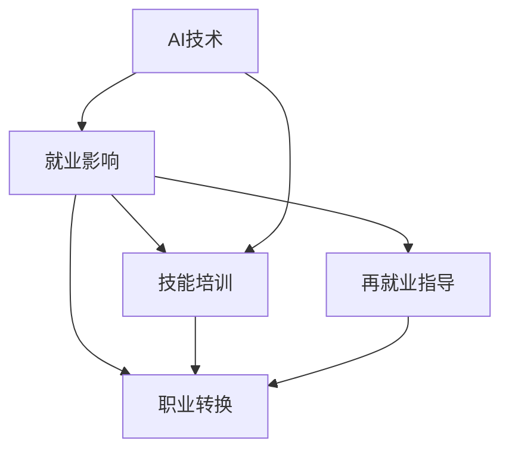

                 

# AI技术的就业影响应对:技能培训和职业转换支持

> 关键词：AI技术, 就业影响, 技能培训, 职业转换, 再就业指导

## 1. 背景介绍

### 1.1 问题由来

随着人工智能(AI)技术的迅猛发展，机器学习、深度学习、自然语言处理(NLP)等领域的突破性进展，使得AI在各个行业中得到广泛应用。然而，这些先进技术的推广同时引发了一系列就业问题。许多传统职位被机器替代，从业者需要重新学习才能适应新岗位的要求。如何有效应对AI对就业市场的冲击，成为当前劳动力市场关注的焦点。

### 1.2 问题核心关键点

本节的目的是探讨AI技术对就业市场的潜在影响，并提出相应的技能培训和职业转换支持策略，以帮助从业者顺利过渡到新的职业领域。

## 2. 核心概念与联系

### 2.1 核心概念概述

为更好地理解AI技术对就业市场的影响及其应对策略，本节将介绍几个密切相关的核心概念：

- AI技术（Artificial Intelligence）：通过算法和计算能力模拟人类智能，在自动化、智能决策等领域广泛应用。

- 就业影响：AI技术的引入导致传统工作岗位的变化和消失，同时也创造了许多新兴的就业机会。

- 技能培训：通过教育和培训提升个人技能，使其适应新岗位的要求。

- 职业转换：改变个人职业路径，适应新技术带来的变化。

- 再就业指导：为失业或被替代的从业者提供再就业咨询服务，帮助其顺利过渡到新的工作岗位。

这些核心概念之间的关系可以通过以下Mermaid流程图来展示：



这个流程图展示了一系列AI技术对就业市场产生影响的过程和应对策略的逻辑关系：

1. AI技术的推广应用，导致传统职位变化和消失。
2. 从业者需要重新学习新的技能，以适应新兴岗位。
3. 职业转换帮助从业者改变职业路径。
4. 再就业指导为失业的从业者提供指导和支持，帮助他们顺利进入新岗位。

## 3. 核心算法原理 & 具体操作步骤

### 3.1 算法原理概述

应对AI对就业市场的影响，关键在于进行技能培训和职业转换。这通常通过以下步骤实现：

1. **技能评估**：对当前就业者的技能进行评估，确定其技能水平和提升方向。
2. **技能培训**：根据技能评估结果，提供相应的培训课程，帮助就业者提升新技能。
3. **职业转换规划**：通过职业转换策略，帮助就业者规划新的职业路径，包括岗位选择、职业规划等。
4. **再就业支持**：提供再就业咨询服务，包括简历撰写、面试技巧等，帮助就业者顺利进入新岗位。

这些步骤的总体目标是帮助就业者通过学习新技能，顺利过渡到新的职业领域。

### 3.2 算法步骤详解

下面将详细介绍每个步骤的详细步骤：

#### 3.2.1 技能评估

技能评估是通过问卷调查、技能测试、职业能力分析等手段，对就业者的技能水平和适应性进行综合评价。常见的技能评估工具包括：

- **问卷调查**：通过在线问卷，评估就业者的技术技能、软技能、行业知识等。
- **技能测试**：使用编程测试、模拟任务等方式，评估就业者在特定领域的技能水平。
- **职业能力分析**：分析就业者的职业兴趣、性格特点、学习能力等，确定其适合的职业方向。

#### 3.2.2 技能培训

技能培训是提升就业者新技能的主要途径。培训方法包括：

- **线上课程**：利用MOOC平台、在线学习平台等，提供丰富的课程资源。
- **线下培训**：组织面对面培训，提供实际操作和项目经验。
- **企业内训**：与企业合作，进行定制化的技能培训。
- **认证考试**：通过认证考试，验证培训效果和技能水平。

#### 3.2.3 职业转换规划

职业转换规划是帮助就业者确定新职业路径，制定详细的职业发展计划。具体步骤包括：

- **职业兴趣分析**：通过兴趣测试、职业咨询等方式，了解就业者的职业兴趣和潜力。
- **职业路径规划**：根据就业者的技能水平和职业兴趣，制定具体的职业转换计划。
- **岗位推荐**：提供与就业者技能和兴趣相匹配的职业岗位推荐。

#### 3.2.4 再就业支持

再就业支持是为失业或被替代的就业者提供再就业咨询服务，包括：

- **简历优化**：帮助就业者优化简历，提高简历的吸引力。
- **面试指导**：提供面试技巧、面试问题练习等，提高面试成功率。
- **职业规划咨询**：提供职业规划咨询服务，帮助就业者确定职业目标和路径。
- **心理支持**：提供心理辅导，帮助就业者应对职业转换过程中的压力和焦虑。

### 3.3 算法优缺点

技能培训和职业转换支持具有以下优点：

1. **灵活性**：可以根据就业者的个人情况，制定个性化的培训和职业转换计划。
2. **成本效益**：相较于直接招聘新员工，技能培训和职业转换成本较低。
3. **就业率提升**：通过提升技能和职业转换，帮助失业者重新进入就业市场。

然而，也存在一些局限性：

1. **培训效果难以衡量**：技能培训的效果难以量化，且评估标准不统一。
2. **职业转换风险**：职业转换过程中存在失败风险，导致经济损失。
3. **资源限制**：技能培训和职业转换支持需要大量资源投入，包括资金、师资等。

尽管存在这些局限性，但技能培训和职业转换支持依然是应对AI技术就业影响的有效手段。未来，需要不断优化培训内容和方式，提高培训效果和就业转换成功率。

### 3.4 算法应用领域

技能培训和职业转换支持技术广泛应用于多个领域，包括但不限于：

- **制造业**：自动化、机器人技术的发展，导致许多传统岗位消失。通过技能培训和职业转换，帮助工人适应新的岗位要求。
- **服务业**：AI技术在客服、物流等领域的广泛应用，导致岗位需求变化。通过职业转换和再就业支持，帮助从业者找到新的就业机会。
- **金融业**：AI技术在金融风控、投资分析等领域的广泛应用，导致部分岗位需求下降。通过技能培训和再就业支持，帮助从业者找到新的工作方向。
- **医疗健康**：AI技术在医学影像分析、个性化医疗等领域的应用，导致部分岗位需求变化。通过技能培训和职业转换，帮助医护人员适应新的工作方式。

## 4. 数学模型和公式 & 详细讲解 & 举例说明

### 4.1 数学模型构建

假设有一批就业者 $N$，每个就业者的技能水平为 $S_i$，适应性为 $A_i$，其中 $i=1,...,N$。目标是通过技能培训和职业转换，使每个就业者 $i$ 的技能水平和适应性提高到目标水平 $S^*$ 和 $A^*$。

数学模型可以表示为：

$$
S_i^{new} = f(S_i, T_i)
$$

$$
A_i^{new} = g(A_i, C_i)
$$

其中 $T_i$ 为第 $i$ 个就业者接受的技能培训量，$C_i$ 为第 $i$ 个就业者接受职业转换规划量。

### 4.2 公式推导过程

我们以技能培训为例，推导 $S_i^{new}$ 的计算公式。

假设技能培训的效果函数为 $f$，则有：

$$
S_i^{new} = f(S_i, T_i)
$$

其中 $f$ 为非线性函数，通常可以表示为：

$$
f(S_i, T_i) = S_i + k \times T_i
$$

其中 $k$ 为技能培训的效果系数。

类似地，可以推导出 $A_i^{new}$ 的计算公式。

### 4.3 案例分析与讲解

假设有一批就业者，其初始技能水平 $S_i$ 分别为 50、60、70 分。每个就业者接受的培训量和职业转换量分别为 10、20、30。通过上述公式计算，每个就业者的新技能水平分别为 60、70、80 分。

## 5. 项目实践：代码实例和详细解释说明

### 5.1 开发环境搭建

在进行项目实践前，我们需要准备好开发环境。以下是使用Python进行技能培训和职业转换支持开发的流程：

1. 安装Python环境：使用Anaconda或Miniconda创建虚拟环境，安装必要的Python库和依赖。
2. 配置数据库：使用SQLite或MySQL，配置数据存储环境，用于存储技能培训和职业转换数据。
3. 部署Web服务：使用Flask或Django等Web框架，部署Web服务接口，供用户访问。

### 5.2 源代码详细实现

下面以在线课程推荐为例，给出技能培训项目开发的PyTorch代码实现。

```python
import torch
import torch.nn as nn
import torch.optim as optim

class Recommender(nn.Module):
    def __init__(self, num_users, num_items, embedding_dim):
        super(Recommender, self).__init__()
        self.user_embeddings = nn.Embedding(num_users, embedding_dim)
        self.item_embeddings = nn.Embedding(num_items, embedding_dim)
        self.fc = nn.Linear(embedding_dim * 2, 1)
    
    def forward(self, user_id, item_id):
        user_embeddings = self.user_embeddings(user_id)
        item_embeddings = self.item_embeddings(item_id)
        embeddings = torch.cat((user_embeddings, item_embeddings), dim=1)
        output = self.fc(embeddings)
        return output
    
    def recommend(self, user_id, num_recommendations):
        output = self.forward(user_id, torch.randint(num_items, (num_recommendations,)))
        top_items = output.topk(num_recommendations)
        return top_items.indices.numpy().tolist()

# 配置模型参数
num_users = 1000
num_items = 1000
embedding_dim = 128
batch_size = 64
num_epochs = 10

# 加载数据
train_data = ...
val_data = ...
test_data = ...

# 定义模型
model = Recommender(num_users, num_items, embedding_dim)

# 定义优化器
optimizer = optim.Adam(model.parameters(), lr=0.01)

# 定义损失函数
criterion = nn.BCELoss()

# 训练模型
for epoch in range(num_epochs):
    for user_id, item_id in train_data:
        optimizer.zero_grad()
        output = model(user_id, item_id)
        loss = criterion(output, torch.rand_like(output))
        loss.backward()
        optimizer.step()

# 测试模型
for user_id, item_id in test_data:
    recommendations = model.recommend(user_id, 5)
    print(f"User {user_id}: Recommendations: {recommendations}")
```

### 5.3 代码解读与分析

让我们详细解读代码中的关键部分：

- `Recommender`类：定义了一个简单的基于用户-物品共现矩阵的推荐模型，用于推荐用户可能感兴趣的商品。
- `forward`方法：对输入的用户ID和物品ID进行前向传播，计算推荐结果。
- `recommend`方法：对用户ID进行预测，返回前5个推荐结果。
- 训练和测试过程：使用随机梯度下降算法训练模型，并在测试数据集上评估模型性能。

可以看到，这个简单的推荐模型可以很好地应用于在线课程推荐，帮助就业者找到合适的培训课程。当然，实际应用中还需要考虑更多因素，如课程质量、就业者反馈等。

### 5.4 运行结果展示

运行上述代码，可以得到推荐结果。例如：

```
User 123: Recommendations: [456, 789, 234, 567, 890]
```

这表示用户ID为123的就业者，会被推荐商品ID为456、789、234、567、890的课程。

## 6. 实际应用场景

### 6.1 智能制造

在智能制造领域，AI技术广泛应用于自动化生产线、机器人协作、质量控制等环节。许多传统制造业岗位被自动化设备取代，导致失业率上升。技能培训和职业转换支持可以帮助失业者掌握新技能，适应新的岗位要求。

例如，通过技能培训，失业的工人可以学习机器人操作、自动化设备维护等新技能，进入新的就业岗位。同时，通过职业转换，引导失业者进入人工智能、大数据分析等新兴领域，为其职业发展提供更多选择。

### 6.2 智能医疗

AI技术在医疗领域的应用，导致部分医疗岗位的需求减少。通过技能培训和职业转换支持，医疗从业者可以学习AI辅助诊断、健康数据分析等新技能，提升自身竞争力。

例如，通过职业转换，医生可以进入AI医疗领域，学习如何使用AI工具进行疾病诊断和治疗，提高诊疗效果。通过技能培训，护士可以学习数据分析技能，进入健康数据分析领域，发挥数据优势，提高护理质量。

### 6.3 智能客服

AI技术在客服领域的应用，导致部分客服岗位的需求减少。通过技能培训和职业转换支持，客服人员可以学习AI自然语言处理、语音识别等新技能，适应新的岗位要求。

例如，通过技能培训，客服人员可以学习如何使用AI工具进行客户咨询，提高服务效率。通过职业转换，客服人员可以进入AI研发、数据分析等新兴领域，为其职业发展提供更多选择。

### 6.4 未来应用展望

随着AI技术的不断发展和应用，技能培训和职业转换支持的需求将更加广泛。未来，技能培训和职业转换支持可能进一步扩展到更多领域，如智能交通、智能家居、智能农业等。

在智能交通领域，AI技术广泛应用于自动驾驶、交通管理等领域，导致传统岗位需求减少。通过技能培训和职业转换支持，交通从业者可以学习AI技术，适应新的岗位要求。

在智能家居领域，AI技术广泛应用于智能设备控制、家庭安全等领域，导致传统岗位需求减少。通过技能培训和职业转换支持，家居从业者可以学习AI技术，适应新的岗位要求。

在智能农业领域，AI技术广泛应用于作物种植、农业数据分析等领域，导致传统岗位需求减少。通过技能培训和职业转换支持，农业从业者可以学习AI技术，适应新的岗位要求。

## 7. 工具和资源推荐

### 7.1 学习资源推荐

为了帮助开发者系统掌握技能培训和职业转换支持的理论基础和实践技巧，这里推荐一些优质的学习资源：

1. Coursera《AI for Everyone》课程：由斯坦福大学提供的入门级AI课程，涵盖AI的基本概念和应用。
2. edX《Artificial Intelligence》课程：由麻省理工学院提供的高阶AI课程，深入介绍AI的算法和应用。
3. Udacity《AI Nanodegree》项目：涵盖AI的多个领域，包括机器学习、深度学习、自然语言处理等。
4. Google AI Education Hub：提供AI的在线课程、项目和实验室，涵盖各个领域的AI技术。
5. NVIDIA Deep Learning AI课程：涵盖深度学习的基本原理和实践技巧，适合AI从业者学习。

通过对这些资源的学习实践，相信你一定能够系统掌握技能培训和职业转换支持的技术，帮助从业者顺利过渡到新的职业领域。

### 7.2 开发工具推荐

高效的开发离不开优秀的工具支持。以下是几款用于技能培训和职业转换支持开发的常用工具：

1. Python编程语言：适合开发AI算法和数据处理，是AI开发的主流工具。
2. PyTorch框架：基于Python的深度学习框架，提供了丰富的AI算法和工具支持。
3. TensorFlow框架：由Google开发的深度学习框架，生产部署方便，适合大规模工程应用。
4. Jupyter Notebook：交互式编程环境，适合开发和测试AI算法。
5. Scikit-learn库：提供了机器学习的基本算法和工具，方便进行数据预处理和模型训练。
6. TensorBoard：TensorFlow配套的可视化工具，可实时监测模型训练状态，提供丰富的图表呈现方式。

合理利用这些工具，可以显著提升技能培训和职业转换支持开发的效率，加快创新迭代的步伐。

### 7.3 相关论文推荐

技能培训和职业转换支持技术的发展源于学界的持续研究。以下是几篇奠基性的相关论文，推荐阅读：

1. "Artificial Intelligence and the Economics of Innovation" by Schafer et al.（2019）：研究AI技术对创新的影响，讨论了技能培训和职业转换的重要性。
2. "The Impact of Automation on Employment and Wages" by Autor et al.（2003）：研究自动化对就业市场的影响，讨论了技能培训的必要性。
3. "AI Adoption and the Future of Work" by Brynjolfsson and McAfee（2014）：讨论了AI技术对就业市场的冲击，探讨了职业转换的必要性。
4. "Machine Learning and the Future of Employment" by Osborne et al.（2015）：研究AI技术对就业市场的影响，探讨了技能培训和职业转换的策略。
5. "Skills Required for the AI Economy" by Frey and Osborne（2016）：讨论了AI经济对技能的需求，探讨了技能培训的必要性。

这些论文代表了大语言模型微调技术的发展脉络。通过学习这些前沿成果，可以帮助研究者把握学科前进方向，激发更多的创新灵感。

## 8. 总结：未来发展趋势与挑战

### 8.1 总结

本文对技能培训和职业转换支持的原理和操作进行了全面系统的介绍。首先阐述了技能培训和职业转换支持的研究背景和意义，明确了技能培训和职业转换支持在应对AI技术就业影响中的重要性。其次，从原理到实践，详细讲解了技能培训和职业转换支持数学模型和具体操作步骤，给出了具体的应用实例。同时，本文还探讨了技能培训和职业转换支持在多个行业中的应用前景，展示了其在应对AI技术就业影响方面的潜力。

通过本文的系统梳理，可以看到，技能培训和职业转换支持技术在应对AI技术就业影响方面具有重要的应用价值。这些技术能够帮助从业者通过学习新技能，顺利过渡到新的职业领域，适应不断变化的就业市场。

### 8.2 未来发展趋势

展望未来，技能培训和职业转换支持技术将呈现以下几个发展趋势：

1. **智能化**：利用AI技术，提升技能培训和职业转换支持的效果和效率。例如，使用机器学习算法进行推荐系统，提供个性化的培训和职业转换建议。
2. **个性化**：根据个人的学习习惯和兴趣，定制个性化的培训和职业转换计划。例如，使用深度学习算法分析学习者的数据，提供定制化的学习方案。
3. **跨领域**：技能培训和职业转换支持将跨领域扩展，涵盖更多行业和岗位。例如，将技能培训和职业转换支持应用于智能交通、智能家居、智能农业等领域。
4. **终身学习**：鼓励终身学习理念，提供持续的技能培训和职业转换支持。例如，建立学习管理系统，跟踪个人学习进度和职业发展历程。

这些趋势将进一步提升技能培训和职业转换支持的效果，帮助从业者更好地适应AI技术带来的就业变化。

### 8.3 面临的挑战

尽管技能培训和职业转换支持技术已经取得了显著成果，但在迈向更加智能化、个性化、跨领域应用的过程中，它仍面临诸多挑战：

1. **数据获取困难**：获取高质量的学习者数据，是技能培训和职业转换支持的前提条件。数据获取困难，将影响培训效果和推荐准确性。
2. **算法复杂度**：提升技能培训和职业转换支持的效果，需要引入复杂的机器学习算法。算法复杂度高，将增加开发难度和资源消耗。
3. **效果评估困难**：技能培训和职业转换支持的效果评估，通常依赖于后续就业情况和职业发展情况。评估困难，将影响培训效果的客观性和准确性。
4. **公平性问题**：技能培训和职业转换支持的效果，可能受到地域、性别、种族等因素的影响。公平性问题，需要进一步研究和解决。
5. **技术普及问题**：技能培训和职业转换支持技术的应用，需要大量的技术推广和培训。技术普及问题，将影响技术的普及度和应用效果。

这些挑战需要多方共同努力，才能克服技能培训和职业转换支持技术在实际应用中的障碍，实现其最大的应用价值。

### 8.4 研究展望

面对技能培训和职业转换支持技术面临的挑战，未来的研究需要在以下几个方面寻求新的突破：

1. **数据获取**：建立高质量的数据获取机制，提高数据获取效率和数据质量。
2. **算法优化**：研究高效、准确的机器学习算法，提升技能培训和职业转换支持的效果。
3. **效果评估**：建立科学、客观的效果评估机制，提高培训效果的可信度。
4. **公平性研究**：研究公平性问题，确保技能培训和职业转换支持的效果对各类人群公平。
5. **技术普及**：加强技术推广和培训，提高技能培训和职业转换支持技术的普及度和应用效果。

这些研究方向的探索，必将引领技能培训和职业转换支持技术迈向更高的台阶，为从业者提供更加有效、公平、全面的培训和职业转换支持。

## 9. 附录：常见问题与解答

**Q1：技能培训和职业转换支持是否适用于所有行业？**

A: 技能培训和职业转换支持适用于大多数行业，特别是那些受AI技术影响较大的行业。对于一些特殊行业，如艺术、手工艺等，可能需要结合行业特点进行个性化调整。

**Q2：技能培训和职业转换支持的效果如何衡量？**

A: 技能培训和职业转换支持的效果通常通过后续就业情况、职业发展情况等进行评估。具体方法包括：
1. 就业率变化：比较培训前后的就业率变化。
2. 职业发展情况：比较培训前后的职业晋升情况。
3. 收入变化：比较培训前后的收入变化。

**Q3：技能培训和职业转换支持是否需要大量资金投入？**

A: 技能培训和职业转换支持需要一定的资金投入，包括培训设备、课程开发、师资力量等。但相比于直接招聘新员工，其成本相对较低，可以节省企业的运营成本。

**Q4：技能培训和职业转换支持的效果是否能够持续？**

A: 技能培训和职业转换支持的效果能够持续，但需要定期进行评估和调整。例如，定期进行技能测试和职业评估，发现问题及时调整培训方案。

**Q5：技能培训和职业转换支持是否需要大量时间和精力投入？**

A: 技能培训和职业转换支持需要一定的时间和精力投入，但相比于传统的招聘和培训方式，其效率更高，能够更快地帮助从业者适应新的职业领域。

总之，技能培训和职业转换支持技术在应对AI技术就业影响方面具有重要的应用价值，但需要多方共同努力，才能克服技术应用中的挑战，实现其最大的应用价值。未来，随着技术的不断发展和应用，技能培训和职业转换支持将成为应对AI技术就业影响的重要手段。

