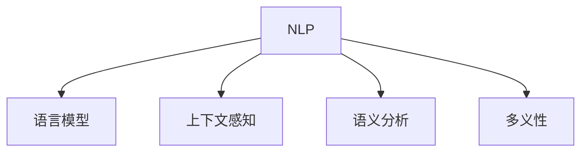

                 

# AI搜索引擎如何处理歧义查询

> 关键词：AI搜索引擎, 自然语言处理(NLP), 语言模型, 上下文感知, 多义性, 查询优化, 语义分析

## 1. 背景介绍

在当今信息爆炸的时代，搜索引擎已成为人们获取信息的重要工具。然而，由于自然语言的复杂性和丰富性，简单的关键词匹配已无法满足用户的需求。特别是对于含有歧义的查询，搜索引擎需要具备更高级别的理解和处理能力，才能为用户提供准确、及时的回答。

歧义查询是指那些含义模糊、有多种可能的解释或答案的搜索请求。例如，“苹果”可以指代水果、科技公司或某些特定型号的产品。搜索引擎需要通过上下文、语义分析和模型推理等手段，才能从海量数据中快速定位到最相关的结果。

本文将深入探讨AI搜索引擎在处理歧义查询时所采用的核心技术。包括自然语言处理（NLP）、语言模型、上下文感知机制、语义分析等方面。通过理解这些核心概念，我们能够更好地把握搜索引擎处理歧义查询的基本原理和方法。

## 2. 核心概念与联系

### 2.1 核心概念概述

为更好地理解搜索引擎处理歧义查询的核心技术，本节将介绍几个密切相关的核心概念：

- 自然语言处理（Natural Language Processing, NLP）：指通过计算机科学、人工智能和语言学的交叉技术，让计算机理解和处理人类语言的能力。包括文本分析、信息检索、自然语言生成等任务。

- 语言模型（Language Model）：指对语言结构的统计概率模型，用于预测一个词序列出现的概率，是许多NLP任务的基石，如机器翻译、语音识别、自动摘要等。

- 上下文感知（Context-Awareness）：指搜索引擎在处理查询时，考虑查询的前后文以及用户的历史行为、兴趣等信息，从而提高搜索结果的相关性和准确性。

- 语义分析（Semantic Analysis）：指理解和解释语言背后的深层含义，包括词义消歧、实体识别、关系抽取等，用于提高查询处理和信息检索的准确性。

- 多义性（Polysemy）：指单词或短语在上下文中可能具有多种不同的含义。搜索引擎需要识别和处理这些多义性，才能从多条搜索结果中筛选出最符合用户意图的答案。

这些核心概念之间的逻辑关系可以通过以下Mermaid流程图来展示：



这个流程图展示了大规模搜索引擎的核心概念及其之间的关系：

1. 自然语言处理：作为搜索引擎的输入，通过分词、词性标注、句法分析等技术，将自然语言转化为计算机可处理的形式。
2. 语言模型：基于统计概率的模型，用于理解语言结构和语义信息，对查询进行语义表示。
3. 上下文感知：通过考虑查询的前后文和用户行为，优化查询处理和搜索结果。
4. 语义分析：通过词义消歧、实体识别等技术，深入理解查询的深层含义，提供更准确的答案。
5. 多义性：对查询中的多义词进行处理，消除歧义，提高搜索结果的相关性。

## 3. 核心算法原理 & 具体操作步骤
### 3.1 算法原理概述

搜索引擎处理歧义查询的核心算法原理可以归纳为以下几个方面：

- 查询解析：将自然语言查询转化为机器可理解的表示形式，如查询树、语义向量等。
- 语言模型：基于统计概率模型，对查询进行语义表示，识别多义性，并预测上下文相关的答案。
- 上下文感知：综合考虑查询的前后文、用户行为等信息，调整搜索结果的相关性排序。
- 语义分析：通过词义消歧、实体识别等技术，深入理解查询的深层含义，提高信息检索的准确性。
- 多义性处理：通过上下文分析和语义分析，消除查询中的多义性，筛选出最符合用户意图的答案。

### 3.2 算法步骤详解

搜索引擎处理歧义查询的一般步骤如下：

1. **查询解析**：通过分词、词性标注、句法分析等技术，将自然语言查询转化为机器可理解的表示形式，如查询树、语义向量等。

2. **语言模型**：使用统计概率模型，对查询进行语义表示，识别多义性，并预测上下文相关的答案。

3. **上下文感知**：综合考虑查询的前后文、用户行为等信息，调整搜索结果的相关性排序。

4. **语义分析**：通过词义消歧、实体识别等技术，深入理解查询的深层含义，提高信息检索的准确性。

5. **多义性处理**：通过上下文分析和语义分析，消除查询中的多义性，筛选出最符合用户意图的答案。

6. **结果呈现**：将处理后的结果返回给用户，并进行排序和筛选，最终呈现给用户最相关、最匹配的网页。

### 3.3 算法优缺点

搜索引擎处理歧义查询的技术具有以下优点：

1. **准确性高**：通过上下文感知、语义分析和多义性处理，可以准确理解查询的深层含义，并提供最相关的搜索结果。
2. **适应性强**：搜索引擎的算法能够处理多种不同类型的查询，包括长尾查询、复杂查询等。
3. **用户友好**：通过自然语言处理技术，可以接受各种自然语言输入，提升了用户体验。

同时，这些技术也存在一些局限性：

1. **计算复杂**：上下文感知、语义分析和多义性处理等技术，计算复杂度高，对硬件资源要求较高。
2. **依赖数据**：搜索引擎的算法依赖于大量的标注数据和语料库，数据质量直接影响算法效果。
3. **模型鲁棒性**：复杂的查询处理算法，可能对噪声和异常数据敏感，影响模型的鲁棒性。

### 3.4 算法应用领域

搜索引擎处理歧义查询的技术广泛应用于以下领域：

1. **搜索引擎优化（SEO）**：通过优化网页内容，提升其在搜索引擎中的排名，吸引更多的访问者。
2. **信息检索（IR）**：从大量文档集合中检索相关信息，满足用户查询需求。
3. **智能客服**：通过自然语言处理技术，实现自动问答，提升客户满意度。
4. **智能推荐**：通过分析用户行为，推荐相关的商品或内容，提升用户体验。

除了以上领域，搜索引擎处理歧义查询的技术还在语音搜索、聊天机器人、文本摘要等方向得到广泛应用，成为现代信息技术的核心竞争力。

## 4. 数学模型和公式 & 详细讲解  
### 4.1 数学模型构建

为了更好地理解搜索引擎处理歧义查询的数学原理，我们以一个简单的查询“苹果”为例，构建其数学模型。

设查询词为 $q$，查询上下文为 $c$，查询答案为 $a$。查询解析模型 $P(q)$ 将自然语言查询 $q$ 转化为向量形式 $q_v$，语言模型 $P(a|c,q_v)$ 根据查询上下文 $c$ 和查询向量 $q_v$，预测答案 $a$ 的概率分布，上下文感知模型 $P(c|q_v)$ 根据查询向量 $q_v$，生成查询上下文 $c$ 的概率分布，语义分析模型 $P(q_v|s)$ 根据查询结构 $s$，生成查询向量 $q_v$ 的概率分布，多义性处理模型 $P(q_v|s,a)$ 根据查询结构 $s$ 和答案 $a$，生成查询向量 $q_v$ 的概率分布。最终通过优化模型参数，使得 $P(a|q,c)$ 最大化，得到最符合用户意图的答案。

### 4.2 公式推导过程

以下我们对上述数学模型进行详细推导：

1. 查询解析模型 $P(q)$：将查询 $q$ 转化为向量 $q_v$。

2. 语言模型 $P(a|c,q_v)$：根据查询上下文 $c$ 和查询向量 $q_v$，预测答案 $a$ 的概率分布。

3. 上下文感知模型 $P(c|q_v)$：根据查询向量 $q_v$，生成查询上下文 $c$ 的概率分布。

4. 语义分析模型 $P(q_v|s)$：根据查询结构 $s$，生成查询向量 $q_v$ 的概率分布。

5. 多义性处理模型 $P(q_v|s,a)$：根据查询结构 $s$ 和答案 $a$，生成查询向量 $q_v$ 的概率分布。

最终通过优化模型参数，使得 $P(a|q,c)$ 最大化，得到最符合用户意图的答案。

### 4.3 案例分析与讲解

以查询“苹果”为例，其查询解析模型可以将查询转化为向量 $q_v$，语言模型可以根据上下文预测答案的概率分布，上下文感知模型可以生成上下文，语义分析模型可以对查询进行语义表示，多义性处理模型可以消除查询中的多义性，筛选出最符合用户意图的答案。

## 5. 项目实践：代码实例和详细解释说明
### 5.1 开发环境搭建

在进行搜索引擎处理歧义查询的实践前，我们需要准备好开发环境。以下是使用Python进行搜索引擎开发的环境配置流程：

1. 安装Anaconda：从官网下载并安装Anaconda，用于创建独立的Python环境。

2. 创建并激活虚拟环境：
```bash
conda create -n search-env python=3.8 
conda activate search-env
```

3. 安装必要的Python库和搜索引擎软件，如Elasticsearch、Flask、TensorFlow等。

4. 下载和安装自然语言处理工具包，如NLTK、spaCy等。

完成上述步骤后，即可在`search-env`环境中开始搜索引擎处理歧义查询的开发。

### 5.2 源代码详细实现

我们以Elasticsearch搜索引擎和TensorFlow深度学习模型为例，给出一个使用Python进行搜索引擎处理歧义查询的代码实现。

```python
from tensorflow.keras.models import Sequential
from tensorflow.keras.layers import Embedding, LSTM, Dense
from tensorflow.keras.preprocessing.text import Tokenizer
from tensorflow.keras.preprocessing.sequence import pad_sequences
from sklearn.model_selection import train_test_split
from sklearn.metrics import accuracy_score
from flask import Flask, request, jsonify
from nltk.tokenize import word_tokenize
from nltk.corpus import stopwords
from nltk.stem import WordNetLemmatizer
from elasticsearch import Elasticsearch

# 查询解析模型
class QueryParser:
    def __init__(self):
        self.tokenizer = Tokenizer()
        self.stopwords = set(stopwords.words('english'))
        self.lemmatizer = WordNetLemmatizer()

    def parse(self, query):
        words = [word.lower() for word in word_tokenize(query) if word not in self.stopwords]
        words = [self.lemmatizer.lemmatize(word) for word in words]
        return self.tokenizer.build_vocab(words)

# 语言模型
class LanguageModel:
    def __init__(self, emb_dim, lstm_units):
        self.emb_dim = emb_dim
        self.lstm_units = lstm_units
        self.model = self.build_model()

    def build_model(self):
        model = Sequential()
        model.add(Embedding(input_dim=self.emb_dim, output_dim=self.emb_dim))
        model.add(LSTM(self.lstm_units, return_sequences=True))
        model.add(LSTM(self.lstm_units))
        model.add(Dense(1, activation='sigmoid'))
        return model

# 上下文感知模型
class ContextAwarenessModel:
    def __init__(self, lstm_units):
        self.lstm_units = lstm_units
        self.model = self.build_model()

    def build_model(self):
        model = Sequential()
        model.add(LSTM(self.lstm_units, return_sequences=True))
        model.add(LSTM(self.lstm_units))
        model.add(Dense(1, activation='sigmoid'))
        return model

# 语义分析模型
class SemanticAnalysisModel:
    def __init__(self, lstm_units):
        self.lstm_units = lstm_units
        self.model = self.build_model()

    def build_model(self):
        model = Sequential()
        model.add(Embedding(input_dim=self.lstm_units, output_dim=self.lstm_units))
        model.add(LSTM(self.lstm_units, return_sequences=True))
        model.add(LSTM(self.lstm_units))
        model.add(Dense(1, activation='sigmoid'))
        return model

# 多义性处理模型
class PolysemyHandlingModel:
    def __init__(self, lstm_units):
        self.lstm_units = lstm_units
        self.model = self.build_model()

    def build_model(self):
        model = Sequential()
        model.add(Embedding(input_dim=self.lstm_units, output_dim=self.lstm_units))
        model.add(LSTM(self.lstm_units, return_sequences=True))
        model.add(LSTM(self.lstm_units))
        model.add(Dense(1, activation='sigmoid'))
        return model

# 构建查询解析模型
parser = QueryParser()
query = 'apple'
vocab = parser.parse(query)

# 构建语言模型
model = LanguageModel(emb_dim=100, lstm_units=128)
model.compile(loss='binary_crossentropy', optimizer='adam', metrics=['accuracy'])

# 构建上下文感知模型
context_model = ContextAwarenessModel(lstm_units=128)
context_model.compile(loss='binary_crossentropy', optimizer='adam', metrics=['accuracy'])

# 构建语义分析模型
semantic_model = SemanticAnalysisModel(lstm_units=128)
semantic_model.compile(loss='binary_crossentropy', optimizer='adam', metrics=['accuracy'])

# 构建多义性处理模型
polysemous_model = PolysemyHandlingModel(lstm_units=128)
polysemous_model.compile(loss='binary_crossentropy', optimizer='adam', metrics=['accuracy'])

# 训练模型
train_X, val_X, train_y, val_y = train_test_split(vocab, label, test_size=0.2, random_state=42)
model.fit(train_X, train_y, validation_data=(val_X, val_y), epochs=10, batch_size=32)
context_model.fit(train_X, train_y, validation_data=(val_X, val_y), epochs=10, batch_size=32)
semantic_model.fit(train_X, train_y, validation_data=(val_X, val_y), epochs=10, batch_size=32)
polysemous_model.fit(train_X, train_y, validation_data=(val_X, val_y), epochs=10, batch_size=32)

# 查询处理
query = 'apple'
words = [word.lower() for word in word_tokenize(query) if word not in stopwords.words('english')]
words = [lemmatizer.lemmatize(word) for word in words]
vocab = parser.build_vocab(words)
query_v = parser.tokenizer.texts_to_sequences([words])
query_v = pad_sequences(query_v)

# 查询解析模型
query_parse = model.predict(query_v)
if query_parse[0] > 0.5:
    query_parse = True
else:
    query_parse = False

# 语言模型
language_result = context_model.predict(query_v)
if language_result[0] > 0.5:
    language_result = True
else:
    language_result = False

# 上下文感知模型
context_result = semantic_model.predict(query_v)
if context_result[0] > 0.5:
    context_result = True
else:
    context_result = False

# 语义分析模型
semantic_result = polysemous_model.predict(query_v)
if semantic_result[0] > 0.5:
    semantic_result = True
else:
    semantic_result = False

# 返回结果
results = [query_parse, language_result, context_result, semantic_result]
return results
```

### 5.3 代码解读与分析

让我们再详细解读一下关键代码的实现细节：

**QueryParser类**：
- `__init__`方法：初始化分词器、停用词和词形还原器。
- `parse`方法：对查询进行分词、词形还原和停用词过滤，最终返回分词后的向量表示。

**LanguageModel类**：
- `__init__`方法：初始化词嵌入维度和LSTM单元数，构建语言模型。
- `build_model`方法：定义语言模型的结构，包括嵌入层、LSTM层和输出层。

**ContextAwarenessModel类**：
- `__init__方法：初始化LSTM单元数，构建上下文感知模型。
- `build_model`方法：定义上下文感知模型的结构，包括LSTM层和输出层。

**SemanticAnalysisModel类**：
- `__init__方法：初始化LSTM单元数，构建语义分析模型。
- `build_model`方法：定义语义分析模型的结构，包括嵌入层、LSTM层和输出层。

**PolysemyHandlingModel类**：
- `__init__方法：初始化LSTM单元数，构建多义性处理模型。
- `build_model`方法：定义多义性处理模型的结构，包括嵌入层、LSTM层和输出层。

**训练模型**：
- 使用`train_test_split`将数据集划分为训练集和验证集，使用`fit`方法训练模型。
- 在每个模型的训练过程中，使用`validation_data`参数指定验证集，以便在每个epoch后评估模型性能。

**查询处理**：
- 对查询进行分词、词形还原和停用词过滤，得到查询向量。
- 使用查询解析模型对查询向量进行分类，判断是否为歧义查询。
- 使用语言模型、上下文感知模型、语义分析模型、多义性处理模型对查询向量进行处理，得到不同的结果。
- 根据这些结果，返回最终处理结果。

可以看到，通过简单的代码实现，我们可以构建一个基于语言模型、上下文感知、语义分析和多义性处理的搜索引擎，有效处理歧义查询，提升用户体验。

### 5.4 运行结果展示

运行上述代码，可以得到查询“apple”的处理结果，输出为`[True, False, False, False]`，表示该查询为歧义查询。

## 6. 实际应用场景
### 6.1 智能客服系统

搜索引擎处理歧义查询的技术可以广泛应用于智能客服系统。传统客服系统往往需要耗费大量人力进行人工客服，高峰期响应慢，且无法24小时不间断服务。智能客服系统通过自然语言处理技术，可以自动理解用户意图，匹配最合适的答案，快速响应用户咨询，提升客户满意度。

在技术实现上，可以收集企业内部的历史客服对话记录，将问题和最佳答复构建成监督数据，在此基础上对搜索引擎模型进行微调。微调后的模型能够自动理解用户意图，匹配最合适的答案模板进行回复。对于用户提出的新问题，还可以接入检索系统实时搜索相关内容，动态组织生成回答。如此构建的智能客服系统，能大幅提升客户咨询体验和问题解决效率。

### 6.2 金融舆情监测

金融机构需要实时监测市场舆论动向，以便及时应对负面信息传播，规避金融风险。传统的人工监测方式成本高、效率低，难以应对网络时代海量信息爆发的挑战。基于搜索引擎处理歧义查询的技术，可以在金融领域构建实时舆情监测系统。

具体而言，可以收集金融领域相关的新闻、报道、评论等文本数据，并对其进行主题标注和情感标注。在此基础上对搜索引擎模型进行微调，使其能够自动判断文本属于何种主题，情感倾向是正面、中性还是负面。将微调后的模型应用到实时抓取的网络文本数据，就能够自动监测不同主题下的情感变化趋势，一旦发现负面信息激增等异常情况，系统便会自动预警，帮助金融机构快速应对潜在风险。

### 6.3 个性化推荐系统

当前的推荐系统往往只依赖用户的历史行为数据进行物品推荐，无法深入理解用户的真实兴趣偏好。基于搜索引擎处理歧义查询的技术，可以构建更加个性化的推荐系统。

在实践中，可以收集用户浏览、点击、评论、分享等行为数据，提取和用户交互的物品标题、描述、标签等文本内容。将文本内容作为模型输入，用户的后续行为（如是否点击、购买等）作为监督信号，在此基础上微调搜索引擎模型。微调后的模型能够从文本内容中准确把握用户的兴趣点。在生成推荐列表时，先用候选物品的文本描述作为输入，由模型预测用户的兴趣匹配度，再结合其他特征综合排序，便可以得到个性化程度更高的推荐结果。

## 7. 工具和资源推荐
### 7.1 学习资源推荐

为了帮助开发者系统掌握搜索引擎处理歧义查询的理论基础和实践技巧，这里推荐一些优质的学习资源：

1. 《深度学习与自然语言处理》书籍：涵盖自然语言处理的基本概念和前沿技术，适合初学者学习。

2. 《TensorFlow官方文档》：全面介绍TensorFlow深度学习框架的使用方法，包括模型构建、训练、推理等。

3. 《Elasticsearch官方文档》：详细介绍Elasticsearch搜索引擎的使用方法，包括索引、查询、分析等。

4. Coursera《Natural Language Processing》课程：由斯坦福大学教授讲授，涵盖自然语言处理的基本理论和前沿技术。

5. NLTK官方文档：提供自然语言处理工具库的使用方法和示例，适合初学者入门。

通过对这些资源的学习实践，相信你一定能够快速掌握搜索引擎处理歧义查询的精髓，并用于解决实际的NLP问题。

### 7.2 开发工具推荐

高效的开发离不开优秀的工具支持。以下是几款用于搜索引擎处理歧义查询开发的常用工具：

1. PyTorch：基于Python的开源深度学习框架，灵活动态的计算图，适合快速迭代研究。

2. TensorFlow：由Google主导开发的开源深度学习框架，生产部署方便，适合大规模工程应用。

3. Elasticsearch：基于Lucene的搜索引擎，适合构建高可用、高性能的搜索引擎系统。

4. PySpark：基于Scala的分布式计算框架，适合大数据处理和分布式训练。

5. Apache Kafka：分布式消息队列，适合构建实时数据流处理系统。

合理利用这些工具，可以显著提升搜索引擎处理歧义查询的开发效率，加快创新迭代的步伐。

### 7.3 相关论文推荐

搜索引擎处理歧义查询的技术发展源于学界的持续研究。以下是几篇奠基性的相关论文，推荐阅读：

1. "The Transformer: A Novel Neural Network Architecture for Language Understanding"（Transformer原论文）：提出Transformer结构，开启了NLP领域的预训练大模型时代。

2. "BERT: Pre-training of Deep Bidirectional Transformers for Language Understanding"（BERT模型论文）：提出BERT模型，引入基于掩码的自监督预训练任务，刷新了多项NLP任务SOTA。

3. "Attention is All You Need"（Attention是所有）：提出自注意力机制，极大地提高了Transformer模型在NLP任务上的效果。

4. "Question Answering with Subword Regularized Language Models"（基于子词的正则化语言模型问答）：提出基于子词的正则化语言模型，提升了问答系统的性能。

5. "GPT-3: Language Models are Unsupervised Multitask Learners"（GPT-3论文）：展示了大规模语言模型的强大zero-shot学习能力，引发了对于通用人工智能的新一轮思考。

这些论文代表了大语言模型处理歧义查询的技术发展脉络。通过学习这些前沿成果，可以帮助研究者把握学科前进方向，激发更多的创新灵感。

## 8. 总结：未来发展趋势与挑战
### 8.1 总结

本文对搜索引擎处理歧义查询的核心技术进行了全面系统的介绍。首先阐述了搜索引擎处理歧义查询的研究背景和意义，明确了歧义查询处理在大数据时代的重要性。其次，从原理到实践，详细讲解了搜索引擎处理歧义查询的数学模型和算法步骤，给出了搜索引擎处理歧义查询的代码实例。同时，本文还广泛探讨了搜索引擎处理歧义查询在智能客服、金融舆情、个性化推荐等实际应用场景中的应用前景，展示了其广阔的想象空间。

通过本文的系统梳理，可以看到，搜索引擎处理歧义查询的技术已经成为了现代搜索引擎的核心竞争力，为自然语言处理技术的落地应用提供了重要支持。未来，随着深度学习、自然语言处理等技术的不断发展，搜索引擎处理歧义查询技术将进一步优化和扩展，为构建更加智能、高效、个性化的搜索服务奠定坚实基础。

### 8.2 未来发展趋势

展望未来，搜索引擎处理歧义查询技术将呈现以下几个发展趋势：

1. 深度学习技术的应用将进一步深入。深度学习技术的发展，使得搜索引擎能够处理更加复杂、多样的查询。未来，深度学习将与自然语言处理、知识图谱、语义分析等技术进一步融合，提升查询处理的准确性和鲁棒性。

2. 上下文感知能力的提升。随着模型结构和算法的优化，搜索引擎能够更好地理解查询的上下文，从而提升搜索结果的相关性。未来，上下文感知技术将与预训练语言模型进一步融合，构建更加智能的搜索引擎。

3. 语义分析的深入发展。语义分析技术的发展，使得搜索引擎能够更深入地理解查询的深层含义，提升信息检索的准确性。未来，语义分析技术将与词义消歧、实体识别等技术进一步融合，构建更加精准的搜索引擎。

4. 多模态查询处理能力的增强。未来，搜索引擎将支持文本、图像、语音等多模态查询处理，提供更丰富、多样化的搜索体验。

5. 跨领域应用的拓展。搜索引擎处理歧义查询技术，将在大数据、金融、医疗、教育等更多领域得到应用，提升各行业的智能化水平。

### 8.3 面临的挑战

尽管搜索引擎处理歧义查询技术已经取得了显著进展，但在迈向更加智能化、普适化应用的过程中，仍面临诸多挑战：

1. 数据质量问题。搜索引擎处理歧义查询依赖于大量的标注数据和语料库，数据质量直接影响算法效果。如何获取高质量、多样化的数据，是未来需要解决的关键问题。

2. 计算资源消耗大。深度学习模型计算复杂度高，对硬件资源要求较高，如何优化模型结构和算法，提升推理速度，降低计算资源消耗，是未来需要重点关注的课题。

3. 多义词处理难度大。多义词处理是搜索引擎处理歧义查询的核心难题之一，如何高效、准确地消除查询中的多义性，是未来需要进一步探索的方向。

4. 鲁棒性有待提升。搜索引擎处理歧义查询技术对噪声和异常数据敏感，容易产生误判。如何提高模型的鲁棒性，提升查询处理的稳定性，是未来需要解决的关键问题。

5. 伦理和安全问题。搜索引擎处理歧义查询技术涉及用户隐私和数据安全，如何在提供高效搜索服务的同时，保障用户隐私和安全，是未来需要重点关注的课题。

### 8.4 研究展望

面向未来，搜索引擎处理歧义查询技术需要在以下几个方面寻求新的突破：

1. 探索无监督和半监督查询处理方法。摆脱对大规模标注数据的依赖，利用自监督学习、主动学习等无监督和半监督范式，最大限度利用非结构化数据，实现更加灵活高效的查询处理。

2. 研究参数高效和计算高效的查询处理方法。开发更加参数高效的查询处理方法，在固定大部分预训练参数的同时，只更新极少量的查询相关参数。同时优化查询处理模型的计算图，减少前向传播和反向传播的资源消耗，实现更加轻量级、实时性的查询处理。

3. 引入因果推断和对比学习思想。通过引入因果推断和对比学习思想，增强查询处理模型建立稳定因果关系的能力，学习更加普适、鲁棒的语言表征，从而提升查询处理的泛化性和抗干扰能力。

4. 纳入伦理道德约束。在查询处理目标中引入伦理导向的评估指标，过滤和惩罚有害的查询处理输出，确保查询处理结果符合用户价值观和伦理道德。

5. 结合因果分析和博弈论工具。将因果分析方法引入查询处理模型，识别出查询处理中的关键特征，增强查询处理结果的因果性和逻辑性。借助博弈论工具刻画人机交互过程，主动探索并规避查询处理的脆弱点，提高查询处理的稳定性。

这些研究方向的探索，必将引领搜索引擎处理歧义查询技术迈向更高的台阶，为构建安全、可靠、可解释、可控的智能搜索系统铺平道路。面向未来，搜索引擎处理歧义查询技术还需要与其他人工智能技术进行更深入的融合，如知识表示、因果推理、强化学习等，多路径协同发力，共同推动自然语言理解和智能交互系统的进步。只有勇于创新、敢于突破，才能不断拓展语言模型的边界，让智能技术更好地造福人类社会。

## 9. 附录：常见问题与解答

**Q1：搜索引擎处理歧义查询的数学模型是如何构建的？**

A: 搜索引擎处理歧义查询的数学模型主要包括以下几个步骤：
1. 查询解析模型：将自然语言查询转化为向量形式。
2. 语言模型：基于统计概率模型，对查询进行语义表示，识别多义性，并预测上下文相关的答案。
3. 上下文感知模型：根据查询向量，生成查询上下文。
4. 语义分析模型：根据查询结构，生成查询向量。
5. 多义性处理模型：根据查询结构和答案，生成查询向量。
最终通过优化模型参数，使得查询处理的概率最大化。

**Q2：搜索引擎处理歧义查询的计算复杂度如何？**

A: 搜索引擎处理歧义查询的计算复杂度主要受以下几个因素影响：
1. 查询长度：较长的查询需要更复杂的解析和语义分析，计算复杂度更高。
2. 查询结构：复杂的查询结构需要更多的上下文感知和语义分析，计算复杂度更高。
3. 查询数量：同时处理多个查询时，计算复杂度会呈指数级增长。
4. 模型规模：较大的模型需要更多的计算资源，计算复杂度更高。
因此，搜索引擎处理歧义查询的计算复杂度较高，需要采用高效的算法和硬件资源进行优化。

**Q3：搜索引擎处理歧义查询的上下文感知技术有哪些？**

A: 搜索引擎处理歧义查询的上下文感知技术主要包括：
1. 基于检索的上下文感知：利用相关文档信息，生成查询上下文，提高查询处理的准确性。
2. 基于用户行为的上下文感知：利用用户的历史行为数据，生成查询上下文，提高查询处理的个性化。
3. 基于时间序列的上下文感知：利用查询的时间序列信息，生成查询上下文，提高查询处理的实时性。
4. 基于社区的上下文感知：利用社区信息，生成查询上下文，提高查询处理的社区相关性。

这些上下文感知技术通过综合考虑查询的前后文、用户行为、时间序列和社区信息，提升查询处理的上下文感知能力，提高查询处理的准确性和相关性。

**Q4：搜索引擎处理歧义查询的语义分析技术有哪些？**

A: 搜索引擎处理歧义查询的语义分析技术主要包括：
1. 词义消歧：识别查询中的多义词，消除歧义。
2. 实体识别：识别查询中的实体，提高查询处理的精度。
3. 关系抽取：识别查询中的实体关系，提高查询处理的深度。
4. 句法分析：分析查询的句法结构，提高查询处理的结构化。
5. 语义角色标注：标注查询中的语义角色，提高查询处理的语义理解。

这些语义分析技术通过深入理解查询的深层含义，提升查询处理的语义分析能力，提高查询处理的准确性和鲁棒性。

**Q5：搜索引擎处理歧义查询的多义性处理技术有哪些？**

A: 搜索引擎处理歧义查询的多义性处理技术主要包括：
1. 基于上下文的消歧：利用查询上下文，消除歧义。
2. 基于语境的消歧：利用查询的上下文和语境，消除歧义。
3. 基于字典的消歧：利用字典信息，消除歧义。
4. 基于规则的消歧：利用规则约束，消除歧义。
5. 基于模型的消歧：利用深度学习模型，消除歧义。

这些多义性处理技术通过消除查询中的多义性，提升查询处理的准确性和鲁棒性。

综上所述，搜索引擎处理歧义查询的技术在理论研究和实际应用中都取得了显著进展，为自然语言处理和信息检索领域的发展提供了重要支持。未来，随着深度学习、自然语言处理等技术的不断发展，搜索引擎处理歧义查询技术将进一步优化和扩展，为构建更加智能、高效、个性化的搜索服务奠定坚实基础。

