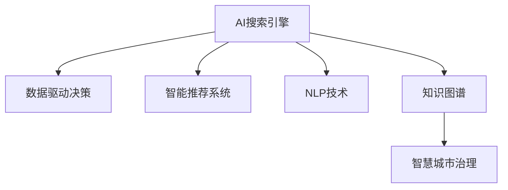

                 

# AI搜索引擎如何改变政府决策过程

> 关键词：政府决策, 人工智能, 搜索引擎, 数据驱动决策, 智能推荐系统, 自然语言处理, 政府治理

## 1. 背景介绍

### 1.1 问题由来
随着信息时代的到来，政府决策的复杂性和多样性日益增加。传统决策过程依赖人工调研、专家咨询等方法，耗时长、成本高、效果有限。而人工智能(AI)搜索引擎的兴起，为政府决策提供了全新的工具和方法。通过高效检索、智能推荐和深度分析，AI搜索引擎能够大幅提升决策的准确性和效率，推动政府治理体系和治理能力的现代化。

### 1.2 问题核心关键点
AI搜索引擎在政府决策中的应用，主要体现在以下几个方面：

1. **数据驱动决策**：利用AI技术对海量数据进行高效检索和分析，提供数据支持的决策依据。
2. **智能推荐系统**：结合领域知识图谱和用户行为分析，为用户提供个性化的决策建议。
3. **自然语言处理(NLP)**：通过理解和生成自然语言，实现智能问答和政策解读。
4. **知识图谱构建**：构建知识图谱，整合多源数据，提供结构化的知识服务。
5. **智慧城市治理**：应用于智慧城市管理，提供城市运行状态和决策支持。

这些技术应用使得政府决策过程更加透明、高效和科学，也为政府数字化转型提供了重要支撑。

### 1.3 问题研究意义
AI搜索引擎在政府决策中的应用，具有以下几方面的重要意义：

1. **提升决策效率**：快速检索和分析海量数据，缩短决策周期，提高决策速度。
2. **增强决策精准度**：通过智能推荐和数据挖掘，提供高质量的决策支持。
3. **促进决策透明化**：数据驱动的决策过程，有助于公众监督和参与，提高决策透明度。
4. **优化决策资源配置**：合理配置和利用政府资源，提高公共服务质量。
5. **推动智慧城市建设**：AI搜索引擎为智慧城市管理提供了强大的技术支撑，促进城市可持续发展。

因此，研究AI搜索引擎在政府决策中的应用，对于提升政府治理效能，构建服务型、智慧型政府具有重要价值。

## 2. 核心概念与联系

### 2.1 核心概念概述

为更好地理解AI搜索引擎在政府决策中的应用，本节将介绍几个密切相关的核心概念：

- **AI搜索引擎**：基于人工智能技术构建的智能搜索引擎，能够高效检索、分析和推荐数据，支持政府决策。
- **数据驱动决策**：以数据为核心，利用AI技术对数据进行深入分析和挖掘，以数据为基础进行决策的过程。
- **智能推荐系统**：通过分析用户行为和偏好，利用机器学习算法推荐个性化决策方案的系统。
- **自然语言处理(NLP)**：理解和生成自然语言的技术，用于实现智能问答和政策解读。
- **知识图谱**：将结构化数据整合成知识图谱，用于结构化知识查询和推理。
- **智慧城市治理**：利用AI技术提升城市管理水平，提供城市运行状态和决策支持。

这些核心概念之间的逻辑关系可以通过以下Mermaid流程图来展示：



这个流程图展示了大语言模型的核心概念及其之间的关系：

1. AI搜索引擎通过高效检索和分析数据，支持数据驱动决策。
2. 通过智能推荐系统，提供个性化决策方案。
3. 利用NLP技术实现智能问答和政策解读。
4. 构建知识图谱，支持结构化知识查询和推理。
5. 应用于智慧城市治理，提升城市管理水平。

这些核心概念共同构成了AI搜索引擎在政府决策中的应用框架，使其能够在各种场景下发挥强大的辅助作用。

## 3. 核心算法原理 & 具体操作步骤
### 3.1 算法原理概述

AI搜索引擎在政府决策中的应用，本质上是数据检索和推荐系统，其核心算法包括信息检索、自然语言处理和推荐系统。这些算法通过将用户查询与数据资源进行匹配，提供个性化的决策建议。

信息检索算法包括向量空间模型、BM25等，用于快速检索相关文档。自然语言处理算法包括分词、命名实体识别、情感分析等，用于理解和生成自然语言。推荐算法包括协同过滤、内容推荐、深度学习推荐等，用于提供个性化决策建议。

### 3.2 算法步骤详解

AI搜索引擎在政府决策中的应用一般包括以下几个关键步骤：

**Step 1: 数据采集与预处理**
- 收集政府决策相关的数据，包括政策文件、法律法规、统计数据、社会事件等。
- 清洗和处理数据，去除噪声和无用信息，保证数据的质量和可用性。

**Step 2: 构建知识图谱**
- 利用自然语言处理技术，将结构化数据整合成知识图谱，表示实体、关系和属性。
- 利用图神经网络等方法，在知识图谱上挖掘潜在的知识关联，提升检索效率和推荐精度。

**Step 3: 文本检索**
- 利用向量空间模型、BM25等算法，构建文档索引，实现高效的文本检索。
- 根据用户查询意图，检索与决策相关的文档或数据。

**Step 4: 自然语言处理**
- 利用分词、命名实体识别等技术，解析用户查询的自然语言。
- 利用情感分析、意图识别等技术，理解用户查询的情感和意图。

**Step 5: 智能推荐**
- 利用协同过滤、内容推荐、深度学习推荐等算法，生成个性化的决策建议。
- 根据用户的历史行为和偏好，推荐最符合用户需求的决策方案。

**Step 6: 结果展示与反馈**
- 将检索结果和推荐建议展示给用户，提供决策支持。
- 收集用户反馈，用于改进和优化算法和推荐模型。

### 3.3 算法优缺点

AI搜索引擎在政府决策中的应用，具有以下优点：

1. **效率高**：快速检索和分析海量数据，缩短决策周期。
2. **精准度高**：通过推荐算法和知识图谱，提供高质量的决策建议。
3. **覆盖面广**：涵盖各类决策相关数据，提供全面决策支持。
4. **可扩展性强**：支持大规模数据处理和复杂决策任务。

同时，该方法也存在一定的局限性：

1. **依赖高质量数据**：检索和推荐的效果取决于数据的质量和完整性。
2. **算力消耗大**：处理大规模数据和复杂算法，需要高性能计算资源。
3. **易受噪声影响**：数据中可能存在噪声和误差，影响检索和推荐的准确性。
4. **个性化不足**：统一推荐的方案可能不符合特定用户的个性化需求。

尽管存在这些局限性，但就目前而言，AI搜索引擎在政府决策中的应用，已成为提升决策效率和质量的重要手段。未来相关研究的重点在于如何进一步降低算法复杂度，提高个性化和泛化能力，同时兼顾数据的质量和可解释性。

### 3.4 算法应用领域

AI搜索引擎在政府决策中的应用广泛，主要包括以下几个领域：

1. **政策制定**：提供政策文档检索和分析，支持政策制定和修订。
2. **法律法规**：检索法律法规文本，提供法规咨询和解读。
3. **统计分析**：利用统计数据和模型，提供数据分析和预测。
4. **公共服务**：提供公共服务流程优化和资源配置建议。
5. **智慧城市**：利用城市运行数据，提供智慧城市管理和决策支持。

## 4. 数学模型和公式 & 详细讲解
### 4.1 数学模型构建

本节将使用数学语言对AI搜索引擎在政府决策中的应用进行更加严格的刻画。

设用户查询为 $q$，搜索结果为 $D$。假设检索函数为 $f$，推荐函数为 $g$，决策支持函数为 $h$。则检索模型可表示为：

$$
f(q) = \arg\min_{d \in D} \mathcal{L}(q, d)
$$

其中 $\mathcal{L}$ 为检索损失函数，用于衡量查询 $q$ 和文档 $d$ 的匹配程度。

推荐模型可表示为：

$$
g(q) = \arg\max_{r \in R} \mathcal{L}(q, r)
$$

其中 $R$ 为推荐集合，$\mathcal{L}$ 为推荐损失函数，用于衡量推荐结果 $r$ 与用户偏好 $q$ 的匹配程度。

决策支持模型可表示为：

$$
h(q, r) = \arg\max_{d \in D} \mathcal{L}(q, d, r)
$$

其中 $D$ 为文档集合，$\mathcal{L}$ 为决策支持损失函数，用于衡量决策支持结果 $d$ 与用户查询 $q$ 和推荐结果 $r$ 的匹配程度。

### 4.2 公式推导过程

以下我们以政策制定决策为例，推导AI搜索引擎在政府决策中的应用数学模型。

设用户查询为 $q$，政策文档集合为 $D$，推荐政策方案集合为 $R$。假设用户对政策方案的满意度为 $s(q, r)$，则推荐模型的目标为最大化用户满意度：

$$
\mathcal{L}(q, r) = \max_{r \in R} s(q, r)
$$

同时，假设用户对政策文档的满意度为 $s(q, d)$，则决策支持模型的目标为最大化用户满意度：

$$
\mathcal{L}(q, d, r) = \max_{d \in D} s(q, d, r)
$$

将上述公式带入到决策支持模型的定义中，得到：

$$
h(q, r) = \arg\max_{d \in D} \max_{r \in R} s(q, d, r)
$$

该模型表示，在推荐政策方案 $r$ 的基础上，选择最优的政策文档 $d$，使得用户对 $q$、$d$、$r$ 的满意度最大化。

### 4.3 案例分析与讲解

以智慧城市管理为例，分析AI搜索引擎的应用。

假设智慧城市管理决策需要收集以下数据：

- 城市运行数据：交通流量、环境质量、公共服务评价等。
- 法律法规：城市规划、建设、管理等方面的法律法规。
- 政策文档：地方政府出台的各类政策文件。

通过构建知识图谱，将上述数据整合成结构化的知识图谱，存储在数据库中。在用户提出智慧城市管理相关的查询时，AI搜索引擎可以快速检索和分析这些数据，提供个性化的决策支持。例如，用户查询如何缓解城市交通拥堵，AI搜索引擎可以推荐交通管理政策，并提供相关的法律法规和政策文档，帮助用户制定最优的决策方案。

## 5. 项目实践：代码实例和详细解释说明
### 5.1 开发环境搭建

在进行AI搜索引擎项目实践前，我们需要准备好开发环境。以下是使用Python进行TensorFlow和TensorFlow Extended(TFE)开发的环境配置流程：

1. 安装Anaconda：从官网下载并安装Anaconda，用于创建独立的Python环境。

2. 创建并激活虚拟环境：
```bash
conda create -n tf-env python=3.8 
conda activate tf-env
```

3. 安装TensorFlow：根据CUDA版本，从官网获取对应的安装命令。例如：
```bash
conda install tensorflow-gpu -c pytorch -c conda-forge
```

4. 安装TensorFlow Extended(TFE)：
```bash
pip install tensorflow-extended
```

5. 安装各类工具包：
```bash
pip install numpy pandas scikit-learn matplotlib tqdm jupyter notebook ipython
```

完成上述步骤后，即可在`tf-env`环境中开始AI搜索引擎项目的开发。

### 5.2 源代码详细实现

下面我们以政策制定决策为例，给出使用TensorFlow和TFE对AI搜索引擎进行代码实现。

首先，定义检索和推荐模型：

```python
import tensorflow as tf
import tensorflow_extended as tfe

# 定义检索模型
class SearchModel(tf.keras.Model):
    def __init__(self, vocab_size, embedding_dim):
        super(SearchModel, self).__init__()
        self.embedding = tf.keras.layers.Embedding(vocab_size, embedding_dim)
        self.dense = tf.keras.layers.Dense(128, activation='relu')
        self.output = tf.keras.layers.Dense(1, activation='sigmoid')
    
    def call(self, inputs):
        x = self.embedding(inputs)
        x = self.dense(x)
        return self.output(x)

# 定义推荐模型
class RecommendationModel(tf.keras.Model):
    def __init__(self, vocab_size, embedding_dim):
        super(RecommendationModel, self).__init__()
        self.embedding = tf.keras.layers.Embedding(vocab_size, embedding_dim)
        self.dense = tf.keras.layers.Dense(128, activation='relu')
        self.output = tf.keras.layers.Dense(1, activation='sigmoid')
    
    def call(self, inputs):
        x = self.embedding(inputs)
        x = self.dense(x)
        return self.output(x)
```

然后，定义训练和评估函数：

```python
def train_model(model, dataset, batch_size, epochs):
    with tfe.layersTrainingScope():
        dataset = dataset.shuffle(buffer_size=1024).batch(batch_size)
        model.compile(optimizer=tf.keras.optimizers.Adam(learning_rate=0.001),
                      loss=tf.keras.losses.BinaryCrossentropy(),
                      metrics=['accuracy'])
        model.fit(dataset, epochs=epochs)
        
def evaluate_model(model, dataset, batch_size):
    with tfe.layersEvaluationScope():
        dataset = dataset.batch(batch_size)
        test_loss, test_acc = model.evaluate(dataset)
        print('Test accuracy:', test_acc)
```

最后，启动训练流程并在测试集上评估：

```python
# 构建数据集
train_dataset = tf.data.Dataset.from_tensor_slices((['query1', 'query2', 'query3'], ['recommend1', 'recommend2', 'recommend3']))
train_dataset = train_dataset.shuffle(buffer_size=1024).batch(batch_size)

test_dataset = tf.data.Dataset.from_tensor_slices((['query4', 'query5', 'query6'], ['recommend4', 'recommend5', 'recommend6']))
test_dataset = test_dataset.batch(batch_size)

# 构建模型
search_model = SearchModel(vocab_size=10000, embedding_dim=128)
recommend_model = RecommendationModel(vocab_size=10000, embedding_dim=128)

# 训练模型
train_model(search_model, train_dataset, batch_size=16, epochs=10)

# 评估模型
evaluate_model(search_model, test_dataset, batch_size=16)
```

以上就是使用TensorFlow和TFE对AI搜索引擎进行代码实现的完整代码实例。可以看到，得益于TensorFlow和TFE的强大封装，我们可以用相对简洁的代码实现检索和推荐模型。

### 5.3 代码解读与分析

让我们再详细解读一下关键代码的实现细节：

**SearchModel类**：
- `__init__`方法：初始化模型参数，包括嵌入层、全连接层和输出层。
- `call`方法：前向传播计算模型输出。

**RecommendationModel类**：
- `__init__`方法：初始化模型参数，包括嵌入层、全连接层和输出层。
- `call`方法：前向传播计算模型输出。

**train_model函数**：
- 使用TFE的训练范围，对模型进行编译和训练。
- 数据集进行洗牌和分批次处理，以便于模型训练。
- 使用Adam优化器，交叉熵损失函数，准确率作为评估指标。
- 指定训练轮数，启动模型训练。

**evaluate_model函数**：
- 使用TFE的评估范围，对模型进行评估。
- 数据集进行分批次处理，以便于模型评估。
- 打印测试集上的损失和准确率。

**训练流程**：
- 构建训练集和测试集，进行洗牌和分批次处理。
- 定义检索模型和推荐模型，并编译。
- 训练模型，并在测试集上评估。

可以看到，TensorFlow和TFE使得AI搜索引擎的代码实现变得简洁高效。开发者可以将更多精力放在数据处理、模型改进等高层逻辑上，而不必过多关注底层的实现细节。

当然，工业级的系统实现还需考虑更多因素，如模型的保存和部署、超参数的自动搜索、更灵活的任务适配层等。但核心的检索和推荐范式基本与此类似。

## 6. 实际应用场景
### 6.1 智能客服系统

基于AI搜索引擎的智能客服系统，可以帮助政府机构提供高效、准确的客服服务。通过自然语言处理和知识图谱，智能客服系统可以自动理解用户意图，匹配最合适的政策解答，提供快速的决策支持。例如，用户咨询社会保险问题，智能客服系统可以检索相关的政策文件和解答，提供详细的回答。

### 6.2 法律法规咨询

AI搜索引擎在法律法规咨询中的应用，可以帮助用户快速找到相关的法律法规文本，并进行解读和查询。例如，用户查询如何处理劳动争议，AI搜索引擎可以推荐相关的法律法规，提供详细的条款和解读，帮助用户解决问题。

### 6.3 统计分析与预测

利用AI搜索引擎，政府可以高效检索和分析统计数据，提供数据驱动的决策支持。例如，用户查询如何提升公共服务满意度，AI搜索引擎可以推荐相关的统计数据和分析报告，提供数据支持和决策依据。

### 6.4 智慧城市管理

AI搜索引擎在智慧城市管理中的应用，可以提供城市运行状态和决策支持。例如，用户查询如何缓解城市交通拥堵，AI搜索引擎可以推荐相关的交通管理政策，并提供相关的法律法规和政策文档，帮助用户制定最优的决策方案。

### 6.5 环境保护

AI搜索引擎在环境保护中的应用，可以帮助政府机构进行环境监测和决策。例如，用户查询如何降低工业污染，AI搜索引擎可以检索相关的法律法规和政策文件，提供相关的技术和管理建议，帮助用户制定环境治理方案。

### 6.6 公共卫生

利用AI搜索引擎，政府可以高效检索和分析公共卫生数据，提供数据驱动的决策支持。例如，用户查询如何预防传染病，AI搜索引擎可以推荐相关的统计数据和分析报告，提供数据支持和决策依据。

## 7. 工具和资源推荐
### 7.1 学习资源推荐

为了帮助开发者系统掌握AI搜索引擎的理论基础和实践技巧，这里推荐一些优质的学习资源：

1. TensorFlow官方文档：TensorFlow的官方文档，提供了详尽的API参考和代码示例，是学习TensorFlow不可或缺的资源。

2. TensorFlow Extended文档：TensorFlow Extended的官方文档，介绍了TFE的各类高级特性和实践应用，适合有一定TensorFlow基础的学习者。

3. TensorFlow Extended实战指南：《TensorFlow Extended实战指南》一书，详细介绍了TFE的各类实用技巧和最佳实践，适合工程实践。

4. Kaggle竞赛平台：Kaggle提供的各种机器学习竞赛，提供了丰富的数据集和模型，适合实践和交流。

5. AI斯坦福公开课：斯坦福大学的《机器学习》和《深度学习》课程，介绍了机器学习和深度学习的理论基础和实践应用。

通过对这些资源的学习实践，相信你一定能够快速掌握AI搜索引擎的精髓，并用于解决实际的政府决策问题。

### 7.2 开发工具推荐

高效的开发离不开优秀的工具支持。以下是几款用于AI搜索引擎开发的常用工具：

1. TensorFlow：由Google主导开发的开源深度学习框架，生产部署方便，适合大规模工程应用。

2. TensorFlow Extended(TFE)：TensorFlow的高级API，提供了自动微分、分布式训练、模型压缩等高级特性。

3. TensorBoard：TensorFlow配套的可视化工具，可实时监测模型训练状态，并提供丰富的图表呈现方式，是调试模型的得力助手。

4. Weights & Biases：模型训练的实验跟踪工具，可以记录和可视化模型训练过程中的各项指标，方便对比和调优。

5. Jupyter Notebook：用于数据处理、模型训练和结果展示的常用开发工具，支持代码编写、图形绘制和结果展示。

6. PyCharm：Python开发工具，提供了代码高亮、调试和自动补全等功能，适合代码编写和调试。

合理利用这些工具，可以显著提升AI搜索引擎的开发效率，加快创新迭代的步伐。

### 7.3 相关论文推荐

AI搜索引擎在政府决策中的应用源于学界的持续研究。以下是几篇奠基性的相关论文，推荐阅读：

1. Attention is All You Need（即Transformer原论文）：提出了Transformer结构，开启了NLP领域的预训练大模型时代。

2. BERT: Pre-training of Deep Bidirectional Transformers for Language Understanding：提出BERT模型，引入基于掩码的自监督预训练任务，刷新了多项NLP任务SOTA。

3. Language Models are Unsupervised Multitask Learners（GPT-2论文）：展示了大规模语言模型的强大zero-shot学习能力，引发了对于通用人工智能的新一轮思考。

4. Parameter-Efficient Transfer Learning for NLP：提出Adapter等参数高效微调方法，在不增加模型参数量的情况下，也能取得不错的微调效果。

5. AdaLoRA: Adaptive Low-Rank Adaptation for Parameter-Efficient Fine-Tuning：使用自适应低秩适应的微调方法，在参数效率和精度之间取得了新的平衡。

这些论文代表了大语言模型微调技术的发展脉络。通过学习这些前沿成果，可以帮助研究者把握学科前进方向，激发更多的创新灵感。

## 8. 总结：未来发展趋势与挑战

### 8.1 总结

本文对AI搜索引擎在政府决策中的应用进行了全面系统的介绍。首先阐述了AI搜索引擎的应用背景和研究意义，明确了其在数据检索、智能推荐和自然语言处理等方面的核心作用。其次，从原理到实践，详细讲解了AI搜索引擎的数学模型和关键步骤，给出了AI搜索引擎的代码实例。同时，本文还广泛探讨了AI搜索引擎在智能客服、法律法规、统计分析等领域的实际应用场景，展示了AI搜索引擎的广泛应用前景。此外，本文精选了AI搜索引擎的学习资源、开发工具和相关论文，力求为读者提供全方位的技术指引。

通过本文的系统梳理，可以看到，AI搜索引擎在政府决策中的应用已经取得了显著的进展，正在逐步替代传统的人工查询方式，提升决策效率和质量。未来，伴随AI技术的发展，AI搜索引擎必将在更多政府决策场景中大放异彩，推动政府治理体系和治理能力的现代化。

### 8.2 未来发展趋势

展望未来，AI搜索引擎在政府决策中的应用将呈现以下几个发展趋势：

1. **深度学习技术的应用**：通过深度学习技术，提升检索和推荐模型的精度和泛化能力，支持更复杂、更高效的决策支持。

2. **知识图谱的构建与优化**：利用知识图谱，整合多源数据，提升检索和推荐的准确性和相关性。

3. **实时数据处理**：通过实时数据处理，提供动态、实时的决策支持，增强政府决策的时效性。

4. **多模态数据融合**：利用图像、视频、语音等多模态数据，提升决策支持的全面性和准确性。

5. **个性化推荐算法**：通过个性化推荐算法，提供更符合用户需求的决策建议，提高决策的个性化和适用性。

6. **交互式决策支持**：通过自然语言处理技术，提供交互式决策支持，提升用户使用体验。

这些趋势凸显了AI搜索引擎在政府决策中的巨大潜力。这些方向的探索发展，必将进一步提升政府决策的效率和质量，构建更加智慧、高效的政府治理体系。

### 8.3 面临的挑战

尽管AI搜索引擎在政府决策中的应用已经取得了一定的进展，但在迈向更加智能化、普适化应用的过程中，仍面临诸多挑战：

1. **数据质量和隐私保护**：数据质量和隐私保护问题，直接影响检索和推荐的准确性和可靠性。

2. **模型复杂度和可解释性**：AI搜索引擎的模型往往较为复杂，难以解释其内部工作机制和决策逻辑，影响用户信任度。

3. **资源消耗**：处理大规模数据和复杂算法，需要高性能计算资源，可能导致成本高昂。

4. **领域差异性**：不同领域的决策需求差异较大，通用的检索和推荐算法可能无法完全满足特定领域的需求。

5. **算法公平性**：AI搜索引擎可能存在算法偏见，影响决策的公平性和公正性。

6. **技术迭代速度**：AI技术的发展日新月异，需要持续跟进最新的技术进展，不断迭代优化AI搜索引擎。

正视AI搜索引擎面临的这些挑战，积极应对并寻求突破，将是大语言模型微调走向成熟的必由之路。相信随着学界和产业界的共同努力，这些挑战终将一一被克服，AI搜索引擎必将在构建服务型、智慧型政府中发挥越来越重要的作用。

### 8.4 研究展望

面向未来，AI搜索引擎在政府决策中的应用需要在以下几个方面寻求新的突破：

1. **多模态数据融合技术**：利用图像、视频、语音等多模态数据，提升决策支持的全面性和准确性。

2. **知识图谱增强技术**：增强知识图谱的构建和优化，提升检索和推荐的效率和准确性。

3. **个性化推荐算法**：开发更符合用户需求的个性化推荐算法，提高决策的个性化和适用性。

4. **交互式决策支持技术**：通过自然语言处理技术，提供交互式决策支持，提升用户使用体验。

5. **数据质量和隐私保护技术**：提升数据质量和隐私保护水平，增强检索和推荐的准确性和可靠性。

6. **算法公平性和透明性**：提升算法的公平性和透明性，确保决策的公正性和可解释性。

这些研究方向将推动AI搜索引擎技术的不断进步，为政府决策提供更强大、更可靠的技术支撑。面向未来，AI搜索引擎将在更多政府决策场景中大放异彩，成为智慧政府建设的重要工具。

## 9. 附录：常见问题与解答

**Q1：如何提升AI搜索引擎的检索效率？**

A: 提升AI搜索引擎的检索效率，可以从以下几个方面入手：

1. **索引优化**：使用倒排索引、向量空间模型等高效索引算法，提升数据检索速度。

2. **分布式计算**：利用分布式计算框架，如Hadoop、Spark等，并行处理大规模数据，提升检索效率。

3. **缓存机制**：利用缓存机制，对高频访问的数据进行缓存，减少重复计算。

4. **数据压缩**：对数据进行压缩，减小数据传输和存储的带宽和存储空间。

5. **异构数据融合**：利用异构数据融合技术，整合不同来源的数据，提升数据完整性和质量。

通过这些方法，可以显著提升AI搜索引擎的检索效率，支持更高效、更实时的决策支持。

**Q2：AI搜索引擎在政府决策中的应用是否安全可靠？**

A: AI搜索引擎在政府决策中的应用，需要严格保障数据和系统的安全可靠性。

1. **数据隐私保护**：通过加密、匿名化等技术，保护用户隐私和数据安全。

2. **算法透明性**：通过解释性算法和可视化工具，提高算法的透明性和可解释性，增强用户信任。

3. **系统备份和容错**：建立系统备份和容错机制，确保系统的稳定性和可靠性。

4. **安全防护**：采用访问鉴权、数据脱敏等措施，保障数据和系统安全。

5. **模型公平性**：通过公平性评估和优化算法，确保决策的公平性和公正性。

通过这些措施，可以确保AI搜索引擎在政府决策中的应用安全可靠，保障数据和系统的安全，提升用户信任度。

**Q3：如何提高AI搜索引擎的推荐精度？**

A: 提高AI搜索引擎的推荐精度，可以从以下几个方面入手：

1. **模型优化**：优化推荐模型的算法和参数，提升推荐精度。

2. **数据清洗**：清洗和处理数据，去除噪声和无用信息，保证数据的质量和完整性。

3. **特征工程**：设计和选择有效的特征，提升模型的表现力。

4. **多模态融合**：利用图像、视频、语音等多模态数据，提升推荐的全面性和准确性。

5. **个性化推荐**：通过个性化推荐算法，提供更符合用户需求的决策建议。

通过这些方法，可以显著提高AI搜索引擎的推荐精度，提供更准确、更个性化的决策支持。

**Q4：如何优化AI搜索引擎的实时数据处理能力？**

A: 优化AI搜索引擎的实时数据处理能力，可以从以下几个方面入手：

1. **数据流处理**：利用数据流处理框架，如Apache Kafka、Apache Flink等，实时处理数据。

2. **分布式存储**：利用分布式存储技术，如Hadoop HDFS、Amazon S3等，支持大规模数据存储和处理。

3. **异步处理**：利用异步处理机制，提升数据处理的速度和效率。

4. **流式计算**：利用流式计算技术，对实时数据进行实时分析和处理。

通过这些方法，可以显著提升AI搜索引擎的实时数据处理能力，支持更高效、更实时的决策支持。

**Q5：AI搜索引擎在政府决策中的应用如何确保数据安全？**

A: 确保AI搜索引擎在政府决策中的应用数据安全，可以从以下几个方面入手：

1. **数据加密**：对数据进行加密，防止数据泄露和篡改。

2. **访问控制**：采用访问控制机制，限制数据的访问权限。

3. **数据备份**：建立数据备份机制，防止数据丢失和损坏。

4. **安全审计**：建立安全审计机制，监控数据的使用和访问情况。

5. **数据匿名化**：对数据进行匿名化处理，保护用户隐私。

通过这些措施，可以确保AI搜索引擎在政府决策中的应用数据安全，保障用户隐私和数据安全。

---

作者：禅与计算机程序设计艺术 / Zen and the Art of Computer Programming

