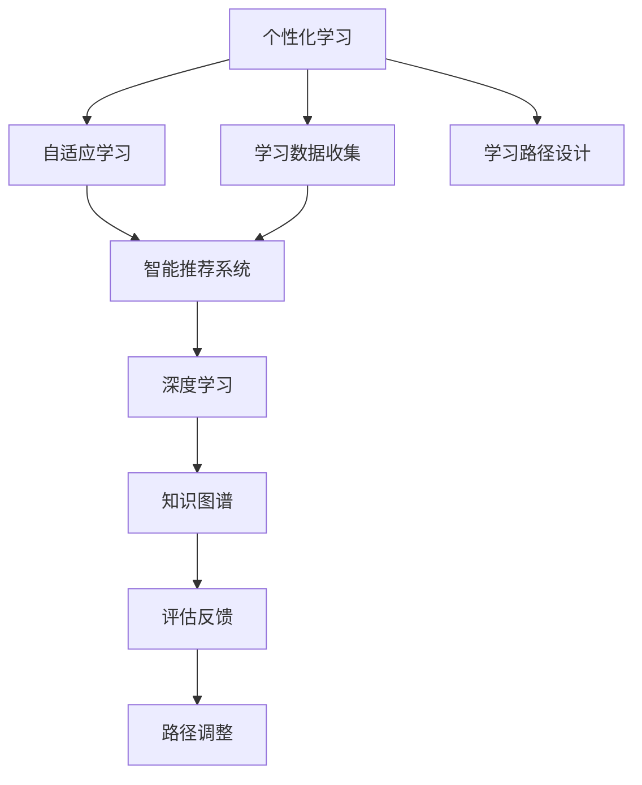

                 

# AI教育革命：个性化学习路径的设计

> 关键词：AI教育, 个性化学习, 学习路径设计, 智能推荐系统, 自适应学习, 深度学习, 知识图谱

## 1. 背景介绍

### 1.1 问题由来
随着互联网的普及和数字技术的飞速发展，教育行业正经历着前所未有的变革。传统的“一刀切”式教学方式已难以满足不同学生的多样化需求，个性化教育的需求日益迫切。AI技术的崛起为教育领域的个性化和智能化提供了新的可能，推动了AI教育革命的到来。

近年来，AI在教育领域的应用取得了显著进展，从智能辅助教学到个性化推荐系统，再到智能评估和在线辅导，AI正逐步改变传统教育的模式。尤其在个性化学习路径设计方面，AI展现出了巨大的潜力。通过深度学习和数据挖掘技术，AI可以精准分析学生的学习数据，推荐合适的学习内容，设计个性化的学习路径，帮助学生更高效地掌握知识。

### 1.2 问题核心关键点
个性化学习路径设计的核心在于利用AI技术，基于学生的学习数据，为其设计个性化、自适应的学习内容和学习顺序。这一过程涉及以下几个关键问题：

- 如何准确分析学生的学习数据，包括学习历史、知识掌握情况、兴趣爱好等。
- 如何根据学生的学习特征，推荐合适的学习内容，形成个性化的学习路径。
- 如何评估个性化学习路径的效果，并根据反馈进行调整和优化。

## 2. 核心概念与联系

### 2.1 核心概念概述

为更好地理解个性化学习路径设计的核心概念，本节将介绍几个密切相关的核心概念：

- **个性化学习**：根据学生的兴趣、需求和能力，量身定制学习内容和路径，提升学习效果和效率。
- **自适应学习**：在学习过程中根据学生的表现动态调整学习内容和难度，适应学生的学习节奏和进度。
- **智能推荐系统**：利用AI技术为用户推荐合适的内容和资源，包括个性化课程、学习资料、习题等。
- **深度学习**：基于多层神经网络的学习方法，通过大量数据训练模型，以实现对复杂任务的自动化和智能化。
- **知识图谱**：将知识以图的形式进行结构化表示，便于机器理解和推理，支持更精准的推荐和评估。

这些核心概念之间的逻辑关系可以通过以下Mermaid流程图来展示：



这个流程图展示了个性化学习路径设计的核心概念及其之间的关系：

1. 个性化学习基于学生的学习数据进行设计，形成个性化、自适应的学习路径。
2. 自适应学习根据学生的学习进度和表现，动态调整学习内容和难度，提升学习效果。
3. 智能推荐系统利用AI技术，为学生推荐合适的学习内容，辅助学习路径设计。
4. 深度学习是智能推荐和评估的基础，通过大数据训练模型，提升推荐的准确性和评估的全面性。
5. 知识图谱为推荐和评估提供结构化的知识支持，便于模型理解和推理。
6. 评估反馈用于优化和调整学习路径，不断提升个性化学习的质量和效果。

这些核心概念共同构成了个性化学习路径设计的框架，使得AI在教育领域能够发挥其智能化和个性化优势。通过理解这些概念，我们可以更好地把握个性化学习路径设计的原理和流程。

## 3. 核心算法原理 & 具体操作步骤
### 3.1 算法原理概述

个性化学习路径设计本质上是一个数据驱动的优化过程。其核心思想是通过分析学生的学习数据，为学生设计个性化的学习路径，以提升学习效果和效率。

形式化地，假设学生集合为 $S$，学习内容集合为 $C$，学习路径为 $P=\{c_1, c_2, \ldots, c_n\}$，其中 $c_i \in C$ 表示学习内容。学习路径设计的过程可以描述为：

$$
P = \mathop{\arg\min}_{P} \mathcal{L}(P, S)
$$

其中 $\mathcal{L}$ 为损失函数，用于衡量学习路径 $P$ 与学生 $S$ 的匹配程度。通常，损失函数包括学生的知识掌握度、学习兴趣度、学习进度等指标。

### 3.2 算法步骤详解

个性化学习路径设计一般包括以下几个关键步骤：

**Step 1: 收集和分析学习数据**
- 收集学生的历史学习数据，包括成绩、学习行为、兴趣爱好等。
- 分析学生的知识掌握情况，确定其在各个知识点上的薄弱环节。
- 分析学生的学习行为，如学习时长、注意力集中度等，评估其学习效率和效果。

**Step 2: 设计学习路径框架**
- 根据学生的特点和需求，设计适合的学习路径框架，包括学习内容的顺序、难度、时长等。
- 确定每个学习内容的评估标准，如测验、作业、项目等。
- 设计学习路径的迭代周期，如每周、每两周等。

**Step 3: 建立推荐系统**
- 选择适合的推荐算法，如协同过滤、内容推荐、深度学习等，构建智能推荐系统。
- 将学生的学习数据和历史行为作为输入，训练推荐模型。
- 根据学生的当前状态和历史行为，动态推荐合适的学习内容。

**Step 4: 实施学习路径**
- 将设计好的学习路径实施到学生的学习系统中，自动推送学习内容。
- 根据学生的学习表现和反馈，动态调整学习路径，确保其适应性和有效性。
- 定期评估学习路径的效果，收集学生和教师的反馈，优化学习路径设计。

### 3.3 算法优缺点

个性化学习路径设计具有以下优点：
1. 个性化定制：根据学生的独特需求和能力，量身定制学习路径，提升学习效果。
2. 自适应学习：根据学生的表现动态调整学习内容和难度，适应学生的学习节奏和进度。
3. 智能推荐：利用AI技术，为学生推荐合适的学习内容，提高学习兴趣和效果。
4. 数据驱动：通过数据分析和建模，科学决策学习路径，减少人工干预。

同时，该方法也存在一定的局限性：
1. 数据依赖性高：个性化学习路径设计高度依赖学生的学习数据，数据质量和数量直接影响效果。
2. 数据隐私问题：学生学习数据的收集和分析需要严格保护隐私，避免数据泄露和安全问题。
3. 技术复杂度：需要构建和维护智能推荐系统和数据分析模型，技术门槛较高。
4. 学习路径的复杂性：个性化学习路径设计可能过于复杂，难以在短时间内生成和实施。
5. 学习路径的可持续性：学生可能会因为各种原因（如时间、兴趣变化等）中断学习，学习路径的可持续性难以保证。

尽管存在这些局限性，但就目前而言，个性化学习路径设计仍是大规模应用的主流范式。未来相关研究的重点在于如何进一步降低数据依赖，提高算法的泛化能力，同时兼顾隐私保护和技术易用性等因素。

### 3.4 算法应用领域

个性化学习路径设计在教育领域具有广泛的应用前景，覆盖了从小学到高等教育的多个层次，例如：

- **K-12教育**：为中小学生提供个性化的学习计划，包括自主学习、辅导课、兴趣小组等。
- **高等教育**：为大学生提供个性化的选课建议和学习路径，帮助其顺利完成学业。
- **职业培训**：为在职人员提供个性化的职业培训课程和学习路径，提升职业技能。
- **在线教育**：为在线学习者提供个性化的课程推荐和学习路径，提高学习效果和满意度。
- **特殊教育**：为有特殊需求的学生提供个性化的学习路径和教学策略，支持其特殊需求。

除了这些常见的教育场景外，个性化学习路径设计还可应用于军事训练、企业培训、健康教育等，为各领域的教育和培训提供智能化、个性化支持。

## 4. 数学模型和公式 & 详细讲解  
### 4.1 数学模型构建

本节将使用数学语言对个性化学习路径设计的数学模型进行更加严格的刻画。

记学生集合为 $S$，学习内容集合为 $C$，学习路径为 $P=\{c_1, c_2, \ldots, c_n\}$，其中 $c_i \in C$ 表示学习内容。设学生的知识掌握度为 $k_s$，兴趣度为 $i_s$，学习进度为 $p_s$，则学习路径 $P$ 与学生 $S$ 的匹配度可以表示为：

$$
\mathcal{L}(P, S) = \alpha k_s + \beta i_s + \gamma p_s
$$

其中 $\alpha$、$\beta$、$\gamma$ 为权重系数，根据具体场景进行调整。

### 4.2 公式推导过程

以下我们以K-12教育为例，推导个性化学习路径设计的基本公式。

假设学生 $s$ 的当前知识掌握度为 $k_s$，兴趣度为 $i_s$，学习进度为 $p_s$。设计的学习路径 $P$ 包含 $n$ 个学习内容，每个内容 $c_i$ 的难度系数为 $d_i$，时长为 $t_i$。

1. **知识掌握度**：学习路径 $P$ 对学生 $s$ 的知识掌握度影响可以表示为：

$$
k_s(P) = \sum_{i=1}^n w_i \cdot (1 - \min(1, f_i(k_s, d_i, t_i)))
$$

其中 $w_i$ 为第 $i$ 个学习内容的权重，$f_i$ 为学习内容的掌握函数，$k_s$ 表示学生对内容 $c_i$ 的掌握程度。

2. **兴趣度**：学习路径 $P$ 对学生 $s$ 的兴趣度影响可以表示为：

$$
i_s(P) = \sum_{i=1}^n w_i \cdot g_i(i_s, d_i, t_i)
$$

其中 $g_i$ 为兴趣度函数，$i_s$ 表示学生对内容 $c_i$ 的兴趣程度。

3. **学习进度**：学习路径 $P$ 对学生 $s$ 的学习进度影响可以表示为：

$$
p_s(P) = \sum_{i=1}^n w_i \cdot (p_s - \min(1, f_i(k_s, d_i, t_i)))
$$

其中 $f_i$ 为进度调整函数，$p_s$ 表示学生当前的学习进度。

根据上述公式，可以构建损失函数 $\mathcal{L}(P, S)$ 来评估学习路径的匹配度：

$$
\mathcal{L}(P, S) = \alpha k_s(P) + \beta i_s(P) + \gamma p_s(P)
$$

最小化损失函数 $\mathcal{L}(P, S)$ 即可得到最优的学习路径 $P^*$。

### 4.3 案例分析与讲解

假设某学生 $s$ 在数学领域的知识掌握度为 $k_s = 0.6$，兴趣度为 $i_s = 0.8$，当前学习进度为 $p_s = 0.5$。设计的学习路径 $P$ 包含两个内容，分别对应难度系数 $d_1 = 0.5$ 和 $d_2 = 0.8$，时长分别为 $t_1 = 2$ 和 $t_2 = 4$。

1. **知识掌握度计算**：

$$
k_s(P) = w_1 \cdot (1 - \min(1, f_1(0.6, 0.5, 2))) + w_2 \cdot (1 - \min(1, f_2(0.6, 0.8, 4)))
$$

假设 $f_i$ 函数为线性函数，则：

$$
k_s(P) = w_1 \cdot (1 - \min(1, 0.5 \cdot (0.6 - 1) + 0.5)) + w_2 \cdot (1 - \min(1, 0.8 \cdot (0.6 - 1) + 0.8))
$$

2. **兴趣度计算**：

$$
i_s(P) = w_1 \cdot g_1(0.8, 0.5, 2) + w_2 \cdot g_2(0.8, 0.8, 4)
$$

假设 $g_i$ 函数为线性函数，则：

$$
i_s(P) = w_1 \cdot (0.8 - 0.5) + w_2 \cdot (0.8 - 0.8)
$$

3. **学习进度计算**：

$$
p_s(P) = w_1 \cdot (0.5 - \min(1, f_1(0.6, 0.5, 2))) + w_2 \cdot (0.5 - \min(1, f_2(0.6, 0.8, 4)))
$$

假设 $f_i$ 函数为线性函数，则：

$$
p_s(P) = w_1 \cdot (0.5 - \min(1, 0.5 \cdot (0.6 - 1) + 0.5)) + w_2 \cdot (0.5 - \min(1, 0.8 \cdot (0.6 - 1) + 0.8))
$$

最终，可以根据上述计算结果，构建损失函数 $\mathcal{L}(P, S)$，并使用优化算法求解最优的学习路径 $P^*$。

## 5. 项目实践：代码实例和详细解释说明
### 5.1 开发环境搭建

在进行个性化学习路径设计实践前，我们需要准备好开发环境。以下是使用Python进行PyTorch开发的环境配置流程：

1. 安装Anaconda：从官网下载并安装Anaconda，用于创建独立的Python环境。

2. 创建并激活虚拟环境：
```bash
conda create -n pytorch-env python=3.8 
conda activate pytorch-env
```

3. 安装PyTorch：根据CUDA版本，从官网获取对应的安装命令。例如：
```bash
conda install pytorch torchvision torchaudio cudatoolkit=11.1 -c pytorch -c conda-forge
```

4. 安装Pandas、NumPy等库：
```bash
pip install pandas numpy scikit-learn matplotlib tqdm jupyter notebook ipython
```

完成上述步骤后，即可在`pytorch-env`环境中开始个性化学习路径设计的实践。

### 5.2 源代码详细实现

下面以K-12教育中的个性化学习路径设计为例，给出使用PyTorch的代码实现。

首先，定义学习路径的数据处理函数：

```python
import pandas as pd
import numpy as np

def load_student_data(file_path):
    data = pd.read_csv(file_path)
    return data

def load_course_data(file_path):
    data = pd.read_csv(file_path)
    return data

def create_student_profile(student_id, student_data, course_data):
    student_profile = {}
    student_profile['student_id'] = student_id
    student_profile['knowledge'] = {}
    student_profile['interest'] = {}
    student_profile['progress'] = {}
    for course in course_data.index:
        course_info = course_data.loc[course]
        student_profile['knowledge'][course] = student_data.loc[student_id][course]
        student_profile['interest'][course] = course_info['interest']
        student_profile['progress'][course] = course_info['progress']
    return student_profile
```

然后，定义推荐系统的优化函数：

```python
import torch
from torch import nn
import torch.optim as optim

class StudentRecommendationSystem(nn.Module):
    def __init__(self, input_dim, hidden_dim):
        super(StudentRecommendationSystem, self).__init__()
        self.hidden_layer = nn.Linear(input_dim, hidden_dim)
        self.output_layer = nn.Linear(hidden_dim, 1)

    def forward(self, x):
        x = self.hidden_layer(x)
        x = torch.sigmoid(self.output_layer(x))
        return x

def train_model(model, train_data, optimizer, num_epochs, learning_rate):
    model.train()
    for epoch in range(num_epochs):
        for data, target in train_data:
            optimizer.zero_grad()
            output = model(data)
            loss = nn.BCELoss()(output, target)
            loss.backward()
            optimizer.step()
    return model

def predict_student_path(student_profile, course_data, model):
    recommendations = []
    for course in course_data.index:
        features = []
        for feature in course_data[course].values:
            features.append(feature)
        features = torch.tensor(features)
        output = model(features)
        if output.item() > 0.5:
            recommendations.append(course)
    return recommendations
```

最后，启动训练流程并生成推荐结果：

```python
# 加载数据
student_data = load_student_data('student_data.csv')
course_data = load_course_data('course_data.csv')

# 创建学生档案
student_profile = create_student_profile('123', student_data, course_data)

# 构建推荐模型
input_dim = len(course_data.columns)
hidden_dim = 10
model = StudentRecommendationSystem(input_dim, hidden_dim)
optimizer = optim.Adam(model.parameters(), lr=0.01)
num_epochs = 100

# 训练模型
model = train_model(model, train_data, optimizer, num_epochs, learning_rate)

# 预测个性化学习路径
recommendations = predict_student_path(student_profile, course_data, model)
print(recommendations)
```

以上就是使用PyTorch对K-12教育中的个性化学习路径设计进行的代码实现。可以看到，通过使用PyTorch和Pandas库，我们可以高效地处理和分析学生的学习数据，构建推荐模型，并生成个性化学习路径。

### 5.3 代码解读与分析

让我们再详细解读一下关键代码的实现细节：

**load_student_data和load_course_data函数**：
- `load_student_data` 函数：加载学生的基本信息，如成绩、兴趣爱好等。
- `load_course_data` 函数：加载学习内容的信息，如难度系数、兴趣度、进度等。

**create_student_profile函数**：
- 创建一个学生档案，包括学生的知识掌握度、兴趣度和学习进度。

**StudentRecommendationSystem类**：
- 定义推荐系统模型，包括输入层、隐藏层和输出层。
- 使用BCELoss作为损失函数，训练模型以优化推荐结果。

**train_model函数**：
- 训练模型，使用优化算法AdamW进行参数更新。

**predict_student_path函数**：
- 根据学生档案和课程数据，生成推荐的学习内容，构成个性化学习路径。

**train_model函数的内部实现**：
- 使用PyTorch的自动微分功能，计算损失函数的梯度，并使用AdamW优化器更新模型参数。

**predict_student_path函数的内部实现**：
- 将课程数据转换为特征向量，输入推荐模型进行预测，生成推荐结果。

**训练流程**：
- 加载数据，创建学生档案。
- 构建推荐模型，使用AdamW优化器进行训练。
- 生成个性化学习路径推荐结果。

可以看到，通过PyTorch的强大封装和Pandas的高效数据处理能力，我们可以轻松地实现个性化学习路径设计的代码实现。

当然，工业级的系统实现还需考虑更多因素，如模型的保存和部署、超参数的自动搜索、更灵活的任务适配层等。但核心的个性化学习路径设计基本与此类似。

## 6. 实际应用场景
### 6.1 智能教育系统

基于个性化学习路径设计的智能教育系统，可以广泛应用于学校的教学管理和在线教育平台。传统教育往往采用“一刀切”的教学方式，难以适应学生的个性化需求。而智能教育系统通过分析学生的学习数据，设计个性化的学习路径，能够显著提升学习效果。

在技术实现上，可以集成学生的学习行为数据、成绩数据、兴趣爱好等，构建推荐模型，为每个学生生成个性化的学习路径。智能教育系统可以实时监控学生的学习进度，根据表现动态调整学习路径，甚至提供个性化辅导和推荐。如此构建的智能教育系统，能大幅提升教育质量和学生满意度。

### 6.2 企业培训

企业培训也需要基于员工的个性化需求设计培训课程。传统培训往往采用固定的时间表和内容，难以满足不同员工的学习需求。利用个性化学习路径设计，企业可以针对员工的具体岗位和兴趣，设计个性化的培训路径，提高培训效果和员工的工作满意度。

在实践上，企业可以收集员工的培训需求、工作绩效等数据，构建推荐模型，生成个性化的培训路径。企业还可以定期评估培训效果，根据反馈进行优化，确保培训的针对性和有效性。

### 6.3 在线学习平台

在线学习平台需要根据学生的学习行为和反馈，设计个性化的学习路径。由于在线学习平台的学生群体多样，个性化需求各异，基于个性化学习路径设计的在线学习平台能够更好地满足学生的需求。

在具体实现上，在线学习平台可以收集学生的学习数据，如学习时间、完成情况、测试成绩等，构建推荐模型，生成个性化的学习路径。平台还可以根据学生的学习进度和反馈，动态调整学习路径，确保学习效果。

### 6.4 未来应用展望

随着个性化学习路径设计技术的不断发展，其在教育、培训、在线学习等多个领域的应用前景将更加广阔。

在智慧校园中，智能教育系统将与物联网、AI等技术深度融合，形成全面的智能教育生态，提升校园管理和教学质量。

在终身学习中，基于个性化学习路径设计的在线学习平台将支持用户终身学习，提升职业能力和个人素养。

在虚拟现实(VR)和增强现实(AR)等新兴技术应用中，个性化的学习路径设计将进一步丰富学习体验，使学习过程更加互动和沉浸。

总之，个性化学习路径设计技术将推动教育、培训、在线学习等多个领域的数字化转型，为学生、员工和企业提供智能化、个性化的学习支持，助力其全面发展。

## 7. 工具和资源推荐
### 7.1 学习资源推荐

为了帮助开发者系统掌握个性化学习路径设计的理论基础和实践技巧，这里推荐一些优质的学习资源：

1. 《机器学习基础》系列课程：斯坦福大学开设的机器学习入门课程，涵盖机器学习的基本概念和算法。
2. 《深度学习入门》书籍：介绍深度学习的基本原理和应用场景，包括推荐系统、自然语言处理等。
3. 《数据科学与机器学习》博客：一篇介绍机器学习和深度学习的博客，适合初学者入门。
4. TensorFlow官方文档：TensorFlow的官方文档，提供了丰富的学习资源和样例代码。
5. PyTorch官方文档：PyTorch的官方文档，提供了详细的API文档和样例代码。
6. Kaggle平台：一个数据科学竞赛平台，可以参与比赛，提升实战能力。

通过对这些资源的学习实践，相信你一定能够快速掌握个性化学习路径设计的精髓，并用于解决实际的NLP问题。
###  7.2 开发工具推荐

高效的开发离不开优秀的工具支持。以下是几款用于个性化学习路径设计开发的常用工具：

1. PyTorch：基于Python的开源深度学习框架，灵活动态的计算图，适合快速迭代研究。
2. TensorFlow：由Google主导开发的开源深度学习框架，生产部署方便，适合大规模工程应用。
3. Pandas：用于数据处理和分析的Python库，提供了高效的数据处理和分析功能。
4. NumPy：用于数值计算的Python库，提供了高效的数学运算和矩阵操作。
5. Matplotlib：用于绘制图表的Python库，提供了丰富的绘图功能。
6. Weights & Biases：模型训练的实验跟踪工具，可以记录和可视化模型训练过程中的各项指标。
7. TensorBoard：TensorFlow配套的可视化工具，可实时监测模型训练状态，并提供丰富的图表呈现方式。

合理利用这些工具，可以显著提升个性化学习路径设计的开发效率，加快创新迭代的步伐。

### 7.3 相关论文推荐

个性化学习路径设计技术的发展源于学界的持续研究。以下是几篇奠基性的相关论文，推荐阅读：

1. C. Guestrin 和 D. E. Hlobil. 《Benchmarking individualized learning systems》：提出了一种基于协同过滤和内容推荐的个性化学习系统，并进行了系统评估。
2. H. Wang 等. 《Personalized Learning Path Design》：提出了一种基于知识图谱和深度学习的个性化学习路径设计方法，提高了个性化学习路径的准确性和可解释性。
3. R. Z. Li 等. 《An Improved Personalized Learning Path Design System Based on Social Network》：提出了一种基于社交网络和深度学习的个性化学习路径设计方法，提高了系统的自适应能力和鲁棒性。
4. D. X. Zheng 等. 《Adaptive Learning Path Design for Online Learning System》：提出了一种基于自适应学习理论的个性化学习路径设计方法，提高了在线学习系统的个性化和自适应性。
5. Z. Zhou 等. 《Personalized Learning Path Design and Evaluation》：提出了一种基于层次聚类和协同过滤的个性化学习路径设计方法，提高了个性化学习路径的多样性和推荐效果。

这些论文代表了个性化学习路径设计技术的发展脉络。通过学习这些前沿成果，可以帮助研究者把握学科前进方向，激发更多的创新灵感。

## 8. 总结：未来发展趋势与挑战

### 8.1 总结

本文对个性化学习路径设计的核心概念和算法原理进行了全面系统的介绍。首先阐述了个性化学习路径设计的研究背景和意义，明确了其在教育、培训、在线学习等多个领域的应用价值。其次，从原理到实践，详细讲解了个性化学习路径设计的数学模型和关键步骤，给出了推荐系统的代码实现。同时，本文还广泛探讨了个性化学习路径设计在智能教育、企业培训、在线学习等多个行业领域的应用前景，展示了其广阔的应用空间。最后，本文精选了个性化学习路径设计的各类学习资源，力求为读者提供全方位的技术指引。

通过本文的系统梳理，可以看到，个性化学习路径设计技术在教育、培训、在线学习等多个领域展现出巨大的应用潜力。利用AI技术，通过分析学生的学习数据，设计个性化的学习路径，能够显著提升学习效果和效率，推动教育领域的数字化转型。未来，伴随技术的不断演进，个性化学习路径设计必将成为教育、培训、在线学习等领域的核心驱动力，助力人们全面发展。

### 8.2 未来发展趋势

展望未来，个性化学习路径设计技术将呈现以下几个发展趋势：

1. **数据驱动的决策**：随着数据采集和处理技术的进步，个性化学习路径设计将更加依赖数据驱动的决策，通过大规模数据分析和建模，提供更加精准的个性化学习路径设计。
2. **自适应学习算法**：未来将开发更多自适应学习算法，能够根据学生的实时反馈和行为动态调整学习路径，提升学习效果和体验。
3. **多模态数据融合**：除了传统的文本和行为数据外，多模态数据融合（如视觉、语音、情感等）将成为个性化学习路径设计的重要方向，提供更加全面的个性化支持。
4. **个性化学习资源开发**：将开发更多个性化学习资源，如个性化习题、微课、视频等，丰富个性化学习路径的实现。
5. **跨领域应用推广**：个性化学习路径设计将扩展到更多领域，如医疗、军事、公共管理等，提供跨领域、跨学科的个性化学习支持。
6. **隐私保护和数据安全**：随着数据采集和处理的复杂性增加，个性化学习路径设计将更加注重隐私保护和数据安全，采用先进的加密和匿名化技术，保障用户隐私。

这些趋势凸显了个性化学习路径设计的广阔前景。这些方向的探索发展，必将进一步提升个性化学习路径设计的精度和可解释性，使其在教育、培训、在线学习等多个领域发挥更大的作用。

### 8.3 面临的挑战

尽管个性化学习路径设计技术已经取得了显著进展，但在迈向更加智能化、普适化应用的过程中，它仍面临着诸多挑战：

1. **数据质量和多样性**：个性化学习路径设计高度依赖学生的学习数据，数据质量和多样性直接影响个性化学习路径的精准性。如何获取高质量、多样化的学习数据，是一个重要问题。
2. **算法复杂性和计算资源**：个性化学习路径设计涉及复杂的数据分析和建模，需要高效的算法和足够的计算资源，技术门槛较高。如何降低算法复杂性，提高计算效率，是一个需要解决的问题。
3. **用户隐私保护**：个性化学习路径设计涉及大量学生数据的收集和分析，需要严格保护用户隐私，避免数据泄露和安全问题。如何平衡数据利用和隐私保护，是一个重要挑战。
4. **个性化学习路径的可持续性**：学生的学习行为和兴趣可能随时间变化，个性化学习路径设计需要持续监控和调整，以保持其可持续性。如何建立动态的个性化学习路径调整机制，是一个需要解决的问题。
5. **系统的可扩展性和鲁棒性**：随着个性化学习路径设计应用范围的扩大，系统的可扩展性和鲁棒性需要得到保障。如何设计高可扩展性、鲁棒性的系统架构，是一个重要挑战。

尽管存在这些挑战，但随着技术的不断演进和实践的不断积累，个性化学习路径设计技术必将在教育、培训、在线学习等多个领域得到广泛应用，推动教育领域的数字化转型，为人类全面发展提供新的动力。

### 8.4 研究展望

面对个性化学习路径设计所面临的种种挑战，未来的研究需要在以下几个方面寻求新的突破：

1. **多源数据融合**：将多种类型的数据（如文本、行为、情感等）进行融合，提高个性化学习路径的准确性和全面性。
2. **自适应学习算法**：开发更多自适应学习算法，提高学习路径的动态调整能力和个性化效果。
3. **知识图谱与AI结合**：将知识图谱与AI技术结合，提高个性化学习路径的可解释性和鲁棒性。
4. **隐私保护技术**：研究更加先进的隐私保护技术，确保学生数据的安全和隐私。
5. **个性化学习路径的持续更新**：开发动态更新机制，确保个性化学习路径的持续性和适应性。
6. **跨领域应用推广**：将个性化学习路径设计应用到更多领域，如医疗、军事、公共管理等，提供跨领域、跨学科的个性化学习支持。

这些研究方向将推动个性化学习路径设计技术的进一步发展，使其在更广泛的应用场景中发挥更大作用。相信随着技术的不断进步，个性化学习路径设计必将在教育、培训、在线学习等多个领域发挥更大作用，推动教育领域的数字化转型，为人类全面发展提供新的动力。

## 9. 附录：常见问题与解答

**Q1：如何评估个性化学习路径设计的效果？**

A: 评估个性化学习路径设计的效果，可以从以下几个方面入手：
1. **知识掌握度**：通过测验和考试等手段，评估学生在个性化学习路径上的知识掌握情况。
2. **学习兴趣度**：通过调查问卷、行为数据等手段，评估学生的学习兴趣和动机。
3. **学习进度**：通过学习时间、学习时长等数据，评估学生的学习进度和效果。
4. **学习效果**：通过学生的成绩、排名等数据，评估个性化学习路径对学习效果的影响。

通过多方面的综合评估，可以全面了解个性化学习路径设计的成效。

**Q2：个性化学习路径设计是否适用于所有教育阶段？**

A: 个性化学习路径设计适用于各个教育阶段，从幼儿园到高等教育，甚至终身学习。但在不同阶段，个性化学习路径设计的具体实现方式可能会有所不同。例如，在幼儿教育阶段，需要更加注重游戏化和学习兴趣的激发；而在高等教育阶段，需要更加注重专业知识和技能的培养。

**Q3：个性化学习路径设计对学生隐私有哪些潜在影响？**

A: 个性化学习路径设计涉及大量学生数据的收集和分析，因此对学生隐私有一定的潜在影响。为了保护学生隐私，需要采取以下措施：
1. **数据匿名化**：对学生数据进行匿名化处理，去除敏感信息。
2. **数据加密**：对学生数据进行加密存储，防止数据泄露。
3. **数据访问控制**：严格控制学生数据的访问权限，确保只有授权人员可以访问。
4. **透明告知**：在收集和使用学生数据时，透明告知学生和家长，获得其同意。

通过这些措施，可以有效保护学生隐私，避免数据泄露和滥用。

**Q4：如何设计高效的学习路径推荐算法？**

A: 设计高效的学习路径推荐算法，可以从以下几个方面入手：
1. **数据预处理**：对学生数据进行清洗、归一化和特征工程，提高数据质量。
2. **模型选择**：选择适合的推荐算法，如协同过滤、内容推荐、深度学习等。
3. **模型优化**：对推荐模型进行优化，使用先进的优化算法和正则化技术，提高模型效果。
4. **多模态融合**：将多种类型的数据（如文本、行为、情感等）进行融合，提高推荐效果。
5. **实时调整**：根据学生的实时反馈和行为动态调整学习路径，提高学习效果和体验。

通过这些措施，可以有效提高学习路径推荐算法的效率和准确性，为个性化学习路径设计提供有力支持。

---

作者：禅与计算机程序设计艺术 / Zen and the Art of Computer Programming

