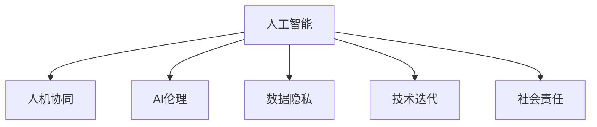

                 

# AI时代的人类参与：机会与挑战

> 关键词：人工智能,人类参与,AI伦理,社会责任,数据隐私,技术迭代,人机协同

## 1. 背景介绍

### 1.1 问题由来

随着人工智能(AI)技术的飞速发展，从语音识别、图像处理到自然语言理解、自动驾驶等各个领域，AI正迅速渗透到人类生活的方方面面。它不仅能完成重复性、高风险的工作，还能超越人类的认知和判断能力，帮助人类发现更深层次的知识和规律。然而，AI技术的发展也带来了前所未有的挑战和争议，尤其是人类在AI时代的参与地位，成为社会各界关注的焦点。

### 1.2 问题核心关键点

AI时代下的人类参与主要体现在以下几个关键点：

- **数据隐私与伦理**：AI系统需要大量数据进行训练和优化，如何保护用户数据隐私、防止数据滥用，是一个重要的伦理问题。
- **责任与问责**：AI系统可能出现故障或误判，导致严重后果，应由谁承担责任？
- **公平与偏见**：AI模型可能会因为数据偏见而输出歧视性结果，如何确保公平性？
- **安全与防御**：AI技术可能被恶意利用，如何进行安全防护？
- **就业与转型**：AI将取代部分工作岗位，如何帮助人类进行职业转型？

### 1.3 问题研究意义

研究AI时代下的人类参与，对于理解AI技术的发展趋势、推动AI技术的伦理规范和社会应用具有重要意义：

1. **规范AI技术发展**：明确AI伦理标准，避免技术滥用，确保AI技术为人类带来福祉。
2. **提升AI系统安全性**：通过伦理审查和安全防护，提升AI系统的鲁棒性和可靠性。
3. **促进公平就业**：通过职业培训和技能升级，帮助人类适应AI时代的就业环境。
4. **增强社会信任**：增强公众对AI技术的理解和信任，推动AI技术的广泛应用。

## 2. 核心概念与联系

### 2.1 核心概念概述

为更好地理解AI时代的人类参与，本节将介绍几个密切相关的核心概念：

- **人工智能**：通过算法和计算实现自动化的智能技术。它包括机器学习、深度学习、自然语言处理、计算机视觉等多个分支。
- **人机协同**：AI与人类协作完成任务，形成优势互补，增强人类认知能力和工作效率。
- **AI伦理**：研究AI技术在伦理、法律、社会等方面的规范和原则，确保AI技术符合人类的道德价值。
- **数据隐私**：保护个人信息不被未经授权的访问和滥用，确保数据安全。
- **技术迭代**：通过不断的技术改进和优化，提升AI系统的性能和可靠性。
- **社会责任**：AI开发者和应用者需要承担的社会责任，包括确保技术应用的正当性和合理性。

这些核心概念之间的逻辑关系可以通过以下Mermaid流程图来展示：



这个流程图展示了大语言模型的核心概念及其之间的关系：

1. 人工智能通过学习大量数据，具备了感知、理解和生成智能的能力。
2. 人机协同使AI与人类协作，互补各自的优势，提升完成任务的质量和效率。
3. AI伦理确保AI技术的应用符合人类的道德价值和社会规范。
4. 数据隐私保护个人信息不被滥用，确保技术应用的安全性和合法性。
5. 技术迭代使AI系统不断优化，提升性能和可靠性。
6. 社会责任要求开发者和应用者承担伦理和法律义务，确保技术应用的公平和正当。

## 3. 核心算法原理 & 具体操作步骤
### 3.1 算法原理概述

AI时代下的人类参与，本质上是一个复杂的多目标优化问题，涉及到技术、伦理、法律、社会等多个方面的考量。其主要目标是：

- **增强人类认知**：通过AI技术，增强人类的感知和理解能力，提升工作效率和决策质量。
- **促进社会公平**：确保AI技术应用中不存在偏见，保障不同群体的利益和机会。
- **保障数据安全**：保护用户数据隐私，防止数据滥用和泄露。
- **实现技术迭代**：通过不断的技术改进和优化，提升AI系统的性能和可靠性。
- **增强社会责任**：确保AI技术应用的正当性，防止技术滥用，履行社会责任。

### 3.2 算法步骤详解

AI时代下的人类参与，需要多方面协同努力，具体步骤如下：

**Step 1: 数据隐私保护**
- 收集和使用数据时，严格遵守数据隐私保护法规，确保用户知情同意。
- 采用加密、匿名化等技术手段，保护用户数据安全。
- 设立数据访问权限，限制敏感数据的访问范围。

**Step 2: AI伦理审查**
- 构建AI伦理委员会，对AI系统进行伦理审查，评估其可能带来的社会影响。
- 制定AI伦理准则，规范AI系统的开发和应用。
- 设立伦理审核机制，确保AI系统符合伦理标准。

**Step 3: 技术迭代优化**
- 通过数据积累和模型训练，不断优化AI系统的性能和鲁棒性。
- 引入最新技术，如对抗训练、强化学习等，提升AI系统适应性和灵活性。
- 定期评估和更新AI系统，确保其始终处于前沿技术水平。

**Step 4: 促进公平就业**
- 提供职业培训和技能升级，帮助人类适应AI时代的就业环境。
- 设计AI系统时，考虑公平性和可解释性，确保不产生歧视性结果。
- 通过政策引导，促进AI技术与人类就业的协同发展。

**Step 5: 社会责任履行**
- AI开发者和应用者需要承担社会责任，确保技术应用的公平性和正当性。
- 建立AI系统透明性和可解释性机制，增强公众对AI技术的理解和信任。
- 设立事故问责机制，确保AI系统出现故障或误判时有明确的责任主体。

### 3.3 算法优缺点

AI时代下的人类参与，具有以下优点：

1. **提升工作效率**：AI技术能够自动化完成重复性、高风险的任务，减少人类劳动强度。
2. **增强决策质量**：通过数据分析和模式识别，AI系统能够提供更准确、更全面的决策支持。
3. **促进公平就业**：AI技术能够创造新的工作岗位，推动人类职业转型和技能升级。
4. **提升社会福利**：AI技术在医疗、教育、交通等领域的应用，能够提升公共服务水平，改善社会福祉。

同时，也存在一些局限性：

1. **数据隐私风险**：AI系统需要大量数据进行训练和优化，存在数据泄露和滥用的风险。
2. **技术滥用问题**：AI技术可能被恶意利用，导致社会安全问题。
3. **偏见和歧视**：AI模型可能因为数据偏见而输出歧视性结果，影响社会公平。
4. **伦理和法律挑战**：AI技术在伦理和法律层面存在诸多争议和挑战。

### 3.4 算法应用领域

AI时代下的人类参与，已经在诸多领域得到应用，例如：

- **医疗健康**：通过AI技术进行疾病诊断、个性化治疗、药物研发等，提升医疗服务水平。
- **教育培训**：利用AI技术进行智能教育、个性化学习、作业批改等，提升教学质量。
- **金融服务**：通过AI技术进行风险评估、信用评分、智能投顾等，提升金融服务效率。
- **智能制造**：利用AI技术进行生产优化、质量控制、供应链管理等，提升制造业智能化水平。
- **智能交通**：通过AI技术进行交通管理、智能导航、自动驾驶等，提升交通管理效率和安全性。
- **环境保护**：利用AI技术进行环境监测、污染预测、资源管理等，推动绿色可持续发展。
- **公共安全**：通过AI技术进行视频监控、犯罪预测、紧急响应等，提升公共安全水平。

除了上述这些经典领域，AI技术还在不断拓展应用范围，为各行各业带来新的变革。随着AI技术的不断演进，相信人类参与的深度和广度将进一步提升，带来更多的社会价值和经济效益。

## 4. 数学模型和公式 & 详细讲解  
### 4.1 数学模型构建

本节将使用数学语言对AI时代的人类参与进行更加严格的刻画。

假设AI系统的目标函数为 $f(x)$，其中 $x$ 表示系统参数，包括模型结构、训练数据、伦理标准等。人类的目标是最大化社会福利函数 $g(x)$，同时最小化负面影响函数 $h(x)$。则优化目标为：

$$
\max_{x} g(x), \quad \text{s.t.} \quad \min_{x} h(x)
$$

其中 $g(x)$ 表示社会福利函数，可能包括就业率、医疗服务水平等指标；$h(x)$ 表示负面影响函数，可能包括数据泄露、技术滥用等指标。

### 4.2 公式推导过程

以医疗领域为例，假设AI系统用于疾病诊断，输入为患者症状 $s$，输出为疾病类型 $d$。则优化目标函数为：

$$
f(x) = \max_{s \in S} \min_{d \in D} (\text{精度}(s, d) - \text{误差}(s, d))
$$

其中 $\text{精度}(s, d)$ 表示AI系统对疾病诊断的精度，$\text{误差}(s, d)$ 表示系统输出与实际结果的差异。

通过构建数学模型，我们可以清晰地表达AI时代人类参与的目标和约束，为后续的技术实现和优化提供科学依据。

## 5. 项目实践：代码实例和详细解释说明
### 5.1 开发环境搭建

在进行AI时代的人类参与实践前，我们需要准备好开发环境。以下是使用Python进行PyTorch开发的环境配置流程：

1. 安装Anaconda：从官网下载并安装Anaconda，用于创建独立的Python环境。

2. 创建并激活虚拟环境：
```bash
conda create -n pytorch-env python=3.8 
conda activate pytorch-env
```

3. 安装PyTorch：根据CUDA版本，从官网获取对应的安装命令。例如：
```bash
conda install pytorch torchvision torchaudio cudatoolkit=11.1 -c pytorch -c conda-forge
```

4. 安装TensorFlow：由Google主导开发的开源深度学习框架，生产部署方便，适合大规模工程应用。同样有丰富的预训练语言模型资源。

5. 安装Transformers库：HuggingFace开发的NLP工具库，集成了众多SOTA语言模型，支持PyTorch和TensorFlow，是进行AI时代人类参与开发的利器。

6. 安装各类工具包：
```bash
pip install numpy pandas scikit-learn matplotlib tqdm jupyter notebook ipython
```

完成上述步骤后，即可在`pytorch-env`环境中开始AI时代人类参与的实践。

### 5.2 源代码详细实现

这里以智能医疗系统的开发为例，展示如何使用PyTorch实现AI时代人类参与的实践。

首先，定义医疗数据处理函数：

```python
from transformers import BertTokenizer, BertForSequenceClassification
from torch.utils.data import Dataset, DataLoader
import torch
import numpy as np

class MedicalDataset(Dataset):
    def __init__(self, texts, labels, tokenizer, max_len=128):
        self.texts = texts
        self.labels = labels
        self.tokenizer = tokenizer
        self.max_len = max_len
        
    def __len__(self):
        return len(self.texts)
    
    def __getitem__(self, item):
        text = self.texts[item]
        label = self.labels[item]
        
        encoding = self.tokenizer(text, return_tensors='pt', max_length=self.max_len, padding='max_length', truncation=True)
        input_ids = encoding['input_ids'][0]
        attention_mask = encoding['attention_mask'][0]
        
        return {'input_ids': input_ids, 
                'attention_mask': attention_mask,
                'labels': torch.tensor(label, dtype=torch.long)}
```

然后，定义模型和优化器：

```python
model = BertForSequenceClassification.from_pretrained('bert-base-cased', num_labels=2) # 假设有2个疾病类型
optimizer = AdamW(model.parameters(), lr=2e-5)
```

接着，定义训练和评估函数：

```python
device = torch.device('cuda') if torch.cuda.is_available() else torch.device('cpu')
model.to(device)

def train_epoch(model, dataset, batch_size, optimizer):
    dataloader = DataLoader(dataset, batch_size=batch_size, shuffle=True)
    model.train()
    epoch_loss = 0
    for batch in dataloader:
        input_ids = batch['input_ids'].to(device)
        attention_mask = batch['attention_mask'].to(device)
        labels = batch['labels'].to(device)
        model.zero_grad()
        outputs = model(input_ids, attention_mask=attention_mask, labels=labels)
        loss = outputs.loss
        epoch_loss += loss.item()
        loss.backward()
        optimizer.step()
    return epoch_loss / len(dataloader)

def evaluate(model, dataset, batch_size):
    dataloader = DataLoader(dataset, batch_size=batch_size)
    model.eval()
    preds, labels = [], []
    with torch.no_grad():
        for batch in dataloader:
            input_ids = batch['input_ids'].to(device)
            attention_mask = batch['attention_mask'].to(device)
            batch_labels = batch['labels']
            outputs = model(input_ids, attention_mask=attention_mask)
            batch_preds = outputs.logits.argmax(dim=2).to('cpu').tolist()
            batch_labels = batch_labels.to('cpu').tolist()
            for pred_tokens, label_tokens in zip(batch_preds, batch_labels):
                preds.append(pred_tokens[:len(label_tokens)])
                labels.append(label_tokens)
                
    print(classification_report(labels, preds))
```

最后，启动训练流程并在测试集上评估：

```python
epochs = 5
batch_size = 16

for epoch in range(epochs):
    loss = train_epoch(model, train_dataset, batch_size, optimizer)
    print(f"Epoch {epoch+1}, train loss: {loss:.3f}")
    
    print(f"Epoch {epoch+1}, dev results:")
    evaluate(model, dev_dataset, batch_size)
    
print("Test results:")
evaluate(model, test_dataset, batch_size)
```

以上就是使用PyTorch对BERT模型进行智能医疗系统开发的完整代码实现。可以看到，得益于Transformers库的强大封装，我们可以用相对简洁的代码完成BERT模型的加载和微调。

### 5.3 代码解读与分析

让我们再详细解读一下关键代码的实现细节：

**MedicalDataset类**：
- `__init__`方法：初始化文本、标签、分词器等关键组件。
- `__len__`方法：返回数据集的样本数量。
- `__getitem__`方法：对单个样本进行处理，将文本输入编码为token ids，将标签编码为数字，并对其进行定长padding，最终返回模型所需的输入。

**BertForSequenceClassification类**：
- 通过从预训练模型加载，构建具有序列分类功能的BERT模型。

**模型和优化器**：
- 选择AdamW优化器，并设置合适的学习率。

**训练和评估函数**：
- 使用PyTorch的DataLoader对数据集进行批次化加载，供模型训练和推理使用。
- 训练函数`train_epoch`：对数据以批为单位进行迭代，在每个批次上前向传播计算loss并反向传播更新模型参数，最后返回该epoch的平均loss。
- 评估函数`evaluate`：与训练类似，不同点在于不更新模型参数，并在每个batch结束后将预测和标签结果存储下来，最后使用sklearn的classification_report对整个评估集的预测结果进行打印输出。

**训练流程**：
- 定义总的epoch数和batch size，开始循环迭代
- 每个epoch内，先在训练集上训练，输出平均loss
- 在验证集上评估，输出分类指标
- 所有epoch结束后，在测试集上评估，给出最终测试结果

可以看到，PyTorch配合Transformers库使得智能医疗系统的开发变得简洁高效。开发者可以将更多精力放在数据处理、模型改进等高层逻辑上，而不必过多关注底层的实现细节。

当然，工业级的系统实现还需考虑更多因素，如模型的保存和部署、超参数的自动搜索、更灵活的任务适配层等。但核心的微调范式基本与此类似。

## 6. 实际应用场景
### 6.1 智能医疗系统

AI技术在医疗领域的应用已经相当广泛，从疾病诊断到个性化治疗，再到药物研发，AI技术正在逐步改变医疗服务的模式。在智能医疗系统中，AI系统通过对患者症状的推理和分析，帮助医生进行疾病诊断和治疗方案的制定。

例如，使用深度学习模型对患者的医学影像进行分析和诊断，相较于传统方法，能够更快速、准确地识别出异常情况，提高诊断效率和准确性。同时，通过AI技术，可以实现个性化医疗方案的制定，根据患者的病情和身体状况，生成最适合的治疗方案，提升医疗效果。

### 6.2 教育培训系统

AI技术在教育领域的应用同样不可忽视。通过AI技术，可以对学生的学习行为进行分析，个性化推荐学习资源，辅助教师进行教学管理，提高教育质量。

例如，使用自然语言处理技术对学生的作业进行智能批改，自动识别错误并提供相应的纠正建议，减轻教师负担，提高教学效率。同时，通过AI技术，可以对学生的学习过程进行跟踪和分析，及时发现学习中的问题和难点，提供针对性的辅导和支持，帮助学生更好地掌握知识。

### 6.3 智能客服系统

AI技术在客服领域的应用也日益广泛。通过智能客服系统，可以实现24小时不间断服务，快速响应客户咨询，提升客户满意度。

例如，使用自然语言处理技术对客户的咨询内容进行理解和分析，自动生成回复，减少人工客服的工作量，提高响应速度和准确性。同时，通过AI技术，可以对客户的历史咨询记录进行分析，提取常见问题和需求，提供针对性的服务，提升客户体验。

### 6.4 金融风险控制系统

AI技术在金融领域的应用同样重要。通过AI技术，可以实现风险评估、信用评分、智能投顾等功能，提升金融服务的效率和质量。

例如，使用机器学习模型对客户的信用记录和行为数据进行分析，自动评估客户的信用风险，提供个性化的贷款方案，降低金融风险。同时，通过AI技术，可以实现智能投顾功能，根据客户的风险偏好和投资目标，自动生成投资组合建议，提升投资收益。

## 7. 工具和资源推荐
### 7.1 学习资源推荐

为了帮助开发者系统掌握AI时代人类参与的理论基础和实践技巧，这里推荐一些优质的学习资源：

1. 《人工智能伦理》系列博文：由AI伦理专家撰写，深入浅出地介绍了AI伦理的基本概念和前沿问题。

2. 《数据隐私保护》课程：斯坦福大学开设的隐私保护课程，有Lecture视频和配套作业，帮助你理解数据隐私的重要性。

3. 《人机协同》书籍：介绍人机协同的基本概念和实现方法，通过理论和实践相结合的方式，帮助理解人机协作的精髓。

4. 《AI伦理与法律》书籍：详细讲解AI技术在伦理和法律层面的规范和原则，确保AI技术应用的正当性和合法性。

5. CLUE开源项目：中文语言理解测评基准，涵盖大量不同类型的中文NLP数据集，并提供了基于AI时代人类参与的baseline模型，助力中文NLP技术发展。

通过对这些资源的学习实践，相信你一定能够快速掌握AI时代人类参与的精髓，并用于解决实际的AI问题。
###  7.2 开发工具推荐

高效的开发离不开优秀的工具支持。以下是几款用于AI时代人类参与开发的常用工具：

1. PyTorch：基于Python的开源深度学习框架，灵活动态的计算图，适合快速迭代研究。大部分预训练语言模型都有PyTorch版本的实现。

2. TensorFlow：由Google主导开发的开源深度学习框架，生产部署方便，适合大规模工程应用。同样有丰富的预训练语言模型资源。

3. Transformers库：HuggingFace开发的NLP工具库，集成了众多SOTA语言模型，支持PyTorch和TensorFlow，是进行AI时代人类参与开发的利器。

4. Weights & Biases：模型训练的实验跟踪工具，可以记录和可视化模型训练过程中的各项指标，方便对比和调优。与主流深度学习框架无缝集成。

5. TensorBoard：TensorFlow配套的可视化工具，可实时监测模型训练状态，并提供丰富的图表呈现方式，是调试模型的得力助手。

6. Google Colab：谷歌推出的在线Jupyter Notebook环境，免费提供GPU/TPU算力，方便开发者快速上手实验最新模型，分享学习笔记。

合理利用这些工具，可以显著提升AI时代人类参与的开发效率，加快创新迭代的步伐。

### 7.3 相关论文推荐

AI时代人类参与的研究源于学界的持续研究。以下是几篇奠基性的相关论文，推荐阅读：

1. 《人工智能伦理》论文：由伦理学家撰写，讨论了AI技术在伦理和法律层面的规范和原则，确保AI技术应用的正当性和合法性。

2. 《数据隐私保护》论文：介绍了数据隐私保护的基本概念和前沿技术，帮助理解数据隐私的重要性。

3. 《人机协同》论文：通过理论和实践相结合的方式，介绍了人机协同的基本概念和实现方法，帮助理解人机协作的精髓。

4. 《AI伦理与法律》论文：详细讲解AI技术在伦理和法律层面的规范和原则，确保AI技术应用的正当性和合法性。

这些论文代表了大语言模型微调技术的发展脉络。通过学习这些前沿成果，可以帮助研究者把握学科前进方向，激发更多的创新灵感。

## 8. 总结：未来发展趋势与挑战

### 8.1 总结

本文对AI时代下的人类参与进行了全面系统的介绍。首先阐述了AI技术的发展背景和人类参与的重要性，明确了AI伦理、数据隐私、公平性等核心问题。其次，从原理到实践，详细讲解了AI时代人类参与的数学模型和优化方法，给出了智能医疗系统等实际应用场景的完整代码实现。同时，本文还广泛探讨了AI时代人类参与在教育、客服、金融等领域的应用前景，展示了AI技术的广阔应用空间。此外，本文精选了AI伦理、数据隐私保护等各类学习资源，力求为读者提供全方位的技术指引。

通过本文的系统梳理，可以看到，AI时代下的人类参与将成为推动AI技术发展的关键因素。AI技术与人类社会的协同合作，将在医疗、教育、金融、智能制造等多个领域带来革命性变革，为人类认知智能的进化带来深远影响。

### 8.2 未来发展趋势

展望未来，AI时代下的人类参与将呈现以下几个发展趋势：

1. **技术融合趋势**：AI技术与人类参与将更加紧密结合，形成优势互补，提升整体效能。
2. **伦理规范成熟**：随着AI技术的普及，AI伦理和法律体系将不断完善，确保AI技术应用的正当性和合法性。
3. **社会责任强化**：AI开发者和应用者将承担更多的社会责任，确保AI技术应用的公平性和安全性。
4. **数据隐私保护**：数据隐私保护将成为AI技术应用的重要保障，保护用户数据安全。
5. **技术创新加速**：AI技术的不断创新和优化，将带来更多的应用场景和解决方案。
6. **跨学科协作**：AI技术与各学科领域的深度融合，将推动跨学科创新和发展。

以上趋势凸显了AI时代下人类参与的重要性和必要性。这些方向的探索发展，将进一步推动AI技术的伦理规范和社会应用，为构建人机协同的智能时代带来更多可能性。

### 8.3 面临的挑战

尽管AI时代下的人类参与已经取得了诸多进展，但在迈向更加智能化、普适化应用的过程中，仍面临诸多挑战：

1. **数据隐私风险**：AI系统需要大量数据进行训练和优化，存在数据泄露和滥用的风险。
2. **技术滥用问题**：AI技术可能被恶意利用，导致社会安全问题。
3. **伦理和法律争议**：AI技术在伦理和法律层面存在诸多争议和挑战。
4. **公平性和偏见**：AI模型可能因为数据偏见而输出歧视性结果，影响社会公平。
5. **伦理和法律挑战**：AI技术在伦理和法律层面存在诸多争议和挑战。
6. **技术迭代不足**：现有AI技术的迭代优化不足，难以适应快速变化的技术需求。

这些挑战需要在技术、伦理、法律等多个方面共同努力，才能确保AI技术应用的正当性和合理性。

### 8.4 研究展望

面对AI时代人类参与所面临的挑战，未来的研究需要在以下几个方面寻求新的突破：

1. **数据隐私保护技术**：开发更加高效的数据隐私保护技术，确保用户数据安全。
2. **AI伦理规范体系**：构建完善的AI伦理和法律体系，确保AI技术应用的公平性和正当性。
3. **技术创新和优化**：开发更加高效、安全的AI技术，提升AI系统的性能和鲁棒性。
4. **人机协同机制**：建立更加高效、灵活的人机协同机制，确保人机协同的良好效果。
5. **跨学科合作**：加强AI技术与各学科领域的合作，推动跨学科创新和发展。

这些研究方向的探索，必将引领AI时代人类参与技术迈向更高的台阶，为构建安全、可靠、可解释、可控的智能系统铺平道路。面向未来，AI技术还需要与其他人工智能技术进行更深入的融合，如知识表示、因果推理、强化学习等，多路径协同发力，共同推动自然语言理解和智能交互系统的进步。只有勇于创新、敢于突破，才能不断拓展AI技术的边界，让智能技术更好地造福人类社会。

## 9. 附录：常见问题与解答

**Q1：AI时代人类参与是否会取代人类？**

A: AI时代人类参与旨在增强人类认知能力，提升工作效率，但并不会取代人类。人类在决策、创造性思维、社会责任等方面具有不可替代的价值。AI技术更多是作为辅助工具，帮助人类更好地完成任务，提升工作和生活质量。

**Q2：AI时代如何保护数据隐私？**

A: AI时代保护数据隐私需要多方面措施，包括：
1. 数据加密：对数据进行加密处理，防止未经授权的访问。
2. 匿名化处理：对数据进行匿名化处理，确保数据安全。
3. 访问权限控制：设立数据访问权限，限制敏感数据的访问范围。
4. 数据去标识化：通过去标识化处理，确保数据无法追溯到具体个人。

**Q3：AI时代如何确保技术公平性？**

A: AI时代确保技术公平性需要：
1. 数据多样化：使用多样化的数据进行模型训练，减少数据偏见。
2. 模型可解释性：提高模型的可解释性，确保输出结果可追溯和理解。
3. 多模型集成：通过多模型集成，减少单一模型带来的偏见和误差。
4. 公平性检测：设立公平性检测机制，对模型输出进行检测和修正。

**Q4：AI时代如何确保技术安全？**

A: AI时代确保技术安全需要：
1. 对抗训练：引入对抗训练技术，提高模型的鲁棒性和安全性。
2. 安全防护机制：设立安全防护机制，防止模型被恶意利用。
3. 应急响应：建立应急响应机制，快速应对安全威胁。

**Q5：AI时代如何实现人机协同？**

A: AI时代实现人机协同需要：
1. 任务分解：将复杂任务分解为多个子任务，发挥各自优势。
2. 交互界面设计：设计友好的交互界面，方便人机协作。
3. 反馈机制：建立反馈机制，及时调整和优化人机协作过程。
4. 协作工具：开发协作工具，促进人机协同。

这些问题的回答，可以帮助我们更好地理解AI时代下人类参与的实质和目标，为未来技术的探索和发展提供指导。

---

作者：禅与计算机程序设计艺术 / Zen and the Art of Computer Programming

