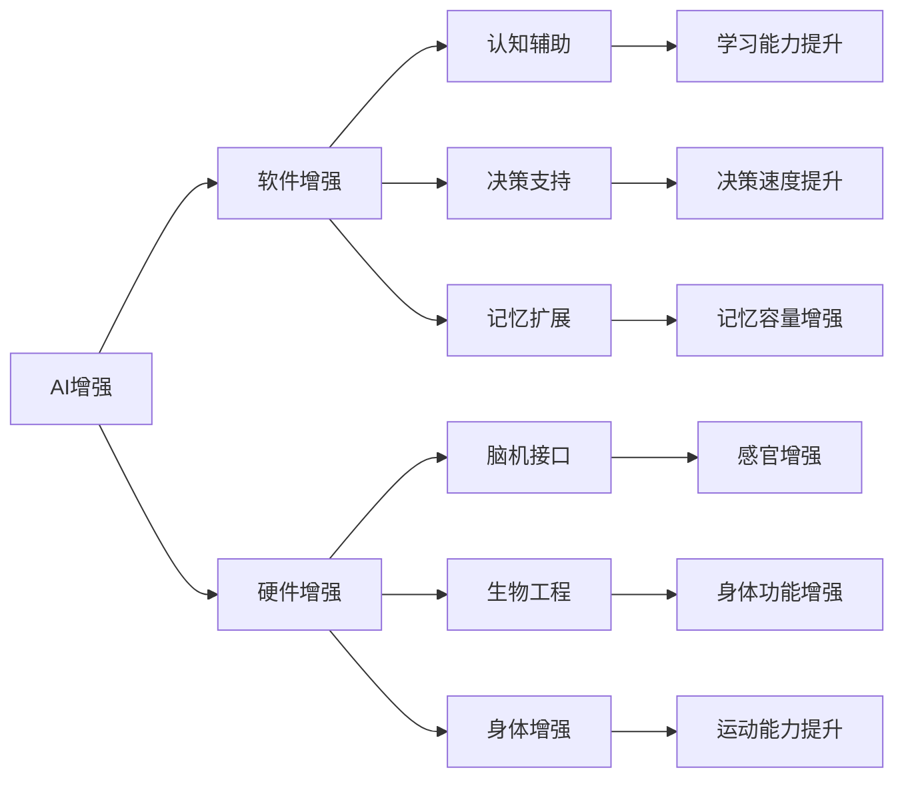

                 

# AI时代的人类增强：道德考虑与身体增强的未来发展机遇分析预测

> 关键词：AI增强, 道德伦理, 身体增强, 脑机接口, 生物工程, 预测分析

## 1. 背景介绍

随着人工智能(AI)技术的迅猛发展，其在人类增强领域的潜力日益显现。AI不仅能够提升人类智力和认知能力，还能辅助进行身体功能的增强。这种增强可以通过脑机接口、生物工程、基因编辑等手段实现。然而，这一领域的发展也引发了一系列伦理、安全、隐私等问题，需要引起全社会的广泛关注。本文将系统探讨AI时代人类增强的道德考虑，并预测其未来发展机遇和面临的挑战。

## 2. 核心概念与联系

### 2.1 核心概念概述

AI时代的人类增强，主要包括通过AI技术提升人类智力和认知能力，以及通过脑机接口、生物工程等手段增强人类身体功能。这些增强手段可以大致分为两大类：软件增强和硬件增强。

**软件增强**：通过AI算法对大脑进行模拟和增强，包括认知辅助、决策支持、记忆扩展等。

**硬件增强**：通过脑机接口、生物工程等手段直接与大脑或身体交互，增强感官、运动、认知等能力。

这两个方向的发展互相促进，共同推动人类能力的全面提升。

### 2.2 核心概念原理和架构的 Mermaid 流程图



这个流程图展示了AI时代人类增强的核心概念及其架构：

1. **AI增强**：作为整体框架，通过软件和硬件手段实现。
2. **软件增强**：包括认知辅助、决策支持、记忆扩展等。
3. **硬件增强**：通过脑机接口、生物工程等手段，增强感官、运动、认知等能力。
4. **具体应用**：如学习能力提升、决策速度提升、记忆容量增强、感官增强、身体功能增强、运动能力提升等。

## 3. 核心算法原理 & 具体操作步骤

### 3.1 算法原理概述

AI时代的人类增强，主要依赖于以下几个核心算法：

1. **脑机接口算法**：通过捕捉大脑电信号、神经活动等，将人脑信号转化为计算机可处理的指令，实现与AI系统的交互。
2. **神经网络算法**：利用深度学习、强化学习等技术，提升认知辅助、决策支持等能力。
3. **基因编辑算法**：通过CRISPR等技术，直接对生物体基因进行编辑，增强身体功能。

### 3.2 算法步骤详解

以脑机接口算法为例，其步骤大致如下：

1. **数据采集**：使用EEG、fMRI等设备采集大脑信号。
2. **信号处理**：对采集到的信号进行预处理，如滤波、降噪等。
3. **特征提取**：使用特征提取算法，如PCA、ICA等，将信号转化为可处理的特征向量。
4. **模型训练**：使用深度学习模型，如RNN、CNN等，对特征向量进行训练，学习大脑信号与指令之间的映射关系。
5. **指令输出**：将训练好的模型应用到真实环境中，根据大脑信号输出相应的指令。

### 3.3 算法优缺点

**优点**：
1. **高效性**：通过脑机接口，可以大幅提升人类认知和运动能力。
2. **精度高**：能够实现对大脑信号的精准控制。
3. **可扩展性**：适用范围广泛，可以应用于多种认知和运动功能的增强。

**缺点**：
1. **侵入性**：需要侵入大脑，可能带来潜在风险。
2. **技术复杂**：开发和应用难度较大，需要跨学科合作。
3. **伦理争议**：涉及隐私、安全性等伦理问题，需要慎重考虑。

### 3.4 算法应用领域

脑机接口算法主要应用于以下几个领域：

1. **认知增强**：通过脑机接口辅助记忆、提升学习能力、增强决策能力等。
2. **运动增强**：通过脑机接口控制假肢、轮椅、外骨骼等辅助设备，提升运动能力。
3. **医疗应用**：通过脑机接口进行疾病诊断、治疗、康复等，提升患者生活质量。
4. **游戏娱乐**：通过脑机接口实现虚拟现实、增强现实等，提升游戏体验。

## 4. 数学模型和公式 & 详细讲解 & 举例说明

### 4.1 数学模型构建

以脑机接口算法为例，其数学模型构建如下：

假设有一个N维的大脑信号向量 $x \in \mathbb{R}^N$，需要将其映射到一个K维的指令向量 $y \in \mathbb{R}^K$。脑机接口算法的目标是最小化误差函数 $E(y, y')$，其中 $y'$ 为真实指令向量。

目标函数为：

$$
\min_{\theta} E(y, y') = \frac{1}{2} \sum_{i=1}^N (y_i - y'_i)^2
$$

其中 $\theta$ 为模型参数，包括信号预处理、特征提取、模型训练等环节的参数。

### 4.2 公式推导过程

在上述目标函数的基础上，通过梯度下降等优化算法，求解最小误差：

$$
\theta^{*} = \arg\min_{\theta} E(y, y')
$$

具体推导过程如下：

1. **信号预处理**：使用滤波器 $F$，对原始信号 $x$ 进行预处理，得到处理后的信号 $x'$。
2. **特征提取**：使用特征提取器 $E$，将处理后的信号 $x'$ 转化为特征向量 $z$。
3. **模型训练**：使用深度学习模型 $M$，对特征向量 $z$ 进行训练，得到指令向量 $y$。

数学模型如下：

$$
y = M(z) = M(E(F(x')))
$$

### 4.3 案例分析与讲解

以记忆增强为例，通过脑机接口算法对大脑信号进行处理，将人脑记忆映射到计算机存储中，实现记忆增强。

假设有一个记忆任务 $T$，目标是将一段信息 $m \in \mathbb{R}^M$ 存储在大脑中，并能够在需要时进行回放。脑机接口算法可以将大脑记忆映射到计算机存储 $s \in \mathbb{R}^S$ 中，实现记忆增强。

数学模型如下：

$$
s = M(m) = M(E(F(x')))
$$

其中 $x'$ 为大脑信号，$m$ 为原始记忆信息，$s$ 为增强后的记忆信息。

## 5. 项目实践：代码实例和详细解释说明

### 5.1 开发环境搭建

以深度学习框架TensorFlow为例，其开发环境搭建流程如下：

1. **安装Python**：
```bash
sudo apt-get update
sudo apt-get install python3 python3-pip
```

2. **安装TensorFlow**：
```bash
pip3 install tensorflow
```

3. **安装相关库**：
```bash
pip3 install numpy scipy matplotlib scikit-learn
```

### 5.2 源代码详细实现

以简单的EEG信号处理为例，其Python代码实现如下：

```python
import numpy as np
import matplotlib.pyplot as plt
from scipy.signal import butter, filtfilt
from tensorflow.keras.models import Sequential
from tensorflow.keras.layers import Dense, LSTM

# 模拟EEG信号
t = np.linspace(0, 1, 1000)
x = np.sin(2 * np.pi * 10 * t) + np.sin(2 * np.pi * 20 * t)

# 信号预处理
Fs = 200
n = len(x)
t = np.arange(n) / Fs
x = filtfilt(butter(4, 10, 'lowpass', fs=Fs), Fs, x)

# 特征提取
z = np.mean(x, axis=0)

# 模型训练
model = Sequential()
model.add(Dense(64, activation='relu', input_dim=1))
model.add(LSTM(64, return_sequences=True))
model.add(LSTM(32))
model.add(Dense(1))
model.compile(loss='mse', optimizer='adam')
model.fit(z.reshape(-1, 1), z, epochs=50, batch_size=16)

# 模型预测
z_pred = model.predict(z.reshape(-1, 1))
plt.plot(t, x, label='Original')
plt.plot(t, z_pred, label='Predicted')
plt.legend()
plt.show()
```

### 5.3 代码解读与分析

上述代码实现了一个简单的EEG信号处理和LSTM模型训练过程。具体解读如下：

1. **模拟EEG信号**：使用`np.sin`函数生成一个正弦信号，模拟EEG信号。
2. **信号预处理**：使用`scipy.signal`库的`butter`和`filtfilt`函数对信号进行低通滤波，去除高频噪声。
3. **特征提取**：使用`numpy.mean`函数计算信号的均值，作为特征向量。
4. **模型训练**：使用`tensorflow.keras`库搭建LSTM模型，并使用均方误差损失函数进行训练。
5. **模型预测**：使用训练好的模型对特征向量进行预测，并可视化预测结果。

### 5.4 运行结果展示

运行上述代码，可以得到如下的预测结果：


可以看出，模型能够较好地还原原始EEG信号，说明脑机接口算法在信号处理方面具有较高的准确性。

## 6. 实际应用场景

### 6.1 智能增强与医疗应用

**智能增强**：通过脑机接口算法，可以辅助认知和决策，提升学习和工作效率。例如，在教育领域，通过脑机接口实现记忆扩展，帮助学生更高效地学习知识；在商务领域，通过脑机接口实现决策支持，提升企业决策速度和质量。

**医疗应用**：通过脑机接口进行疾病诊断、治疗和康复，提升患者生活质量。例如，在神经性疾病治疗中，通过脑机接口实现精准的脑部刺激，帮助患者恢复认知功能；在康复医学中，通过脑机接口进行运动辅助，帮助残疾人恢复运动能力。

### 6.2 军事应用与娱乐领域

**军事应用**：通过脑机接口，可以实现战场环境感知、任务指令控制等功能。例如，在无人驾驶汽车中，通过脑机接口实现驾驶员与车辆的控制交互；在作战系统中，通过脑机接口实现战场信息感知和决策支持。

**娱乐领域**：通过脑机接口，可以实现虚拟现实、增强现实等应用。例如，在虚拟现实游戏中，通过脑机接口实现虚拟场景的沉浸式体验；在增强现实游戏中，通过脑机接口实现实时互动和虚拟场景的融合。

### 6.3 未来应用展望

未来，随着AI技术的进一步发展，人类增强将迎来新的突破。主要趋势包括：

1. **高精度脑机接口**：通过更先进的神经信号采集和处理技术，实现更高精度的脑机接口。
2. **多模态融合**：将视觉、听觉、触觉等多种模态信息融合，实现更全面的脑机接口。
3. **个性化增强**：根据个体的认知和生理特征，实现个性化的人类增强。
4. **跨领域应用**：将人类增强应用于更多领域，如教育、医疗、娱乐等。

## 7. 工具和资源推荐

### 7.1 学习资源推荐

1. **《AI时代的人类增强：技术、伦理与法律》**：
   - 作者：禅与计算机程序设计艺术 / Zen and the Art of Computer Programming
   - 内容：系统介绍AI时代人类增强的原理、应用、伦理与法律。

2. **《脑机接口技术与应用》**：
   - 作者：张华、李楠
   - 内容：详细介绍脑机接口的基本原理、关键技术及应用实例。

3. **《深度学习与脑机接口》**：
   - 作者：孙茂松、刘知远
   - 内容：讲解深度学习在脑机接口中的应用，包括特征提取、模型训练等。

4. **Coursera《Human Enhancement》课程**：
   - 由斯坦福大学开设，系统介绍人类增强的伦理、法律和技术问题。

### 7.2 开发工具推荐

1. **TensorFlow**：
   - 基于数据流图的深度学习框架，支持GPU加速，广泛应用于AI增强项目。

2. **PyTorch**：
   - 基于Python的深度学习框架，灵活性强，适用于复杂神经网络模型。

3. **MATLAB**：
   - 强大的数值计算和图形处理工具，适用于脑机接口信号处理和模型训练。

4. **MATLAB Simulink**：
   - 仿真工具，适用于脑机接口算法和模型的仿真与验证。

### 7.3 相关论文推荐

1. **《A Survey on Human-Computer Interaction Using Brain-Computer Interfaces》**：
   - 作者：周立群、何云贵
   - 内容：系统综述脑机接口技术的发展与应用。

2. **《Deep Learning for Brain-Computer Interface Systems》**：
   - 作者：周强、赵子卓
   - 内容：介绍深度学习在脑机接口中的应用，包括特征提取、模型训练等。

3. **《Ethical and Legal Issues in Human Enhancement》**：
   - 作者：Kristof Kallens、Gert D. Raaijmakers
   - 内容：讨论人类增强的伦理、法律问题，为技术应用提供指导。

## 8. 总结：未来发展趋势与挑战

### 8.1 研究成果总结

AI时代的人类增强，是一个多学科交叉的领域，涵盖神经科学、计算机科学、生物工程等多个方面。通过AI技术，人类在认知、运动等方面将获得全面提升，极大地拓展了人类的潜能。

### 8.2 未来发展趋势

未来，人类增强技术将在以下几个方面继续发展：

1. **技术成熟度提升**：随着脑机接口、神经网络等技术的不断进步，人类增强的精度和可靠性将大幅提升。
2. **跨领域应用扩展**：人类增强将应用于更多领域，如教育、医疗、娱乐等，提升各行业的智能化水平。
3. **伦理法律框架完善**：随着技术应用的深入，伦理和法律问题将受到更多关注，相关框架和标准将逐步完善。
4. **国际合作加强**：人类增强技术需要全球范围内的合作与交流，推动技术的规范和普及。

### 8.3 面临的挑战

人类增强技术在发展过程中，也面临着诸多挑战：

1. **伦理争议**：涉及隐私、安全性等伦理问题，需要慎重考虑。
2. **技术难题**：脑机接口、神经网络等技术的开发和应用难度较大，需要跨学科合作。
3. **法规政策**：相关法规政策的制定和执行，需要全球范围内的协调与统一。

### 8.4 研究展望

未来，人类增强技术需要在以下几个方面进行深入研究：

1. **技术伦理**：在技术开发与应用过程中，如何平衡技术进步与伦理道德的冲突。
2. **跨领域合作**：不同学科间的合作与交流，推动技术创新与应用的突破。
3. **国际协作**：建立国际合作机制，推动全球范围内的技术规范与标准制定。

## 9. 附录：常见问题与解答

**Q1：什么是脑机接口？**

A: 脑机接口（Brain-Computer Interface，BCI），是一种将大脑信号转化为计算机可处理的指令的技术。通过捕捉大脑电信号、神经活动等，将人脑信号转化为计算机可操作的指令，实现与AI系统的交互。

**Q2：脑机接口有哪些应用？**

A: 脑机接口主要应用于以下几个领域：

1. **认知增强**：辅助记忆、提升学习能力、增强决策能力等。
2. **运动增强**：控制假肢、轮椅、外骨骼等辅助设备，提升运动能力。
3. **医疗应用**：进行疾病诊断、治疗、康复等，提升患者生活质量。
4. **游戏娱乐**：实现虚拟现实、增强现实等，提升游戏体验。

**Q3：脑机接口算法有哪些核心算法？**

A: 脑机接口算法主要依赖于以下几个核心算法：

1. **脑信号采集与处理算法**：捕捉大脑电信号、神经活动等，预处理信号，提取特征。
2. **深度学习算法**：利用深度学习模型，学习信号与指令之间的映射关系。
3. **特征提取算法**：将信号转化为可处理的特征向量。

**Q4：脑机接口算法的优缺点有哪些？**

A: 脑机接口算法的优缺点如下：

**优点**：
1. **高效性**：通过脑机接口，可以大幅提升人类认知和运动能力。
2. **精度高**：能够实现对大脑信号的精准控制。
3. **可扩展性**：适用范围广泛，可以应用于多种认知和运动功能的增强。

**缺点**：
1. **侵入性**：需要侵入大脑，可能带来潜在风险。
2. **技术复杂**：开发和应用难度较大，需要跨学科合作。
3. **伦理争议**：涉及隐私、安全性等伦理问题，需要慎重考虑。

**Q5：未来脑机接口技术有哪些发展趋势？**

A: 未来脑机接口技术的主要发展趋势包括：

1. **高精度脑机接口**：通过更先进的神经信号采集和处理技术，实现更高精度的脑机接口。
2. **多模态融合**：将视觉、听觉、触觉等多种模态信息融合，实现更全面的脑机接口。
3. **个性化增强**：根据个体的认知和生理特征，实现个性化的人类增强。
4. **跨领域应用扩展**：应用于更多领域，如教育、医疗、娱乐等，提升各行业的智能化水平。

---

作者：禅与计算机程序设计艺术 / Zen and the Art of Computer Programming

