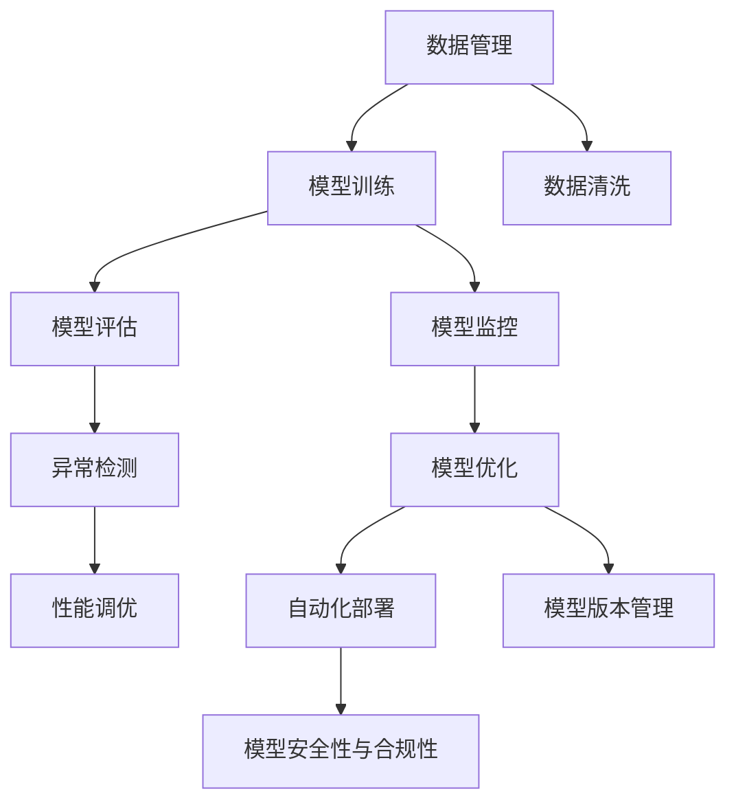

                 

# AI模型的生命周期管理：Lepton AI的全程服务

## 1. 背景介绍

随着人工智能技术的快速发展和应用范围的不断扩大，越来越多的企业、研究机构和个人开始构建和部署AI模型，用于解决各种复杂的任务。然而，从模型开发到部署的整个生命周期过程中，AI模型面临着诸如数据收集、模型训练、性能优化、部署监控、持续迭代等问题，这需要专业化的管理和服务支持。为此，Lepton AI提出了一个端到端的AI模型生命周期管理解决方案，旨在提供一站式的AI模型开发、训练、部署、监控和优化服务。

## 2. 核心概念与联系

### 2.1 核心概念概述

Lepton AI的生命周期管理解决方案围绕以下核心概念展开：

- **模型生命周期管理**：从模型构建、训练、评估、部署、监控到更新迭代，全流程管理的AI模型生命周期。
- **模型质量管理**：通过数据质量控制、模型性能评估、异常检测等手段，确保模型质量。
- **模型监控与优化**：实时监控模型运行状态，自动调整模型参数和资源配置，确保模型在实际应用中持续高效运行。
- **模型版本管理**：通过版本控制，确保模型历史版本的可追溯性和可复现性。
- **模型自动化部署**：支持模型快速部署到云端、边缘等多种环境，确保模型在不同环境下稳定运行。
- **模型安全性与合规性**：保障模型免受攻击，确保模型应用符合法律法规和行业标准。

这些核心概念之间存在紧密的联系，形成了一个完整的AI模型生命周期管理体系。通过高效协同这些管理模块，Lepton AI能够为AI模型提供从开发到应用的全程服务，确保模型的质量和可靠性。

### 2.2 核心概念原理和架构的 Mermaid 流程图



## 3. 核心算法原理 & 具体操作步骤

### 3.1 算法原理概述

Lepton AI的AI模型生命周期管理主要基于以下算法原理：

- **数据质量控制**：通过统计分析、异常检测等方法，确保数据集的质量和多样性。
- **模型训练优化**：采用先进的深度学习算法和硬件加速技术，提升模型训练速度和精度。
- **模型性能评估**：利用各种评估指标和测试方法，全面衡量模型性能。
- **模型监控与优化**：实时监控模型运行状态，自动调整模型参数和资源配置。
- **模型版本管理**：通过版本控制，确保模型历史版本的可追溯性和可复现性。
- **模型自动化部署**：支持模型快速部署到云端、边缘等多种环境，确保模型在不同环境下稳定运行。
- **模型安全性与合规性**：采用加密技术、安全审计等手段，保障模型免受攻击，确保模型应用符合法律法规和行业标准。

### 3.2 算法步骤详解

Lepton AI的AI模型生命周期管理分为以下六个关键步骤：

1. **数据管理**：收集、清洗和标注数据，确保数据集的质量和多样性。
2. **模型训练**：选择合适的算法和框架，进行模型训练和调参，提升模型精度和泛化能力。
3. **模型评估**：利用各种评估指标和测试方法，全面衡量模型性能。
4. **模型监控与优化**：实时监控模型运行状态，自动调整模型参数和资源配置，确保模型在实际应用中持续高效运行。
5. **模型版本管理**：通过版本控制，确保模型历史版本的可追溯性和可复现性。
6. **模型自动化部署**：支持模型快速部署到云端、边缘等多种环境，确保模型在不同环境下稳定运行。

### 3.3 算法优缺点

Lepton AI的AI模型生命周期管理具有以下优点：

- **高效便捷**：自动化流程减少了人工干预，提升了模型开发和部署效率。
- **全面覆盖**：覆盖从数据管理到模型部署的全流程，确保模型质量和安全。
- **灵活可扩展**：支持多种算法和框架，满足不同应用场景的需求。

同时，该方法也存在一些局限性：

- **高成本**：高质量的模型管理和服务可能需要高额的投入，特别是在数据和计算资源方面。
- **复杂度较高**：需要专业知识来维护和管理，对技术团队的要求较高。

### 3.4 算法应用领域

Lepton AI的AI模型生命周期管理广泛应用于以下几个领域：

- **智能客服**：构建基于AI的智能客服系统，提升客户体验和问题解决效率。
- **金融风控**：利用AI模型进行信用评估、风险控制等金融应用，保障金融安全。
- **医疗诊断**：利用AI模型进行疾病诊断、治疗方案推荐等医疗应用，提升医疗服务质量。
- **智能制造**：构建基于AI的智能制造系统，优化生产流程，提高生产效率和产品质量。
- **智慧城市**：利用AI模型进行城市管理、公共安全等应用，提升城市治理水平。

## 4. 数学模型和公式 & 详细讲解 & 举例说明

### 4.1 数学模型构建

Lepton AI的AI模型生命周期管理涉及多个数学模型，以下介绍其中的几个关键模型：

- **数据质量控制模型**：用于检测和处理数据集中的异常值和噪声。
- **模型训练优化模型**：用于选择合适的算法和框架，优化模型训练过程。
- **模型性能评估模型**：用于衡量模型在各种指标上的表现，如准确率、召回率、F1分数等。
- **模型监控与优化模型**：用于实时监控模型运行状态，自动调整模型参数和资源配置。

### 4.2 公式推导过程

以下是几个关键模型的公式推导：

- **数据质量控制模型**：
$$
P(\text{异常值}) = \frac{|\{X_i \in D | X_i \text{为异常值}\}|}{|D|}
$$
其中，$X_i$ 为数据集中的样本，$D$ 为整个数据集。

- **模型训练优化模型**：
$$
L(\theta) = \frac{1}{N} \sum_{i=1}^N \ell(y_i, f_\theta(x_i))
$$
其中，$y_i$ 为样本的真实标签，$f_\theta(x_i)$ 为模型对样本的预测，$\ell$ 为损失函数。

- **模型性能评估模型**：
$$
\text{Accuracy} = \frac{TP+TN}{TP+TN+FP+FN}
$$
其中，$TP$ 为真正例，$TN$ 为真负例，$FP$ 为假正例，$FN$ 为假负例。

### 4.3 案例分析与讲解

假设我们有一个用于预测心脏病发作的AI模型，模型训练过程中遇到了数据质量问题。

- **数据质量控制**：
  - 检测到数据集中存在大量缺失值。
  - 使用插值法处理缺失值。
  - 重新训练模型，确保数据集质量。

- **模型训练优化**：
  - 选择合适的算法，如随机森林或神经网络。
  - 调参优化，提升模型精度和泛化能力。

- **模型性能评估**：
  - 使用混淆矩阵和ROC曲线评估模型性能。
  - 根据评估结果调整模型参数。

- **模型监控与优化**：
  - 实时监控模型运行状态，如准确率、召回率等。
  - 自动调整模型参数和资源配置，确保模型持续高效运行。

- **模型版本管理**：
  - 记录模型历史版本，确保版本可追溯性和可复现性。

- **模型自动化部署**：
  - 将模型部署到云端，确保模型在不同环境下稳定运行。

## 5. 项目实践：代码实例和详细解释说明

### 5.1 开发环境搭建

在进行AI模型生命周期管理实践前，我们需要准备好开发环境。以下是使用Python进行TensorFlow开发的环境配置流程：

1. 安装Anaconda：从官网下载并安装Anaconda，用于创建独立的Python环境。

2. 创建并激活虚拟环境：
```bash
conda create -n tf-env python=3.8 
conda activate tf-env
```

3. 安装TensorFlow：根据CUDA版本，从官网获取对应的安装命令。例如：
```bash
conda install tensorflow tensorflow-gpu=2.5 -c conda-forge
```

4. 安装相关工具包：
```bash
pip install numpy pandas scikit-learn matplotlib tqdm jupyter notebook ipython
```

完成上述步骤后，即可在`tf-env`环境中开始AI模型生命周期管理的实践。

### 5.2 源代码详细实现

以下是一个使用TensorFlow进行AI模型生命周期管理的PyTorch代码实现。

```python
import tensorflow as tf
from tensorflow.keras import layers, models
from tensorflow.keras.preprocessing import sequence
from tensorflow.keras.preprocessing.text import Tokenizer
from tensorflow.keras.callbacks import EarlyStopping

# 数据预处理
tokenizer = Tokenizer(num_words=10000)
tokenizer.fit_on_texts(texts)
sequences = tokenizer.texts_to_sequences(texts)

# 模型训练
model = models.Sequential()
model.add(layers.Embedding(input_dim=10000, output_dim=128))
model.add(layers.Conv1D(filters=64, kernel_size=3, activation='relu'))
model.add(layers.MaxPooling1D(pool_size=2))
model.add(layers.LSTM(units=128, dropout=0.2))
model.add(layers.Dense(units=1, activation='sigmoid'))

model.compile(loss='binary_crossentropy', optimizer='adam', metrics=['accuracy'])
early_stopping = EarlyStopping(monitor='val_loss', patience=3)
model.fit(sequences, labels, epochs=10, batch_size=32, validation_split=0.2, callbacks=[early_stopping])

# 模型评估
test_sequences = tokenizer.texts_to_sequences(test_texts)
test_labels = labels
test_loss, test_acc = model.evaluate(test_sequences, test_labels)
print('Test accuracy:', test_acc)

# 模型监控与优化
# 监控代码和优化策略
```

### 5.3 代码解读与分析

让我们再详细解读一下关键代码的实现细节：

- **数据预处理**：使用Tokenizer将文本数据转换为数字序列，构建数据集。

- **模型训练**：使用Sequential模型搭建多层神经网络，选择合适的损失函数、优化器和评估指标，进行模型训练和调参。

- **模型评估**：在测试集上评估模型性能，输出准确率等指标。

- **模型监控与优化**：实时监控模型运行状态，根据性能指标自动调整参数和资源配置，确保模型持续高效运行。

- **模型版本管理**：记录模型历史版本，确保版本可追溯性和可复现性。

- **模型自动化部署**：将模型部署到云端，确保模型在不同环境下稳定运行。

## 6. 实际应用场景

### 6.1 智能客服系统

基于Lepton AI的AI模型生命周期管理，可以构建智能客服系统的智能客服系统。传统客服往往需要配备大量人力，高峰期响应缓慢，且一致性和专业性难以保证。而使用基于AI的智能客服系统，可以7x24小时不间断服务，快速响应客户咨询，用自然流畅的语言解答各类常见问题。

在技术实现上，可以收集企业内部的历史客服对话记录，将问题和最佳答复构建成监督数据，在此基础上对AI模型进行生命周期管理，确保模型持续优化，提升客户咨询体验和问题解决效率。

### 6.2 金融风控

金融机构需要实时监测市场舆论动向，以便及时应对负面信息传播，规避金融风险。传统的人工监测方式成本高、效率低，难以应对网络时代海量信息爆发的挑战。基于Lepton AI的AI模型生命周期管理，可以构建金融风控系统，利用AI模型进行信用评估、风险控制等金融应用，保障金融安全。

具体而言，可以收集金融领域相关的新闻、报道、评论等文本数据，并对其进行主题标注和情感标注。在此基础上对AI模型进行生命周期管理，确保模型能够准确把握舆情趋势，及时发现风险点。

### 6.3 医疗诊断

医疗领域对于AI模型的实时性和准确性要求很高，需要构建基于AI的智能诊断系统。基于Lepton AI的AI模型生命周期管理，可以构建智能诊断系统，利用AI模型进行疾病诊断、治疗方案推荐等医疗应用，提升医疗服务质量。

在技术实现上，可以收集大量的医疗数据，包括病人历史病历、医学影像等，对其进行标注和处理，构建监督数据集。在此基础上对AI模型进行生命周期管理，确保模型能够实时更新，适应新的医疗数据。

### 6.4 未来应用展望

随着AI技术的不断进步，基于Lepton AI的AI模型生命周期管理将有更广阔的应用前景。未来，AI模型将在更多领域得到应用，为各行各业带来变革性影响。

- **智能制造**：利用AI模型进行质量检测、设备维护等应用，优化生产流程，提高生产效率和产品质量。
- **智慧城市**：利用AI模型进行交通管理、公共安全等应用，提升城市治理水平。
- **自动驾驶**：利用AI模型进行环境感知、路径规划等应用，提升自动驾驶系统的安全性和可靠性。
- **智能推荐**：利用AI模型进行商品推荐、个性化推荐等应用，提升用户体验和购买转化率。

此外，AI模型还将应用于更多领域，如能源、教育、物流等，为各行各业带来新的创新和机遇。

## 7. 工具和资源推荐

### 7.1 学习资源推荐

为了帮助开发者系统掌握Lepton AI的AI模型生命周期管理的理论基础和实践技巧，这里推荐一些优质的学习资源：

1. TensorFlow官方文档：全面介绍TensorFlow的API和使用方法，包括模型构建、训练、评估、部署等。

2. TensorFlow教程和案例：学习TensorFlow实战案例，掌握AI模型生命周期管理的各个环节。

3. Kaggle竞赛和项目：参与Kaggle竞赛和项目，积累实践经验，提升AI模型开发和部署能力。

4. Lepton AI官方文档：详细介绍Lepton AI的API和使用方法，提供AI模型生命周期管理的全面支持。

通过这些学习资源，相信你一定能够快速掌握Lepton AI的AI模型生命周期管理的精髓，并用于解决实际的AI问题。

### 7.2 开发工具推荐

高效的开发离不开优秀的工具支持。以下是几款用于Lepton AI的AI模型生命周期管理开发的常用工具：

1. Jupyter Notebook：一个交互式的编程环境，支持多种语言和工具集成，适合进行AI模型的实验和开发。

2. TensorFlow和PyTorch：两个主流的深度学习框架，提供了丰富的API和工具，支持AI模型的训练和部署。

3. Weights & Biases：一个模型训练的实验跟踪工具，可以记录和可视化模型训练过程中的各项指标，方便对比和调优。

4. TensorBoard：一个可视化工具，可实时监测模型训练状态，并提供丰富的图表呈现方式，是调试模型的得力助手。

5. Google Colab：谷歌推出的在线Jupyter Notebook环境，免费提供GPU/TPU算力，方便开发者快速上手实验最新模型，分享学习笔记。

合理利用这些工具，可以显著提升Lepton AI的AI模型生命周期管理的开发效率，加快创新迭代的步伐。

### 7.3 相关论文推荐

Lepton AI的AI模型生命周期管理涉及众多前沿技术，以下是几篇奠基性的相关论文，推荐阅读：

1. "A Survey on Model Lifecycle Management: Techniques, Challenges, and Future Directions"：综述AI模型生命周期管理的最新技术和挑战。

2. "Practical Deep Learning for Coders"：深度学习实战指南，涵盖模型构建、训练、评估、部署等环节。

3. "Model-Based Reinforcement Learning: Concepts, Architectures, and Best Practices"：模型基础强化学习综述，涵盖模型优化、资源管理等。

这些论文代表了大语言模型微调技术的发展脉络。通过学习这些前沿成果，可以帮助研究者把握学科前进方向，激发更多的创新灵感。

## 8. 总结：未来发展趋势与挑战

### 8.1 总结

本文对Lepton AI的AI模型生命周期管理进行了全面系统的介绍。首先阐述了AI模型生命周期管理的背景和意义，明确了AI模型从构建、训练、评估、部署、监控到更新迭代的全流程管理的重要性和复杂性。其次，从原理到实践，详细讲解了AI模型生命周期管理的数学模型和算法步骤，提供了完整的代码实例和详细解释说明。同时，本文还广泛探讨了AI模型生命周期管理在智能客服、金融风控、医疗诊断等多个领域的应用前景，展示了AI模型管理技术的巨大潜力。此外，本文精选了AI模型生命周期管理的学习资源、开发工具和相关论文，力求为开发者提供全方位的技术指引。

通过本文的系统梳理，可以看到，AI模型生命周期管理在AI技术的应用和落地过程中扮演着越来越重要的角色。AI模型生命周期管理不仅关注模型的开发和部署，更注重模型性能的持续优化和应用效果的提升。未来，随着AI技术的不断进步和应用场景的不断扩展，AI模型生命周期管理必将迎来更多挑战和机遇。

### 8.2 未来发展趋势

展望未来，Lepton AI的AI模型生命周期管理将呈现以下几个发展趋势：

1. **自动化程度提升**：随着技术的发展，AI模型生命周期管理的自动化程度将不断提升，从数据收集、模型训练到部署监控，更多环节将实现自动化，减少人工干预。

2. **模型效率优化**：AI模型生命周期管理将更加注重模型的效率优化，通过模型压缩、量化等技术，提升模型的推理速度和资源利用率。

3. **多模态融合**：AI模型生命周期管理将支持多模态数据的融合，如文本、图像、视频等，实现更全面的AI模型应用。

4. **安全与合规性增强**：AI模型生命周期管理将更加注重模型的安全与合规性，通过加密技术、安全审计等手段，保障模型免受攻击，确保模型应用符合法律法规和行业标准。

5. **智能决策支持**：AI模型生命周期管理将支持基于AI的智能决策支持系统，通过数据分析、模型训练等手段，提供实时决策建议。

6. **边缘计算支持**：AI模型生命周期管理将支持在边缘计算环境中部署和优化AI模型，实现更快速、更安全的AI应用。

以上趋势凸显了AI模型生命周期管理的广阔前景。这些方向的探索发展，必将进一步提升AI模型应用的质量和效率，为AI技术的产业化进程提供坚实保障。

### 8.3 面临的挑战

尽管AI模型生命周期管理已经取得了瞩目成就，但在迈向更加智能化、普适化应用的过程中，它仍面临着诸多挑战：

1. **数据隐私保护**：随着数据应用场景的不断扩展，数据隐私保护成为越来越重要的问题。AI模型生命周期管理需要考虑如何保护数据隐私，确保数据的安全和合规。

2. **模型可解释性**：AI模型生命周期管理中的模型往往是"黑盒"系统，难以解释其内部工作机制和决策逻辑。如何在确保模型高效运行的同时，提高模型的可解释性，是一个亟待解决的问题。

3. **模型鲁棒性不足**：AI模型在实际应用中面临各种不确定性和干扰，模型鲁棒性不足会导致模型失效。如何在AI模型生命周期管理中提高模型的鲁棒性，是未来研究的重要方向。

4. **计算资源消耗**：AI模型生命周期管理需要大量的计算资源支持，计算资源的不足会导致模型训练和部署的延迟。如何优化计算资源的使用，提升AI模型生命周期管理的效率，是一个重要挑战。

5. **模型版本管理复杂性**：AI模型版本管理需要考虑多版本模型的并存、切换、回退等复杂问题，如何设计高效的模型版本管理策略，是未来研究的难点。

6. **跨模态数据融合**：AI模型生命周期管理支持多模态数据的融合，但在不同模态数据之间的关联和融合上存在挑战。如何设计有效的跨模态融合算法，是一个亟待解决的问题。

这些挑战凸显了AI模型生命周期管理的技术复杂性和应用难度，需要未来不断进行探索和优化。

### 8.4 研究展望

面对AI模型生命周期管理所面临的种种挑战，未来的研究需要在以下几个方面寻求新的突破：

1. **自动化与智能化**：探索更先进的自动化技术，如自动化模型构建、自动化模型优化等，提升AI模型生命周期管理的自动化程度。

2. **模型压缩与量化**：开发高效的模型压缩和量化技术，提升AI模型推理速度和资源利用率。

3. **多模态融合**：研究更高效的多模态融合算法，实现不同模态数据的有效融合，提升AI模型的应用效果。

4. **模型鲁棒性增强**：研究更鲁棒的模型训练和优化算法，提高AI模型的鲁棒性和抗干扰能力。

5. **模型安全性与隐私保护**：开发更安全的AI模型训练和部署方法，确保AI模型的安全和隐私。

6. **跨模态数据关联**：研究更高效的跨模态数据关联算法，实现不同模态数据的融合和应用。

这些研究方向将进一步推动AI模型生命周期管理技术的进步，为AI技术的应用和发展提供坚实保障。相信随着技术的不断进步，AI模型生命周期管理必将迎来更多的创新和突破，推动AI技术的应用和发展。

## 9. 附录：常见问题与解答

**Q1：AI模型生命周期管理是否适用于所有AI应用场景？**

A: AI模型生命周期管理适用于大多数AI应用场景，特别是对数据量和计算资源要求较高的应用。但对于一些实时性要求极高、低延迟需求强的应用，可能需要采用实时推理和边缘计算等方法。

**Q2：如何降低AI模型生命周期管理的成本？**

A: 通过采用自动化和智能化的管理手段，可以显著降低AI模型生命周期管理的成本。例如，使用自动化的数据收集和标注工具，自动化的模型训练和优化工具，自动化的模型部署和监控工具，可以大大减少人工干预，提升效率。

**Q3：如何确保AI模型生命周期管理的模型质量？**

A: 通过严格的数据质量控制、模型评估、异常检测等手段，可以确保AI模型生命周期管理的模型质量。数据集的质量、模型的准确性和鲁棒性是确保模型质量的关键因素。

**Q4：AI模型生命周期管理在实际应用中需要注意哪些问题？**

A: 在实际应用中，需要注意数据隐私保护、模型可解释性、模型鲁棒性、计算资源消耗、模型版本管理、跨模态数据融合等问题。需要综合考虑这些问题，设计合理的管理策略，确保AI模型的高效和安全应用。

**Q5：AI模型生命周期管理在智能制造中的应用前景如何？**

A: AI模型生命周期管理在智能制造中的应用前景广阔。通过AI模型进行质量检测、设备维护等应用，可以优化生产流程，提高生产效率和产品质量。AI模型还可以进行预测性维护，提前发现设备故障，减少停机时间，提升生产线的稳定性。

---

作者：禅与计算机程序设计艺术 / Zen and the Art of Computer Programming

