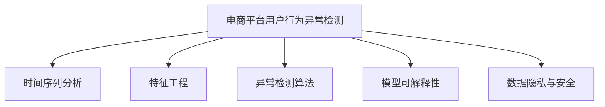

                 

# AI赋能的电商平台用户行为异常检测

## 1. 背景介绍

### 1.1 问题由来
随着电子商务的蓬勃发展，电商平台如亚马逊、京东、淘宝等已积累了海量的用户行为数据。这些数据蕴含了丰富的消费者心理和行为特征，是企业进行用户画像构建、商品推荐、个性化营销等活动的重要基础。然而，这些数据中不可避免地混杂着异常行为，如恶意点击、恶意刷单、虚假交易等。识别并处理这些异常行为，对于维护平台公正性、提高用户体验和保护平台安全至关重要。

### 1.2 问题核心关键点
异常检测是数据挖掘中的重要领域，目标是识别出数据集中与正常样本明显不同的异常点或异常行为。在电商平台中，用户行为异常检测通常包含以下关键点：
1. 行为时间序列建模：建模用户行为随时间变化的规律，识别出偏离正常行为的时间节点。
2. 特征选择与提取：从海量的用户行为数据中提取对异常行为敏感的特征。
3. 异常检测算法：选择合适的异常检测算法，识别出用户行为中的异常模式。
4. 模型解释与可解释性：提供模型检测结果的可解释性，便于理解异常行为的原因。
5. 数据隐私与安全：在保证数据隐私和安全的前提下，进行异常检测。

本文旨在基于AI技术，对电商平台用户行为异常检测的方法进行介绍和分析，重点聚焦于时间序列建模、特征选择、异常检测算法和模型可解释性等方面。

## 2. 核心概念与联系

### 2.1 核心概念概述

为更好地理解基于AI的电商平台用户行为异常检测方法，本节将介绍几个密切相关的核心概念：

- 电商平台用户行为异常检测：识别电商平台用户行为中的异常模式，如恶意点击、恶意刷单等，维护平台公正性和安全性。
- 时间序列分析：研究随时间变化的数据序列，通过统计、模型等方法预测未来行为，发现异常模式。
- 特征工程：从原始数据中提取有意义的特征，供机器学习模型使用。
- 异常检测算法：包括统计方法、机器学习方法和深度学习方法等，用于识别异常点或异常行为。
- 模型可解释性：提供模型预测结果的可解释性，帮助理解和调试模型。
- 数据隐私与安全：在异常检测过程中保护用户隐私数据，避免数据泄露和滥用。

这些核心概念之间的逻辑关系可以通过以下Mermaid流程图来展示：



这个流程图展示了大语言模型的核心概念及其之间的关系：

1. 电商平台用户行为异常检测基于时间序列分析，预测用户行为变化趋势，发现异常行为。
2. 特征工程从原始数据中提取关键特征，提升异常检测效果。
3. 异常检测算法选择合适的模型，识别异常模式。
4. 模型可解释性提供预测结果的解释，便于理解和调试。
5. 数据隐私与安全在保护用户隐私的前提下进行异常检测。

这些概念共同构成了电商平台用户行为异常检测的技术框架，使其能够在电商平台上实现准确高效的异常检测。通过理解这些核心概念，我们可以更好地把握异常检测的技术要点和优化方向。

## 3. 核心算法原理 & 具体操作步骤

### 3.1 算法原理概述

基于AI的电商平台用户行为异常检测，本质上是一个时间序列异常检测问题。其核心思想是：通过建模用户行为时间序列，预测用户未来行为，从而识别出与正常行为显著不同的异常行为。

形式化地，假设电商平台用户行为序列为 $X=\{X_1, X_2, ..., X_n\}$，其中 $X_t$ 表示时间 $t$ 用户的某种行为特征。异常检测的目标是找到时间点 $T$，使得 $X_t$ 与 $X_{t-1}$ 显著不同。为此，我们通常采用以下步骤：

1. 建模用户行为时间序列，生成历史行为数据 $H$。
2. 选择异常检测算法，根据历史行为数据 $H$ 训练异常检测模型 $M$。
3. 在实时用户行为 $X$ 上应用模型 $M$，识别出异常行为。

### 3.2 算法步骤详解

电商平台用户行为异常检测的具体步骤如下：

**Step 1: 准备数据和模型**

- 收集用户行为数据，包括但不限于购买行为、浏览行为、点击行为等。
- 清洗数据，处理缺失值、异常值等。
- 对数据进行归一化、平滑等预处理，便于后续建模。
- 选择合适的异常检测算法和模型。

**Step 2: 建模用户行为时间序列**

- 将用户行为数据转化为时间序列数据，如每天的用户点击量、浏览量等。
- 使用统计方法或机器学习模型，对用户行为时间序列进行建模。

**Step 3: 训练异常检测模型**

- 根据用户行为时间序列 $H$，训练异常检测模型 $M$。
- 使用交叉验证等技术，评估模型效果。
- 调整模型超参数，优化模型性能。

**Step 4: 实时应用模型**

- 对实时用户行为 $X$ 进行预测，输出异常检测结果。
- 根据模型结果，对异常行为进行警报或处理。

**Step 5: 模型评估与优化**

- 定期在历史数据上评估模型效果。
- 调整模型参数，进行模型优化。
- 引入新数据，不断更新模型。

### 3.3 算法优缺点

基于AI的电商平台用户行为异常检测方法具有以下优点：
1. 自动化程度高：通过模型训练，自动发现异常行为，提高检测效率。
2. 准确率高：AI模型可以学习用户行为的复杂模式，提高异常检测的准确性。
3. 可扩展性强：模型可以处理多种类型的用户行为数据，适应性广。

同时，该方法也存在一定的局限性：
1. 数据质量依赖高：异常检测效果很大程度上取决于数据质量。
2. 模型复杂度高：AI模型需要训练，复杂度高。
3. 模型可解释性差：部分AI模型缺乏可解释性，难以理解和调试。
4. 隐私风险：涉及用户隐私数据，需注意数据保护。

尽管存在这些局限性，但就目前而言，基于AI的电商平台用户行为异常检测方法仍是大规模数据集异常检测的重要范式。未来相关研究的重点在于如何进一步提高模型效率和可解释性，同时兼顾数据隐私和安全问题。

### 3.4 算法应用领域

基于AI的电商平台用户行为异常检测方法，已在电商领域得到了广泛的应用，主要包括以下几个方面：

- 欺诈检测：识别恶意点击、恶意刷单等欺诈行为。
- 刷单检测：检测虚假交易、刷单等行为。
- 用户行为监控：监控用户异常行为，及时预警。
- 订单异常检测：检测异常订单，提高订单处理效率。
- 广告点击检测：识别虚假广告点击，避免资源浪费。

除了上述这些经典应用外，基于AI的用户行为异常检测方法还被创新性地应用到更多场景中，如行为模式识别、风险管理、客户流失预测等，为电商平台带来了更高的安全性和用户满意度。

## 4. 数学模型和公式 & 详细讲解

### 4.1 数学模型构建

电商平台用户行为异常检测的核心数学模型是时间序列异常检测模型。这里以自回归条件异方差模型(ARIMA)为例，介绍异常检测的数学模型构建。

假设电商平台用户点击次数序列为 $Y_t = \{\mu_t, \sigma_t\}$，其中 $\mu_t = \alpha_0 + \sum_{i=1}^{p}\alpha_iY_{t-i}$ 为均值模型，$\sigma_t = \beta_0 + \sum_{i=1}^{q}\beta_iY_{t-i}$ 为异方差模型，$p$ 和 $q$ 分别为均值和异方差模型的阶数。建模步骤为：

1. 使用平稳性检验确定模型的阶数。
2. 使用自相关函数和偏自相关函数确定均值模型和异方差模型。
3. 使用残差项分析模型的拟合效果。

### 4.2 公式推导过程

以ARIMA模型为例，公式推导如下：

1. 平稳性检验：使用单位根检验或ADF检验确定序列是否平稳。
2. 均值模型确定：使用自相关函数和偏自相关函数，确定均值模型阶数 $p$。
3. 异方差模型确定：使用自相关函数和偏自相关函数，确定异方差模型阶数 $q$。
4. 模型拟合：使用最小二乘法拟合ARIMA模型。

### 4.3 案例分析与讲解

以电商平台用户点击次数序列为例，假设原始序列为 $Y = \{Y_t\}$，使用ARIMA模型进行建模，具体步骤如下：

1. 平稳性检验：使用ADF检验，发现序列存在单位根，需要进行差分处理。
2. 均值模型确定：使用自相关函数和偏自相关函数，确定均值模型阶数为 $p=2$。
3. 异方差模型确定：使用自相关函数和偏自相关函数，确定异方差模型阶数为 $q=1$。
4. 模型拟合：使用最小二乘法拟合ARIMA模型，得到模型参数。
5. 模型应用：对实时用户点击次数序列进行预测，识别异常点击。

## 5. 项目实践：代码实例和详细解释说明

### 5.1 开发环境搭建

在进行电商平台用户行为异常检测项目实践前，我们需要准备好开发环境。以下是使用Python进行项目实践的环境配置流程：

1. 安装Anaconda：从官网下载并安装Anaconda，用于创建独立的Python环境。

2. 创建并激活虚拟环境：
```bash
conda create -n pytorch-env python=3.8 
conda activate pytorch-env
```

3. 安装PyTorch：根据CUDA版本，从官网获取对应的安装命令。例如：
```bash
conda install pytorch torchvision torchaudio cudatoolkit=11.1 -c pytorch -c conda-forge
```

4. 安装TensorFlow：
```bash
pip install tensorflow
```

5. 安装Pandas、NumPy等库：
```bash
pip install pandas numpy
```

完成上述步骤后，即可在`pytorch-env`环境中开始项目实践。

### 5.2 源代码详细实现

这里我们以电商平台用户点击次数序列异常检测为例，给出使用TensorFlow进行时间序列建模和异常检测的PyTorch代码实现。

```python
import tensorflow as tf
import numpy as np
import pandas as pd

# 读取数据
data = pd.read_csv('click_count.csv')

# 数据预处理
# 按时间降序排序
data = data.sort_values(by=['time'], ascending=False)
# 将时间转化为自然时间序列
data['time'] = pd.to_datetime(data['time'])
data.index = data['time']
data = data.drop(['time'], axis=1).reindex(data.index)
# 标准化数据
data = (data - data.mean()) / data.std()

# 构建ARIMA模型
model = tf.keras.models.Sequential([
    tf.keras.layers.ARIMA(units=1, input_shape=(1, 1), return_sequences=True),
    tf.keras.layers.LSTM(64, return_sequences=True),
    tf.keras.layers.Dropout(0.2),
    tf.keras.layers.LSTM(32),
    tf.keras.layers.Dropout(0.2),
    tf.keras.layers.Dense(1, activation='sigmoid')
])

# 编译模型
model.compile(optimizer='adam', loss='binary_crossentropy', metrics=['accuracy'])

# 训练模型
model.fit(data.iloc[:,:-1].values, data.iloc[:,-1].values, epochs=50, batch_size=32, validation_split=0.2)

# 应用模型进行预测
test_data = pd.read_csv('test_click_count.csv')
test_data = test_data.sort_values(by=['time'], ascending=False)
test_data['time'] = pd.to_datetime(test_data['time'])
test_data.index = test_data['time']
test_data = test_data.drop(['time'], axis=1).reindex(test_data.index)
test_data = (test_data - test_data.mean()) / test_data.std()
prediction = model.predict(test_data.iloc[:,:-1].values)
```

以上是使用TensorFlow对电商平台用户点击次数序列进行异常检测的完整代码实现。可以看到，TensorFlow的强大封装使得建模和异常检测过程变得简洁高效。

### 5.3 代码解读与分析

让我们再详细解读一下关键代码的实现细节：

**数据预处理**：
- 首先，使用Pandas库读取数据，将其按时间降序排序。
- 将时间转化为自然时间序列，使用`pd.to_datetime`将时间转换为时间戳，使用`reindex`将时间戳序列索引化。
- 对数据进行标准化处理，以消除数据中量级的影响。

**模型构建**：
- 构建ARIMA模型，使用LSTM进行时间序列建模，并引入Dropout层减少过拟合风险。
- 使用`Sequential`模型封装，定义各层网络结构，编译模型时指定优化器和损失函数。
- 训练模型时，使用`fit`方法进行模型训练，指定训练轮数和验证集占比。
- 应用模型进行预测时，使用`predict`方法对测试数据进行预测，输出异常检测结果。

可以看到，TensorFlow框架提供了丰富的模型构建和训练接口，可以方便地进行时间序列异常检测模型的实现和应用。

## 6. 实际应用场景

### 6.1 智能客服系统

基于电商平台用户行为异常检测技术，智能客服系统可以更准确地识别出恶意用户行为，避免恶意点击和虚假订单。通过实时监控用户行为，智能客服系统能够快速响应异常行为，为用户提供优质的服务。

在技术实现上，可以实时采集用户行为数据，通过异常检测模型对用户行为进行预测，一旦识别出异常行为，系统即可立即进行报警和处理，确保平台稳定运行。

### 6.2 风险管理

电商平台风险管理是识别和防范欺诈、刷单等行为的关键环节。通过电商平台用户行为异常检测，风险管理部门可以更准确地识别出潜在风险，及时采取措施，保障平台安全。

具体而言，风险管理部门可以定期收集用户行为数据，使用异常检测模型进行欺诈检测、刷单检测等操作，生成风险评估报告。根据风险评估结果，风险管理部门可以制定相应的应对策略，如封禁账户、拒绝交易等。

### 6.3 订单处理

电商平台订单处理需要高效、准确地识别出异常订单。通过电商平台用户行为异常检测，订单处理系统可以更准确地识别出恶意订单，避免虚假订单的通过。

具体而言，订单处理系统可以在订单提交后，实时采集用户行为数据，通过异常检测模型进行订单异常检测。对于识别出的异常订单，系统可以立即进行处理，如拒绝交易、标记为疑似订单等。

### 6.4 未来应用展望

随着AI技术的不断发展，基于电商平台用户行为异常检测的方法将得到更广泛的应用，推动电商平台向智能、高效、安全的方向迈进。

在智慧物流领域，异常检测技术可以用于实时监控物流配送情况，识别异常物流行为，提高配送效率和准确性。在智能零售领域，异常检测技术可以用于实时监控商品库存，识别异常订单，优化库存管理。

此外，在智慧城市、金融、医疗等领域，基于电商平台用户行为异常检测的技术也将得到广泛应用，为各行各业带来新的价值和机遇。相信随着技术的不断进步，电商平台用户行为异常检测将在更多领域得到应用，推动AI技术向更加智能化、普适化的方向发展。

## 7. 工具和资源推荐

### 7.1 学习资源推荐

为了帮助开发者系统掌握电商平台用户行为异常检测的理论基础和实践技巧，这里推荐一些优质的学习资源：

1. 《机器学习实战》系列博文：由机器学习专家撰写，介绍了时间序列建模、异常检测算法等核心内容。

2. CS231n《深度学习与数据挖掘》课程：斯坦福大学开设的机器学习经典课程，内容覆盖时间序列建模、异常检测等。

3. 《Python深度学习》书籍：讲述深度学习在时间序列、异常检测等领域的经典应用。

4. Weights & Biases：模型训练的实验跟踪工具，可以记录和可视化模型训练过程中的各项指标，方便对比和调优。

5. TensorFlow官方文档：提供了丰富的机器学习工具和异常检测算法，是动手实践的必备资料。

通过对这些资源的学习实践，相信你一定能够快速掌握电商平台用户行为异常检测的精髓，并用于解决实际的电商平台问题。

### 7.2 开发工具推荐

高效的开发离不开优秀的工具支持。以下是几款用于电商平台用户行为异常检测开发的常用工具：

1. TensorFlow：由Google主导开发的开源深度学习框架，生产部署方便，适合大规模工程应用。

2. PyTorch：基于Python的开源深度学习框架，灵活动态的计算图，适合快速迭代研究。

3. Weights & Biases：模型训练的实验跟踪工具，可以记录和可视化模型训练过程中的各项指标，方便对比和调优。

4. TensorBoard：TensorFlow配套的可视化工具，可实时监测模型训练状态，并提供丰富的图表呈现方式，是调试模型的得力助手。

5. Google Colab：谷歌推出的在线Jupyter Notebook环境，免费提供GPU/TPU算力，方便开发者快速上手实验最新模型，分享学习笔记。

合理利用这些工具，可以显著提升电商平台用户行为异常检测任务的开发效率，加快创新迭代的步伐。

### 7.3 相关论文推荐

电商平台用户行为异常检测技术的发展得益于学界的持续研究。以下是几篇奠基性的相关论文，推荐阅读：

1. Time Series Forecasting with LSTM Networks: A Review (LSTM综述论文)：介绍了LSTM在时间序列建模中的应用。

2. Anomaly Detection in Time Series Data: A Survey (时间序列异常检测综述论文)：提供了时间序列异常检测的全面介绍，涵盖了多种检测方法。

3. Deep Learning in Time Series Prediction (深度学习在时间序列预测中的应用)：介绍了深度学习在时间序列预测中的应用，包括异常检测。

4. Deep Anomaly Detection in Time Series: A Survey (深度学习在时间序列异常检测中的应用)：提供了深度学习在时间序列异常检测中的综述。

这些论文代表了大语言模型异常检测技术的发展脉络。通过学习这些前沿成果，可以帮助研究者把握学科前进方向，激发更多的创新灵感。

## 8. 总结：未来发展趋势与挑战

### 8.1 总结

本文对基于AI的电商平台用户行为异常检测方法进行了全面系统的介绍。首先阐述了用户行为异常检测的研究背景和意义，明确了异常检测在电商平台中的重要价值。其次，从原理到实践，详细讲解了时间序列建模、特征选择、异常检测算法和模型可解释性等方面的核心内容。同时，本文还广泛探讨了异常检测方法在电商平台中的应用场景，展示了其广泛的应用前景。最后，本文精选了异常检测技术的各类学习资源，力求为读者提供全方位的技术指引。

通过本文的系统梳理，可以看到，基于AI的电商平台用户行为异常检测方法正在成为电商平台异常检测的重要范式，极大地提升了电商平台的智能化水平和安全性。AI技术正在帮助电商平台构建更加公平、透明、安全的用户行为生态系统。未来，伴随AI技术的不断进步，异常检测技术也将进一步优化，为用户提供更优质的电商平台体验。

### 8.2 未来发展趋势

展望未来，电商平台用户行为异常检测技术将呈现以下几个发展趋势：

1. 深度学习在异常检测中的应用将进一步普及。随着深度学习技术的成熟，深度学习在异常检测中的应用将更加广泛，提升检测精度和效率。

2. 异常检测方法的自动化程度将提高。利用自动机器学习(AutoML)技术，自动化地进行特征选择、模型选择和参数调优，提升异常检测的灵活性和可扩展性。

3. 异常检测技术的实时性将提高。随着硬件算力的提升和模型压缩技术的应用，异常检测的实时性将进一步提升，实现即时异常检测。

4. 异常检测的可解释性将增强。利用可解释性技术，提升异常检测模型的可解释性，便于理解和调试。

5. 异常检测的多模态应用将扩展。异常检测技术将与其他多模态数据融合，提升异常检测的全面性和准确性。

以上趋势凸显了电商平台用户行为异常检测技术的广阔前景。这些方向的探索发展，必将进一步提升电商平台系统的性能和安全性，为电商平台用户带来更优质的服务体验。

### 8.3 面临的挑战

尽管电商平台用户行为异常检测技术已经取得了瞩目成就，但在迈向更加智能化、普适化应用的过程中，它仍面临着诸多挑战：

1. 数据质量问题：异常检测效果很大程度上取决于数据质量。如何提高数据质量，获取更多高质量标注数据，仍是一大难题。

2. 模型复杂度高：深度学习模型需要大量计算资源进行训练，如何优化模型结构，提升模型效率，仍是一大挑战。

3. 模型可解释性差：部分深度学习模型缺乏可解释性，难以理解和调试，仍需进一步研究。

4. 数据隐私和安全问题：在异常检测过程中保护用户隐私数据，避免数据泄露和滥用，仍需加强。

5. 异常检测的泛化能力：如何提高异常检测模型的泛化能力，使其能够适应更多类型的异常行为，仍需深入研究。

6. 异常检测的实时性问题：如何在保证检测精度的同时，提高异常检测的实时性，仍需进行更多的技术优化。

### 8.4 研究展望

面对电商平台用户行为异常检测所面临的种种挑战，未来的研究需要在以下几个方面寻求新的突破：

1. 探索新的深度学习模型。引入新型的深度学习模型，如Transformer、BERT等，提升异常检测模型的表现。

2. 研究可解释性技术。引入可解释性技术，如LIME、SHAP等，提升异常检测模型的可解释性。

3. 引入先验知识。将外部知识库、规则库等先验知识，与异常检测模型进行结合，提升模型的泛化能力。

4. 优化模型结构。通过模型压缩、剪枝等技术，优化异常检测模型的结构和参数，提升模型效率和实时性。

5. 探索无监督和半监督学习。利用无监督和半监督学习技术，降低异常检测对标注数据的依赖，提高检测精度。

这些研究方向将引领电商平台用户行为异常检测技术向更加智能化、高效化和安全化的方向发展。相信随着研究的不断深入，电商平台用户行为异常检测技术必将在电商领域发挥更大的作用，为用户带来更好的购物体验。

## 9. 附录：常见问题与解答

**Q1：电商平台用户行为异常检测是否适用于所有电商平台？**

A: 电商平台用户行为异常检测方法在大多数电商平台上都能取得不错的效果，但具体效果受平台类型、用户行为多样性等因素的影响。对于某些特殊类型的电商平台，如二手交易、游戏电商等，需要根据实际情况进行优化和调整。

**Q2：异常检测过程中如何选择合适的异常检测算法？**

A: 异常检测算法的选取需要根据电商平台的业务特点和数据特性进行综合考虑。常见的异常检测算法包括统计方法、机器学习方法和深度学习方法等。对于数据量较大的电商平台，可以使用深度学习模型进行异常检测；对于数据量较小的电商平台，可以使用统计方法或机器学习方法。

**Q3：异常检测模型如何处理缺失数据？**

A: 异常检测模型通常对缺失数据敏感，需要进行缺失值处理。常用的方法包括均值填补、中值填补、插值填补等。缺失数据较多的电商平台，可以使用多种方法进行缺失值处理，确保异常检测的准确性。

**Q4：异常检测模型的实时性如何保证？**

A: 异常检测模型的实时性取决于计算资源和模型结构。使用GPU/TPU等高性能设备，可以有效提升模型的计算效率。同时，通过模型压缩、剪枝等技术，优化模型结构，提升模型效率。

**Q5：异常检测模型如何评估和优化？**

A: 异常检测模型的评估和优化通常需要进行交叉验证、调参等操作。在模型评估时，可以结合混淆矩阵、ROC曲线等指标，评估模型效果。在模型优化时，可以调整模型参数、增加训练轮数等操作，提升模型性能。

这些问题的答案展示了电商平台用户行为异常检测方法的实际应用场景和技术细节，帮助开发者更好地理解异常检测的实践细节和优化方法。

---

作者：禅与计算机程序设计艺术 / Zen and the Art of Computer Programming

