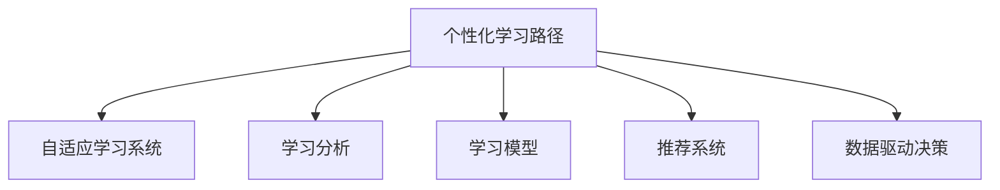
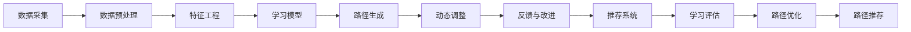

                 

# AI辅助教育：个性化学习路径设计

## 1. 背景介绍

### 1.1 问题由来
教育是个古老而又永恒的话题。随着信息化时代的到来，数字化学习工具和资源层出不穷，极大地丰富了教学方法和学习体验。然而，传统教育体系依然存在诸多不足，如“一刀切”的教学模式无法兼顾个体差异，导致学生间知识掌握程度不均衡，甚至有些学生在学习过程中感到倦怠和挫败。

AI技术的兴起，为个性化教育提供了新的可能。AI能够通过分析大量学习数据，精准捕捉每个学生的学习状态和需求，从而设计出个性化的学习路径，让学习变得更加高效和有趣。本文将介绍基于AI的个性化学习路径设计，涵盖核心概念、算法原理、具体实现以及实际应用案例，希望为教育领域的创新提供参考。

### 1.2 问题核心关键点
个性化学习路径设计旨在通过AI技术，根据学生的学习行为、成绩、兴趣等数据，自动生成个性化的学习计划。核心在于构建一个精准的学习模型，并结合学习者反馈不断优化，实现因材施教。

个性化学习路径设计的关键点包括：
- 数据采集与预处理：收集学生的学习数据，包括知识掌握程度、学习行为、兴趣偏好等，并进行数据清洗与标准化。
- 学习模型构建：建立精准的学习模型，通过机器学习或深度学习算法，分析数据并生成个性化学习路径。
- 路径生成与反馈：根据模型输出，生成个性化的学习路径，并通过学习者的反馈不断调整和优化。
- 动态调整与推荐：利用学习者反馈信息，实时调整学习路径，推荐新的学习内容和练习题目。
- 评估与改进：通过定期的评估，检验个性化学习路径的效果，并改进学习模型和路径生成算法。

## 2. 核心概念与联系

### 2.1 核心概念概述

个性化学习路径设计的核心概念如下：

- **个性化学习路径**：基于学生的个性化需求和特点，量身定制的学习路径，包括学习内容的安排、学习进度的调整、学习资源的推荐等。
- **自适应学习系统**：利用AI技术，实时监控学习者的学习状态，根据学习效果和反馈动态调整学习内容和学习方式的系统。
- **学习分析**：通过数据分析技术，识别学生的学习行为和模式，分析学习效果，为个性化路径设计提供依据。
- **学习模型**：构建数学或机器学习模型，预测学习者的学习行为和效果，生成个性化路径。
- **推荐系统**：根据学习者的兴趣和历史行为，推荐个性化学习资源和任务。
- **数据驱动决策**：基于学习数据和分析结果，做出个性化的学习决策，提升学习效果。

这些概念之间的关系如图1所示。



### 2.2 核心概念原理和架构的 Mermaid 流程图

下面给出基于个性化学习路径设计的核心概念原理和架构的 Mermaid 流程图：



这个流程图展示了个性化学习路径设计的基本流程：从数据采集到路径生成，再到动态调整和反馈改进，最终形成一套完整的个性化学习方案。

## 3. 核心算法原理 & 具体操作步骤
### 3.1 算法原理概述

个性化学习路径设计的核心算法主要基于机器学习和深度学习，通过分析学习者的行为数据和成绩，生成个性化的学习路径。其基本原理如下：

1. **数据采集与预处理**：收集学习者的学习数据，包括学习行为、成绩、兴趣偏好等，并进行数据清洗与标准化。
2. **特征提取**：从采集的数据中提取有用的特征，如学习时长、错误率、作业完成情况等。
3. **模型训练**：利用机器学习或深度学习算法，训练学习模型，预测学习者的学习效果。
4. **路径生成**：根据模型输出，生成个性化的学习路径，包括学习内容、进度和方式等。
5. **动态调整**：根据学习者的反馈和实际学习效果，实时调整学习路径，推荐新的学习内容和练习题目。
6. **评估与改进**：通过定期的评估，检验个性化学习路径的效果，并改进学习模型和路径生成算法。

### 3.2 算法步骤详解

个性化学习路径设计的具体操作步骤如下：

**Step 1: 数据采集与预处理**
- 收集学生的学习行为数据，如学习时长、完成的练习题目、成绩等。
- 对数据进行清洗和标准化，去除噪声和异常值。
- 将数据划分为训练集和测试集，进行模型训练和验证。

**Step 2: 特征提取**
- 从采集的数据中提取有用的特征，如学习时长、错误率、作业完成情况等。
- 使用特征工程技术，将原始数据转换为模型能够理解的数值型数据。

**Step 3: 模型训练**
- 选择合适的机器学习或深度学习算法，如决策树、随机森林、神经网络等。
- 使用训练集数据训练模型，优化模型参数，提高预测准确率。
- 在验证集上评估模型性能，选择最优模型进行路径生成。

**Step 4: 路径生成**
- 根据模型输出，生成个性化的学习路径。
- 路径应包括学习内容的安排、学习进度的调整、学习资源的推荐等。

**Step 5: 动态调整与反馈**
- 根据学习者的反馈和实际学习效果，实时调整学习路径。
- 利用学习者反馈信息，推荐新的学习内容和练习题目。

**Step 6: 评估与改进**
- 定期评估个性化学习路径的效果，检查学习者是否达到预期目标。
- 根据评估结果，改进学习模型和路径生成算法。

### 3.3 算法优缺点

个性化学习路径设计的优点包括：
- 提高学习效率：根据学习者特点设计个性化学习路径，提高学习效果。
- 促进学习兴趣：学习者能够根据自身兴趣选择学习内容，提高学习积极性。
- 动态调整适应性强：学习路径可以实时调整，适应学习者变化的需求。

缺点包括：
- 数据采集难度大：收集大量学习数据需要时间，且涉及隐私问题。
- 模型复杂度高：训练复杂模型需要大量的计算资源。
- 效果受数据质量影响：模型预测依赖于数据质量，数据偏差可能导致效果不佳。

### 3.4 算法应用领域

个性化学习路径设计的应用领域包括但不限于以下方面：

- **K-12教育**：根据学生的不同年级和学习需求，设计个性化学习路径，提高教学效果。
- **高等教育**：针对不同专业的学生，设计个性化学习计划，提升学术水平。
- **职业培训**：根据行业需求和学员特点，设计个性化培训路径，提升职业技能。
- **远程教育**：利用个性化学习路径设计，提升远程教育的个性化和互动性。
- **终身学习**：为成年学习者提供个性化学习路径，满足不同阶段的学习需求。

## 4. 数学模型和公式 & 详细讲解 & 举例说明

### 4.1 数学模型构建

个性化学习路径设计的数学模型主要基于预测模型，利用机器学习或深度学习算法，预测学习者的学习效果，生成个性化路径。具体数学模型如下：

**目标函数**：
$$
\min_{\theta} \frac{1}{N} \sum_{i=1}^N ||y_i - f(x_i; \theta)||^2
$$

其中，$y_i$ 为实际学习效果，$f(x_i; \theta)$ 为模型预测的学习效果，$\theta$ 为模型参数。

**损失函数**：
$$
L(y, f(x; \theta)) = \frac{1}{2}(y - f(x; \theta))^2
$$

目标函数和损失函数的含义是将预测值与实际值之间的差异最小化。

**学习模型**：
- **线性回归**：用于简单的学习任务，预测学习效果。
- **决策树**：用于复杂的分类问题，预测学习者是否掌握某项知识。
- **随机森林**：用于处理高维数据，提升模型准确率。
- **神经网络**：用于处理非线性关系，提升预测效果。

### 4.2 公式推导过程

以线性回归为例，推导其公式。假设输入特征为 $x_i = [x_{i1}, x_{i2}, ..., x_{in}]$，输出为 $y_i$，模型参数为 $\theta = [\theta_0, \theta_1, ..., \theta_n]$，则线性回归的公式为：

$$
y_i = \theta_0 + \sum_{j=1}^n \theta_j x_{ij}
$$

其损失函数为：

$$
L(y, f(x; \theta)) = \frac{1}{2N} \sum_{i=1}^N (y_i - (\theta_0 + \sum_{j=1}^n \theta_j x_{ij}))^2
$$

求偏导数，得：

$$
\frac{\partial L}{\partial \theta_j} = -\frac{1}{N} \sum_{i=1}^N (y_i - f(x_i; \theta)) x_{ij}
$$

根据上述偏导数，利用梯度下降法或随机梯度下降法，更新模型参数 $\theta$。

### 4.3 案例分析与讲解

假设某学生学习编程课程，我们希望设计一条个性化的学习路径。通过数据采集，收集学生每节课的学习时长、完成的练习题目、测试成绩等数据，进行预处理和特征提取。使用随机森林模型，预测学生是否掌握了某项编程知识。根据模型输出，生成个性化的学习路径，包括学习内容的安排、学习进度的调整等。

在实际应用中，可以实时收集学生的反馈和实际学习效果，动态调整学习路径，推荐新的学习内容和练习题目。通过定期评估，检验学习路径的效果，并改进学习模型和路径生成算法，不断提高个性化学习路径的精准度。

## 5. 项目实践：代码实例和详细解释说明
### 5.1 开发环境搭建

在进行个性化学习路径设计项目开发前，我们需要准备好开发环境。以下是使用Python进行PyTorch开发的环境配置流程：

1. 安装Anaconda：从官网下载并安装Anaconda，用于创建独立的Python环境。

2. 创建并激活虚拟环境：
```bash
conda create -n pytorch-env python=3.8 
conda activate pytorch-env
```

3. 安装PyTorch：根据CUDA版本，从官网获取对应的安装命令。例如：
```bash
conda install pytorch torchvision torchaudio cudatoolkit=11.1 -c pytorch -c conda-forge
```

4. 安装相关的第三方库：
```bash
pip install pandas numpy matplotlib scikit-learn
```

完成上述步骤后，即可在`pytorch-env`环境中开始开发。

### 5.2 源代码详细实现

下面是使用PyTorch进行线性回归模型的源代码实现：

```python
import torch
import torch.nn as nn
import torch.optim as optim
import pandas as pd
import numpy as np

# 读取数据
data = pd.read_csv('student_learning.csv')
X = data[['study_time', 'test_score', 'practice_score']]
y = data['pass_test']

# 标准化数据
X_mean = X.mean()
X_std = X.std()
X = (X - X_mean) / X_std

# 划分训练集和测试集
train_X = X.iloc[:800]
train_y = y.iloc[:800]
test_X = X.iloc[800:]
test_y = y.iloc[800:]

# 定义模型
class LinearRegression(nn.Module):
    def __init__(self, input_dim, output_dim):
        super(LinearRegression, self).__init__()
        self.linear = nn.Linear(input_dim, output_dim)

    def forward(self, x):
        return self.linear(x)

# 定义损失函数和优化器
model = LinearRegression(input_dim=X.shape[1], output_dim=1)
criterion = nn.MSELoss()
optimizer = optim.SGD(model.parameters(), lr=0.01)

# 训练模型
for epoch in range(1000):
    optimizer.zero_grad()
    y_pred = model(train_X)
    loss = criterion(y_pred, train_y)
    loss.backward()
    optimizer.step()
    if epoch % 100 == 0:
        print(f"Epoch {epoch+1}, Loss: {loss:.4f}")

# 评估模型
model.eval()
y_pred = model(test_X)
test_loss = criterion(y_pred, test_y)
print(f"Test Loss: {test_loss:.4f}")
```

在上述代码中，我们使用了PyTorch构建了一个简单的线性回归模型，对学生学习数据进行了预测。通过训练和测试，评估了模型的预测效果。

### 5.3 代码解读与分析

让我们再详细解读一下关键代码的实现细节：

**数据处理**：
- 使用pandas读取数据，将数据集划分为特征矩阵 $X$ 和目标向量 $y$。
- 对数据进行标准化，防止不同特征之间的量纲差异影响模型训练效果。

**模型定义**：
- 定义一个简单的线性回归模型，包含一个线性层。
- 在训练过程中，使用SGD优化器更新模型参数。

**训练过程**：
- 在每个epoch内，对训练数据进行前向传播和反向传播，计算损失函数。
- 使用梯度下降法更新模型参数。
- 每100个epoch打印一次损失值，监控模型训练效果。

**模型评估**：
- 使用测试集数据进行前向传播，计算模型在测试集上的损失值。
- 输出测试集上的损失值，评估模型性能。

## 6. 实际应用场景

### 6.1 智能教室

智能教室系统可以通过个性化学习路径设计，提升课堂教学效果。教师可以通过智能设备收集学生的学习行为数据，如学习时长、作业完成情况等，利用AI技术生成个性化的学习路径。智能教室系统根据每个学生的学习状态，实时调整教学内容和进度，推荐适合的学习资源和练习题目。这样，学生可以更高效地掌握知识，教师也可以更精准地指导学生。

### 6.2 在线学习平台

在线学习平台可以利用个性化学习路径设计，提升学习体验。平台可以通过学生的在线学习数据，如课程观看时间、作业提交情况等，生成个性化的学习路径。平台还可以根据学习者的反馈，动态调整学习路径，推荐新的学习内容和资源。这样，学生可以更灵活地安排学习计划，提升学习效果。

### 6.3 职业培训

职业培训机构可以利用个性化学习路径设计，提升培训效果。培训机构可以通过学生的培训数据，如课程完成情况、实践操作情况等，生成个性化的学习路径。培训机构还可以根据学习者的反馈，动态调整学习路径，推荐新的培训内容和资源。这样，学员可以更灵活地学习新技能，提升职业竞争力。

### 6.4 未来应用展望

随着AI技术的不断进步，个性化学习路径设计将迎来更多的应用场景。以下是一些未来展望：

1. **终身学习**：利用个性化学习路径设计，为成人学习者提供灵活的学习计划，满足不同阶段的学习需求。
2. **跨领域学习**：通过跨领域知识融合，生成跨领域的个性化学习路径，提升多学科学习能力。
3. **虚拟现实**：利用虚拟现实技术，构建沉浸式的学习环境，提升学习效果。
4. **情感识别**：利用情感识别技术，根据学习者的情感状态调整学习路径，提升学习体验。
5. **自适应教育游戏**：利用游戏化的学习方式，提升学习兴趣和动力。

## 7. 工具和资源推荐

### 7.1 学习资源推荐

为了帮助开发者系统掌握个性化学习路径设计的理论基础和实践技巧，这里推荐一些优质的学习资源：

1. **《机器学习》课程**：由斯坦福大学Andrew Ng教授讲授，涵盖了机器学习的基础理论和算法，适合初学者学习。
2. **《深度学习》课程**：由Goodfellow等著，详细介绍了深度学习的理论和实践，适合进阶学习。
3. **Kaggle竞赛**：Kaggle上有很多机器学习和深度学习竞赛，通过实践积累经验。
4. **论文阅读**：阅读最新的机器学习和深度学习论文，了解最新的研究进展。
5. **GitHub代码**：GitHub上有很多优秀的机器学习和深度学习项目，可以参考和借鉴。

### 7.2 开发工具推荐

高效的工具是开发个性化学习路径设计的必备条件。以下是几款推荐的开发工具：

1. **PyTorch**：基于Python的开源深度学习框架，灵活动态的计算图，适合快速迭代研究。
2. **TensorFlow**：由Google主导开发的开源深度学习框架，生产部署方便，适合大规模工程应用。
3. **Keras**：高层次的深度学习框架，简单易用，适合快速原型开发。
4. **Jupyter Notebook**：交互式的数据科学开发环境，适合开发和测试模型。
5. **Git**：版本控制系统，方便团队协作和代码管理。

### 7.3 相关论文推荐

个性化学习路径设计的研究源于学界的持续探索。以下是几篇奠基性的相关论文，推荐阅读：

1. **Adaptive Learning Pathways**：介绍了一种基于人工智能的个性化学习路径设计方法，通过自适应算法生成个性化路径。
2. **Learning Analytics**：讨论了学习分析技术在个性化学习路径设计中的应用，提高了学习效果和效率。
3. **Deep Learning for Personalized Education**：利用深度学习技术，设计个性化学习路径，提升学习效果。
4. **Recommender Systems for Personalized Learning**：介绍了一种基于推荐系统的个性化学习路径设计方法，提升了学习资源的推荐效果。
5. **Evaluation of Personalized Learning Pathways**：讨论了个性化学习路径设计的评估方法，提高了评估的准确性和可靠性。

## 8. 总结：未来发展趋势与挑战

### 8.1 研究成果总结

本文介绍了基于AI的个性化学习路径设计，涵盖核心概念、算法原理和操作步骤。具体内容包括：

1. 数据采集与预处理：收集学习者的学习行为数据，进行数据清洗和标准化。
2. 特征提取：从采集的数据中提取有用的特征，如学习时长、错误率、作业完成情况等。
3. 模型训练：使用机器学习或深度学习算法，训练学习模型，预测学习效果。
4. 路径生成：根据模型输出，生成个性化的学习路径。
5. 动态调整与反馈：根据学习者的反馈和实际学习效果，实时调整学习路径。
6. 评估与改进：定期评估个性化学习路径的效果，改进学习模型和路径生成算法。

通过系统梳理，本文展示了个性化学习路径设计的全流程，并提供了代码实例和解释分析。

### 8.2 未来发展趋势

展望未来，个性化学习路径设计将呈现以下几个发展趋势：

1. **数据自动化采集**：利用传感器、智能设备等技术，自动化采集学生的学习行为数据。
2. **多模态融合**：结合视觉、听觉等多模态数据，提升学习路径设计的精准度。
3. **实时反馈与调整**：利用实时反馈系统，及时调整学习路径，提高学习效果。
4. **自适应学习系统**：基于学习者的实时反馈，动态调整学习内容和方式，提高学习效果。
5. **跨领域学习**：通过跨领域知识融合，生成跨领域的个性化学习路径，提升多学科学习能力。

### 8.3 面临的挑战

尽管个性化学习路径设计已经取得了一定的进展，但仍面临诸多挑战：

1. **数据隐私与安全**：采集学习数据需要考虑隐私问题，确保数据安全。
2. **模型复杂度**：训练复杂模型需要大量的计算资源和时间，提高模型的计算效率。
3. **效果评估**：评估个性化学习路径的效果需要定义合适的评估指标，提高评估的可靠性。
4. **跨平台兼容性**：个性化学习路径设计需要跨平台兼容性，适应不同设备和环境。

### 8.4 研究展望

未来，个性化学习路径设计需要更多研究探索：

1. **数据自动化采集与处理**：利用智能设备和传感器，自动化采集学习数据，提高数据采集效率。
2. **多模态学习路径设计**：结合视觉、听觉等多模态数据，提升学习路径设计的精准度。
3. **实时反馈与自适应学习**：利用实时反馈系统，及时调整学习路径，提高学习效果。
4. **跨领域学习路径设计**：通过跨领域知识融合，生成跨领域的个性化学习路径，提升多学科学习能力。
5. **可解释性与透明度**：提高模型的可解释性和透明度，增强用户对学习路径的信任和理解。

通过持续的研究和创新，个性化学习路径设计将不断优化和进步，为教育领域带来更多突破。

## 9. 附录：常见问题与解答

**Q1：个性化学习路径设计是否适用于所有学生？**

A: 个性化学习路径设计适用于大部分学生，但需要注意个体差异。对于有特殊需求的学生，需要额外的关注和支持。

**Q2：如何处理学习者的反馈信息？**

A: 学习者的反馈信息是调整学习路径的重要依据。可以通过问卷调查、在线反馈等方式收集反馈信息，并利用自然语言处理技术进行情感分析，提取有用信息。

**Q3：个性化学习路径设计的局限性是什么？**

A: 个性化学习路径设计的局限性包括：数据采集难度大、模型复杂度高、效果受数据质量影响等。解决这些局限性需要技术创新和持续优化。

**Q4：如何提高个性化学习路径设计的可解释性？**

A: 可以通过模型简化、特征可视化、决策树解释等方法，提高个性化学习路径设计的可解释性。同时，通过多模态融合，增强学习路径的可解释性和透明度。

**Q5：个性化学习路径设计的未来发展方向是什么？**

A: 未来发展方向包括：数据自动化采集、多模态融合、实时反馈与自适应学习、跨领域学习路径设计等。这些方向将进一步提升个性化学习路径设计的精准度和适用性。

---

作者：禅与计算机程序设计艺术 / Zen and the Art of Computer Programming

