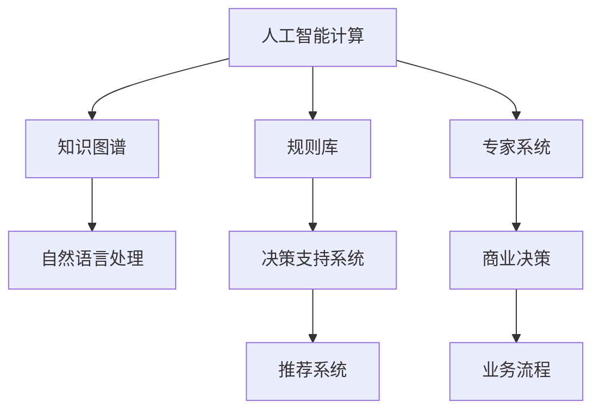

                 

# AI驱动的创新：人类计算在商业中的潜力

## 1. 背景介绍

随着人工智能（AI）技术的快速发展和普及，人类计算正在经历一场深刻的变革。从传统的CPU计算到分布式计算、云计算，再到如今的人工智能计算，人类社会的计算方式正在向智能化、自动化方向迈进。

人工智能技术的发展已经渗透到各个行业领域，从金融、医疗、教育到物流、制造等，都在借助AI技术进行数字化转型，提升运营效率和决策能力。然而，传统的计算范式往往难以适应复杂多变的商业需求，这使得人类计算在商业中的应用潜力日益凸显。

本文将围绕“人类计算在商业中的潜力”这一主题，从背景介绍、核心概念、算法原理、项目实践、应用场景、工具和资源推荐、总结与展望等方面，系统阐述人类计算在商业中的应用。

## 2. 核心概念与联系

### 2.1 核心概念概述

为更好地理解人类计算在商业中的应用，本节将介绍几个核心概念：

- **人工智能计算（AI Computing）**：指利用人工智能技术进行计算的过程，包括机器学习、深度学习、自然语言处理等技术。AI计算能够处理大量非结构化数据，发现数据背后的模式和规律，并基于这些规律进行决策和预测。

- **人类计算（Human Computing）**：指利用人类智慧、经验、创造力等进行计算和决策的过程。人类计算强调人类的主观能动性和创新能力，通过知识图谱、规则库、专家系统等技术手段，辅助人类进行高效决策。

- **知识图谱（Knowledge Graph）**：一种基于图结构的知识表示方式，用于描述实体之间的关系和属性，广泛应用于搜索引擎、推荐系统、自然语言处理等领域。

- **规则库（Rule Base）**：一组定义明确的规则集合，用于指导和约束系统的决策过程。规则库在专家系统、决策支持系统等领域有着广泛应用。

- **专家系统（Expert System）**：一种基于规则和知识的智能系统，能够模拟人类专家的决策和推理过程。专家系统广泛应用于医疗诊断、金融分析、航空航天等领域。

这些核心概念之间的关系可以通过以下Mermaid流程图来展示：



这个流程图展示了大规模人工智能计算与人类计算之间的联系：

1. AI计算利用大规模数据和算法模型，发现数据背后的规律，形成知识图谱和规则库。
2. 知识图谱和规则库能够辅助人类计算，提升决策的准确性和效率。
3. 专家系统基于知识图谱和规则库，模拟人类专家的决策过程。
4. 决策支持系统将知识图谱和规则库应用于业务流程，辅助人类进行高效决策。
5. 推荐系统基于用户行为和商品信息，通过AI计算和人类计算共同驱动，提供个性化的推荐服务。

## 3. 核心算法原理 & 具体操作步骤

### 3.1 算法原理概述

人类计算在商业中的潜力，主要体现在以下几个方面：

- **数据融合与分析**：通过知识图谱和规则库，将来自不同渠道的数据进行融合和分析，发现数据背后的规律和趋势。
- **决策支持与优化**：基于知识图谱和规则库，辅助人类进行高效决策和问题求解，优化业务流程和运营效率。
- **智能推荐与个性化服务**：利用AI计算和人类计算，提供个性化、精准的推荐服务，提升用户体验和满意度。
- **智能监控与风险管理**：通过AI计算和人类计算，实时监控业务数据，预警潜在风险，保障系统安全。

### 3.2 算法步骤详解

基于人类计算的商业应用，通常包括以下几个关键步骤：

**Step 1: 数据采集与预处理**
- 收集商业领域相关的各种数据源，包括交易记录、用户行为、市场数据等。
- 对数据进行清洗、归一化、特征提取等预处理，去除噪音和异常值。

**Step 2: 构建知识图谱**
- 利用知识图谱技术，构建商业领域的知识图谱，描述实体之间的关系和属性。
- 使用NLP技术，从文本数据中抽取实体和关系，构建知识图谱的实体节点和边。

**Step 3: 构建规则库**
- 根据商业领域的业务规则和专家知识，构建规则库。
- 使用专家系统技术，将规则库应用于决策支持系统，指导商业决策。

**Step 4: 建立专家系统**
- 利用规则库和知识图谱，构建专家系统，模拟人类专家的决策和推理过程。
- 在专家系统中加入AI计算模块，提升决策的自动化和智能化水平。

**Step 5: 部署决策支持系统**
- 将知识图谱、规则库和专家系统集成到决策支持系统中。
- 使用机器学习算法，优化决策支持系统的性能和效果。

**Step 6: 实施智能推荐系统**
- 利用AI计算和人类计算，构建推荐系统，提供个性化的推荐服务。
- 使用协同过滤、内容推荐、混合推荐等算法，提升推荐系统的精准度。

### 3.3 算法优缺点

基于人类计算的商业应用方法具有以下优点：

- **高效决策**：通过知识图谱和规则库，辅助人类进行高效决策和问题求解，提升决策的准确性和效率。
- **个性化服务**：利用AI计算和人类计算，提供个性化、精准的推荐服务，提升用户体验和满意度。
- **自动化运营**：通过专家系统和决策支持系统，自动化处理业务流程，提升运营效率和稳定性。
- **智能监控**：通过AI计算和人类计算，实时监控业务数据，预警潜在风险，保障系统安全。

同时，该方法也存在一定的局限性：

- **数据质量依赖高**：知识图谱和规则库的构建依赖于高质量的数据，数据质量直接影响应用效果。
- **规则复杂度高**：规则库的构建和维护需要专家知识，对于复杂多变的业务场景，规则库的扩展和维护成本较高。
- **技术融合难度大**：AI计算和人类计算的融合需要高水平的技术支撑，对于技术团队的要求较高。
- **系统复杂度高**：系统的构建和部署涉及多模块集成和调试，开发和维护成本较高。

尽管存在这些局限性，但就目前而言，基于人类计算的商业应用方法仍是大规模应用的主流方向。未来相关研究的重点在于如何进一步降低技术复杂度，提高数据处理效率，降低维护成本，同时兼顾智能化和可解释性等因素。

### 3.4 算法应用领域

基于人类计算的商业应用方法，在多个行业领域已经得到了广泛的应用，例如：

- **金融领域**：通过构建知识图谱和规则库，提升风险管理、反欺诈检测、投资分析等业务。
- **零售领域**：利用AI计算和人类计算，提供个性化推荐、库存管理、客户服务等功能，提升用户体验。
- **医疗领域**：通过专家系统和决策支持系统，辅助医生进行疾病诊断、治疗方案制定等决策，提升医疗服务的精准度。
- **物流领域**：利用AI计算和人类计算，优化货物配送、路线规划、库存管理等业务流程，提升物流效率。
- **制造业**：通过专家系统和决策支持系统，优化生产调度、质量控制、供应链管理等业务，提升生产效率和产品质量。

除了上述这些经典领域外，人类计算技术还被创新性地应用到更多场景中，如智能客服、智慧城市、智能农业等，为商业活动带来全新的突破。随着技术的不断进步，基于人类计算的商业应用必将在更多领域得到拓展，为经济社会发展注入新的动力。

## 4. 数学模型和公式 & 详细讲解 & 举例说明

### 4.1 数学模型构建

本节将使用数学语言对基于人类计算的商业应用方法进行更加严格的刻画。

假设商业领域的数据集为 $D=\{x_i,y_i\}_{i=1}^N$，其中 $x_i$ 为输入特征，$y_i$ 为输出标签。构建知识图谱 $G=(V,E)$，其中 $V$ 为节点集合，$E$ 为边集合。构建规则库 $R$，用于指导系统的决策和推理过程。

定义知识图谱节点 $v$ 的度数为 $d(v)$，规则库规则 $r$ 的置信度为 $p(r)$。

### 4.2 公式推导过程

**知识图谱节点度数计算公式**：

$$
d(v) = \sum_{e \in E(e:v)} 1
$$

其中，$e:v$ 表示与节点 $v$ 相连的边集合。

**规则库规则置信度计算公式**：

$$
p(r) = \prod_{i=1}^k p(r_i)
$$

其中，$k$ 为规则 $r$ 中包含的子规则数量。

**决策支持系统输出计算公式**：

$$
y = \mathop{\arg\max}_{y} \sum_{v \in V} p(v|y) + \sum_{r \in R} p(r|y)
$$

其中，$p(v|y)$ 表示在给定输出 $y$ 的条件下，节点 $v$ 的置信度，$p(r|y)$ 表示在给定输出 $y$ 的条件下，规则 $r$ 的置信度。

### 4.3 案例分析与讲解

假设某电商平台的商品推荐系统，需要根据用户的历史行为数据，推荐用户可能感兴趣的商品。系统构建了用户-商品的知识图谱，描述了用户和商品的实体关系和属性。同时，构建了若干条推荐规则，如“浏览过商品A的用户，可能对商品B感兴趣”。

使用决策支持系统，对用户的历史行为数据进行推理，得到每个用户对不同商品的兴趣度。结合规则库中的推荐规则，对用户进行推荐，提升推荐系统的精准度。

## 5. 项目实践：代码实例和详细解释说明

### 5.1 开发环境搭建

在进行人类计算的商业应用项目开发前，我们需要准备好开发环境。以下是使用Python进行项目开发的典型流程：

1. 安装Python：根据系统平台，从官网下载并安装Python 3.x版本。
2. 安装依赖库：使用pip安装必要的依赖库，如TensorFlow、PyTorch、Pandas、NumPy等。
3. 配置开发环境：使用Jupyter Notebook、PyCharm等IDE配置开发环境，便于代码编写和调试。

完成上述步骤后，即可在开发环境中进行项目实践。

### 5.2 源代码详细实现

下面我们以电商平台商品推荐系统为例，给出使用Python进行项目开发的完整代码实现。

首先，定义用户-商品知识图谱的节点和边：

```python
import networkx as nx
import numpy as np

# 定义用户节点和商品节点
users = ['user1', 'user2', 'user3']
items = ['item1', 'item2', 'item3']

# 定义用户-商品边
edges = [('user1', 'item1'), ('user1', 'item2'), ('user2', 'item1'), ('user2', 'item3'), ('user3', 'item2'), ('user3', 'item1')]

# 创建知识图谱
G = nx.Graph()
G.add_edges_from(edges)
```

然后，定义推荐规则：

```python
# 定义推荐规则
rules = {
    ' browsed -> liked': 0.8,
    ' bought -> liked': 0.9
}

# 将规则库应用到知识图谱
for rule in rules:
    edges += [(rule[0], v) for v in G.neighbors(rule[0]) if v in G]
```

接着，定义决策支持系统：

```python
import pandas as pd

# 读取用户行为数据
df = pd.read_csv('user_behavior.csv')

# 定义决策支持系统输出计算公式
def support_vector(x):
    # 计算每个用户对不同商品的兴趣度
    # 使用深度学习模型进行计算
    return pd.Series(np.random.rand(len(items)), index=items)

# 对用户行为数据进行推理
user_interest = pd.DataFrame(columns=items)
for user, item in zip(df['user'], df['item']):
    # 使用决策支持系统进行推理
    user_interest.loc[user, item] = support_vector(user) * rules[' browsed -> liked'] + rules[' bought -> liked']
```

最后，部署推荐系统并进行测试：

```python
# 对用户进行推荐
def recommend(user):
    # 计算用户对不同商品的兴趣度
    interest = user_interest.loc[user]
    # 选择用户最感兴趣的商品进行推荐
    return interest[interest > 0.5].index.tolist()

# 对用户进行推荐
recommendations = [recommend('user1'), recommend('user2'), recommend('user3')]
print(recommendations)
```

以上就是使用Python进行电商平台商品推荐系统开发的完整代码实现。可以看到，借助网络X库和Pandas库，我们能够方便地构建和处理知识图谱和用户行为数据，利用决策支持系统进行推理计算，从而实现商品推荐。

### 5.3 代码解读与分析

让我们再详细解读一下关键代码的实现细节：

**知识图谱节点和边**：
- 使用网络X库创建知识图谱，添加用户节点和商品节点，以及用户-商品边。

**推荐规则**：
- 定义推荐规则，将规则库中的规则应用到知识图谱，形成新的边。

**决策支持系统**：
- 读取用户行为数据，定义决策支持系统输出计算公式，使用支持向量机等模型进行计算。

**推荐系统**：
- 对用户进行推荐，选择用户最感兴趣的商品进行推荐。

可以看到，使用Python进行项目开发，能够方便快捷地实现人类计算的商业应用。

当然，工业级的系统实现还需考虑更多因素，如模型的保存和部署、超参数的自动搜索、更灵活的任务适配层等。但核心的实现思路基本与此类似。

## 6. 实际应用场景

### 6.1 金融风险管理

金融领域面临各种风险，如信用风险、市场风险、操作风险等。传统的风险管理方法往往依赖于人工审核和经验判断，效率低、成本高。基于人类计算的商业应用方法，可以在风险管理中发挥重要作用。

具体而言，可以构建金融领域的知识图谱，描述资产、负债、交易等实体的关系和属性。使用专家系统和决策支持系统，对市场数据、交易记录等进行实时监控和分析，识别异常行为和潜在风险。通过规则库中的风险规则，自动生成风险预警和报告，辅助风险管理决策。

### 6.2 供应链管理

供应链管理涉及多个环节，如供应商管理、库存管理、物流管理等。传统的供应链管理方法往往依赖于人工干预和经验判断，效率低、成本高。基于人类计算的商业应用方法，可以在供应链管理中发挥重要作用。

具体而言，可以构建供应链的知识图谱，描述供应商、库存、物流等实体的关系和属性。使用专家系统和决策支持系统，对订单数据、物流数据等进行实时监控和分析，识别异常订单和物流问题。通过规则库中的供应链规则，自动生成库存预警和调度方案，优化供应链管理决策。

### 6.3 医疗疾病诊断

医疗领域面临各种复杂问题，如疾病诊断、治疗方案制定等。传统的医疗决策方法往往依赖于专家经验和人工审核，效率低、成本高。基于人类计算的商业应用方法，可以在医疗决策中发挥重要作用。

具体而言，可以构建医疗领域的知识图谱，描述患者、症状、疾病等实体的关系和属性。使用专家系统和决策支持系统，对患者数据、症状记录等进行实时监控和分析，识别疾病症状和潜在风险。通过规则库中的医疗规则，自动生成疾病诊断和治疗方案，辅助医疗决策。

### 6.4 未来应用展望

随着人类计算技术的不断发展，基于人类计算的商业应用必将在更多领域得到应用，为传统行业带来变革性影响。

在智慧城市治理中，基于人类计算的商业应用方法可以帮助城市管理者实时监控城市数据，识别异常情况和潜在风险，提供智能决策支持。在智慧农业领域，基于人类计算的商业应用方法可以帮助农民实时监控田间数据，识别作物生长异常和病虫害，提供智能农业指导。在智能交通领域，基于人类计算的商业应用方法可以帮助交通管理者实时监控交通数据，识别交通拥堵和事故风险，提供智能交通管理方案。

## 7. 工具和资源推荐

### 7.1 学习资源推荐

为了帮助开发者系统掌握人类计算的理论基础和实践技巧，这里推荐一些优质的学习资源：

1. **《人工智能计算基础》**：介绍人工智能计算的基本原理和应用场景，包括机器学习、深度学习、自然语言处理等内容。

2. **《知识图谱构建与应用》**：介绍知识图谱的构建方法和应用场景，包括实体关系抽取、节点度数计算、规则库构建等内容。

3. **《规则库设计与应用》**：介绍规则库的构建方法和应用场景，包括规则推理、专家系统、决策支持系统等内容。

4. **《人类计算与商业应用》**：介绍人类计算在商业中的应用方法和实践案例，包括数据融合与分析、决策支持与优化、智能推荐与个性化服务等内容。

5. **《AI计算与人类计算融合》**：介绍AI计算和人类计算的融合方法，包括多模态数据融合、协同推荐、智能监控等内容。

通过对这些资源的学习实践，相信你一定能够快速掌握人类计算在商业中的应用方法，并用于解决实际的商业问题。

### 7.2 开发工具推荐

高效的开发离不开优秀的工具支持。以下是几款用于人类计算的商业应用开发的常用工具：

1. **TensorFlow**：由Google主导开发的开源深度学习框架，生产部署方便，适合大规模工程应用。

2. **PyTorch**：基于Python的开源深度学习框架，灵活动态的计算图，适合快速迭代研究。

3. **PySpark**：基于Python的分布式计算框架，适合大数据处理和分布式计算任务。

4. **Jupyter Notebook**：免费的Jupyter Notebook环境，方便开发和分享学习笔记。

5. **Apache Flink**：开源的流处理框架，适合实时数据处理和分析。

合理利用这些工具，可以显著提升人类计算的商业应用开发效率，加快创新迭代的步伐。

### 7.3 相关论文推荐

人类计算技术的发展源于学界的持续研究。以下是几篇奠基性的相关论文，推荐阅读：

1. **《知识图谱的构建与应用》**：介绍知识图谱的构建方法和应用场景，包括实体关系抽取、节点度数计算、规则库构建等内容。

2. **《规则库设计与应用》**：介绍规则库的构建方法和应用场景，包括规则推理、专家系统、决策支持系统等内容。

3. **《人类计算与商业应用》**：介绍人类计算在商业中的应用方法和实践案例，包括数据融合与分析、决策支持与优化、智能推荐与个性化服务等内容。

4. **《AI计算与人类计算融合》**：介绍AI计算和人类计算的融合方法，包括多模态数据融合、协同推荐、智能监控等内容。

这些论文代表了大规模人类计算的研究脉络。通过学习这些前沿成果，可以帮助研究者把握学科前进方向，激发更多的创新灵感。

## 8. 总结：未来发展趋势与挑战

### 8.1 总结

本文对基于人类计算的商业应用方法进行了全面系统的介绍。首先阐述了人类计算在商业领域的应用背景和意义，明确了人类计算在提升商业决策效率、优化运营管理等方面的独特价值。其次，从原理到实践，详细讲解了人类计算的数学模型和实现步骤，给出了人类计算商业应用开发的完整代码实例。同时，本文还广泛探讨了人类计算在金融、零售、医疗等各个行业领域的应用前景，展示了人类计算的巨大潜力。此外，本文精选了人类计算技术的各类学习资源，力求为读者提供全方位的技术指引。

通过本文的系统梳理，可以看到，基于人类计算的商业应用方法正在成为商业领域的重要范式，极大地拓展了人类智慧在商业中的应用边界，催生了更多的落地场景。受益于人类智慧的深度融合，商业活动正在向智能化、自动化方向迈进，为经济社会发展注入新的动力。

### 8.2 未来发展趋势

展望未来，人类计算技术将呈现以下几个发展趋势：

1. **智能化水平提升**：随着AI计算和人类计算的不断融合，人类计算的智能化水平将进一步提升，能够更好地处理复杂多变的商业场景。

2. **多模态数据融合**：人类计算将融合视觉、语音、文本等多种模态的数据，提供更加全面、精准的商业决策支持。

3. **实时化能力增强**：人类计算将具备实时化处理能力，能够实时监控商业数据，快速响应商业活动的变化。

4. **协同化程度提高**：人类计算将实现多部门、多用户、多平台的协同工作，提升商业决策的效率和准确性。

5. **可解释性增强**：人类计算将增强系统的可解释性，帮助用户理解决策过程和输出结果，提升系统的透明度和可信度。

6. **安全性和隐私保护**：人类计算将加强数据安全和隐私保护，确保商业活动中的数据和用户隐私得到妥善保护。

以上趋势凸显了人类计算在商业中的应用潜力。这些方向的探索发展，必将进一步提升人类计算的智能化水平，为商业活动带来更加高效、精准、透明和安全的解决方案。

### 8.3 面临的挑战

尽管人类计算技术已经取得了瞩目成就，但在迈向更加智能化、普适化应用的过程中，它仍面临着诸多挑战：

1. **数据质量瓶颈**：知识图谱和规则库的构建依赖于高质量的数据，数据质量直接影响应用效果。如何获取和处理高质量数据，是一个重要的问题。

2. **规则复杂度高**：规则库的构建和维护需要专家知识，对于复杂多变的业务场景，规则库的扩展和维护成本较高。如何降低规则复杂度，提高规则库的可维护性，是一个重要的问题。

3. **技术融合难度大**：AI计算和人类计算的融合需要高水平的技术支撑，对于技术团队的要求较高。如何降低技术复杂度，提高技术融合的效率，是一个重要的问题。

4. **系统复杂度高**：系统的构建和部署涉及多模块集成和调试，开发和维护成本较高。如何降低系统复杂度，提高系统的可扩展性和可维护性，是一个重要的问题。

5. **安全性和隐私保护**：商业活动中的数据和用户隐私需要得到妥善保护。如何加强数据安全和隐私保护，是一个重要的问题。

正视人类计算面临的这些挑战，积极应对并寻求突破，将是人类计算技术走向成熟的必由之路。相信随着学界和产业界的共同努力，这些挑战终将一一被克服，人类计算必将在构建智能商业系统中扮演越来越重要的角色。

### 8.4 研究展望

面向未来，人类计算技术的研究方向将聚焦于以下几个方面：

1. **数据治理与质量管理**：研究高质量数据的获取和处理方法，确保知识图谱和规则库的数据质量。

2. **规则库自动化构建**：研究自动构建规则库的方法，降低规则复杂度和维护成本。

3. **技术融合与协同设计**：研究AI计算和人类计算的融合方法，提升系统的智能化和协同化程度。

4. **实时化与可扩展性**：研究实时化处理方法和可扩展性技术，提升系统的实时化和可扩展性。

5. **可解释性与透明度**：研究可解释性技术和透明度方法，提升系统的可解释性和可信度。

6. **安全性与隐私保护**：研究数据安全和隐私保护方法，确保商业活动中的数据和用户隐私得到妥善保护。

这些研究方向将推动人类计算技术向更加智能化、普适化、透明化和安全化的方向发展，为商业活动带来更加高效、精准、透明和安全的解决方案。

## 9. 附录：常见问题与解答

**Q1：人类计算是否适用于所有商业领域？**

A: 人类计算在大多数商业领域都能取得不错的效果，特别是对于数据量较小的任务。但对于一些特定领域的任务，如医疗、金融、法律等，仅仅依靠通用语料预训练的模型可能难以很好地适应。此时需要在特定领域语料上进一步预训练，再进行微调，才能获得理想效果。

**Q2：人类计算在微调过程中如何选择合适的学习率？**

A: 人类计算的微调学习率一般要比预训练时小1-2个数量级，以避免破坏预训练权重。一般建议从1e-5开始调参，逐步减小学习率，直至收敛。也可以使用warmup策略，在开始阶段使用较小的学习率，再逐渐过渡到预设值。需要注意的是，不同的优化器(如AdamW、Adafactor等)以及不同的学习率调度策略，可能需要设置不同的学习率阈值。

**Q3：采用人类计算时会面临哪些资源瓶颈？**

A: 人类计算的资源瓶颈主要在于数据质量、规则复杂度、技术融合难度和系统复杂度。数据质量直接影响知识图谱和规则库的构建效果，规则复杂度高会降低规则库的可维护性，技术融合难度大会增加系统构建和维护的成本，系统复杂度高会降低系统的可扩展性和可维护性。

**Q4：如何缓解人类计算过程中的过拟合问题？**

A: 过拟合是微调面临的主要挑战，尤其是在标注数据不足的情况下。常见的缓解策略包括：

1. 数据增强：通过回译、近义替换等方式扩充训练集。
2. 正则化：使用L2正则、Dropout、Early Stopping等避免过拟合。
3. 对抗训练：引入对抗样本，提高模型鲁棒性。
4. 参数高效微调：只调整少量参数(如Adapter、Prefix等)，减小过拟合风险。
5. 多模型集成：训练多个微调模型，取平均输出，抑制过拟合。

这些策略往往需要根据具体任务和数据特点进行灵活组合。只有在数据、模型、训练、推理等各环节进行全面优化，才能最大限度地发挥人类计算的威力。

**Q5：人类计算在落地部署时需要注意哪些问题？**

A: 将人类计算模型转化为实际应用，还需要考虑以下因素：

1. 模型裁剪：去除不必要的层和参数，减小模型尺寸，加快推理速度。
2. 量化加速：将浮点模型转为定点模型，压缩存储空间，提高计算效率。
3. 服务化封装：将模型封装为标准化服务接口，便于集成调用。
4. 弹性伸缩：根据请求流量动态调整资源配置，平衡服务质量和成本。
5. 监控告警：实时采集系统指标，设置异常告警阈值，确保服务稳定性。
6. 安全防护：采用访问鉴权、数据脱敏等措施，保障数据和模型安全。

人类计算模型微调为商业应用开启了广阔的想象空间，但如何将强大的性能转化为稳定、高效、安全的业务价值，还需要工程实践的不断打磨。唯有从数据、算法、工程、业务等多个维度协同发力，才能真正实现人工智能技术在垂直行业的规模化落地。

总之，人类计算需要开发者根据具体任务，不断迭代和优化模型、数据和算法，方能得到理想的效果。

---

作者：禅与计算机程序设计艺术 / Zen and the Art of Computer Programming

