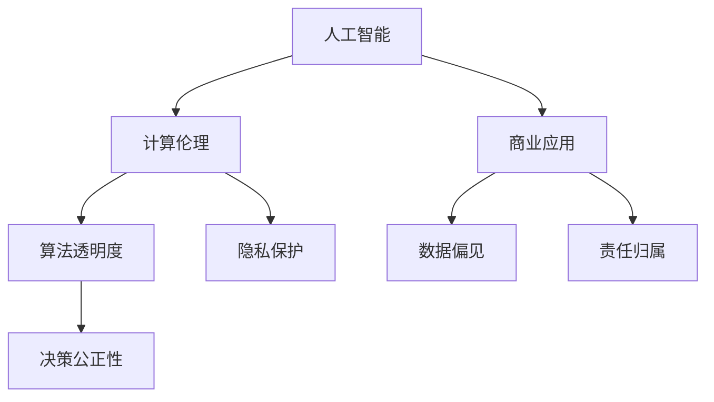

                 

# AI驱动的创新：人类计算在商业中的道德和伦理

> 关键词：AI、计算伦理、商业应用、人工智能决策、道德风险、隐私保护、算法透明度

## 1. 背景介绍

### 1.1 问题由来

随着人工智能技术的飞速发展，人类计算（Human Computation）正在迅速渗透到商业应用的各个领域。在医疗、金融、零售、物流、制造等众多行业中，人工智能驱动的系统正以惊人的速度提升效率、优化决策、创造价值。然而，这一进程也带来了新的伦理和道德挑战。

人工智能在商业中的广泛应用，让算法和模型成为决策的核心，而这一决策过程往往缺乏可解释性，且可能受到数据偏见的影响。如何保证决策的公正性、透明性以及安全性，成为商业应用中迫切需要解决的问题。

### 1.2 问题核心关键点

本节将阐述人工智能在商业应用中面临的核心道德和伦理问题，以及如何解决这些问题的关键点。

1. **算法透明度**：算法的决策过程难以理解和解释，导致对结果的质疑和不信任。
2. **数据偏见**：训练数据包含偏见，可能导致算法输出不公平的决策。
3. **隐私保护**：商业应用涉及大量敏感数据，如何保护这些数据的隐私和安全。
4. **决策公正性**：确保算法在商业决策中不产生歧视性或有害的行为。
5. **责任归属**：当人工智能系统出错时，如何明确责任归属。

这些关键点共同构成了人工智能在商业应用中的伦理和道德挑战，需要我们认真对待并寻求解决方案。

## 2. 核心概念与联系

### 2.1 核心概念概述

本节将介绍几个与人工智能伦理和道德相关的核心概念：

- **人工智能（AI）**：利用机器学习、深度学习等技术，模拟人类智能的行为和决策能力。
- **计算伦理（Computational Ethics）**：探讨算法决策的道德和伦理问题，如公平性、透明度、隐私保护等。
- **商业应用（Business Application）**：将人工智能技术应用于商业场景，优化决策、提升效率、创造价值。
- **算法偏见（Algorithmic Bias）**：由于训练数据、模型设计等因素导致的决策偏差。
- **隐私保护（Privacy Protection）**：保护用户数据隐私和安全，避免数据滥用。
- **责任归属（Accountability）**：当人工智能系统产生错误或有害结果时，如何明确责任。

这些概念之间的逻辑关系可以通过以下Mermaid流程图来展示：



这个流程图展示了几大核心概念之间的逻辑关系：

1. 人工智能通过算法和模型实现自动化决策。
2. 计算伦理研究算法决策的道德问题，如透明度、偏见、隐私保护等。
3. 商业应用通过人工智能技术提升效率和价值。
4. 算法透明度和偏见直接影响决策的公正性。
5. 隐私保护确保用户数据的安全和合法使用。
6. 责任归属明确算法错误时的责任归属问题。

## 3. 核心算法原理 & 具体操作步骤

### 3.1 算法原理概述

人工智能在商业应用中的决策过程，本质上是算法对数据进行学习和训练的过程。这一过程包括：

1. **数据准备**：收集、清洗和标注数据，准备用于训练和测试。
2. **模型训练**：使用机器学习或深度学习算法，训练得到预测模型。
3. **模型部署**：将训练好的模型部署到实际应用中，进行实时决策。

这一过程涉及到大量的数据处理、算法优化和模型调参工作。

### 3.2 算法步骤详解

以下是人工智能在商业应用中的核心算法步骤详解：

1. **数据准备**：
   - **数据收集**：从多个数据源收集数据，如公开数据、企业内部数据等。
   - **数据清洗**：处理缺失值、异常值、重复数据等。
   - **数据标注**：对数据进行标注，如分类、回归、序列标注等。

2. **模型训练**：
   - **特征工程**：选择和设计输入特征，进行特征缩放、归一化等。
   - **模型选择**：选择适合的机器学习或深度学习模型，如线性回归、随机森林、卷积神经网络等。
   - **模型训练**：使用训练集进行模型训练，调整超参数，防止过拟合。

3. **模型部署**：
   - **模型评估**：在测试集上评估模型性能，如准确率、召回率、F1分数等。
   - **模型调优**：根据评估结果调整模型，如增加训练次数、调整超参数等。
   - **模型部署**：将训练好的模型部署到实际应用中，进行实时决策。

### 3.3 算法优缺点

人工智能在商业应用中的算法，具有以下优点：

- **高效性**：自动化的决策过程，大大提高了效率。
- **准确性**：机器学习模型可以在大规模数据上训练得到高精度的预测结果。
- **可扩展性**：算法可以在大规模数据和复杂问题上应用。

但同时，也存在以下缺点：

- **数据依赖**：算法的性能依赖于高质量的数据，数据质量不高会导致决策错误。
- **黑箱问题**：算法的决策过程复杂，难以解释和理解。
- **偏见问题**：算法可能继承数据中的偏见，导致决策不公平。

## 4. 数学模型和公式 & 详细讲解 & 举例说明

### 4.1 数学模型构建

人工智能在商业应用中的决策过程，通常涉及线性回归、逻辑回归、决策树、随机森林、神经网络等多种算法。以下是一些常见算法的数学模型构建：

- **线性回归**：
  $$
  y = w_0 + w_1x_1 + w_2x_2 + \cdots + w_nx_n + \epsilon
  $$
  其中，$y$ 为预测结果，$x_i$ 为输入特征，$w_i$ 为权重，$\epsilon$ 为误差项。

- **逻辑回归**：
  $$
  p(y=1|x) = \frac{1}{1+\exp(-\beta_0 - \beta_1x_1 - \cdots - \beta_nx_n)}
  $$
  其中，$p(y=1|x)$ 为输出结果的概率，$\beta_i$ 为权重。

- **决策树**：
  $$
  \begin{aligned}
  &If\;X_i <= \hat{x}_i: &F(X) &= G(X_i, F(X_{i-1})) \\
  &If\;X_i > \hat{x}_i: &F(X) &= H(X_i, F(X_{i-1}))
  \end{aligned}
  $$
  其中，$X_i$ 为输入特征，$\hat{x}_i$ 为特征阈值，$F(X)$ 为预测结果。

### 4.2 公式推导过程

以逻辑回归为例，推导其数学公式。假设我们有 $N$ 个样本数据 $(x_1, y_1), (x_2, y_2), \cdots, (x_N, y_N)$，其中 $x_i = (x_{i1}, x_{i2}, \cdots, x_{in})$，$y_i = 0$ 或 $1$。我们的目标是寻找一个线性模型 $p(y=1|x)$ 来预测 $y$。

使用最大似然估计，我们对每个样本的输出进行建模：
$$
p(y_i=1|x_i) = \frac{1}{1+\exp(-\beta_0 - \beta_1x_{i1} - \cdots - \beta_nx_{in})}
$$

整个样本的似然函数为：
$$
L(\beta_0, \beta_1, \cdots, \beta_n) = \prod_{i=1}^N p(y_i=1|x_i)
$$

对数似然函数为：
$$
\ell(\beta_0, \beta_1, \cdots, \beta_n) = \sum_{i=1}^N \log p(y_i=1|x_i) = \sum_{i=1}^N [-y_i(\beta_0 + \beta_1x_{i1} + \cdots + \beta_nx_{in}) + \log(1+\exp(\beta_0 + \beta_1x_{i1} + \cdots + \beta_nx_{in}))]
$$

为了最小化损失函数，我们求导并令导数为零：
$$
\frac{\partial \ell(\beta_0, \beta_1, \cdots, \beta_n)}{\partial \beta_j} = 0, \quad j=0,1,\cdots,n
$$

通过求解这个方程组，可以得到模型的参数 $\beta_0, \beta_1, \cdots, \beta_n$。

### 4.3 案例分析与讲解

以医疗领域的诊断系统为例，分析其算法模型和决策过程。

1. **数据准备**：收集医院的电子病历数据，进行清洗和标注，如病人基本信息、疾病症状、诊断结果等。
2. **模型训练**：选择逻辑回归模型，将病人的症状作为输入特征，诊断结果作为输出标签。使用训练集进行模型训练，调整超参数。
3. **模型评估**：在测试集上评估模型的准确率和召回率，如混淆矩阵、ROC曲线等。
4. **模型部署**：将训练好的模型部署到医生工作站，实时辅助医生进行诊断决策。

## 5. 项目实践：代码实例和详细解释说明

### 5.1 开发环境搭建

在进行人工智能项目开发时，首先需要准备好开发环境。以下是使用Python进行机器学习开发的常见环境配置流程：

1. 安装Anaconda：从官网下载并安装Anaconda，用于创建独立的Python环境。
2. 创建并激活虚拟环境：
```bash
conda create -n py33 python=3.3 
conda activate py33
```

3. 安装PyTorch、TensorFlow、Keras等常用库：
```bash
pip install torch torchvision torchaudio
pip install tensorflow
pip install keras
```

4. 安装NumPy、pandas、matplotlib等辅助库：
```bash
pip install numpy pandas matplotlib seaborn scikit-learn jupyter notebook ipython
```

完成上述步骤后，即可在虚拟环境中开始开发工作。

### 5.2 源代码详细实现

以下是一个简单的机器学习项目示例，用于预测房价。

首先，导入必要的库：

```python
import numpy as np
import pandas as pd
import matplotlib.pyplot as plt
from sklearn.model_selection import train_test_split
from sklearn.linear_model import LinearRegression
from sklearn.metrics import mean_squared_error, r2_score
```

然后，加载数据集：

```python
data = pd.read_csv('house_prices.csv')
X = data[['area', 'bedrooms', 'bathrooms', 'location', 'condition']]
y = data['price']
```

接着，划分训练集和测试集：

```python
X_train, X_test, y_train, y_test = train_test_split(X, y, test_size=0.2, random_state=42)
```

训练模型并评估：

```python
model = LinearRegression()
model.fit(X_train, y_train)
y_pred = model.predict(X_test)

mse = mean_squared_error(y_test, y_pred)
rmse = np.sqrt(mse)
r2 = r2_score(y_test, y_pred)

print('RMSE:', rmse)
print('R2 Score:', r2)
```

最后，可视化模型性能：

```python
plt.scatter(y_test, y_pred)
plt.plot([min(y_test), max(y_test)], [min(y_test), max(y_test)], 'k--', lw=4)
plt.xlabel('Actual Price')
plt.ylabel('Predicted Price')
plt.show()
```

### 5.3 代码解读与分析

以上代码展示了使用Python和Scikit-Learn库进行线性回归模型训练和评估的基本流程。

1. **数据加载**：使用Pandas库加载数据集，将其转换为NumPy数组。
2. **模型训练**：使用Scikit-Learn的LinearRegression类，训练线性回归模型。
3. **模型评估**：使用Scikit-Learn的mean_squared_error和r2_score函数，评估模型的预测性能。
4. **可视化**：使用Matplotlib库绘制预测值和真实值的散点图，并画出回归线。

## 6. 实际应用场景

### 6.1 智能推荐系统

智能推荐系统利用人工智能技术，通过分析用户行为和兴趣，向用户推荐相关商品或内容。如电商平台的商品推荐、视频网站的广告推荐等。

在技术实现上，可以收集用户浏览、点击、购买等行为数据，利用机器学习模型学习用户偏好，实时推荐相关商品或内容。推荐系统可以通过协同过滤、内容推荐、混合推荐等多种算法进行优化。

### 6.2 金融风控

金融风控系统利用人工智能技术，通过分析用户历史行为和信用记录，评估其信用风险。如贷款审批、信用卡申请等。

在技术实现上，可以收集用户的个人信息、历史交易记录、社交媒体信息等，利用机器学习模型评估用户的信用风险。金融风控系统可以通过分类模型、回归模型、集成模型等多种算法进行优化。

### 6.3 自动驾驶

自动驾驶系统利用人工智能技术，通过分析道路环境、车辆状态、行人行为等数据，实现自动驾驶。

在技术实现上，可以收集车辆传感器数据、GPS数据、摄像头数据等，利用机器学习模型进行环境感知、路径规划、控制决策等。自动驾驶系统可以通过神经网络、行为预测、规划算法等多种算法进行优化。

### 6.4 未来应用展望

随着人工智能技术的不断进步，未来在更多领域都将迎来人工智能的应用。

1. **智慧城市**：通过人工智能技术优化城市交通、环境监测、公共安全等，提高城市管理效率。
2. **智能医疗**：通过人工智能技术辅助诊断、药物研发、医疗管理等，提升医疗服务质量。
3. **智能制造**：通过人工智能技术优化生产流程、质量控制、设备维护等，提高生产效率。
4. **智能农业**：通过人工智能技术优化种植、养殖、农业管理等，提升农业生产效率。

这些领域的广泛应用，将深刻改变人类的生产生活方式，推动经济社会的全面进步。

## 7. 工具和资源推荐

### 7.1 学习资源推荐

为了帮助开发者系统掌握人工智能技术，以下是一些优质的学习资源：

1. Coursera《机器学习》课程：由斯坦福大学教授Andrew Ng主讲，涵盖机器学习的基本概念和常用算法。
2. DeepLearning.AI《深度学习专项课程》：由AI领域的权威人士Andrew Ng主讲，涵盖深度学习的基本概念和常用算法。
3. TensorFlow官方文档：TensorFlow的官方文档，提供详细的API和使用指南，适合快速上手实践。
4. Kaggle数据集与竞赛平台：提供海量数据集和竞赛机会，适合数据科学和机器学习的学习和实践。
5. Google AI开放课程：Google AI提供的免费课程，涵盖机器学习、深度学习、自然语言处理等前沿技术。

通过对这些资源的学习实践，相信你一定能够快速掌握人工智能技术的精髓，并用于解决实际的商业问题。

### 7.2 开发工具推荐

高效的开发离不开优秀的工具支持。以下是几款用于人工智能项目开发的常用工具：

1. Jupyter Notebook：开源的Jupyter Notebook环境，支持多语言、多库、多平台，方便进行数据处理、模型训练和结果展示。
2. TensorFlow：由Google主导开发的开源深度学习框架，生产部署方便，适合大规模工程应用。
3. PyTorch：基于Python的开源深度学习框架，灵活动态的计算图，适合快速迭代研究。
4. Keras：高级神经网络API，支持多种深度学习模型，方便快速搭建和训练模型。
5. JupyterLab：下一代Jupyter环境，支持更多功能，如代码版本控制、文件管理系统等。

合理利用这些工具，可以显著提升人工智能项目的开发效率，加快创新迭代的步伐。

### 7.3 相关论文推荐

人工智能技术的发展源于学界的持续研究。以下是几篇奠基性的相关论文，推荐阅读：

1. "AI Superpowers: China, Silicon Valley, and the New World Order" by Kai-Fu Lee：阐述了人工智能技术的全球竞争格局及其对经济社会的影响。
2. "Human Computation: Leveraging Crowds in Data Analysis" by Robert N. M. Myerson：探讨了人类计算的概念和应用。
3. "Fairness, Accountability, and Transparency in Machine Learning" by Rajeev K. Srivastava等：探讨了机器学习中的公平性、透明性和可解释性问题。
4. "The Future of Human-Computer Interaction: Flow, Multitasking, and Trust" by Shneiderman：探讨了未来人机交互的技术趋势和应用。

这些论文代表了大数据时代的学术前沿，对于理解人工智能技术的伦理和道德问题具有重要参考价值。

## 8. 总结：未来发展趋势与挑战

### 8.1 总结

本文对人工智能技术在商业应用中的伦理和道德问题进行了全面系统的介绍。首先阐述了人工智能技术在商业应用中的决策过程和算法原理，明确了数据准备、模型训练、模型部署等关键步骤。其次，从算法透明度、数据偏见、隐私保护、决策公正性、责任归属等角度，深入探讨了人工智能在商业应用中的伦理和道德问题。最后，通过多个实际应用场景，展示了人工智能技术在商业中的广泛应用前景。

通过本文的系统梳理，可以看到，人工智能技术正在深刻改变商业应用的模式和生态，带来巨大的商业价值和社会效益。然而，这一进程也伴随着新的伦理和道德挑战，需要我们认真对待并寻求解决方案。

### 8.2 未来发展趋势

展望未来，人工智能技术在商业应用中的发展趋势如下：

1. **数据驱动**：未来商业决策将更加依赖于数据驱动，通过大数据和人工智能技术，实现更精准、更高效的决策。
2. **个性化**：未来商业应用将更加个性化，通过人工智能技术，实现更符合用户需求的定制化服务。
3. **自动化**：未来商业操作将更加自动化，通过人工智能技术，实现更高效、更可靠的自动化操作。
4. **可持续发展**：未来商业应用将更加注重可持续发展，通过人工智能技术，实现更环保、更节能的商业运营。
5. **全球化**：未来商业应用将更加全球化，通过人工智能技术，实现更广泛、更深入的国际合作与交流。

这些趋势表明，人工智能技术将在商业应用中发挥越来越重要的作用，带来更多的商业机会和发展空间。

### 8.3 面临的挑战

尽管人工智能技术在商业应用中取得了巨大进展，但在迈向更加智能化、普适化应用的过程中，它仍面临诸多挑战：

1. **数据质量**：人工智能系统的性能依赖于高质量的数据，数据质量不高会导致决策错误。
2. **算法透明性**：算法的决策过程复杂，难以解释和理解，缺乏透明性。
3. **偏见问题**：算法可能继承数据中的偏见，导致决策不公平。
4. **隐私保护**：商业应用涉及大量敏感数据，如何保护这些数据的隐私和安全。
5. **安全风险**：人工智能系统可能面临黑客攻击、数据泄露等安全风险。
6. **技术壁垒**：人工智能技术的实现需要高水平的技术支持和经验积累，难以普及。

这些挑战需要我们在技术、伦理、法律等多个层面进行深入研究和解决。

### 8.4 研究展望

未来，在人工智能技术在商业应用中的伦理和道德研究，可以从以下几个方向进行探索：

1. **数据治理**：建立数据治理机制，规范数据收集、存储、使用等环节，确保数据质量和安全。
2. **算法透明性**：开发更透明的算法模型，增强算法的可解释性和可解释性。
3. **公平性**：研究算法公平性问题，确保算法的决策过程公正、透明。
4. **隐私保护**：研究隐私保护技术，确保用户数据的安全和合法使用。
5. **安全技术**：开发更安全的人工智能系统，防止黑客攻击和数据泄露。
6. **伦理框架**：建立人工智能技术的伦理框架，确保技术应用符合人类价值观和伦理道德。

这些研究方向的探索，必将引领人工智能技术在商业应用中的伦理和道德问题研究，为构建安全、可靠、可解释、可控的智能系统铺平道路。面向未来，我们需要不断深化对人工智能技术的理解，积极应对挑战，推动人工智能技术在商业应用中的健康发展。

## 9. 附录：常见问题与解答

**Q1: 人工智能在商业应用中存在哪些道德和伦理问题？**

A: 人工智能在商业应用中存在的道德和伦理问题包括但不限于：

1. **算法透明度**：算法的决策过程复杂，难以解释和理解。
2. **数据偏见**：训练数据包含偏见，可能导致算法输出不公平的决策。
3. **隐私保护**：商业应用涉及大量敏感数据，如何保护这些数据的隐私和安全。
4. **决策公正性**：确保算法在商业决策中不产生歧视性或有害的行为。
5. **责任归属**：当人工智能系统出错时，如何明确责任归属。

这些问题是人工智能技术在商业应用中需要认真对待和解决的关键点。

**Q2: 如何保证人工智能决策的公平性？**

A: 保证人工智能决策的公平性，可以从以下几个方面进行：

1. **数据公平性**：确保训练数据公平，不包含偏见。
2. **算法公平性**：使用公平性约束的算法模型，如公平误差率、差异性误差率等。
3. **特征工程**：选择和设计无偏见的输入特征，进行特征缩放、归一化等。
4. **模型监控**：实时监控算法的输出结果，及时发现和纠正不公平的决策。

这些方法可以最大限度地保证人工智能决策的公平性，提升商业应用的可信度和用户满意度。

**Q3: 如何保护人工智能系统的隐私安全？**

A: 保护人工智能系统的隐私安全，可以从以下几个方面进行：

1. **数据匿名化**：对敏感数据进行匿名化处理，防止数据泄露。
2. **访问控制**：严格控制数据访问权限，确保只有授权人员才能访问敏感数据。
3. **加密技术**：对数据进行加密处理，防止数据被非法获取和篡改。
4. **隐私保护技术**：如差分隐私、联邦学习等，确保数据隐私保护。

这些方法可以最大限度地保护人工智能系统的隐私安全，防止数据滥用和隐私泄露。

**Q4: 如何保证人工智能系统的透明度？**

A: 保证人工智能系统的透明度，可以从以下几个方面进行：

1. **模型解释**：开发可解释的算法模型，如决策树、逻辑回归等，方便理解算法决策过程。
2. **特征重要性**：分析输入特征的重要性，确保模型决策基于关键因素。
3. **可视化工具**：使用可视化工具展示模型决策过程，帮助理解算法行为。
4. **透明度报告**：定期发布透明度报告，公开算法决策过程和结果。

这些方法可以最大限度地保证人工智能系统的透明度，提升算法的可信度和用户信任度。

**Q5: 当人工智能系统出错时，如何明确责任归属？**

A: 当人工智能系统出错时，明确责任归属可以从以下几个方面进行：

1. **算法设计**：明确算法的定义和假设，确保算法设计符合业务需求。
2. **数据质量**：确保训练数据的质量，避免因数据问题导致系统出错。
3. **人机协作**：设计人机协作机制，确保人在决策过程中的主导地位。
4. **责任追溯**：建立责任追溯机制，确保责任可以明确划分。

这些方法可以最大限度地明确人工智能系统的责任归属，确保系统出错时有明确的责任主体。

---

作者：禅与计算机程序设计艺术 / Zen and the Art of Computer Programming

