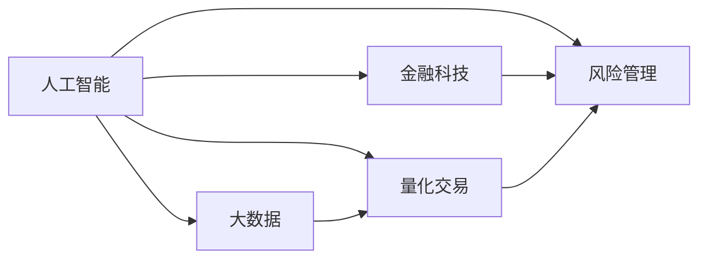

                 

# AI驱动的创新：人类计算在金融行业的价值创造

> 关键词：人工智能(AI)，金融科技(Fintech)，人类计算，大数据，量化交易，风险管理，金融分析，算法驱动

## 1. 背景介绍

### 1.1 问题由来

在过去十年中，金融行业经历了翻天覆地的变化。量化交易、高频交易、区块链技术、人工智能等新兴技术的崛起，正在重塑传统的金融运作模式。尤其是在2020年全球新冠疫情爆发以来，金融市场的不确定性加剧，对实时、精准的金融分析工具的需求也随之增长。

然而，传统的金融分析方法依赖于大量的人工处理和定性分析，耗时耗力且精度不高。特别是在金融危机的预测、市场风险管理、投资策略设计等环节，传统的金融分析手段已经难以满足业务需求。

为应对这些挑战，金融行业亟需引入更为先进的技术手段，特别是基于人工智能和大数据的量化分析方法。通过利用人工智能计算能力，可以实现更加高效、精准的金融分析，从而提升决策的科学性和精准性。

### 1.2 问题核心关键点

1. **人工智能在金融分析中的作用**：人工智能，特别是机器学习和深度学习技术，已经在金融行业的多个领域得到应用，如风险管理、信用评分、股票预测、高频交易等。通过机器学习模型，可以自动提取、分析和预测金融市场数据，提升决策效率和精度。
2. **金融大数据的处理**：金融行业的数据量巨大，包括股票交易数据、信用评分数据、市场情绪数据、宏观经济数据等。如何高效、准确地处理这些数据，是实现人工智能在金融分析中应用的基础。
3. **人类计算与AI的协同**：在金融分析中，不仅需要借助人工智能进行数据处理和模型预测，还需要结合人类专家的经验和判断，进行综合决策。AI与人类计算的协同，是提升金融分析质量的关键。

## 2. 核心概念与联系

### 2.1 核心概念概述

为了深入理解人工智能在金融行业的应用，本节将介绍几个关键概念及其联系：

- **人工智能(AI)**：通过算法和计算模型，使计算机具备类似人类的智能能力，包括学习、推理、决策等。在金融分析中，人工智能主要用于大数据处理、模型预测和决策支持。
- **金融科技(Fintech)**：利用技术手段，如区块链、大数据、云计算等，提升金融服务的效率和智能化水平。人工智能是金融科技的重要组成部分，推动金融行业的数字化转型。
- **人类计算**：指人类通过计算、推理、决策等智力活动，解决复杂问题。在金融分析中，人类计算通常用于监督机器学习模型的训练和调优，以及进行复杂的金融逻辑判断。
- **大数据**：指规模巨大、复杂度高、速度快的海量数据集。金融行业产生的数据量庞大，数据质量高，为人工智能的应用提供了丰富的素材。
- **量化交易**：利用数学模型和算法进行金融市场的交易，旨在通过计算机自动化执行交易策略，实现高效率和低成本的金融操作。
- **风险管理**：通过量化分析方法，评估和控制金融风险，包括市场风险、信用风险、流动性风险等。

这些概念之间的联系可以通过以下Mermaid流程图来展示：



这个流程图展示了人工智能、金融科技、大数据、量化交易和风险管理之间的关系：

- 人工智能通过大数据和金融科技，提供了更高效、更精准的金融分析方法。
- 量化交易和风险管理是人工智能在金融行业的重要应用方向，利用机器学习模型进行策略优化和风险评估。

## 3. 核心算法原理 & 具体操作步骤
### 3.1 算法原理概述

基于人工智能的金融分析，本质上是一种结合大数据处理和机器学习算法的计算过程。其核心思想是通过算法和模型，自动分析和处理金融数据，辅助决策者进行精准的金融操作。

形式化地，假设输入数据集为 $D=\{(x_i,y_i)\}_{i=1}^N$，其中 $x_i$ 为金融市场数据，$y_i$ 为对应标签。定义模型 $f: X \rightarrow Y$，其中 $X$ 为输入空间，$Y$ 为输出空间，模型参数为 $\theta$。金融分析的目标是最小化经验风险，即：

$$
\mathcal{L}(\theta) = \frac{1}{N} \sum_{i=1}^N \ell(f(x_i),y_i)
$$

其中 $\ell$ 为损失函数，用于衡量模型预测与真实标签之间的差异。通过梯度下降等优化算法，不断更新模型参数 $\theta$，使模型输出逼近真实标签。

### 3.2 算法步骤详解

基于人工智能的金融分析通常包括以下几个关键步骤：

**Step 1: 数据收集与处理**
- 收集金融市场的历史数据和实时数据，包括股票交易数据、市场情绪数据、宏观经济数据等。
- 对数据进行清洗、转换和标准化，确保数据的一致性和可用性。

**Step 2: 特征工程**
- 根据分析需求，选择合适的特征，包括技术指标、基本面数据、市场情绪指标等。
- 对特征进行工程化处理，如归一化、标准化、编码等，以便于模型处理。

**Step 3: 模型选择与训练**
- 选择合适的机器学习模型，如线性回归、决策树、随机森林、深度神经网络等。
- 使用历史数据进行模型训练，优化模型参数，确保模型具有良好的泛化能力。

**Step 4: 模型评估与调优**
- 使用验证集对模型进行评估，选择最优的模型和参数。
- 根据评估结果进行模型调优，避免过拟合，提高模型精度和泛化能力。

**Step 5: 实时预测与决策支持**
- 在实时数据上应用模型进行预测，输出分析结果。
- 结合人类专家的经验和判断，进行综合决策，辅助金融操作。

### 3.3 算法优缺点

基于人工智能的金融分析方法具有以下优点：

1. **高效性**：通过算法自动化处理金融数据，大幅度提升了数据处理和分析的效率。
2. **精准性**：利用机器学习模型进行复杂金融数据的分析，提高了分析的精度和准确性。
3. **可解释性**：虽然部分机器学习模型（如深度神经网络）可能存在"黑盒"问题，但其决策过程可逐步解释，便于分析和调试。
4. **可扩展性**：模型可以方便地扩展到更多金融市场和数据类型，适应不同场景的金融分析需求。

同时，该方法也存在一些局限性：

1. **数据依赖性强**：模型的效果高度依赖于数据的质量和数量，数据偏差可能导致模型表现不佳。
2. **模型复杂度高**：部分高级模型（如深度神经网络）可能过于复杂，难以解释，且计算成本较高。
3. **模型鲁棒性问题**：模型可能对新数据的适应性不足，导致鲁棒性差。
4. **决策依赖于模型**：模型预测结果依赖于模型构建时的参数和训练数据，可能存在偏差。

尽管如此，基于人工智能的金融分析方法仍然是大数据时代的重要工具，在金融行业的各个领域得到了广泛应用。

### 3.4 算法应用领域

基于人工智能的金融分析方法在金融行业的各个领域都有应用，主要包括以下几个方向：

1. **量化交易**：利用机器学习模型进行量化交易策略的设计和优化，提高交易效率和收益。
2. **信用评分**：通过机器学习模型对借款人进行信用评分，评估其信用风险。
3. **股票预测**：利用机器学习模型进行股票价格预测，辅助投资决策。
4. **风险管理**：通过机器学习模型进行市场风险、信用风险、流动性风险等的评估和控制。
5. **金融欺诈检测**：利用机器学习模型进行金融欺诈行为的检测和防范。
6. **个性化推荐**：通过机器学习模型对用户行为进行分析，提供个性化的金融产品和服务推荐。

## 4. 数学模型和公式 & 详细讲解 & 举例说明
### 4.1 数学模型构建

为更好地理解基于人工智能的金融分析方法，本节将介绍几个常用的数学模型：

假设金融市场的历史数据为 $D=\{(x_i,y_i)\}_{i=1}^N$，其中 $x_i$ 为金融市场数据，$y_i$ 为对应标签。定义模型 $f: X \rightarrow Y$，其中 $X$ 为输入空间，$Y$ 为输出空间，模型参数为 $\theta$。

**线性回归模型**：

$$
y_i = \beta_0 + \sum_{j=1}^p \beta_j x_{ij} + \epsilon_i
$$

其中 $\beta_0$ 为截距，$\beta_j$ 为特征系数，$\epsilon_i$ 为误差项。

**决策树模型**：

$$
f(x_i) = 
\begin{cases}
y_i & \text{if } x_i \in T_k \\
0 & \text{otherwise}
\end{cases}
$$

其中 $T_k$ 为决策树上的叶子节点。

**随机森林模型**：

$$
f(x_i) = \frac{1}{M} \sum_{m=1}^M f_m(x_i)
$$

其中 $f_m$ 为第 $m$ 棵决策树，$M$ 为树的数量。

**深度神经网络模型**：

$$
y_i = \sigma\left(\sum_{j=1}^n \theta_j x_{ij} + b_i\right)
$$

其中 $\sigma$ 为激活函数，$n$ 为神经元数量，$\theta_j$ 为权重，$b_i$ 为偏置。

### 4.2 公式推导过程

以下我们将以线性回归模型为例，推导模型参数的求解过程：

假设线性回归模型为：

$$
y_i = \beta_0 + \sum_{j=1}^p \beta_j x_{ij} + \epsilon_i
$$

目标是最小化经验风险：

$$
\mathcal{L}(\theta) = \frac{1}{N} \sum_{i=1}^N (y_i - \hat{y}_i)^2
$$

其中 $\hat{y}_i = \beta_0 + \sum_{j=1}^p \beta_j x_{ij}$。

通过最小二乘法求解参数 $\theta$，得到：

$$
\hat{\theta} = (X^T X)^{-1} X^T y
$$

其中 $X = [x_{i1}, x_{i2}, \ldots, x_{ip}]^T$，$y = [y_1, y_2, \ldots, y_N]^T$。

**案例分析与讲解**

以股票价格预测为例，假设有一组历史股票数据，包括开盘价、收盘价、成交量等。使用线性回归模型进行预测，假设模型为：

$$
\hat{p}_t = \beta_0 + \beta_1 p_{t-1} + \beta_2 v_{t-1} + \epsilon_t
$$

其中 $p_t$ 为第 $t$ 天的股票价格，$p_{t-1}$ 为第 $t-1$ 天的股票价格，$v_{t-1}$ 为第 $t-1$ 天的成交量，$\epsilon_t$ 为误差项。

通过最小二乘法求解参数 $\hat{\theta} = (\beta_0, \beta_1, \beta_2)$，可以在新的股票价格上进行预测：

$$
\hat{p}_t = \hat{\theta}^T x_t
$$

其中 $x_t = [1, p_{t-1}, v_{t-1}]^T$。

## 5. 项目实践：代码实例和详细解释说明
### 5.1 开发环境搭建

在进行人工智能金融分析的实践开发前，需要先准备好开发环境。以下是使用Python进行PyTorch开发的完整环境配置流程：

1. 安装Anaconda：从官网下载并安装Anaconda，用于创建独立的Python环境。

2. 创建并激活虚拟环境：
```bash
conda create -n pytorch-env python=3.8 
conda activate pytorch-env
```

3. 安装PyTorch：根据CUDA版本，从官网获取对应的安装命令。例如：
```bash
conda install pytorch torchvision torchaudio cudatoolkit=11.1 -c pytorch -c conda-forge
```

4. 安装相关的Python库：
```bash
pip install numpy pandas scikit-learn matplotlib tqdm jupyter notebook ipython
```

完成上述步骤后，即可在`pytorch-env`环境中开始开发。

### 5.2 源代码详细实现

下面以线性回归模型进行股票价格预测为例，给出完整的Python代码实现：

```python
import numpy as np
from sklearn.linear_model import LinearRegression
import pandas as pd

# 导入股票数据
data = pd.read_csv('stock_prices.csv')

# 处理数据
data['p_t'] = data['close'].shift(-1)
data['v_t'] = data['volume'].shift(-1)
data.dropna(inplace=True)

# 分割训练集和测试集
train_data = data[:800]
test_data = data[800:]

# 定义线性回归模型
model = LinearRegression()

# 训练模型
model.fit(train_data[['p_t', 'v_t']], train_data['open'])

# 预测并评估
test_predictions = model.predict(test_data[['p_t', 'v_t']])
print(model.score(test_data[['p_t', 'v_t']], test_data['open']))
```

以上代码实现了使用线性回归模型进行股票价格预测的过程。可以看到，借助Python和相关库，人工智能金融分析的代码实现非常简洁高效。

### 5.3 代码解读与分析

让我们详细解读一下关键代码的实现细节：

**数据处理**：
- 使用Pandas库导入股票数据，并进行清洗和预处理。
- 将数据分为训练集和测试集，用于模型训练和评估。

**模型训练**：
- 定义线性回归模型，并使用训练集数据进行拟合。

**模型评估**：
- 使用测试集数据进行预测，并计算模型精度。

**结果展示**：
- 输出模型在测试集上的精度评分，评价模型的预测效果。

以上代码的实现过程较为简单，但在实际应用中，需要考虑更多因素，如模型参数的选择、特征工程、模型调优等。

## 6. 实际应用场景

### 6.1 智能投顾

人工智能金融分析在智能投顾领域的应用非常广泛。传统投顾依赖于人工分析和经验决策，无法满足高复杂度和高实时性的要求。基于人工智能的金融分析方法，可以自动化处理大量金融数据，提供精准的投资建议和策略。

例如，利用机器学习模型对历史股票数据进行分析和预测，自动生成投资组合，并通过用户接口展示推荐结果。智能投顾系统可以24小时不间断运行，提供实时的投资建议和风险评估，提升用户投资体验。

### 6.2 风险管理

风险管理是金融分析的重要应用方向。利用人工智能进行市场风险、信用风险、流动性风险等的评估和控制，可以有效降低金融机构的损失风险。

例如，通过机器学习模型对市场数据进行分析，预测市场波动，进行风险预警。利用信用评分模型评估借款人信用风险，进行信用授信决策。在流动性管理中，利用模型进行头寸管理和资产配置，确保机构的流动性安全。

### 6.3 金融欺诈检测

金融欺诈检测是人工智能在金融分析中的重要应用方向。利用机器学习模型对交易数据进行分析，检测异常行为和潜在的欺诈行为。

例如，利用聚类算法和分类算法，对交易行为进行聚类分析，识别出异常交易行为。使用异常检测模型，实时监测交易行为，检测异常交易信号。一旦检测到异常，立即触发预警，进行进一步的调查和处理。

## 7. 工具和资源推荐

### 7.1 学习资源推荐

为了帮助开发者系统掌握人工智能金融分析的理论基础和实践技巧，这里推荐一些优质的学习资源：

1. 《Python机器学习》书籍：介绍了Python语言在机器学习中的应用，包含大量实际案例。
2. Coursera《机器学习》课程：斯坦福大学提供的经典课程，深入讲解了机器学习的基本原理和应用。
3. PyTorch官方文档：PyTorch的官方文档，提供了丰富的模型实现和代码样例。
4. Kaggle竞赛：参加Kaggle的数据科学竞赛，获取实际案例的实战经验。
5. 金融科技博客：关注金融科技领域的最新动态和技术趋势，了解人工智能在金融行业的应用案例。

通过对这些资源的学习实践，相信你一定能够快速掌握人工智能金融分析的精髓，并用于解决实际的金融问题。

### 7.2 开发工具推荐

高效的开发离不开优秀的工具支持。以下是几款用于人工智能金融分析开发的常用工具：

1. Jupyter Notebook：用于数据处理、模型训练和结果展示，支持Python、R等语言。
2. TensorBoard：用于监控模型训练过程，可视化模型参数和性能指标。
3. Weights & Biases：用于实验记录和管理，跟踪模型训练和评估结果。
4. GitLab：用于版本控制和协作开发，方便团队管理和版本更新。
5. Docker：用于容器化部署，确保模型在不同环境中的稳定性和可移植性。

合理利用这些工具，可以显著提升人工智能金融分析的开发效率，加快创新迭代的步伐。

### 7.3 相关论文推荐

人工智能金融分析的研究涉及多个领域，以下是几篇奠基性的相关论文，推荐阅读：

1. "Financial Time Series Analysis: Theory and Applications"：讨论金融时间序列分析的基本理论和实际应用。
2. "Machine Learning for Credit Scoring: A Survey"：综述了机器学习在信用评分中的应用。
3. "Deep Learning in Asset Management"：介绍了深度学习在资产管理中的应用，包括股票预测、投资组合优化等。
4. "Artificial Intelligence in Investment Banking"：讨论了人工智能在投行领域的应用，包括自动化交易、风险管理等。

这些论文代表了大数据时代金融分析的研究脉络。通过学习这些前沿成果，可以帮助研究者把握学科前进方向，激发更多的创新灵感。

## 8. 总结：未来发展趋势与挑战

### 8.1 研究成果总结

本文对基于人工智能的金融分析方法进行了全面系统的介绍。首先阐述了人工智能在金融行业的应用背景和意义，明确了金融分析中人工智能的重要作用。其次，从原理到实践，详细讲解了人工智能在金融分析中的数学模型和算法步骤，给出了金融分析任务开发的完整代码实例。同时，本文还广泛探讨了人工智能在智能投顾、风险管理、金融欺诈检测等多个金融场景中的应用，展示了人工智能金融分析的广阔前景。最后，本文精选了人工智能金融分析的学习资源、开发工具和相关论文，力求为读者提供全方位的技术指引。

通过本文的系统梳理，可以看到，基于人工智能的金融分析方法正在成为金融行业的重要工具，极大地提升了金融操作的效率和精准性。未来，伴随人工智能技术的不断进步，金融分析将更加智能、高效，为金融市场的稳定和发展提供坚实的技术支撑。

### 8.2 未来发展趋势

展望未来，人工智能金融分析技术将呈现以下几个发展趋势：

1. **深度学习应用的普及**：深度神经网络等高级机器学习模型将在金融分析中得到广泛应用，提升预测精度和分析能力。
2. **跨领域融合**：人工智能金融分析将与其他领域的技术进行深度融合，如区块链、大数据、自然语言处理等，提升金融分析的全面性和系统性。
3. **实时分析与决策**：基于人工智能的实时数据分析和决策支持系统将逐步普及，提升金融操作的实时性和动态性。
4. **多模态融合**：结合文本、图像、视频等多种数据类型，进行多模态融合分析，提升金融分析的深度和广度。
5. **伦理与安全性**：在人工智能金融分析中，引入伦理导向和安全性约束，确保算法公平性和输出可解释性。
6. **自动化交易与策略优化**：利用人工智能进行自动化交易策略优化，提升交易效率和收益。

这些趋势将推动人工智能金融分析技术不断进步，为金融行业的智能化转型提供坚实的技术基础。

### 8.3 面临的挑战

尽管人工智能金融分析技术已经取得了显著成果，但在迈向更加智能化、普适化应用的过程中，仍面临诸多挑战：

1. **数据质量和可靠性**：金融数据的采集和处理需要严格的数据质量控制，确保数据的完整性、准确性和一致性。
2. **模型复杂性**：深度神经网络等高级模型的训练和优化需要大量的计算资源，可能面临资源瓶颈。
3. **模型解释性与可解释性**：复杂模型的决策过程可能难以解释，需要开发更为透明、可解释的算法模型。
4. **伦理与隐私**：金融数据的隐私保护和伦理约束需要高度重视，避免模型输出对用户隐私的侵害。
5. **跨领域适应性**：金融数据的特性和应用场景各异，需要针对不同领域进行定制化设计。

这些挑战需要相关领域的研究者和开发者共同应对，通过不断的技术创新和实践改进，实现人工智能金融分析的可持续发展。

### 8.4 研究展望

面对人工智能金融分析所面临的挑战，未来的研究需要在以下几个方面寻求新的突破：

1. **多源数据融合**：开发多源数据融合技术，提升金融分析的全面性和深度。
2. **自动化模型调优**：开发自动化模型调优工具，提高模型训练和优化的效率。
3. **模型可解释性**：开发更为透明、可解释的算法模型，确保决策过程的公正性和可解释性。
4. **跨领域应用**：开发跨领域适应性强的金融分析工具，提升在不同场景中的应用效果。
5. **伦理与安全**：引入伦理导向和安全性约束，确保金融分析模型的公平性和输出可解释性。
6. **实时处理与决策**：开发实时处理与决策支持系统，提升金融分析的实时性和动态性。

这些研究方向将引领人工智能金融分析技术的持续进步，为金融市场的稳定和发展提供坚实的技术支撑。通过跨学科的协同创新，人工智能金融分析技术必将在未来金融行业中发挥更大的作用。

## 9. 附录：常见问题与解答

**Q1: 人工智能金融分析有哪些应用场景？**

A: 人工智能金融分析在金融行业的多个领域都有应用，主要包括以下几个方向：

1. 量化交易：利用机器学习模型进行量化交易策略的设计和优化，提高交易效率和收益。
2. 信用评分：通过机器学习模型对借款人进行信用评分，评估其信用风险。
3. 股票预测：利用机器学习模型进行股票价格预测，辅助投资决策。
4. 风险管理：通过机器学习模型进行市场风险、信用风险、流动性风险等的评估和控制。
5. 金融欺诈检测：利用机器学习模型对交易数据进行分析，检测异常行为和潜在的欺诈行为。
6. 个性化推荐：通过机器学习模型对用户行为进行分析，提供个性化的金融产品和服务推荐。

**Q2: 人工智能金融分析的算法有哪些？**

A: 人工智能金融分析的算法包括但不限于以下几种：

1. 线性回归模型：用于股票价格预测等线性回归问题。
2. 决策树模型：用于金融分类问题，如信用评分、股票分类等。
3. 随机森林模型：用于提高决策树模型的稳定性和泛化能力。
4. 深度神经网络模型：用于复杂金融数据的分析，如图像识别、语音识别等。
5. 强化学习模型：用于自动化交易策略优化，通过不断试错进行策略迭代。

**Q3: 人工智能金融分析的开发环境有哪些？**

A: 人工智能金融分析的开发环境主要包括：

1. Jupyter Notebook：用于数据处理、模型训练和结果展示，支持Python、R等语言。
2. TensorBoard：用于监控模型训练过程，可视化模型参数和性能指标。
3. Weights & Biases：用于实验记录和管理，跟踪模型训练和评估结果。
4. GitLab：用于版本控制和协作开发，方便团队管理和版本更新。
5. Docker：用于容器化部署，确保模型在不同环境中的稳定性和可移植性。

**Q4: 人工智能金融分析的未来趋势是什么？**

A: 人工智能金融分析的未来趋势包括：

1. 深度学习应用的普及：深度神经网络等高级机器学习模型将在金融分析中得到广泛应用，提升预测精度和分析能力。
2. 跨领域融合：人工智能金融分析将与其他领域的技术进行深度融合，如区块链、大数据、自然语言处理等，提升金融分析的全面性和系统性。
3. 实时分析与决策：基于人工智能的实时数据分析和决策支持系统将逐步普及，提升金融操作的实时性和动态性。
4. 多模态融合：结合文本、图像、视频等多种数据类型，进行多模态融合分析，提升金融分析的深度和广度。
5. 伦理与安全性：在人工智能金融分析中，引入伦理导向和安全性约束，确保算法公平性和输出可解释性。
6. 自动化交易与策略优化：利用人工智能进行自动化交易策略优化，提升交易效率和收益。

通过不断突破和创新，人工智能金融分析技术必将在未来金融行业中发挥更大的作用，为金融市场的稳定和发展提供坚实的技术支撑。

---

作者：禅与计算机程序设计艺术 / Zen and the Art of Computer Programming

